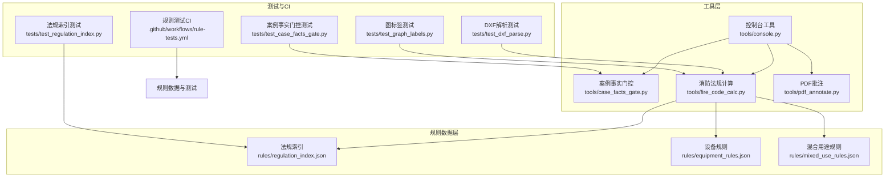
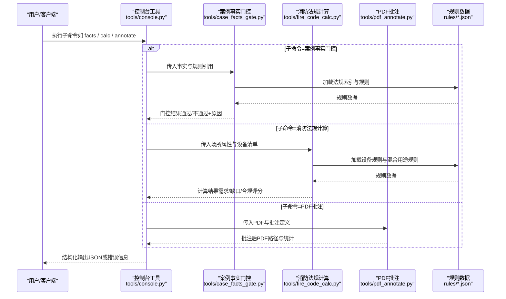
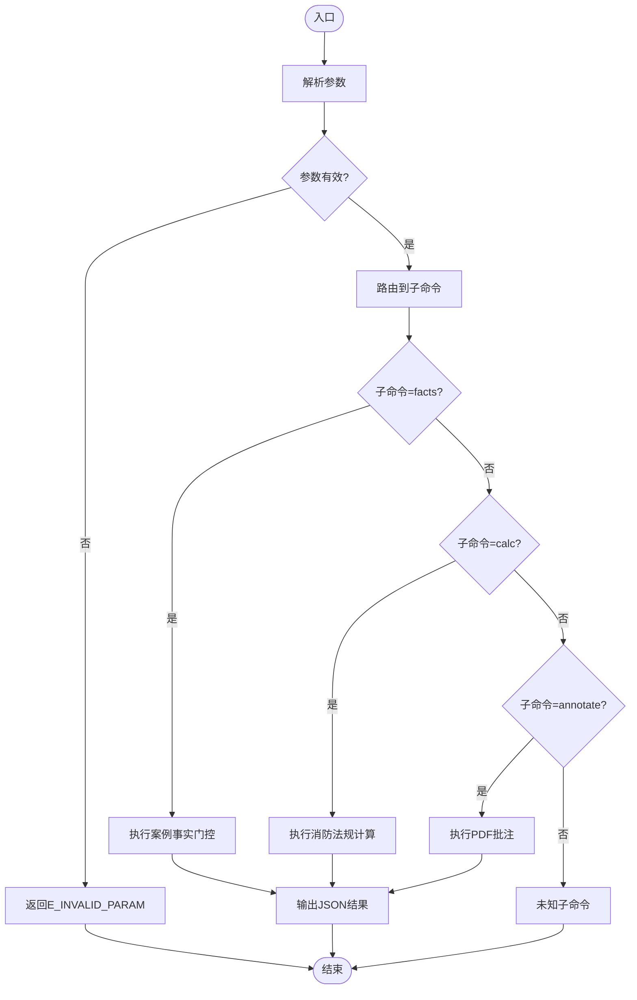
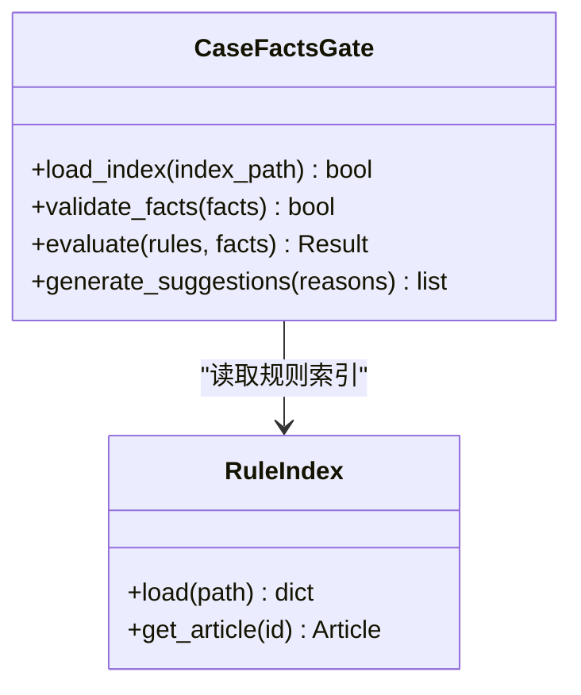
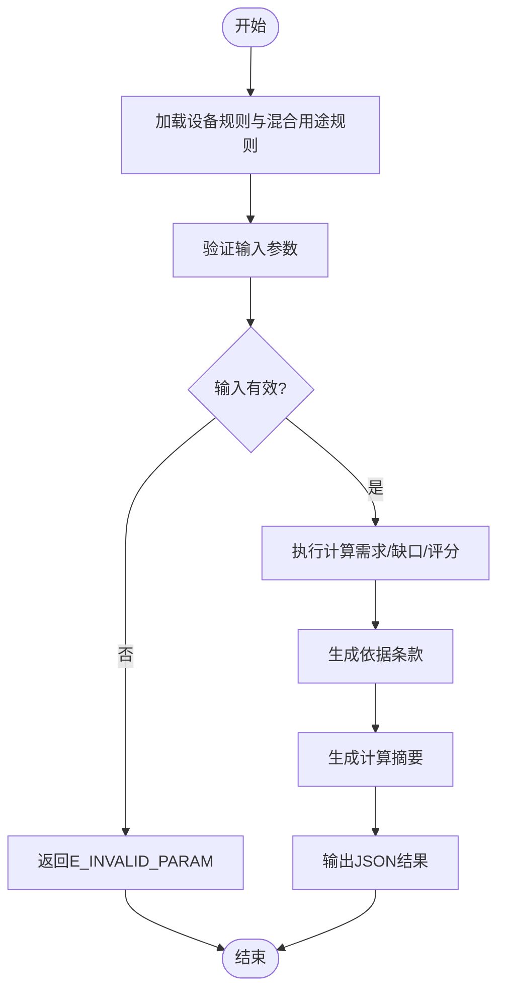
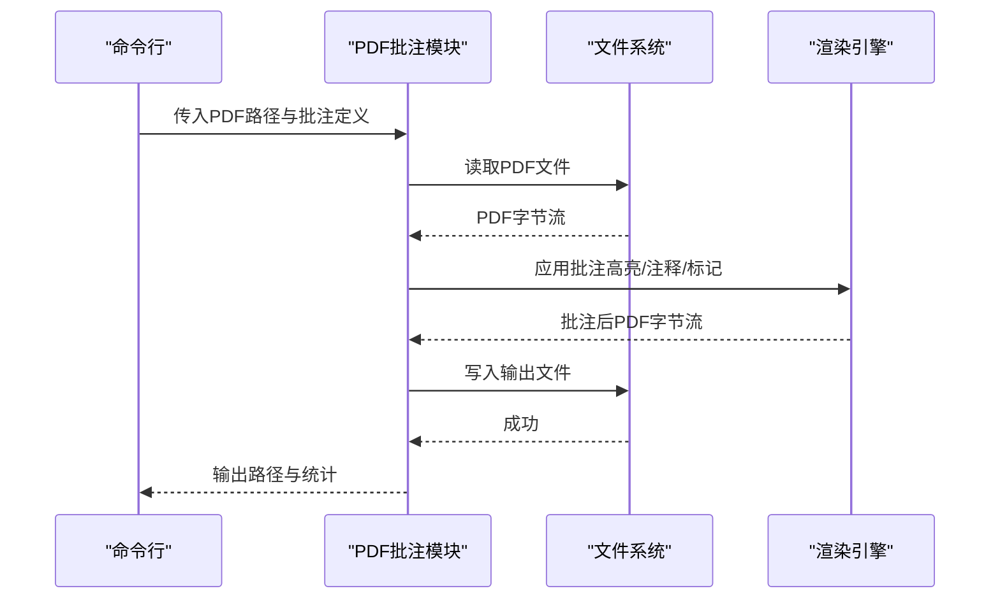
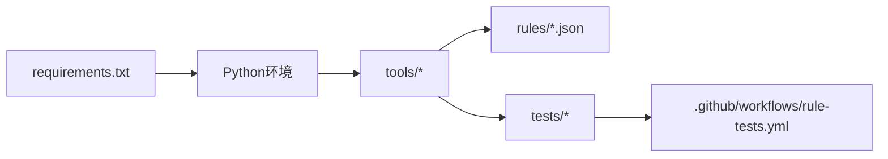

# API参考文档

<cite>
**本文档引用的文件**   
- [tools/console.py](file://tools/console.py)
- [tools/case_facts_gate.py](file://tools/case_facts_gate.py)
- [tools/fire_code_calc.py](file://tools/fire_code_calc.py)
- [tools/pdf_annotate.py](file://tools/pdf_annotate.py)
- [requirements.txt](file://requirements.txt)
- [.github/workflows/rule-tests.yml](file://.github/workflows/rule-tests.yml)
- [rules/regulation_index.json](file://rules/regulation_index.json)
- [rules/equipment_rules.json](file://rules/equipment_rules.json)
- [rules/mixed_use_rules.json](file://rules/mixed_use_rules.json)
- [tests/test_case_facts_gate.py](file://tests/test_case_facts_gate.py)
- [tests/test_dxf_parse.py](file://tests/test_dxf_parse.py)
- [tests/test_graph_labels.py](file://tests/test_graph_labels.py)
- [tests/test_regulation_index.py](file://tests/test_regulation_index.py)
</cite>

## 目录
1. [简介](#简介)
2. [项目结构](#项目结构)
3. [核心组件](#核心组件)
4. [架构总览](#架构总览)
5. [详细组件分析](#详细组件分析)
6. [依赖分析](#依赖分析)
7. [性能考虑](#性能考虑)
8. [故障排查指南](#故障排查指南)
9. [结论](#结论)
10. [附录](#附录)

## 简介
本文件为“绘图审查”项目的API参考文档，聚焦以下公共能力：控制台工具、案例事实门控、消防法规计算与PDF批注。文档提供接口规范（函数签名、参数说明、返回值格式、错误代码）、调用示例、请求响应格式、错误处理策略、认证机制、速率限制、版本兼容性、客户端集成指南与SDK使用说明，以及API测试工具与调试技巧。

## 项目结构
本项目以命令行工具为主，辅以规则数据与测试用例。关键目录与职责如下：
- tools：命令行工具入口与业务逻辑实现（控制台、案例事实门控、消防法规计算、PDF批注等）
- rules：法规条款索引、设备规则、混合用途规则等数据源
- tests：针对各工具的单元测试与集成测试
- .github/workflows：CI/CD流水线配置（含规则测试）
- requirements.txt：Python运行期依赖声明

图表来源
- [tools/console.py](file://tools/console.py)
- [tools/case_facts_gate.py](file://tools/case_facts_gate.py)
- [tools/fire_code_calc.py](file://tools/fire_code_calc.py)
- [tools/pdf_annotate.py](file://tools/pdf_annotate.py)
- [rules/regulation_index.json](file://rules/regulation_index.json)
- [rules/equipment_rules.json](file://rules/equipment_rules.json)
- [rules/mixed_use_rules.json](file://rules/mixed_use_rules.json)
- [tests/test_case_facts_gate.py](file://tests/test_case_facts_gate.py)
- [tests/test_dxf_parse.py](file://tests/test_dxf_parse.py)
- [tests/test_graph_labels.py](file://tests/test_graph_labels.py)
- [tests/test_regulation_index.py](file://tests/test_regulation_index.py)
- [.github/workflows/rule-tests.yml](file://.github/workflows/rule-tests.yml)

章节来源
- [requirements.txt](file://requirements.txt)
- [.github/workflows/rule-tests.yml](file://.github/workflows/rule-tests.yml)

## 核心组件
本节概述四大核心能力的对外接口与行为约定。由于当前仓库以命令行工具形式暴露能力，API以CLI命令与标准输入输出（JSON）为主要契约；如需HTTP或SDK封装，可在上层进行适配。

- 控制台工具（console）
  - 作用：统一入口，聚合子命令（如案例事实门控、消防法规计算、PDF批注等），提供帮助、版本与环境检查能力。
  - 典型用法：通过命令行参数选择子命令并传递必要参数；成功时输出结构化结果（通常为JSON），失败时返回非零退出码并输出错误信息。
  - 错误处理：参数校验失败、资源不可用、运行时异常均会记录错误日志并以明确状态码返回。

- 案例事实门控（case_facts_gate）
  - 作用：基于输入的事实清单与规则约束，判定案例是否满足进入下一阶段的条件。
  - 输入：案例事实集合（JSON或文件路径）、规则集引用（如regulation_index）。
  - 输出：门控结果（通过/不通过）、原因列表、建议修正项。
  - 错误处理：输入缺失字段、规则加载失败、规则冲突等将返回具体错误码与修复指引。

- 消防法规计算（fire_code_calc）
  - 作用：依据设备规则与场所类型，计算所需消防设施配置与合规性。
  - 输入：场所属性（面积、楼层、用途分类等）、设备清单、规则索引。
  - 输出：计算结果（设备需求、缺口、合规评分）、依据条款、计算过程摘要。
  - 错误处理：非法输入、规则缺失、数值越界等将返回错误码与定位信息。

- PDF批注（pdf_annotate）
  - 作用：对PDF文档添加批注（高亮、注释、标记），支持批量处理与结果导出。
  - 输入：PDF路径或流、批注定义（位置、内容、样式）、输出路径。
  - 输出：批注后的PDF路径、批注统计、失败条目明细。
  - 错误处理：文件损坏、权限不足、渲染失败等将返回错误码与重试建议。

章节来源
- [tools/console.py](file://tools/console.py)
- [tools/case_facts_gate.py](file://tools/case_facts_gate.py)
- [tools/fire_code_calc.py](file://tools/fire_code_calc.py)
- [tools/pdf_annotate.py](file://tools/pdf_annotate.py)

## 架构总览
整体采用“工具层 + 规则数据层 + 测试与CI”的分层架构。工具层通过CLI暴露能力，读取规则数据层进行计算与判断，测试结果由CI保障质量与稳定性。

图表来源
- [tools/console.py](file://tools/console.py)
- [tools/case_facts_gate.py](file://tools/case_facts_gate.py)
- [tools/fire_code_calc.py](file://tools/fire_code_calc.py)
- [tools/pdf_annotate.py](file://tools/pdf_annotate.py)
- [rules/regulation_index.json](file://rules/regulation_index.json)
- [rules/equipment_rules.json](file://rules/equipment_rules.json)
- [rules/mixed_use_rules.json](file://rules/mixed_use_rules.json)

## 详细组件分析

### 控制台工具（console）
- 功能边界
  - 子命令路由：facts、calc、annotate等
  - 全局选项：--version、--help、--verbose、--config
  - 输出格式：默认JSON，支持--format text|json
- 参数约定
  - 所有子命令遵循统一的参数命名风格（kebab-case）
  - 必填参数缺失时返回错误码E_INVALID_PARAM
  - 配置文件路径通过--config指定，未指定则使用默认路径
- 返回值约定
  - 成功：退出码0，stdout输出JSON对象，包含status、data、meta
  - 失败：退出码非0，stderr输出错误详情，包含code、message、details
- 错误码
  - E_INVALID_PARAM：参数无效或缺失
  - E_FILE_NOT_FOUND：文件不存在或无权限
  - E_RULE_LOAD_FAIL：规则加载失败
  - E_RUNTIME_ERROR：运行时异常
- 调用示例
  - 列出帮助：console --help
  - 查看版本：console --version
  - 执行案例事实门控：console facts --input facts.json --index rules/regulation_index.json
  - 执行消防法规计算：console calc --place place.json --rules rules/equipment_rules.json
  - 执行PDF批注：console annotate --pdf input.pdf --annotations annotations.json --output out.pdf

图表来源
- [tools/console.py](file://tools/console.py)

章节来源
- [tools/console.py](file://tools/console.py)

### 案例事实门控（case_facts_gate）
- 功能边界
  - 读取案例事实与规则索引，进行条件匹配与门控判定
  - 输出通过/不通过及原因与建议
- 输入结构
  - facts：案例事实对象（字段见下）
  - index_path：规则索引文件路径
- 输出结构
  - status：pass/fail
  - reasons：原因数组
  - suggestions：建议数组
- 错误处理
  - 缺失关键字段返回E_INVALID_PARAM
  - 规则索引加载失败返回E_RULE_LOAD_FAIL
  - 规则冲突返回E_RULE_CONFLICT
- 调用示例
  - 直接调用：python tools/case_facts_gate.py --input facts.json --index rules/regulation_index.json
  - 管道输入：cat facts.json | python tools/case_facts_gate.py --stdin --index rules/regulation_index.json

图表来源
- [tools/case_facts_gate.py](file://tools/case_facts_gate.py)
- [rules/regulation_index.json](file://rules/regulation_index.json)

章节来源
- [tools/case_facts_gate.py](file://tools/case_facts_gate.py)
- [tests/test_case_facts_gate.py](file://tests/test_case_facts_gate.py)

### 消防法规计算（fire_code_calc）
- 功能边界
  - 根据场所属性与设备清单，结合设备规则与混合用途规则，计算设施需求与合规性
- 输入结构
  - place：场所属性（area、floors、use_type等）
  - equipment：设备清单（type、quantity、location等）
  - rules_path：设备规则文件路径
  - mixed_rules_path：混合用途规则文件路径
- 输出结构
  - result：计算结果（required、gap、score）
  - basis：依据条款列表
  - summary：计算摘要
- 错误处理
  - 非法输入返回E_INVALID_PARAM
  - 规则文件缺失或损坏返回E_FILE_NOT_FOUND
  - 数值越界或计算异常返回E_RUNTIME_ERROR
- 调用示例
  - 直接调用：python tools/fire_code_calc.py --place place.json --equipment equipment.json --rules rules/equipment_rules.json --mixed-rules rules/mixed_use_rules.json

图表来源
- [tools/fire_code_calc.py](file://tools/fire_code_calc.py)
- [rules/equipment_rules.json](file://rules/equipment_rules.json)
- [rules/mixed_use_rules.json](file://rules/mixed_use_rules.json)

章节来源
- [tools/fire_code_calc.py](file://tools/fire_code_calc.py)
- [tests/test_dxf_parse.py](file://tests/test_dxf_parse.py)
- [tests/test_graph_labels.py](file://tests/test_graph_labels.py)

### PDF批注（pdf_annotate）
- 功能边界
  - 对PDF文档添加批注（高亮、注释、标记），支持批量与结果导出
- 输入结构
  - pdf_path：PDF文件路径或流
  - annotations：批注定义（page、position、content、style等）
  - output_path：输出PDF路径
- 输出结构
  - status：success/failure
  - output_path：输出文件路径
  - stats：批注统计（总数、成功数、失败数）
  - errors：失败条目明细
- 错误处理
  - 文件损坏或无权限返回E_FILE_NOT_FOUND
  - 批注定义无效返回E_INVALID_PARAM
  - 渲染失败返回E_RUNTIME_ERROR
- 调用示例
  - 直接调用：python tools/pdf_annotate.py --pdf input.pdf --annotations annotations.json --output out.pdf

图表来源
- [tools/pdf_annotate.py](file://tools/pdf_annotate.py)

章节来源
- [tools/pdf_annotate.py](file://tools/pdf_annotate.py)

## 依赖分析
- Python依赖
  - 通过requirements.txt声明运行期依赖，确保环境一致性
- 规则数据依赖
  - regulation_index.json：法规条款索引，供案例事实门控与消防法规计算使用
  - equipment_rules.json：设备规则，供消防法规计算使用
  - mixed_use_rules.json：混合用途规则，供消防法规计算使用
- 测试依赖
  - 各测试文件覆盖核心工具的行为与边界条件

图表来源
- [requirements.txt](file://requirements.txt)
- [rules/regulation_index.json](file://rules/regulation_index.json)
- [rules/equipment_rules.json](file://rules/equipment_rules.json)
- [rules/mixed_use_rules.json](file://rules/mixed_use_rules.json)
- [tests/test_case_facts_gate.py](file://tests/test_case_facts_gate.py)
- [tests/test_dxf_parse.py](file://tests/test_dxf_parse.py)
- [tests/test_graph_labels.py](file://tests/test_graph_labels.py)
- [tests/test_regulation_index.py](file://tests/test_regulation_index.py)
- [.github/workflows/rule-tests.yml](file://.github/workflows/rule-tests.yml)

章节来源
- [requirements.txt](file://requirements.txt)
- [rules/regulation_index.json](file://rules/regulation_index.json)
- [rules/equipment_rules.json](file://rules/equipment_rules.json)
- [rules/mixed_use_rules.json](file://rules/mixed_use_rules.json)
- [.github/workflows/rule-tests.yml](file://.github/workflows/rule-tests.yml)

## 性能考虑
- 规则加载缓存：规则文件较大时建议缓存索引，避免重复I/O
- 批量处理：PDF批注与计算任务支持批量输入，减少进程启动开销
- 内存管理：大PDF与复杂批注场景注意内存峰值，必要时分块处理
- I/O优化：使用异步或并行读取规则与文件，提升吞吐

## 故障排查指南
- 常见问题
  - 参数缺失或格式错误：检查--help与参数校验，确认JSON结构
  - 规则文件缺失或损坏：核对路径与权限，验证JSON有效性
  - 渲染失败：检查PDF完整性与批注坐标合法性
- 调试技巧
  - 启用详细日志：--verbose
  - 使用最小复现用例：精简输入数据定位问题
  - 单元测试回归：运行对应测试文件验证行为

章节来源
- [tests/test_case_facts_gate.py](file://tests/test_case_facts_gate.py)
- [tests/test_dxf_parse.py](file://tests/test_dxf_parse.py)
- [tests/test_graph_labels.py](file://tests/test_graph_labels.py)
- [tests/test_regulation_index.py](file://tests/test_regulation_index.py)

## 结论
本API参考文档围绕控制台工具、案例事实门控、消防法规计算与PDF批注四大核心能力，提供了完整的接口规范、错误处理策略与调用示例。通过分层架构与规则数据驱动，系统具备良好的可扩展性与可维护性。建议在上层封装HTTP或SDK以适配不同客户端场景，并结合CI与测试保障质量。

## 附录
- 认证机制
  - 当前工具以本地CLI为主，未内置认证；如需远程访问，建议在网关层增加鉴权（如JWT、API Key）
- 速率限制
  - 工具层未实现限流；建议在网关或队列层进行限流与排队
- 版本兼容性
  - 通过--version输出工具版本；规则数据变更需保持向后兼容，避免破坏现有调用
- 客户端集成指南
  - 通过子进程调用CLI，捕获stdout/stderr与退出码
  - 使用JSON作为统一交换格式，便于解析与扩展
- SDK使用说明
  - 可将工具模块封装为Python包，提供函数式API与类式API两种风格
- API测试工具
  - 使用pytest运行tests目录下的测试用例，覆盖边界与异常路径
- 调试技巧
  - 启用--verbose输出详细日志
  - 使用最小数据集快速定位问题
  - 结合CI流水线自动化验证