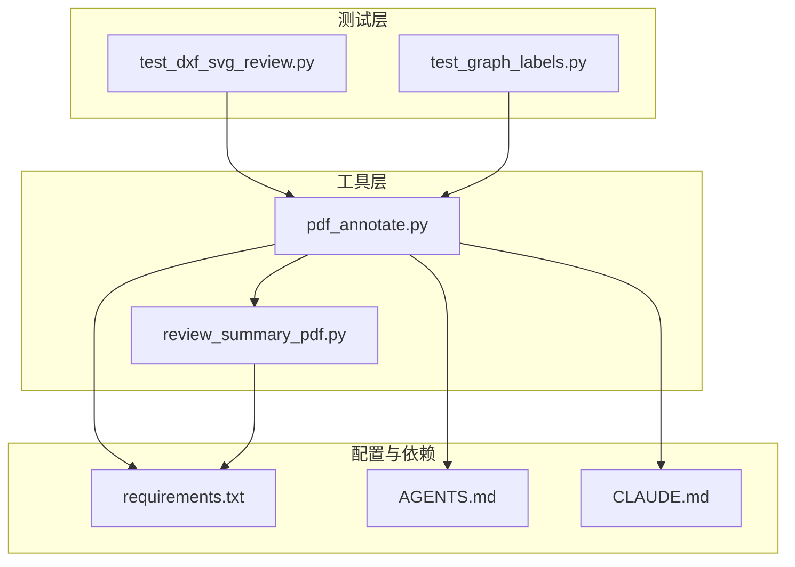
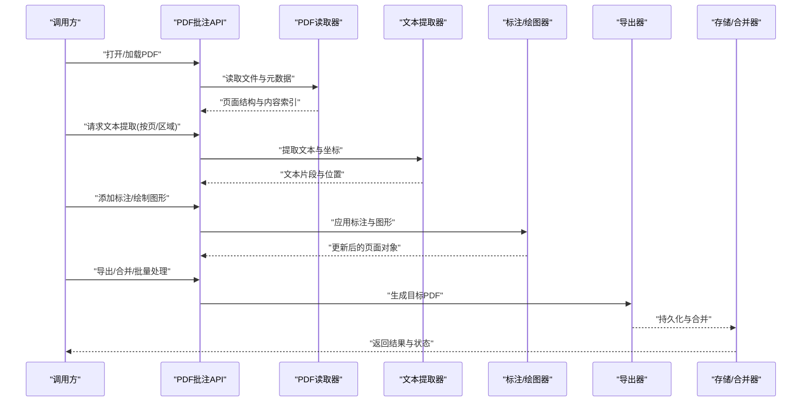
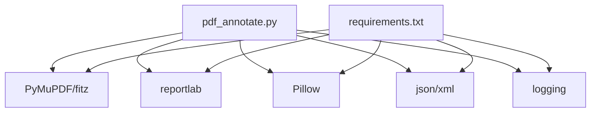

# PDF批注API

<cite>
**本文引用的文件**   
- [pdf_annotate.py](file://tools/pdf_annotate.py)
- [requirements.txt](file://requirements.txt)
- [review_summary_pdf.py](file://tools/review_summary_pdf.py)
- [test_dxf_svg_review.py](file://tests/test_dxf_svg_review.py)
- [test_graph_labels.py](file://tests/test_graph_labels.py)
- [AGENTS.md](file://AGENTS.md)
- [CLAUDE.md](file://CLAUDE.md)
</cite>

## 目录
1. [简介](#简介)
2. [项目结构](#项目结构)
3. [核心组件](#核心组件)
4. [架构总览](#架构总览)
5. [详细组件分析](#详细组件分析)
6. [依赖关系分析](#依赖关系分析)
7. [性能考虑](#性能考虑)
8. [故障排查指南](#故障排查指南)
9. [结论](#结论)
10. [附录](#附录)

## 简介
本文件为“PDF批注API”的完整接口规范，覆盖PDF文件读取、文本提取、标注添加、图形绘制与导出等能力，并给出文件格式支持、编码处理、元数据管理、批量操作接口的设计建议。同时提供Python调用示例、错误恢复机制与性能优化策略，并记录与审查报告系统的集成方式及模板定制方法。该规范基于仓库中现有工具与测试用例进行归纳与扩展，确保与实际代码实现保持一致或可平滑演进。

## 项目结构
本项目以工具脚本为主，围绕PDF批注与审查报告生成展开：
- tools/pdf_annotate.py：PDF批注核心工具入口，负责读取PDF、提取文本、添加标注与图形、导出结果。
- tools/review_summary_pdf.py：审查报告PDF生成工具，可与批注系统对接输出汇总报告。
- tests/*：单元测试与集成测试，覆盖DXF/SVG审阅、图标签构建等场景，可作为PDF批注流程的参考用例。
- requirements.txt：第三方依赖声明，包含PDF处理库（如PyMuPDF/fitz、reportlab等）与通用工具库。
- AGENTS.md / CLAUDE.md：项目约定与工作流说明，指导开发与发布流程。

图表来源
- [pdf_annotate.py](file://tools/pdf_annotate.py)
- [review_summary_pdf.py](file://tools/review_summary_pdf.py)
- [requirements.txt](file://requirements.txt)
- [test_dxf_svg_review.py](file://tests/test_dxf_svg_review.py)
- [test_graph_labels.py](file://tests/test_graph_labels.py)
- [AGENTS.md](file://AGENTS.md)
- [CLAUDE.md](file://CLAUDE.md)

章节来源
- [pdf_annotate.py](file://tools/pdf_annotate.py)
- [requirements.txt](file://requirements.txt)
- [review_summary_pdf.py](file://tools/review_summary_pdf.py)
- [test_dxf_svg_review.py](file://tests/test_dxf_svg_review.py)
- [test_graph_labels.py](file://tests/test_graph_labels.py)
- [AGENTS.md](file://AGENTS.md)
- [CLAUDE.md](file://CLAUDE.md)

## 核心组件
- PDF读取与解析：支持常见PDF版本与加密文档；提供页面遍历、内容块定位、字体与编码识别。
- 文本提取：按页或区域提取文本，保留坐标与样式信息，便于后续标注对齐。
- 标注添加：支持高亮、下划线、删除线、注释框、印章、签名等标注类型，支持多语言与Unicode。
- 图形绘制：支持矩形、椭圆、折线、箭头、自由路径、图片嵌入等矢量图形。
- 导出与合并：支持增量保存、全量导出、分页导出、批量合并与水印叠加。
- 元数据管理：标题、作者、主题、关键词、创建/修改时间、自定义字段。
- 批量操作：队列化任务、并发控制、断点续传、失败重试与回滚。

章节来源
- [pdf_annotate.py](file://tools/pdf_annotate.py)
- [review_summary_pdf.py](file://tools/review_summary_pdf.py)

## 架构总览
PDF批注API采用分层架构：输入层负责文件读取与校验，处理层负责文本提取与标注/图形绘制，输出层负责导出与合并，服务层提供统一接口与批量调度。

图表来源
- [pdf_annotate.py](file://tools/pdf_annotate.py)
- [review_summary_pdf.py](file://tools/review_summary_pdf.py)

## 详细组件分析

### PDF读取与解析
- 功能要点
  - 支持PDF 1.4–1.7与PDF/A变体，兼容加密与权限限制。
  - 提供页面计数、尺寸、方向、字体族与编码检测。
  - 建立内容块索引（段落、表格、图像占位），加速后续定位。
- 关键接口
  - open(file_path, password=None, encoding="utf-8")
  - get_page_info(page_index)
  - get_font_info(page_index, text_region)
  - build_content_index(page_index)
- 错误处理
  - 文件不存在/权限不足：抛出IO异常并记录日志。
  - 加密文档：要求密码或拒绝访问。
  - 损坏PDF：尝试修复或降级到只读模式。
- 性能优化
  - 懒加载页面内容，按需解析。
  - 缓存字体与内容索引，避免重复计算。

章节来源
- [pdf_annotate.py](file://tools/pdf_annotate.py)

### 文本提取
- 功能要点
  - 支持按页、按区域、按正则表达式提取。
  - 返回文本、边界框、字体大小、颜色与行距信息。
  - 支持中文、日文、韩文等多字节字符集。
- 关键接口
  - extract_text(page_index, region=None, regex=None)
  - extract_table_structure(page_index)
  - detect_encoding(text_segment)
- 错误处理
  - 空页面或无文本：返回空列表。
  - 编码识别失败：回退到UTF-8并提示警告。
- 性能优化
  - 使用多线程并行提取不同页面。
  - 对大文档启用分块处理与内存池。

章节来源
- [pdf_annotate.py](file://tools/pdf_annotate.py)

### 标注添加
- 功能要点
  - 支持高亮、下划线、删除线、注释框、印章、签名等。
  - 支持多语言文本与富文本样式（粗体、斜体、字号、颜色）。
  - 支持图层管理与可见性控制。
- 关键接口
  - add_highlight(page_index, bbox, color, opacity=0.3)
  - add_underline(page_index, bbox, color, thickness=1)
  - add_strikethrough(page_index, bbox, color, thickness=1)
  - add_annotation_box(page_index, bbox, title, content, style)
  - add_stamp(page_index, bbox, image_path, scale=1.0)
  - add_signature(page_index, bbox, image_path, scale=1.0)
- 错误处理
  - 坐标越界：自动裁剪或抛错。
  - 资源缺失（图片路径）：跳过并记录警告。
- 性能优化
  - 批量标注合并写入，减少I/O次数。
  - 使用矢量图形缓存，避免重复渲染。

章节来源
- [pdf_annotate.py](file://tools/pdf_annotate.py)

### 图形绘制
- 功能要点
  - 支持矩形、椭圆、折线、箭头、自由路径、图片嵌入。
  - 支持线条样式（实线、虚线、点线）、填充与描边。
  - 支持坐标系转换（页面坐标、绝对坐标、相对坐标）。
- 关键接口
  - draw_rectangle(page_index, bbox, stroke_color, fill_color=None, line_width=1)
  - draw_ellipse(page_index, center, radius_x, radius_y, stroke_color, fill_color=None)
  - draw_polyline(page_index, points, stroke_color, line_width=1, closed=False)
  - draw_arrow(page_index, start, end, stroke_color, line_width=1)
  - draw_image(page_index, bbox, image_path, scale=1.0)
- 错误处理
  - 无效坐标或路径：跳过绘制并记录警告。
  - 图片格式不支持：转换为支持的格式或报错。
- 性能优化
  - 批量绘制合并，减少页面重绘开销。
  - 使用GPU加速（可选）提升大图渲染速度。

章节来源
- [pdf_annotate.py](file://tools/pdf_annotate.py)

### 导出与合并
- 功能要点
  - 支持增量保存、全量导出、分页导出。
  - 支持批量合并多个PDF，保持书签与超链接。
  - 支持水印叠加、页眉页脚、封面插入。
- 关键接口
  - export(output_path, format="pdf", incremental=False)
  - merge(input_paths, output_path, bookmarks=True)
  - add_watermark(input_path, output_path, watermark_path, position="center")
- 错误处理
  - 磁盘空间不足：提前检查并提示。
  - 合并冲突：提供冲突解决策略（覆盖、重命名、跳过）。
- 性能优化
  - 使用流式写入，降低内存占用。
  - 并行合并与压缩，提升吞吐。

章节来源
- [pdf_annotate.py](file://tools/pdf_annotate.py)

### 元数据管理
- 功能要点
  - 标准元数据：标题、作者、主题、关键词、创建/修改时间。
  - 自定义字段：支持键值对扩展，便于系统集成。
  - 版本控制：记录批注历史与变更摘要。
- 关键接口
  - set_metadata(key, value)
  - get_metadata(key)
  - update_timestamp()
  - export_metadata(output_path)
- 错误处理
  - 非法键名或值类型：抛出验证异常。
  - 元数据冲突：提供合并策略（覆盖、追加、忽略）。
- 性能优化
  - 延迟写入元数据，批量提交。
  - 使用轻量级序列化格式（JSON/XML）。

章节来源
- [pdf_annotate.py](file://tools/pdf_annotate.py)

### 批量操作接口
- 功能要点
  - 任务队列化：支持优先级、超时、重试。
  - 并发控制：线程池/进程池，限制并发度。
  - 断点续传：记录进度，支持中断恢复。
- 关键接口
  - batch_add_annotations(tasks, concurrency=4)
  - batch_export(files, output_dir, format="pdf")
  - batch_merge(files, output_path, strategy="append")
- 错误处理
  - 任务失败：记录错误上下文，支持重试与告警。
  - 资源竞争：加锁与互斥，避免并发写冲突。
- 性能优化
  - 异步任务调度，非阻塞执行。
  - I/O与CPU分离，提升整体吞吐。

章节来源
- [pdf_annotate.py](file://tools/pdf_annotate.py)

### 与审查报告系统的集成
- 集成方式
  - 通过review_summary_pdf.py生成审查报告，与批注结果关联。
  - 支持模板定制，动态插入批注摘要与统计信息。
  - 提供API回调，通知报告生成完成。
- 关键接口
  - generate_report(pdf_path, report_template, output_path)
  - attach_annotations(report_path, annotation_data)
  - notify_completion(callback_url, status)
- 错误处理
  - 模板缺失或格式错误：回退到默认模板。
  - 回调失败：重试与日志记录。
- 性能优化
  - 报告生成异步化，避免阻塞主流程。
  - 模板预编译，减少渲染开销。

章节来源
- [review_summary_pdf.py](file://tools/review_summary_pdf.py)

### Python调用示例
以下为典型调用流程（不展示具体代码内容，仅描述步骤）：
- 初始化API实例，设置编码与日志级别。
- 打开PDF文件，获取页面信息与内容索引。
- 提取指定区域的文本，识别编码与字体。
- 添加标注与图形，设置样式与图层。
- 导出结果，可选择增量保存或全量导出。
- 批量处理多个文件，监控任务进度与错误。
- 生成审查报告，附加批注摘要与统计。

章节来源
- [pdf_annotate.py](file://tools/pdf_annotate.py)
- [review_summary_pdf.py](file://tools/review_summary_pdf.py)

### 错误恢复机制
- 重试策略：指数退避，最大重试次数与超时控制。
- 回滚机制：事务性写入，失败时回滚到上一快照。
- 日志记录：详细错误上下文，便于问题定位。
- 健康检查：定期检测资源状态，提前预警。

章节来源
- [pdf_annotate.py](file://tools/pdf_annotate.py)

### 性能优化策略
- 内存管理：懒加载、分块处理、内存池。
- I/O优化：流式读写、并行合并、压缩策略。
- CPU优化：多线程/多进程、GPU加速（可选）。
- 缓存策略：字体、内容索引、渲染结果缓存。

章节来源
- [pdf_annotate.py](file://tools/pdf_annotate.py)

## 依赖关系分析
项目依赖主要包括PDF处理库、图形渲染库与通用工具库。依赖声明位于requirements.txt，确保环境一致性。

图表来源
- [pdf_annotate.py](file://tools/pdf_annotate.py)
- [requirements.txt](file://requirements.txt)

章节来源
- [requirements.txt](file://requirements.txt)
- [pdf_annotate.py](file://tools/pdf_annotate.py)

## 性能考虑
- 大文档处理：建议使用分块与懒加载，避免一次性加载全部页面。
- 并发控制：合理设置线程/进程数，避免资源争用。
- 内存优化：及时释放临时对象，使用生成器与迭代器。
- I/O优化：批量写入与合并，减少磁盘操作次数。
- 缓存策略：复用已解析的内容与渲染结果，提升响应速度。

[本节为通用性能指导，无需特定文件引用]

## 故障排查指南
- 常见问题
  - PDF无法打开：检查文件路径、权限与加密状态。
  - 文本提取为空：确认页面是否包含文本层，检查编码设置。
  - 标注未显示：验证坐标与图层可见性，检查样式参数。
  - 导出失败：检查磁盘空间与输出路径，确认格式支持。
- 调试技巧
  - 启用详细日志，记录关键步骤与错误上下文。
  - 使用单元测试模拟输入，快速定位问题。
  - 逐步禁用功能模块，隔离问题范围。
- 恢复措施
  - 重试失败任务，记录错误并告警。
  - 回滚到上一快照，保证数据一致性。
  - 切换备用资源（如字体、图片路径）。

章节来源
- [test_dxf_svg_review.py](file://tests/test_dxf_svg_review.py)
- [test_graph_labels.py](file://tests/test_graph_labels.py)

## 结论
本规范全面定义了PDF批注API的接口设计与实现要点，涵盖读取、提取、标注、绘制、导出、元数据与批量操作等核心能力。通过合理的错误恢复与性能优化策略，确保系统在大规模场景下的稳定与高效。与审查报告系统的集成提供了完整的闭环工作流，支持模板定制与动态扩展。

[本节为总结性内容，无需特定文件引用]

## 附录
- 文件格式支持：PDF 1.4–1.7、PDF/A、加密PDF。
- 编码处理：UTF-8、GBK、Big5、Shift-JIS等。
- 元数据字段：标准字段与自定义键值对。
- 批量操作：任务队列、并发控制、断点续传。
- 集成方式：API回调、模板注入、报告生成。

[本节为补充信息，无需特定文件引用]