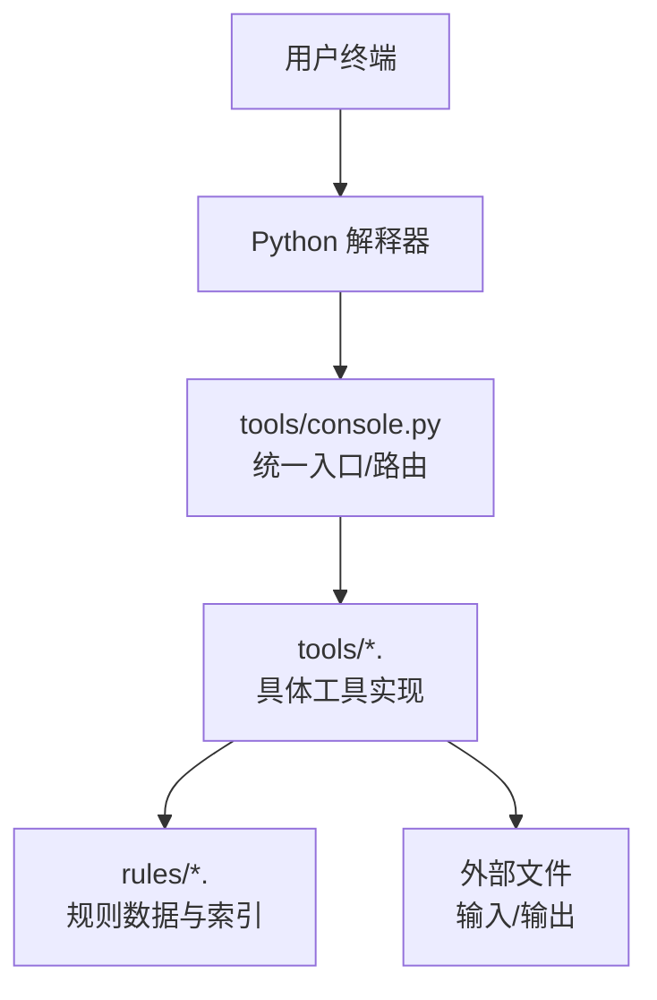
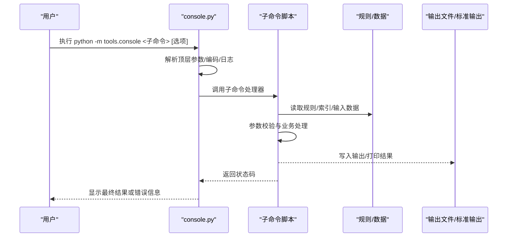
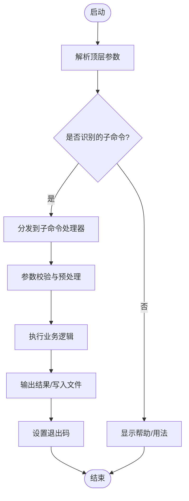
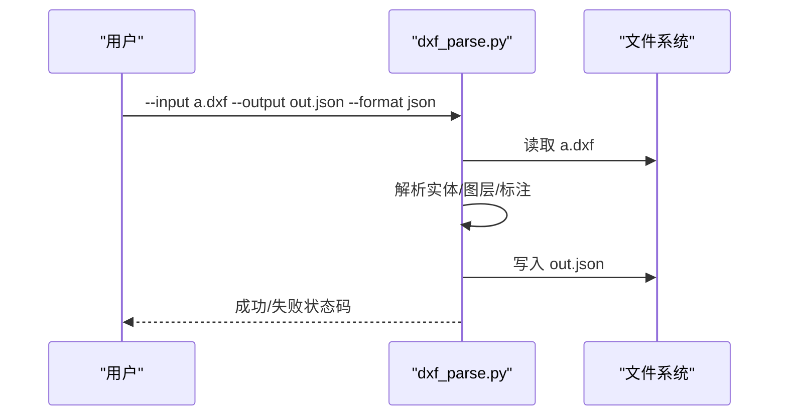
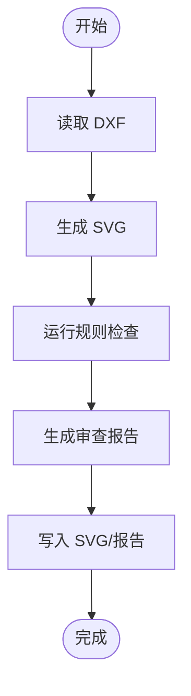
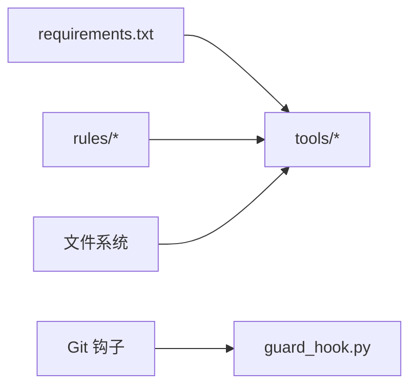

# 控制台工具API

<cite>
**本文引用的文件**   
- [tools/console.py](file://tools/console.py)
- [tools/dwg_guide.py](file://tools/dwg_guide.py)
- [tools/dxf_parse.py](file://tools/dxf_parse.py)
- [tools/dxf_svg_review.py](file://tools/dxf_svg_review.py)
- [tools/graph_labels.py](file://tools/graph_labels.py)
- [tools/graph_status.py](file://tools/graph_status.py)
- [tools/regulation_graph.py](file://tools/regulation_graph.py)
- [tools/regulation_graph_build.py](file://tools/regulation_graph_build.py)
- [tools/regulation_index.py](file://tools/regulation_index.py)
- [tools/review_checklist_xlsx.py](file://tools/review_checklist_xlsx.py)
- [tools/stage_report_xlsx.py](file://tools/stage_report_xlsx.py)
- [tools/standard_checklist_html.py](file://tools/standard_checklist_html.py)
- [tools/training_intake.py](file://tools/training_intake.py)
- [tools/update_guard.py](file://tools/update_guard.py)
- [tools/case_facts_gate.py](file://tools/case_facts_gate.py)
- [tools/article_checklist.py](file://tools/article_checklist.py)
- [tools/checklist_html.py](file://tools/checklist_html.py)
- [tools/fire_code_calc.py](file://tools/fire_code_calc.py)
- [tools/guard_hook.py](file://tools/guard_hook.py)
- [tools/make_sfx.py](file://tools/make_sfx.py)
- [tools/mixed_use_report.py](file://tools/mixed_use_report.py)
- [tools/pdf_annotate.py](file://tools/pdf_annotate.py)
- [tools/pending_review.py](file://tools/pending_review.py)
- [tools/practice_note_engine.py](file://tools/practice_note_engine.py)
- [tools/setup.sh](file://tools/setup.sh)
- [requirements.txt](file://requirements.txt)
</cite>

## 目录
1. [简介](#简介)
2. [项目结构](#项目结构)
3. [核心组件](#核心组件)
4. [架构总览](#架构总览)
5. [详细组件分析](#详细组件分析)
6. [依赖分析](#依赖分析)
7. [性能考虑](#性能考虑)
8. [故障排查指南](#故障排查指南)
9. [结论](#结论)
10. [附录](#附录)

## 简介
本文件为“绘图审查”项目的控制台工具API文档，聚焦于命令行接口、参数解析、输出格式与错误处理机制。内容覆盖所有可用的命令行选项、环境变量配置与脚本调用方式，并提供基本操作、批量处理与高级功能的使用示例。同时记录扩展点与自定义命令开发指南，帮助开发者快速集成新能力。

## 项目结构
本项目采用“按功能模块组织”的结构，控制台工具集中在 tools 目录下，每个工具以独立脚本形式提供 CLI 入口。常见子目录与文件：
- tools: 所有命令行工具的源码与安装脚本
- rules: 规则数据与索引（供部分工具读取）
- tests: 针对各工具的测试用例
- requirements.txt: Python 依赖清单
- packaging: 打包相关配置

图表来源
- [tools/console.py](file://tools/console.py)
- [tools/dxf_parse.py](file://tools/dxf_parse.py)
- [tools/regulation_index.py](file://tools/regulation_index.py)

章节来源
- [tools/console.py](file://tools/console.py)
- [requirements.txt](file://requirements.txt)

## 核心组件
- 统一入口与路由
  - console.py 作为控制台工具的统一入口，负责解析顶层命令、分发到具体子命令，并统一处理日志、编码与错误信息。
- 具体工具实现
  - 每个工具脚本提供独立的子命令与参数集，遵循一致的 CLI 约定（如 --input/--output/--verbose 等）。
- 规则与数据访问
  - regulation_index.py 等提供规则索引与数据加载能力，供图形构建、报告生成等工具使用。
- 安装与环境初始化
  - setup.sh 提供环境准备与依赖安装流程；requirements.txt 声明 Python 依赖。

章节来源
- [tools/console.py](file://tools/console.py)
- [tools/regulation_index.py](file://tools/regulation_index.py)
- [tools/setup.sh](file://tools/setup.sh)
- [requirements.txt](file://requirements.txt)

## 架构总览
控制台工具采用“入口路由 + 插件式子命令”的架构。顶层命令由 console.py 解析并转发至对应子命令；子命令内部完成参数校验、业务逻辑执行与结果输出。错误通过统一的异常与退出码返回，便于上层编排与自动化。

图表来源
- [tools/console.py](file://tools/console.py)
- [tools/dxf_parse.py](file://tools/dxf_parse.py)
- [tools/regulation_index.py](file://tools/regulation_index.py)

## 详细组件分析

### 统一入口 console.py
- 职责
  - 解析顶层参数（如 --help、--version、--log-level、--encoding 等）
  - 将子命令分发到对应的处理器函数
  - 统一捕获异常，设置退出码，格式化错误输出
- 关键行为
  - 支持子命令注册与动态导入
  - 对 I/O 进行编码控制，避免 Windows 控制台乱码
  - 提供通用参数模板（如 --input, --output, --dry-run, --verbose）

图表来源
- [tools/console.py](file://tools/console.py)

章节来源
- [tools/console.py](file://tools/console.py)

### DXF 解析 dxf_parse.py
- 用途
  - 从 DXF 文件中提取图层、实体、尺寸标注等信息，输出结构化数据（JSON/CSV）
- 常用选项
  - --input/-i: 输入 DXF 路径
  - --output/-o: 输出文件路径
  - --format/-f: 输出格式（json/csv）
  - --layers/-l: 过滤图层名
  - --entities/-e: 过滤实体类型
  - --verbose/-v: 详细日志
- 输出
  - JSON: 包含图层列表、实体清单、统计摘要
  - CSV: 扁平化表格，适合 Excel 打开
- 错误处理
  - 文件不存在、权限不足、DXF 损坏时返回非零退出码并输出错误原因

图表来源
- [tools/dxf_parse.py](file://tools/dxf_parse.py)

章节来源
- [tools/dxf_parse.py](file://tools/dxf_parse.py)

### DXF SVG 审查 dxf_svg_review.py
- 用途
  - 基于 DXF 数据生成 SVG 可视化，并进行简单规则检查（如图层命名规范、缺失标注等）
- 常用选项
  - --input/-i: 输入 DXF 路径
  - --svg-out/-s: 输出 SVG 路径
  - --report-out/-r: 输出审查报告（JSON/HTML）
  - --rules/-u: 规则配置文件路径
  - --strict: 严格模式（遇到错误即中止）
- 输出
  - SVG: 可浏览的图纸概览
  - 报告: 问题清单与建议修复项
- 错误处理
  - 规则冲突、SVG 渲染失败、报告写入失败均会记录并返回错误码

图表来源
- [tools/dxf_svg_review.py](file://tools/dxf_svg_review.py)

章节来源
- [tools/dxf_svg_review.py](file://tools/dxf_svg_review.py)

### DWG 导览 dwg_guide.py
- 用途
  - 提供 DWG 文件的导览与元数据展示，辅助快速定位图纸信息与版本
- 常用选项
  - --input/-i: 输入 DWG 路径
  - --meta-out/-m: 输出元数据 JSON
  - --summary: 仅输出摘要
- 输出
  - 元数据 JSON: 包含作者、创建时间、图层数、实体计数等
- 错误处理
  - 不支持的 DWG 版本、文件损坏时给出明确错误提示

章节来源
- [tools/dwg_guide.py](file://tools/dwg_guide.py)

### 图标签 graph_labels.py
- 用途
  - 为审查图节点生成可读标签，便于可视化与检索
- 常用选项
  - --input/-i: 输入图数据（JSON）
  - --output/-o: 输出带标签的图数据
  - --template/-t: 标签模板（字符串）
- 输出
  - 增强后的图数据（含 label 字段）

章节来源
- [tools/graph_labels.py](file://tools/graph_labels.py)

### 图状态 graph_status.py
- 用途
  - 计算并输出图的状态统计（如待审、通过、拒绝数量）
- 常用选项
  - --input/-i: 输入图数据
  - --output/-o: 输出状态汇总
- 输出
  - 状态统计表（JSON/CSV）

章节来源
- [tools/graph_status.py](file://tools/graph_status.py)

### 法规图 regulation_graph.py / regulation_graph_build.py
- 用途
  - 构建法规关系图，支持查询、导出与增量更新
- 常用选项
  - --build: 构建图
  - --query/-q: 查询条件（JSON）
  - --output/-o: 输出路径
  - --index-dir/-d: 索引目录
- 输出
  - 图数据（JSON）、查询结果（JSON/CSV）

章节来源
- [tools/regulation_graph.py](file://tools/regulation_graph.py)
- [tools/regulation_graph_build.py](file://tools/regulation_graph_build.py)

### 法规索引 regulation_index.py
- 用途
  - 维护法规条目索引，支持增删改查与一致性校验
- 常用选项
  - --add/-a: 添加条目
  - --remove/-r: 删除条目
  - --validate/-v: 校验索引完整性
  - --output/-o: 输出索引文件

章节来源
- [tools/regulation_index.py](file://tools/regulation_index.py)

### 审查清单 review_checklist_xlsx.py
- 用途
  - 生成审查清单 Excel 文件，支持多阶段与多角色
- 常用选项
  - --input/-i: 输入清单源数据（JSON/CSV）
  - --output/-o: 输出 Excel 路径
  - --stage/-s: 指定阶段
  - --role/-ro: 指定角色
- 输出
  - Excel 清单（多工作表）

章节来源
- [tools/review_checklist_xlsx.py](file://tools/review_checklist_xlsx.py)

### 阶段报告 stage_report_xlsx.py
- 用途
  - 生成阶段报告 Excel，汇总进度、问题与结论
- 常用选项
  - --input/-i: 输入阶段数据
  - --output/-o: 输出 Excel
  - --format/-f: 报告模板

章节来源
- [tools/stage_report_xlsx.py](file://tools/stage_report_xlsx.py)

### 标准清单 standard_checklist_html.py
- 用途
  - 将标准清单转换为 HTML 页面，便于在线查看与分享
- 常用选项
  - --input/-i: 输入清单数据
  - --output/-o: 输出 HTML 路径
  - --theme/-t: 主题样式

章节来源
- [tools/standard_checklist_html.py](file://tools/standard_checklist_html.py)

### 训练入库 training_intake.py
- 用途
  - 将训练数据入库，生成索引与预览
- 常用选项
  - --input/-i: 输入训练数据
  - --output/-o: 输出索引/预览
  - --mode/-m: 入库模式（增量/全量）

章节来源
- [tools/training_intake.py](file://tools/training_intake.py)

### 守卫钩子 update_guard.py / guard_hook.py
- 用途
  - 管理 Git 钩子与更新守卫，确保提交前检查与依赖更新
- 常用选项
  - --install/-i: 安装钩子
  - --uninstall/-u: 卸载钩子
  - --check/-c: 预检

章节来源
- [tools/update_guard.py](file://tools/update_guard.py)
- [tools/guard_hook.py](file://tools/guard_hook.py)

### 案例事实门 case_facts_gate.py
- 用途
  - 校验案例事实与规则的一致性，输出差异报告
- 常用选项
  - --input/-i: 输入案例事实
  - --rules/-r: 规则集路径
  - --output/-o: 输出报告

章节来源
- [tools/case_facts_gate.py](file://tools/case_facts_gate.py)

### 条款清单 article_checklist.py / checklist_html.py
- 用途
  - 生成条款清单与 HTML 视图
- 常用选项
  - --input/-i: 输入条款数据
  - --output/-o: 输出清单/HTML
  - --filter/-f: 过滤条件

章节来源
- [tools/article_checklist.py](file://tools/article_checklist.py)
- [tools/checklist_html.py](file://tools/checklist_html.py)

### 消防规范计算 fire_code_calc.py
- 用途
  - 根据消防规范计算面积、容量等指标
- 常用选项
  - --input/-i: 输入参数（JSON）
  - --output/-o: 输出计算结果
  - --norm/-n: 规范版本

章节来源
- [tools/fire_code_calc.py](file://tools/fire_code_calc.py)

### PDF 批注 pdf_annotate.py
- 用途
  - 在 PDF 上添加批注与高亮，便于审查协作
- 常用选项
  - --input/-i: 输入 PDF
  - --annotations/-a: 批注定义（JSON）
  - --output/-o: 输出 PDF

章节来源
- [tools/pdf_annotate.py](file://tools/pdf_annotate.py)

### 待定审查 pending_review.py
- 用途
  - 汇总待定审查项，生成任务清单
- 常用选项
  - --input/-i: 输入审查数据
  - --output/-o: 输出清单
  - --assignee/-as: 指定负责人

章节来源
- [tools/pending_review.py](file://tools/pending_review.py)

### 实践笔记引擎 practice_note_engine.py
- 用途
  - 解析与生成实践笔记，支持模板与变量替换
- 常用选项
  - --input/-i: 输入笔记源
  - --template/-t: 模板路径
  - --output/-o: 输出笔记

章节来源
- [tools/practice_note_engine.py](file://tools/practice_note_engine.py)

### 混合用途报告 mixed_use_report.py
- 用途
  - 生成混合用途建筑审查报告
- 常用选项
  - --input/-i: 输入数据
  - --output/-o: 输出报告（PDF/HTML）
  - --section/-s: 指定章节

章节来源
- [tools/mixed_use_report.py](file://tools/mixed_use_report.py)

### SFX 打包 make_sfx.py
- 用途
  - 生成自解压安装包（SFX），用于分发工具包
- 常用选项
  - --src/-s: 源目录
  - --dest/-d: 目标 SFX 路径
  - --config/-c: 打包配置

章节来源
- [tools/make_sfx.py](file://tools/make_sfx.py)

## 依赖分析
- Python 依赖
  - 通过 requirements.txt 统一管理第三方库，如 PDF 处理、Excel 生成、DXF/SVG 解析等
- 规则与数据
  - rules 目录下的 JSON 文件被多个工具读取，保证一致性与可追溯性
- 外部系统
  - Git 钩子（guard_hook.py）与文件系统交互
  - 可选的外部渲染服务（如 SVG/PDF 生成）

图表来源
- [requirements.txt](file://requirements.txt)
- [tools/guard_hook.py](file://tools/guard_hook.py)

章节来源
- [requirements.txt](file://requirements.txt)
- [tools/guard_hook.py](file://tools/guard_hook.py)

## 性能考虑
- 大文件处理
  - DXF/PDF 解析建议启用流式读取与分块处理，避免内存峰值过高
- 并行与缓存
  - 批量处理时可启用并发（如多文件解析），并对规则索引建立缓存
- 输出优化
  - 选择合适的数据格式（JSON/CSV/Excel）以减少转换开销
- 资源限制
  - 对 SVG/PDF 生成设置超时与重试策略，防止阻塞

## 故障排查指南
- 常见问题
  - 编码错误：Windows 控制台默认编码可能导致乱码，建议在入口设置正确的编码参数
  - 权限不足：输出目录无写权限会导致写入失败，需检查路径与权限
  - 规则不一致：规则索引与数据不匹配时，先执行索引校验与重建
  - 依赖缺失：安装依赖后仍报错，检查 Python 版本与平台兼容性
- 诊断步骤
  - 启用详细日志（--verbose）
  - 最小化复现：使用小样本数据验证流程
  - 检查退出码：非零表示失败，结合日志定位错误位置
- 恢复措施
  - 清理临时文件与缓存
  - 重新生成索引与中间产物
  - 回滚到上一稳定版本

## 结论
控制台工具以统一入口与插件式子命令为核心，提供一致的 CLI 体验与强大的数据处理能力。通过清晰的参数约定、稳定的输出格式与完善的错误处理，能够满足日常审查、批量处理与自动化编排需求。开发者可基于现有扩展点快速集成新工具，保持体系的一致性与可维护性。

## 附录

### 命令行选项总览（通用）
- 顶层参数
  - --help/-h: 显示帮助
  - --version/-V: 显示版本
  - --log-level/-L: 日志级别（debug/info/warning/error）
  - --encoding/-E: 控制台编码（utf-8/gbk）
- 通用子命令参数
  - --input/-i: 输入路径或 URL
  - --output/-o: 输出路径
  - --format/-f: 输出格式（json/csv/xlsx/html/pdf/svg）
  - --dry-run/-n: 仅模拟执行
  - --verbose/-v: 详细日志
  - --quiet/-q: 静默模式
  - --strict/-s: 严格模式（遇错即停）
  - --timeout/-T: 超时秒数
  - --retry/-R: 重试次数

### 环境变量配置
- LOG_LEVEL: 全局日志级别
- DEFAULT_ENCODING: 默认控制台编码
- RULE_INDEX_DIR: 规则索引目录
- OUTPUT_DIR: 默认输出目录
- TIMEOUT_SECONDS: 默认超时时间
- RETRY_COUNT: 默认重试次数

### 脚本调用方式
- 直接调用
  - python tools/<tool>.py <子命令> [选项]
- 模块调用
  - python -m tools.console <子命令> [选项]
- 管道与重定向
  - 支持标准输入/输出，便于与其他工具组合

### 使用示例
- 基本操作
  - 解析 DXF 并输出 JSON
    - python -m tools.console dxf-parse --input drawing.dxf --output result.json --format json
  - 生成审查清单 Excel
    - python -m tools.console review-checklist-xlsx --input data.json --output checklist.xlsx --stage 一阶段
- 批量处理
  - 遍历目录解析多个 DXF
    - for f in input/*.dxf; do python -m tools.console dxf-parse --input "$f" --output "out/$(basename $f .dxf).json"; done
  - 并发生成 SVG 与报告
    - xargs -I{} python -m tools.console dxf-svg-review --input {} --svg-out svg/{}.svg --report-out report/{}.json < filelist.txt
- 高级功能
  - 构建法规图并查询
    - python -m tools.console regulation-graph-build --index-dir rules/index
    - python -m tools.console regulation-graph --query '{"term":"防火分区"}' --output query.json
  - 自定义标签模板
    - python -m tools.console graph-labels --input graph.json --template "{name}({id})" --output labeled.json

### 扩展点与自定义命令开发指南
- 新增子命令
  - 在入口中注册新的子命令处理器
  - 实现参数解析、业务逻辑与输出
  - 遵循统一的错误处理与退出码约定
- 数据模型
  - 定义输入/输出的 JSON Schema，确保一致性
  - 提供样例数据与测试用例
- 规则与配置
  - 将可变逻辑抽取为规则文件或配置项
  - 支持热更新与版本管理
- 测试与发布
  - 编写单元测试与集成测试
  - 使用打包工具生成可分发包