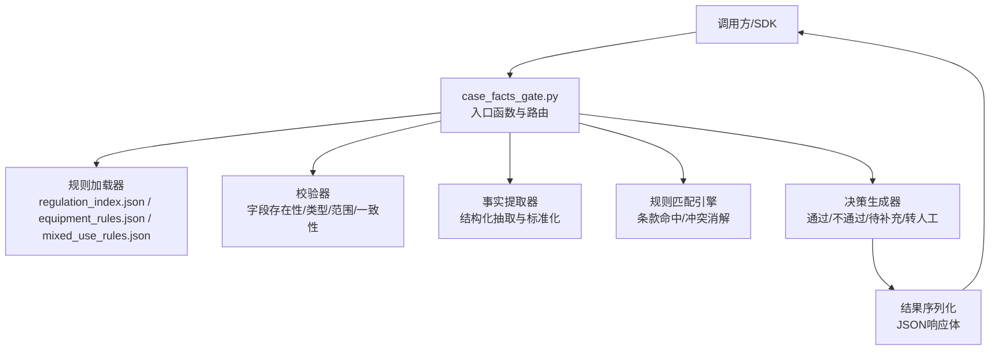
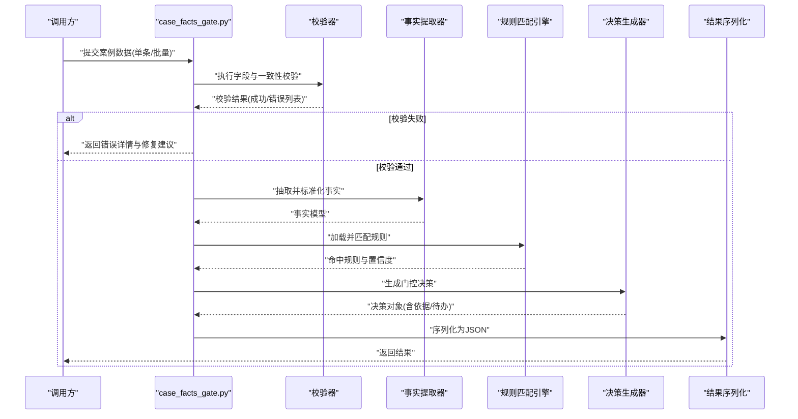
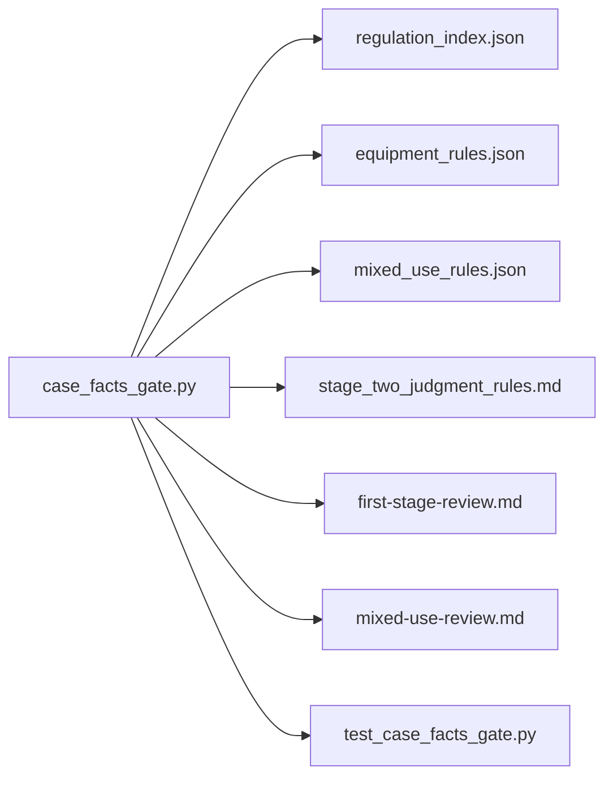

# 案例事实门控API

<cite>
**本文引用的文件**   
- [tools/case_facts_gate.py](file://tools/case_facts_gate.py)
- [tests/test_case_facts_gate.py](file://tests/test_case_facts_gate.py)
- [rules/regulation_index.json](file://rules/regulation_index.json)
- [rules/equipment_rules.json](file://rules/equipment_rules.json)
- [rules/mixed_use_rules.json](file://rules/mixed_use_rules.json)
- [rules/stage_two_judgment_rules.md](file://rules/stage_two_judgment_rules.md)
- [skills/first-stage-review.md](file://skills/first-stage-review.md)
- [skills/mixed-use-review.md](file://skills/mixed-use-review.md)
- [AGENTS.md](file://AGENTS.md)
</cite>

## 目录
1. [简介](#简介)
2. [项目结构](#项目结构)
3. [核心组件](#核心组件)
4. [架构总览](#架构总览)
5. [详细组件分析](#详细组件分析)
6. [依赖关系分析](#依赖关系分析)
7. [性能考量](#性能考量)
8. [故障排查指南](#故障排查指南)
9. [结论](#结论)
10. [附录](#附录)

## 简介
本技术规范围绕“案例事实门控API”展开，目标是定义一套用于案例数据验证、事实提取、规则匹配与决策逻辑的接口规范。该API将作为审查工作流的前置门控环节，确保进入后续阶段的数据具备完整性、一致性与可追溯性，并基于规则库进行初步判定与分流。文档涵盖输入输出格式、校验规则、处理流程、错误模式、Python SDK调用示例、性能优化建议以及与审查工作流的集成方式。

## 项目结构
与案例事实门控API直接相关的代码与资源分布如下：
- tools/case_facts_gate.py：门控API的核心实现入口，提供数据校验、事实提取、规则匹配与决策输出的主流程。
- tests/test_case_facts_gate.py：针对门控API的单元测试与回归用例，覆盖典型输入、边界条件与异常路径。
- rules/*：规则与索引资源，包括法规条款索引、设备规则、混合用途规则以及第二阶段判定规则说明。
- skills/*：审查技能文档，描述第一阶段审查与混合用途审查的工作流，为门控API的决策分支提供上下文。
- AGENTS.md：系统级行为约定，影响工具调用、日志与错误上报等通用行为。

图表来源 
- [tools/case_facts_gate.py](file://tools/case_facts_gate.py)
- [rules/regulation_index.json](file://rules/regulation_index.json)
- [rules/equipment_rules.json](file://rules/equipment_rules.json)
- [rules/mixed_use_rules.json](file://rules/mixed_use_rules.json)

章节来源
- [tools/case_facts_gate.py](file://tools/case_facts_gate.py)
- [tests/test_case_facts_gate.py](file://tests/test_case_facts_gate.py)
- [rules/regulation_index.json](file://rules/regulation_index.json)
- [rules/equipment_rules.json](file://rules/equipment_rules.json)
- [rules/mixed_use_rules.json](file://rules/mixed_use_rules.json)
- [skills/first-stage-review.md](file://skills/first-stage-review.md)
- [skills/mixed-use-review.md](file://skills/mixed-use-review.md)
- [AGENTS.md](file://AGENTS.md)

## 核心组件
- 输入校验器
  - 负责案例数据的必填项检查、类型校验、取值范围与一致性约束（如面积与容量对应关系）。
  - 支持批量提交时的逐条校验与汇总错误报告。
- 事实提取器
  - 从原始表单或结构化输入中抽取关键事实（场所类型、面积、楼层、设备配置等），并进行标准化与归一化。
  - 输出稳定、可被规则引擎消费的事实模型。
- 规则匹配引擎
  - 基于法规条款索引与设备/混合用途规则进行匹配，支持多规则并行匹配与优先级排序。
  - 处理规则冲突与例外条款，输出命中清单与置信度。
- 决策生成器
  - 根据命中规则与业务策略生成门控决策：通过、不通过、需补充材料、转人工复核。
  - 附带决策依据、命中条款与待办事项。

章节来源
- [tools/case_facts_gate.py](file://tools/case_facts_gate.py)
- [tests/test_case_facts_gate.py](file://tests/test_case_facts_gate.py)
- [rules/regulation_index.json](file://rules/regulation_index.json)
- [rules/equipment_rules.json](file://rules/equipment_rules.json)
- [rules/mixed_use_rules.json](file://rules/mixed_use_rules.json)
- [rules/stage_two_judgment_rules.md](file://rules/stage_two_judgment_rules.md)

## 架构总览
门控API采用分层设计：输入层→校验层→事实层→规则层→决策层→输出层。各层职责清晰，便于扩展与维护。

图表来源 
- [tools/case_facts_gate.py](file://tools/case_facts_gate.py)
- [rules/regulation_index.json](file://rules/regulation_index.json)
- [rules/equipment_rules.json](file://rules/equipment_rules.json)
- [rules/mixed_use_rules.json](file://rules/mixed_use_rules.json)

## 详细组件分析

### 输入数据格式与校验规则
- 输入主体
  - 案例标识：唯一ID或批次号
  - 场所信息：名称、地址、用途分类、建筑面积、楼层数
  - 设备配置：消防设备类型、数量、安装位置
  - 附加材料：图纸编号、审批文号、备注
- 校验规则
  - 必填项：案例标识、场所用途、建筑面积
  - 类型与范围：数值型字段需为正数；日期格式符合ISO 8601
  - 一致性：面积与设备数量阈值关联；用途与设备类型匹配
  - 批量校验：逐条记录独立校验，汇总错误码与行号定位

章节来源
- [tools/case_facts_gate.py](file://tools/case_facts_gate.py)
- [tests/test_case_facts_gate.py](file://tests/test_case_facts_gate.py)

### 事实提取与标准化
- 抽取目标
  - 场所属性：用途分类、面积区间、楼层高度
  - 设备属性：类型、数量、布置密度
  - 合规线索：是否满足最低配置要求
- 标准化策略
  - 枚举映射：用途分类映射到标准字典
  - 单位换算：面积统一为平方米，长度统一为米
  - 缺失值处理：标记未知并提示补充

章节来源
- [tools/case_facts_gate.py](file://tools/case_facts_gate.py)
- [tests/test_case_facts_gate.py](file://tests/test_case_facts_gate.py)

### 规则匹配与决策逻辑
- 规则来源
  - 法规条款索引：按条款编号组织，包含适用场景与条件
  - 设备规则：设备类型与数量的阈值表
  - 混合用途规则：复合用途下的叠加与优先规则
- 匹配策略
  - 多规则并行匹配，按优先级与置信度排序
  - 冲突消解：后发优于先发、特别法优于一般法
- 决策输出
  - 通过：所有必要条款均满足
  - 不通过：关键条款未满足且无豁免
  - 待补充：部分事实缺失或不确定
  - 转人工：复杂情形或规则冲突无法自动消解

章节来源
- [rules/regulation_index.json](file://rules/regulation_index.json)
- [rules/equipment_rules.json](file://rules/equipment_rules.json)
- [rules/mixed_use_rules.json](file://rules/mixed_use_rules.json)
- [rules/stage_two_judgment_rules.md](file://rules/stage_two_judgment_rules.md)

### 输出结果结构
- 顶层字段
  - 状态码：成功/失败/待补充/转人工
  - 消息：人类可读摘要
  - 时间戳：处理完成时间
- 数据体
  - 事实清单：标准化后的事实条目
  - 命中规则：条款编号、适用性、置信度
  - 决策依据：关键判断点与建议
  - 待办事项：需补充的材料或下一步操作

章节来源
- [tools/case_facts_gate.py](file://tools/case_facts_gate.py)
- [tests/test_case_facts_gate.py](file://tests/test_case_facts_gate.py)

### Python SDK调用示例
- 基本调用
  - 初始化客户端：设置基础URL与认证信息
  - 提交案例数据：单条或批量JSON
  - 获取结果：解析状态码与数据体
- 错误处理
  - 网络异常：重试与退避策略
  - 校验失败：读取错误列表并提示用户修正
  - 规则冲突：记录日志并触发人工复核流程
- 性能优化
  - 批量提交：合并请求减少往返
  - 缓存规则：本地缓存规则索引与设备阈值
  - 异步处理：对长耗时任务使用队列与回调

章节来源
- [tools/case_facts_gate.py](file://tools/case_facts_gate.py)
- [tests/test_case_facts_gate.py](file://tests/test_case_facts_gate.py)

### 与审查工作流的集成
- 第一阶段审查
  - 门控API作为前置校验，确保进入审查的数据完整与一致
  - 输出结果驱动审查清单自动生成
- 混合用途审查
  - 依据混合用途规则进行叠加判定，必要时转入第二阶段
- 审计与追踪
  - 每次调用记录输入指纹、命中规则与决策依据
  - 支持回溯与版本对比

章节来源
- [skills/first-stage-review.md](file://skills/first-stage-review.md)
- [skills/mixed-use-review.md](file://skills/mixed-use-review.md)
- [AGENTS.md](file://AGENTS.md)

## 依赖关系分析
门控API依赖规则资源与审查技能文档，形成稳定的输入-处理-输出链路。

图表来源 
- [tools/case_facts_gate.py](file://tools/case_facts_gate.py)
- [rules/regulation_index.json](file://rules/regulation_index.json)
- [rules/equipment_rules.json](file://rules/equipment_rules.json)
- [rules/mixed_use_rules.json](file://rules/mixed_use_rules.json)
- [rules/stage_two_judgment_rules.md](file://rules/stage_two_judgment_rules.md)
- [skills/first-stage-review.md](file://skills/first-stage-review.md)
- [skills/mixed-use-review.md](file://skills/mixed-use-review.md)
- [tests/test_case_facts_gate.py](file://tests/test_case_facts_gate.py)

章节来源
- [tools/case_facts_gate.py](file://tools/case_facts_gate.py)
- [tests/test_case_facts_gate.py](file://tests/test_case_facts_gate.py)
- [rules/regulation_index.json](file://rules/regulation_index.json)
- [rules/equipment_rules.json](file://rules/equipment_rules.json)
- [rules/mixed_use_rules.json](file://rules/mixed_use_rules.json)
- [rules/stage_two_judgment_rules.md](file://rules/stage_two_judgment_rules.md)
- [skills/first-stage-review.md](file://skills/first-stage-review.md)
- [skills/mixed-use-review.md](file://skills/mixed-use-review.md)

## 性能考量
- 规则加载优化
  - 启动时预加载规则索引与设备阈值，避免重复I/O
  - 增量更新机制：仅加载变更的规则文件
- 校验与提取并行化
  - 批量输入时并行执行校验与事实提取
  - 使用线程池或协程提升吞吐
- 缓存与去重
  - 对相同输入指纹的结果进行缓存
  - 避免重复计算与规则匹配
- 超时与降级
  - 设置合理超时与熔断策略
  - 在规则服务不可用时回退到默认决策

[本节为通用性能指导，无需特定文件引用]

## 故障排查指南
- 常见错误
  - 校验失败：检查必填项、类型与范围，参考错误列表中的字段定位
  - 规则冲突：查看命中规则与优先级，确认是否有例外条款
  - 事实缺失：根据待办事项补充材料或修正输入
- 调试步骤
  - 启用详细日志：记录输入指纹、中间结果与命中规则
  - 最小化复现：构造最小输入集以定位问题
  - 断言测试：运行单元测试覆盖关键路径
- 恢复策略
  - 重试与退避：对网络与临时错误进行重试
  - 人工介入：对复杂冲突或不确定情形转人工复核

章节来源
- [tests/test_case_facts_gate.py](file://tests/test_case_facts_gate.py)
- [tools/case_facts_gate.py](file://tools/case_facts_gate.py)

## 结论
案例事实门控API通过严格的输入校验、标准化的事实提取、高效的规则匹配与明确的决策逻辑，为审查工作流提供了可靠的前置保障。其模块化设计与清晰的接口定义便于扩展与维护，结合性能优化与完善的错误处理，能够在大规模场景中稳定运行。

[本节为总结性内容，无需特定文件引用]

## 附录
- 术语表
  - 案例：指一次完整的审查申请或资料提交
  - 事实：从案例数据中提取的结构化信息
  - 规则：法规条款与设备配置的判定条件
  - 决策：门控API的输出结果，指示下一步操作
- 参考文档
  - 第一阶段审查技能文档
  - 混合用途审查技能文档
  - 第二阶段判定规则说明

[本节为概念性内容，无需特定文件引用]