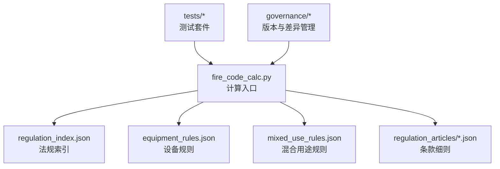
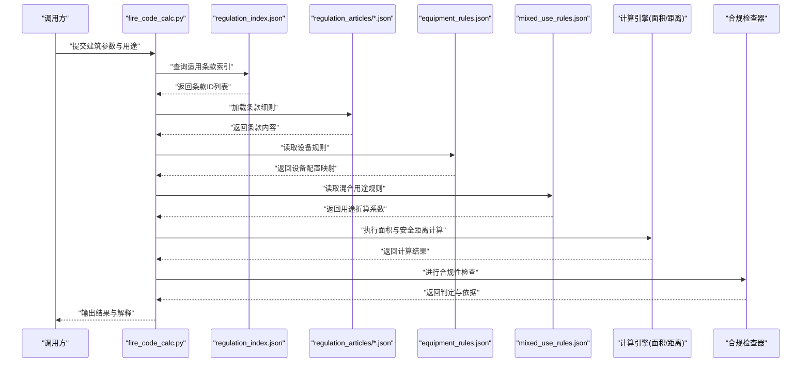
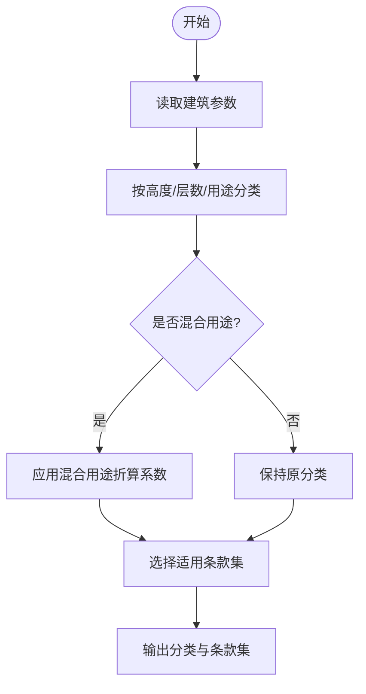
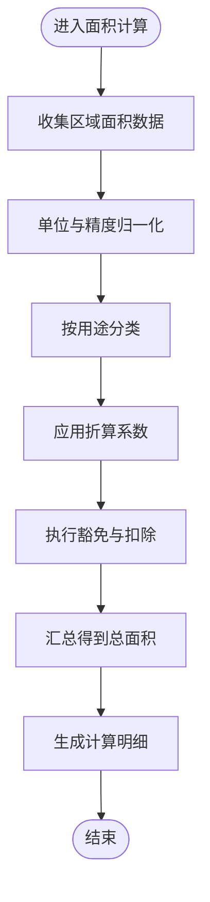
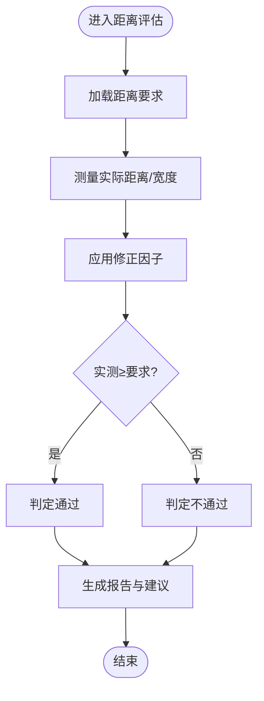
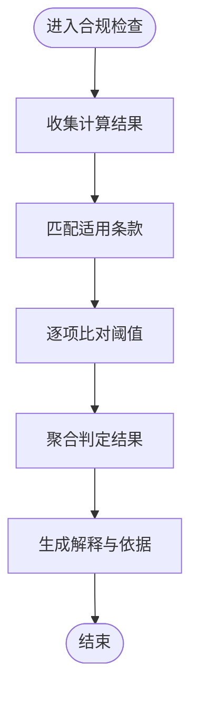
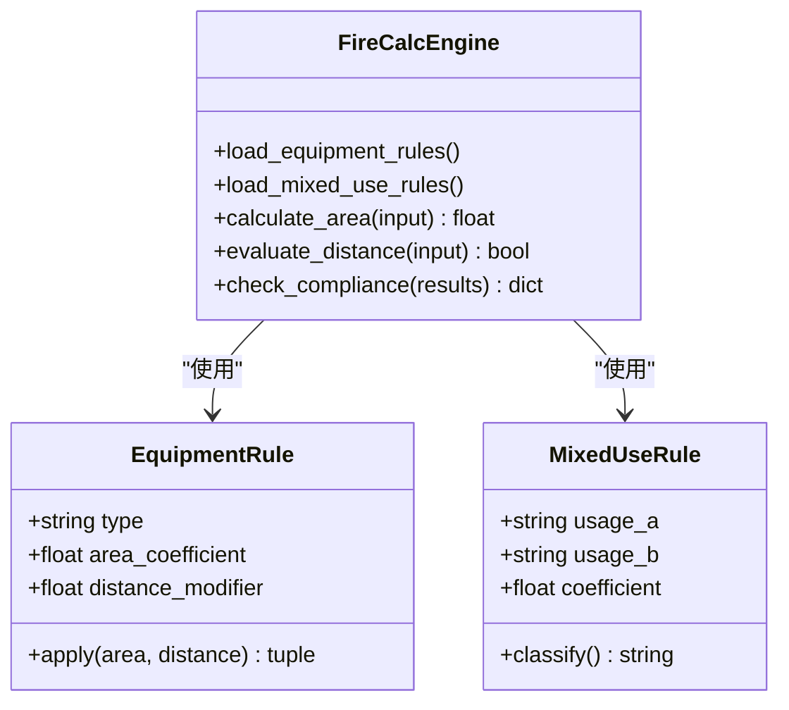
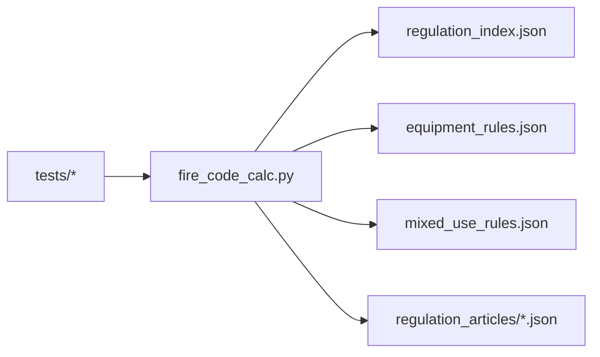

# 消防法规计算API

<cite>
**本文档引用的文件**   
- [fire_code_calc.py](file://tools/fire_code_calc.py)
- [regulation_index.json](file://rules/regulation_index.json)
- [equipment_rules.json](file://rules/equipment_rules.json)
- [mixed_use_rules.json](file://rules/mixed_use_rules.json)
- [article-018.json](file://rules/regulation_articles/article-018.json)
- [article-029.json](file://rules/regulation_articles/article-029.json)
- [article-030.json](file://rules/regulation_articles/article-030.json)
- [article-044.json](file://rules/regulation_articles/article-044.json)
- [article-045.json](file://rules/regulation_articles/article-045.json)
- [article-046.json](file://rules/regulation_articles/article-046.json)
- [article-047.json](file://rules/regulation_articles/article-047.json)
- [article-050.json](file://rules/regulation_articles/article-050.json)
- [article-051.json](file://rules/regulation_articles/article-051.json)
- [article-053.json](file://rules/regulation_articles/article-053.json)
- [article-060.json](file://rules/regulation_articles/article-060.json)
- [article-061.json](file://rules/regulation_articles/article-061.json)
- [article-064.json](file://rules/regulation_articles/article-064.json)
- [article-066.json](file://rules/regulation_articles/article-066.json)
- [article-067.json](file://rules/regulation_articles/article-067.json)
- [article-076.json](file://rules/regulation_articles/article-076.json)
- [article-078.json](file://rules/regulation_articles/article-078.json)
- [article-079.json](file://rules/regulation_articles/article-079.json)
- [article-080.json](file://rules/regulation_articles/article-080.json)
- [article-084.json](file://rules/regulation_articles/article-084.json)
- [article-085.json](file://rules/regulation_articles/article-085.json)
- [article-086.json](file://rules/regulation_articles/article-086.json)
- [article-089.json](file://rules/regulation_articles/article-089.json)
- [article-092.json](file://rules/regulation_articles/article-092.json)
- [article-093.json](file://rules/regulation_articles/article-093.json)
- [article-095.json](file://rules/regulation_articles/article-095.json)
- [article-097.json](file://rules/regulation_articles/article-097.json)
- [article-099.json](file://rules/regulation_articles/article-099.json)
- [article-100.json](file://rules/regulation_articles/article-100.json)
- [article-101.json](file://rules/regulation_articles/article-101.json)
- [article-103.json](file://rules/regulation_articles/article-103.json)
- [article-107.json](file://rules/regulation_articles/article-107.json)
- [article-109.json](file://rules/regulation_articles/article-109.json)
- [article-110.json](file://rules/regulation_articles/article-110.json)
- [article-117.json](file://rules/regulation_articles/article-117.json)
- [article-121.json](file://rules/regulation_articles/article-121.json)
- [article-127.json](file://rules/regulation_articles/article-127.json)
- [article-128.json](file://rules/regulation_articles/article-128.json)
- [article-130.json](file://rules/regulation_articles/article-130.json)
- [article-131.json](file://rules/regulation_articles/article-131.json)
- [article-133.json](file://rules/regulation_articles/article-133.json)
- [article-134.json](file://rules/regulation_articles/article-134.json)
- [article-137.json](file://rules/regulation_articles/article-137.json)
- [article-138.json](file://rules/regulation_articles/article-138.json)
- [article-139.json](file://rules/regulation_articles/article-139.json)
- [article-142.json](file://rules/regulation_articles/article-142.json)
- [article-146.json](file://rules/regulation_articles/article-146.json)
- [article-146-1.json](file://rules/regulation_articles/article-146-1.json)
- [article-146-2.json](file://rules/regulation_articles/article-146-2.json)
- [article-146-4.json](file://rules/regulation_articles/article-146-4.json)
- [article-146-5.json](file://rules/regulation_articles/article-146-5.json)
- [article-146-6.json](file://rules/regulation_articles/article-146-6.json)
- [article-147.json](file://rules/regulation_articles/article-147.json)
- [article-148.json](file://rules/regulation_articles/article-148.json)
- [article-149.json](file://rules/regulation_articles/article-149.json)
- [article-150.json](file://rules/regulation_articles/article-150.json)
- [article-151.json](file://rules/regulation_articles/article-151.json)
- [article-152.json](file://rules/regulation_articles/article-152.json)
- [article-154.json](file://rules/regulation_articles/article-154.json)
- [article-157.json](file://rules/regulation_articles/article-157.json)
- [article-159.json](file://rules/regulation_articles/article-159.json)
- [article-160.json](file://rules/regulation_articles/article-160.json)
- [article-167.json](file://rules/regulation_articles/article-167.json)
- [article-168.json](file://rules/regulation_articles/article-168.json)
- [article-170.json](file://rules/regulation_articles/article-170.json)
- [article-172.json](file://rules/regulation_articles/article-172.json)
- [article-178.json](file://rules/regulation_articles/article-178.json)
- [article-179.json](file://rules/regulation_articles/article-179.json)
- [article-182.json](file://rules/regulation_articles/article-182.json)
- [article-183.json](file://rules/regulation_articles/article-183.json)
- [article-184.json](file://rules/regulation_articles/article-184.json)
- [article-186.json](file://rules/regulation_articles/article-186.json)
- [article-190.json](file://rules/regulation_articles/article-190.json)
- [article-191.json](file://rules/regulation_articles/article-191.json)
- [article-196.json](file://rules/regulation_articles/article-196.json)
- [article-198.json](file://rules/regulation_articles/article-198.json)
- [article-199.json](file://rules/regulation_articles/article-199.json)
- [article-201.json](file://rules/regulation_articles/article-201.json)
- [article-202.json](file://rules/regulation_articles/article-202.json)
- [article-203.json](file://rules/regulation_articles/article-203.json)
- [article-204.json](file://rules/regulation_articles/article-204.json)
- [article-205.json](file://rules/regulation_articles/article-205.json)
- [article-206.json](file://rules/regulation_articles/article-206.json)
- [article-207.json](file://rules/regulation_articles/article-207.json)
- [article-208.json](file://rules/regulation_articles/article-208.json)
- [article-213.json](file://rules/regulation_articles/article-213.json)
- [article-217.json](file://rules/regulation_articles/article-217.json)
- [article-218.json](file://rules/regulation_articles/article-218.json)
- [article-222.json](file://rules/regulation_articles/article-222.json)
- [article-222-1.json](file://rules/regulation_articles/article-222-1.json)
- [article-224.json](file://rules/regulation_articles/article-224.json)
- [article-226.json](file://rules/regulation_articles/article-226.json)
- [article-227.json](file://rules/regulation_articles/article-227.json)
- [article-228.json](file://rules/regulation_articles/article-228.json)
- [article-230.json](file://rules/regulation_articles/article-230.json)
- [article-233.json](file://rules/regulation_articles/article-233.json)
- [article-234.json](file://rules/regulation_articles/article-234.json)
- [article-236.json](file://rules/regulation_articles/article-236.json)
- [article-237.json](file://rules/regulation_articles/article-237.json)
- [article-239.json](file://rules/regulation_articles/article-239.json)
- [article-97-2.json](file://rules/regulation_articles/article-97-2.json)
- [article-97-3.json](file://rules/regulation_articles/article-97-3.json)
- [article-97-8.json](file://rules/regulation_articles/article-97-8.json)
- [article-97-10.json](file://rules/regulation_articles/article-97-10.json)
</cite>

## 目录
1. [简介](#简介)
2. [项目结构](#项目结构)
3. [核心组件](#核心组件)
4. [架构总览](#架构总览)
5. [详细组件分析](#详细组件分析)
6. [依赖关系分析](#依赖关系分析)
7. [性能考量](#性能考量)
8. [故障排查指南](#故障排查指南)
9. [结论](#结论)
10. [附录](#附录)

## 简介
本技术文档围绕“消防法规计算API”展开，聚焦建筑分类、面积计算、安全距离评估与合规性检查四大能力。该API以规则驱动为核心，通过统一的计算入口调用法规条款库（JSON）与设备/混合用途规则，完成输入参数的校验、公式计算、边界条件处理与结果解释，并输出可追溯的合规判定与依据。

## 项目结构
- 工具层：提供命令行与脚本化接口，其中 fire_code_calc.py 为消防法规计算的统一入口。
- 规则层：regulation_index.json 作为法规索引；equipment_rules.json 与 mixed_use_rules.json 分别承载设备配置与混合用途判定规则；regulation_articles/*.json 存放各条款细则。
- 测试与治理：tests 目录包含多项测试用例；governance 目录存放核定记录与待确认清单，用于版本与差异管理。

图表来源
- [fire_code_calc.py](file://tools/fire_code_calc.py)
- [regulation_index.json](file://rules/regulation_index.json)
- [equipment_rules.json](file://rules/equipment_rules.json)
- [mixed_use_rules.json](file://rules/mixed_use_rules.json)
- [article-018.json](file://rules/regulation_articles/article-018.json)

章节来源
- [fire_code_calc.py](file://tools/fire_code_calc.py)
- [regulation_index.json](file://rules/regulation_index.json)
- [equipment_rules.json](file://rules/equipment_rules.json)
- [mixed_use_rules.json](file://rules/mixed_use_rules.json)

## 核心组件
- 计算入口模块：负责参数接收、校验、路由到具体计算流程，并聚合结果。
- 法规索引与条款加载器：根据建筑类型、用途、楼层等上下文选择适用条款集合。
- 面积计算引擎：基于建筑分区、功能区域与豁免规则进行面积汇总与归一化。
- 安全距离评估器：依据间距要求、防火分隔与通道宽度等约束进行距离判定。
- 合规性检查器：将计算结果与条款阈值比对，生成通过/不通过及依据说明。
- 设备与混合用途判定：结合设备配置与混合用途规则，影响分类与面积折算系数。

章节来源
- [fire_code_calc.py](file://tools/fire_code_calc.py)
- [regulation_index.json](file://rules/regulation_index.json)
- [equipment_rules.json](file://rules/equipment_rules.json)
- [mixed_use_rules.json](file://rules/mixed_use_rules.json)

## 架构总览
下图展示从输入到输出的端到端流程：入口接收参数，解析建筑分类与用途，加载相关条款，执行面积与安全距离计算，最后进行合规性检查并输出结果与依据。

图表来源
- [fire_code_calc.py](file://tools/fire_code_calc.py)
- [regulation_index.json](file://rules/regulation_index.json)
- [equipment_rules.json](file://rules/equipment_rules.json)
- [mixed_use_rules.json](file://rules/mixed_use_rules.json)
- [article-018.json](file://rules/regulation_articles/article-018.json)

## 详细组件分析

### 建筑分类与用途判定
- 分类维度：建筑高度、层数、使用性质（如办公、商业、住宅、工业）、是否地下空间、是否混合用途。
- 判定逻辑：依据索引与条款中的分类表与适用范围，结合设备与混合用途规则确定最终分类与折算系数。
- 关键输出：分类码、用途类别、折算系数、适用条款集。

图表来源
- [regulation_index.json](file://rules/regulation_index.json)
- [mixed_use_rules.json](file://rules/mixed_use_rules.json)
- [equipment_rules.json](file://rules/equipment_rules.json)

章节来源
- [regulation_index.json](file://rules/regulation_index.json)
- [mixed_use_rules.json](file://rules/mixed_use_rules.json)
- [equipment_rules.json](file://rules/equipment_rules.json)

### 面积计算引擎
- 输入：各功能区域面积、层高、是否计入容积率或豁免项、分区边界。
- 算法要点：
  - 基础面积汇总：对每个区域按用途归类后求和。
  - 折算系数：依据混合用途规则与设备配置调整面积权重。
  - 豁免与扣除：按条款规定剔除不计入面积的部分（如设备间、避难层等）。
  - 精度控制：统一保留小数位数，避免浮点误差累积。
- 输出：总面积、分用途面积、折算后面积、计算明细。

图表来源
- [fire_code_calc.py](file://tools/fire_code_calc.py)
- [mixed_use_rules.json](file://rules/mixed_use_rules.json)
- [equipment_rules.json](file://rules/equipment_rules.json)

章节来源
- [fire_code_calc.py](file://tools/fire_code_calc.py)
- [mixed_use_rules.json](file://rules/mixed_use_rules.json)
- [equipment_rules.json](file://rules/equipment_rules.json)

### 安全距离评估器
- 输入：建筑间距、防火分区尺寸、疏散通道宽度、设备布置位置。
- 算法要点：
  - 基准距离：按建筑分类与用途确定最小间距与通道宽度要求。
  - 修正因子：考虑防火分隔等级、开口比例、设备遮挡等因素进行修正。
  - 判定逻辑：比较实测值与要求值，输出通过/不通过及偏差量。
- 输出：距离达标情况、偏差值、依据条款与改进建议。

图表来源
- [fire_code_calc.py](file://tools/fire_code_calc.py)
- [regulation_articles/article-018.json](file://rules/regulation_articles/article-018.json)
- [regulation_articles/article-029.json](file://rules/regulation_articles/article-029.json)
- [regulation_articles/article-030.json](file://rules/regulation_articles/article-030.json)

章节来源
- [fire_code_calc.py](file://tools/fire_code_calc.py)
- [regulation_articles/article-018.json](file://rules/regulation_articles/article-018.json)
- [regulation_articles/article-029.json](file://rules/regulation_articles/article-029.json)
- [regulation_articles/article-030.json](file://rules/regulation_articles/article-030.json)

### 合规性检查器
- 输入：面积计算结果、距离评估结果、建筑分类与用途、设备配置。
- 算法要点：
  - 阈值比对：将计算结果与条款阈值逐项比对。
  - 优先级：当存在多条适用条款时，按严格度或最新生效条款优先。
  - 证据链：每条判定附带条款引用与计算依据。
- 输出：总体合规状态、分项判定、依据条款与解释。

图表来源
- [fire_code_calc.py](file://tools/fire_code_calc.py)
- [regulation_index.json](file://rules/regulation_index.json)
- [regulation_articles/article-044.json](file://rules/regulation_articles/article-044.json)
- [regulation_articles/article-045.json](file://rules/regulation_articles/article-045.json)
- [regulation_articles/article-046.json](file://rules/regulation_articles/article-046.json)
- [regulation_articles/article-047.json](file://rules/regulation_articles/article-047.json)

章节来源
- [fire_code_calc.py](file://tools/fire_code_calc.py)
- [regulation_index.json](file://rules/regulation_index.json)
- [regulation_articles/article-044.json](file://rules/regulation_articles/article-044.json)
- [regulation_articles/article-045.json](file://rules/regulation_articles/article-045.json)
- [regulation_articles/article-046.json](file://rules/regulation_articles/article-046.json)
- [regulation_articles/article-047.json](file://rules/regulation_articles/article-047.json)

### 设备与混合用途规则集成
- 设备规则：定义不同设备类型对面积折算、间距修正的影响。
- 混合用途：定义多用途建筑的面积折算系数与分类优先级。
- 集成方式：在分类与面积计算阶段动态加载，确保计算一致性。

图表来源
- [equipment_rules.json](file://rules/equipment_rules.json)
- [mixed_use_rules.json](file://rules/mixed_use_rules.json)
- [fire_code_calc.py](file://tools/fire_code_calc.py)

章节来源
- [equipment_rules.json](file://rules/equipment_rules.json)
- [mixed_use_rules.json](file://rules/mixed_use_rules.json)
- [fire_code_calc.py](file://tools/fire_code_calc.py)

## 依赖关系分析
- 入口依赖：fire_code_calc.py 依赖 regulation_index.json 获取条款集合，依赖 equipment_rules.json 与 mixed_use_rules.json 进行参数修正。
- 条款依赖：regulation_articles/*.json 提供具体阈值与计算方法，部分条款相互引用形成依赖链。
- 测试依赖：tests 目录覆盖入口、规则加载、计算流程与合规检查。

图表来源
- [fire_code_calc.py](file://tools/fire_code_calc.py)
- [regulation_index.json](file://rules/regulation_index.json)
- [equipment_rules.json](file://rules/equipment_rules.json)
- [mixed_use_rules.json](file://rules/mixed_use_rules.json)
- [article-050.json](file://rules/regulation_articles/article-050.json)
- [article-051.json](file://rules/regulation_articles/article-051.json)
- [article-053.json](file://rules/regulation_articles/article-053.json)
- [article-060.json](file://rules/regulation_articles/article-060.json)
- [article-061.json](file://rules/regulation_articles/article-061.json)
- [article-064.json](file://rules/regulation_articles/article-064.json)
- [article-066.json](file://rules/regulation_articles/article-066.json)
- [article-067.json](file://rules/regulation_articles/article-067.json)
- [article-076.json](file://rules/regulation_articles/article-076.json)
- [article-078.json](file://rules/regulation_articles/article-078.json)
- [article-079.json](file://rules/regulation_articles/article-079.json)
- [article-080.json](file://rules/regulation_articles/article-080.json)
- [article-084.json](file://rules/regulation_articles/article-084.json)
- [article-085.json](file://rules/regulation_articles/article-085.json)
- [article-086.json](file://rules/regulation_articles/article-086.json)
- [article-089.json](file://rules/regulation_articles/article-089.json)
- [article-092.json](file://rules/regulation_articles/article-092.json)
- [article-093.json](file://rules/regulation_articles/article-093.json)
- [article-095.json](file://rules/regulation_articles/article-095.json)
- [article-097.json](file://rules/regulation_articles/article-097.json)
- [article-099.json](file://rules/regulation_articles/article-099.json)
- [article-100.json](file://rules/regulation_articles/article-100.json)
- [article-101.json](file://rules/regulation_articles/article-101.json)
- [article-103.json](file://rules/regulation_articles/article-103.json)
- [article-107.json](file://rules/regulation_articles/article-107.json)
- [article-109.json](file://rules/regulation_articles/article-109.json)
- [article-110.json](file://rules/regulation_articles/article-110.json)
- [article-117.json](file://rules/regulation_articles/article-117.json)
- [article-121.json](file://rules/regulation_articles/article-121.json)
- [article-127.json](file://rules/regulation_articles/article-127.json)
- [article-128.json](file://rules/regulation_articles/article-128.json)
- [article-130.json](file://rules/regulation_articles/article-130.json)
- [article-131.json](file://rules/regulation_articles/article-131.json)
- [article-133.json](file://rules/regulation_articles/article-133.json)
- [article-134.json](file://rules/regulation_articles/article-134.json)
- [article-137.json](file://rules/regulation_articles/article-137.json)
- [article-138.json](file://rules/regulation_articles/article-138.json)
- [article-139.json](file://rules/regulation_articles/article-139.json)
- [article-142.json](file://rules/regulation_articles/article-142.json)
- [article-146.json](file://rules/regulation_articles/article-146.json)
- [article-146-1.json](file://rules/regulation_articles/article-146-1.json)
- [article-146-2.json](file://rules/regulation_articles/article-146-2.json)
- [article-146-4.json](file://rules/regulation_articles/article-146-4.json)
- [article-146-5.json](file://rules/regulation_articles/article-146-5.json)
- [article-146-6.json](file://rules/regulation_articles/article-146-6.json)
- [article-147.json](file://rules/regulation_articles/article-147.json)
- [article-148.json](file://rules/regulation_articles/article-148.json)
- [article-149.json](file://rules/regulation_articles/article-149.json)
- [article-150.json](file://rules/regulation_articles/article-150.json)
- [article-151.json](file://rules/regulation_articles/article-151.json)
- [article-152.json](file://rules/regulation_articles/article-152.json)
- [article-154.json](file://rules/regulation_articles/article-154.json)
- [article-157.json](file://rules/regulation_articles/article-157.json)
- [article-159.json](file://rules/regulation_articles/article-159.json)
- [article-160.json](file://rules/regulation_articles/article-160.json)
- [article-167.json](file://rules/regulation_articles/article-167.json)
- [article-168.json](file://rules/regulation_articles/article-168.json)
- [article-170.json](file://rules/regulation_articles/article-170.json)
- [article-172.json](file://rules/regulation_articles/article-172.json)
- [article-178.json](file://rules/regulation_articles/article-178.json)
- [article-179.json](file://rules/regulation_articles/article-179.json)
- [article-182.json](file://rules/regulation_articles/article-182.json)
- [article-183.json](file://rules/regulation_articles/article-183.json)
- [article-184.json](file://rules/regulation_articles/article-184.json)
- [article-186.json](file://rules/regulation_articles/article-186.json)
- [article-190.json](file://rules/regulation_articles/article-190.json)
- [article-191.json](file://rules/regulation_articles/article-191.json)
- [article-196.json](file://rules/regulation_articles/article-196.json)
- [article-198.json](file://rules/regulation_articles/article-198.json)
- [article-199.json](file://rules/regulation_articles/article-199.json)
- [article-201.json](file://rules/regulation_articles/article-201.json)
- [article-202.json](file://rules/regulation_articles/article-202.json)
- [article-203.json](file://rules/regulation_articles/article-203.json)
- [article-204.json](file://rules/regulation_articles/article-204.json)
- [article-205.json](file://rules/regulation_articles/article-205.json)
- [article-206.json](file://rules/regulation_articles/article-206.json)
- [article-207.json](file://rules/regulation_articles/article-207.json)
- [article-208.json](file://rules/regulation_articles/article-208.json)
- [article-213.json](file://rules/regulation_articles/article-213.json)
- [article-217.json](file://rules/regulation_articles/article-217.json)
- [article-218.json](file://rules/regulation_articles/article-218.json)
- [article-222.json](file://rules/regulation_articles/article-222.json)
- [article-222-1.json](file://rules/regulation_articles/article-222-1.json)
- [article-224.json](file://rules/regulation_articles/article-224.json)
- [article-226.json](file://rules/regulation_articles/article-226.json)
- [article-227.json](file://rules/regulation_articles/article-227.json)
- [article-228.json](file://rules/regulation_articles/article-228.json)
- [article-230.json](file://rules/regulation_articles/article-230.json)
- [article-233.json](file://rules/regulation_articles/article-233.json)
- [article-234.json](file://rules/regulation_articles/article-234.json)
- [article-236.json](file://rules/regulation_articles/article-236.json)
- [article-237.json](file://rules/regulation_articles/article-237.json)
- [article-239.json](file://rules/regulation_articles/article-239.json)
- [article-97-2.json](file://rules/regulation_articles/article-97-2.json)
- [article-97-3.json](file://rules/regulation_articles/article-97-3.json)
- [article-97-8.json](file://rules/regulation_articles/article-97-8.json)
- [article-97-10.json](file://rules/regulation_articles/article-97-10.json)

章节来源
- [fire_code_calc.py](file://tools/fire_code_calc.py)
- [regulation_index.json](file://rules/regulation_index.json)
- [equipment_rules.json](file://rules/equipment_rules.json)
- [mixed_use_rules.json](file://rules/mixed_use_rules.json)

## 性能考量
- 规则加载优化：采用按需加载与缓存策略，减少重复I/O开销。
- 计算复杂度：面积汇总与距离评估均为线性或常数级操作，整体复杂度受条款数量影响。
- 精度控制：统一小数位与舍入策略，避免浮点误差累积。
- 并发与批处理：支持批量输入与并行计算，提升吞吐能力。

[本节为通用指导，无需特定文件来源]

## 故障排查指南
- 常见问题：
  - 参数缺失或类型错误：检查输入字段完整性与数据类型。
  - 规则未匹配：确认建筑分类与用途是否正确，核查索引与条款范围。
  - 计算结果异常：检查单位换算、折算系数与豁免规则应用。
  - 合规判定不一致：核对条款优先级与生效版本。
- 调试建议：
  - 启用详细日志，输出中间计算结果与依据条款。
  - 使用测试用例验证边界条件与极端场景。
  - 对比治理记录中的差异清单，定位规则变更影响。

章节来源
- [fire_code_calc.py](file://tools/fire_code_calc.py)
- [regulation_index.json](file://rules/regulation_index.json)
- [equipment_rules.json](file://rules/equipment_rules.json)
- [mixed_use_rules.json](file://rules/mixed_use_rules.json)

## 结论
本API以规则驱动为核心，通过清晰的计算流程与严格的合规检查，实现建筑分类、面积计算、安全距离评估与合规性检查的自动化。借助法规索引与条款细则，系统具备高可扩展性与可追溯性，适用于多场景消防合规审查与决策支持。

[本节为总结性内容，无需特定文件来源]

## 附录
- 术语表：
  - 建筑分类：按高度、层数、用途划分的类别。
  - 折算系数：混合用途或设备配置对面积或距离的修正比例。
  - 豁免项：不计入面积或距离要求的特殊区域或条件。
- 版本兼容性：
  - 通过 governance 目录中的差异清单与核定记录管理规则版本。
  - 条款文件命名与索引保持一致，便于回溯与升级。

[本节为补充信息，无需特定文件来源]