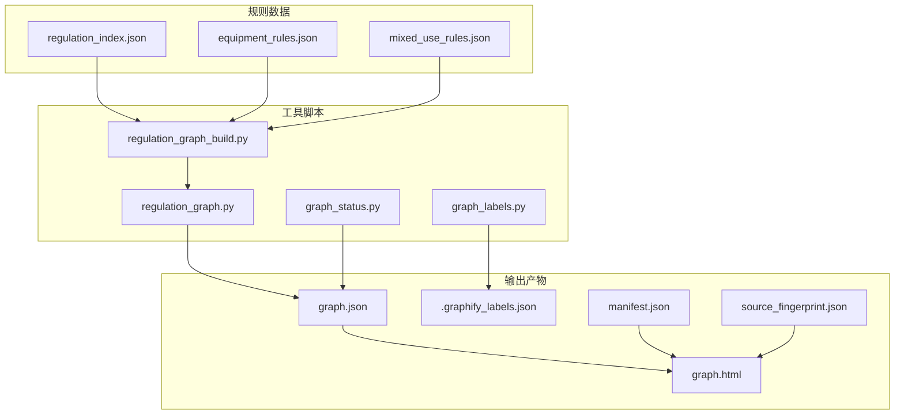
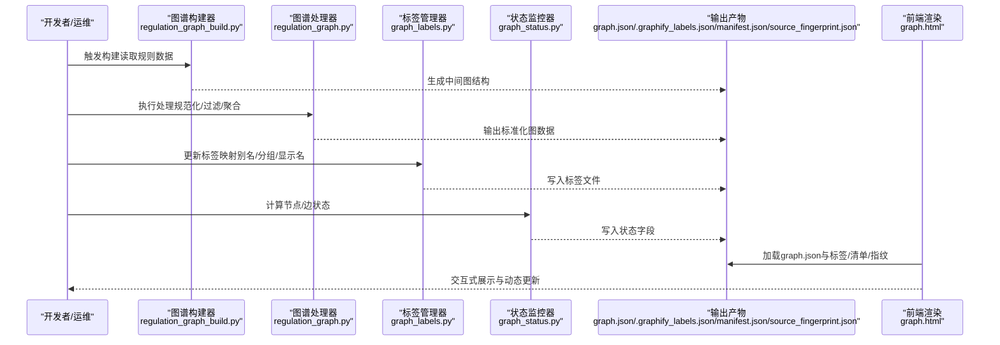
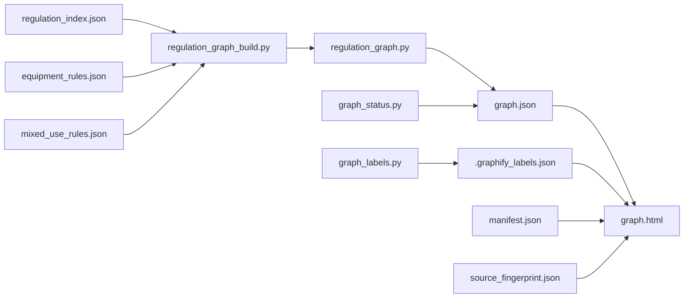

# 可视化图谱系统

<cite>
**本文引用的文件**   
- [graph.html](file://graphify-out/graph.html)
- [graph.json](file://graphify-out/graph.json)
- [.graphify_labels.json](file://graphify-out/.graphify_labels.json)
- [manifest.json](file://graphify-out/manifest.json)
- [source_fingerprint.json](file://graphify-out/source_fingerprint.json)
- [regulation_graph.py](file://tools/regulation_graph.py)
- [regulation_graph_build.py](file://tools/regulation_graph_build.py)
- [graph_labels.py](file://tools/graph_labels.py)
- [graph_status.py](file://tools/graph_status.py)
- [test_regulation_graph.py](file://tests/test_regulation_graph.py)
- [test_regulation_graph_build.py](file://tests/test_regulation_graph_build.py)
- [test_graph_labels.py](file://tests/test_graph_labels.py)
- [test_graph_status.py](file://tests/test_graph_status.py)
- [regulation_index.json](file://rules/regulation_index.json)
- [equipment_rules.json](file://rules/equipment_rules.json)
- [mixed_use_rules.json](file://rules/mixed_use_rules.json)
</cite>

## 目录
1. [简介](#简介)
2. [项目结构](#项目结构)
3. [核心组件](#核心组件)
4. [架构总览](#架构总览)
5. [详细组件分析](#详细组件分析)
6. [依赖关系分析](#依赖关系分析)
7. [性能考量](#性能考量)
8. [故障排查指南](#故障排查指南)
9. [结论](#结论)
10. [附录](#附录)

## 简介
本技术文档面向“法规关系图谱”的可视化系统，覆盖以下方面：
- 图谱构建算法与数据流：从法规索引、规则定义到图结构的生成过程。
- 节点布局策略与渲染引擎：前端展示、标签管理与交互能力。
- 状态监控与数据更新机制：如何维护图谱一致性并实现动态刷新。
- 集成与同步：与法规系统的对接方式及实时同步策略。
- 定制与扩展：自定义节点样式、交互行为与二次开发指南。

## 项目结构
该仓库采用“工具脚本 + 规则数据 + 输出产物”的分层组织：
- tools：图谱构建、标签管理、状态监控等核心工具脚本。
- rules：法规条目、设备规则、混合用途规则等结构化数据。
- graphify-out：图谱渲染产物（HTML、JSON、标签、清单、指纹）。
- tests：针对图谱构建、标签、状态等的测试用例。

图表来源
- [regulation_index.json](file://rules/regulation_index.json)
- [equipment_rules.json](file://rules/equipment_rules.json)
- [mixed_use_rules.json](file://rules/mixed_use_rules.json)
- [regulation_graph_build.py](file://tools/regulation_graph_build.py)
- [regulation_graph.py](file://tools/regulation_graph.py)
- [graph_labels.py](file://tools/graph_labels.py)
- [graph_status.py](file://tools/graph_status.py)
- [graph.json](file://graphify-out/graph.json)
- [.graphify_labels.json](file://graphify-out/.graphify_labels.json)
- [manifest.json](file://graphify-out/manifest.json)
- [source_fingerprint.json](file://graphify-out/source_fingerprint.json)

章节来源
- [regulation_index.json](file://rules/regulation_index.json)
- [equipment_rules.json](file://rules/equipment_rules.json)
- [mixed_use_rules.json](file://rules/mixed_use_rules.json)
- [regulation_graph_build.py](file://tools/regulation_graph_build.py)
- [regulation_graph.py](file://tools/regulation_graph.py)
- [graph_labels.py](file://tools/graph_labels.py)
- [graph_status.py](file://tools/graph_status.py)
- [graph.json](file://graphify-out/graph.json)
- [.graphify_labels.json](file://graphify-out/.graphify_labels.json)
- [manifest.json](file://graphify-out/manifest.json)
- [source_fingerprint.json](file://graphify-out/source_fingerprint.json)

## 核心组件
- 图谱构建器（regulation_graph_build.py）：读取规则数据，解析法规条目，生成图节点与边，输出中间图结构。
- 图谱处理器（regulation_graph.py）：对图结构进行规范化、过滤、聚合与导出为可渲染格式。
- 标签管理器（graph_labels.py）：维护节点标签映射、别名、分组与显示名称，支持多语言与版本化。
- 状态监控器（graph_status.py）：计算节点/边的状态（如已审查、待确认、冲突），驱动视图高亮与筛选。
- 渲染产物（graph.json, .graphify_labels.json, manifest.json, source_fingerprint.json, graph.html）：供前端渲染与交互使用。

章节来源
- [regulation_graph_build.py](file://tools/regulation_graph_build.py)
- [regulation_graph.py](file://tools/regulation_graph.py)
- [graph_labels.py](file://tools/graph_labels.py)
- [graph_status.py](file://tools/graph_status.py)
- [graph.json](file://graphify-out/graph.json)
- [.graphify_labels.json](file://graphify-out/.graphify_labels.json)
- [manifest.json](file://graphify-out/manifest.json)
- [source_fingerprint.json](file://graphify-out/source_fingerprint.json)

## 架构总览
下图展示了从规则数据到前端可视化的完整流水线：

图表来源
- [regulation_graph_build.py](file://tools/regulation_graph_build.py)
- [regulation_graph.py](file://tools/regulation_graph.py)
- [graph_labels.py](file://tools/graph_labels.py)
- [graph_status.py](file://tools/graph_status.py)
- [graph.json](file://graphify-out/graph.json)
- [.graphify_labels.json](file://graphify-out/.graphify_labels.json)
- [manifest.json](file://graphify-out/manifest.json)
- [source_fingerprint.json](file://graphify-out/source_fingerprint.json)

## 详细组件分析

### 图谱构建器（regulation_graph_build.py）
- 职责：解析规则数据（regulation_index.json、equipment_rules.json、mixed_use_rules.json），抽取实体与关系，构建初始图结构。
- 关键流程：
  - 读取并校验规则数据完整性。
  - 建立节点ID与分类映射（如条款、设备、场景）。
  - 根据规则推导边关系（引用、依赖、冲突）。
  - 输出中间图结构供后续处理。
- 复杂度与优化：
  - 节点/边数量与规则规模线性相关；可通过增量构建与缓存减少重复计算。
  - 对大规模规则集建议分片构建与并行处理。

章节来源
- [regulation_graph_build.py](file://tools/regulation_graph_build.py)
- [regulation_index.json](file://rules/regulation_index.json)
- [equipment_rules.json](file://rules/equipment_rules.json)
- [mixed_use_rules.json](file://rules/mixed_use_rules.json)

### 图谱处理器（regulation_graph.py）
- 职责：将构建器输出的图结构规范化，执行过滤、聚合、去重与导出。
- 关键流程：
  - 规范化节点属性（类型、层级、元数据）。
  - 合并重复节点与边，统一命名空间。
  - 导出为graph.json，确保前端可直接消费。
- 错误处理：
  - 对缺失字段或非法关系进行告警与回退策略。
  - 提供调试日志与验证报告。

章节来源
- [regulation_graph.py](file://tools/regulation_graph.py)
- [graph.json](file://graphify-out/graph.json)

### 标签管理器（graph_labels.py）
- 职责：维护节点标签映射，支持别名、分组、显示名称与多语言。
- 关键流程：
  - 读取/写入.graphify_labels.json。
  - 提供API用于批量更新标签与分组。
  - 与前端联动，实现标签筛选与搜索。
- 扩展点：
  - 支持插件式标签策略（按业务域、版本、区域）。

章节来源
- [graph_labels.py](file://tools/graph_labels.py)
- [.graphify_labels.json](file://graphify-out/.graphify_labels.json)

### 状态监控器（graph_status.py）
- 职责：计算节点与边的状态（如已审查、待确认、冲突、过期），驱动视图高亮与筛选。
- 关键流程：
  - 基于规则判定与外部输入（如审查结果）更新状态。
  - 输出状态字段至graph.json或独立状态文件。
  - 提供查询接口以支持前端交互。
- 性能考量：
  - 增量更新与事件驱动，避免全量重算。

章节来源
- [graph_status.py](file://tools/graph_status.py)
- [graph.json](file://graphify-out/graph.json)

### 渲染产物与前端（graph.json, .graphify_labels.json, manifest.json, source_fingerprint.json, graph.html）
- graph.json：图数据（节点、边、属性、状态）。
- .graphify_labels.json：标签映射与分组。
- manifest.json：清单（版本、依赖、资源路径）。
- source_fingerprint.json：源数据指纹（用于变更检测与缓存失效）。
- graph.html：前端页面，加载上述数据并进行交互渲染。

章节来源
- [graph.json](file://graphify-out/graph.json)
- [.graphify_labels.json](file://graphify-out/.graphify_labels.json)
- [manifest.json](file://graphify-out/manifest.json)
- [source_fingerprint.json](file://graphify-out/source_fingerprint.json)
- [graph.html](file://graphify-out/graph.html)

### 测试套件（tests/*）
- test_regulation_graph_build.py：验证构建器逻辑与边界条件。
- test_regulation_graph.py：验证处理器规范与导出格式。
- test_graph_labels.py：验证标签映射与更新流程。
- test_graph_status.py：验证状态计算与一致性。

章节来源
- [test_regulation_graph_build.py](file://tests/test_regulation_graph_build.py)
- [test_regulation_graph.py](file://tests/test_regulation_graph.py)
- [test_graph_labels.py](file://tests/test_graph_labels.py)
- [test_graph_status.py](file://tests/test_graph_status.py)

## 依赖关系分析
- 规则数据依赖：regulation_index.json、equipment_rules.json、mixed_use_rules.json为图谱构建的基础。
- 工具脚本依赖：regulation_graph_build.py → regulation_graph.py → graph.json；graph_labels.py → .graphify_labels.json；graph_status.py → graph.json。
- 前端依赖：graph.html依赖graph.json、.graphify_labels.json、manifest.json、source_fingerprint.json。

图表来源
- [regulation_index.json](file://rules/regulation_index.json)
- [equipment_rules.json](file://rules/equipment_rules.json)
- [mixed_use_rules.json](file://rules/mixed_use_rules.json)
- [regulation_graph_build.py](file://tools/regulation_graph_build.py)
- [regulation_graph.py](file://tools/regulation_graph.py)
- [graph_labels.py](file://tools/graph_labels.py)
- [graph_status.py](file://tools/graph_status.py)
- [graph.json](file://graphify-out/graph.json)
- [.graphify_labels.json](file://graphify-out/.graphify_labels.json)
- [manifest.json](file://graphify-out/manifest.json)
- [source_fingerprint.json](file://graphify-out/source_fingerprint.json)
- [graph.html](file://graphify-out/graph.html)

章节来源
- [regulation_index.json](file://rules/regulation_index.json)
- [equipment_rules.json](file://rules/equipment_rules.json)
- [mixed_use_rules.json](file://rules/mixed_use_rules.json)
- [regulation_graph_build.py](file://tools/regulation_graph_build.py)
- [regulation_graph.py](file://tools/regulation_graph.py)
- [graph_labels.py](file://tools/graph_labels.py)
- [graph_status.py](file://tools/graph_status.py)
- [graph.json](file://graphify-out/graph.json)
- [.graphify_labels.json](file://graphify-out/.graphify_labels.json)
- [manifest.json](file://graphify-out/manifest.json)
- [source_fingerprint.json](file://graphify-out/source_fingerprint.json)
- [graph.html](file://graphify-out/graph.html)

## 性能考量
- 构建阶段：
  - 增量构建：仅重新计算变更的规则与关联节点。
  - 并行处理：对规则分片并行构建，降低总耗时。
  - 缓存策略：对中间图结构与标签映射进行持久化缓存。
- 渲染阶段：
  - 按需加载：前端仅加载当前视图所需的节点与边。
  - 虚拟滚动：对大量节点进行虚拟化渲染，提升交互流畅度。
  - 防抖与节流：对频繁交互（搜索、筛选）进行性能保护。
- 状态更新：
  - 事件驱动：通过消息队列或事件总线触发局部更新。
  - 差异对比：基于source_fingerprint.json进行最小化更新。

[本节为通用指导，不直接分析具体文件]

## 故障排查指南
- 构建失败：
  - 检查规则数据完整性与格式（regulation_index.json、equipment_rules.json、mixed_use_rules.json）。
  - 查看构建器日志与验证报告，定位缺失字段或非法关系。
- 标签异常：
  - 核对.graphify_labels.json中的映射是否正确，确保别名与分组一致。
  - 使用graph_labels.py提供的更新接口进行修复。
- 状态不一致：
  - 使用graph_status.py重新计算状态，比对graph.json中的状态字段。
  - 检查外部输入（如审查结果）是否及时同步。
- 前端渲染问题：
  - 确认graph.json、.graphify_labels.json、manifest.json、source_fingerprint.json是否最新。
  - 浏览器控制台查看网络请求与错误信息。

章节来源
- [regulation_graph_build.py](file://tools/regulation_graph_build.py)
- [regulation_graph.py](file://tools/regulation_graph.py)
- [graph_labels.py](file://tools/graph_labels.py)
- [graph_status.py](file://tools/graph_status.py)
- [graph.json](file://graphify-out/graph.json)
- [.graphify_labels.json](file://graphify-out/.graphify_labels.json)
- [manifest.json](file://graphify-out/manifest.json)
- [source_fingerprint.json](file://graphify-out/source_fingerprint.json)
- [graph.html](file://graphify-out/graph.html)

## 结论
本可视化图谱系统通过清晰的模块化设计与稳健的数据流水线，实现了法规关系的自动化构建、标签化管理与状态监控。结合前端渲染与交互能力，为用户提供直观的法规关系视图。未来可扩展更多规则类型、增强布局算法与优化实时同步机制，以满足更复杂的业务需求。

[本节为总结性内容，不直接分析具体文件]

## 附录
- 数据格式说明：
  - graph.json：包含节点列表、边列表、节点属性（类型、层级、元数据）、边属性（关系类型、权重）、状态字段。
  - .graphify_labels.json：键值映射，节点ID到显示名称、别名、分组。
  - manifest.json：清单信息，版本号、依赖资源、构建时间戳。
  - source_fingerprint.json：源数据指纹，用于变更检测与缓存失效。
- 渲染引擎：
  - 基于graph.html的前端渲染，支持SVG/Canvas绘制，提供缩放、拖拽、搜索、筛选等交互。
- 集成与同步：
  - 通过API或文件监听机制与法规系统集成，实现增量更新与实时同步。
- 定制与扩展：
  - 自定义节点样式：在graph.html中配置节点颜色、形状、大小。
  - 自定义交互：扩展前端事件处理，实现点击、悬停、右键菜单等行为。
  - 扩展规则类型：在regulation_graph_build.py中添加新规则解析逻辑。

[本节为补充信息，不直接分析具体文件]