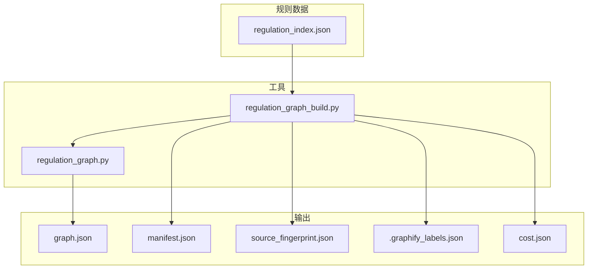
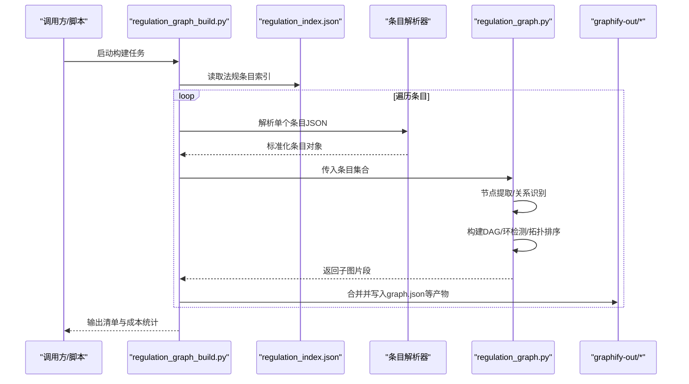
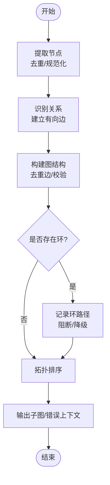
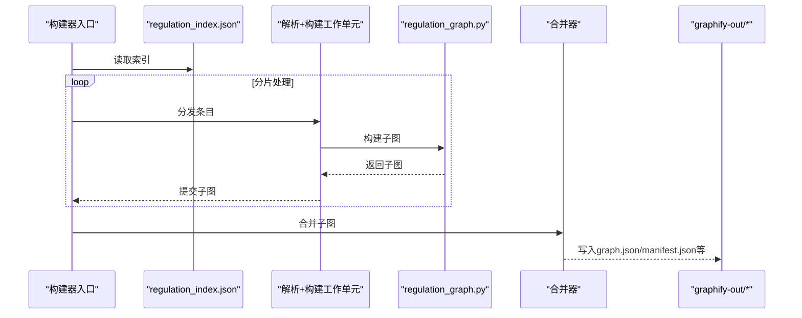
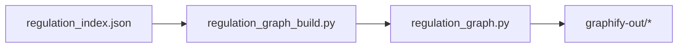

# 图谱生成引擎

<cite>
**本文引用的文件**   
- [regulation_graph.py](file://tools/regulation_graph.py)
- [regulation_graph_build.py](file://tools/regulation_graph_build.py)
- [test_regulation_graph.py](file://tests/test_regulation_graph.py)
- [test_regulation_graph_build.py](file://tests/test_regulation_graph_build.py)
- [graph.json](file://graphify-out/graph.json)
- [manifest.json](file://graphify-out/manifest.json)
- [source_fingerprint.json](file://graphify-out/source_fingerprint.json)
- [.graphify_labels.json](file://graphify-out/.graphify_labels.json)
- [cost.json](file://graphify-out/cost.json)
- [regulation_index.json](file://rules/regulation_index.json)
</cite>

## 目录
1. [简介](#简介)
2. [项目结构](#项目结构)
3. [核心组件](#核心组件)
4. [架构总览](#架构总览)
5. [详细组件分析](#详细组件分析)
6. [依赖关系分析](#依赖关系分析)
7. [性能考量](#性能考量)
8. [故障排查指南](#故障排查指南)
9. [结论](#结论)
10. [附录](#附录)

## 简介
本技术文档面向“法规关系图谱”的生成引擎，系统性阐述从法规数据源构建有向无环图（DAG）的算法与工程实现。重点覆盖：
- 节点提取、关系识别与图结构生成流程
- regulation_graph.py 中的核心算法：DAG 构建、循环依赖检测、拓扑排序
- regulation_graph_build.py 的批量处理机制与数据管道
- JSON 数据格式规范、元数据结构与版本管理策略
- 性能优化技巧与大规模数据处理方案

该引擎支持将分散的法规条文、设备规则与混合用途规则整合为可查询、可推理的关系图谱，便于后续审查、校验与可视化。

## 项目结构
与图谱生成相关的关键位置如下：
- 工具层
  - tools/regulation_graph.py：核心图构建算法（节点/边抽取、DAG 构建、环检测、拓扑排序）
  - tools/regulation_graph_build.py：批量处理与数据管道（读取索引、解析条目、并发构建、输出产物）
- 测试层
  - tests/test_regulation_graph.py：核心算法单元测试
  - tests/test_regulation_graph_build.py：批量构建流程测试
- 规则数据
  - rules/regulation_index.json：法规条目索引（用于批量扫描与调度）
- 输出产物
  - graphify-out/graph.json：最终图谱（节点与边集合）
  - graphify-out/manifest.json：构建清单与元数据
  - graphify-out/source_fingerprint.json：输入源指纹（用于增量与一致性校验）
  - graphify-out/.graphify_labels.json：标签映射（节点/边类型到显示名）
  - graphify-out/cost.json：构建成本统计（耗时、计数等）

**图表来源** 
- [regulation_graph.py](file://tools/regulation_graph.py)
- [regulation_graph_build.py](file://tools/regulation_graph_build.py)
- [regulation_index.json](file://rules/regulation_index.json)
- [graph.json](file://graphify-out/graph.json)
- [manifest.json](file://graphify-out/manifest.json)
- [source_fingerprint.json](file://graphify-out/source_fingerprint.json)
- [.graphify_labels.json](file://graphify-out/.graphify_labels.json)
- [cost.json](file://graphify-out/cost.json)

**章节来源**
- [regulation_graph.py](file://tools/regulation_graph.py)
- [regulation_graph_build.py](file://tools/regulation_graph_build.py)
- [regulation_index.json](file://rules/regulation_index.json)
- [graph.json](file://graphify-out/graph.json)
- [manifest.json](file://graphify-out/manifest.json)
- [source_fingerprint.json](file://graphify-out/source_fingerprint.json)
- [.graphify_labels.json](file://graphify-out/.graphify_labels.json)
- [cost.json](file://graphify-out/cost.json)

## 核心组件
- 图构建器（regulation_graph.py）
  - 负责从结构化法规数据中抽取节点与边，构建 DAG，执行环检测与拓扑排序，并输出标准图结构。
- 批量处理器（regulation_graph_build.py）
  - 负责读取索引、解析条目、组织数据管道、并发构建、合并结果、写入产物与元数据。
- 测试套件（tests/*）
  - 验证核心算法正确性与端到端构建流程稳定性。
- 数据与产物
  - 规则索引与条目 JSON；输出包含图谱、清单、指纹、标签映射与成本统计。

**章节来源**
- [regulation_graph.py](file://tools/regulation_graph.py)
- [regulation_graph_build.py](file://tools/regulation_graph_build.py)
- [test_regulation_graph.py](file://tests/test_regulation_graph.py)
- [test_regulation_graph_build.py](file://tests/test_regulation_graph_build.py)

## 架构总览
下图展示了从规则索引到最终图谱产物的整体流水线，以及核心模块间的交互关系。

**图表来源** 
- [regulation_graph_build.py](file://tools/regulation_graph_build.py)
- [regulation_index.json](file://rules/regulation_index.json)
- [regulation_graph.py](file://tools/regulation_graph.py)
- [graph.json](file://graphify-out/graph.json)
- [manifest.json](file://graphify-out/manifest.json)
- [source_fingerprint.json](file://graphify-out/source_fingerprint.json)
- [.graphify_labels.json](file://graphify-out/.graphify_labels.json)
- [cost.json](file://graphify-out/cost.json)

## 详细组件分析

### 核心算法：regulation_graph.py
本节聚焦于图构建的核心算法实现，包括节点提取、关系识别、DAG 构建、循环依赖检测与拓扑排序。

- 节点提取
  - 从每条法规条目的结构化字段中提取实体（如条款、设备、场所类型等），统一标识符与属性，去重后形成节点集合。
  - 节点类型通过标签映射进行规范化，确保跨条目一致。
- 关系识别
  - 基于条目内引用、交叉引用与业务语义，识别“依赖/要求/适用/派生”等边关系，建立有向边。
  - 边属性包含来源、置信度、权重等，便于后续分析与可视化。
- DAG 构建
  - 将节点与边组合成图结构，保证方向性且避免重复边。
  - 在构建阶段即进行初步环检测，失败时抛出异常或回退策略。
- 循环依赖检测
  - 使用深度优先搜索（DFS）或等价算法检测环，定位环路径，提供诊断信息。
  - 对发现的环采取阻断或降级策略，确保输出图为 DAG。
- 拓扑排序
  - 对 DAG 执行拓扑排序，得到稳定的处理顺序，便于下游按序消费（如渲染、校验、计算）。
  - 若存在不可消除的环，排序失败并返回错误上下文。

**图表来源** 
- [regulation_graph.py](file://tools/regulation_graph.py)

**章节来源**
- [regulation_graph.py](file://tools/regulation_graph.py)
- [test_regulation_graph.py](file://tests/test_regulation_graph.py)

### 批量处理：regulation_graph_build.py
本节说明批量处理机制与数据管道设计，涵盖索引读取、条目解析、并发构建、结果合并与产物写入。

- 索引读取
  - 从 rules/regulation_index.json 获取待处理的条目列表与元数据。
- 条目解析
  - 将每个条目的原始 JSON 转换为内部标准化对象，统一字段命名与类型。
- 并发构建
  - 对条目集合进行分片，并行调用核心图构建器，提升吞吐。
  - 线程/进程池大小可通过配置控制，避免资源争用。
- 结果合并
  - 合并各子图的节点与边，去重冲突，维护全局一致性。
- 产物写入
  - 输出 graph.json（节点与边）、manifest.json（清单与版本）、source_fingerprint.json（输入指纹）、.graphify_labels.json（标签映射）、cost.json（成本统计）。

**图表来源** 
- [regulation_graph_build.py](file://tools/regulation_graph_build.py)
- [regulation_index.json](file://rules/regulation_index.json)
- [regulation_graph.py](file://tools/regulation_graph.py)
- [graph.json](file://graphify-out/graph.json)
- [manifest.json](file://graphify-out/manifest.json)
- [source_fingerprint.json](file://graphify-out/source_fingerprint.json)
- [.graphify_labels.json](file://graphify-out/.graphify_labels.json)
- [cost.json](file://graphify-out/cost.json)

**章节来源**
- [regulation_graph_build.py](file://tools/regulation_graph_build.py)
- [test_regulation_graph_build.py](file://tests/test_regulation_graph_build.py)

### 数据模型与 JSON 规范
- 图谱结构（graph.json）
  - 节点集合：包含 id、type、label、properties 等字段，确保唯一性与可读性。
  - 边集合：包含 source、target、relation、weight、confidence 等字段，描述关系语义与强度。
- 清单与元数据（manifest.json）
  - 构建时间、版本、输入源清单、输出哈希、构建参数等。
- 输入源指纹（source_fingerprint.json）
  - 对输入文件集计算指纹，用于增量构建与一致性校验。
- 标签映射（.graphify_labels.json）
  - 定义节点类型与边类型的显示名称与分组，便于前端展示。
- 成本统计（cost.json）
  - 记录构建耗时、条目数、节点/边数量、并发度等指标。

示例参考路径（不展示内容）：
- [graph.json](file://graphify-out/graph.json)
- [manifest.json](file://graphify-out/manifest.json)
- [source_fingerprint.json](file://graphify-out/source_fingerprint.json)
- [.graphify_labels.json](file://graphify-out/.graphify_labels.json)
- [cost.json](file://graphify-out/cost.json)

**章节来源**
- [graph.json](file://graphify-out/graph.json)
- [manifest.json](file://graphify-out/manifest.json)
- [source_fingerprint.json](file://graphify-out/source_fingerprint.json)
- [.graphify_labels.json](file://graphify-out/.graphify_labels.json)
- [cost.json](file://graphify-out/cost.json)

### 自定义节点类型与边关系
- 节点类型扩展
  - 在标签映射中添加新类型与显示名，确保解析器能识别并归类。
  - 在条目解析阶段，根据字段映射将原始数据归一化为标准节点。
- 边关系扩展
  - 定义新的关系类型与语义，更新关系识别逻辑，确保方向性与权重合理。
  - 在环检测与拓扑排序中保持对新关系的兼容。

示例参考路径（不展示内容）：
- [.graphify_labels.json](file://graphify-out/.graphify_labels.json)
- [regulation_graph.py](file://tools/regulation_graph.py)
- [regulation_graph_build.py](file://tools/regulation_graph_build.py)

**章节来源**
- [.graphify_labels.json](file://graphify-out/.graphify_labels.json)
- [regulation_graph.py](file://tools/regulation_graph.py)
- [regulation_graph_build.py](file://tools/regulation_graph_build.py)

### 从法规数据源生成图谱文件的步骤
- 准备输入
  - 确保 rules/regulation_index.json 完整且最新。
  - 如有新增条目，更新索引与条目 JSON。
- 运行构建
  - 调用 regulation_graph_build.py，指定输入索引与输出目录。
  - 监控 cost.json 与日志，确认构建成功。
- 验证输出
  - 检查 graph.json 的节点与边数量是否合理。
  - 查看 manifest.json 的版本与构建参数。
  - 对比 source_fingerprint.json 以确认输入未变更。

示例参考路径（不展示内容）：
- [regulation_index.json](file://rules/regulation_index.json)
- [regulation_graph_build.py](file://tools/regulation_graph_build.py)
- [graph.json](file://graphify-out/graph.json)
- [manifest.json](file://graphify-out/manifest.json)
- [source_fingerprint.json](file://graphify-out/source_fingerprint.json)

**章节来源**
- [regulation_index.json](file://rules/regulation_index.json)
- [regulation_graph_build.py](file://tools/regulation_graph_build.py)
- [graph.json](file://graphify-out/graph.json)
- [manifest.json](file://graphify-out/manifest.json)
- [source_fingerprint.json](file://graphify-out/source_fingerprint.json)

## 依赖关系分析
- 模块耦合
  - regulation_graph_build.py 依赖 regulation_graph.py 提供的图构建能力。
  - 两者共同依赖 rules/regulation_index.json 作为输入源。
- 外部依赖
  - JSON 读写、并发库、文件系统操作等。
- 潜在循环依赖
  - 构建器与图构建器之间为单向依赖，避免循环。
  - 若引入缓存或中间态，需确保不会形成模块级循环。

**图表来源** 
- [regulation_index.json](file://rules/regulation_index.json)
- [regulation_graph_build.py](file://tools/regulation_graph_build.py)
- [regulation_graph.py](file://tools/regulation_graph.py)
- [graph.json](file://graphify-out/graph.json)
- [manifest.json](file://graphify-out/manifest.json)
- [source_fingerprint.json](file://graphify-out/source_fingerprint.json)
- [.graphify_labels.json](file://graphify-out/.graphify_labels.json)
- [cost.json](file://graphify-out/cost.json)

**章节来源**
- [regulation_graph_build.py](file://tools/regulation_graph_build.py)
- [regulation_graph.py](file://tools/regulation_graph.py)
- [regulation_index.json](file://rules/regulation_index.json)

## 性能考量
- 并发与分片
  - 对条目集合进行分片，使用线程/进程池并行构建，提高吞吐。
  - 合理设置并发度，避免 I/O 与 CPU 瓶颈。
- 内存与序列化
  - 大图谱构建时注意内存占用，必要时采用流式写入与增量合并。
  - 序列化/反序列化开销可通过批量化与压缩降低。
- 环检测与排序
  - DFS 环检测复杂度 O(V+E)，拓扑排序 O(V+E)，应尽量避免不必要的重复计算。
- 增量构建
  - 利用 source_fingerprint.json 与 manifest.json 进行差异检测，仅重建受影响部分。
- 缓存与复用
  - 对稳定子图进行缓存，减少重复构建。
  - 标签映射与关系规则可缓存以提升解析速度。

[本节为通用性能指导，不直接分析具体文件]

## 故障排查指南
- 常见错误
  - 环检测失败：检查交叉引用是否正确，必要时手动修正或降级关系。
  - 拓扑排序失败：确认已消除所有环，或调整关系方向。
  - 构建中断：检查输入索引完整性与权限，确认磁盘空间充足。
- 诊断信息
  - 查看 cost.json 中的耗时与计数，定位慢点。
  - 检查 manifest.json 的版本与参数，确认构建环境一致。
  - 对比 source_fingerprint.json 以确认输入未变更。
- 测试辅助
  - 运行 tests/test_regulation_graph.py 与 tests/test_regulation_graph_build.py 快速验证核心逻辑与端到端流程。

**章节来源**
- [test_regulation_graph.py](file://tests/test_regulation_graph.py)
- [test_regulation_graph_build.py](file://tests/test_regulation_graph_build.py)
- [cost.json](file://graphify-out/cost.json)
- [manifest.json](file://graphify-out/manifest.json)
- [source_fingerprint.json](file://graphify-out/source_fingerprint.json)

## 结论
本图谱生成引擎通过清晰的模块化设计与稳健的算法实现，实现了从法规数据到关系图谱的高效转换。核心算法保障 DAG 的正确性与可排序性，批量处理机制提升吞吐与可扩展性。配合完善的 JSON 规范与元数据管理，系统具备良好的可维护性与可观测性。建议在生产环境中结合增量构建与缓存策略，进一步优化大规模数据处理性能。

[本节为总结性内容，不直接分析具体文件]

## 附录
- 术语表
  - 节点：法规实体（条款、设备、场所类型等）
  - 边：实体间关系（依赖、要求、适用、派生等）
  - DAG：有向无环图
  - 拓扑排序：线性化 DAG 的顺序
- 参考路径
  - 核心算法：[regulation_graph.py](file://tools/regulation_graph.py)
  - 批量处理：[regulation_graph_build.py](file://tools/regulation_graph_build.py)
  - 规则索引：[regulation_index.json](file://rules/regulation_index.json)
  - 输出产物：[graph.json](file://graphify-out/graph.json), [manifest.json](file://graphify-out/manifest.json), [source_fingerprint.json](file://graphify-out/source_fingerprint.json), [.graphify_labels.json](file://graphify-out/.graphify_labels.json), [cost.json](file://graphify-out/cost.json)

[本节为补充信息，不直接分析具体文件]