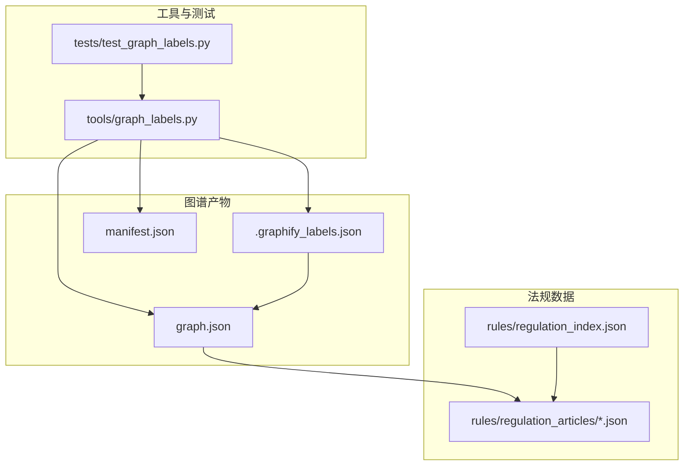
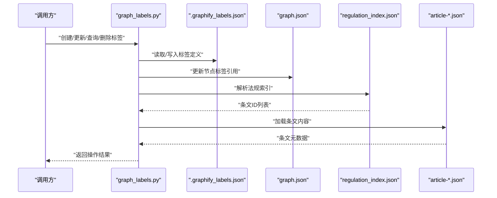
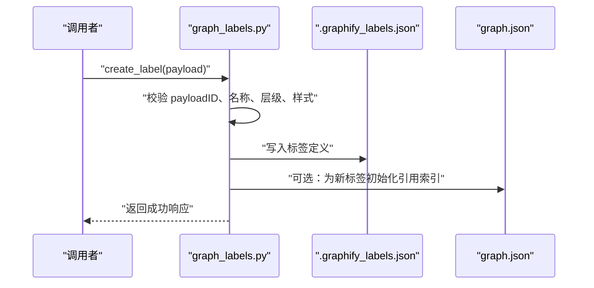
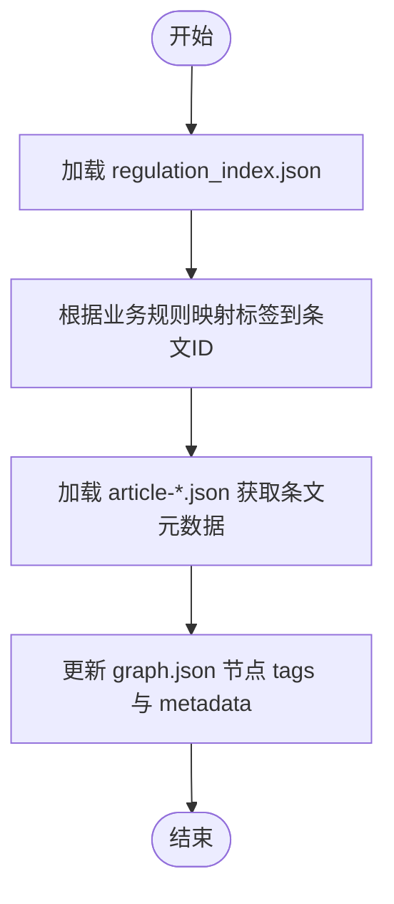
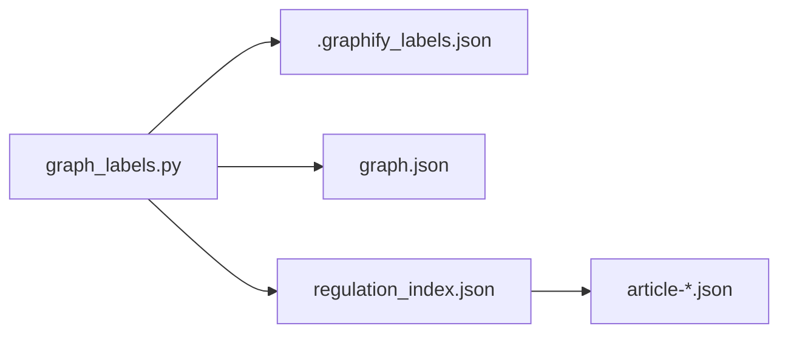

# 标签管理系统

<cite>
**本文引用的文件**   
- [graph_labels.py](file://tools/graph_labels.py)
- [test_graph_labels.py](file://tests/test_graph_labels.py)
- [.graphify_labels.json](file://graphify-out/.graphify_labels.json)
- [graph.json](file://graphify-out/graph.json)
- [manifest.json](file://graphify-out/manifest.json)
- [regulation_index.json](file://rules/regulation_index.json)
- [article-001.json](file://rules/regulation_articles/article-001.json)
</cite>

## 目录
1. [简介](#简介)
2. [项目结构](#项目结构)
3. [核心组件](#核心组件)
4. [架构总览](#架构总览)
5. [详细组件分析](#详细组件分析)
6. [依赖关系分析](#依赖关系分析)
7. [性能考量](#性能考量)
8. [故障排查指南](#故障排查指南)
9. [结论](#结论)
10. [附录](#附录)

## 简介
本技术文档围绕“标签管理系统”展开，聚焦图谱标签的定义、存储与管理机制。重点说明 tools/graph_labels.py 提供的标签 API（创建、更新、查询、删除），.label 文件的 JSON 格式规范（属性、样式配置、层级关系），以及标签与法规条文的关联机制和多语言支持。同时给出为节点添加语义标签、实现标签过滤与动态样式应用的实践示例，并提供批量导入导出工具与标签验证规则。

## 项目结构
与标签管理相关的关键位置：
- 工具层：tools/graph_labels.py 提供标签 CRUD 接口与批量导入导出能力
- 测试层：tests/test_graph_labels.py 覆盖标签 API 的行为用例
- 数据输出：graphify-out/.graphify_labels.json 保存标签定义；graphify-out/graph.json 保存图谱节点/边及标签引用；graphify-out/manifest.json 描述产物清单
- 法规数据：rules/regulation_index.json 索引法规条目；rules/regulation_articles/*.json 具体条文内容，用于建立标签与条文的关联

图表来源
- [graph_labels.py](file://tools/graph_labels.py)
- [test_graph_labels.py](file://tests/test_graph_labels.py)
- [.graphify_labels.json](file://graphify-out/.graphify_labels.json)
- [graph.json](file://graphify-out/graph.json)
- [manifest.json](file://graphify-out/manifest.json)
- [regulation_index.json](file://rules/regulation_index.json)
- [article-001.json](file://rules/regulation_articles/article-001.json)

章节来源
- [graph_labels.py](file://tools/graph_labels.py)
- [test_graph_labels.py](file://tests/test_graph_labels.py)
- [.graphify_labels.json](file://graphify-out/.graphify_labels.json)
- [graph.json](file://graphify-out/graph.json)
- [manifest.json](file://graphify-out/manifest.json)
- [regulation_index.json](file://rules/regulation_index.json)
- [article-001.json](file://rules/regulation_articles/article-001.json)

## 核心组件
- 标签模型与存储
  - 标签定义集中存储在 .graphify_labels.json，包含标签 ID、名称、层级、样式、多语言文本等字段
  - 图谱节点通过 graph.json 中的标签引用字段与标签定义关联
- 标签 API（tools/graph_labels.py）
  - 提供创建、更新、查询、删除标签的函数或命令行入口
  - 支持按条件筛选、批量导入导出、校验规则执行
- 法规关联
  - 通过 regulation_index.json 与 article-*.json 将标签与法规条文建立映射，便于在审查流程中自动标注与追溯
- 多语言支持
  - 标签文本与样式说明可包含多语言键值，API 支持按语言环境返回对应文本

章节来源
- [graph_labels.py](file://tools/graph_labels.py)
- [.graphify_labels.json](file://graphify-out/.graphify_labels.json)
- [graph.json](file://graphify-out/graph.json)
- [regulation_index.json](file://rules/regulation_index.json)
- [article-001.json](file://rules/regulation_articles/article-001.json)

## 架构总览
标签管理系统以“标签定义 + 图谱引用 + 法规关联”为核心，API 层统一对外暴露 CRUD 与批量操作，数据层读写 .graphify_labels.json 与 graph.json，并通过法规索引与条文文件完成语义关联。

图表来源
- [graph_labels.py](file://tools/graph_labels.py)
- [.graphify_labels.json](file://graphify-out/.graphify_labels.json)
- [graph.json](file://graphify-out/graph.json)
- [regulation_index.json](file://rules/regulation_index.json)
- [article-001.json](file://rules/regulation_articles/article-001.json)

## 详细组件分析

### 标签 API（tools/graph_labels.py）
- 功能范围
  - 创建标签：定义标签 ID、名称、层级、样式、多语言文本等
  - 更新标签：修改已有标签的属性与样式
  - 查询标签：按 ID、名称、层级、样式关键字等条件检索
  - 删除标签：移除标签并清理图谱节点的引用
  - 批量导入导出：从外部 JSON 批量导入标签定义，或将现有标签导出为 JSON
  - 校验规则：对标签 ID 唯一性、必填字段、层级合法性等进行校验
- 典型调用流程（创建标签）

图表来源
- [graph_labels.py](file://tools/graph_labels.py)
- [.graphify_labels.json](file://graphify-out/.graphify_labels.json)
- [graph.json](file://graphify-out/graph.json)

章节来源
- [graph_labels.py](file://tools/graph_labels.py)
- [test_graph_labels.py](file://tests/test_graph_labels.py)

### .label 文件 JSON 格式规范
- 文件定位
  - 标签定义文件：graphify-out/.graphify_labels.json
  - 图谱节点文件：graphify-out/graph.json
- 标签对象字段建议
  - id：字符串，标签唯一标识
  - name：字符串，默认语言显示名
  - labels：对象，多语言文本映射（如 zh-TW、en-US）
  - category：字符串，分类（如“设备”“区域”“风险”）
  - hierarchy：数组，层级路径（如 ["设施", "消防", "喷淋头"]）
  - style：对象，样式配置（颜色、图标、边框、透明度等）
  - metadata：对象，扩展属性（版本、来源、更新时间）
  - rules：对象，校验规则（必填字段、取值范围、正则表达式）
- 图谱节点中的标签引用
  - node.tags：数组，引用标签 ID 列表
  - node.style_overrides：对象，覆盖全局样式
- 示例参考
  - 标签定义参考：[.graphify_labels.json](file://graphify-out/.graphify_labels.json)
  - 节点引用参考：[graph.json](file://graphify-out/graph.json)

章节来源
- [.graphify_labels.json](file://graphify-out/.graphify_labels.json)
- [graph.json](file://graphify-out/graph.json)

### 标签与法规条文的关联机制
- 关联方式
  - 使用 regulation_index.json 维护标签与条文 ID 的映射关系
  - 通过 article-*.json 获取条文详情，用于展示与审计追踪
- 典型流程（为节点添加法规标签）

图表来源
- [regulation_index.json](file://rules/regulation_index.json)
- [article-001.json](file://rules/regulation_articles/article-001.json)
- [graph.json](file://graphify-out/graph.json)

章节来源
- [regulation_index.json](file://rules/regulation_index.json)
- [article-001.json](file://rules/regulation_articles/article-001.json)
- [graph.json](file://graphify-out/graph.json)

### 多语言支持
- 标签文本
  - 在标签对象的 labels 字段中以语言代码为键，提供不同语言的显示文本
- API 行为
  - 查询时可按语言参数返回对应文本
  - 导入时可合并多语言键值，避免覆盖已有翻译
- 最佳实践
  - 保持语言键集合一致，缺失时使用默认语言回退
  - 在样式说明与提示文案中也提供多语言版本

章节来源
- [.graphify_labels.json](file://graphify-out/.graphify_labels.json)
- [graph_labels.py](file://tools/graph_labels.py)

### 批量导入导出工具
- 导入
  - 输入：外部 JSON（包含标签定义数组）
  - 处理：去重、校验、合并多语言、更新 .graphify_labels.json
  - 输出：导入报告（成功/失败计数、错误明细）
- 导出
  - 输入：当前 .graphify_labels.json
  - 处理：格式化、排序、附加元数据
  - 输出：标准 JSON 文件，便于版本管理与协作

章节来源
- [graph_labels.py](file://tools/graph_labels.py)
- [.graphify_labels.json](file://graphify-out/.graphify_labels.json)

### 标签验证规则
- 基本校验
  - id 唯一性、非空、字符集限制
  - name 非空、长度限制
  - hierarchy 层级合法（无循环、深度限制）
  - style 字段类型与取值范围校验
- 高级校验
  - 与法规条文的映射完整性检查
  - 图谱节点引用一致性检查（孤儿标签、未引用标签）
- 错误处理
  - 收集所有错误并生成报告，支持增量修复

章节来源
- [graph_labels.py](file://tools/graph_labels.py)
- [test_graph_labels.py](file://tests/test_graph_labels.py)

### 实践示例（不直接展示代码）
- 为图谱节点添加语义标签
  - 步骤：准备标签定义 -> 调用 create_label -> 更新节点 tags -> 保存 graph.json
  - 参考路径：[graph_labels.py](file://tools/graph_labels.py)、[graph.json](file://graphify-out/graph.json)
- 实现标签过滤
  - 步骤：按 category/hierarchy/style 构建查询条件 -> 调用 query_labels -> 返回匹配标签 -> 过滤节点
  - 参考路径：[graph_labels.py](file://tools/graph_labels.py)、[.graphify_labels.json](file://graphify-out/.graphify_labels.json)
- 动态样式应用
  - 步骤：读取节点 style_overrides -> 合并全局样式 -> 渲染时应用
  - 参考路径：[graph.json](file://graphify-out/graph.json)、[.graphify_labels.json](file://graphify-out/.graphify_labels.json)

章节来源
- [graph_labels.py](file://tools/graph_labels.py)
- [.graphify_labels.json](file://graphify-out/.graphify_labels.json)
- [graph.json](file://graphify-out/graph.json)

## 依赖关系分析
- 模块耦合
  - graph_labels.py 依赖 .graphify_labels.json 与 graph.json 进行读写
  - 通过 regulation_index.json 与 article-*.json 建立标签与法规的关联
- 潜在循环依赖
  - 确保标签定义与图谱引用单向依赖，避免反向引用导致循环
- 外部依赖
  - JSON 解析库、文件系统访问、日志记录

图表来源
- [graph_labels.py](file://tools/graph_labels.py)
- [.graphify_labels.json](file://graphify-out/.graphify_labels.json)
- [graph.json](file://graphify-out/graph.json)
- [regulation_index.json](file://rules/regulation_index.json)
- [article-001.json](file://rules/regulation_articles/article-001.json)

章节来源
- [graph_labels.py](file://tools/graph_labels.py)
- [.graphify_labels.json](file://graphify-out/.graphify_labels.json)
- [graph.json](file://graphify-out/graph.json)
- [regulation_index.json](file://rules/regulation_index.json)
- [article-001.json](file://rules/regulation_articles/article-001.json)

## 性能考量
- I/O 优化
  - 批量导入导出采用流式读写，减少内存占用
  - 缓存常用查询结果（如标签索引）
- 计算优化
  - 标签过滤使用索引加速（按 category、hierarchy、style 建索引）
  - 校验阶段并行化，提升大规模数据集的处理速度
- 存储优化
  - 压缩 .graphify_labels.json，按需加载
  - 分区存储大图谱文件，提高查询效率

## 故障排查指南
- 常见问题
  - 标签 ID 冲突：检查唯一性与导入去重逻辑
  - 层级非法：校验层级深度与路径合法性
  - 样式字段类型错误：确认 JSON Schema 与默认值
  - 法规映射缺失：核对 regulation_index.json 与 article-*.json
- 调试建议
  - 启用详细日志，记录每次 CRUD 操作的输入输出
  - 使用测试用例复现问题，逐步缩小范围
  - 导出中间状态文件，对比差异定位问题

章节来源
- [test_graph_labels.py](file://tests/test_graph_labels.py)
- [graph_labels.py](file://tools/graph_labels.py)

## 结论
标签管理系统通过统一的 API 与标准化的 JSON 格式，实现了标签的创建、更新、查询、删除与批量操作，结合法规关联与多语言支持，满足复杂图谱场景下的语义标注需求。通过完善的校验规则与性能优化策略，系统具备良好的可扩展性与稳定性。

## 附录
- 术语表
  - 标签：用于描述图谱节点语义的元数据单元
  - 层级：标签的组织结构，支持树形分类
  - 样式：控制标签在可视化中的外观表现
  - 法规关联：将标签与法规条文建立映射，便于合规审查
- 参考文件
  - 标签定义：[.graphify_labels.json](file://graphify-out/.graphify_labels.json)
  - 图谱节点：[graph.json](file://graphify-out/graph.json)
  - 法规索引：[regulation_index.json](file://rules/regulation_index.json)
  - 条文样例：[article-001.json](file://rules/regulation_articles/article-001.json)
  - API 实现：[graph_labels.py](file://tools/graph_labels.py)
  - 测试用例：[test_graph_labels.py](file://tests/test_graph_labels.py)