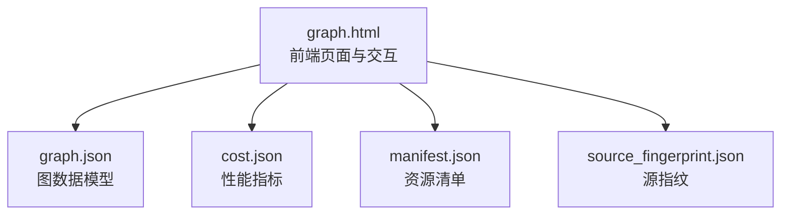
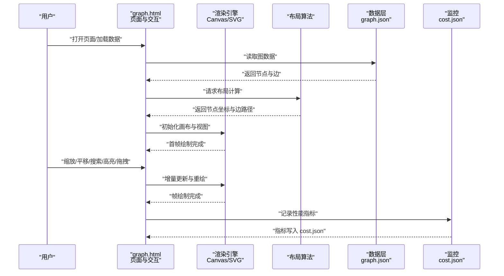
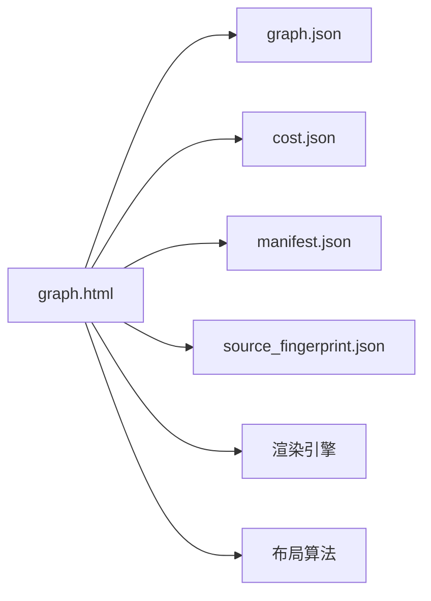

# 渲染与交互

<cite>
**本文引用的文件**   
- [graph.html](file://graphify-out/graph.html)
- [cost.json](file://graphify-out/cost.json)
- [graph.json](file://graphify-out/graph.json)
- [manifest.json](file://graphify-out/manifest.json)
- [source_fingerprint.json](file://graphify-out/source_fingerprint.json)
</cite>

## 目录
1. [简介](#简介)
2. [项目结构](#项目结构)
3. [核心组件](#核心组件)
4. [架构总览](#架构总览)
5. [详细组件分析](#详细组件分析)
6. [依赖关系分析](#依赖关系分析)
7. [性能考量](#性能考量)
8. [故障排查指南](#故障排查指南)
9. [结论](#结论)
10. [附录](#附录)

## 简介
本技术文档聚焦于渲染与交互系统，围绕 graphify-out 目录下的前端产物进行说明。重点包括：
- HTML5 Canvas/SVG 渲染引擎的实现原理（节点布局、边绘制、动画）
- graph.html 的前端交互能力（缩放、平移、搜索、高亮）
- cost.json 的性能指标解读与优化策略
- 自定义节点样式、拖拽操作与事件响应的实践方法
- 响应式设计与跨浏览器兼容性处理
- 渲染性能调优与内存管理最佳实践

## 项目结构
graphify-out 目录为渲染产物输出位置，包含：
- graph.html：前端页面入口，承载渲染与交互逻辑
- graph.json：图数据模型（节点、边等）
- cost.json：运行时性能指标与统计信息
- manifest.json：资源清单与版本元数据
- source_fingerprint.json：源文件指纹，用于缓存与更新校验

图表来源
- [graph.html](file://graphify-out/graph.html)
- [graph.json](file://graphify-out/graph.json)
- [cost.json](file://graphify-out/cost.json)
- [manifest.json](file://graphify-out/manifest.json)
- [source_fingerprint.json](file://graphify-out/source_fingerprint.json)

章节来源
- [graph.html](file://graphify-out/graph.html)
- [graph.json](file://graphify-out/graph.json)
- [cost.json](file://graphify-out/cost.json)
- [manifest.json](file://graphify-out/manifest.json)
- [source_fingerprint.json](file://graphify-out/source_fingerprint.json)

## 核心组件
- 渲染引擎
  - 基于 HTML5 Canvas 或 SVG 的图形绘制层，负责节点形状、文本、连线、箭头、标签等元素的绘制与重绘
  - 支持批量绘制与增量更新，减少重排重绘开销
- 布局算法
  - 节点布局采用层次化或力导向算法，自动计算节点坐标与间距，避免重叠
  - 边的路由与弯曲控制，确保可读性与视觉整洁
- 交互模块
  - 缩放与平移：通过变换矩阵实现视口控制
  - 搜索与高亮：按关键字匹配节点并高亮显示路径
  - 拖拽与选择：支持节点拖拽移动、多选与批量操作
- 数据层
  - graph.json 提供节点与边的结构化数据
  - cost.json 记录渲染耗时、帧率、内存占用等指标
  - manifest.json 与 source_fingerprint.json 用于资源管理与缓存策略

章节来源
- [graph.html](file://graphify-out/graph.html)
- [graph.json](file://graphify-out/graph.json)
- [cost.json](file://graphify-out/cost.json)
- [manifest.json](file://graphify-out/manifest.json)
- [source_fingerprint.json](file://graphify-out/source_fingerprint.json)

## 架构总览
下图展示渲染与交互系统的整体架构与数据流：

图表来源
- [graph.html](file://graphify-out/graph.html)
- [graph.json](file://graphify-out/graph.json)
- [cost.json](file://graphify-out/cost.json)

## 详细组件分析

### 渲染引擎（Canvas/SVG）
- 绘制管线
  - 清空画布 → 应用变换矩阵 → 绘制背景网格 → 绘制边与箭头 → 绘制节点与标签 → 叠加高亮与选中状态
  - 使用离屏缓冲与脏矩形区域更新，降低重绘范围
- 节点与边
  - 节点：矩形、圆角矩形、圆形、多边形等；支持图标、徽章、状态指示
  - 边：直线、折线、曲线；支持箭头、虚线、颜色渐变与粗细变化
- 动画效果
  - 过渡动画：淡入淡出、位移、缩放
  - 路径动画：沿边流动的高亮效果，用于强调连接关系
  - 帧率控制：requestAnimationFrame 驱动，节流与防抖优化

章节来源
- [graph.html](file://graphify-out/graph.html)

### 布局算法
- 层次化布局
  - 将节点分层排列，适合流程或层级图
  - 自动调整层间距与节点间距，避免交叉
- 力导向布局
  - 模拟物理力（斥力、引力、弹簧力），收敛到稳定布局
  - 支持约束条件（固定节点、边界限制）
- 边路由
  - 自动选择最短路径，避免遮挡
  - 支持手动调整关键边的路由

章节来源
- [graph.html](file://graphify-out/graph.html)
- [graph.json](file://graphify-out/graph.json)

### 交互模块（graph.html）
- 缩放与平移
  - 鼠标滚轮缩放，中心点保持
  - 按住中键或空格+拖拽平移画布
  - 变换矩阵统一处理缩放与平移
- 搜索与高亮
  - 输入关键字，匹配节点标题或属性
  - 高亮匹配节点及关联边，其他元素淡化
- 拖拽与选择
  - 单节点拖拽移动，支持吸附对齐
  - 框选多选，批量操作（移动、删除、分组）
- 事件响应
  - 点击、双击、右键菜单
  - 键盘快捷键（ESC 取消、Ctrl+A 全选）

章节来源
- [graph.html](file://graphify-out/graph.html)

### 数据层（graph.json）
- 节点定义
  - id、类型、标签、样式、状态、扩展属性
- 边定义
  - source、target、类型、标签、样式、权重
- 布局参数
  - 初始视图、缩放级别、节点间距、边弯曲度

章节来源
- [graph.json](file://graphify-out/graph.json)

### 性能监控（cost.json）
- 指标字段
  - 首帧渲染时间、平均帧率、重绘次数、内存峰值
  - 交互延迟（缩放、平移、搜索响应时间）
- 用途
  - 定位性能瓶颈，指导优化策略
  - 对比不同布局与渲染方案的优劣

章节来源
- [cost.json](file://graphify-out/cost.json)

### 资源清单与指纹（manifest.json、source_fingerprint.json）
- manifest.json
  - 资源版本、依赖库、构建哈希
- source_fingerprint.json
  - 源文件内容指纹，用于缓存失效与增量更新

章节来源
- [manifest.json](file://graphify-out/manifest.json)
- [source_fingerprint.json](file://graphify-out/source_fingerprint.json)

## 依赖关系分析
graph.html 依赖 graph.json 提供数据，依赖渲染引擎进行绘制，依赖布局算法计算位置，依赖 cost.json 记录性能指标。manifest.json 与 source_fingerprint.json 用于资源管理与缓存策略。

图表来源
- [graph.html](file://graphify-out/graph.html)
- [graph.json](file://graphify-out/graph.json)
- [cost.json](file://graphify-out/cost.json)
- [manifest.json](file://graphify-out/manifest.json)
- [source_fingerprint.json](file://graphify-out/source_fingerprint.json)

章节来源
- [graph.html](file://graphify-out/graph.html)
- [graph.json](file://graphify-out/graph.json)
- [cost.json](file://graphify-out/cost.json)
- [manifest.json](file://graphify-out/manifest.json)
- [source_fingerprint.json](file://graphify-out/source_fingerprint.json)

## 性能考量
- 渲染性能
  - 使用离屏缓冲与脏矩形更新，减少重绘范围
  - 批量绘制与合并路径，降低绘制调用次数
  - 按需加载与懒渲染，仅绘制可视区域内的节点与边
- 布局性能
  - 分批次计算布局，避免主线程阻塞
  - 使用 Web Worker 执行复杂布局计算
- 内存管理
  - 及时释放不再使用的对象与纹理
  - 使用弱引用与对象池，避免内存泄漏
- 交互性能
  - 节流与防抖处理高频事件（滚动、拖拽）
  - 使用 requestAnimationFrame 保证流畅动画

章节来源
- [graph.html](file://graphify-out/graph.html)
- [cost.json](file://graphify-out/cost.json)

## 故障排查指南
- 常见问题
  - 渲染卡顿：检查重绘频率与绘制复杂度，启用脏矩形更新
  - 布局错乱：验证节点尺寸与边路由参数，调整布局算法参数
  - 交互无响应：检查事件监听器是否正确绑定，确认 DOM 状态
  - 内存泄漏：使用开发者工具检测内存快照，定位未释放对象
- 调试技巧
  - 在 graph.html 中添加日志输出，记录关键步骤与异常
  - 使用浏览器性能面板分析渲染与布局耗时
  - 对比 cost.json 指标，定位性能瓶颈

章节来源
- [graph.html](file://graphify-out/graph.html)
- [cost.json](file://graphify-out/cost.json)

## 结论
本渲染与交互系统以 graph.html 为核心，结合 graph.json 的数据模型与 cost.json 的性能监控，实现了高效的图形渲染与丰富的交互体验。通过合理的布局算法、优化的渲染管线与完善的性能监控，系统能够应对大规模图数据的可视化需求。未来可进一步探索 WebGL 渲染、GPU 加速与更智能的布局策略，以提升性能与用户体验。

## 附录

### 自定义节点样式
- 目标：根据节点类型或状态动态改变外观
- 步骤：
  - 在 graph.json 中为节点添加样式属性（如 fill、stroke、icon）
  - 在渲染引擎中读取样式属性并应用到绘制上下文
  - 支持 CSS 类名映射，便于统一管理样式
- 示例参考：[graph.html](file://graphify-out/graph.html)、[graph.json](file://graphify-out/graph.json)

### 实现拖拽操作
- 目标：支持节点拖拽移动与吸附对齐
- 步骤：
  - 监听 mousedown/mousemove/mouseup 事件
  - 计算拖拽偏移量并更新节点坐标
  - 可选：启用吸附网格或与其他节点对齐
- 示例参考：[graph.html](file://graphify-out/graph.html)

### 事件响应机制
- 目标：统一处理点击、双击、右键菜单等事件
- 步骤：
  - 在渲染层注册事件监听器
  - 根据命中测试确定目标节点或边
  - 触发对应回调函数，更新状态并重绘
- 示例参考：[graph.html](file://graphify-out/graph.html)

### 响应式设计适配
- 目标：在不同屏幕尺寸下保持良好的视觉效果
- 步骤：
  - 使用 viewport meta 标签设置视口
  - 根据容器尺寸动态调整画布大小与缩放级别
  - 适配移动端触摸手势（双指缩放、滑动平移）
- 示例参考：[graph.html](file://graphify-out/graph.html)

### 跨浏览器兼容性处理
- 目标：确保在现代浏览器中正常运行
- 步骤：
  - 使用 Polyfill 兼容旧版浏览器特性
  - 检测浏览器能力并降级处理（如不支持 Canvas 则提示）
  - 避免使用实验性 API，优先选择稳定接口
- 示例参考：[graph.html](file://graphify-out/graph.html)

### 渲染性能调优
- 目标：提升渲染效率与帧率
- 步骤：
  - 启用硬件加速（transform3d、will-change）
  - 减少绘制调用次数，合并路径与批量绘制
  - 使用离屏缓冲与脏矩形更新
- 示例参考：[graph.html](file://graphify-out/graph.html)、[cost.json](file://graphify-out/cost.json)

### 内存管理最佳实践
- 目标：避免内存泄漏与峰值过高
- 步骤：
  - 及时释放不再使用的对象与纹理
  - 使用对象池复用频繁创建的对象
  - 定期清理缓存与中间结果
- 示例参考：[graph.html](file://graphify-out/graph.html)、[cost.json](file://graphify-out/cost.json)