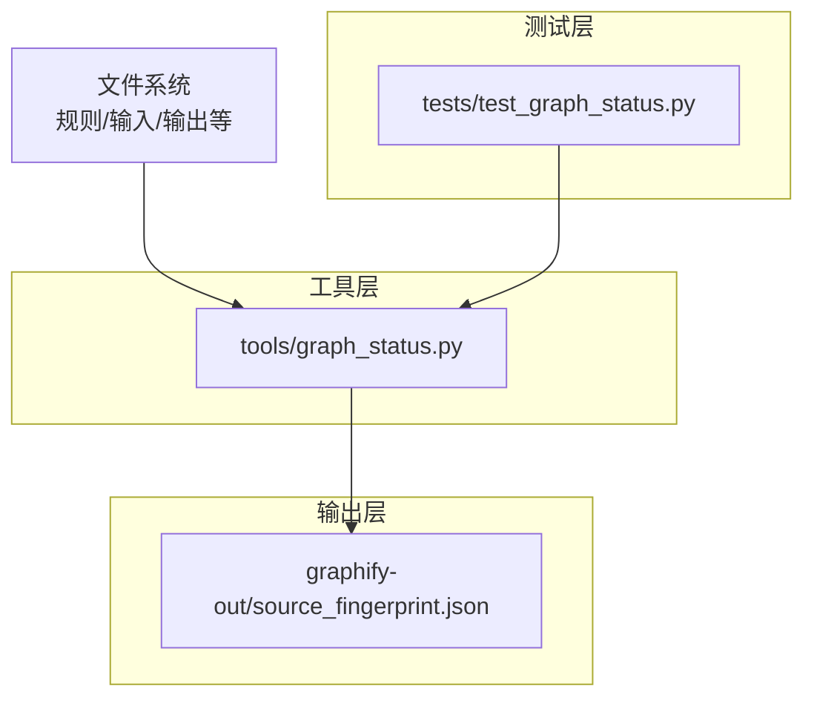
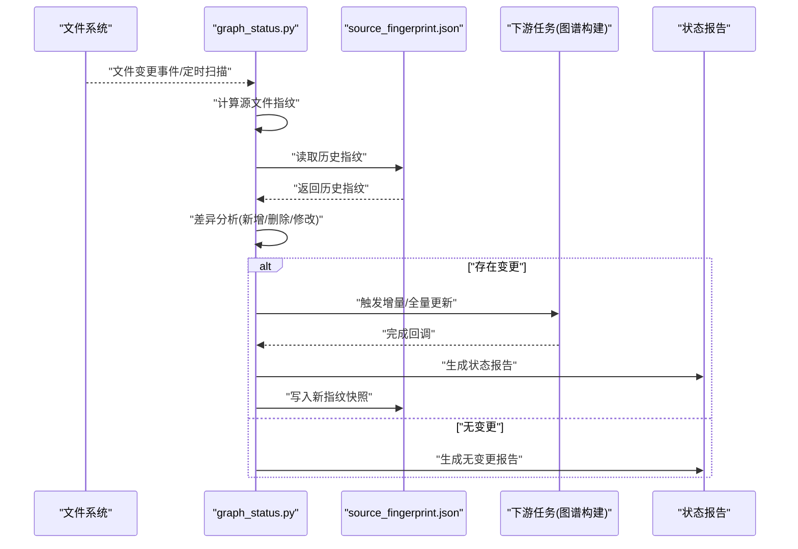
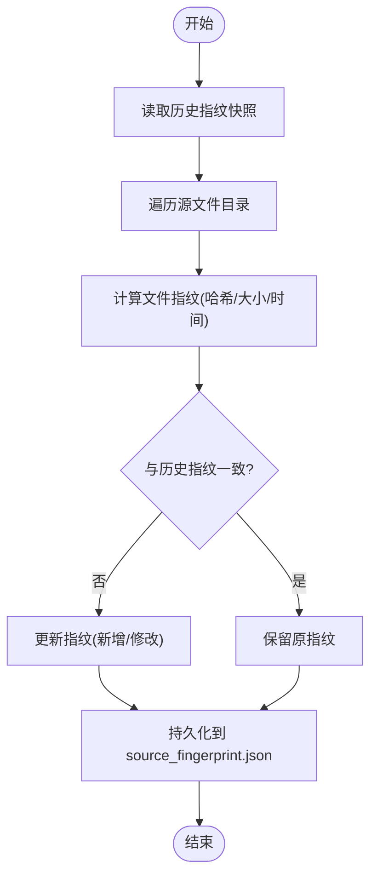
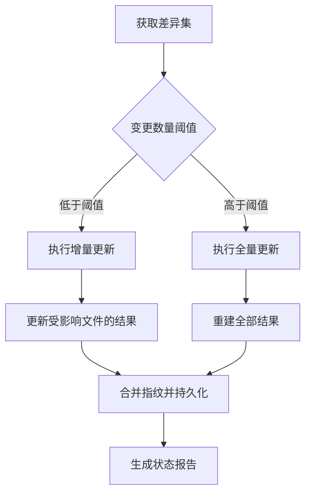
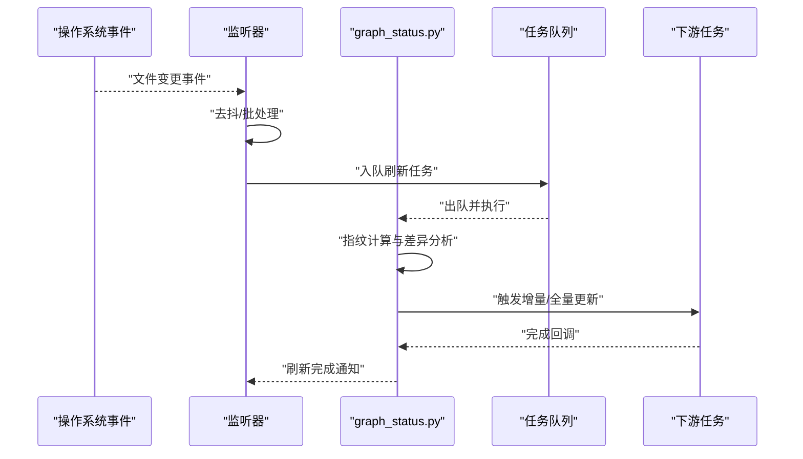
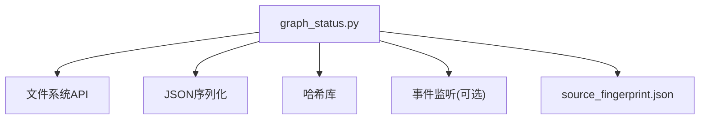

# 状态监控系统

<cite>
**本文引用的文件**   
- [graph_status.py](file://tools/graph_status.py)
- [source_fingerprint.json](file://graphify-out/source_fingerprint.json)
- [test_graph_status.py](file://tests/test_graph_status.py)
</cite>

## 目录
1. [简介](#简介)
2. [项目结构](#项目结构)
3. [核心组件](#核心组件)
4. [架构总览](#架构总览)
5. [详细组件分析](#详细组件分析)
6. [依赖关系分析](#依赖关系分析)
7. [性能考量](#性能考量)
8. [故障排查指南](#故障排查指南)
9. [结论](#结论)
10. [附录](#附录)

## 简介
本技术文档围绕“状态监控系统”展开，重点解释图谱状态检测机制，包括文件变更监控、版本比对与增量更新策略。文档将深入解析 tools/graph_status.py 中的状态检查算法，涵盖源文件指纹计算、差异分析与同步状态判断；同时记录 graphify-out/source_fingerprint.json 的数据结构与更新机制。此外，提供文件系统监听、自动刷新触发与冲突解决的具体实现思路，并总结状态缓存策略与性能优化技术，最后给出状态报告生成与异常处理机制的说明。

## 项目结构
与状态监控相关的代码与数据主要位于以下位置：
- tools/graph_status.py：状态检查与增量更新的核心逻辑
- graphify-out/source_fingerprint.json：持久化的源文件指纹与版本信息
- tests/test_graph_status.py：针对状态监控的单元测试用例

图表来源
- [graph_status.py](file://tools/graph_status.py)
- [source_fingerprint.json](file://graphify-out/source_fingerprint.json)
- [test_graph_status.py](file://tests/test_graph_status.py)

章节来源
- [graph_status.py](file://tools/graph_status.py)
- [source_fingerprint.json](file://graphify-out/source_fingerprint.json)
- [test_graph_status.py](file://tests/test_graph_status.py)

## 核心组件
- 指纹管理器：负责读取、计算与持久化源文件的指纹（如哈希值、大小、修改时间），用于快速判定文件是否变化。
- 差异分析器：对比当前指纹与历史指纹，识别新增、删除、修改的文件集合，支持增量更新。
- 同步控制器：根据差异结果决定执行全量或增量重建，协调下游任务（如图谱构建）的触发时机。
- 报告生成器：汇总变更统计、错误日志与性能指标，输出可读的状态报告。
- 异常处理器：捕获并分类文件系统、I/O、序列化等异常，保证系统稳定性与可观测性。

章节来源
- [graph_status.py](file://tools/graph_status.py)
- [source_fingerprint.json](file://graphify-out/source_fingerprint.json)
- [test_graph_status.py](file://tests/test_graph_status.py)

## 架构总览
状态监控系统的整体流程如下：
- 监听文件系统事件（可选）或直接扫描目标目录
- 计算每个源文件的指纹并与历史指纹比较
- 生成差异集（新增/删除/修改）
- 基于差异选择增量或全量更新策略
- 触发下游任务（如图谱构建）并生成状态报告
- 持久化新的指纹快照

图表来源
- [graph_status.py](file://tools/graph_status.py)
- [source_fingerprint.json](file://graphify-out/source_fingerprint.json)

## 详细组件分析

### 指纹计算与持久化
- 指纹字段建议包含：文件路径、内容哈希、文件大小、最后修改时间、版本号（可选）。
- 持久化格式为 JSON，键为相对路径，值为对应指纹对象；根节点可包含元数据（如生成时间、系统版本）。
- 更新机制：每次成功校验后，按路径覆盖写入对应指纹；若文件被删除，则从快照中移除该条目。

图表来源
- [graph_status.py](file://tools/graph_status.py)
- [source_fingerprint.json](file://graphify-out/source_fingerprint.json)

章节来源
- [graph_status.py](file://tools/graph_status.py)
- [source_fingerprint.json](file://graphify-out/source_fingerprint.json)

### 差异分析与增量更新策略
- 差异类型：新增、删除、修改三类。
- 增量策略：仅对变更文件进行重新处理，未变更文件复用上次结果。
- 全量策略：当差异过大或关键元数据变更时，回退至全量重建以保证一致性。
- 冲突解决：当同一文件在并发场景下被多次修改，采用“最新修改时间优先”的策略合并指纹，必要时标记冲突并告警。

图表来源
- [graph_status.py](file://tools/graph_status.py)

章节来源
- [graph_status.py](file://tools/graph_status.py)

### 文件系统监听与自动刷新触发
- 监听方式：推荐使用操作系统级事件（如 inotify/fsevents）或轮询扫描，结合去抖与批处理降低开销。
- 触发条件：文件创建、修改、删除；目录结构变化；配置项变更。
- 自动刷新：监听器收到事件后，调用状态检查入口函数，异步执行指纹计算与差异分析，避免阻塞主线程。

图表来源
- [graph_status.py](file://tools/graph_status.py)

章节来源
- [graph_status.py](file://tools/graph_status.py)

### 状态缓存策略与性能优化
- 内存缓存：维护最近一次指纹快照与差异结果的内存副本，减少磁盘 I/O。
- 增量缓存：对未变更文件的结果进行缓存，避免重复计算。
- 并行处理：对独立文件进行并行指纹计算与处理，提升吞吐。
- 批量写入：指纹持久化采用批量写入与原子替换，避免部分写入导致的不一致。
- 跳过策略：对忽略列表中的文件或临时文件直接跳过处理。

章节来源
- [graph_status.py](file://tools/graph_status.py)

### 状态报告生成与异常处理
- 报告内容：变更统计（新增/删除/修改数量）、耗时、错误摘要、下次建议操作。
- 输出形式：控制台输出、日志文件、JSON 摘要（便于集成）。
- 异常分类：文件系统异常（权限、路径不存在）、I/O 异常（磁盘满、锁冲突）、序列化异常（JSON 损坏）、业务异常（下游任务失败）。
- 恢复策略：重试机制、降级为全量重建、记录诊断信息并告警。

章节来源
- [graph_status.py](file://tools/graph_status.py)

## 依赖关系分析
状态监控系统的主要依赖包括：
- 文件系统 API：用于监听与扫描
- JSON 序列化库：用于指纹快照的读写
- 哈希库：用于内容指纹计算
- 可选的事件监听库：用于高效文件变更感知

图表来源
- [graph_status.py](file://tools/graph_status.py)
- [source_fingerprint.json](file://graphify-out/source_fingerprint.json)

章节来源
- [graph_status.py](file://tools/graph_status.py)

## 性能考量
- 指纹计算复杂度：O(N) 遍历文件，哈希计算与 I/O 为主要开销。
- 增量更新优势：仅处理变更文件，显著降低 CPU 与 I/O 压力。
- 并发控制：合理设置并行度，避免资源争用与锁竞争。
- 缓存命中率：提高缓存命中率可减少重复计算与磁盘访问。
- 批处理与去抖：合并频繁的小变更，减少不必要的刷新。

[本节为通用指导，不直接分析具体文件]

## 故障排查指南
- 常见问题：
  - 指纹不一致：检查文件权限、编码、换行符差异
  - 增量更新失败：确认差异集正确性与下游任务状态
  - 监听器失效：验证事件源与去抖参数配置
  - JSON 损坏：备份并恢复快照，清理临时文件
- 诊断步骤：
  - 查看状态报告中的错误摘要与堆栈
  - 对比历史指纹与当前指纹的差异
  - 启用更详细的日志级别定位问题
  - 使用单元测试复现与回归验证

章节来源
- [test_graph_status.py](file://tests/test_graph_status.py)
- [graph_status.py](file://tools/graph_status.py)

## 结论
状态监控系统通过指纹计算、差异分析与增量更新策略，实现了高效的文件变更检测与图谱状态同步。合理的缓存与并发策略保障了性能，完善的异常处理与报告机制提升了可观测性与可维护性。建议在大规模文件场景下进一步优化事件监听与批处理策略，并结合监控指标持续调优。

[本节为总结性内容，不直接分析具体文件]

## 附录
- 示例参考：
  - 文件系统监听与自动刷新触发：参见 [graph_status.py](file://tools/graph_status.py) 中的监听与触发逻辑
  - 冲突解决策略：参见 [graph_status.py](file://tools/graph_status.py) 中的并发与合并逻辑
  - 状态报告生成：参见 [graph_status.py](file://tools/graph_status.py) 中的报告模块
  - 单元测试用例：参见 [test_graph_status.py](file://tests/test_graph_status.py)

章节来源
- [graph_status.py](file://tools/graph_status.py)
- [test_graph_status.py](file://tests/test_graph_status.py)