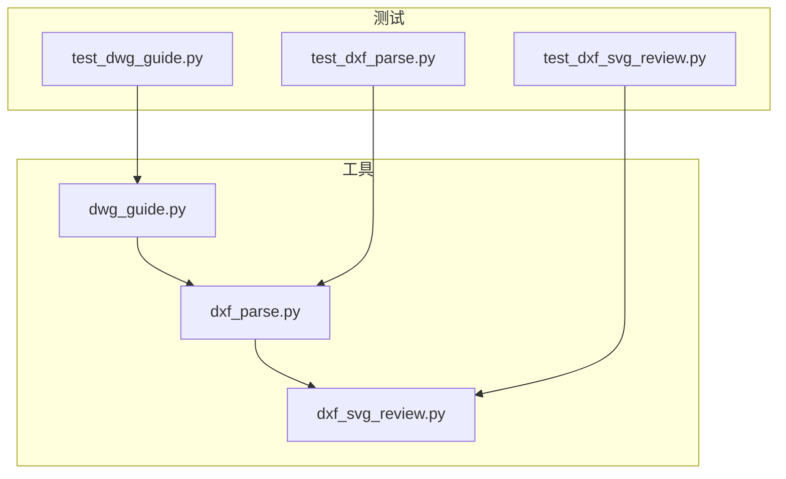
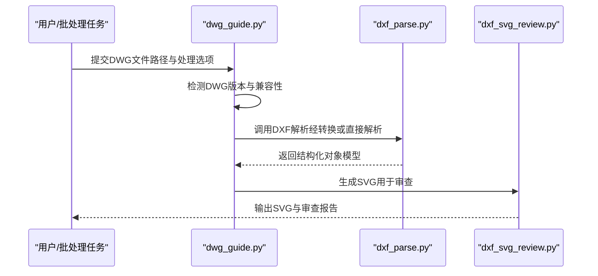
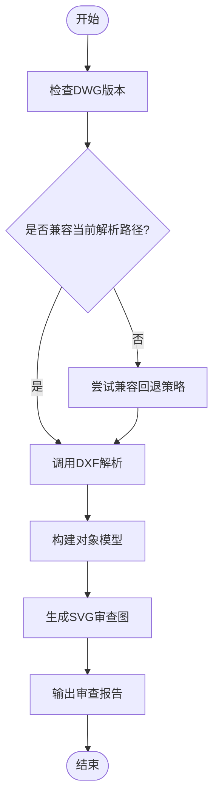
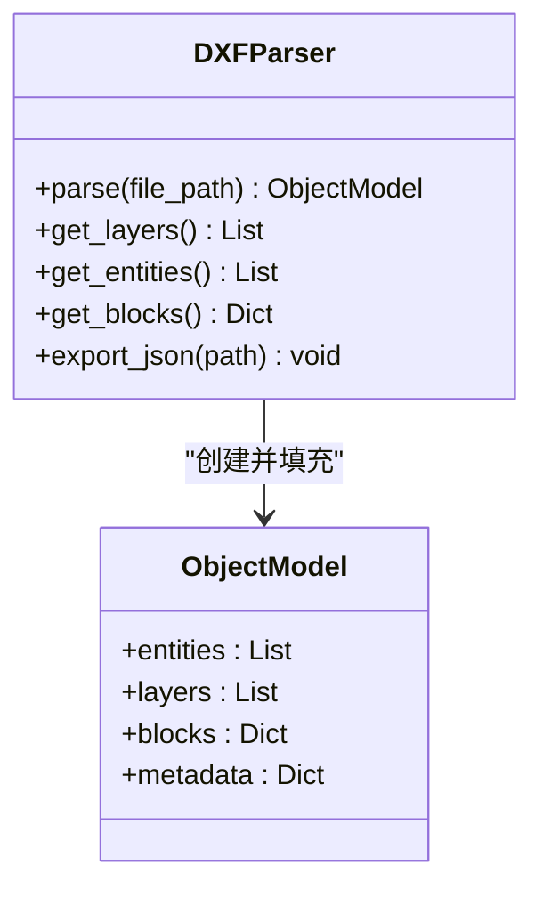
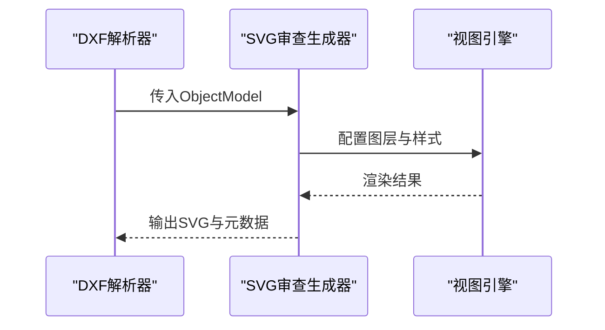
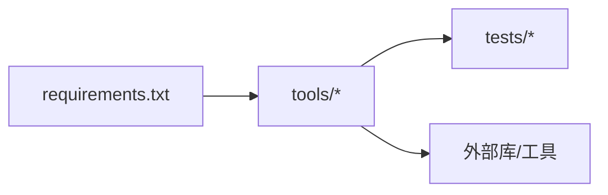

# DWG格式指南

<cite>
**本文引用的文件**   
- [tools/dwg_guide.py](file://tools/dwg_guide.py)
- [tools/dxf_parse.py](file://tools/dxf_parse.py)
- [tools/dxf_svg_review.py](file://tools/dxf_svg_review.py)
- [tests/test_dwg_guide.py](file://tests/test_dwg_guide.py)
- [tests/test_dxf_parse.py](file://tests/test_dxf_parse.py)
- [tests/test_dxf_svg_review.py](file://tests/test_dxf_svg_review.py)
- [requirements.txt](file://requirements.txt)
</cite>

## 目录
1. [简介](#简介)
2. [项目结构](#项目结构)
3. [核心组件](#核心组件)
4. [架构总览](#架构总览)
5. [详细组件分析](#详细组件分析)
6. [依赖关系分析](#依赖关系分析)
7. [性能考量](#性能考量)
8. [故障排查指南](#故障排查指南)
9. [结论](#结论)
10. [附录](#附录)

## 简介
本指南聚焦于DWG文件格式的处理，结合仓库中的工具与测试用例，系统阐述：
- DWG格式的特点、限制以及与DXF格式的对比
- DWG文件的导入与处理流程（含版本兼容性与数据转换策略）
- 常见问题定位与解决方案（字体缺失、图层丢失、元数据损坏等）
- 批量处理、关键信息提取与标准格式转换的操作示例
- 与其他CAD软件的互操作性、数据迁移与备份恢复策略
- 性能调优建议与最佳实践

## 项目结构
本项目围绕DWG/DXF处理构建了若干工具脚本与对应测试，核心位于 tools 目录，测试位于 tests 目录。关键文件包括：
- dwg_guide.py：DWG处理指南与操作入口
- dxf_parse.py：DXF解析与数据结构化
- dxf_svg_review.py：将DXF转换为SVG用于审查与可视化
- 对应的测试文件覆盖上述工具的用法与边界情况

图表来源
- [tools/dwg_guide.py](file://tools/dwg_guide.py)
- [tools/dxf_parse.py](file://tools/dxf_parse.py)
- [tools/dxf_svg_review.py](file://tools/dxf_svg_review.py)
- [tests/test_dwg_guide.py](file://tests/test_dwg_guide.py)
- [tests/test_dxf_parse.py](file://tests/test_dxf_parse.py)
- [tests/test_dxf_svg_review.py](file://tests/test_dxf_svg_review.py)

章节来源
- [tools/dwg_guide.py](file://tools/dwg_guide.py)
- [tools/dxf_parse.py](file://tools/dxf_parse.py)
- [tools/dxf_svg_review.py](file://tools/dxf_svg_review.py)
- [tests/test_dwg_guide.py](file://tests/test_dwg_guide.py)
- [tests/test_dxf_parse.py](file://tests/test_dxf_parse.py)
- [tests/test_dxf_svg_review.py](file://tests/test_dxf_svg_review.py)

## 核心组件
- DWG处理入口（dwg_guide.py）
  - 提供DWG导入、预处理、版本识别与兼容性处理的统一入口
  - 协调DXF解析与SVG审查流程，形成端到端处理链路
- DXF解析器（dxf_parse.py）
  - 负责读取DXF文本/二进制流，构建内部对象模型（实体、图层、块、属性等）
  - 输出结构化数据供后续分析与渲染使用
- SVG审查生成器（dxf_svg_review.py）
  - 将DXF对象模型转换为可浏览的SVG，便于人工复核与问题定位
  - 支持图层过滤、样式映射与标注导出

章节来源
- [tools/dwg_guide.py](file://tools/dwg_guide.py)
- [tools/dxf_parse.py](file://tools/dxf_parse.py)
- [tools/dxf_svg_review.py](file://tools/dxf_svg_review.py)

## 架构总览
整体处理流程遵循“DWG导入 → 版本兼容处理 → DXF解析 → 结构化建模 → SVG审查”的流水线模式。DWG作为专有二进制格式，通常通过中间层或库转换为DXF后再进行标准化解析与可视化。

图表来源
- [tools/dwg_guide.py](file://tools/dwg_guide.py)
- [tools/dxf_parse.py](file://tools/dxf_parse.py)
- [tools/dxf_svg_review.py](file://tools/dxf_svg_review.py)

## 详细组件分析

### DWG处理入口（dwg_guide.py）
- 职责
  - 接收DWG输入，执行版本识别与兼容性判断
  - 协调DXF解析与SVG生成，封装为统一的批处理接口
- 关键点
  - 版本兼容性：不同DWG版本存在差异，需选择合适解析路径
  - 错误回退：当某一路径失败时，尝试降级或替代方案
  - 批处理：支持多文件队列与进度反馈

图表来源
- [tools/dwg_guide.py](file://tools/dwg_guide.py)

章节来源
- [tools/dwg_guide.py](file://tools/dwg_guide.py)
- [tests/test_dwg_guide.py](file://tests/test_dwg_guide.py)

### DXF解析器（dxf_parse.py）
- 职责
  - 解析DXF内容，建立实体、图层、块、属性、标注等对象模型
  - 提供查询接口以获取关键信息与统计
- 关键点
  - 数据类型映射：确保DXF组码到内部类型的正确映射
  - 容错处理：对异常组码或缺失字段进行安全回退
  - 性能优化：分块读取与惰性加载大文件

图表来源
- [tools/dxf_parse.py](file://tools/dxf_parse.py)

章节来源
- [tools/dxf_parse.py](file://tools/dxf_parse.py)
- [tests/test_dxf_parse.py](file://tests/test_dxf_parse.py)

### SVG审查生成器（dxf_svg_review.py）
- 职责
  - 将对象模型转换为SVG，支持图层可见性、样式映射与标注
  - 生成审查辅助信息（如图层清单、实体计数）
- 关键点
  - 样式映射：线型、颜色、线宽到SVG属性的转换
  - 缩放与视图：适配不同分辨率与显示需求
  - 增量更新：仅重绘变更部分以提升交互体验

图表来源
- [tools/dxf_svg_review.py](file://tools/dxf_svg_review.py)

章节来源
- [tools/dxf_svg_review.py](file://tools/dxf_svg_review.py)
- [tests/test_dxf_svg_review.py](file://tests/test_dxf_svg_review.py)

## 依赖关系分析
- 外部依赖
  - 依赖Python生态中的图形与解析库（具体依赖见 requirements.txt）
  - 可能依赖第三方DWG/DXF库或命令行工具进行格式转换
- 模块耦合
  - dwg_guide.py 依赖 dxf_parse.py 与 dxf_svg_review.py
  - 测试文件分别验证各工具的行为与边界条件

图表来源
- [requirements.txt](file://requirements.txt)
- [tools/dwg_guide.py](file://tools/dwg_guide.py)
- [tools/dxf_parse.py](file://tools/dxf_parse.py)
- [tools/dxf_svg_review.py](file://tools/dxf_svg_review.py)
- [tests/test_dwg_guide.py](file://tests/test_dwg_guide.py)
- [tests/test_dxf_parse.py](file://tests/test_dxf_parse.py)
- [tests/test_dxf_svg_review.py](file://tests/test_dxf_svg_review.py)

章节来源
- [requirements.txt](file://requirements.txt)
- [tools/dwg_guide.py](file://tools/dwg_guide.py)
- [tools/dxf_parse.py](file://tools/dxf_parse.py)
- [tools/dxf_svg_review.py](file://tools/dxf_svg_review.py)
- [tests/test_dwg_guide.py](file://tests/test_dwg_guide.py)
- [tests/test_dxf_parse.py](file://tests/test_dxf_parse.py)
- [tests/test_dxf_svg_review.py](file://tests/test_dxf_svg_review.py)

## 性能考量
- 文件体积与内存
  - 大文件采用分块读取与惰性加载，避免一次性载入全部对象
  - 对重复实体与块进行去重与缓存
- I/O与序列化
  - 使用高效序列化格式（如JSON/二进制）存储中间结果
  - 批量处理时启用并发与异步I/O
- 渲染与可视化
  - SVG生成按需渲染，避免全量重绘
  - 对复杂图形进行简化与抽稀

[本节为通用指导，不直接分析具体文件]

## 故障排查指南
- 字体缺失
  - 现象：文字显示为空或乱码
  - 处理：在DXF解析阶段记录字体引用，缺失时替换为默认字体并在SVG中标注警告
- 图层丢失
  - 现象：部分实体不可见或归属不明
  - 处理：校验图层表完整性，重建缺失图层并标记来源
- 元数据损坏
  - 现象：标题、作者、单位等信息异常或缺失
  - 处理：从备用元数据源恢复，或在报告中提示风险
- 版本不兼容
  - 现象：解析失败或对象缺失
  - 处理：切换兼容解析路径或降级策略，记录版本差异日志

章节来源
- [tools/dxf_parse.py](file://tools/dxf_parse.py)
- [tools/dxf_svg_review.py](file://tools/dxf_svg_review.py)
- [tests/test_dxf_parse.py](file://tests/test_dxf_parse.py)
- [tests/test_dxf_svg_review.py](file://tests/test_dxf_svg_review.py)

## 结论
通过统一的DWG处理入口与DXF解析、SVG审查流水线，本项目实现了从DWG导入到可视化审查的完整闭环。建议在工程实践中：
- 严格管理DWG版本与兼容性策略
- 强化解析阶段的容错与回退机制
- 利用SVG审查快速定位问题
- 持续优化性能与稳定性

[本节为总结性内容，不直接分析具体文件]

## 附录
- 常见操作示例
  - 批量处理DWG：遍历输入目录，调用dwg_guide.py对每个文件执行导入、解析与SVG生成
  - 提取关键信息：通过dxf_parse.py的对象模型查询图层、实体数量、块定义与属性
  - 转换为标准格式：将DXF对象模型导出为JSON或CSV，便于下游系统消费
- 互操作性与迁移
  - 与其他CAD软件交换数据时优先使用DXF作为中间格式
  - 建立数据迁移脚本，校验关键字段与拓扑一致性
- 备份与恢复
  - 对原始DWG与中间DXF/JSON进行版本化备份
  - 定期校验完整性并保留回滚点

[本节为概念性指导，不直接分析具体文件]