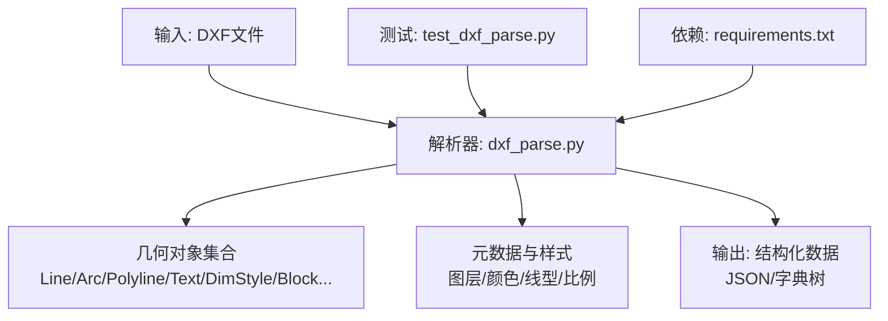
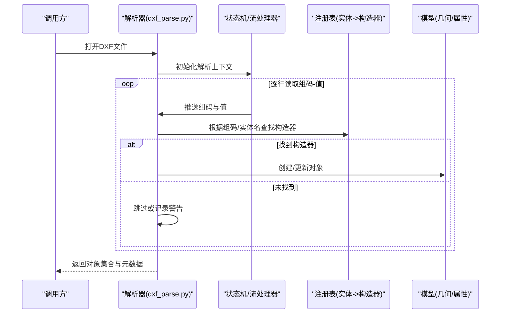
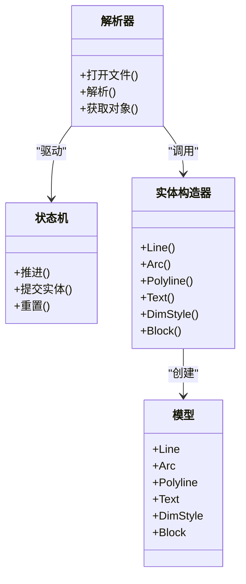
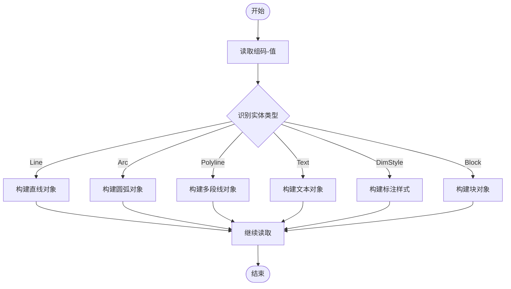
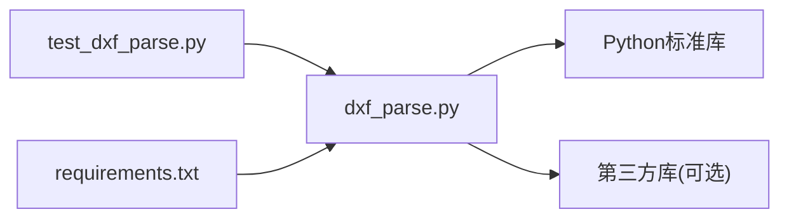

# DXF文件解析器

<cite>
**本文引用的文件**   
- [tools/dxf_parse.py](file://tools/dxf_parse.py)
- [tests/test_dxf_parse.py](file://tests/test_dxf_parse.py)
- [requirements.txt](file://requirements.txt)
</cite>

## 目录
1. [简介](#简介)
2. [项目结构](#项目结构)
3. [核心组件](#核心组件)
4. [架构总览](#架构总览)
5. [详细组件分析](#详细组件分析)
6. [依赖关系分析](#依赖关系分析)
7. [性能与内存管理](#性能与内存管理)
8. [故障排查指南](#故障排查指南)
9. [结论](#结论)
10. [附录：示例与最佳实践](#附录示例与最佳实践)

## 简介
本技术文档围绕DXF文件解析器，系统阐述DXF文件格式的结构、解析机制与实现要点。重点覆盖：
- 实体类型识别（线条、圆弧、多段线等）
- 坐标系统与单位处理
- 图层管理与命名空间
- 属性读取（文本标注、尺寸标注、块属性）
- 错误处理策略、性能优化与内存管理
- 与主流CAD软件的兼容性与数据验证规则

该解析器以Python实现，通过流式扫描DXF的组码-值对，构建几何对象与属性模型，便于后续审查、度量与可视化。

## 项目结构
本项目将DXF解析能力封装在工具脚本中，并通过测试用例验证关键路径与边界行为。

图表来源
- [tools/dxf_parse.py](file://tools/dxf_parse.py)
- [tests/test_dxf_parse.py](file://tests/test_dxf_parse.py)
- [requirements.txt](file://requirements.txt)

章节来源
- [tools/dxf_parse.py](file://tools/dxf_parse.py)
- [tests/test_dxf_parse.py](file://tests/test_dxf_parse.py)
- [requirements.txt](file://requirements.txt)

## 核心组件
- 解析入口与流程控制
  - 负责打开DXF文件、初始化状态机、按组码流驱动解析循环、组装对象并返回结果。
- 实体识别与构造
  - 基于“组码92（实体类型）”或“组码0（实体名）”识别Line、Arc、Polyline、Text、DimStyle、Block等，并调用对应构造逻辑。
- 坐标与单位处理
  - 统一将DXF内部单位转换为工程常用单位（如毫米），支持缩放因子与偏移校正。
- 图层与样式管理
  - 维护图层表、颜色、线型、文字样式、标注样式等，确保渲染与测量一致性。
- 属性读取
  - 提取文本内容、尺寸数值与公差、块引用属性键值对。
- 错误处理与校验
  - 捕获非法组码、缺失必需字段、数值越界等异常，记录诊断信息并回退到安全模式。

章节来源
- [tools/dxf_parse.py](file://tools/dxf_parse.py)
- [tests/test_dxf_parse.py](file://tests/test_dxf_parse.py)

## 架构总览
下图展示从文件读到结构化对象的端到端流程，以及关键模块间的交互。

图表来源
- [tools/dxf_parse.py](file://tools/dxf_parse.py)
- [tests/test_dxf_parse.py](file://tests/test_dxf_parse.py)

## 详细组件分析

### 解析器主流程与状态机
- 设计要点
  - 使用迭代器/生成器方式读取组码-值对，避免一次性加载大文件。
  - 维护当前实体上下文，遇到新实体时完成上一实体的收尾与校验。
  - 提供可插拔的实体构造器注册表，便于扩展新实体类型。
- 关键流程
  - 初始化：设置单位、图层表、样式表、对象容器。
  - 扫描：按组码驱动状态机，累积属性直到实体结束。
  - 构建：调用实体构造器生成对象，填充几何与属性。
  - 后处理：拓扑检查、坐标归一化、样式应用。
- 复杂度
  - 时间复杂度O(N)，N为组码数量；空间复杂度取决于对象数量与平均大小。

章节来源
- [tools/dxf_parse.py](file://tools/dxf_parse.py)

### 实体识别与构造（Line、Arc、Polyline、Text、DimStyle、Block）
- Line（直线）
  - 关键字段：起点、终点、图层、颜色、线型。
  - 坐标转换：按单位与缩放因子变换。
- Arc（圆弧）
  - 关键字段：圆心、半径、起始角、终止角。
  - 角度单位：弧度/度统一处理。
- Polyline（多段线）
  - 关键字段：顶点序列、闭合标志、宽度、拟合曲线参数。
  - 分段策略：按顶点数与类型拆分线段/弧线。
- Text（文本）
  - 关键字段：插入点、高度、旋转角、对齐、内容。
  - 样式：字体、粗体、斜体、颜色。
- DimStyle（标注样式）
  - 关键字段：单位格式、精度、箭头样式、比例。
- Block（块定义/引用）
  - 关键字段：名称、插入点、缩放、旋转、属性键值对。
  - 嵌套：递归展开子块与属性。

图表来源
- [tools/dxf_parse.py](file://tools/dxf_parse.py)

章节来源
- [tools/dxf_parse.py](file://tools/dxf_parse.py)

### 坐标系统与单位处理
- 坐标系
  - DXF使用世界坐标系（WCS），支持UCS与视图变换；解析器默认在WCS下工作，必要时应用视图矩阵。
- 单位与比例
  - 读取LUNITS/LUPREC等系统变量，结合绘图单位换算为毫米；支持全局缩放因子与偏移校正。
- 精度与舍入
  - 对浮点数进行合理舍入，避免微小误差导致拓扑判断失败。

章节来源
- [tools/dxf_parse.py](file://tools/dxf_parse.py)

### 图层与样式管理
- 图层表
  - 维护图层名称、可见性、颜色、线型、打印样式；支持按图层过滤与批量操作。
- 样式表
  - 文字样式、标注样式、填充图案；解析器将样式应用到对象上，保证一致显示。
- 命名空间
  - 处理块与外部参照的命名空间冲突，避免重复定义。

章节来源
- [tools/dxf_parse.py](file://tools/dxf_parse.py)

### 属性读取（文本、尺寸、块属性）
- 文本标注
  - 提取内容、位置、方向、样式；支持多行文本与换行符处理。
- 尺寸标注
  - 解析标注类型（线性、径向、角度等），计算实际尺寸值与公差。
- 块属性
  - 遍历属性标签与值，建立键值映射；支持默认值与继承。

章节来源
- [tools/dxf_parse.py](file://tools/dxf_parse.py)

### 几何图形提取算法
- 线条与圆弧
  - 直接由端点/圆心与半径确定；圆弧角度范围规范化至[0, 2π)。
- 多段线
  - 顶点序列解析，区分直线段与弧线段；闭合多段线首尾相连。
- 复杂曲线
  - 样条/拟合曲线近似为折线段，控制采样密度以保证精度与性能平衡。

图表来源
- [tools/dxf_parse.py](file://tools/dxf_parse.py)

章节来源
- [tools/dxf_parse.py](file://tools/dxf_parse.py)

### 错误处理与数据验证
- 常见错误
  - 缺失必需组码、数值越界、角度/半径非法、图层/样式不存在。
- 处理策略
  - 记录警告并跳过无效对象；提供回退默认值；汇总统计错误次数与类型。
- 数据验证
  - 几何有效性检查（如多段线自相交）、坐标范围检查、单位一致性检查。

章节来源
- [tools/dxf_parse.py](file://tools/dxf_parse.py)

## 依赖关系分析
- Python标准库
  - 文件IO、正则表达式、数学运算、数据结构。
- 第三方库
  - 若使用额外库（如用于SVG导出或数值计算），在依赖文件中声明。
- 测试依赖
  - 单元测试框架与断言库。

图表来源
- [tools/dxf_parse.py](file://tools/dxf_parse.py)
- [tests/test_dxf_parse.py](file://tests/test_dxf_parse.py)
- [requirements.txt](file://requirements.txt)

章节来源
- [requirements.txt](file://requirements.txt)

## 性能与内存管理
- 流式解析
  - 逐行读取组码-值对，避免一次性加载整个文件，降低内存占用。
- 增量构建
  - 边读边构建对象，及时释放临时缓冲；对大型图纸分块处理。
- 缓存与索引
  - 对图层、样式、块定义建立索引，提高查找效率。
- 数值计算优化
  - 批量坐标变换、向量化计算（如适用），减少重复计算。
- 内存回收
  - 显式清理不再使用的中间对象；限制对象图深度，防止递归爆炸。

章节来源
- [tools/dxf_parse.py](file://tools/dxf_parse.py)

## 故障排查指南
- 常见问题定位
  - 检查组码流是否完整，确认实体头尾匹配。
  - 核对单位与比例设置，确保坐标范围合理。
  - 查看错误日志中的缺失组码与非法值。
- 调试建议
  - 启用详细日志，输出每个实体的组码序列。
  - 使用最小复现样例隔离问题。
  - 对比不同CAD软件导出的DXF差异。
- 兼容性注意
  - 不同版本DXF（R12/R2000/R2018等）存在组码差异，需做版本适配。
  - 某些专有扩展组码可能不被通用解析器支持。

章节来源
- [tools/dxf_parse.py](file://tools/dxf_parse.py)
- [tests/test_dxf_parse.py](file://tests/test_dxf_parse.py)

## 结论
本DXF解析器采用流式状态机与可扩展实体构造器，能够稳定识别基础几何与属性，支持坐标单位转换与图层样式管理。通过严格的错误处理与数据验证，提升鲁棒性；借助性能优化与内存管理策略，满足大文件处理需求。建议在后续迭代中增强对样条曲线、外部参照与复杂块的解析能力，并完善与主流CAD软件的兼容性测试。

## 附录：示例与最佳实践
- 解析建筑平面图
  - 步骤：打开文件→设置单位为毫米→过滤目标图层→提取墙体与门窗→输出几何与属性。
  - 参考路径：[tools/dxf_parse.py](file://tools/dxf_parse.py)
- 处理坐标转换
  - 步骤：读取系统变量→应用缩放与偏移→统一坐标系→验证范围。
  - 参考路径：[tools/dxf_parse.py](file://tools/dxf_parse.py)
- 提取关键信息
  - 步骤：遍历实体→识别类型→收集属性→聚合统计。
  - 参考路径：[tests/test_dxf_parse.py](file://tests/test_dxf_parse.py)
- 兼容性注意事项
  - 针对不同CAD版本进行回归测试；对未知组码保持宽容解析。
- 数据验证规则
  - 几何有效性、单位一致性、图层/样式存在性、数值范围约束。

章节来源
- [tools/dxf_parse.py](file://tools/dxf_parse.py)
- [tests/test_dxf_parse.py](file://tests/test_dxf_parse.py)