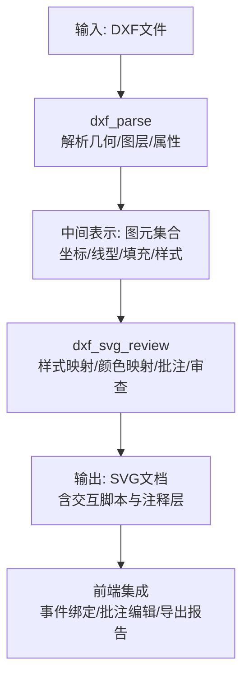
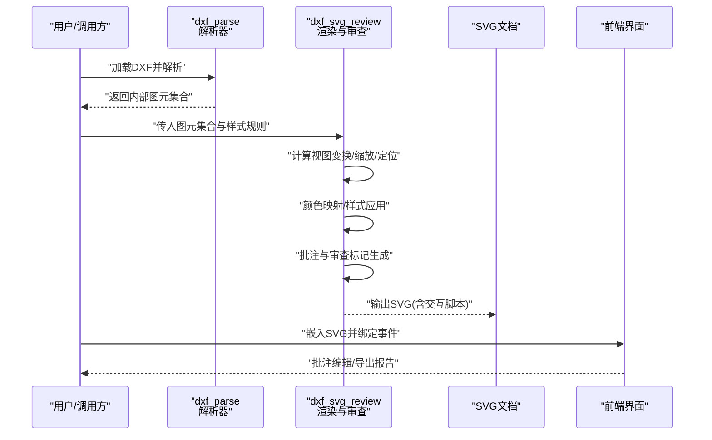
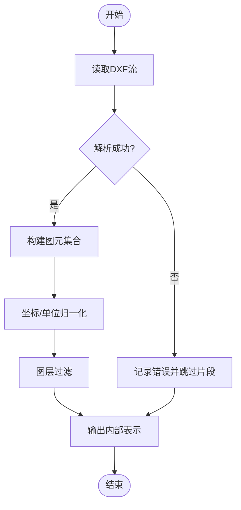
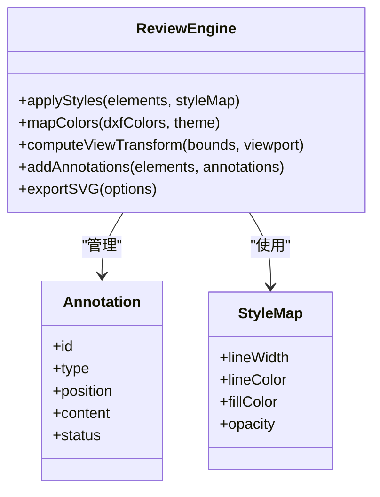
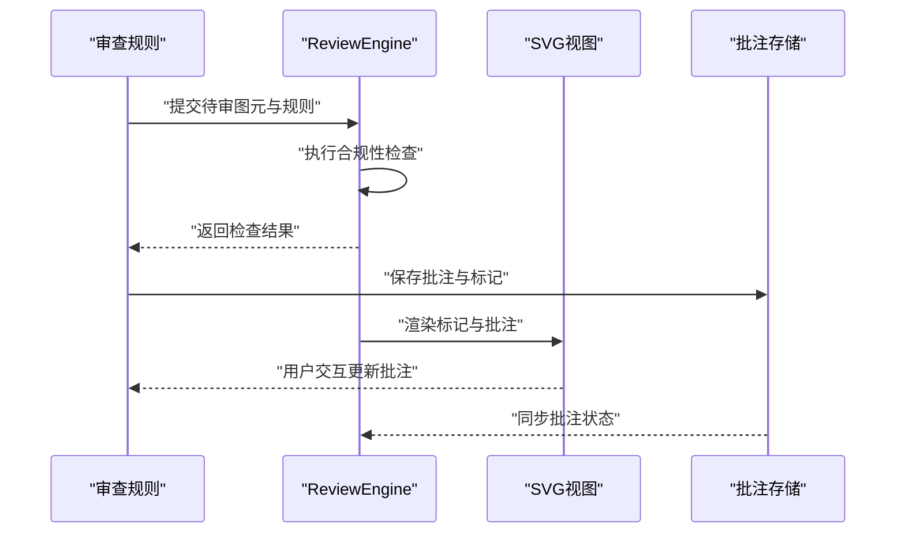
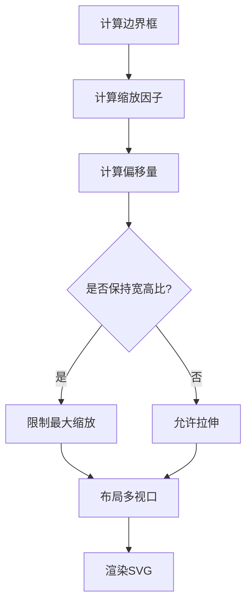
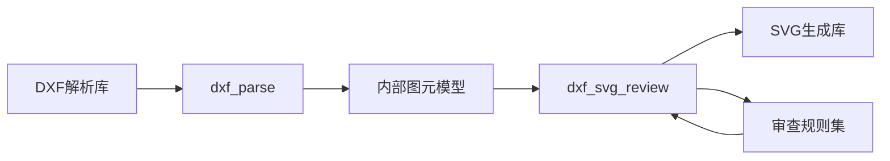

# SVG生成器

<cite>
**本文引用的文件**   
- [tools/dxf_svg_review.py](file://tools/dxf_svg_review.py)
- [tools/dxf_parse.py](file://tools/dxf_parse.py)
- [tests/test_dxf_svg_review.py](file://tests/test_dxf_svg_review.py)
- [tests/test_dxf_parse.py](file://tests/test_dxf_parse.py)
- [requirements.txt](file://requirements.txt)
</cite>

## 目录
1. [简介](#简介)
2. [项目结构](#项目结构)
3. [核心组件](#核心组件)
4. [架构总览](#架构总览)
5. [详细组件分析](#详细组件分析)
6. [依赖关系分析](#依赖关系分析)
7. [性能考量](#性能考量)
8. [故障排查指南](#故障排查指南)
9. [结论](#结论)
10. [附录](#附录)

## 简介
本技术文档围绕“SVG生成器”展开，聚焦从DXF数据到SVG格式的转换流程，涵盖矢量图形渲染、颜色映射与样式应用；并说明审查功能的实现（合规性检查、标注添加、质量标记）。同时记录图形缩放、定位与布局算法，确保不同尺寸的图纸正确显示。文档还包含可交互SVG审查界面的集成方式、事件处理与数据绑定建议，以及大文件处理与内存控制等性能优化策略。

## 项目结构
本项目将DXF解析与SVG生成/审查能力集中在工具模块中，并通过测试用例验证关键路径：
- tools/dxf_parse.py：负责读取DXF、提取几何与图层信息，构建内部数据结构。
- tools/dxf_svg_review.py：基于解析结果生成SVG，完成样式映射、批注与审查标记，并提供交互增强能力。
- tests/test_dxf_parse.py：覆盖DXF解析的边界条件与异常路径。
- tests/test_dxf_svg_review.py：覆盖SVG生成、颜色映射、批注与导出流程。
- requirements.txt：声明第三方依赖（如用于DXF解析与SVG生成的库）。

图表来源 
- [tools/dxf_parse.py](file://tools/dxf_parse.py)
- [tools/dxf_svg_review.py](file://tools/dxf_svg_review.py)

章节来源
- [tools/dxf_parse.py](file://tools/dxf_parse.py)
- [tools/dxf_svg_review.py](file://tools/dxf_svg_review.py)
- [tests/test_dxf_parse.py](file://tests/test_dxf_parse.py)
- [tests/test_dxf_svg_review.py](file://tests/test_dxf_svg_review.py)
- [requirements.txt](file://requirements.txt)

## 核心组件
- DXF解析器
  - 职责：读取DXF二进制或ASCII流，识别图层、线型、尺寸、文本、多段线、圆、直线等基本图元，建立统一的内部表示。
  - 关键点：单位换算、坐标系归一化、图层过滤、缺失字段容错。
- SVG生成与审查引擎
  - 职责：将内部表示转换为SVG元素，应用颜色映射与样式，叠加批注与审查标记，生成可交互的SVG。
  - 关键点：视图变换（缩放/平移）、视口裁剪、样式表注入、批注对象模型、导出选项。
- 测试套件
  - 职责：覆盖解析与生成主路径、异常分支、边界尺寸与颜色映射一致性。

章节来源
- [tools/dxf_parse.py](file://tools/dxf_parse.py)
- [tools/dxf_svg_review.py](file://tools/dxf_svg_review.py)
- [tests/test_dxf_parse.py](file://tests/test_dxf_parse.py)
- [tests/test_dxf_svg_review.py](file://tests/test_dxf_svg_review.py)

## 架构总览
下图展示从DXF到SVG的端到端流程，包括解析、渲染、审查与前端集成。

图表来源 
- [tools/dxf_parse.py](file://tools/dxf_parse.py)
- [tools/dxf_svg_review.py](file://tools/dxf_svg_review.py)

## 详细组件分析

### DXF解析器（dxf_parse）
- 功能要点
  - 支持常见图元类型（直线、圆弧、多段线、文本、块引用等）。
  - 图层过滤与可见性控制，避免无关内容进入渲染管线。
  - 单位与坐标系统统一，保证后续SVG渲染的一致性。
- 数据结构
  - 图元列表：每个图元包含类型、坐标序列、样式属性（线宽、颜色、线型）。
  - 图层元数据：名称、可见性、默认样式。
- 错误处理
  - 对损坏或不完整DXF进行容错，跳过无法解析的片段并记录日志。
  - 提供最小可用子集，确保渲染不崩溃。

图表来源 
- [tools/dxf_parse.py](file://tools/dxf_parse.py)

章节来源
- [tools/dxf_parse.py](file://tools/dxf_parse.py)
- [tests/test_dxf_parse.py](file://tests/test_dxf_parse.py)

### SVG生成与审查引擎（dxf_svg_review）
- 功能要点
  - 将内部图元集合转换为SVG元素（path、line、circle、text等）。
  - 颜色映射：将DXF颜色索引或RGB值映射为SVG颜色，支持主题切换。
  - 样式应用：线宽、线型、填充色、透明度等样式注入。
  - 批注与审查：在SVG中插入注释层，支持合规性标记、质量标签与批注编辑。
  - 交互增强：注入JavaScript以支持点击、悬停、批注编辑、导出等功能。
- 视图变换
  - 计算DXF边界框，确定缩放比例与偏移，适配目标视口尺寸。
  - 支持多页/多视口布局，按区域划分与拼接。
- 导出选项
  - 纯SVG、带交互脚本的SVG、压缩SVG、附带批注JSON等。

图表来源 
- [tools/dxf_svg_review.py](file://tools/dxf_svg_review.py)

章节来源
- [tools/dxf_svg_review.py](file://tools/dxf_svg_review.py)
- [tests/test_dxf_svg_review.py](file://tests/test_dxf_svg_review.py)

### 审查功能（合规性检查、标注添加、质量标记）
- 合规性检查
  - 基于规则集对图元位置、尺寸、间距等进行校验，生成合规性结果。
  - 结果映射为SVG中的标记（如高亮、边框、图标），便于可视化审查。
- 标注添加
  - 支持在指定坐标添加文本批注、箭头、圈选区域等。
  - 批注对象包含ID、类型、位置、内容与状态，便于持久化与同步。
- 质量标记
  - 对已审核通过的图元打上质量标签（通过/待确认/不通过），并在SVG中以视觉差异呈现。

图表来源 
- [tools/dxf_svg_review.py](file://tools/dxf_svg_review.py)

章节来源
- [tools/dxf_svg_review.py](file://tools/dxf_svg_review.py)
- [tests/test_dxf_svg_review.py](file://tests/test_dxf_svg_review.py)

### 图形缩放、定位与布局算法
- 缩放与定位
  - 计算DXF边界框，根据目标视口尺寸计算缩放因子与偏移量，确保内容居中且无溢出。
  - 支持固定宽高比与自适应拉伸两种模式。
- 布局
  - 多页/多视口时，按网格或自定义模板排列，避免重叠。
  - 文本与批注层独立渲染，确保可读性与交互性。

图表来源 
- [tools/dxf_svg_review.py](file://tools/dxf_svg_review.py)

章节来源
- [tools/dxf_svg_review.py](file://tools/dxf_svg_review.py)

### 前端集成、事件处理与数据绑定
- 集成方式
  - 将生成的SVG嵌入HTML页面，通过script标签引入交互逻辑。
  - 使用DOM API或轻量框架（如Vue/React）绑定事件与数据。
- 事件处理
  - 点击/悬停触发批注编辑、合规性详情展示。
  - 拖拽移动批注点，实时更新坐标与状态。
- 数据绑定
  - 批注对象与UI双向绑定，修改后回写至后端或本地存储。
  - 导出报告时序列化批注与审查结果。

章节来源
- [tools/dxf_svg_review.py](file://tools/dxf_svg_review.py)
- [tests/test_dxf_svg_review.py](file://tests/test_dxf_svg_review.py)

## 依赖关系分析
- 外部依赖
  - DXF解析库：用于读取与解析DXF文件。
  - SVG生成库：用于创建与操作SVG DOM或字符串。
  - 可选：图像处理库（如需栅格化或水印）。
- 内部耦合
  - dxf_parse与dxf_svg_review之间通过内部图元集合解耦，便于替换解析器或渲染器。
  - 审查规则与渲染引擎分离，支持规则热更新与扩展。

图表来源 
- [requirements.txt](file://requirements.txt)
- [tools/dxf_parse.py](file://tools/dxf_parse.py)
- [tools/dxf_svg_review.py](file://tools/dxf_svg_review.py)

章节来源
- [requirements.txt](file://requirements.txt)
- [tools/dxf_parse.py](file://tools/dxf_parse.py)
- [tools/dxf_svg_review.py](file://tools/dxf_svg_review.py)

## 性能考量
- 大文件处理
  - 分块解析DXF，按需加载图元，避免一次性载入全部数据。
  - 对超大图形进行降采样或分层渲染，提升首屏速度。
- 内存控制
  - 及时释放临时对象，避免累积占用。
  - 使用生成器或迭代器处理图元集合，减少峰值内存。
- 渲染优化
  - 批量创建SVG元素，减少DOM操作次数。
  - 启用CSS类复用与样式缓存，降低重复计算。
- I/O优化
  - 异步读写文件，避免阻塞主线程。
  - 压缩SVG输出（如移除冗余节点与空白）。

[本节为通用指导，无需特定文件来源]

## 故障排查指南
- 常见问题
  - DXF解析失败：检查文件格式与编码，确认库版本兼容性。
  - SVG渲染异常：验证坐标范围与缩放计算，检查样式映射是否正确。
  - 批注丢失：确认批注对象ID唯一性与持久化路径。
- 调试建议
  - 启用详细日志，记录解析与渲染关键步骤。
  - 使用单元测试复现问题，逐步缩小范围。
  - 在前端控制台查看事件绑定与数据绑定状态。

章节来源
- [tests/test_dxf_parse.py](file://tests/test_dxf_parse.py)
- [tests/test_dxf_svg_review.py](file://tests/test_dxf_svg_review.py)

## 结论
本SVG生成器通过清晰的模块化设计，实现了从DXF到SVG的高效转换与审查能力。解析器与渲染器解耦，便于扩展与维护；审查功能支持合规性检查、批注与质量标记，满足工程协作需求。通过合理的视图变换与布局算法，确保不同尺寸图纸的正确显示。结合前端集成与性能优化策略，可提供流畅的交互式审查体验。

[本节为总结性内容，无需特定文件来源]

## 附录
- 使用示例（概念性）
  - 生成SVG：调用解析器获取图元集合，传入渲染引擎生成SVG文档。
  - 添加批注：构造批注对象，调用渲染引擎的批注接口并重新渲染。
  - 导出报告：序列化批注与审查结果，生成PDF或HTML报告。
- 最佳实践
  - 统一颜色与样式命名规范，便于主题切换。
  - 对大图进行分页或分块渲染，提升用户体验。
  - 定期更新审查规则，保持合规性检查的有效性。

[本节为补充信息，无需特定文件来源]