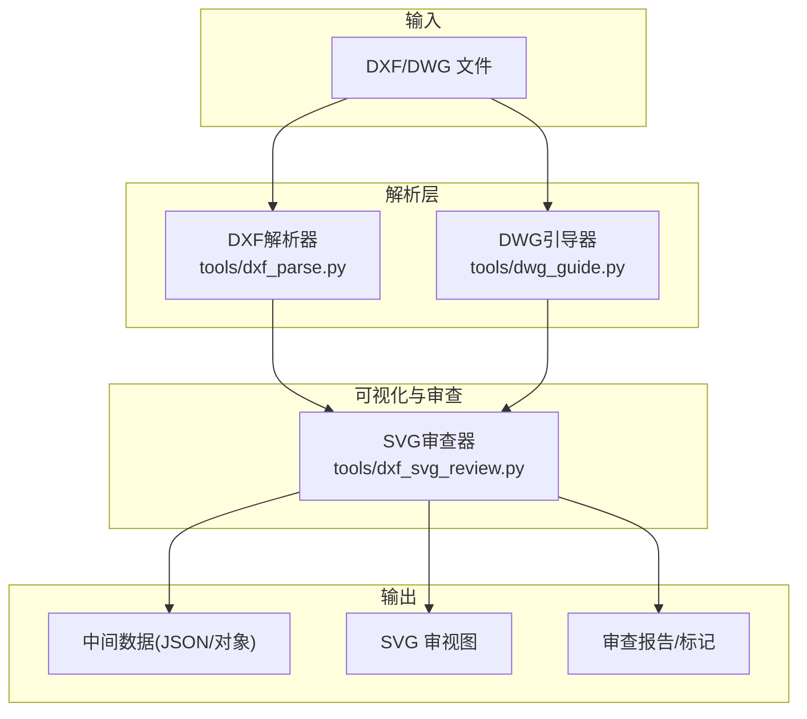
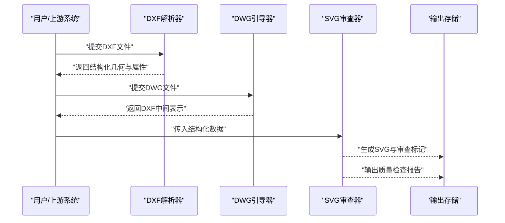
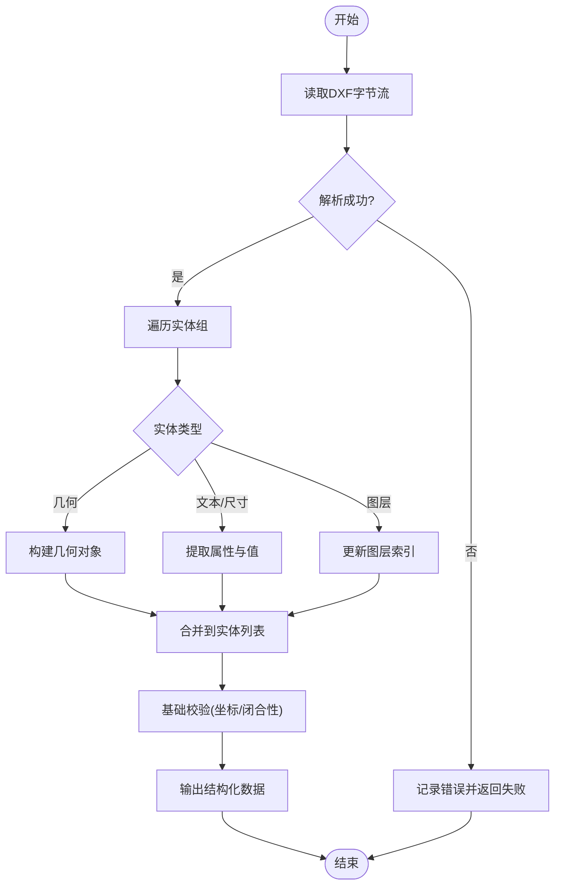
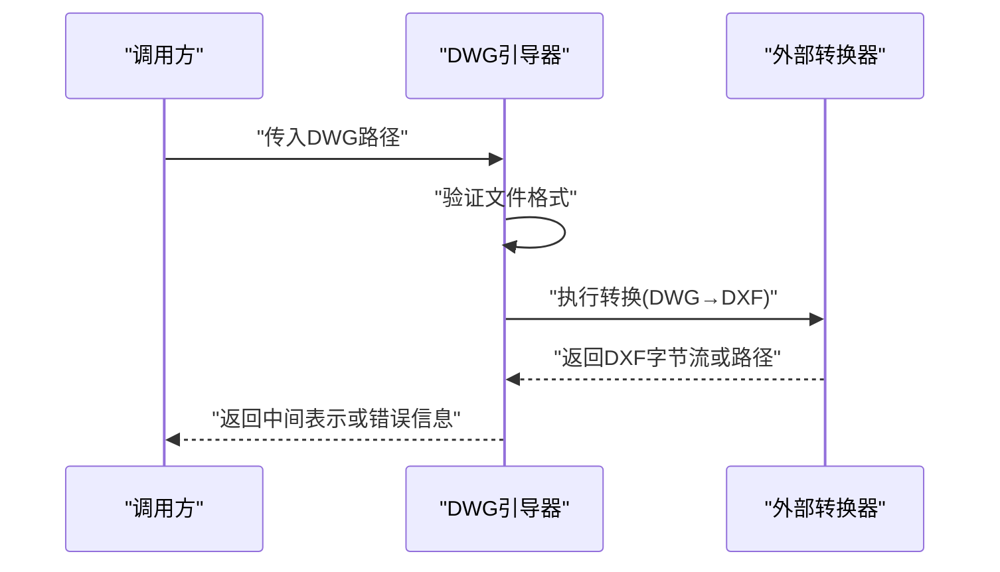
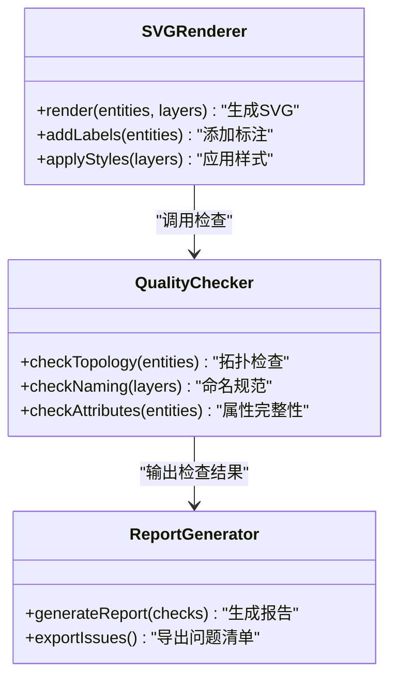
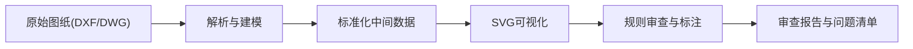
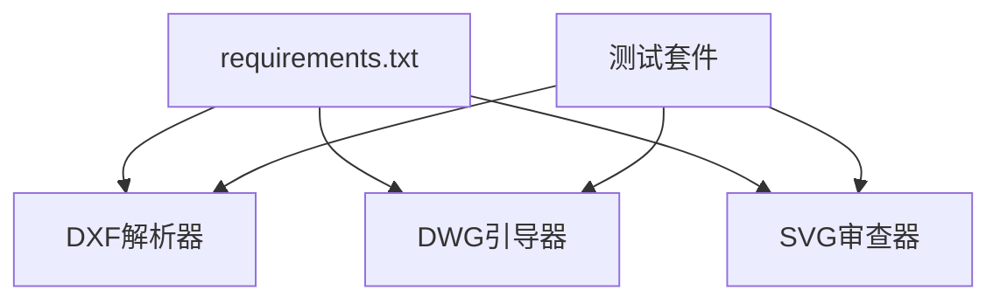

# 图纸分析引擎

<cite>
**本文引用的文件**   
- [tools/dxf_parse.py](file://tools/dxf_parse.py)
- [tools/dwg_guide.py](file://tools/dwg_guide.py)
- [tools/dxf_svg_review.py](file://tools/dxf_svg_review.py)
- [tests/test_dxf_parse.py](file://tests/test_dxf_parse.py)
- [tests/test_dxf_svg_review.py](file://tests/test_dxf_svg_review.py)
- [tests/test_dwg_guide.py](file://tests/test_dwg_guide.py)
- [requirements.txt](file://requirements.txt)
</cite>

## 目录
1. [简介](#简介)
2. [项目结构](#项目结构)
3. [核心组件](#核心组件)
4. [架构总览](#架构总览)
5. [详细组件分析](#详细组件分析)
6. [依赖关系分析](#依赖关系分析)
7. [性能考量](#性能考量)
8. [故障排查指南](#故障排查指南)
9. [结论](#结论)
10. [附录](#附录)

## 简介
本技术文档面向“图纸分析引擎”，聚焦于DXF与DWG建筑图纸的解析、几何图形提取、图层识别与属性读取，以及SVG生成与审查流程。文档涵盖数据处理流程、API接口设计、错误处理策略、与法规系统的集成方式、审查结果生成方法，并提供性能调优与内存管理建议。读者无需深厚的CAD背景即可理解系统设计与实现要点。

## 项目结构
本项目采用工具化组织方式，核心能力集中在 tools 目录下：
- DXF解析器：负责从DXF文件中抽取几何、图层与属性信息
- DWG引导器：提供DWG文件的导入/转换辅助能力
- SVG审查器：将解析结果转换为可审视图层（SVG），并执行质量检查与标注
- 测试套件：覆盖解析、SVG生成与DWG引导等关键路径

**图表来源** 
- [tools/dxf_parse.py](file://tools/dxf_parse.py)
- [tools/dwg_guide.py](file://tools/dwg_guide.py)
- [tools/dxf_svg_review.py](file://tools/dxf_svg_review.py)

**章节来源**
- [tools/dxf_parse.py](file://tools/dxf_parse.py)
- [tools/dwg_guide.py](file://tools/dwg_guide.py)
- [tools/dxf_svg_review.py](file://tools/dxf_svg_review.py)

## 核心组件
- DXF解析器
  - 职责：解析DXF实体、图层、块、文本、尺寸与属性；构建统一的几何与属性模型
  - 关键点：分层索引、实体类型分发、坐标与单位换算、属性映射
- DWG引导器
  - 职责：为DWG文件提供导入或转换入口，统一至DXF中间表示以便复用解析逻辑
  - 关键点：格式探测、外部依赖调用、错误回退
- SVG审查器
  - 职责：将解析后的几何与属性渲染为SVG，添加标注、图例与审查标记，执行质量检查
  - 关键点：样式映射、标注布局、规则校验、异常兜底

**章节来源**
- [tools/dxf_parse.py](file://tools/dxf_parse.py)
- [tools/dwg_guide.py](file://tools/dwg_guide.py)
- [tools/dxf_svg_review.py](file://tools/dxf_svg_review.py)

## 架构总览
整体流程分为“解析—转换—审查”三段式流水线：
- 解析阶段：从DXF/DWG中抽取结构化数据（几何、图层、属性）
- 转换阶段：将解析结果标准化为中间数据结构，便于后续渲染与审查
- 审查阶段：基于规则对图形进行质量检查，生成标注与报告

**图表来源** 
- [tools/dxf_parse.py](file://tools/dxf_parse.py)
- [tools/dwg_guide.py](file://tools/dwg_guide.py)
- [tools/dxf_svg_review.py](file://tools/dxf_svg_review.py)

## 详细组件分析

### DXF解析器
- 功能要点
  - 几何提取：支持多段线、直线、圆弧、圆、文字、尺寸等常见实体
  - 图层识别：按图层名分组，建立图层到实体的映射
  - 属性读取：提取块属性、文本内容、尺寸数值与单位
  - 坐标与单位：处理不同单位制与坐标系变换
- 数据结构
  - 实体列表：包含类型、坐标序列、属性字典
  - 图层索引：图层名→实体集合
  - 元数据：比例尺、单位、绘图范围
- 错误处理
  - 非法实体跳过并记录日志
  - 缺失属性使用默认值并标注
  - 编码问题转义或替换

**图表来源** 
- [tools/dxf_parse.py](file://tools/dxf_parse.py)

**章节来源**
- [tools/dxf_parse.py](file://tools/dxf_parse.py)
- [tests/test_dxf_parse.py](file://tests/test_dxf_parse.py)

### DWG引导器
- 功能要点
  - 格式探测：判断是否为有效DWG文件
  - 转换入口：调用外部工具或库将DWG转为DXF中间表示
  - 兼容策略：失败时回退到提示或替代方案
- 错误处理
  - 外部命令失败捕获
  - 版本不兼容提示
  - 临时文件清理

**图表来源** 
- [tools/dwg_guide.py](file://tools/dwg_guide.py)

**章节来源**
- [tools/dwg_guide.py](file://tools/dwg_guide.py)
- [tests/test_dwg_guide.py](file://tests/test_dwg_guide.py)

### SVG审查器
- 功能要点
  - 图形转换：将几何对象映射为SVG元素（path/polygon/circle/text等）
  - 标注添加：图层名称、尺寸、属性标签、审查标记
  - 质量检查：拓扑一致性、命名规范、缺失属性检测
- 输出产物
  - SVG审视图：可直接查看与交互
  - 审查报告：问题清单与建议修正
- 错误处理
  - 渲染异常隔离（单个实体失败不影响整体）
  - 字体与样式回退
  - 超大图形分片渲染

**图表来源** 
- [tools/dxf_svg_review.py](file://tools/dxf_svg_review.py)

**章节来源**
- [tools/dxf_svg_review.py](file://tools/dxf_svg_review.py)
- [tests/test_dxf_svg_review.py](file://tests/test_dxf_svg_review.py)

### 概念总览
下图展示从原始图纸到审查结果的端到端流程，帮助非技术读者理解系统价值与边界。

[本图为概念流程图，不直接映射具体代码文件]

## 依赖关系分析
- 运行时依赖
  - Python标准库：文件IO、JSON序列化、正则表达式
  - 第三方库：用于DXF/DWG解析与SVG生成（详见requirements.txt）
- 模块耦合
  - DXF解析器与SVG审查器通过中间数据结构解耦
  - DWG引导器作为独立适配器，降低主流程复杂度
- 潜在循环依赖
  - 当前各模块单向依赖，无循环引用风险

**图表来源** 
- [requirements.txt](file://requirements.txt)
- [tools/dxf_parse.py](file://tools/dxf_parse.py)
- [tools/dwg_guide.py](file://tools/dwg_guide.py)
- [tools/dxf_svg_review.py](file://tools/dxf_svg_review.py)
- [tests/test_dxf_parse.py](file://tests/test_dxf_parse.py)
- [tests/test_dwg_guide.py](file://tests/test_dwg_guide.py)
- [tests/test_dxf_svg_review.py](file://tests/test_dxf_svg_review.py)

**章节来源**
- [requirements.txt](file://requirements.txt)

## 性能考量
- 解析优化
  - 流式读取大文件，避免一次性加载全部字节
  - 实体类型过滤，仅解析必要图层与实体
  - 并行处理独立实体组（线程安全前提下）
- 渲染优化
  - 按需渲染可见图层，隐藏无关元素
  - 矢量路径简化与合并，减少SVG节点数量
  - 分块渲染与懒加载，提升交互体验
- 内存管理
  - 及时释放中间对象，避免累积
  - 使用生成器迭代实体，降低峰值内存
  - 缓存常用样式与字体资源
- I/O优化
  - 批量写入审查报告，减少磁盘抖动
  - 压缩中间结果（可选）

[本节为通用性能指导，不直接分析具体文件]

## 故障排查指南
- 常见问题
  - DXF/DWG无法打开：检查文件完整性与权限
  - 解析失败：确认文件格式版本与编码
  - SVG渲染空白：检查坐标范围与缩放比例
  - 审查报告为空：确认规则配置与输入数据完整性
- 定位步骤
  - 启用详细日志，记录解析与渲染过程
  - 使用最小复现用例，逐步缩小问题范围
  - 检查第三方依赖版本兼容性
- 恢复策略
  - 自动重试与降级模式
  - 回滚到上一稳定版本
  - 人工介入与手动修正

**章节来源**
- [tests/test_dxf_parse.py](file://tests/test_dxf_parse.py)
- [tests/test_dxf_svg_review.py](file://tests/test_dxf_svg_review.py)
- [tests/test_dwg_guide.py](file://tests/test_dwg_guide.py)

## 结论
本图纸分析引擎通过模块化设计实现了DXF/DWG解析、SVG可视化与审查流程的解耦与扩展。核心优势在于：
- 清晰的职责划分与数据流
- 灵活的规则驱动审查机制
- 完善的错误处理与性能优化策略
建议在生产环境中结合业务需求定制规则集与渲染样式，并持续监控性能指标以优化用户体验。

[本节为总结性内容，不直接分析具体文件]

## 附录
- API参考
  - DXF解析接口：输入文件路径/字节流，返回结构化几何与属性
  - DWG引导接口：输入DWG路径，返回DXF中间表示或错误信息
  - SVG审查接口：输入结构化数据，返回SVG内容与审查报告
- 数据处理流程
  - 输入验证 → 解析建模 → 标准化 → 渲染 → 审查 → 输出
- 错误处理策略
  - 分级错误分类（致命/警告/信息）
  - 自动修复尝试与人工干预提示
  - 审计日志与追踪ID

[本节为补充说明，不直接分析具体文件]