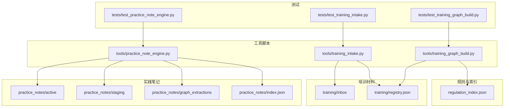
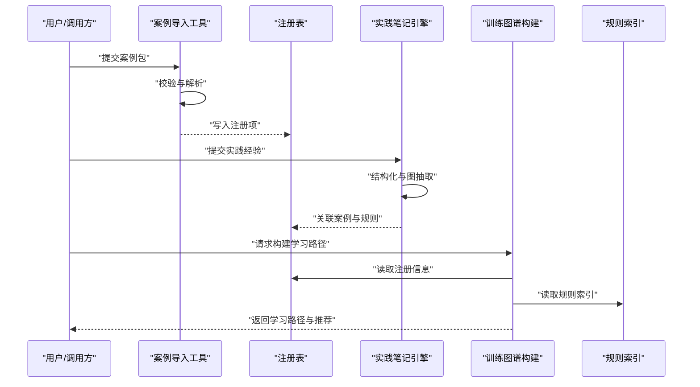
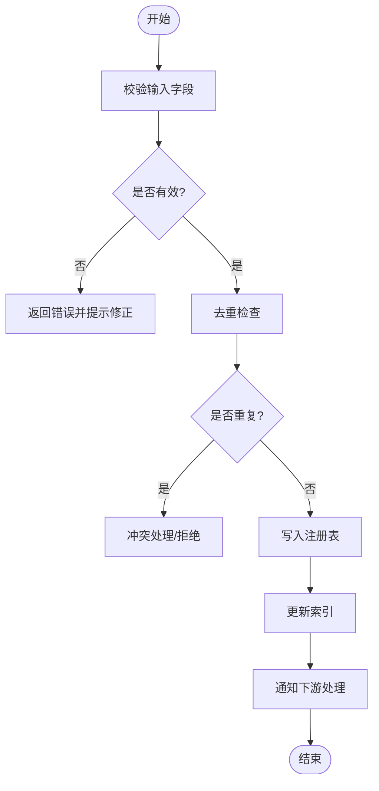
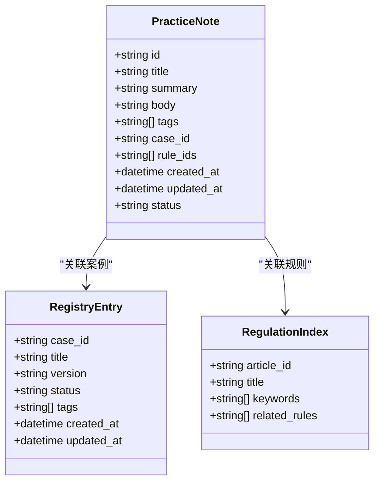
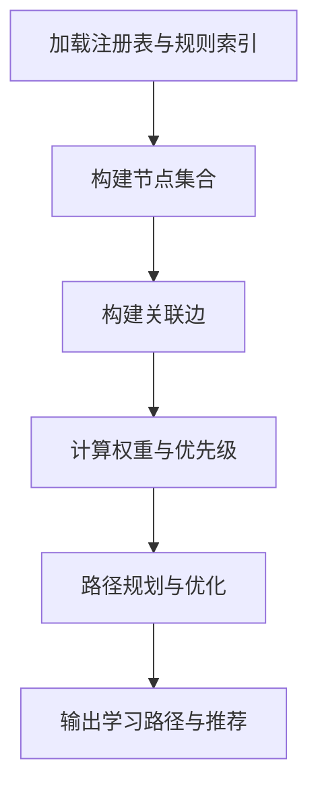
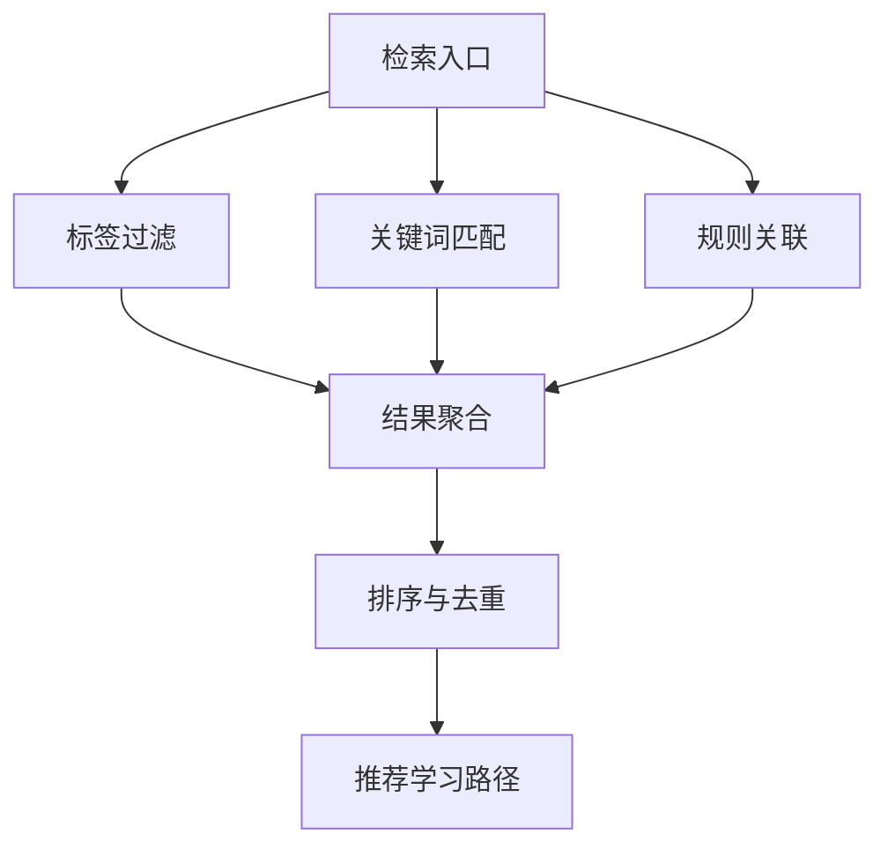
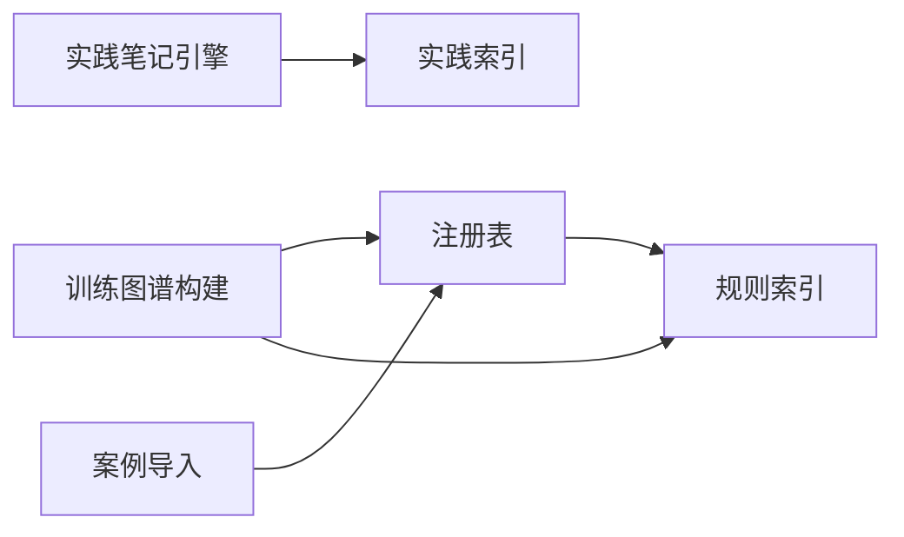

# 培训系统

<cite>
**本文引用的文件**   
- [practice_notes/README.md](file://practice_notes/README.md)
- [practice_notes/index.json](file://practice_notes/index.json)
- [tools/training_intake.py](file://tools/training_intake.py)
- [tools/practice_note_engine.py](file://tools/practice_note_engine.py)
- [rules/regulation_index.json](file://rules/regulation_index.json)
- [skills/training-mode.md](file://skills/training-mode.md)
- [tests/test_training_intake.py](file://tests/test_training_intake.py)
- [tests/test_practice_note_engine.py](file://tests/test_practice_note_engine.py)
- [tests/test_training_graph_build.py](file://tests/test_training_graph_build.py)
</cite>

## 目录
1. [简介](#简介)
2. [项目结构](#项目结构)
3. [核心组件](#核心组件)
4. [架构总览](#架构总览)
5. [详细组件分析](#详细组件分析)
6. [依赖关系分析](#依赖关系分析)
7. [性能考量](#性能考量)
8. [故障排查指南](#故障排查指南)
9. [结论](#结论)
10. [附录](#附录)

## 简介
本技术文档面向培训系统的开发者与使用者，系统性阐述案例导入、注册管理与实践经验笔记三大功能模块的实现方式，并说明培训材料的组织结构、版本控制与检索机制。文档同时给出添加新案例、管理实践经验、生成学习路径的具体步骤与示例路径，解释数据模型、搜索算法与推荐逻辑，以及与审查系统的集成方式和知识传承机制。最后提供培训内容扩展和学习效果评估的开发指南，帮助团队持续完善培训体系。

## 项目结构
培训系统围绕“规则与索引”“培训材料”“实践笔记”“工具脚本”“测试”五大层次组织：
- 规则与索引：集中存放法规条款索引与混合用途规则等，为检索与推荐提供基础。
- 培训材料：以收件箱与注册表形式组织待审核与已注册的培训案例。
- 实践笔记：以活跃、暂存、图提取等子目录管理实践沉淀，并以索引文件进行统一编目。
- 工具脚本：提供案例导入、实践笔记引擎、训练图谱构建等能力。
- 测试：覆盖导入流程、实践笔记引擎、训练图谱构建等关键路径的自动化验证。

图表来源
- [rules/regulation_index.json](file://rules/regulation_index.json)
- [training/registry.json](file://training/registry.json)
- [practice_notes/index.json](file://practice_notes/index.json)
- [tools/training_intake.py](file://tools/training_intake.py)
- [tools/practice_note_engine.py](file://tools/practice_note_engine.py)
- [tests/test_training_intake.py](file://tests/test_training_intake.py)
- [tests/test_practice_note_engine.py](file://tests/test_practice_note_engine.py)
- [tests/test_training_graph_build.py](file://tests/test_training_graph_build.py)

章节来源
- [practice_notes/README.md](file://practice_notes/README.md)
- [practice_notes/index.json](file://practice_notes/index.json)
- [rules/regulation_index.json](file://rules/regulation_index.json)
- [skills/training-mode.md](file://skills/training-mode.md)

## 核心组件
- 案例导入（Training Intake）
  - 负责从输入源解析案例元数据与内容，校验必填字段与格式，写入收件箱或注册表，并触发后续处理。
  - 典型职责：字段校验、去重、版本标记、索引更新、错误回滚。
- 实践笔记引擎（Practice Note Engine）
  - 负责实践经验的采集、结构化、图抽取与索引维护；支持将经验关联到具体案例与规则条目。
  - 典型职责：文本解析、实体识别、关系抽取、索引合并、冲突解决。
- 训练图谱构建（Training Graph Build）
  - 基于注册表与规则索引构建学习图谱，用于检索与推荐学习路径。
  - 典型职责：节点/边构建、权重计算、路径规划、缓存更新。

章节来源
- [tools/training_intake.py](file://tools/training_intake.py)
- [tools/practice_note_engine.py](file://tools/practice_note_engine.py)
- [tests/test_training_intake.py](file://tests/test_training_intake.py)
- [tests/test_practice_note_engine.py](file://tests/test_practice_note_engine.py)

## 架构总览
培训系统采用“数据驱动+工具编排”的架构：
- 数据层：以 JSON 索引与目录结构承载案例注册与实践笔记，保证可追溯与易扩展。
- 服务层：通过工具脚本实现案例导入、实践笔记处理与图谱构建。
- 应用层：对外暴露命令行接口与测试用例，支撑批量处理与质量保障。

图表来源
- [tools/training_intake.py](file://tools/training_intake.py)
- [tools/practice_note_engine.py](file://tools/practice_note_engine.py)
- [tools/training_graph_build.py](file://tools/training_graph_build.py)
- [rules/regulation_index.json](file://rules/regulation_index.json)
- [training/registry.json](file://training/registry.json)

## 详细组件分析

### 案例导入（Training Intake）
- 功能要点
  - 接收案例输入（表单、模板、清单），解析并校验关键字段（标题、版本、作者、时间戳、标签、关联规则）。
  - 将有效案例写入收件箱或注册表，生成唯一标识与版本记录。
  - 失败时提供明确错误信息与回滚策略，确保一致性。
- 数据模型
  - 案例对象包含：标识、标题、版本、状态、创建/更新时间、作者、标签、关联规则、附件路径等。
- 处理流程
  - 输入校验 → 去重检查 → 写入注册表 → 更新索引 → 通知下游处理。

图表来源
- [tools/training_intake.py](file://tools/training_intake.py)
- [tests/test_training_intake.py](file://tests/test_training_intake.py)

章节来源
- [tools/training_intake.py](file://tools/training_intake.py)
- [tests/test_training_intake.py](file://tests/test_training_intake.py)

### 实践笔记（Practice Notes）
- 功能要点
  - 收集实践经验，进行结构化存储与图抽取，形成可检索的知识片段。
  - 支持多阶段管理：活跃区（active）、暂存区（staging）、图提取结果（graph_extractions）。
  - 通过索引文件统一管理，便于跨案例与跨主题检索。
- 数据模型
  - 实践笔记对象包含：标识、标题、摘要、正文、标签、关联案例、关联规则、创建/更新时间、状态等。
- 处理流程
  - 采集输入 → 结构化解析 → 实体/关系抽取 → 索引合并 → 冲突解决 → 持久化。

图表来源
- [practice_notes/index.json](file://practice_notes/index.json)
- [tools/practice_note_engine.py](file://tools/practice_note_engine.py)
- [rules/regulation_index.json](file://rules/regulation_index.json)

章节来源
- [practice_notes/README.md](file://practice_notes/README.md)
- [practice_notes/index.json](file://practice_notes/index.json)
- [tools/practice_note_engine.py](file://tools/practice_note_engine.py)
- [tests/test_practice_note_engine.py](file://tests/test_practice_note_engine.py)

### 训练图谱构建（Training Graph Build）
- 功能要点
  - 基于注册表与规则索引构建学习图谱，节点为案例/知识点，边为依赖/关联关系。
  - 根据用户目标与已有进度生成个性化学习路径，支持权重排序与路径优化。
- 处理流程
  - 读取注册表与规则索引 → 构建节点与边 → 计算权重与可达性 → 生成路径 → 输出结果。

图表来源
- [tools/training_graph_build.py](file://tools/training_graph_build.py)
- [rules/regulation_index.json](file://rules/regulation_index.json)
- [training/registry.json](file://training/registry.json)

章节来源
- [tests/test_training_graph_build.py](file://tests/test_training_graph_build.py)

### 概念总览
- 检索机制
  - 基于标签、关键词、关联规则的多维检索，结合索引文件快速定位案例与实践笔记。
- 版本控制
  - 每个案例与实践笔记均包含版本号与时间戳，支持增量更新与历史回溯。
- 推荐逻辑
  - 依据用户目标、已完成内容与关联强度，生成个性化学习路径与推荐顺序。

[此图为概念流程图，不直接映射具体源码文件]

## 依赖关系分析
- 内部依赖
  - 案例导入依赖注册表与索引更新；实践笔记引擎依赖索引与图抽取结果；训练图谱构建依赖注册表与规则索引。
- 外部依赖
  - 规则索引与审查系统的数据契约，确保案例与实践笔记能正确关联法规条款。
- 循环依赖
  - 各工具之间无循环依赖，通过数据文件与索引进行解耦。

图表来源
- [tools/training_intake.py](file://tools/training_intake.py)
- [tools/practice_note_engine.py](file://tools/practice_note_engine.py)
- [tools/training_graph_build.py](file://tools/training_graph_build.py)
- [rules/regulation_index.json](file://rules/regulation_index.json)
- [training/registry.json](file://training/registry.json)
- [practice_notes/index.json](file://practice_notes/index.json)

章节来源
- [rules/regulation_index.json](file://rules/regulation_index.json)
- [training/registry.json](file://training/registry.json)
- [practice_notes/index.json](file://practice_notes/index.json)

## 性能考量
- 索引设计
  - 使用轻量 JSON 索引，避免重型数据库依赖，提升读写效率与可移植性。
- 批处理
  - 案例导入与实践笔记处理支持批量操作，减少 I/O 开销。
- 缓存策略
  - 图谱构建结果可缓存，避免重复计算；索引更新采用增量合并。
- 资源限制
  - 对大体积输入进行分块处理，防止内存溢出。

[本节为通用指导，不直接分析具体文件]

## 故障排查指南
- 常见错误
  - 字段缺失或格式错误：检查输入模板与校验规则。
  - 去重冲突：确认唯一标识与版本策略。
  - 索引不一致：重新构建索引并校验完整性。
- 调试建议
  - 启用详细日志，定位失败步骤。
  - 使用测试用例复现问题，逐步缩小范围。
  - 检查文件权限与路径配置。

章节来源
- [tests/test_training_intake.py](file://tests/test_training_intake.py)
- [tests/test_practice_note_engine.py](file://tests/test_practice_note_engine.py)
- [tests/test_training_graph_build.py](file://tests/test_training_graph_build.py)

## 结论
培训系统以数据为中心，通过案例导入、实践笔记与图谱构建三大模块，形成完整的培训材料组织、检索与推荐闭环。借助清晰的目录结构与 JSON 索引，系统在可扩展性与可维护性方面具备良好基础。未来可进一步引入更丰富的检索算法与评估指标，以提升学习效果与用户体验。

[本节为总结性内容，不直接分析具体文件]

## 附录
- 添加新培训案例的步骤
  - 准备案例包（含元数据与内容），遵循模板规范。
  - 运行案例导入工具，完成校验与注册。
  - 验证注册表与索引是否正确更新。
- 管理实践经验的步骤
  - 在实践笔记目录中新增条目，填写结构化字段。
  - 运行实践笔记引擎，完成图抽取与索引合并。
  - 检查索引一致性与关联关系。
- 生成学习路径的步骤
  - 指定学习目标与用户进度。
  - 运行训练图谱构建工具，获取路径与推荐。
  - 导出结果并反馈给用户。

章节来源
- [skills/training-mode.md](file://skills/training-mode.md)
- [tools/training_intake.py](file://tools/training_intake.py)
- [tools/practice_note_engine.py](file://tools/practice_note_engine.py)
- [tools/training_graph_build.py](file://tools/training_graph_build.py)