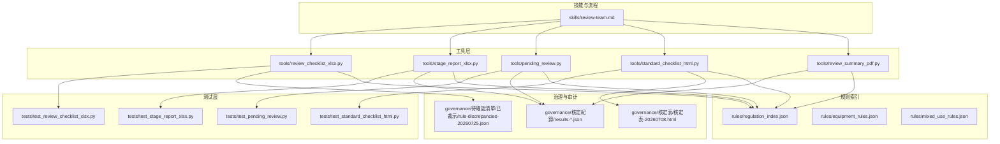
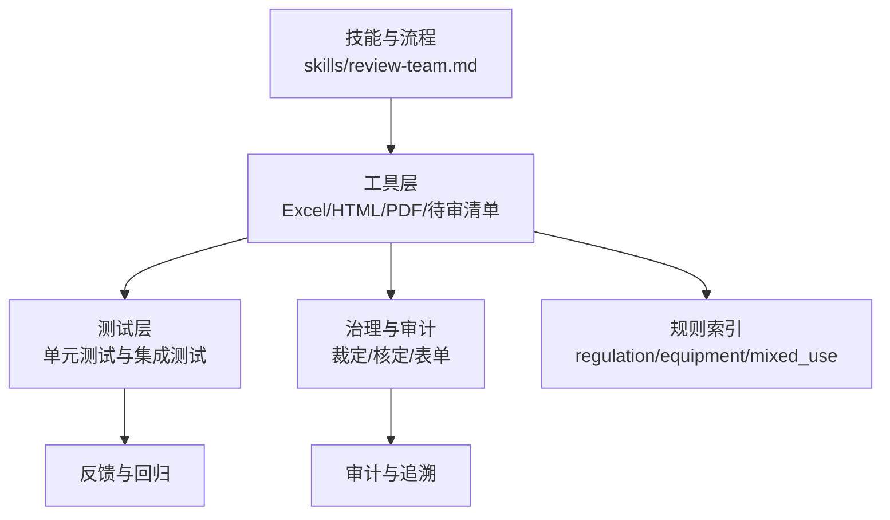
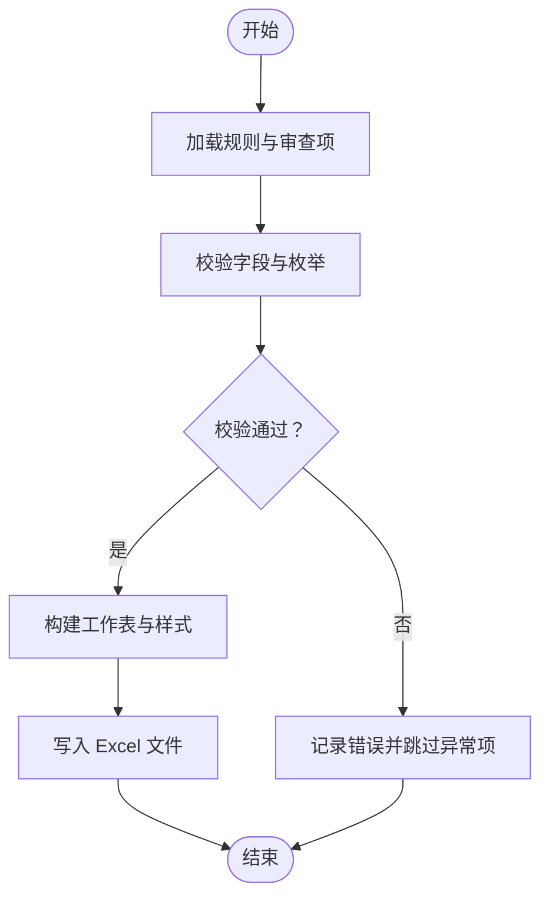
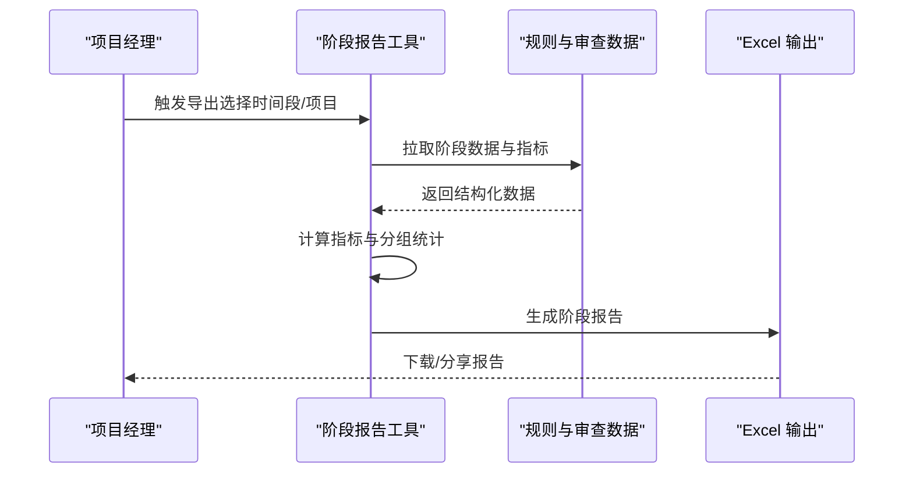
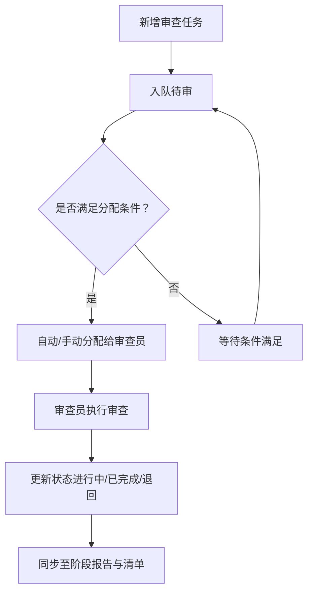
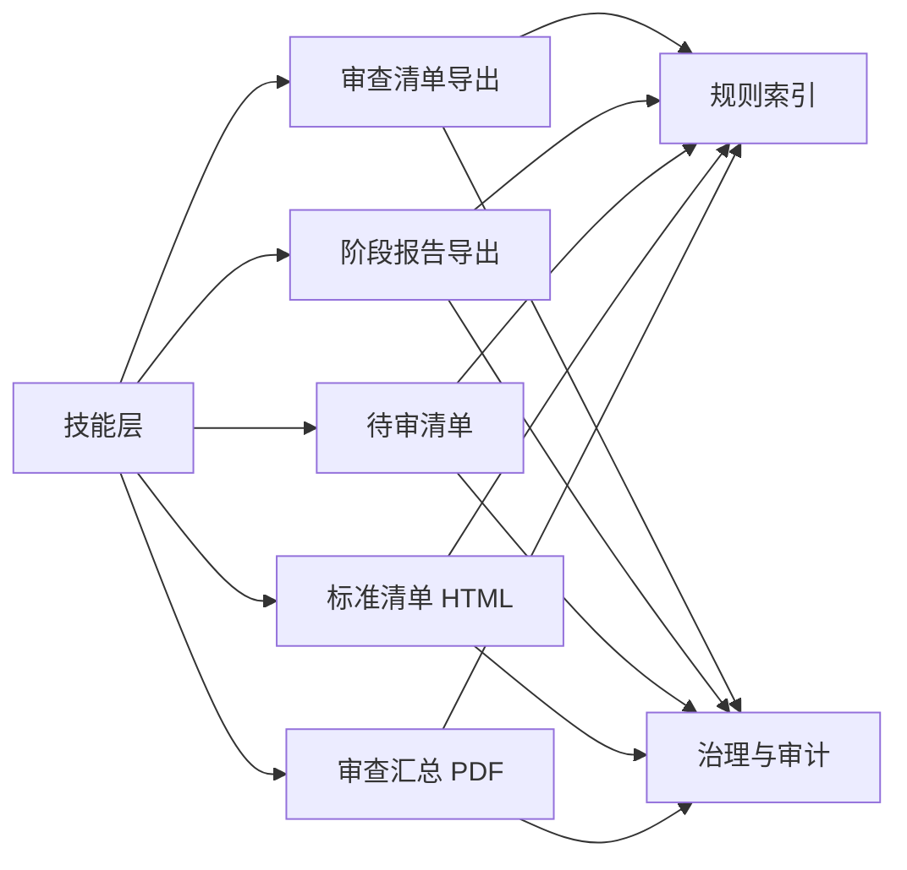

# 团队协作管理

<cite>
**本文引用的文件**   
- [skills/review-team.md](file://skills/review-team.md)
- [tools/review_checklist_xlsx.py](file://tools/review_checklist_xlsx.py)
- [tests/test_review_checklist_xlsx.py](file://tests/test_review_checklist_xlsx.py)
- [tools/stage_report_xlsx.py](file://tools/stage_report_xlsx.py)
- [tests/test_stage_report_xlsx.py](file://tests/test_stage_report_xlsx.py)
- [tools/pending_review.py](file://tools/pending_review.py)
- [tests/test_pending_review.py](file://tests/test_pending_review.py)
- [tools/standard_checklist_html.py](file://tools/standard_checklist_html.py)
- [tests/test_standard_checklist_html.py](file://tests/test_standard_checklist_html.py)
- [tools/review_summary_pdf.py](file://tools/review_summary_pdf.py)
- [governance/待確認清單/已裁示/rule-discrepancies-20260725.json](file://governance/待確認清單/已裁示/rule-discrepancies-20260725.json)
- [governance/核定紀錄/results-20260725-article18.json](file://governance/核定紀錄/results-20260725-article18.json)
- [governance/核定紀錄/results-20260729-pending-review.json](file://governance/核定紀錄/results-20260729-pending-review.json)
- [governance/核定表/核定表-20260708.html](file://governance/核定表/核定表-20260708.html)
- [rules/regulation_index.json](file://rules/regulation_index.json)
- [rules/equipment_rules.json](file://rules/equipment_rules.json)
- [rules/mixed_use_rules.json](file://rules/mixed_use_rules.json)
- [AGENTS.md](file://AGENTS.md)
- [CLAUDE.md](file://CLAUDE.md)
</cite>

## 目录
1. [简介](#简介)
2. [项目结构](#项目结构)
3. [核心组件](#核心组件)
4. [架构总览](#架构总览)
5. [详细组件分析](#详细组件分析)
6. [依赖分析](#依赖分析)
7. [性能考量](#性能考量)
8. [故障排查指南](#故障排查指南)
9. [结论](#结论)
10. [附录](#附录)

## 简介
本文件围绕“审查团队协作管理”能力进行系统化说明，覆盖团队成员角色与权限、任务分配与跟踪、沟通与版本控制策略、Excel导出规范与批量处理、以及团队绩效统计与进度监控的实现方式。文档以仓库中的技能说明、工具脚本、测试用例与治理数据为依据，帮助读者快速理解并落地多人员并行审查、任务交接与质量审核流程。

## 项目结构
协作相关能力主要分布在以下位置：
- 技能与流程定义：skills/ 下的 review-team.md 等
- 工具实现：tools/ 下的 Excel/PDF/HTML 生成与待审清单工具
- 测试验证：tests/ 下对应工具的测试用例
- 治理与审计：governance/ 下的裁定、核定记录与表单
- 规则索引：rules/ 下的法规与设备规则索引

图表来源
- [skills/review-team.md](file://skills/review-team.md)
- [tools/review_checklist_xlsx.py](file://tools/review_checklist_xlsx.py)
- [tools/stage_report_xlsx.py](file://tools/stage_report_xlsx.py)
- [tools/pending_review.py](file://tools/pending_review.py)
- [tools/standard_checklist_html.py](file://tools/standard_checklist_html.py)
- [tools/review_summary_pdf.py](file://tools/review_summary_pdf.py)
- [tests/test_review_checklist_xlsx.py](file://tests/test_review_checklist_xlsx.py)
- [tests/test_stage_report_xlsx.py](file://tests/test_stage_report_xlsx.py)
- [tests/test_pending_review.py](file://tests/test_pending_review.py)
- [tests/test_standard_checklist_html.py](file://tests/test_standard_checklist_html.py)
- [governance/待確認清單/已裁示/rule-discrepancies-20260725.json](file://governance/待確認清單/已裁示/rule-discrepancies-20260725.json)
- [governance/核定紀錄/results-20260725-article18.json](file://governance/核定紀錄/results-20260725-article18.json)
- [governance/核定紀錄/results-20260729-pending-review.json](file://governance/核定紀錄/results-20260729-pending-review.json)
- [governance/核定表/核定表-20260708.html](file://governance/核定表/核定表-20260708.html)
- [rules/regulation_index.json](file://rules/regulation_index.json)
- [rules/equipment_rules.json](file://rules/equipment_rules.json)
- [rules/mixed_use_rules.json](file://rules/mixed_use_rules.json)

章节来源
- [skills/review-team.md](file://skills/review-team.md)
- [tools/review_checklist_xlsx.py](file://tools/review_checklist_xlsx.py)
- [tools/stage_report_xlsx.py](file://tools/stage_report_xlsx.py)
- [tools/pending_review.py](file://tools/pending_review.py)
- [tools/standard_checklist_html.py](file://tools/standard_checklist_html.py)
- [tools/review_summary_pdf.py](file://tools/review_summary_pdf.py)
- [tests/test_review_checklist_xlsx.py](file://tests/test_review_checklist_xlsx.py)
- [tests/test_stage_report_xlsx.py](file://tests/test_stage_report_xlsx.py)
- [tests/test_pending_review.py](file://tests/test_pending_review.py)
- [tests/test_standard_checklist_html.py](file://tests/test_standard_checklist_html.py)
- [governance/待確認清單/已裁示/rule-discrepancies-20260725.json](file://governance/待確認清單/已裁示/rule-discrepancies-20260725.json)
- [governance/核定紀錄/results-20260725-article18.json](file://governance/核定紀錄/results-20260725-article18.json)
- [governance/核定紀錄/results-20260729-pending-review.json](file://governance/核定紀錄/results-20260729-pending-review.json)
- [governance/核定表/核定表-20260708.html](file://governance/核定表/核定表-20260708.html)
- [rules/regulation_index.json](file://rules/regulation_index.json)
- [rules/equipment_rules.json](file://rules/equipment_rules.json)
- [rules/mixed_use_rules.json](file://rules/mixed_use_rules.json)

## 核心组件
- 团队协作技能与流程：review-team.md 定义了角色、权限、任务流转与协作约定，是协作管理的“业务契约”。
- 审查清单导出：review_checklist_xlsx.py 负责将审查项按模板导出为 Excel，支持批量与字段规范化。
- 阶段报告导出：stage_report_xlsx.py 输出阶段性汇总报表，用于进度监控与绩效统计。
- 待审清单：pending_review.py 维护“待审”队列，支撑任务分配与跟踪。
- 标准清单 HTML：standard_checklist_html.py 生成可共享的 HTML 清单，便于跨角色审阅与批注。
- 审查汇总 PDF：review_summary_pdf.py 聚合结果形成对外交付物。
- 治理与审计：governance/ 目录存放裁定、核定记录与表单，作为变更管理与质量审核的证据链。
- 规则索引：rules/ 提供法规与设备规则索引，驱动审查项与判定逻辑。

章节来源
- [skills/review-team.md](file://skills/review-team.md)
- [tools/review_checklist_xlsx.py](file://tools/review_checklist_xlsx.py)
- [tools/stage_report_xlsx.py](file://tools/stage_report_xlsx.py)
- [tools/pending_review.py](file://tools/pending_review.py)
- [tools/standard_checklist_html.py](file://tools/standard_checklist_html.py)
- [tools/review_summary_pdf.py](file://tools/review_summary_pdf.py)
- [governance/待確認清單/已裁示/rule-discrepancies-20260725.json](file://governance/待確認清單/已裁示/rule-discrepancies-20260725.json)
- [governance/核定紀錄/results-20260725-article18.json](file://governance/核定紀錄/results-20260725-article18.json)
- [governance/核定紀錄/results-20260729-pending-review.json](file://governance/核定紀錄/results-20260729-pending-review.json)
- [governance/核定表/核定表-20260708.html](file://governance/核定表/核定表-20260708.html)
- [rules/regulation_index.json](file://rules/regulation_index.json)
- [rules/equipment_rules.json](file://rules/equipment_rules.json)
- [rules/mixed_use_rules.json](file://rules/mixed_use_rules.json)

## 架构总览
协作系统采用“技能定义 + 工具实现 + 测试保障 + 治理归档”的分层架构。技能层规定角色、权限与流程；工具层实现数据导出、任务队列与报告生成；测试层确保行为稳定；治理层沉淀裁定与核定证据，支撑合规与审计。

图表来源
- [skills/review-team.md](file://skills/review-team.md)
- [tools/review_checklist_xlsx.py](file://tools/review_checklist_xlsx.py)
- [tools/stage_report_xlsx.py](file://tools/stage_report_xlsx.py)
- [tools/pending_review.py](file://tools/pending_review.py)
- [tools/standard_checklist_html.py](file://tools/standard_checklist_html.py)
- [tools/review_summary_pdf.py](file://tools/review_summary_pdf.py)
- [tests/test_review_checklist_xlsx.py](file://tests/test_review_checklist_xlsx.py)
- [tests/test_stage_report_xlsx.py](file://tests/test_stage_report_xlsx.py)
- [tests/test_pending_review.py](file://tests/test_pending_review.py)
- [tests/test_standard_checklist_html.py](file://tests/test_standard_checklist_html.py)
- [governance/待確認清單/已裁示/rule-discrepancies-20260725.json](file://governance/待確認清單/已裁示/rule-discrepancies-20260725.json)
- [governance/核定紀錄/results-20260725-article18.json](file://governance/核定紀錄/results-20260725-article18.json)
- [governance/核定紀錄/results-20260729-pending-review.json](file://governance/核定紀錄/results-20260729-pending-review.json)
- [governance/核定表/核定表-20260708.html](file://governance/核定表/核定表-20260708.html)
- [rules/regulation_index.json](file://rules/regulation_index.json)
- [rules/equipment_rules.json](file://rules/equipment_rules.json)
- [rules/mixed_use_rules.json](file://rules/mixed_use_rules.json)

## 详细组件分析

### 团队协作技能与流程（review-team.md）
- 角色与权限：定义审查员、复核员、管理员等角色及其操作边界，明确谁可创建任务、分配任务、修改状态与导出报告。
- 任务生命周期：从创建、分配、执行、复核到归档的全链路状态机，包含退回、升级、暂停与完成等状态转换。
- 协作约定：包括命名规范、提交信息、分支策略、合并审批与冲突解决流程。
- 沟通机制：建议通过清单评论、批注与会议纪要沉淀在治理目录，保证可追溯。

章节来源
- [skills/review-team.md](file://skills/review-team.md)

### 审查清单 Excel 导出（review_checklist_xlsx.py）
- 功能要点：读取规则与审查项，按模板生成 Excel，支持批量导出与字段校验。
- 数据格式：统一列名、数据类型与枚举值，便于下游统计与可视化。
- 批量处理：支持按项目或批次批量生成，避免重复计算。
- 错误处理：对缺失字段、类型不匹配与空值进行提示与跳过策略。

图表来源
- [tools/review_checklist_xlsx.py](file://tools/review_checklist_xlsx.py)
- [tests/test_review_checklist_xlsx.py](file://tests/test_review_checklist_xlsx.py)

章节来源
- [tools/review_checklist_xlsx.py](file://tools/review_checklist_xlsx.py)
- [tests/test_review_checklist_xlsx.py](file://tests/test_review_checklist_xlsx.py)

### 阶段报告 Excel 导出（stage_report_xlsx.py）
- 功能要点：汇总各阶段进度、通过率、问题分布与责任人，输出阶段报告。
- 指标口径：定义完成率、返工率、平均耗时等关键指标的计算方式。
- 使用场景：周/月报、里程碑评审与绩效统计。

图表来源
- [tools/stage_report_xlsx.py](file://tools/stage_report_xlsx.py)
- [tests/test_stage_report_xlsx.py](file://tests/test_stage_report_xlsx.py)

章节来源
- [tools/stage_report_xlsx.py](file://tools/stage_report_xlsx.py)
- [tests/test_stage_report_xlsx.py](file://tests/test_stage_report_xlsx.py)

### 待审清单与任务跟踪（pending_review.py）
- 功能要点：维护待审队列，支持按优先级、责任人与截止日期筛选与排序。
- 任务分配：支持批量指派与自动路由（基于规则与负载）。
- 状态同步：与审查清单和阶段报告联动，确保一致性。

图表来源
- [tools/pending_review.py](file://tools/pending_review.py)
- [tests/test_pending_review.py](file://tests/test_pending_review.py)

章节来源
- [tools/pending_review.py](file://tools/pending_review.py)
- [tests/test_pending_review.py](file://tests/test_pending_review.py)

### 标准清单 HTML 生成（standard_checklist_html.py）
- 功能要点：将审查清单生成为 HTML，便于在线查看与批注。
- 交互设计：支持折叠/展开、高亮问题项、跳转定位。
- 协作方式：结合评论与批注，提升多人并行审查效率。

章节来源
- [tools/standard_checklist_html.py](file://tools/standard_checklist_html.py)
- [tests/test_standard_checklist_html.py](file://tests/test_standard_checklist_html.py)

### 审查汇总 PDF（review_summary_pdf.py）
- 功能要点：聚合审查结果、问题清单与建议，生成对外交付的 PDF。
- 内容结构：封面、摘要、问题明细、整改建议与签名页。
- 版本控制：每次生成附带时间戳与版本号，便于归档与追溯。

章节来源
- [tools/review_summary_pdf.py](file://tools/review_summary_pdf.py)

### 治理与审计（governance/）
- 裁定与差异：rule-discrepancies-*.json 记录规则差异与裁定结论，作为争议处理的依据。
- 核定记录：results-*.json 保存各轮核定的结果与决策，支撑质量审核。
- 核定表：核定表 HTML 作为正式交付物，供干系人确认与存档。

章节来源
- [governance/待確認清單/已裁示/rule-discrepancies-20260725.json](file://governance/待確認清單/已裁示/rule-discrepancies-20260725.json)
- [governance/核定紀錄/results-20260725-article18.json](file://governance/核定紀錄/results-20260725-article18.json)
- [governance/核定紀錄/results-20260729-pending-review.json](file://governance/核定紀錄/results-20260729-pending-review.json)
- [governance/核定表/核定表-20260708.html](file://governance/核定表/核定表-20260708.html)

### 规则索引（rules/）
- regulation_index.json：法规条款索引，驱动审查项映射与引用。
- equipment_rules.json / mixed_use_rules.json：设备与混合用途规则，细化审查维度。

章节来源
- [rules/regulation_index.json](file://rules/regulation_index.json)
- [rules/equipment_rules.json](file://rules/equipment_rules.json)
- [rules/mixed_use_rules.json](file://rules/mixed_use_rules.json)

## 依赖分析
- 技能层依赖工具层实现具体功能；工具层依赖规则索引确定审查项与判定逻辑；测试层保障工具行为正确性；治理层沉淀过程证据，供审计与复盘。
- 潜在耦合点：工具间的数据格式需保持一致（如任务 ID、状态枚举、时间戳），以避免同步不一致。

图表来源
- [skills/review-team.md](file://skills/review-team.md)
- [tools/review_checklist_xlsx.py](file://tools/review_checklist_xlsx.py)
- [tools/stage_report_xlsx.py](file://tools/stage_report_xlsx.py)
- [tools/pending_review.py](file://tools/pending_review.py)
- [tools/standard_checklist_html.py](file://tools/standard_checklist_html.py)
- [tools/review_summary_pdf.py](file://tools/review_summary_pdf.py)
- [rules/regulation_index.json](file://rules/regulation_index.json)
- [rules/equipment_rules.json](file://rules/equipment_rules.json)
- [rules/mixed_use_rules.json](file://rules/mixed_use_rules.json)
- [governance/待確認清單/已裁示/rule-discrepancies-20260725.json](file://governance/待確認清單/已裁示/rule-discrepancies-20260725.json)
- [governance/核定紀錄/results-20260725-article18.json](file://governance/核定紀錄/results-20260725-article18.json)
- [governance/核定紀錄/results-20260729-pending-review.json](file://governance/核定紀錄/results-20260729-pending-review.json)
- [governance/核定表/核定表-20260708.html](file://governance/核定表/核定表-20260708.html)

章节来源
- [skills/review-team.md](file://skills/review-team.md)
- [tools/review_checklist_xlsx.py](file://tools/review_checklist_xlsx.py)
- [tools/stage_report_xlsx.py](file://tools/stage_report_xlsx.py)
- [tools/pending_review.py](file://tools/pending_review.py)
- [tools/standard_checklist_html.py](file://tools/standard_checklist_html.py)
- [tools/review_summary_pdf.py](file://tools/review_summary_pdf.py)
- [rules/regulation_index.json](file://rules/regulation_index.json)
- [rules/equipment_rules.json](file://rules/equipment_rules.json)
- [rules/mixed_use_rules.json](file://rules/mixed_use_rules.json)
- [governance/待確認清單/已裁示/rule-discrepancies-20260725.json](file://governance/待確認清單/已裁示/rule-discrepancies-20260725.json)
- [governance/核定紀錄/results-20260725-article18.json](file://governance/核定紀錄/results-20260725-article18.json)
- [governance/核定紀錄/results-20260729-pending-review.json](file://governance/核定紀錄/results-20260729-pending-review.json)
- [governance/核定表/核定表-20260708.html](file://governance/核定表/核定表-20260708.html)

## 性能考量
- 批量导出：优先使用流式写入与分页查询，减少内存占用。
- 缓存策略：对规则索引与常用模板进行缓存，降低重复解析开销。
- 并发控制：对高并发导出任务进行限流与队列化，避免资源争用。
- 增量更新：仅重算变更部分，提升大项目导出速度。

[本节为通用指导，不直接分析具体文件]

## 故障排查指南
- 导出失败：检查输入数据完整性与字段类型，核对枚举值是否在允许范围内。
- 状态不同步：确认任务状态更新路径与事件触发点，检查待审清单与报告的一致性。
- 规则冲突：查阅 rule-discrepancies 与 results 记录，定位裁定与核定结论。
- 权限问题：根据 review-team.md 的角色定义，确认当前用户具备所需权限。

章节来源
- [tools/review_checklist_xlsx.py](file://tools/review_checklist_xlsx.py)
- [tools/stage_report_xlsx.py](file://tools/stage_report_xlsx.py)
- [tools/pending_review.py](file://tools/pending_review.py)
- [tools/standard_checklist_html.py](file://tools/standard_checklist_html.py)
- [tools/review_summary_pdf.py](file://tools/review_summary_pdf.py)
- [governance/待確認清單/已裁示/rule-discrepancies-20260725.json](file://governance/待確認清單/已裁示/rule-discrepancies-20260725.json)
- [governance/核定紀錄/results-20260725-article18.json](file://governance/核定紀錄/results-20260725-article18.json)
- [governance/核定紀錄/results-20260729-pending-review.json](file://governance/核定紀錄/results-20260729-pending-review.json)

## 结论
本协作管理体系以技能定义为契约、工具实现为抓手、测试为保障、治理为证据，形成闭环。通过标准化的 Excel/HTML/PDF 输出与待审清单管理，团队可实现高效的多人员并行审查、任务交接与质量审核。配合规则索引与治理记录，确保合规性与可追溯性。

[本节为总结性内容，不直接分析具体文件]

## 附录
- 团队工作绩效统计与进度监控：基于 stage_report_xlsx.py 的指标口径，结合 pending_review.py 的任务状态，形成周报/月报与看板。
- 版本控制与变更管理：遵循 AGENTS.md 与 CLAUDE.md 的协作约定，使用分支策略与合并审批，所有裁定与核定记录归档于 governance/。

章节来源
- [tools/stage_report_xlsx.py](file://tools/stage_report_xlsx.py)
- [tools/pending_review.py](file://tools/pending_review.py)
- [AGENTS.md](file://AGENTS.md)
- [CLAUDE.md](file://CLAUDE.md)