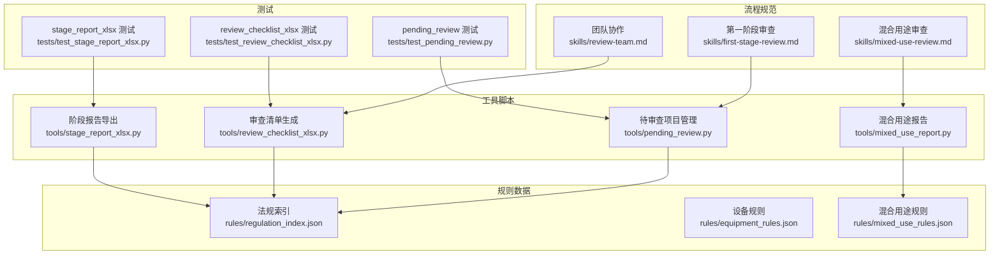
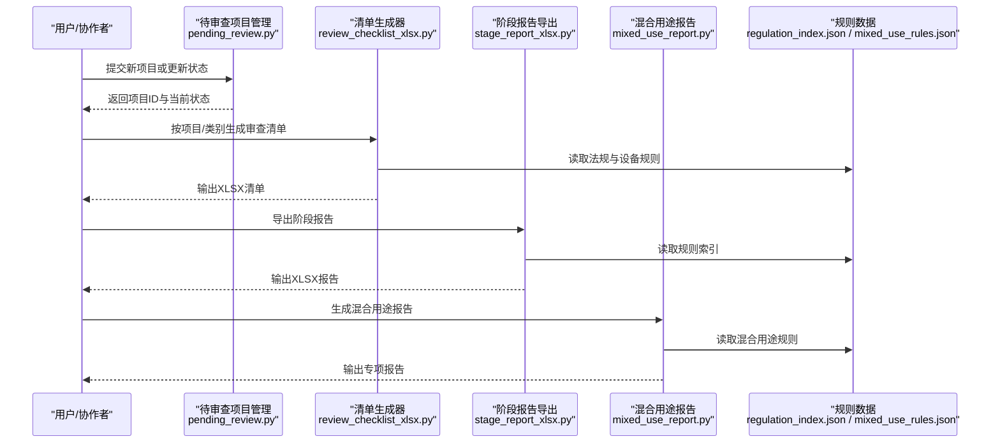
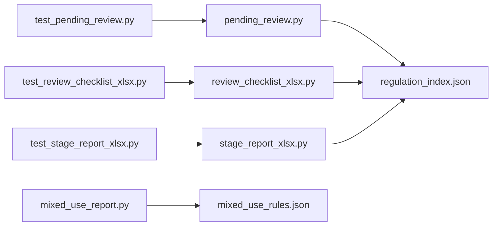

# 审查工作流

<cite>
**本文引用的文件**   
- [skills/first-stage-review.md](file://skills/first-stage-review.md)
- [skills/mixed-use-review.md](file://skills/mixed-use-review.md)
- [skills/review-team.md](file://skills/review-team.md)
- [tools/pending_review.py](file://tools/pending_review.py)
- [tools/review_checklist_xlsx.py](file://tools/review_checklist_xlsx.py)
- [tools/stage_report_xlsx.py](file://tools/stage_report_xlsx.py)
- [tools/mixed_use_report.py](file://tools/mixed_use_report.py)
- [rules/regulation_index.json](file://rules/regulation_index.json)
- [rules/equipment_rules.json](file://rules/equipment_rules.json)
- [rules/mixed_use_rules.json](file://rules/mixed_use_rules.json)
- [tests/test_pending_review.py](file://tests/test_pending_review.py)
- [tests/test_review_checklist_xlsx.py](file://tests/test_review_checklist_xlsx.py)
- [tests/test_stage_report_xlsx.py](file://tests/test_stage_report_xlsx.py)
- [graphify-out/graph.json](file://graphify-out/graph.json)
- [AGENTS.md](file://AGENTS.md)
- [CLAUDE.md](file://CLAUDE.md)
</cite>

## 目录
1. [简介](#简介)
2. [项目结构](#项目结构)
3. [核心组件](#核心组件)
4. [架构总览](#架构总览)
5. [详细组件分析](#详细组件分析)
6. [依赖关系分析](#依赖关系分析)
7. [性能考量](#性能考量)
8. [故障排查指南](#故障排查指南)
9. [结论](#结论)
10. [附录](#附录)

## 简介
本文件为“审查工作流系统”的权威文档，聚焦以下目标：
- 第一阶段审查、混合用途审查与团队协作的工作流程说明
- 待审查项目的管理机制、审查清单生成与进度跟踪
- 启动审查流程、分配任务与生成报告的实操示例
- 工作流程状态转换、权限控制与通知机制
- 与图纸分析引擎和法规系统的集成方式
- 工作流定制与扩展指导

本系统以规则驱动为核心，结合结构化清单与报告输出，支持多角色协作与可审计的审查过程。

## 项目结构
仓库采用“技能（流程）+ 工具（脚本）+ 规则（数据）+ 测试（验证）”的分层组织：
- skills：定义各阶段审查与协作的流程规范
- tools：实现具体功能（待审管理、清单生成、报告导出等）
- rules：存放法规索引、设备规则、混合用途规则等数据
- tests：覆盖关键工具的单元测试
- graphify-out：图结构与成本等中间产物
- governance：治理与核定记录、待确认清单等归档

图表来源
- [skills/first-stage-review.md](file://skills/first-stage-review.md)
- [skills/mixed-use-review.md](file://skills/mixed-use-review.md)
- [skills/review-team.md](file://skills/review-team.md)
- [tools/pending_review.py](file://tools/pending_review.py)
- [tools/review_checklist_xlsx.py](file://tools/review_checklist_xlsx.py)
- [tools/stage_report_xlsx.py](file://tools/stage_report_xlsx.py)
- [tools/mixed_use_report.py](file://tools/mixed_use_report.py)
- [rules/regulation_index.json](file://rules/regulation_index.json)
- [rules/equipment_rules.json](file://rules/equipment_rules.json)
- [rules/mixed_use_rules.json](file://rules/mixed_use_rules.json)
- [tests/test_pending_review.py](file://tests/test_pending_review.py)
- [tests/test_review_checklist_xlsx.py](file://tests/test_review_checklist_xlsx.py)
- [tests/test_stage_report_xlsx.py](file://tests/test_stage_report_xlsx.py)

章节来源
- [AGENTS.md](file://AGENTS.md)
- [CLAUDE.md](file://CLAUDE.md)

## 核心组件
- 待审查项目管理（pending_review）
  - 负责新增、查询、筛选、更新待审查项目状态，维护生命周期与审计轨迹
  - 典型操作：创建待审项、标记进行中、完成并归档、批量处理
- 审查清单生成（review_checklist_xlsx）
  - 基于规则索引与项目上下文，生成结构化审查清单（XLSX），便于分派与追踪
  - 典型操作：按项目/类别过滤、导出清单、附加证据位
- 阶段报告导出（stage_report_xlsx）
  - 汇总阶段性审查结果，形成可交付的阶段报告（XLSX）
  - 典型操作：聚合通过/不通过/待决项，生成统计摘要
- 混合用途报告（mixed_use_report）
  - 针对混合用途场景，整合多类规则与判定逻辑，输出专项报告
  - 典型操作：识别用途组合、匹配规则集、生成判定与建议

章节来源
- [tools/pending_review.py](file://tools/pending_review.py)
- [tools/review_checklist_xlsx.py](file://tools/review_checklist_xlsx.py)
- [tools/stage_report_xlsx.py](file://tools/stage_report_xlsx.py)
- [tools/mixed_use_report.py](file://tools/mixed_use_report.py)

## 架构总览
系统由“流程规范—工具脚本—规则数据—测试验证”四层构成，并通过统一的输入输出约定进行协作。

图表来源
- [tools/pending_review.py](file://tools/pending_review.py)
- [tools/review_checklist_xlsx.py](file://tools/review_checklist_xlsx.py)
- [tools/stage_report_xlsx.py](file://tools/stage_report_xlsx.py)
- [tools/mixed_use_report.py](file://tools/mixed_use_report.py)
- [rules/regulation_index.json](file://rules/regulation_index.json)
- [rules/mixed_use_rules.json](file://rules/mixed_use_rules.json)

## 详细组件分析

### 第一阶段审查（First-Stage Review）
- 目标：快速筛查基础合规性，明确需深入审查的条目
- 关键步骤：
  - 收集项目基本信息与图纸材料
  - 依据规则索引与设备规则生成检查项
  - 标注通过/不通过/待补充证据
  - 产出第一阶段审查清单与初步建议
- 协作要点：
  - 指定主审人与复核人
  - 设置截止日期与提醒策略
  - 对不通过项要求整改闭环

章节来源
- [skills/first-stage-review.md](file://skills/first-stage-review.md)
- [tools/review_checklist_xlsx.py](file://tools/review_checklist_xlsx.py)
- [rules/regulation_index.json](file://rules/regulation_index.json)
- [rules/equipment_rules.json](file://rules/equipment_rules.json)

### 混合用途审查（Mixed-Use Review）
- 目标：处理多用途组合场景下的交叉规则冲突与优先级判定
- 关键步骤：
  - 识别用途组合与空间划分
  - 匹配混合用途规则集与设备规则
  - 生成冲突分析与处置建议
  - 输出混合用途专项报告
- 协作要点：
  - 多专业协同（消防、建筑、机电等）
  - 专家会签与争议裁决流程
  - 版本化规则引用与追溯

章节来源
- [skills/mixed-use-review.md](file://skills/mixed-use-review.md)
- [tools/mixed_use_report.py](file://tools/mixed_use_report.py)
- [rules/mixed_use_rules.json](file://rules/mixed_use_rules.json)

### 团队协作（Review Team）
- 角色与权限：
  - 发起人：创建项目、指派任务、审批通过
  - 主审人：执行审查、填写意见、上传证据
  - 复核人：审核结论一致性、质量把关
  - 管理员：配置规则、维护流程、审计日志
- 协作机制：
  - 任务看板与状态同步
  - 评论与批注留痕
  - 通知与提醒（截止前、变更时）

章节来源
- [skills/review-team.md](file://skills/review-team.md)

### 待审查项目管理（Pending Review）
- 能力概览：
  - 项目登记与唯一标识
  - 状态机：新建→进行中→待复核→已完成→已归档
  - 批量导入/导出与筛选查询
  - 审计轨迹与变更记录
- 使用示例：
  - 新增待审项：提供项目名称、类型、负责人、截止时间
  - 更新状态：从“进行中”推进至“待复核”，附审查意见
  - 导出清单：按状态或类别导出XLSX供分发

章节来源
- [tools/pending_review.py](file://tools/pending_review.py)
- [tests/test_pending_review.py](file://tests/test_pending_review.py)

### 审查清单生成（Review Checklist XLSX）
- 能力概览：
  - 基于规则索引与项目上下文构建检查项
  - 支持分类、优先级、证据字段
  - 输出标准XLSX模板，便于审阅与批注
- 使用示例：
  - 按项目ID生成清单
  - 按类别过滤（如消防设备、疏散通道）
  - 合并多份清单为总表

章节来源
- [tools/review_checklist_xlsx.py](file://tools/review_checklist_xlsx.py)
- [tests/test_review_checklist_xlsx.py](file://tests/test_review_checklist_xlsx.py)
- [rules/regulation_index.json](file://rules/regulation_index.json)

### 阶段报告导出（Stage Report XLSX）
- 能力概览：
  - 汇总通过/不通过/待决项数量与比例
  - 生成统计摘要与趋势图
  - 支持按阶段、责任人、类别维度聚合
- 使用示例：
  - 选择时间范围与阶段标签
  - 导出阶段报告并分发相关方

章节来源
- [tools/stage_report_xlsx.py](file://tools/stage_report_xlsx.py)
- [tests/test_stage_report_xlsx.py](file://tests/test_stage_report_xlsx.py)

### 混合用途报告（Mixed Use Report）
- 能力概览：
  - 解析用途组合，匹配规则集
  - 冲突检测与优先级排序
  - 生成专项报告与建议措施
- 使用示例：
  - 输入用途组合与空间信息
  - 运行混合用途分析并导出报告

章节来源
- [tools/mixed_use_report.py](file://tools/mixed_use_report.py)
- [rules/mixed_use_rules.json](file://rules/mixed_use_rules.json)

### 与图纸分析引擎与法规系统的集成
- 图纸分析引擎：
  - 输入：图纸文件（DXF/SVG/PDF等）
  - 处理：图形要素提取、空间拓扑分析、设备定位
  - 输出：结构化要素列表与坐标信息，供审查规则匹配
- 法规系统：
  - 输入：法规索引与规则数据（JSON）
  - 处理：规则解析、条件匹配、冲突消解
  - 输出：检查项、判定结果与建议
- 集成点：
  - 统一数据模型：项目、条款、检查项、证据、结论
  - 中间产物：graph.json（图结构）、cost.json（成本/复杂度）
  - 审计与追溯：版本号、哈希指纹、变更日志

章节来源
- [graphify-out/graph.json](file://graphify-out/graph.json)
- [rules/regulation_index.json](file://rules/regulation_index.json)
- [rules/equipment_rules.json](file://rules/equipment_rules.json)
- [rules/mixed_use_rules.json](file://rules/mixed_use_rules.json)

## 依赖关系分析
- 工具对规则的依赖：
  - review_checklist_xlsx 依赖 regulation_index.json
  - stage_report_xlsx 依赖 regulation_index.json
  - mixed_use_report 依赖 mixed_use_rules.json
- 测试对工具的依赖：
  - test_pending_review 依赖 pending_review.py
  - test_review_checklist_xlsx 依赖 review_checklist_xlsx.py
  - test_stage_report_xlsx 依赖 stage_report_xlsx.py

图表来源
- [tools/pending_review.py](file://tools/pending_review.py)
- [tools/review_checklist_xlsx.py](file://tools/review_checklist_xlsx.py)
- [tools/stage_report_xlsx.py](file://tools/stage_report_xlsx.py)
- [tools/mixed_use_report.py](file://tools/mixed_use_report.py)
- [rules/regulation_index.json](file://rules/regulation_index.json)
- [rules/mixed_use_rules.json](file://rules/mixed_use_rules.json)
- [tests/test_pending_review.py](file://tests/test_pending_review.py)
- [tests/test_review_checklist_xlsx.py](file://tests/test_review_checklist_xlsx.py)
- [tests/test_stage_report_xlsx.py](file://tests/test_stage_report_xlsx.py)

章节来源
- [tools/pending_review.py](file://tools/pending_review.py)
- [tools/review_checklist_xlsx.py](file://tools/review_checklist_xlsx.py)
- [tools/stage_report_xlsx.py](file://tools/stage_report_xlsx.py)
- [tools/mixed_use_report.py](file://tools/mixed_use_report.py)
- [rules/regulation_index.json](file://rules/regulation_index.json)
- [rules/mixed_use_rules.json](file://rules/mixed_use_rules.json)
- [tests/test_pending_review.py](file://tests/test_pending_review.py)
- [tests/test_review_checklist_xlsx.py](file://tests/test_review_checklist_xlsx.py)
- [tests/test_stage_report_xlsx.py](file://tests/test_stage_report_xlsx.py)

## 性能考量
- 规则加载与缓存：
  - 将高频访问的规则数据（regulation_index.json）预加载到内存，减少I/O开销
  - 对大型图纸进行分块解析，避免一次性加载导致内存峰值
- 并发与批处理：
  - 批量导出清单与报告时，采用并行写入与增量更新
  - 对长耗时任务（如图形分析）引入队列与超时控制
- 存储与索引：
  - 对常用查询字段（项目ID、类别、状态）建立索引，提升检索效率
  - 中间产物（graph.json）按需生成与清理，避免磁盘膨胀

[本节为通用性能建议，不直接分析具体文件]

## 故障排查指南
- 常见问题与定位：
  - 清单生成失败：检查规则索引文件格式与编码；确认项目上下文字段完整
  - 报告导出异常：核对时间范围与阶段标签；确认输出路径权限
  - 混合用途冲突：查看冲突检测日志；确认规则优先级配置
- 调试手段：
  - 启用详细日志与断点；打印中间数据结构
  - 使用测试用例复现问题（test_* 系列）
- 恢复与回滚：
  - 保留历史版本与审计日志；支持按时间点回滚
  - 对规则变更进行灰度发布与A/B对比

章节来源
- [tests/test_pending_review.py](file://tests/test_pending_review.py)
- [tests/test_review_checklist_xlsx.py](file://tests/test_review_checklist_xlsx.py)
- [tests/test_stage_report_xlsx.py](file://tests/test_stage_report_xlsx.py)

## 结论
本审查工作流系统以规则驱动为核心，结合清晰的流程规范与强大的工具链，实现了从待审管理、清单生成、阶段报告到混合用途专项分析的完整闭环。通过明确的权限控制、通知机制与审计追溯，支持多角色高效协作与高质量交付。未来可在规则自动化、智能辅助与可视化看板方面持续演进。

[本节为总结性内容，不直接分析具体文件]

## 附录
- 使用示例（操作步骤）
  - 启动第一阶段审查：
    - 在待审查项目中创建条目，选择“第一阶段审查”流程
    - 生成审查清单并分派给主审人
    - 收集证据并推进至“待复核”
  - 启动混合用途审查：
    - 输入用途组合与空间信息
    - 运行混合用途分析，导出专项报告
    - 组织专家会签与裁决
  - 团队协作与通知：
    - 设置截止日期与提醒策略
    - 使用评论与批注留痕
    - 定期导出阶段报告并分发
- 工作流定制与扩展
  - 新增规则：在 rules 目录下添加或更新 JSON 规则文件，并在索引中注册
  - 自定义清单模板：修改 review_checklist_xlsx 的输出模板
  - 扩展报告维度：在 stage_report_xlsx 中添加新的聚合字段
  - 集成新引擎：遵循统一数据模型，对接图纸分析或外部系统

[本节为操作性指导，不直接分析具体文件]