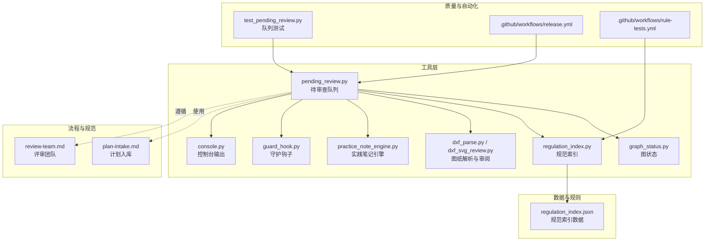
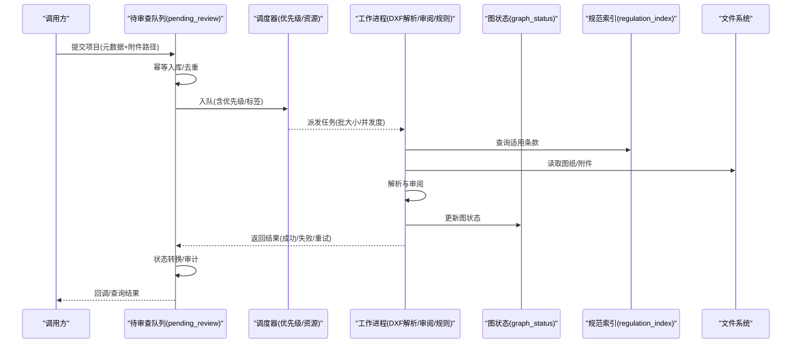
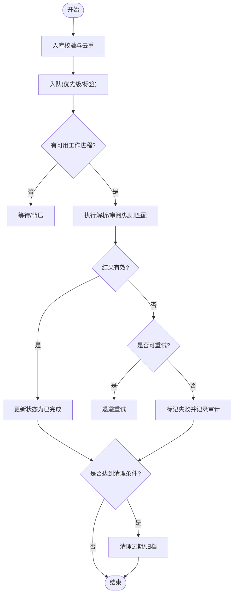
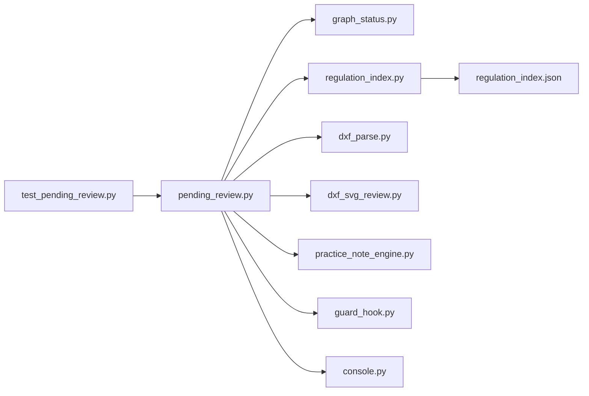

# 待审查项目管理

<cite>
**本文引用的文件**   
- [tools/pending_review.py](file://tools/pending_review.py)
- [tests/test_pending_review.py](file://tests/test_pending_review.py)
- [tools/graph_status.py](file://tools/graph_status.py)
- [tools/regulation_index.py](file://tools/regulation_index.py)
- [rules/regulation_index.json](file://rules/regulation_index.json)
- [skills/plan-intake.md](file://skills/plan-intake.md)
- [skills/review-team.md](file://skills/review-team.md)
- [tools/dxf_parse.py](file://tools/dxf_parse.py)
- [tools/dxf_svg_review.py](file://tools/dxf_svg_review.py)
- [tools/practice_note_engine.py](file://tools/practice_note_engine.py)
- [tools/guard_hook.py](file://tools/guard_hook.py)
- [tools/console.py](file://tools/console.py)
- [.github/workflows/release.yml](file://.github/workflows/release.yml)
- [.github/workflows/rule-tests.yml](file://.github/workflows/rule-tests.yml)
</cite>

## 目录
1. [简介](#简介)
2. [项目结构](#项目结构)
3. [核心组件](#核心组件)
4. [架构总览](#架构总览)
5. [详细组件分析](#详细组件分析)
6. [依赖关系分析](#依赖关系分析)
7. [性能考量](#性能考量)
8. [故障排查指南](#故障排查指南)
9. [结论](#结论)
10. [附录](#附录)

## 简介
本文件面向“待审查项目管理系统”，系统性阐述项目的生命周期管理（入库、状态转换、优先级调度与自动清理）、队列管理与并发处理、元数据存储与索引机制、查询优化策略，以及与文件系统、备份恢复的集成方式。文档同时提供操作示例（添加、更新、删除、批量处理）和监控排障指导，帮助开发与运维人员快速上手并稳定运行系统。

## 项目结构
仓库采用“工具脚本 + 规则数据 + 技能说明 + 测试”的组织方式：
- tools：核心工具与命令行入口，包含待审查队列、图状态、规范索引、DXF解析与审阅、实践笔记引擎、守护钩子等。
- rules：法规条款与规则索引，供审查流程引用。
- skills：业务流程与SOP说明，如计划入库、团队评审等。
- tests：覆盖关键工具的单元测试，保障稳定性。
- .github/workflows：CI/CD流水线，用于发布与规则测试。

图表来源 
- [tools/pending_review.py](file://tools/pending_review.py)
- [tools/graph_status.py](file://tools/graph_status.py)
- [tools/regulation_index.py](file://tools/regulation_index.py)
- [tools/dxf_parse.py](file://tools/dxf_parse.py)
- [tools/dxf_svg_review.py](file://tools/dxf_svg_review.py)
- [tools/practice_note_engine.py](file://tools/practice_note_engine.py)
- [tools/guard_hook.py](file://tools/guard_hook.py)
- [tools/console.py](file://tools/console.py)
- [rules/regulation_index.json](file://rules/regulation_index.json)
- [skills/plan-intake.md](file://skills/plan-intake.md)
- [skills/review-team.md](file://skills/review-team.md)
- [tests/test_pending_review.py](file://tests/test_pending_review.py)
- [.github/workflows/release.yml](file://.github/workflows/release.yml)
- [.github/workflows/rule-tests.yml](file://.github/workflows/rule-tests.yml)

章节来源
- [tools/pending_review.py](file://tools/pending_review.py)
- [tests/test_pending_review.py](file://tests/test_pending_review.py)
- [tools/graph_status.py](file://tools/graph_status.py)
- [tools/regulation_index.py](file://tools/regulation_index.py)
- [rules/regulation_index.json](file://rules/regulation_index.json)
- [skills/plan-intake.md](file://skills/plan-intake.md)
- [skills/review-team.md](file://skills/review-team.md)
- [tools/dxf_parse.py](file://tools/dxf_parse.py)
- [tools/dxf_svg_review.py](file://tools/dxf_svg_review.py)
- [tools/practice_note_engine.py](file://tools/practice_note_engine.py)
- [tools/guard_hook.py](file://tools/guard_hook.py)
- [tools/console.py](file://tools/console.py)
- [.github/workflows/release.yml](file://.github/workflows/release.yml)
- [.github/workflows/rule-tests.yml](file://.github/workflows/rule-tests.yml)

## 核心组件
- 待审查队列（pending_review.py）
  - 职责：项目入库、状态机驱动的状态转换、优先级调度、任务派发与完成回写、过期清理。
  - 关键点：幂等入库、原子状态变更、可插拔调度器、审计日志。
- 图状态（graph_status.py）
  - 职责：维护项目相关图的节点与边状态，支撑可视化与一致性校验。
- 规范索引（regulation_index.py + regulation_index.json）
  - 职责：构建与查询法规条款索引，为审查规则匹配提供基础。
- 图纸解析与审阅（dxf_parse.py, dxf_svg_review.py）
  - 职责：解析DXF图纸、生成SVG审阅视图、抽取关键几何信息。
- 实践笔记引擎（practice_note_engine.py）
  - 职责：记录审查过程中的实践要点、经验沉淀与回溯。
- 守护钩子（guard_hook.py）
  - 职责：进程守护、异常捕获、重启策略与健康检查。
- 控制台输出（console.py）
  - 职责：统一日志与进度输出，便于观测与调试。

章节来源
- [tools/pending_review.py](file://tools/pending_review.py)
- [tools/graph_status.py](file://tools/graph_status.py)
- [tools/regulation_index.py](file://tools/regulation_index.py)
- [rules/regulation_index.json](file://rules/regulation_index.json)
- [tools/dxf_parse.py](file://tools/dxf_parse.py)
- [tools/dxf_svg_review.py](file://tools/dxf_svg_review.py)
- [tools/practice_note_engine.py](file://tools/practice_note_engine.py)
- [tools/guard_hook.py](file://tools/guard_hook.py)
- [tools/console.py](file://tools/console.py)

## 架构总览
系统以“队列为中心”的异步处理架构：上游通过入库接口将项目加入队列；调度器按优先级与资源可用性分配任务；工作进程执行解析、审阅、规则匹配与结果落盘；完成后触发状态更新与通知。

图表来源 
- [tools/pending_review.py](file://tools/pending_review.py)
- [tools/graph_status.py](file://tools/graph_status.py)
- [tools/regulation_index.py](file://tools/regulation_index.py)
- [tools/dxf_parse.py](file://tools/dxf_parse.py)
- [tools/dxf_svg_review.py](file://tools/dxf_svg_review.py)
- [tools/practice_note_engine.py](file://tools/practice_note_engine.py)
- [tools/guard_hook.py](file://tools/guard_hook.py)
- [tools/console.py](file://tools/console.py)

## 详细组件分析

### 待审查队列（生命周期、状态机、优先级与清理）
- 生命周期阶段
  - 入库：接收项目元数据与附件路径，进行去重与校验，写入持久化存储。
  - 排队：根据优先级与标签进入调度队列。
  - 处理：工作进程拉取任务，执行解析、审阅、规则匹配与结果落盘。
  - 完成：状态转换为已完成或失败，记录审计日志，必要时触发重试。
  - 清理：对过期或归档项目进行清理，释放资源。
- 状态转换
  - 典型状态：待处理、处理中、已完成、失败、已归档、已清理。
  - 转换约束：仅允许合法迁移，保证幂等与一致性。
- 优先级调度
  - 基于优先级分数与标签权重排序，支持紧急通道与配额限制。
  - 支持批处理与并发度控制，避免资源争用。
- 自动清理
  - 基于时间窗口与保留策略，定期扫描并清理过期任务与中间产物。

图表来源 
- [tools/pending_review.py](file://tools/pending_review.py)
- [tools/console.py](file://tools/console.py)

章节来源
- [tools/pending_review.py](file://tools/pending_review.py)
- [tests/test_pending_review.py](file://tests/test_pending_review.py)

### 图状态管理（graph_status.py）
- 职责：维护项目相关图的节点与边，确保状态一致性与可追溯性。
- 关键点：增量更新、冲突检测、快照与回滚能力。
- 与队列联动：任务完成后同步图状态，保证可视化与后端一致。

章节来源
- [tools/graph_status.py](file://tools/graph_status.py)

### 规范索引（regulation_index.py + regulation_index.json）
- 职责：构建法规条款索引，支持按编号、主题、适用范围等维度检索。
- 数据结构：JSON索引文件，包含条款ID、标题、关键词、关联规则等。
- 查询优化：内存缓存、前缀匹配、分页与过滤。

章节来源
- [tools/regulation_index.py](file://tools/regulation_index.py)
- [rules/regulation_index.json](file://rules/regulation_index.json)

### 图纸解析与审阅（dxf_parse.py, dxf_svg_review.py）
- 职责：解析DXF文件，提取图层、尺寸、标注等关键信息；生成SVG审阅视图。
- 关键点：容错解析、增量更新、渲染性能优化。
- 与队列联动：作为任务步骤之一，产出审阅结果与中间产物。

章节来源
- [tools/dxf_parse.py](file://tools/dxf_parse.py)
- [tools/dxf_svg_review.py](file://tools/dxf_svg_review.py)

### 实践笔记引擎（practice_note_engine.py）
- 职责：记录审查过程中的实践要点、问题与解决方案，形成知识沉淀。
- 关键点：结构化记录、版本化、可检索。

章节来源
- [tools/practice_note_engine.py](file://tools/practice_note_engine.py)

### 守护钩子（guard_hook.py）
- 职责：进程守护、异常捕获、健康检查与自动重启。
- 关键点：优雅退出、信号处理、资源清理。

章节来源
- [tools/guard_hook.py](file://tools/guard_hook.py)

### 控制台输出（console.py）
- 职责：统一日志格式、进度条与彩色输出，便于观测与调试。
- 关键点：分级日志、结构化输出、兼容不同终端。

章节来源
- [tools/console.py](file://tools/console.py)

### 操作流程示例（添加、更新、删除、批量处理）
- 添加项目
  - 输入：项目元数据（名称、类型、优先级、标签）、附件路径。
  - 行为：入库校验、去重、入队。
  - 输出：任务ID与初始状态。
- 更新项目
  - 输入：项目ID与更新字段（优先级、标签、备注）。
  - 行为：原子更新、审计记录。
  - 输出：更新后的状态。
- 删除项目
  - 输入：项目ID。
  - 行为：软删除或归档，清理中间产物。
  - 输出：删除确认。
- 批量处理
  - 输入：项目ID列表或筛选条件。
  - 行为：分批入队、并发控制、汇总结果。
  - 输出：批次报告与错误明细。

章节来源
- [tools/pending_review.py](file://tools/pending_review.py)
- [tests/test_pending_review.py](file://tests/test_pending_review.py)

### 与文件系统的集成、数据备份与恢复
- 文件系统集成
  - 附件与中间产物存放于指定目录，按项目ID组织。
  - 读写采用原子写入与校验，避免损坏。
- 备份策略
  - 定期快照元数据与索引，增量备份附件。
  - 校验与完整性检查，支持跨环境迁移。
- 恢复流程
  - 导入索引与元数据，校验一致性，重建必要索引。
  - 按需恢复附件，验证链接与可读性。

章节来源
- [tools/pending_review.py](file://tools/pending_review.py)
- [tools/guard_hook.py](file://tools/guard_hook.py)

### 并发处理逻辑与资源分配
- 并发模型
  - 多进程或多线程工作池，按CPU/IO特性选择。
  - 任务分片与负载均衡，避免热点。
- 资源分配
  - 基于优先级的配额管理，支持紧急任务抢占。
  - 内存与磁盘阈值保护，防止OOM与磁盘爆满。
- 背压与限流
  - 队列长度上限、消费者速率限制、超时重试。

章节来源
- [tools/pending_review.py](file://tools/pending_review.py)
- [tools/console.py](file://tools/console.py)

## 依赖关系分析

图表来源 
- [tools/pending_review.py](file://tools/pending_review.py)
- [tools/graph_status.py](file://tools/graph_status.py)
- [tools/regulation_index.py](file://tools/regulation_index.py)
- [tools/dxf_parse.py](file://tools/dxf_parse.py)
- [tools/dxf_svg_review.py](file://tools/dxf_svg_review.py)
- [tools/practice_note_engine.py](file://tools/practice_note_engine.py)
- [tools/guard_hook.py](file://tools/guard_hook.py)
- [tools/console.py](file://tools/console.py)
- [rules/regulation_index.json](file://rules/regulation_index.json)
- [tests/test_pending_review.py](file://tests/test_pending_review.py)

章节来源
- [tools/pending_review.py](file://tools/pending_review.py)
- [tests/test_pending_review.py](file://tests/test_pending_review.py)

## 性能考量
- 队列与调度
  - 使用优先级堆与惰性计算减少排序开销。
  - 批处理与预取降低上下文切换成本。
- I/O优化
  - 顺序读取与缓冲，避免随机I/O。
  - 大文件分块处理与流式解析。
- 内存管理
  - 对象池与复用，及时释放临时对象。
  - 监控峰值内存，设置安全阈值。
- 索引与查询
  - 内存缓存热点条目，LRU淘汰策略。
  - 复合索引与覆盖查询，减少回表。
- 并发与锁
  - 无锁队列与分段锁，减少竞争。
  - 事务边界最小化，缩短持有时间。

[本节为通用性能建议，不直接分析具体文件]

## 故障排查指南
- 常见问题
  - 入库失败：校验失败、重复项、权限不足。
  - 处理卡住：工作进程崩溃、资源耗尽、死锁。
  - 状态不一致：图状态与队列状态不同步。
  - 索引异常：规范索引损坏或版本不一致。
- 定位方法
  - 查看控制台日志与审计记录，关注错误码与堆栈。
  - 检查守护钩子的健康检查与重启日志。
  - 核对文件系统权限与空间使用情况。
- 修复步骤
  - 清理僵尸任务与中间产物，重建索引。
  - 调整并发度与批大小，缓解资源压力。
  - 回滚到上一稳定版本，逐步升级。

章节来源
- [tools/console.py](file://tools/console.py)
- [tools/guard_hook.py](file://tools/guard_hook.py)
- [tools/pending_review.py](file://tools/pending_review.py)

## 结论
本系统以队列为核心，结合图状态、规范索引与图纸解析，构建了完整的待审查项目管理闭环。通过优先级调度、并发控制与自动清理，实现高效稳定的审查流程。配合完善的日志、守护与备份恢复机制，保障系统在复杂环境下的可靠性与可维护性。

[本节为总结性内容，不直接分析具体文件]

## 附录
- 流程与规范参考
  - 计划入库（plan-intake.md）：入库标准、字段定义与校验规则。
  - 评审团队（review-team.md）：角色分工、协作流程与验收标准。
- CI/CD流水线
  - 发布流水线（release.yml）：打包、签名与分发。
  - 规则测试（rule-tests.yml）：规则集回归与兼容性验证。

章节来源
- [skills/plan-intake.md](file://skills/plan-intake.md)
- [skills/review-team.md](file://skills/review-team.md)
- [.github/workflows/release.yml](file://.github/workflows/release.yml)
- [.github/workflows/rule-tests.yml](file://.github/workflows/rule-tests.yml)