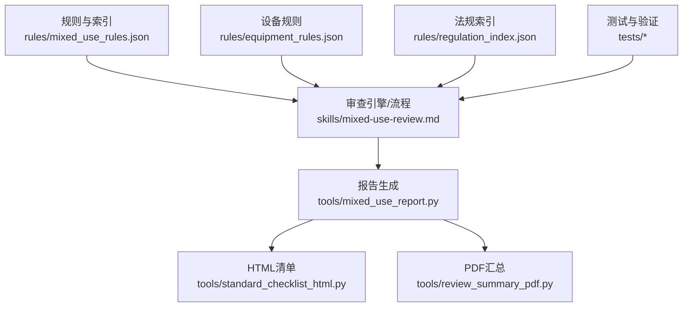
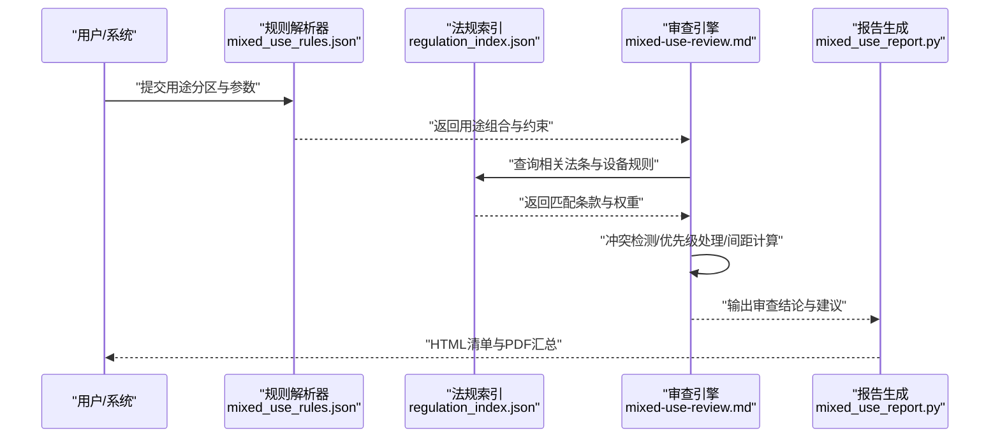
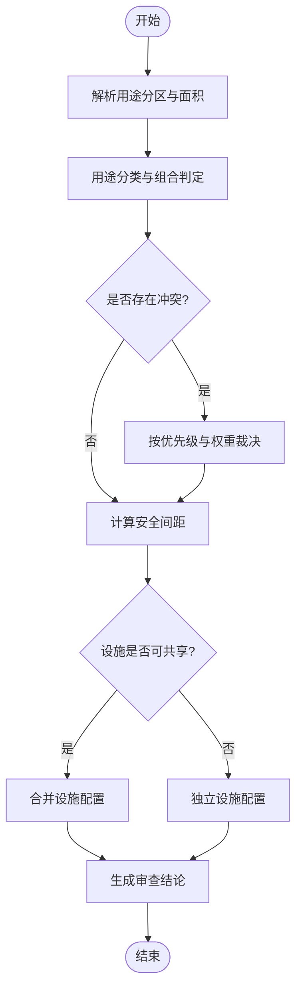
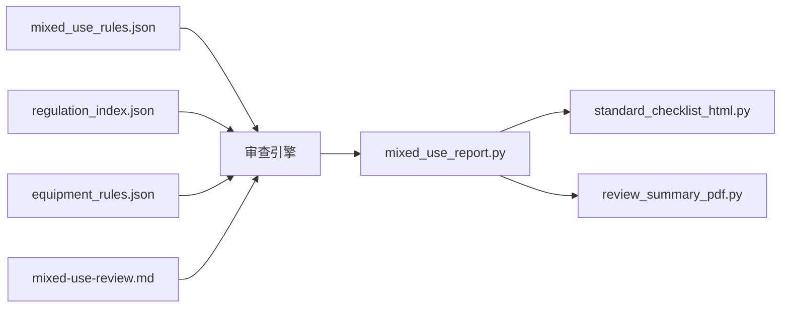

# 混合用途审查

<cite>
**本文引用的文件**   
- [rules/mixed_use_rules.json](file://rules/mixed_use_rules.json)
- [skills/mixed-use-review.md](file://skills/mixed-use-review.md)
- [tools/mixed_use_report.py](file://tools/mixed_use_report.py)
- [rules/regulation_index.json](file://rules/regulation_index.json)
- [rules/equipment_rules.json](file://rules/equipment_rules.json)
- [tools/standard_checklist_html.py](file://tools/standard_checklist_html.py)
- [tools/review_summary_pdf.py](file://tools/review_summary_pdf.py)
- [tests/test_regulation_graph_build.py](file://tests/test_regulation_graph_build.py)
- [tests/test_pending_review.py](file://tests/test_pending_review.py)
</cite>

## 目录
1. [简介](#简介)
2. [项目结构](#项目结构)
3. [核心组件](#核心组件)
4. [架构总览](#架构总览)
5. [详细组件分析](#详细组件分析)
6. [依赖关系分析](#依赖关系分析)
7. [性能考量](#性能考量)
8. [故障排查指南](#故障排查指南)
9. [结论](#结论)
10. [附录](#附录)

## 简介
本文件面向“混合用途建筑审查”功能，系统化说明分类标准、适用法规、特殊审查要求与规则解析机制；阐述冲突检测与优先级处理逻辑；记录不同用途组合的审查策略、安全间距计算与设施共享规则；提供典型审查案例（商业与住宅混合、办公与仓储混合等）；并说明扩展方法与自定义配置选项。最后给出审查结果的可视化展示与报告生成功能说明，帮助工程人员快速理解与落地使用。

## 项目结构
围绕混合用途审查的核心代码与数据主要分布在以下位置：
- 规则定义与索引：rules/mixed_use_rules.json、rules/regulation_index.json、rules/equipment_rules.json
- 审查技能与流程指引：skills/mixed-use-review.md
- 报告与可视化输出：tools/mixed_use_report.py、tools/standard_checklist_html.py、tools/review_summary_pdf.py
- 测试与验证：tests/test_regulation_graph_build.py、tests/test_pending_review.py

图表来源
- [rules/mixed_use_rules.json](file://rules/mixed_use_rules.json)
- [skills/mixed-use-review.md](file://skills/mixed-use-review.md)
- [rules/equipment_rules.json](file://rules/equipment_rules.json)
- [rules/regulation_index.json](file://rules/regulation_index.json)
- [tools/mixed_use_report.py](file://tools/mixed_use_report.py)
- [tools/standard_checklist_html.py](file://tools/standard_checklist_html.py)
- [tools/review_summary_pdf.py](file://tools/review_summary_pdf.py)
- [tests/test_regulation_graph_build.py](file://tests/test_regulation_graph_build.py)
- [tests/test_pending_review.py](file://tests/test_pending_review.py)

章节来源
- [rules/mixed_use_rules.json](file://rules/mixed_use_rules.json)
- [skills/mixed-use-review.md](file://skills/mixed-use-review.md)
- [rules/regulation_index.json](file://rules/regulation_index.json)
- [rules/equipment_rules.json](file://rules/equipment_rules.json)
- [tools/mixed_use_report.py](file://tools/mixed_use_report.py)
- [tools/standard_checklist_html.py](file://tools/standard_checklist_html.py)
- [tools/review_summary_pdf.py](file://tools/review_summary_pdf.py)
- [tests/test_regulation_graph_build.py](file://tests/test_regulation_graph_build.py)
- [tests/test_pending_review.py](file://tests/test_pending_review.py)

## 核心组件
- 混合用途规则集：集中定义用途分类、组合判定、冲突与优先级、安全间距与设施共享等规则项。
- 法规索引：将具体条款映射到可执行的审查条目，支撑按条检索与引用溯源。
- 设备规则：针对消防、机电等设备设施的共用与独立配置要求。
- 审查技能文档：描述混合用途审查的流程、输入输出、判断要点与注意事项。
- 报告工具：将审查结果导出为结构化清单与可视化报告（HTML/PDF）。

章节来源
- [rules/mixed_use_rules.json](file://rules/mixed_use_rules.json)
- [rules/regulation_index.json](file://rules/regulation_index.json)
- [rules/equipment_rules.json](file://rules/equipment_rules.json)
- [skills/mixed-use-review.md](file://skills/mixed-use-review.md)
- [tools/mixed_use_report.py](file://tools/mixed_use_report.py)

## 架构总览
混合用途审查的整体流程如下：
- 输入：建筑平面信息、用途分区、面积与高度、设备配置等。
- 解析：依据 mixed_use_rules.json 解析用途组合与约束条件。
- 匹配：通过 regulation_index.json 定位相关法条与设备规则。
- 校验：执行冲突检测、优先级排序、安全间距计算与设施共享判定。
- 输出：生成标准化清单与可视化报告（HTML/PDF），支持复核与归档。

图表来源
- [rules/mixed_use_rules.json](file://rules/mixed_use_rules.json)
- [rules/regulation_index.json](file://rules/regulation_index.json)
- [skills/mixed-use-review.md](file://skills/mixed-use-review.md)
- [tools/mixed_use_report.py](file://tools/mixed_use_report.py)

## 详细组件分析

### 混合用途规则集（mixed_use_rules.json）
- 用途分类与组合：定义各类场所类别、允许的组合模式与限制条件。
- 冲突检测：识别同一空间或相邻空间的用途冲突（如火灾危险等级差异过大）。
- 优先级处理：当多条规则同时适用时，按法定优先顺序与规则权重进行裁决。
- 安全间距：针对不同用途之间的防火分隔、疏散距离、设备间距等计算规则。
- 设施共享：明确哪些设施可共用（如楼梯、排烟、报警）、哪些必须独立设置。

图表来源
- [rules/mixed_use_rules.json](file://rules/mixed_use_rules.json)

章节来源
- [rules/mixed_use_rules.json](file://rules/mixed_use_rules.json)

### 法规索引（regulation_index.json）
- 条款映射：将业务规则项映射到具体法规条文编号与内容摘要。
- 引用溯源：在报告中保留每条结论的法条依据，便于人工复核。
- 版本管理：支持条款更新后的版本追踪与影响评估。

章节来源
- [rules/regulation_index.json](file://rules/regulation_index.json)

### 设备规则（equipment_rules.json）
- 设备分类：消防报警、自动喷水灭火、防排烟、应急照明等。
- 共享条件：明确跨用途共享的条件、容量核算与独立性要求。
- 配置策略：根据用途组合决定最小配置、冗余与分区控制。

章节来源
- [rules/equipment_rules.json](file://rules/equipment_rules.json)

### 审查技能与流程（mixed-use-review.md）
- 输入规范：用途分区图、面积统计、层高与高度、设备现状。
- 判断要点：用途组合合法性、防火分区划分、疏散路径与出口数量。
- 输出要求：问题清单、整改建议、法条依据与风险提示。

章节来源
- [skills/mixed-use-review.md](file://skills/mixed-use-review.md)

### 报告生成（mixed_use_report.py）
- 结构化清单：按问题类型、严重等级、法条依据组织输出。
- 可视化展示：以HTML形式呈现问题分布、风险热力与合规状态。
- PDF汇总：生成可打印的审查报告，包含封面、目录、正文与附录。

章节来源
- [tools/mixed_use_report.py](file://tools/mixed_use_report.py)
- [tools/standard_checklist_html.py](file://tools/standard_checklist_html.py)
- [tools/review_summary_pdf.py](file://tools/review_summary_pdf.py)

### 测试与验证（tests/*）
- 规则构建测试：确保规则解析与索引构建正确。
- 待审用例管理：跟踪需人工复核的复杂场景与例外情况。

章节来源
- [tests/test_regulation_graph_build.py](file://tests/test_regulation_graph_build.py)
- [tests/test_pending_review.py](file://tests/test_pending_review.py)

## 依赖关系分析
- mixed_use_rules.json 为审查引擎的核心输入，驱动冲突检测、优先级与间距计算。
- regulation_index.json 为法条溯源与报告引用的基础。
- equipment_rules.json 为设备配置与共享决策的依据。
- mixed-use-review.md 指导审查流程与判断要点。
- mixed_use_report.py 依赖上述规则与索引，生成HTML与PDF报告。

图表来源
- [rules/mixed_use_rules.json](file://rules/mixed_use_rules.json)
- [rules/regulation_index.json](file://rules/regulation_index.json)
- [rules/equipment_rules.json](file://rules/equipment_rules.json)
- [skills/mixed-use-review.md](file://skills/mixed-use-review.md)
- [tools/mixed_use_report.py](file://tools/mixed_use_report.py)
- [tools/standard_checklist_html.py](file://tools/standard_checklist_html.py)
- [tools/review_summary_pdf.py](file://tools/review_summary_pdf.py)

章节来源
- [rules/mixed_use_rules.json](file://rules/mixed_use_rules.json)
- [rules/regulation_index.json](file://rules/regulation_index.json)
- [rules/equipment_rules.json](file://rules/equipment_rules.json)
- [skills/mixed-use-review.md](file://skills/mixed-use-review.md)
- [tools/mixed_use_report.py](file://tools/mixed_use_report.py)
- [tools/standard_checklist_html.py](file://tools/standard_checklist_html.py)
- [tools/review_summary_pdf.py](file://tools/review_summary_pdf.py)

## 性能考量
- 规则解析：采用预编译与缓存策略，减少重复解析开销。
- 冲突检测：基于图结构的邻接与覆盖关系，提升检测效率。
- 报告生成：增量更新与分页渲染，避免大文档一次性加载。
- 内存占用：对大型图纸与多用途分区进行分块处理，降低峰值内存。

[本节为通用性能建议，不直接分析具体文件]

## 故障排查指南
- 规则解析失败：检查 mixed_use_rules.json 的语法与必填字段完整性。
- 法条引用缺失：核对 regulation_index.json 中对应条目是否存在且有效。
- 设备配置异常：确认 equipment_rules.json 中的共享条件与容量核算是否正确。
- 报告输出错误：查看 mixed_use_report.py 的日志与模板变量是否齐全。
- 待审用例堆积：通过 pending review 列表定位复杂场景，补充规则或人工复核。

章节来源
- [rules/mixed_use_rules.json](file://rules/mixed_use_rules.json)
- [rules/regulation_index.json](file://rules/regulation_index.json)
- [rules/equipment_rules.json](file://rules/equipment_rules.json)
- [tools/mixed_use_report.py](file://tools/mixed_use_report.py)
- [tests/test_pending_review.py](file://tests/test_pending_review.py)

## 结论
混合用途审查通过规则化、索引化与报告化的方式，实现对复杂用途组合的系统性校验。借助清晰的冲突检测与优先级处理、严谨的安全间距与设施共享规则，以及可视化的报告输出，能够显著提升审查效率与一致性。建议持续完善规则集与索引，结合测试与待审用例管理，形成闭环优化。

[本节为总结性内容，不直接分析具体文件]

## 附录

### 审查案例（示例说明）
- 商业与住宅混合：重点核查防火分区、疏散通道与设备独立性，必要时对商业区域提高消防设施配置等级。
- 办公与仓储混合：关注仓储危险等级与办公区隔离措施，确保排烟与报警系统分区控制与联动逻辑正确。
- 餐饮与零售混合：强化油烟排放与燃气泄漏报警，合理设置防火阀与排风系统独立回路。

[本节为概念性说明，不直接分析具体文件]

### 扩展方法与自定义配置
- 新增用途类别：在 mixed_use_rules.json 中扩展类别定义与组合规则。
- 自定义冲突策略：调整冲突检测阈值与优先级权重，适配地方性法规。
- 设备共享策略：在 equipment_rules.json 中细化共享条件与容量核算公式。
- 报告模板定制：修改 standard_checklist_html.py 与 review_summary_pdf.py 的模板与样式。

章节来源
- [rules/mixed_use_rules.json](file://rules/mixed_use_rules.json)
- [rules/equipment_rules.json](file://rules/equipment_rules.json)
- [tools/standard_checklist_html.py](file://tools/standard_checklist_html.py)
- [tools/review_summary_pdf.py](file://tools/review_summary_pdf.py)