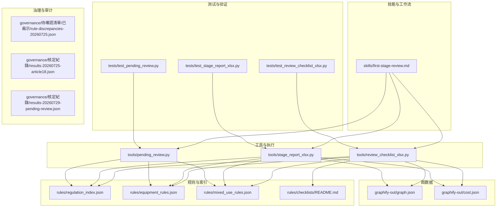
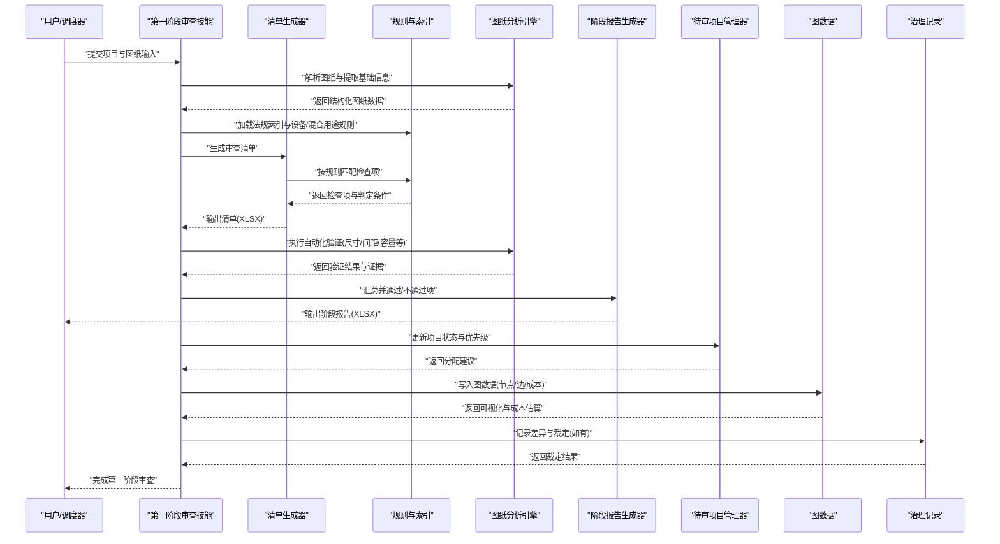
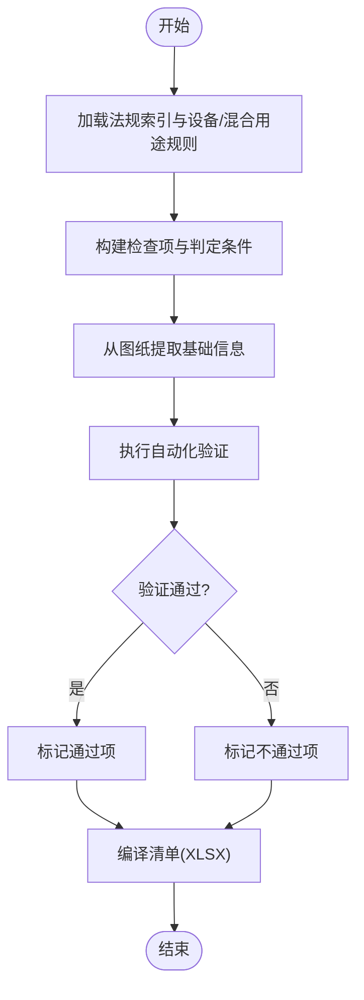
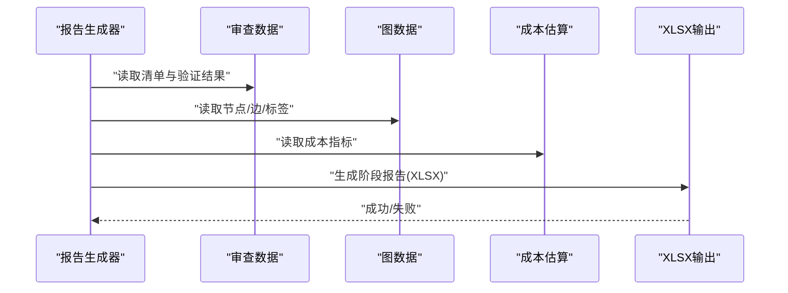
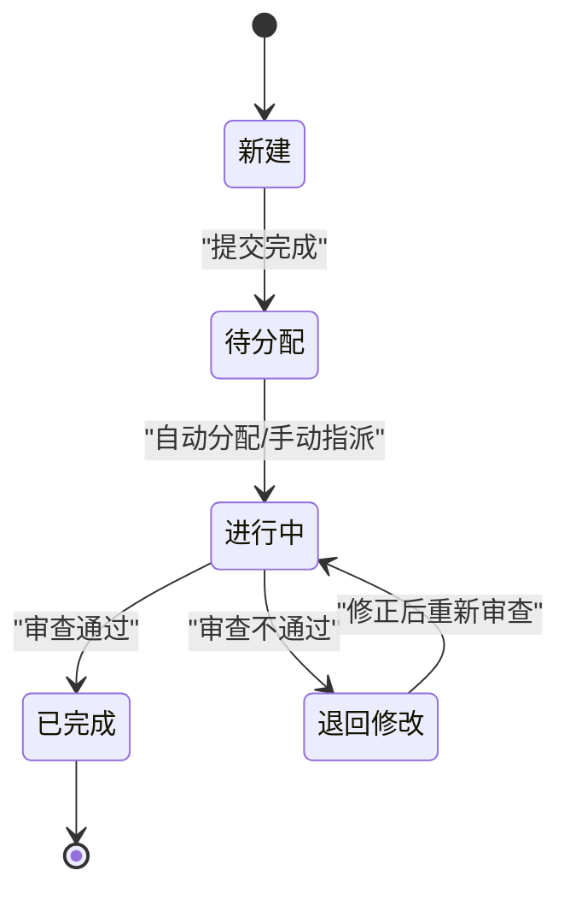
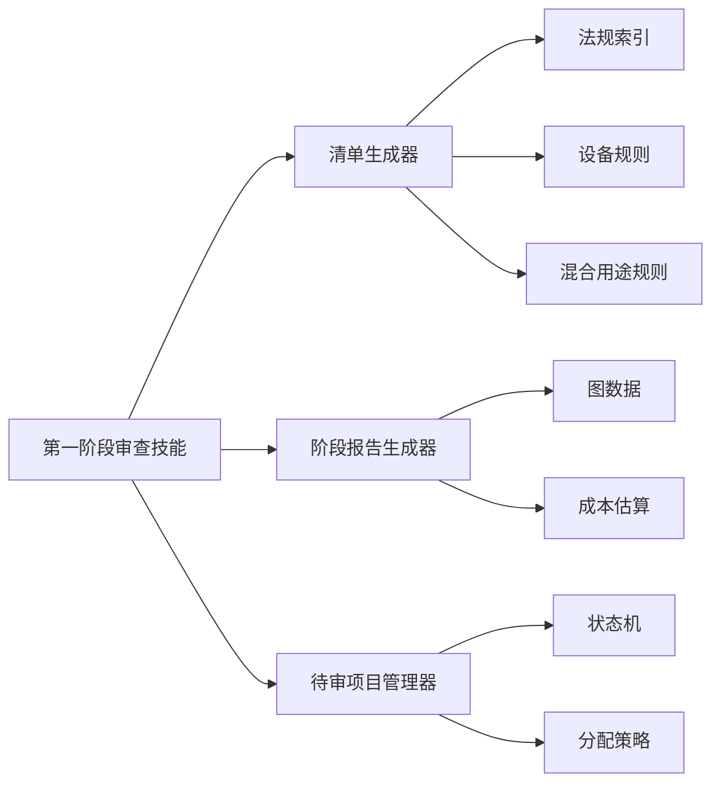

# 第一阶段审查

<cite>
**本文引用的文件**   
- [skills/first-stage-review.md](file://skills/first-stage-review.md)
- [tools/review_checklist_xlsx.py](file://tools/review_checklist_xlsx.py)
- [tools/stage_report_xlsx.py](file://tools/stage_report_xlsx.py)
- [tools/pending_review.py](file://tools/pending_review.py)
- [rules/regulation_index.json](file://rules/regulation_index.json)
- [rules/equipment_rules.json](file://rules/equipment_rules.json)
- [rules/mixed_use_rules.json](file://rules/mixed_use_rules.json)
- [rules/checklists/README.md](file://rules/checklists/README.md)
- [tests/test_review_checklist_xlsx.py](file://tests/test_review_checklist_xlsx.py)
- [tests/test_stage_report_xlsx.py](file://tests/test_stage_report_xlsx.py)
- [tests/test_pending_review.py](file://tests/test_pending_review.py)
- [graphify-out/graph.json](file://graphify-out/graph.json)
- [graphify-out/cost.json](file://graphify-out/cost.json)
- [governance/待確認清單/已裁示/rule-discrepancies-20260725.json](file://governance/待確認清單/已裁示/rule-discrepancies-20260725.json)
- [governance/核定紀錄/results-20260725-article18.json](file://governance/核定紀錄/results-20260725-article18.json)
- [governance/核定紀錄/results-20260729-pending-review.json](file://governance/核定紀錄/results-20260729-pending-review.json)
</cite>

## 目录
1. [简介](#简介)
2. [项目结构](#项目结构)
3. [核心组件](#核心组件)
4. [架构总览](#架构总览)
5. [详细组件分析](#详细组件分析)
6. [依赖关系分析](#依赖关系分析)
7. [性能考量](#性能考量)
8. [故障排查指南](#故障排查指南)
9. [结论](#结论)
10. [附录：使用示例与配置](#附录使用示例与配置)

## 简介
本文件面向“第一阶段审查”功能，系统性说明其核心流程（图纸初步检查、法规符合性验证、基础信息提取）、待审查项目的管理机制（状态跟踪、优先级排序、自动分配）、审查清单生成规则与自动化验证过程、与图纸分析引擎的数据交互格式与错误处理机制，以及审查质量评估与结果反馈的完整流程。文档同时提供可操作的使用示例，帮助快速启动第一阶段审查、配置检查参数并处理审查结果。

## 项目结构
围绕第一阶段审查，代码库采用“技能脚本 + 工具脚本 + 规则数据 + 测试用例 + 治理记录”的分层组织方式：
- 技能脚本：定义工作流与步骤（如 first-stage-review.md）
- 工具脚本：实现清单生成、报告导出、待审队列管理等能力
- 规则数据：法规条款索引、设备规则、混合用途规则等
- 测试用例：覆盖清单生成、报告导出、待审队列等关键路径
- 治理记录：裁定差异、核定结果等审计与追溯材料
- 图数据：用于可视化与成本估算的结构化图数据

图表来源
- [skills/first-stage-review.md](file://skills/first-stage-review.md)
- [tools/review_checklist_xlsx.py](file://tools/review_checklist_xlsx.py)
- [tools/stage_report_xlsx.py](file://tools/stage_report_xlsx.py)
- [tools/pending_review.py](file://tools/pending_review.py)
- [rules/regulation_index.json](file://rules/regulation_index.json)
- [rules/equipment_rules.json](file://rules/equipment_rules.json)
- [rules/mixed_use_rules.json](file://rules/mixed_use_rules.json)
- [rules/checklists/README.md](file://rules/checklists/README.md)
- [graphify-out/graph.json](file://graphify-out/graph.json)
- [graphify-out/cost.json](file://graphify-out/cost.json)

章节来源
- [skills/first-stage-review.md](file://skills/first-stage-review.md)
- [tools/review_checklist_xlsx.py](file://tools/review_checklist_xlsx.py)
- [tools/stage_report_xlsx.py](file://tools/stage_report_xlsx.py)
- [tools/pending_review.py](file://tools/pending_review.py)
- [rules/regulation_index.json](file://rules/regulation_index.json)
- [rules/equipment_rules.json](file://rules/equipment_rules.json)
- [rules/mixed_use_rules.json](file://rules/mixed_use_rules.json)
- [rules/checklists/README.md](file://rules/checklists/README.md)
- [graphify-out/graph.json](file://graphify-out/graph.json)
- [graphify-out/cost.json](file://graphify-out/cost.json)

## 核心组件
- 第一阶段审查技能：定义从图纸输入到清单生成、法规校验、信息提取与报告输出的端到端流程
- 审查清单生成器：基于规则索引与设备/混合用途规则，生成结构化审查清单（XLSX）
- 阶段报告生成器：汇总审查结果，输出阶段报告（XLSX），包含通过/不通过项、证据与备注
- 待审项目管理器：维护待审队列、项目状态、优先级与自动分配策略
- 规则与索引：法规条款索引、设备规则、混合用途规则，为校验与清单生成提供依据
- 图数据与成本：用于可视化与成本估算的结构化图数据，支撑复杂场景下的合规判断

章节来源
- [skills/first-stage-review.md](file://skills/first-stage-review.md)
- [tools/review_checklist_xlsx.py](file://tools/review_checklist_xlsx.py)
- [tools/stage_report_xlsx.py](file://tools/stage_report_xlsx.py)
- [tools/pending_review.py](file://tools/pending_review.py)
- [rules/regulation_index.json](file://rules/regulation_index.json)
- [rules/equipment_rules.json](file://rules/equipment_rules.json)
- [rules/mixed_use_rules.json](file://rules/mixed_use_rules.json)

## 架构总览
第一阶段审查的整体架构由“输入解析 → 规则匹配 → 清单生成 → 自动校验 → 报告输出 → 待审管理”构成，并与图数据与治理记录进行双向交互，确保可追溯与可审计。

图表来源
- [skills/first-stage-review.md](file://skills/first-stage-review.md)
- [tools/review_checklist_xlsx.py](file://tools/review_checklist_xlsx.py)
- [tools/stage_report_xlsx.py](file://tools/stage_report_xlsx.py)
- [tools/pending_review.py](file://tools/pending_review.py)
- [rules/regulation_index.json](file://rules/regulation_index.json)
- [rules/equipment_rules.json](file://rules/equipment_rules.json)
- [rules/mixed_use_rules.json](file://rules/mixed_use_rules.json)
- [graphify-out/graph.json](file://graphify-out/graph.json)
- [graphify-out/cost.json](file://graphify-out/cost.json)
- [governance/待確認清單/已裁示/rule-discrepancies-20260725.json](file://governance/待確認清單/已裁示/rule-discrepancies-20260725.json)

## 详细组件分析

### 第一阶段审查技能（流程编排）
- 职责：协调图纸解析、规则加载、清单生成、自动验证、报告输出与待审管理
- 关键步骤：
  - 图纸初步检查：确认文件格式、完整性与基本元数据
  - 法规符合性验证：基于法规索引与设备/混合用途规则进行匹配与判定
  - 基础信息提取：从图纸中抽取面积、分区、设备数量等关键指标
  - 自动化验证：对尺寸、间距、容量等进行数值校验
  - 结果汇总：生成通过/不通过项、证据链与备注
  - 待审管理：更新状态、优先级与分配策略

章节来源
- [skills/first-stage-review.md](file://skills/first-stage-review.md)

### 审查清单生成器（XLSX）
- 职责：根据规则索引与设备/混合用途规则，生成结构化审查清单
- 输入：法规索引、设备规则、混合用途规则、项目上下文
- 输出：XLSX清单，包含检查项、判定条件、证据位置、备注
- 自动化验证：结合图纸分析引擎的结果，自动填充验证结果与证据

图表来源
- [tools/review_checklist_xlsx.py](file://tools/review_checklist_xlsx.py)
- [rules/regulation_index.json](file://rules/regulation_index.json)
- [rules/equipment_rules.json](file://rules/equipment_rules.json)
- [rules/mixed_use_rules.json](file://rules/mixed_use_rules.json)

章节来源
- [tools/review_checklist_xlsx.py](file://tools/review_checklist_xlsx.py)
- [tests/test_review_checklist_xlsx.py](file://tests/test_review_checklist_xlsx.py)

### 阶段报告生成器（XLSX）
- 职责：汇总审查结果，输出阶段报告，包含通过/不通过项、证据与备注
- 输入：清单结果、验证证据、图数据与成本估算
- 输出：XLSX报告，支持审阅与归档

图表来源
- [tools/stage_report_xlsx.py](file://tools/stage_report_xlsx.py)
- [graphify-out/graph.json](file://graphify-out/graph.json)
- [graphify-out/cost.json](file://graphify-out/cost.json)

章节来源
- [tools/stage_report_xlsx.py](file://tools/stage_report_xlsx.py)
- [tests/test_stage_report_xlsx.py](file://tests/test_stage_report_xlsx.py)

### 待审项目管理器（状态、优先级、自动分配）
- 职责：维护待审队列、项目状态、优先级与自动分配策略
- 关键逻辑：
  - 状态跟踪：新建、待分配、进行中、已完成、退回修改
  - 优先级排序：基于紧急度、复杂度、资源占用等维度
  - 自动分配：根据审查员负载与专长匹配任务

图表来源
- [tools/pending_review.py](file://tools/pending_review.py)

章节来源
- [tools/pending_review.py](file://tools/pending_review.py)
- [tests/test_pending_review.py](file://tests/test_pending_review.py)

### 规则与索引（法规、设备、混合用途）
- 法规索引：统一条目编号与适用场景，支撑快速匹配
- 设备规则：针对消防设备等硬件的配置与校验条件
- 混合用途规则：多用途场所的复合判定逻辑

章节来源
- [rules/regulation_index.json](file://rules/regulation_index.json)
- [rules/equipment_rules.json](file://rules/equipment_rules.json)
- [rules/mixed_use_rules.json](file://rules/mixed_use_rules.json)
- [rules/checklists/README.md](file://rules/checklists/README.md)

### 图数据与成本（可视化与估算）
- 图数据：节点、边、标签等结构化信息，支撑可视化与复杂场景判断
- 成本估算：基于图结构与规则匹配的成本指标，辅助决策

章节来源
- [graphify-out/graph.json](file://graphify-out/graph.json)
- [graphify-out/cost.json](file://graphify-out/cost.json)

### 治理记录（差异与裁定）
- 差异记录：规则不一致或争议点的裁定结果
- 核定记录：阶段性审核结果的归档与追溯

章节来源
- [governance/待確認清單/已裁示/rule-discrepancies-20260725.json](file://governance/待確認清單/已裁示/rule-discrepancies-20260725.json)
- [governance/核定紀錄/results-20260725-article18.json](file://governance/核定紀錄/results-20260725-article18.json)
- [governance/核定紀錄/results-20260729-pending-review.json](file://governance/核定紀錄/results-20260729-pending-review.json)

## 依赖关系分析
- 技能脚本依赖清单生成器、报告生成器与待审管理器
- 清单生成器依赖法规索引、设备规则与混合用途规则
- 报告生成器依赖清单结果、图数据与成本估算
- 待审管理器依赖状态机与分配策略
- 测试用例覆盖各工具的关键路径，保障稳定性

图表来源
- [skills/first-stage-review.md](file://skills/first-stage-review.md)
- [tools/review_checklist_xlsx.py](file://tools/review_checklist_xlsx.py)
- [tools/stage_report_xlsx.py](file://tools/stage_report_xlsx.py)
- [tools/pending_review.py](file://tools/pending_review.py)
- [rules/regulation_index.json](file://rules/regulation_index.json)
- [rules/equipment_rules.json](file://rules/equipment_rules.json)
- [rules/mixed_use_rules.json](file://rules/mixed_use_rules.json)
- [graphify-out/graph.json](file://graphify-out/graph.json)
- [graphify-out/cost.json](file://graphify-out/cost.json)

章节来源
- [tools/review_checklist_xlsx.py](file://tools/review_checklist_xlsx.py)
- [tools/stage_report_xlsx.py](file://tools/stage_report_xlsx.py)
- [tools/pending_review.py](file://tools/pending_review.py)
- [rules/regulation_index.json](file://rules/regulation_index.json)
- [rules/equipment_rules.json](file://rules/equipment_rules.json)
- [rules/mixed_use_rules.json](file://rules/mixed_use_rules.json)
- [graphify-out/graph.json](file://graphify-out/graph.json)
- [graphify-out/cost.json](file://graphify-out/cost.json)

## 性能考量
- 规则加载缓存：避免重复解析法规索引与设备/混合用途规则
- 批量处理：对大型图纸进行分块解析与并行验证
- 增量更新：仅对变更的检查项进行重算
- 图数据优化：减少冗余节点与边，提升可视化与计算效率
- 报告生成优化：延迟渲染与分页输出，降低内存占用

[本节为通用指导，无需特定文件引用]

## 故障排查指南
- 清单生成失败：检查规则索引与设备/混合用途规则的完整性与格式
- 报告生成异常：确认图数据与成本估算文件的可用性
- 待审队列阻塞：核查状态机与分配策略配置，检查审查员负载
- 图纸解析错误：核对输入文件格式与元数据，定位缺失字段
- 差异与裁定：查阅治理记录中的差异与裁定文件，确认最新裁决

章节来源
- [tools/review_checklist_xlsx.py](file://tools/review_checklist_xlsx.py)
- [tools/stage_report_xlsx.py](file://tools/stage_report_xlsx.py)
- [tools/pending_review.py](file://tools/pending_review.py)
- [governance/待確認清單/已裁示/rule-discrepancies-20260725.json](file://governance/待確認清單/已裁示/rule-discrepancies-20260725.json)
- [governance/核定紀錄/results-20260725-article18.json](file://governance/核定紀錄/results-20260725-article18.json)
- [governance/核定紀錄/results-20260729-pending-review.json](file://governance/核定紀錄/results-20260729-pending-review.json)

## 结论
第一阶段审查通过技能编排与工具协同，实现了从图纸解析、规则匹配、清单生成、自动验证到报告输出与待审管理的闭环流程。借助规则索引、设备与混合用途规则、图数据与治理记录，系统具备高可扩展性与可审计性。通过性能优化与故障排查指南，可进一步提升稳定性与效率。

[本节为总结，无需特定文件引用]

## 附录：使用示例与配置
- 启动第一阶段审查
  - 准备项目与图纸输入，调用第一阶段审查技能
  - 指定规则版本与检查范围（可选）
  - 执行清单生成与自动验证
- 配置检查参数
  - 在规则索引中启用/禁用特定条款
  - 调整设备规则阈值与混合用途判定条件
  - 设置图数据的节点/边权重以影响成本估算
- 处理审查结果
  - 查看阶段报告（XLSX），关注通过/不通过项与证据
  - 对不通过项进行修正并重新提交审查
  - 更新待审队列状态与优先级
- 与图纸分析引擎的数据交互
  - 输入：结构化图纸数据（面积、分区、设备数量等）
  - 输出：验证结果与证据（尺寸、间距、容量等）
  - 错误处理：捕获解析错误、规则匹配失败与验证异常，记录差异与裁定
- 审查质量评估与结果反馈
  - 基于图数据与成本估算进行质量评估
  - 将结果归档至治理记录，支持追溯与审计
  - 定期回顾差异与裁定，持续优化规则与流程

章节来源
- [skills/first-stage-review.md](file://skills/first-stage-review.md)
- [tools/review_checklist_xlsx.py](file://tools/review_checklist_xlsx.py)
- [tools/stage_report_xlsx.py](file://tools/stage_report_xlsx.py)
- [tools/pending_review.py](file://tools/pending_review.py)
- [rules/regulation_index.json](file://rules/regulation_index.json)
- [rules/equipment_rules.json](file://rules/equipment_rules.json)
- [rules/mixed_use_rules.json](file://rules/mixed_use_rules.json)
- [graphify-out/graph.json](file://graphify-out/graph.json)
- [graphify-out/cost.json](file://graphify-out/cost.json)
- [governance/待確認清單/已裁示/rule-discrepancies-20260725.json](file://governance/待確認清單/已裁示/rule-discrepancies-20260725.json)
- [governance/核定紀錄/results-20260725-article18.json](file://governance/核定紀錄/results-20260725-article18.json)
- [governance/核定紀錄/results-20260729-pending-review.json](file://governance/核定紀錄/results-20260729-pending-review.json)