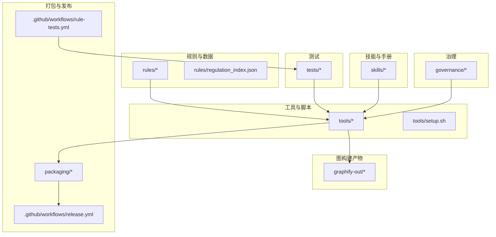
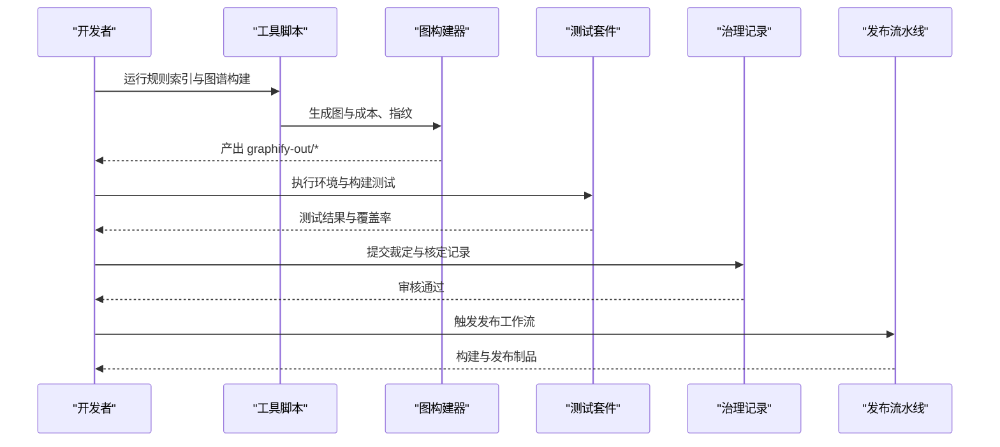
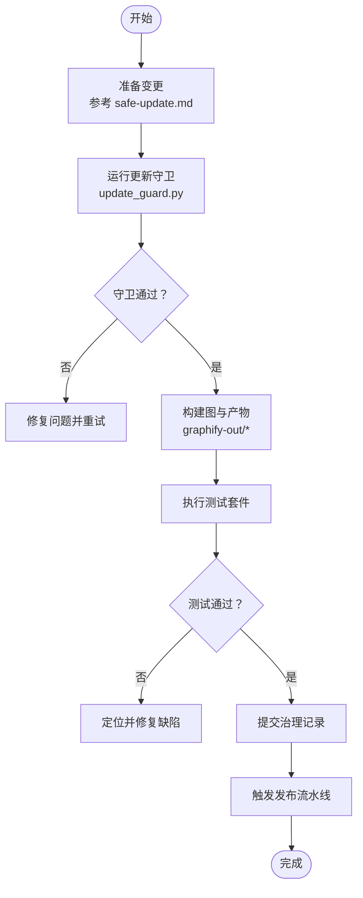
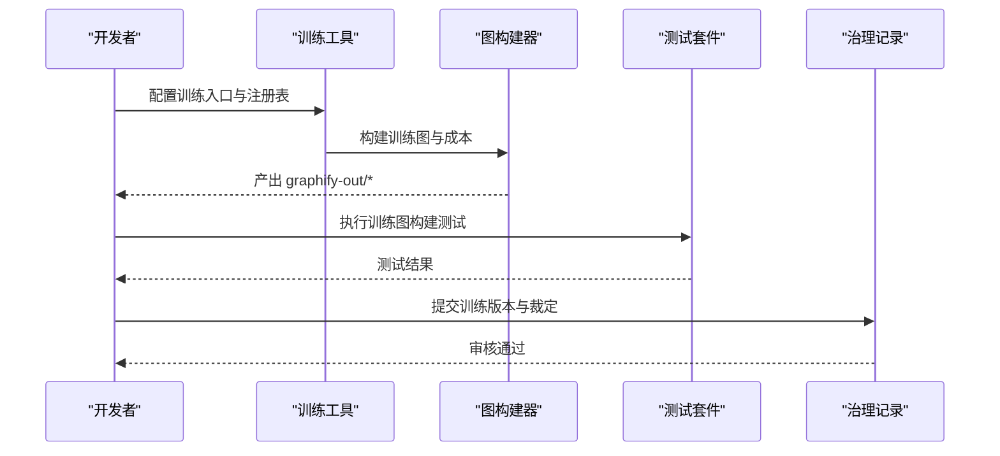
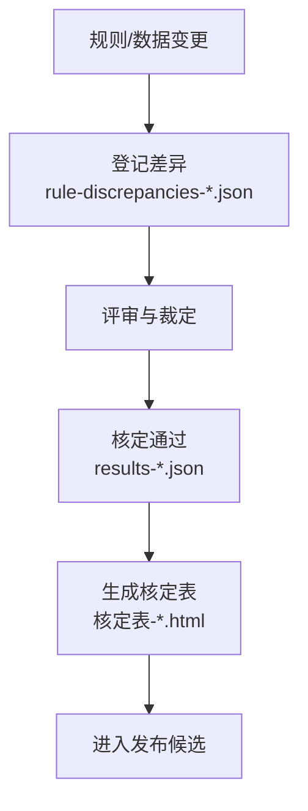
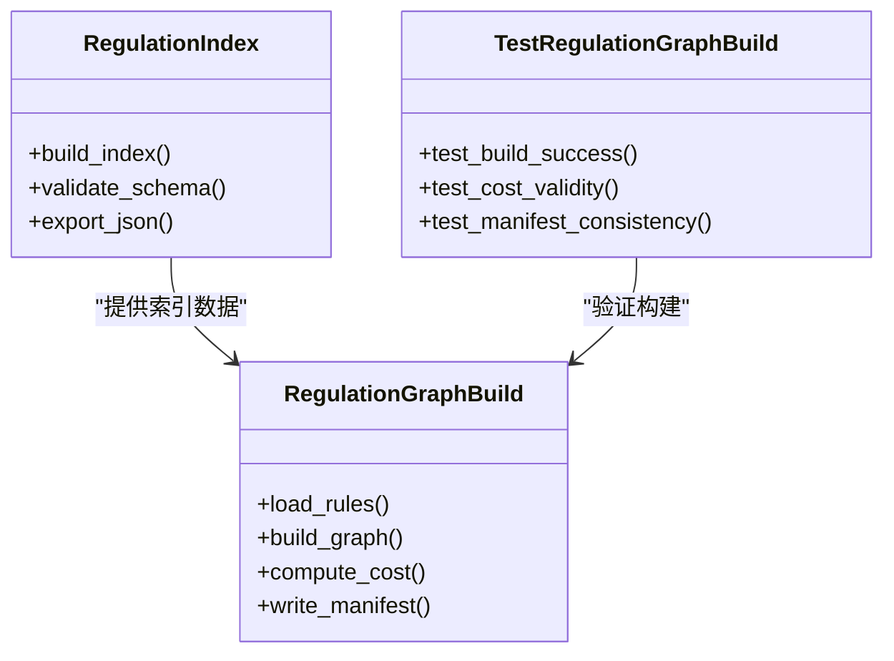
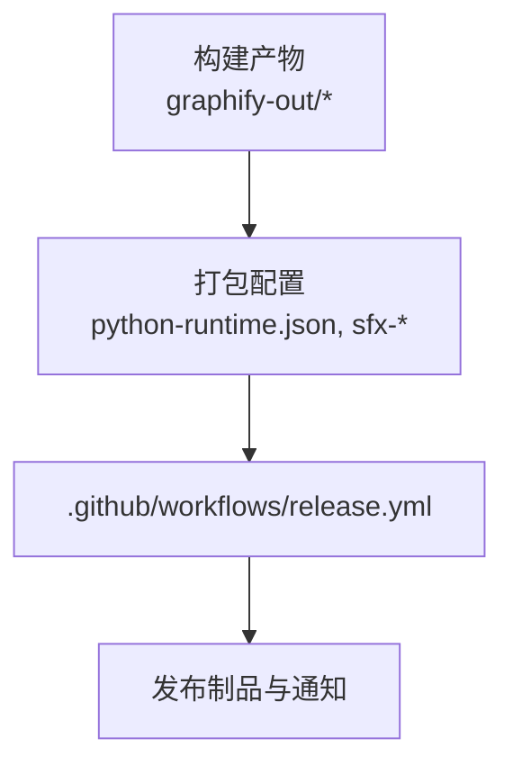
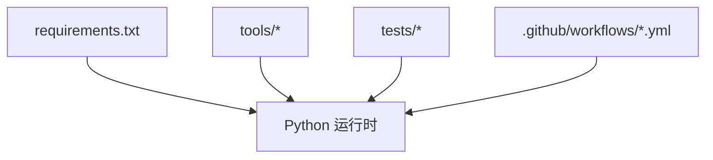

# 开发指南

<cite>
**本文引用的文件**   
- [requirements.txt](file://requirements.txt)
- [.github/workflows/release.yml](file://.github/workflows/release.yml)
- [.github/workflows/rule-tests.yml](file://.github/workflows/rule-tests.yml)
- [skills/safe-update.md](file://skills/safe-update.md)
- [skills/training-mode.md](file://skills/training-mode.md)
- [rules/README.md](file://rules/README.md)
- [tools/setup.sh](file://tools/setup.sh)
- [AGENTS.md](file://AGENTS.md)
- [CLAUDE.md](file://CLAUDE.md)
- [practice_notes/README.md](file://practice_notes/README.md)
- [governance/待確認清單/已裁示/rule-discrepancies-20260725.json](file://governance/待確認清單/已裁示/rule-discrepancies-20260725.json)
- [governance/核定紀錄/results-20260725-article18.json](file://governance/核定紀錄/results-20260725-article18.json)
- [governance/核定紀錄/results-20260729-pending-review.json](file://governance/核定紀錄/results-20260729-pending-review.json)
- [governance/核定表/核定表-20260708.html](file://governance/核定表/核定表-20260708.html)
- [graphify-out/graph.json](file://graphify-out/graph.json)
- [graphify-out/cost.json](file://graphify-out/cost.json)
- [graphify-out/source_fingerprint.json](file://graphify-out/source_fingerprint.json)
- [graphify-out/manifest.json](file://graphify-out/manifest.json)
- [packaging/python-runtime.json](file://packaging/python-runtime.json)
- [packaging/sfx-config.txt](file://packaging/sfx-config.txt)
- [packaging/sfx-module.json](file://packaging/sfx-module.json)
- [tests/test_check_env.py](file://tests/test_check_env.py)
- [tests/test_update_guard.py](file://tests/test_update_guard.py)
- [tests/test_training_graph_build.py](file://tests/test_training_graph_build.py)
- [tests/test_regulation_graph_build.py](file://tests/test_regulation_graph_build.py)
- [tools/regulation_index.py](file://tools/regulation_index.py)
- [tools/regulation_graph_build.py](file://tools/regulation_graph_build.py)
- [tools/update_guard.py](file://tools/update_guard.py)
</cite>

## 目录
1. [简介](#简介)
2. [项目结构](#项目结构)
3. [核心组件](#核心组件)
4. [架构总览](#架构总览)
5. [详细组件分析](#详细组件分析)
6. [依赖分析](#依赖分析)
7. [性能考量](#性能考量)
8. [故障排除指南](#故障排除指南)
9. [结论](#结论)
10. [附录](#附录)

## 简介
本开发指南面向贡献者与内部开发者，覆盖安全更新流程、训练模式配置与治理决策过程；同时明确代码规范、提交约定与代码审查流程。文档提供环境搭建步骤、调试技巧与性能分析方法，并记录架构决策、技术债务管理与版本规划。此外，说明贡献流程、问题报告与功能请求的处理方式，以及扩展开发的指导原则与最佳实践。最后包含常见问题解答与故障排除指南，帮助团队高效协作与持续交付。

## 项目结构
仓库采用“规则驱动 + 工具链 + 测试 + 治理”的模块化组织：
- rules：法规条款、检查清单与规则定义的数据与索引
- tools：数据处理、图表生成、报告导出等可执行脚本
- tests：单元测试与集成测试
- governance：治理决策、裁定与核定记录
- skills：技能与操作手册（如安全更新、训练模式）
- graphify-out：图构建产物与成本、指纹等元数据
- packaging：打包与分发配置
- training：训练数据与注册表
- docs：项目文档与路线图

**图示来源** 
- [rules/README.md:1-200](file://rules/README.md#L1-L200)
- [tools/setup.sh:1-200](file://tools/setup.sh#L1-L200)
- [.github/workflows/release.yml:1-200](file://.github/workflows/release.yml#L1-L200)
- [.github/workflows/rule-tests.yml:1-200](file://.github/workflows/rule-tests.yml#L1-L200)

**章节来源**
- [rules/README.md:1-200](file://rules/README.md#L1-L200)
- [tools/setup.sh:1-200](file://tools/setup.sh#L1-L200)
- [.github/workflows/release.yml:1-200](file://.github/workflows/release.yml#L1-L200)
- [.github/workflows/rule-tests.yml:1-200](file://.github/workflows/rule-tests.yml#L1-L200)

## 核心组件
- 规则与索引：通过 rules 目录下的条款 JSON 与索引文件，支撑审查逻辑与图谱构建
- 工具链：regulation_index.py、regulation_graph_build.py、update_guard.py 等脚本负责数据构建、图谱生成与更新守卫
- 测试套件：覆盖环境检查、更新守卫、训练图构建、法规图构建等关键路径
- 治理记录：裁定差异、核定结果与核定表用于审计与追溯
- 技能手册：safe-update.md、training-mode.md 等提供操作流程与最佳实践
- 打包与发布：python-runtime.json、sfx-* 配置文件与 GitHub Actions 工作流

**章节来源**
- [tools/regulation_index.py:1-200](file://tools/regulation_index.py#L1-L200)
- [tools/regulation_graph_build.py:1-200](file://tools/regulation_graph_build.py#L1-L200)
- [tools/update_guard.py:1-200](file://tools/update_guard.py#L1-L200)
- [tests/test_check_env.py:1-200](file://tests/test_check_env.py#L1-L200)
- [tests/test_update_guard.py:1-200](file://tests/test_update_guard.py#L1-L200)
- [tests/test_training_graph_build.py:1-200](file://tests/test_training_graph_build.py#L1-L200)
- [tests/test_regulation_graph_build.py:1-200](file://tests/test_regulation_graph_build.py#L1-L200)

## 架构总览
系统以“规则数据 → 工具处理 → 图构建产物 → 打包发布”为主线，辅以测试与治理闭环：
- 输入：rules 中的条款与索引
- 处理：tools 中的脚本进行索引构建、图谱生成、更新守卫校验
- 输出：graphify-out 中的图与成本、指纹、清单
- 质量：tests 保障稳定性与正确性
- 治理：governance 记录裁定与核定，确保合规与可追溯
- 发布：packaging 与 .github/workflows 自动化构建与发布

**图示来源** 
- [tools/regulation_index.py:1-200](file://tools/regulation_index.py#L1-L200)
- [tools/regulation_graph_build.py:1-200](file://tools/regulation_graph_build.py#L1-L200)
- [graphify-out/graph.json:1-200](file://graphify-out/graph.json#L1-L200)
- [graphify-out/cost.json:1-200](file://graphify-out/cost.json#L1-L200)
- [graphify-out/source_fingerprint.json:1-200](file://graphify-out/source_fingerprint.json#L1-L200)
- [.github/workflows/release.yml:1-200](file://.github/workflows/release.yml#L1-L200)

## 详细组件分析

### 安全更新流程（Safe Update）
- 目标：在变更规则或数据时，确保下游图与制品一致且可回滚
- 关键步骤：
  - 依据 skills/safe-update.md 的流程准备变更
  - 使用 update_guard.py 进行更新守卫校验
  - 运行 tests/test_update_guard.py 验证守卫行为
  - 生成新的图与成本、指纹，并纳入 graphify-out
  - 提交治理记录（裁定差异、核定结果）
  - 触发 release.yml 进行构建与发布

**图示来源** 
- [skills/safe-update.md:1-200](file://skills/safe-update.md#L1-L200)
- [tools/update_guard.py:1-200](file://tools/update_guard.py#L1-L200)
- [tests/test_update_guard.py:1-200](file://tests/test_update_guard.py#L1-L200)
- [graphify-out/graph.json:1-200](file://graphify-out/graph.json#L1-L200)
- [.github/workflows/release.yml:1-200](file://.github/workflows/release.yml#L1-L200)

**章节来源**
- [skills/safe-update.md:1-200](file://skills/safe-update.md#L1-L200)
- [tools/update_guard.py:1-200](file://tools/update_guard.py#L1-L200)
- [tests/test_update_guard.py:1-200](file://tests/test_update_guard.py#L1-L200)

### 训练模式配置（Training Mode）
- 目标：支持训练数据的采集、注册与图谱构建，便于模型迭代与评估
- 关键步骤：
  - 依据 skills/training-mode.md 配置训练入口与注册表
  - 使用 training_intake 与相关工具导入训练数据
  - 运行 tests/test_training_graph_build.py 验证训练图构建
  - 生成训练相关的图与成本、指纹，纳入 graphify-out
  - 结合治理记录进行训练集版本管理

**图示来源** 
- [skills/training-mode.md:1-200](file://skills/training-mode.md#L1-L200)
- [tests/test_training_graph_build.py:1-200](file://tests/test_training_graph_build.py#L1-L200)
- [graphify-out/graph.json:1-200](file://graphify-out/graph.json#L1-L200)

**章节来源**
- [skills/training-mode.md:1-200](file://skills/training-mode.md#L1-L200)
- [tests/test_training_graph_build.py:1-200](file://tests/test_training_graph_build.py#L1-L200)

### 治理决策过程（Governance）
- 目标：确保规则与判定的一致性与可审计性
- 关键要素：
  - 待确认清单与已裁定差异：rule-discrepancies-20260725.json
  - 核定纪录：results-20260725-article18.json、results-20260729-pending-review.json
  - 核定表：核定表-20260708.html
- 流程要点：
  - 变更需附带裁定差异与核定结果
  - 发布前需经治理审核通过
  - 所有决策留痕，支持回溯与审计

**图示来源** 
- [governance/待確認清單/已裁示/rule-discrepancies-20260725.json:1-200](file://governance/待確認清單/已裁示/rule-discrepancies-20260725.json#L1-L200)
- [governance/核定紀錄/results-20260725-article18.json:1-200](file://governance/核定紀錄/results-20260725-article18.json#L1-L200)
- [governance/核定紀錄/results-20260729-pending-review.json:1-200](file://governance/核定紀錄/results-20260729-pending-review.json#L1-L200)
- [governance/核定表/核定表-20260708.html:1-200](file://governance/核定表/核定表-20260708.html#L1-L200)

**章节来源**
- [governance/待確認清單/已裁示/rule-discrepancies-20260725.json:1-200](file://governance/待確認清單/已裁示/rule-discrepancies-20260725.json#L1-L200)
- [governance/核定紀錄/results-20260725-article18.json:1-200](file://governance/核定紀錄/results-20260725-article18.json#L1-L200)
- [governance/核定紀錄/results-20260729-pending-review.json:1-200](file://governance/核定紀錄/results-20260729-pending-review.json#L1-L200)
- [governance/核定表/核定表-20260708.html:1-200](file://governance/核定表/核定表-20260708.html#L1-L200)

### 规则与索引构建（Regulation Index & Graph Build）
- 目标：从规则数据构建索引与图谱，供审查与可视化使用
- 关键脚本：
  - regulation_index.py：构建法规索引
  - regulation_graph_build.py：构建法规图谱
- 测试覆盖：
  - test_regulation_graph_build.py：验证图谱构建正确性

**图示来源** 
- [tools/regulation_index.py:1-200](file://tools/regulation_index.py#L1-L200)
- [tools/regulation_graph_build.py:1-200](file://tools/regulation_graph_build.py#L1-L200)
- [tests/test_regulation_graph_build.py:1-200](file://tests/test_regulation_graph_build.py#L1-L200)

**章节来源**
- [tools/regulation_index.py:1-200](file://tools/regulation_index.py#L1-L200)
- [tools/regulation_graph_build.py:1-200](file://tools/regulation_graph_build.py#L1-L200)
- [tests/test_regulation_graph_build.py:1-200](file://tests/test_regulation_graph_build.py#L1-L200)

### 打包与发布（Packaging & Release）
- 目标：将制品打包为可分发的格式，并通过 CI 自动化发布
- 关键配置：
  - python-runtime.json：Python 运行时配置
  - sfx-config.txt、sfx-module.json：自解压模块配置
  - release.yml：GitHub Actions 发布工作流

**图示来源** 
- [packaging/python-runtime.json:1-200](file://packaging/python-runtime.json#L1-L200)
- [packaging/sfx-config.txt:1-200](file://packaging/sfx-config.txt#L1-L200)
- [packaging/sfx-module.json:1-200](file://packaging/sfx-module.json#L1-L200)
- [.github/workflows/release.yml:1-200](file://.github/workflows/release.yml#L1-L200)

**章节来源**
- [packaging/python-runtime.json:1-200](file://packaging/python-runtime.json#L1-L200)
- [packaging/sfx-config.txt:1-200](file://packaging/sfx-config.txt#L1-L200)
- [packaging/sfx-module.json:1-200](file://packaging/sfx-module.json#L1-L200)
- [.github/workflows/release.yml:1-200](file://.github/workflows/release.yml#L1-L200)

## 依赖分析
- 运行时依赖：由 requirements.txt 声明
- 工具依赖：各脚本按需引入标准库与第三方包
- 测试依赖：pytest 及相关断言库
- 发布依赖：GitHub Actions 与打包工具

**图示来源** 
- [requirements.txt:1-200](file://requirements.txt#L1-L200)

**章节来源**
- [requirements.txt:1-200](file://requirements.txt#L1-L200)

## 性能考量
- 图构建成本：关注 graphify-out/cost.json 的成本指标，优化构建路径与缓存策略
- 源指纹一致性：通过 source_fingerprint.json 监控输入变化，避免不必要的重构建
- 清单完整性：manifest.json 确保产物与依赖的一致性
- 测试并行化：利用 pytest 并行执行提升反馈速度
- 资源限制：在 CI 中设置合理的内存与超时阈值，避免构建失败

[本节为通用性能建议，不直接分析具体文件]

## 故障排除指南
- 环境检查失败：运行 tests/test_check_env.py 定位 Python 版本、依赖缺失或路径问题
- 更新守卫失败：检查 update_guard.py 的约束条件与输入数据一致性
- 训练图构建失败：核对 training registry 与输入数据格式，查看测试用例输出
- 法规图构建失败：验证 rules 目录结构与 schema 一致性，检查索引构建日志
- 发布失败：检查 packaging 配置与工作流变量，确认权限与签名

**章节来源**
- [tests/test_check_env.py:1-200](file://tests/test_check_env.py#L1-L200)
- [tools/update_guard.py:1-200](file://tools/update_guard.py#L1-L200)
- [tests/test_training_graph_build.py:1-200](file://tests/test_training_graph_build.py#L1-L200)
- [tests/test_regulation_graph_build.py:1-200](file://tests/test_regulation_graph_build.py#L1-L200)

## 结论
本指南系统化梳理了项目的安全更新、训练模式与治理流程，明确了代码规范、提交约定与审查流程，并提供环境搭建、调试与性能优化的实践方法。通过遵循本指南，团队可更高效地协作与交付高质量成果。

[本节为总结性内容，不直接分析具体文件]

## 附录
- 代码规范与提交约定：参考 AGENTS.md 与 CLAUDE.md 中的约定
- 贡献流程：Fork → 分支开发 → 提交 PR → 测试通过 → 治理审核 → 合并与发布
- 问题报告与功能请求：在 Issue 中描述背景、复现步骤与期望结果，附上相关日志与截图
- 扩展开发指导：新增规则需遵循 schema 与索引构建流程，补充测试用例与治理记录
- 最佳实践：小步快跑、充分测试、完整注释、持续集成

**章节来源**
- [AGENTS.md:1-200](file://AGENTS.md#L1-L200)
- [CLAUDE.md:1-200](file://CLAUDE.md#L1-L200)
- [practice_notes/README.md:1-200](file://practice_notes/README.md#L1-L200)