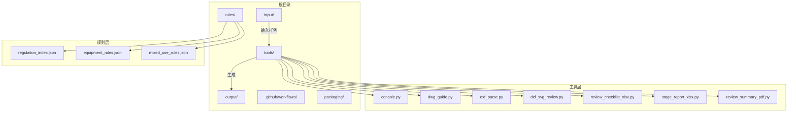
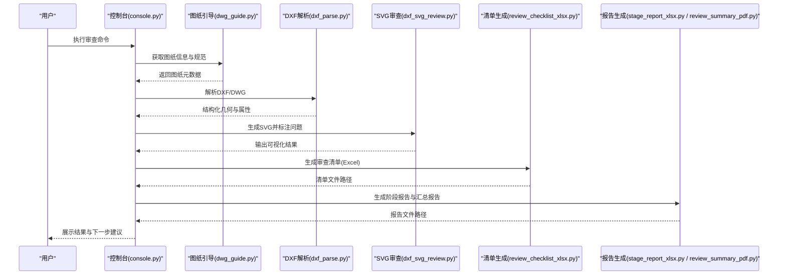
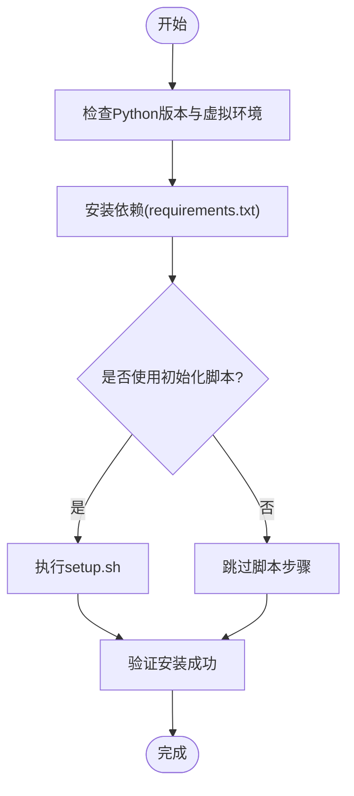
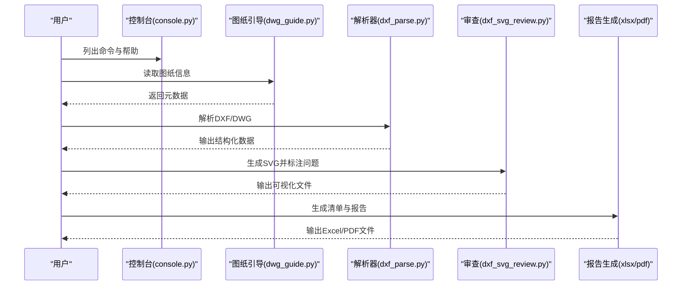
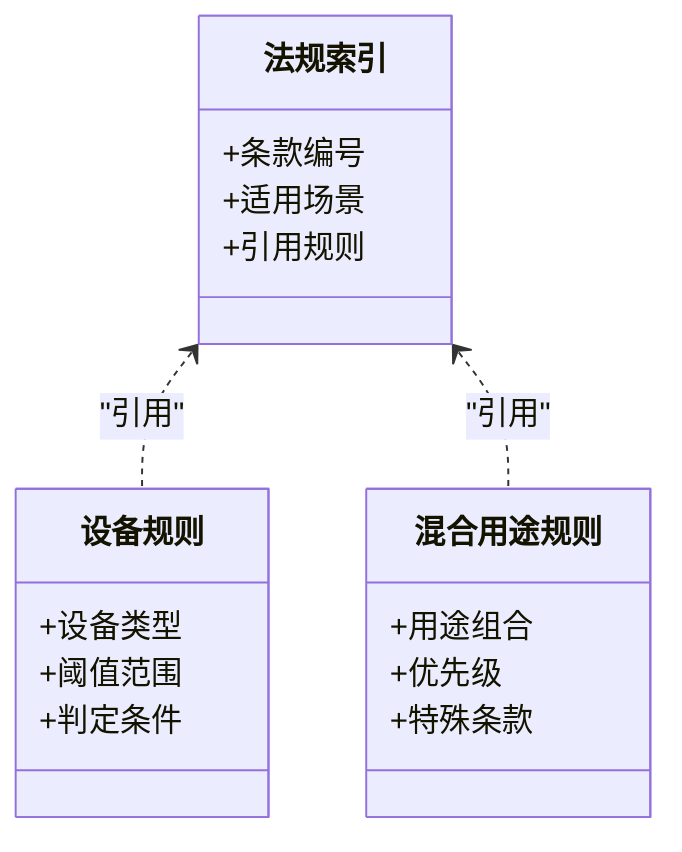
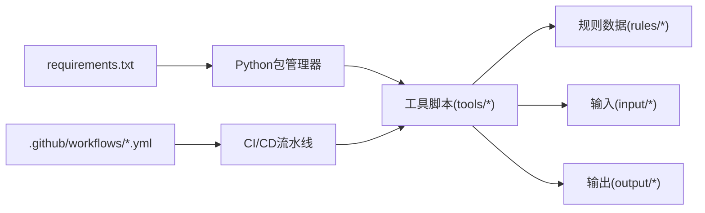

# 快速开始

<cite>
**本文引用的文件**   
- [requirements.txt](file://requirements.txt)
- [tools/setup.sh](file://tools/setup.sh)
- [tools/console.py](file://tools/console.py)
- [tools/dwg_guide.py](file://tools/dwg_guide.py)
- [tools/dxf_parse.py](file://tools/dxf_parse.py)
- [tools/dxf_svg_review.py](file://tools/dxf_svg_review.py)
- [tools/review_checklist_xlsx.py](file://tools/review_checklist_xlsx.py)
- [tools/stage_report_xlsx.py](file://tools/stage_report_xlsx.py)
- [tools/review_summary_pdf.py](file://tools/review_summary_pdf.py)
- [rules/regulation_index.json](file://rules/regulation_index.json)
- [rules/equipment_rules.json](file://rules/equipment_rules.json)
- [rules/mixed_use_rules.json](file://rules/mixed_use_rules.json)
- [input/範例/室內裝修表單範本/README.md](file://input/範例/室內裝修表單範本/README.md)
- [.github/workflows/release.yml](file://.github/workflows/release.yml)
- [.github/workflows/rule-tests.yml](file://.github/workflows/rule-tests.yml)
</cite>

## 目录
1. [简介](#简介)
2. [项目结构](#项目结构)
3. [核心组件](#核心组件)
4. [架构总览](#架构总览)
5. [详细组件分析](#详细组件分析)
6. [依赖关系分析](#依赖关系分析)
7. [性能注意事项](#性能注意事项)
8. [故障排除指南](#故障排除指南)
9. [结论](#结论)
10. [附录](#附录)

## 简介
本快速开始指南面向初次接触“消防安全设备审查系统”的用户，帮助你在最短时间内完成环境准备、依赖安装与初始配置，并掌握从导入图纸到生成审查报告的基本流程。文档同时为有经验的读者提供必要的技术细节与排错要点，确保你能高效地运行和扩展系统。

## 项目结构
仓库采用按功能模块划分的目录组织方式：
- rules：法规条款与规则定义（JSON），用于驱动审查逻辑
- tools：命令行工具与脚本，涵盖图纸解析、SVG审查、清单与报告生成等
- input：输入数据（如示例表单说明）
- output：输出结果（由工具生成）
- tests：测试用例，覆盖环境与关键流程
- .github/workflows：CI/CD 工作流，包含发布与规则测试
- packaging：打包相关配置

图表来源
- [rules/regulation_index.json](file://rules/regulation_index.json)
- [rules/equipment_rules.json](file://rules/equipment_rules.json)
- [rules/mixed_use_rules.json](file://rules/mixed_use_rules.json)
- [tools/console.py](file://tools/console.py)
- [tools/dwg_guide.py](file://tools/dwg_guide.py)
- [tools/dxf_parse.py](file://tools/dxf_parse.py)
- [tools/dxf_svg_review.py](file://tools/dxf_svg_review.py)
- [tools/review_checklist_xlsx.py](file://tools/review_checklist_xlsx.py)
- [tools/stage_report_xlsx.py](file://tools/stage_report_xlsx.py)
- [tools/review_summary_pdf.py](file://tools/review_summary/pdf.py)

章节来源
- [requirements.txt:1-200](file://requirements.txt#L1-L200)
- [.github/workflows/release.yml:1-200](file://.github/workflows/release.yml#L1-L200)
- [.github/workflows/rule-tests.yml:1-200](file://.github/workflows/rule-tests.yml#L1-L200)

## 核心组件
- 规则引擎与数据
  - 法规索引与设备规则以 JSON 形式集中管理，便于扩展与维护
  - 混合用途规则支持复杂场景的审查策略
- 工具链
  - 控制台入口与通用命令封装
  - 图纸导入与引导（DWG/DXF）
  - DXF 解析与 SVG 可视化审查
  - 审查清单（Excel）、分阶段报告（Excel）、汇总报告（PDF）生成
- 输入输出
  - 输入目录存放样例与模板说明
  - 输出目录保存生成的清单与报告

章节来源
- [rules/regulation_index.json:1-200](file://rules/regulation_index.json#L1-L200)
- [rules/equipment_rules.json:1-200](file://rules/equipment_rules.json#L1-L200)
- [rules/mixed_use_rules.json:1-200](file://rules/mixed_use_rules.json#L1-L200)
- [tools/console.py:1-200](file://tools/console.py#L1-L200)
- [tools/dwg_guide.py:1-200](file://tools/dwg_guide.py#L1-L200)
- [tools/dxf_parse.py:1-200](file://tools/dxf_parse.py#L1-L200)
- [tools/dxf_svg_review.py:1-200](file://tools/dxf_svg_review.py#L1-L200)
- [tools/review_checklist_xlsx.py:1-200](file://tools/review_checklist_xlsx.py#L1-L200)
- [tools/stage_report_xlsx.py:1-200](file://tools/stage_report_xlsx.py#L1-L200)
- [tools/review_summary_pdf.py:1-200](file://tools/review_summary_pdf.py#L1-L200)
- [input/範例/室內裝修表單範本/README.md:1-200](file://input/範例/室內裝修表單範本/README.md#L1-L200)

## 架构总览
系统采用“规则驱动 + 工具链”的架构：
- 规则层：通过 JSON 描述法规条款、设备规则与混合用途策略
- 工具层：提供命令行接口，串联图纸解析、规则匹配、报告生成
- 数据流：输入图纸/表单 → 解析与可视化 → 规则审查 → 输出清单与报告

图表来源
- [tools/console.py:1-200](file://tools/console.py#L1-L200)
- [tools/dwg_guide.py:1-200](file://tools/dwg_guide.py#L1-L200)
- [tools/dxf_parse.py:1-200](file://tools/dxf_parse.py#L1-L200)
- [tools/dxf_svg_review.py:1-200](file://tools/dxf_svg_review.py#L1-L200)
- [tools/review_checklist_xlsx.py:1-200](file://tools/review_checklist_xlsx.py#L1-L200)
- [tools/stage_report_xlsx.py:1-200](file://tools/stage_report_xlsx.py#L1-L200)
- [tools/review_summary_pdf.py:1-200](file://tools/review_summary_pdf.py#L1-L200)

## 详细组件分析

### 安装与环境准备
- Python 环境
  - 使用 requirements.txt 安装依赖
  - 建议在虚拟环境中安装以避免冲突
- 平台要求
  - Windows/Linux/macOS 均可运行
  - 若涉及 DWG 处理，请确认外部库或依赖已正确安装
- 初始化脚本
  - 可使用 tools/setup.sh 进行一键初始化（Linux/macOS）

章节来源
- [requirements.txt:1-200](file://requirements.txt#L1-L200)
- [tools/setup.sh:1-200](file://tools/setup.sh#L1-L200)

### 基本使用示例
- 启动控制台
  - 进入项目根目录后，通过控制台命令查看可用子命令与参数
- 导入图纸
  - 使用图纸引导工具获取图纸信息，确保格式与字段符合预期
- 解析与审查
  - 解析 DXF/DWG 并生成 SVG 可视化，标注潜在问题
- 生成报告
  - 导出审查清单（Excel）、分阶段报告（Excel）与汇总报告（PDF）

章节来源
- [tools/console.py:1-200](file://tools/console.py#L1-L200)
- [tools/dwg_guide.py:1-200](file://tools/dwg_guide.py#L1-L200)
- [tools/dxf_parse.py:1-200](file://tools/dxf_parse.py#L1-L200)
- [tools/dxf_svg_review.py:1-200](file://tools/dxf_svg_review.py#L1-L200)
- [tools/review_checklist_xlsx.py:1-200](file://tools/review_checklist_xlsx.py#L1-L200)
- [tools/stage_report_xlsx.py:1-200](file://tools/stage_report_xlsx.py#L1-L200)
- [tools/review_summary_pdf.py:1-200](file://tools/review_summary_pdf.py#L1-L200)

### 规则与配置
- 法规索引
  - regulation_index.json 提供条款索引与关联信息
- 设备规则
  - equipment_rules.json 定义设备类型、阈值与判定条件
- 混合用途规则
  - mixed_use_rules.json 支持多用途场所的复合审查策略

章节来源
- [rules/regulation_index.json:1-200](file://rules/regulation_index.json#L1-L200)
- [rules/equipment_rules.json:1-200](file://rules/equipment_rules.json#L1-L200)
- [rules/mixed_use_rules.json:1-200](file://rules/mixed_use_rules.json#L1-L200)

### 输入与输出
- 输入
  - 示例表单说明位于 input/範例/室內裝修表單範本/README.md
- 输出
  - 所有生成的清单与报告默认写入 output 目录

章节来源
- [input/範例/室內裝修表單範本/README.md:1-200](file://input/範例/室內裝修表單範本/README.md#L1-L200)

## 依赖关系分析
- 运行时依赖
  - 通过 requirements.txt 统一声明，建议使用虚拟环境隔离
- 构建与测试
  - .github/workflows 定义了发布与规则测试流程，可用于本地复现

图表来源
- [requirements.txt:1-200](file://requirements.txt#L1-L200)
- [.github/workflows/release.yml:1-200](file://.github/workflows/release.yml#L1-L200)
- [.github/workflows/rule-tests.yml:1-200](file://.github/workflows/rule-tests.yml#L1-L200)

章节来源
- [requirements.txt:1-200](file://requirements.txt#L1-L200)
- [.github/workflows/release.yml:1-200](file://.github/workflows/release.yml#L1-L200)
- [.github/workflows/rule-tests.yml:1-200](file://.github/workflows/rule-tests.yml#L1-L200)

## 性能注意事项
- 大图纸处理
  - 优先使用 DXF 解析以提升稳定性与速度；DWG 需确认外部依赖
- 规则匹配优化
  - 合理拆分规则文件，避免单文件过大导致加载缓慢
- 并发与缓存
  - 对重复使用的中间结果（如图纸元数据）进行缓存，减少重复计算
- 报告生成
  - 批量生成时注意内存占用，必要时分批次处理

[本节为通用指导，不直接分析具体文件]

## 故障排除指南
- 依赖安装失败
  - 检查 Python 版本与 pip 源；在虚拟环境中重新安装 requirements.txt
- 无法解析图纸
  - 确认文件格式与编码；尝试先使用 dwg_guide.py 获取元数据
- SVG 渲染异常
  - 检查字体与样式依赖；确保输出目录可写
- 报告生成错误
  - 检查 Excel/PDF 库是否安装；确认输出路径权限
- 规则不生效
  - 核对 rules 目录下 JSON 文件的结构与字段；使用 rule-tests 验证

章节来源
- [tools/setup.sh:1-200](file://tools/setup.sh#L1-L200)
- [tools/dwg_guide.py:1-200](file://tools/dwg_guide.py#L1-L200)
- [tools/dxf_parse.py:1-200](file://tools/dxf_parse.py#L1-L200)
- [tools/dxf_svg_review.py:1-200](file://tools/dxf_svg_review.py#L1-L200)
- [tools/review_checklist_xlsx.py:1-200](file://tools/review_checklist_xlsx.py#L1-L200)
- [tools/stage_report_xlsx.py:1-200](file://tools/stage_report_xlsx.py#L1-L200)
- [tools/review_summary_pdf.py:1-200](file://tools/review_summary_pdf.py#L1-L200)

## 结论
通过本快速开始指南，你已完成环境搭建、依赖安装与基础使用流程。建议进一步阅读 rules 目录下的规则定义与 tools 中的脚本说明，以便根据实际业务扩展审查策略与报告模板。

[本节为总结性内容，不直接分析具体文件]

## 附录
- 常用命令参考
  - 查看帮助：控制台命令
  - 导入图纸：图纸引导工具
  - 解析与审查：DXF 解析与 SVG 审查
  - 生成报告：清单与报告生成工具
- 配置文件模板
  - 规则 JSON 模板位于 rules 目录
  - 输入表单说明位于 input/範例/室內裝修表單範本/README.md

章节来源
- [tools/console.py:1-200](file://tools/console.py#L1-L200)
- [tools/dwg_guide.py:1-200](file://tools/dwg_guide.py#L1-L200)
- [tools/dxf_parse.py:1-200](file://tools/dxf_parse.py#L1-L200)
- [tools/dxf_svg_review.py:1-200](file://tools/dxf_svg_review.py#L1-L200)
- [tools/review_checklist_xlsx.py:1-200](file://tools/review_checklist_xlsx.py#L1-L200)
- [tools/stage_report_xlsx.py:1-200](file://tools/stage_report_xlsx.py#L1-L200)
- [tools/review_summary_pdf.py:1-200](file://tools/review_summary_pdf.py#L1-L200)
- [rules/regulation_index.json:1-200](file://rules/regulation_index.json#L1-L200)
- [rules/equipment_rules.json:1-200](file://rules/equipment_rules.json#L1-L200)
- [rules/mixed_use_rules.json:1-200](file://rules/mixed_use_rules.json#L1-L200)
- [input/範例/室內裝修表單範本/README.md:1-200](file://input/範例/室內裝修表單範本/README.md#L1-L200)