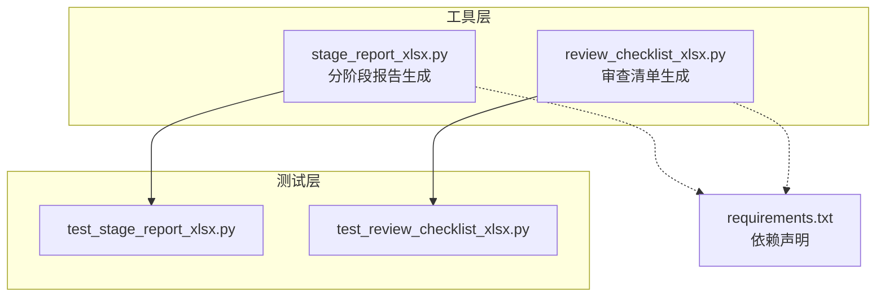
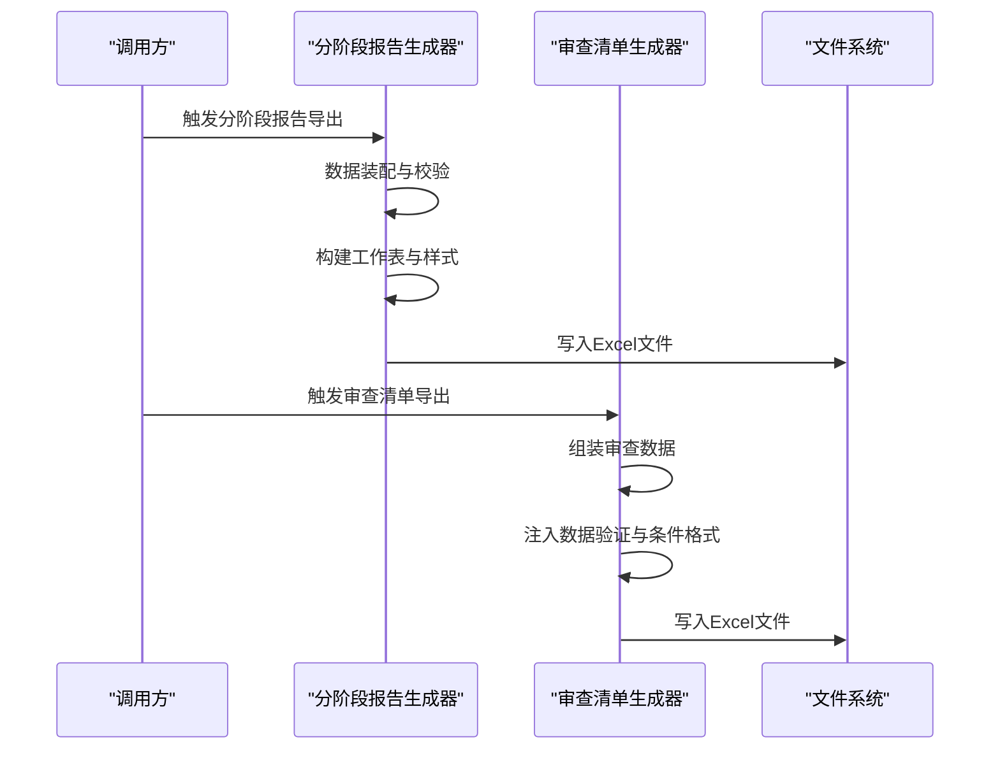
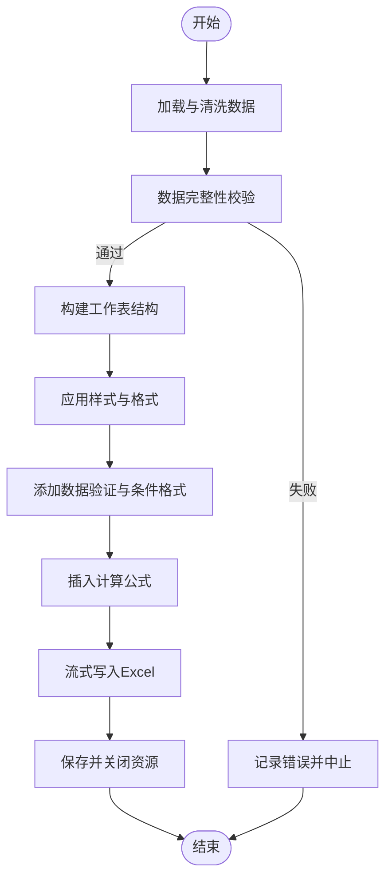
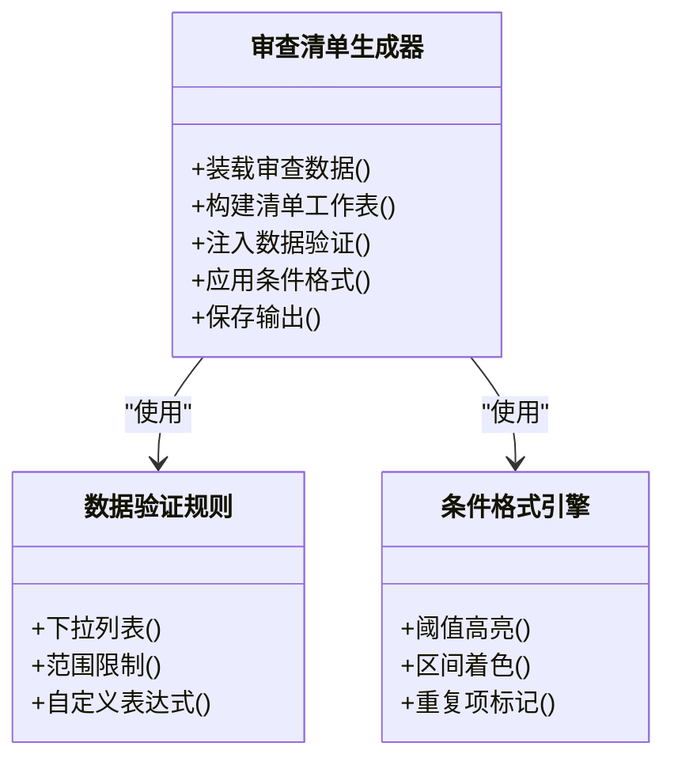
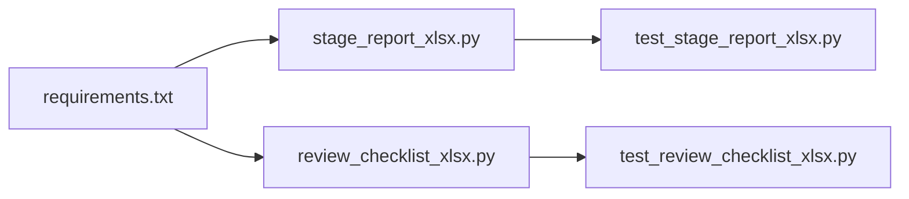

# Excel导出系统

<cite>
**本文引用的文件**   
- [requirements.txt](file://requirements.txt)
- [tools/stage_report_xlsx.py](file://tools/stage_report_xlsx.py)
- [tools/review_checklist_xlsx.py](file://tools/review_checklist_xlsx.py)
- [tests/test_stage_report_xlsx.py](file://tests/test_stage_report_xlsx.py)
- [tests/test_review_checklist_xlsx.py](file://tests/test_review_checklist_xlsx.py)
</cite>

## 目录
1. [简介](#简介)
2. [项目结构](#项目结构)
3. [核心组件](#核心组件)
4. [架构总览](#架构总览)
5. [详细组件分析](#详细组件分析)
6. [依赖关系分析](#依赖关系分析)
7. [性能考量](#性能考量)
8. [故障排查指南](#故障排查指南)
9. [结论](#结论)
10. [附录](#附录)

## 简介
本技术文档面向Excel导出子系统，聚焦分阶段Excel报告的生成机制、工作表结构与数据格式化、多表关联、模板系统与样式设置、数据验证规则、公式与条件格式应用、大数据量处理策略与内存优化，以及与审查流程的数据同步和自动化导出能力。文档同时提供模板定制与格式扩展的开发指南，帮助开发者快速定位关键实现并安全扩展功能。

## 项目结构
Excel导出相关代码主要位于 tools 目录下的两个脚本：分阶段报告生成器与审查清单生成器；测试用例位于 tests 目录，用于保障导出逻辑的正确性与稳定性。依赖通过 requirements.txt 管理。

图表来源
- [tools/stage_report_xlsx.py](file://tools/stage_report_xlsx.py)
- [tools/review_checklist_xlsx.py](file://tools/review_checklist_xlsx.py)
- [tests/test_stage_report_xlsx.py](file://tests/test_stage_report_xlsx.py)
- [tests/test_review_checklist_xlsx.py](file://tests/test_review_checklist_xlsx.py)
- [requirements.txt](file://requirements.txt)

章节来源
- [requirements.txt](file://requirements.txt)
- [tools/stage_report_xlsx.py](file://tools/stage_report_xlsx.py)
- [tools/review_checklist_xlsx.py](file://tools/review_checklist_xlsx.py)
- [tests/test_stage_report_xlsx.py](file://tests/test_stage_report_xlsx.py)
- [tests/test_review_checklist_xlsx.py](file://tests/test_review_checklist_xlsx.py)

## 核心组件
- 分阶段报告生成器（stage_report_xlsx.py）
  - 负责按阶段组织数据，构建多工作表Excel报告，包含标题页、阶段明细、汇总与校验结果等。
  - 支持单元格样式、列宽自适应、冻结窗格、筛选器、数据验证与条件格式。
  - 提供批量写入与分页流式写入策略，避免大对象驻留导致内存膨胀。
- 审查清单生成器（review_checklist_xlsx.py）
  - 将审查项、检查点、判定结果与备注结构化输出为可交互的清单表格。
  - 内置下拉选择、必填校验、重复项检测与跨表引用校验。
  - 支持模板化布局与样式复用，便于统一规范。

章节来源
- [tools/stage_report_xlsx.py](file://tools/stage_report_xlsx.py)
- [tools/review_checklist_xlsx.py](file://tools/review_checklist_xlsx.py)

## 架构总览
整体采用“数据准备—模板渲染—样式与规则注入—持久化”的分阶段流水线。每个导出任务由一个独立入口函数驱动，内部调用数据装配、工作表构造、样式与规则配置、以及保存输出。

图表来源
- [tools/stage_report_xlsx.py](file://tools/stage_report_xlsx.py)
- [tools/review_checklist_xlsx.py](file://tools/review_checklist_xlsx.py)

## 详细组件分析

### 分阶段报告生成器（stage_report_xlsx.py）
- 工作表结构
  - 封面/元信息：项目名称、版本、生成时间、责任人等。
  - 阶段明细：按阶段维度展开，包含字段名、值、单位、说明、状态。
  - 汇总统计：各阶段指标聚合、趋势与对比。
  - 校验结果：一致性检查、缺失项提示、异常标记。
- 数据格式化
  - 数值类型统一格式化（千分位、小数位数、百分比）。
  - 日期时间标准化显示与本地化。
  - 文本对齐、换行、自动列宽与冻结首行。
- 多表关联
  - 通过命名区域或隐藏辅助表建立跨表引用，确保汇总与明细联动。
  - 使用VLOOKUP/XLOOKUP类公式进行主键匹配与数据回填。
- 模板系统与样式
  - 预定义样式集（标题、表头、正文、警告、成功、错误）。
  - 条件格式：阈值高亮、区间着色、重复项标记。
  - 数据验证：下拉列表、范围限制、自定义表达式。
- 公式与条件格式
  - 在汇总表中嵌入计算型公式，保证动态更新。
  - 基于规则的条件格式，提升可读性与问题定位效率。
- 大数据量与内存优化
  - 分块写入与惰性加载，减少一次性内存占用。
  - 关闭不必要的自动计算与缓存，降低生成耗时。
  - 使用只写模式与临时文件缓冲，避免频繁磁盘IO。

图表来源
- [tools/stage_report_xlsx.py](file://tools/stage_report_xlsx.py)

章节来源
- [tools/stage_report_xlsx.py](file://tools/stage_report_xlsx.py)

### 审查清单生成器（review_checklist_xlsx.py）
- 工作表结构
  - 审查项清单：编号、名称、依据条款、检查要点、判定结果、备注。
  - 证据附件索引：文件名、路径、摘要、上传时间。
  - 审核意见汇总：意见类别、优先级、处理状态、责任人。
- 数据格式化
  - 枚举字段映射为中文展示，保持可读性。
  - 长文本自动换行与折叠，控制打印布局。
- 数据验证规则
  - 下拉选择限定判定结果（如“符合/不符合/待确认”）。
  - 必填字段校验与重复项检测。
  - 跨表引用校验，确保证据与审查项一一对应。
- 条件格式
  - 根据判定结果着色（绿色=符合，红色=不符合，黄色=待确认）。
  - 超时未处理的高亮提醒。
- 模板与样式
  - 统一的表头样式、边框与背景色。
  - 打印页面设置（页眉页脚、页边距、纸张大小）。

图表来源
- [tools/review_checklist_xlsx.py](file://tools/review_checklist_xlsx.py)

章节来源
- [tools/review_checklist_xlsx.py](file://tools/review_checklist_xlsx.py)

### 测试与质量保障
- 分阶段报告测试（test_stage_report_xlsx.py）
  - 覆盖典型场景：空数据、边界值、异常输入、大样本数据。
  - 断言工作表数量、列名、样式应用与公式有效性。
- 审查清单测试（test_review_checklist_xlsx.py）
  - 验证数据验证规则生效、条件格式正确、跨表引用无误。
  - 模拟用户交互后的导出一致性检查。

章节来源
- [tests/test_stage_report_xlsx.py](file://tests/test_stage_report_xlsx.py)
- [tests/test_review_checklist_xlsx.py](file://tests/test_review_checklist_xlsx.py)

## 依赖关系分析
- 外部库依赖
  - Excel读写与样式操作通常依赖第三方库（如openpyxl、xlsxwriter等），具体以 requirements.txt 为准。
  - 数据处理可能依赖pandas/numpy以提升性能。
- 模块耦合
  - 两个导出脚本相对独立，共享通用样式与规则配置时建议抽取公共模块。
  - 测试用例直接依赖对应脚本接口，确保回归稳定。

图表来源
- [requirements.txt](file://requirements.txt)
- [tools/stage_report_xlsx.py](file://tools/stage_report_xlsx.py)
- [tools/review_checklist_xlsx.py](file://tools/review_checklist_xlsx.py)
- [tests/test_stage_report_xlsx.py](file://tests/test_stage_report_xlsx.py)
- [tests/test_review_checklist_xlsx.py](file://tests/test_review_checklist_xlsx.py)

章节来源
- [requirements.txt](file://requirements.txt)

## 性能考量
- 内存优化
  - 使用流式写入与分块处理，避免一次性加载全部数据到内存。
  - 禁用自动计算与冗余缓存，仅在最终保存前启用必要计算。
- I/O优化
  - 合并多次写入为批量提交，减少磁盘IO次数。
  - 使用临时文件缓冲，避免中间态污染。
- 计算优化
  - 优先使用数组公式与聚合函数，减少单元格级计算。
  - 对条件格式与数据验证进行批量化配置，避免逐单元格设置。
- 可扩展性
  - 将样式与规则抽象为可插拔模块，便于按需启用。
  - 引入异步任务队列，支持并发导出与进度反馈。

[本节为通用指导，不直接分析具体文件]

## 故障排查指南
- 常见问题
  - 导出失败：检查数据源完整性与类型转换是否成功。
  - 样式丢失：确认样式集是否正确注册与应用顺序。
  - 公式错误：核对命名区域与跨表引用是否正确。
  - 数据验证无效：检查规则定义与单元格范围是否匹配。
- 调试建议
  - 开启详细日志，记录关键步骤与异常堆栈。
  - 使用最小数据集复现问题，逐步定位。
  - 对条件格式与数据验证单独验证，隔离问题域。

章节来源
- [tests/test_stage_report_xlsx.py](file://tests/test_stage_report_xlsx.py)
- [tests/test_review_checklist_xlsx.py](file://tests/test_review_checklist_xlsx.py)

## 结论
Excel导出系统通过模块化设计与清晰的流水线，实现了分阶段报告与审查清单的高效生成。借助模板化样式、数据验证与条件格式，提升了报表的可读性与可用性。针对大数据量场景，采用流式写入与计算优化策略，确保性能与稳定性。未来可进一步抽象公共能力，增强可插拔性与并发处理能力。

[本节为总结性内容，不直接分析具体文件]

## 附录
- 开发指南
  - 模板定制：新增样式集与布局模板，遵循既有命名约定与层级结构。
  - 格式扩展：扩展数据验证规则与条件格式引擎，保持向后兼容。
  - 自动化导出：集成调度任务与事件钩子，支持定时与触发式导出。
- 文件格式规范
  - 工作表命名规范、列头标准、数据类型约定与打印设置。
  - 公式命名区域与跨表引用规范，确保可维护性。

[本节为概念性内容，不直接分析具体文件]