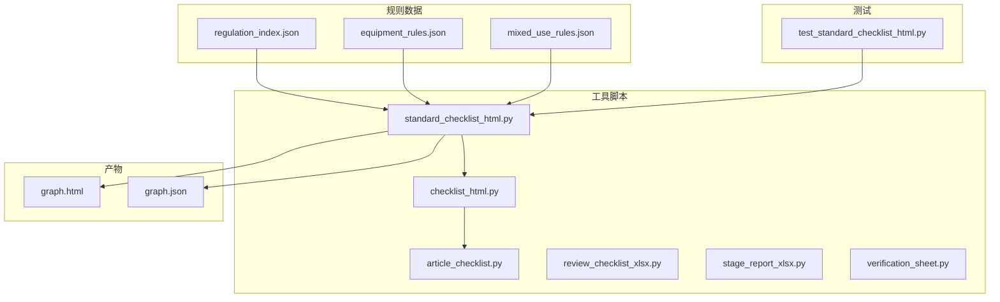
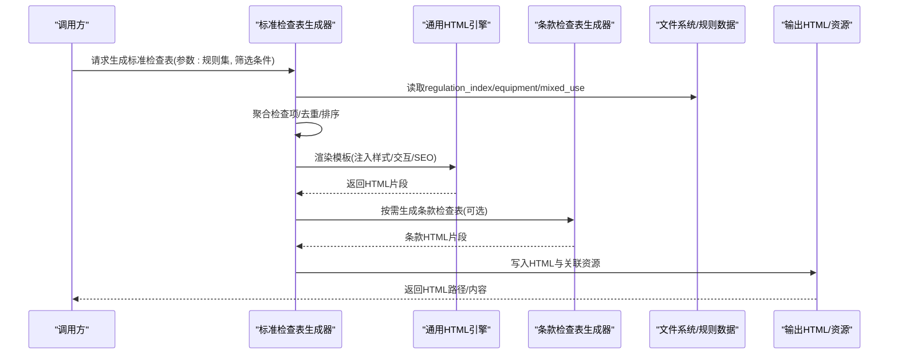
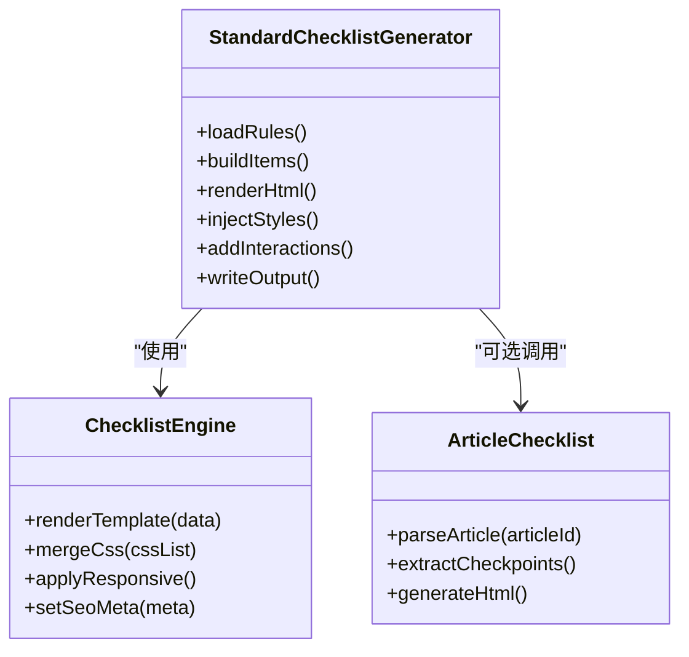
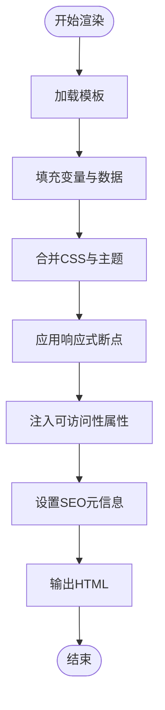
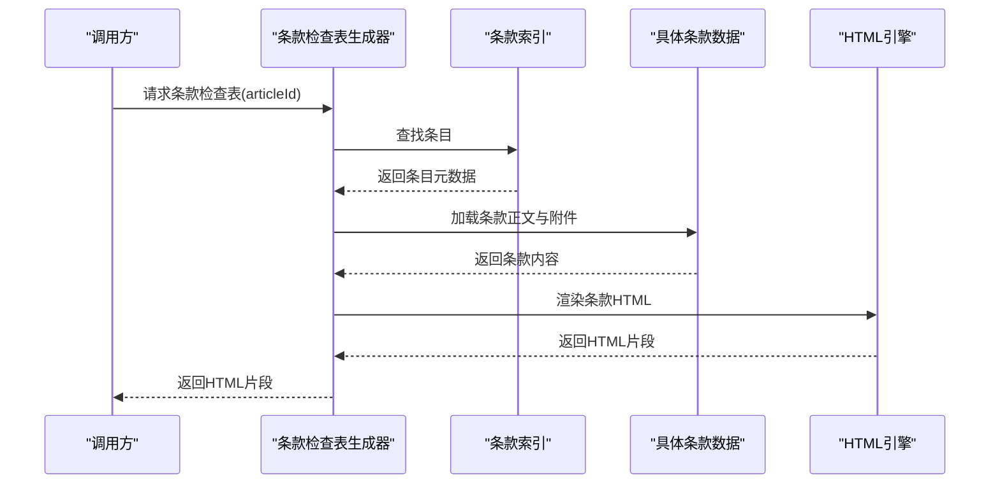
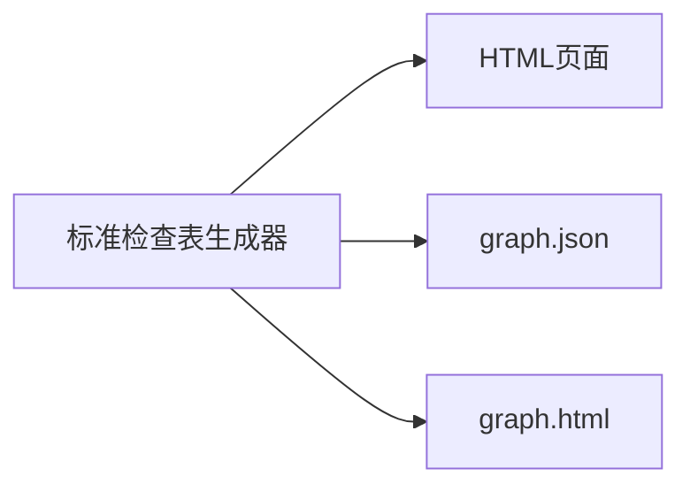
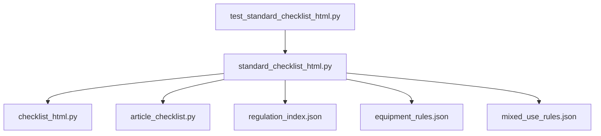

# HTML检查表生成器

<cite>
**本文档引用的文件**
- [standard_checklist_html.py](file://tools/standard_checklist_html.py)
- [checklist_html.py](file://tools/checklist_html.py)
- [article_checklist.py](file://tools/article_checklist.py)
- [regulation_index.json](file://rules/regulation_index.json)
- [equipment_rules.json](file://rules/equipment_rules.json)
- [mixed_use_rules.json](file://rules/mixed_use_rules.json)
- [test_standard_checklist_html.py](file://tests/test_standard_checklist_html.py)
- [review_checklist_xlsx.py](file://tools/review_checklist_xlsx.py)
- [stage_report_xlsx.py](file://tools/stage_report_xlsx.py)
- [verification_sheet.py](file://tools/verification_sheet.py)
- [graph_labels.json](file://graphify-out/.graphify_labels.json)
- [graph.html](file://graphify-out/graph.html)
- [graph.json](file://graphify-out/graph.json)
</cite>

## 目录
1. [简介](#简介)
2. [项目结构](#项目结构)
3. [核心组件](#核心组件)
4. [架构总览](#架构总览)
5. [详细组件分析](#详细组件分析)
6. [依赖关系分析](#依赖关系分析)
7. [性能考量](#性能考量)
8. [故障排查指南](#故障排查指南)
9. [结论](#结论)
10. [附录](#附录)

## 简介
本技术文档面向HTML检查表生成器，聚焦标准检查表与法规条款检查表的HTML生成机制。文档涵盖模板系统、CSS样式集成与响应式设计实现；提供自定义布局、交互功能与外部资源集成的实践方法；记录HTML输出规范、SEO优化与可访问性支持；解释与法规数据库的集成方式与动态内容生成；并给出模板定制、样式主题开发与功能扩展的开发指南。

## 项目结构
本项目围绕“规则数据 + 工具脚本 + 测试验证”的组织方式构建：
- rules：存放法规索引、设备规则、混合用途规则等结构化数据
- tools：包含检查表生成、报告导出、图构建等工具脚本
- tests：覆盖关键流程的单元测试与集成测试
- graphify-out：图可视化产物（HTML/JSON）
- output：生成物输出目录
- docs/practice_notes/governance：业务与治理相关文档

图表来源
- [regulation_index.json](file://rules/regulation_index.json)
- [equipment_rules.json](file://rules/equipment_rules.json)
- [mixed_use_rules.json](file://rules/mixed_use_rules.json)
- [standard_checklist_html.py](file://tools/standard_checklist_html.py)
- [checklist_html.py](file://tools/checklist_html.py)
- [article_checklist.py](file://tools/article_checklist.py)
- [graph.html](file://graphify-out/graph.html)
- [graph.json](file://graphify-out/graph.json)

章节来源
- [standard_checklist_html.py](file://tools/standard_checklist_html.py)
- [checklist_html.py](file://tools/checklist_html.py)
- [article_checklist.py](file://tools/article_checklist.py)
- [regulation_index.json](file://rules/regulation_index.json)
- [equipment_rules.json](file://rules/equipment_rules.json)
- [mixed_use_rules.json](file://rules/mixed_use_rules.json)
- [test_standard_checklist_html.py](file://tests/test_standard_checklist_html.py)

## 核心组件
- 标准检查表HTML生成器：负责从规则数据组装检查项、渲染HTML、注入样式与交互逻辑，并输出符合规范的页面。
- 通用检查表HTML引擎：封装模板渲染、样式注入、响应式适配与SEO元信息处理。
- 法规条款检查表生成器：基于条款索引与具体条款数据，动态拼装条款级检查表。
- 辅助工具：Excel导出、阶段报告、核验表单、图构建与标签管理等。

章节来源
- [standard_checklist_html.py](file://tools/standard_checklist_html.py)
- [checklist_html.py](file://tools/checklist_html.py)
- [article_checklist.py](file://tools/article_checklist.py)
- [review_checklist_xlsx.py](file://tools/review_checklist_xlsx.py)
- [stage_report_xlsx.py](file://tools/stage_report_xlsx.py)
- [verification_sheet.py](file://tools/verification_sheet.py)

## 架构总览
整体流程以“数据驱动+模板渲染”为核心：
- 输入：规则索引、设备规则、混合用途规则、条款数据
- 处理：检查项聚合、条件过滤、排序分组、交互状态建模
- 输出：HTML页面（含内联或外链CSS/JS）、SEO元信息、可访问性标注、可选图可视化产物

图表来源
- [standard_checklist_html.py](file://tools/standard_checklist_html.py)
- [checklist_html.py](file://tools/checklist_html.py)
- [article_checklist.py](file://tools/article_checklist.py)
- [regulation_index.json](file://rules/regulation_index.json)
- [equipment_rules.json](file://rules/equipment_rules.json)
- [mixed_use_rules.json](file://rules/mixed_use_rules.json)

## 详细组件分析

### 标准检查表HTML生成器
职责
- 解析规则索引与设备/混合用途规则，提取检查项与判定条件
- 将检查项按类别、优先级、适用场景分组与排序
- 通过模板引擎渲染HTML，注入CSS与交互脚本
- 输出SEO元信息、可访问性属性与结构化数据

关键点
- 数据模型：检查项包含标题、描述、依据条款、判定条件、证据要求、备注等字段
- 渲染策略：优先内联样式保证离线可用，同时支持外链样式覆盖
- 交互能力：折叠/展开、搜索过滤、勾选状态持久化、打印友好
- 响应式：移动端优先的栅格布局，断点适配

图表来源
- [standard_checklist_html.py](file://tools/standard_checklist_html.py)
- [checklist_html.py](file://tools/checklist_html.py)
- [article_checklist.py](file://tools/article_checklist.py)

章节来源
- [standard_checklist_html.py](file://tools/standard_checklist_html.py)
- [checklist_html.py](file://tools/checklist_html.py)
- [article_checklist.py](file://tools/article_checklist.py)

### 通用检查表HTML引擎
职责
- 模板渲染：支持变量替换、循环、条件分支
- 样式集成：合并多源CSS、应用主题变量、响应式断点
- SEO与可访问性：设置title、description、keywords、aria-*属性、语义化标签
- 资源管理：内联或外链CSS/JS、图片与字体加载策略

关键点
- 模板语言：轻量模板语法，避免复杂逻辑，确保可维护性
- 样式策略：CSS变量定义主题色、间距、字号；媒体查询实现响应式
- 可访问性：为交互元素添加role、aria-label、aria-expanded等
- SEO优化：结构化数据（如JSON-LD）、canonical链接、Open Graph标签

图表来源
- [checklist_html.py](file://tools/checklist_html.py)

章节来源
- [checklist_html.py](file://tools/checklist_html.py)

### 法规条款检查表生成器
职责
- 解析条款索引与具体条款数据，提取检查要点
- 将条款映射到检查项，补充依据与证据要求
- 生成条款级HTML片段，支持嵌入标准检查表

关键点
- 条款数据结构：编号、标题、正文、适用范围、引用条款、附件
- 映射策略：关键词匹配、正则抽取、人工标注优先级
- 动态内容：根据上下文（场所类型、面积、楼层）动态显示条款

图表来源
- [article_checklist.py](file://tools/article_checklist.py)
- [regulation_index.json](file://rules/regulation_index.json)

章节来源
- [article_checklist.py](file://tools/article_checklist.py)
- [regulation_index.json](file://rules/regulation_index.json)

### 输出与可视化
- HTML输出：包含完整页面结构、内联样式、交互脚本、SEO元信息
- 图可视化：生成graph.html与graph.json，用于展示规则关系与状态

图表来源
- [standard_checklist_html.py](file://tools/standard_checklist_html.py)
- [graph.html](file://graphify-out/graph.html)
- [graph.json](file://graphify-out/graph.json)

章节来源
- [standard_checklist_html.py](file://tools/standard_checklist_html.py)
- [graph.html](file://graphify-out/graph.html)
- [graph.json](file://graphify-out/graph.json)

## 依赖关系分析
- 内部依赖：标准检查表生成器依赖通用HTML引擎与条款检查表生成器
- 数据依赖：规则索引、设备规则、混合用途规则作为输入数据源
- 测试依赖：单元测试验证生成结果的正确性与稳定性

图表来源
- [standard_checklist_html.py](file://tools/standard_checklist_html.py)
- [checklist_html.py](file://tools/checklist_html.py)
- [article_checklist.py](file://tools/article_checklist.py)
- [regulation_index.json](file://rules/regulation_index.json)
- [equipment_rules.json](file://rules/equipment_rules.json)
- [mixed_use_rules.json](file://rules/mixed_use_rules.json)
- [test_standard_checklist_html.py](file://tests/test_standard_checklist_html.py)

章节来源
- [standard_checklist_html.py](file://tools/standard_checklist_html.py)
- [checklist_html.py](file://tools/checklist_html.py)
- [article_checklist.py](file://tools/article_checklist.py)
- [regulation_index.json](file://rules/regulation_index.json)
- [equipment_rules.json](file://rules/equipment_rules.json)
- [mixed_use_rules.json](file://rules/mixed_use_rules.json)
- [test_standard_checklist_html.py](file://tests/test_standard_checklist_html.py)

## 性能考量
- 数据预处理：在内存中缓存规则索引与常用条款，减少重复IO
- 模板渲染：避免复杂逻辑，使用预编译模板提升渲染速度
- 样式与脚本：内联关键CSS，延迟加载非关键JS，减少首屏阻塞
- 输出优化：压缩HTML与资源，启用Gzip/Brotli（若部署环境支持）
- 并发控制：批量生成时限制并发度，避免资源争用

[本节为通用指导，不直接分析具体文件]

## 故障排查指南
常见问题与定位方法
- 模板渲染失败：检查模板语法与变量名是否匹配，确认数据完整性
- 样式未生效：确认CSS加载顺序与优先级，检查浏览器控制台错误
- 交互异常：验证事件绑定与DOM节点是否存在，检查无障碍属性是否正确
- 数据缺失：核对规则索引与条款数据是否齐全，路径是否正确
- 输出为空：检查生成器入口参数与过滤条件是否过于严格

调试建议
- 启用详细日志，记录关键步骤与异常堆栈
- 使用最小数据集复现问题，逐步缩小范围
- 借助浏览器开发者工具检查网络请求与DOM状态

章节来源
- [test_standard_checklist_html.py](file://tests/test_standard_checklist_html.py)

## 结论
本HTML检查表生成器以规则数据为核心，结合模板渲染与样式注入，实现了标准检查表与法规条款检查表的自动化生成。通过模块化设计，系统具备良好的可扩展性与可维护性。建议在后续迭代中持续优化性能、增强可访问性与SEO能力，并完善测试覆盖率以确保质量稳定。

[本节为总结性内容，不直接分析具体文件]

## 附录
- 自定义检查表布局：通过修改模板变量与CSS变量，快速调整布局与主题
- 添加交互功能：在HTML引擎中扩展事件处理器，支持勾选、搜索、导出等功能
- 集成外部资源：配置CDN或本地资源路径，确保离线与在线均可用
- 开发指南：遵循代码风格与命名规范，提交前运行测试用例

[本节为概念性内容，不直接分析具体文件]