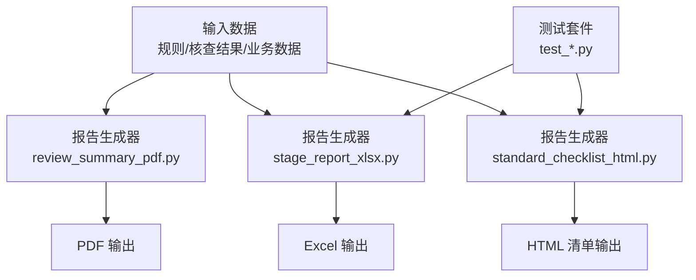
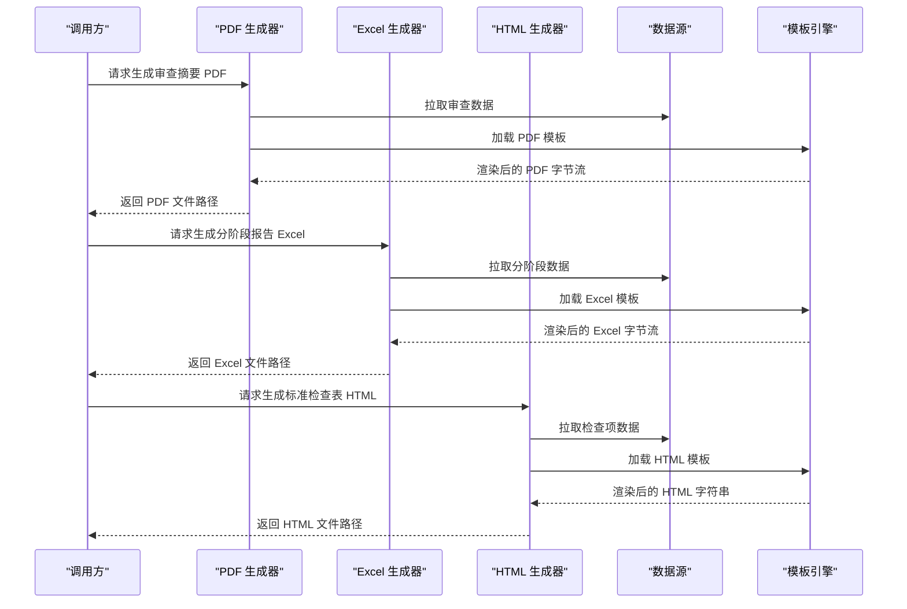
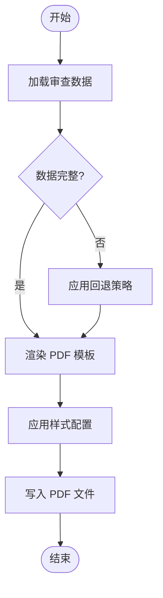
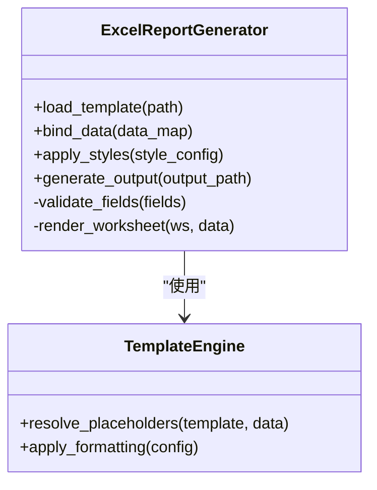
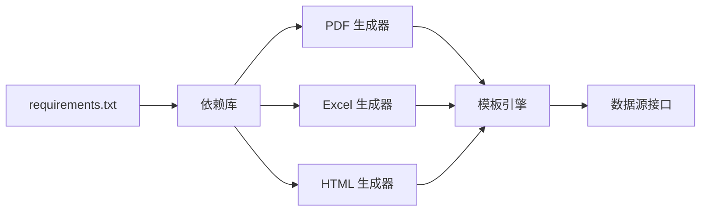

# 报告生成系统

<cite>
**本文引用的文件**   
- [requirements.txt](file://requirements.txt)
- [tools/review_summary_pdf.py](file://tools/review_summary_pdf.py)
- [tools/stage_report_xlsx.py](file://tools/stage_report_xlsx.py)
- [tools/standard_checklist_html.py](file://tools/standard_checklist_html.py)
- [tools/review_checklist_xlsx.py](file://tools/review_checklist_xlsx.py)
- [tests/test_review_checklist_xlsx.py](file://tests/test_review_checklist_xlsx.py)
- [tests/test_stage_report_xlsx.py](file://tests/test_stage_report_xlsx.py)
- [tests/test_standard_checklist_html.py](file://tests/test_standard_checklist_html.py)
</cite>

## 目录
1. [简介](#简介)
2. [项目结构](#项目结构)
3. [核心组件](#核心组件)
4. [架构总览](#架构总览)
5. [详细组件分析](#详细组件分析)
6. [依赖关系分析](#依赖关系分析)
7. [性能考量](#性能考量)
8. [故障排查指南](#故障排查指南)
9. [结论](#结论)
10. [附录](#附录)

## 简介
本技术文档面向“报告生成系统”，聚焦于三类输出：PDF审查摘要、Excel分阶段报告与标准检查表（HTML清单）。文档从系统架构、数据流、模板系统与数据绑定、样式定制、批量处理、外部数据源集成，以及自动化流程等方面进行全面说明，并提供扩展新报告类型与样式的开发指南。读者无需深入编程背景即可理解整体机制，同时为开发者提供可操作的实现路径与参考位置。

## 项目结构
仓库采用“工具脚本 + 测试”的清晰分层组织：
- tools 目录包含各报告生成的独立脚本，分别负责 PDF、Excel、HTML 的输出。
- tests 目录包含针对 Excel 与 HTML 报告的单元测试，用于保障数据绑定与格式稳定性。
- requirements.txt 声明运行时依赖，便于环境搭建与版本管理。

图表来源
- [tools/review_summary_pdf.py](file://tools/review_summary_pdf.py)
- [tools/stage_report_xlsx.py](file://tools/stage_report_xlsx.py)
- [tools/standard_checklist_html.py](file://tools/standard_checklist_html.py)
- [tests/test_review_checklist_xlsx.py](file://tests/test_review_checklist_xlsx.py)
- [tests/test_stage_report_xlsx.py](file://tests/test_stage_report_xlsx.py)
- [tests/test_standard_checklist_html.py](file://tests/test_standard_checklist_html.py)

章节来源
- [requirements.txt](file://requirements.txt)

## 核心组件
- PDF 审查摘要生成器：将审查结论、问题清单、法规依据等结构化数据渲染为 PDF 文档，支持标题页、目录、分页与样式控制。
- Excel 分阶段报告生成器：按阶段组织核查项、判定结果与建议措施，支持多工作表、条件格式与打印布局。
- HTML 标准检查表清单：以网页形式呈现标准检查项、状态与备注，便于在线审阅与协作。

章节来源
- [tools/review_summary_pdf.py](file://tools/review_summary_pdf.py)
- [tools/stage_report_xlsx.py](file://tools/stage_report_xlsx.py)
- [tools/standard_checklist_html.py](file://tools/standard_checklist_html.py)

## 架构总览
报告生成系统遵循“数据驱动 + 模板渲染”的架构模式：
- 数据层：从规则库、核查结果、业务表单中抽取结构化数据。
- 模板层：定义 PDF/Excel/HTML 的模板结构与样式占位符。
- 渲染层：根据数据填充模板并输出目标格式。
- 编排层：统一入口协调数据准备、模板加载、渲染与落盘。

图表来源
- [tools/review_summary_pdf.py](file://tools/review_summary_pdf.py)
- [tools/stage_report_xlsx.py](file://tools/stage_report_xlsx.py)
- [tools/standard_checklist_html.py](file://tools/standard_checklist_html.py)

## 详细组件分析

### PDF 审查摘要生成器
- 功能要点
  - 聚合审查结论、问题清单、法规条款引用与整改建议。
  - 支持封面、目录、章节分页、表格与图片嵌入。
  - 通过模板变量注入文本、数值与富文本片段。
- 数据绑定
  - 使用键值映射将数据字段绑定到模板占位符。
  - 列表型数据自动展开为表格行或段落集合。
- 样式定制
  - 字体、字号、边距、颜色由模板样式配置控制。
  - 可通过覆盖默认样式实现品牌化输出。
- 批量处理
  - 支持传入多个审查批次 ID，循环生成并归档。
- 错误处理
  - 对缺失字段进行校验与回退策略，保证输出完整性。

图表来源
- [tools/review_summary_pdf.py](file://tools/review_summary_pdf.py)

章节来源
- [tools/review_summary_pdf.py](file://tools/review_summary_pdf.py)

### Excel 分阶段报告生成器
- 功能要点
  - 按阶段划分工作表，每个工作表对应一个阶段的核查结果。
  - 支持条件格式（如通过/不通过高亮）、冻结窗格与打印区域设置。
  - 提供汇总页与明细页联动。
- 数据绑定
  - 单元格公式与数据验证规则结合模板变量，确保动态更新。
  - 列表数据通过行列映射自动填充。
- 样式定制
  - 列宽、行高、边框、数字格式与主题色可在模板中配置。
- 批量处理
  - 支持多项目并行生成，合并为统一压缩包或目录结构。
- 错误处理
  - 对数据类型与范围进行校验，异常时记录日志并跳过失败项。

图表来源
- [tools/stage_report_xlsx.py](file://tools/stage_report_xlsx.py)

章节来源
- [tools/stage_report_xlsx.py](file://tools/stage_report_xlsx.py)
- [tests/test_stage_report_xlsx.py](file://tests/test_stage_report_xlsx.py)

### HTML 标准检查表清单生成器
- 功能要点
  - 生成可交互的检查表页面，支持筛选、排序与折叠。
  - 内置响应式布局，适配桌面与移动端查看。
- 数据绑定
  - 使用 JSON 数据结构驱动 DOM 渲染，支持动态增删改查。
  - 模板变量替换与片段复用提升可维护性。
- 样式定制
  - CSS 变量与主题切换，支持深色模式与品牌配色。
- 批量处理
  - 支持批量导出为静态站点或打包为 ZIP 分发。
- 错误处理
  - 前端校验与后端校验双重保障，异常时提示用户修正。

图表来源
- [tools/standard_checklist_html.py](file://tools/standard_checklist_html.py)

章节来源
- [tools/standard_checklist_html.py](file://tools/standard_checklist_html.py)
- [tests/test_standard_checklist_html.py](file://tests/test_standard_checklist_html.py)

### 审查检查表 Excel 生成器
- 功能要点
  - 生成统一的审查检查表，便于线下填写与归档。
  - 支持下拉选项、必填标记与批注区。
- 数据绑定
  - 将检查项、依据条款、判定结果与备注字段映射至表格。
- 样式定制
  - 单元格保护、数据验证规则与打印样式可配置。
- 批量处理
  - 支持多项目合并与分页输出。

章节来源
- [tools/review_checklist_xlsx.py](file://tools/review_checklist_xlsx.py)
- [tests/test_review_checklist_xlsx.py](file://tests/test_review_checklist_xlsx.py)

## 依赖关系分析
- 运行时依赖
  - 通过 requirements.txt 统一管理第三方库版本，确保环境一致性。
- 模块耦合
  - 各报告生成器相对独立，共享模板引擎与数据访问接口，降低耦合度。
- 外部集成点
  - 数据源抽象接口允许接入数据库、API 或文件系统。
  - 模板引擎支持多种格式（PDF/Excel/HTML），便于扩展。

图表来源
- [requirements.txt](file://requirements.txt)
- [tools/review_summary_pdf.py](file://tools/review_summary_pdf.py)
- [tools/stage_report_xlsx.py](file://tools/stage_report_xlsx.py)
- [tools/standard_checklist_html.py](file://tools/standard_checklist_html.py)

章节来源
- [requirements.txt](file://requirements.txt)

## 性能考量
- 数据预处理
  - 在渲染前完成数据清洗与索引构建，减少重复计算。
- 模板缓存
  - 对常用模板进行内存缓存，避免频繁解析。
- 并发生成
  - 支持多线程或多进程并行生成报告，提升吞吐。
- I/O 优化
  - 使用流式写入与压缩输出，降低磁盘占用与传输时间。

## 故障排查指南
- 常见问题
  - 模板变量未绑定：检查数据字段名与占位符是否一致。
  - 样式渲染异常：确认样式配置文件语法与路径正确。
  - 批量任务中断：查看日志定位失败项，重试或跳过。
- 调试技巧
  - 启用详细日志输出，记录数据快照与渲染中间态。
  - 使用最小数据集复现问题，逐步缩小范围。
- 恢复策略
  - 自动生成备份文件，支持回滚到上一版本。
  - 提供修复脚本，自动补全缺失字段或修正格式。

## 结论
报告生成系统以模块化设计与模板驱动为核心，实现了 PDF、Excel、HTML 三类输出的统一框架。通过数据绑定、样式定制与批量处理能力，满足多样化报告需求。未来可扩展更多报告类型与数据源，进一步提升自动化水平与用户体验。

## 附录
- 自定义报告模板
  - 复制现有模板文件，修改占位符与样式配置。
  - 在生成器中注册新模板路径，确保数据映射一致。
- 添加新的报告类型
  - 新建生成器脚本，实现数据加载、模板渲染与输出逻辑。
  - 编写单元测试，覆盖关键路径与边界条件。
- 集成外部数据源
  - 实现数据源接口，提供查询方法与错误处理。
  - 在生成器中注入数据源实例，替换默认实现。
- 文件格式规范
  - PDF：A4 纸张、页眉页脚、目录与书签。
  - Excel：工作表命名规范、数据验证与打印设置。
  - HTML：语义化标签、响应式布局与无障碍支持。
- 样式定制选项
  - 字体、颜色、边距、表格样式与主题切换。
  - 支持品牌 Logo 与水印注入。
- 批量处理功能
  - 支持队列管理与进度反馈，失败重试与告警通知。
- 自动化生成流程
  - 与 CI/CD 集成，触发条件包括事件钩子与定时任务。
  - 输出产物归档至指定存储，提供下载链接与版本管理。