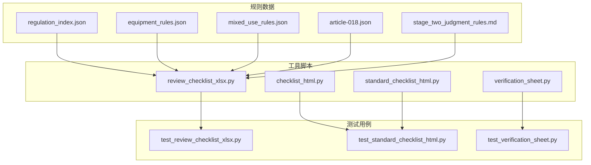
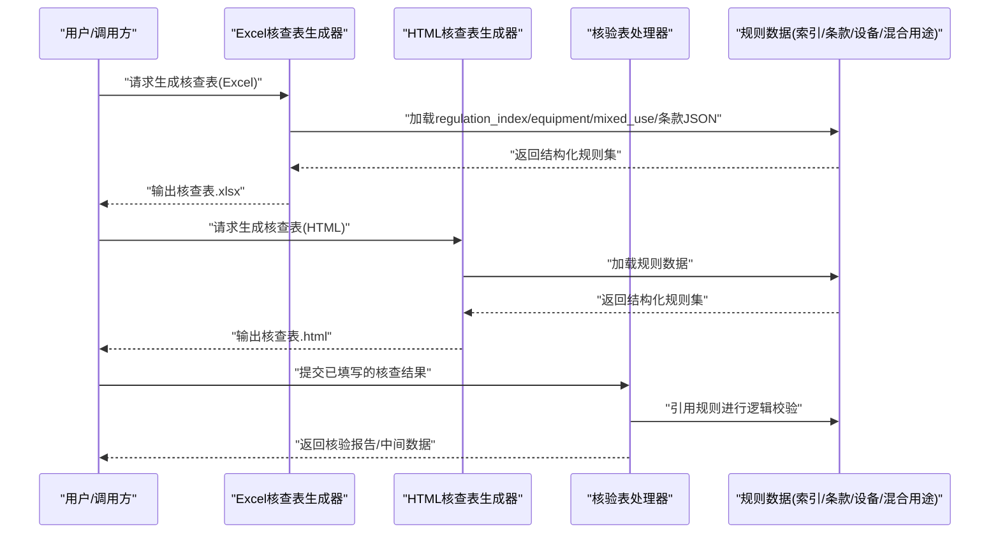
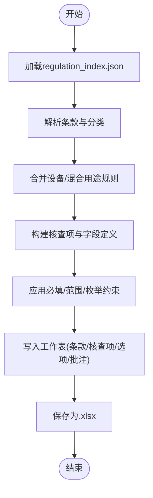
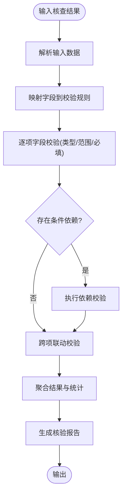
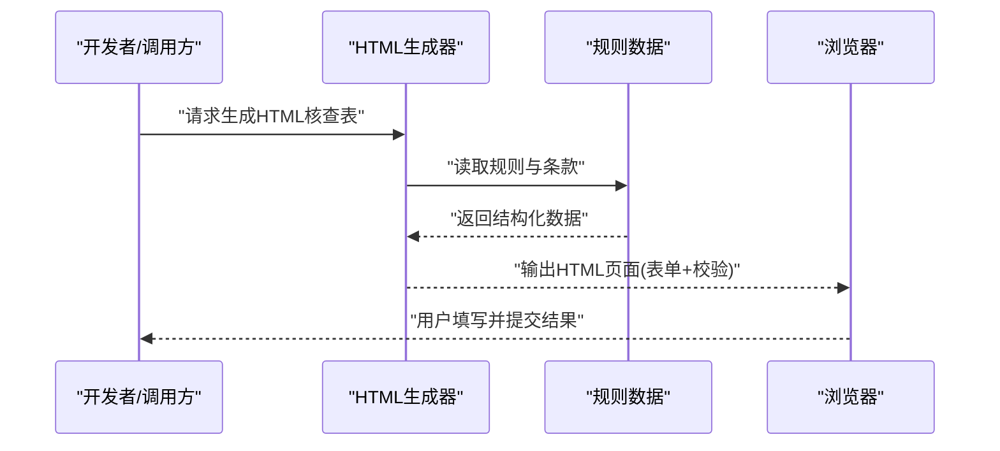
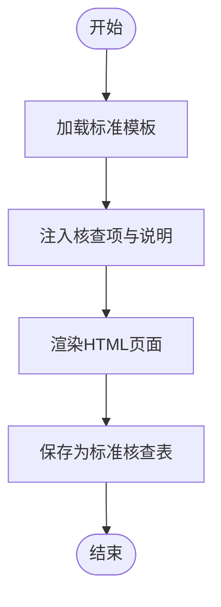
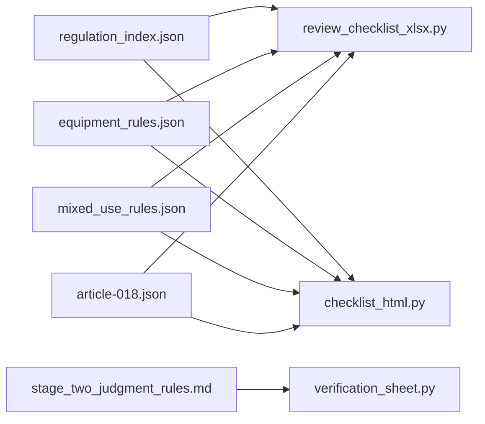

# 核查表系统

<cite>
**本文引用的文件**   
- [tools/review_checklist_xlsx.py](file://tools/review_checklist_xlsx.py)
- [tools/verification_sheet.py](file://tools/verification_sheet.py)
- [tools/checklist_html.py](file://tools/checklist_html.py)
- [tools/standard_checklist_html.py](file://tools/standard_checklist_html.py)
- [tests/test_review_checklist_xlsx.py](file://tests/test_review_checklist_xlsx.py)
- [tests/test_standard_checklist_html.py](file://tests/test_standard_checklist_html.py)
- [tests/test_verification_sheet.py](file://tests/test_verification_sheet.py)
- [rules/regulation_index.json](file://rules/regulation_index.json)
- [rules/equipment_rules.json](file://rules/equipment_rules.json)
- [rules/mixed_use_rules.json](file://rules/mixed_use_rules.json)
- [rules/article-018.json](file://rules/regulation_articles/article-018.json)
- [rules/stage_two_judgment_rules.md](file://rules/stage_two_judgment_rules.md)
</cite>

## 目录
1. [简介](#简介)
2. [项目结构](#项目结构)
3. [核心组件](#核心组件)
4. [架构总览](#架构总览)
5. [详细组件分析](#详细组件分析)
6. [依赖关系分析](#依赖关系分析)
7. [性能考量](#性能考量)
8. [故障排查指南](#故障排查指南)
9. [结论](#结论)
10. [附录](#附录)

## 简介
本技术文档面向核查表系统的开发与使用者，系统性说明核查表的生成机制、数据结构定义与验证规则；解释模板系统、字段类型支持与逻辑校验能力；提供创建自定义核查表、添加验证规则与集成外部数据源的具体示例路径；记录核查表文件格式、导入导出与批量处理能力；并阐述与审查工作流的集成方式及自动化核查流程。同时给出模板定制、规则扩展与数据处理优化的开发指南。

## 项目结构
核查表系统围绕“规则数据 + 工具脚本 + 测试用例”组织：
- 规则数据位于 rules 目录，包含法规条款索引、设备规则、混合用途规则以及各条款的 JSON 描述与判定规则说明。
- 工具脚本位于 tools 目录，负责将规则数据转换为可编辑/可分发的核查表（Excel、HTML），并提供核验与标准化输出。
- 测试用例位于 tests 目录，覆盖 Excel 核查表生成、HTML 标准核查表生成与核验表处理等关键路径。

图表来源
- [rules/regulation_index.json](file://rules/regulation_index.json)
- [rules/equipment_rules.json](file://rules/equipment_rules.json)
- [rules/mixed_use_rules.json](file://rules/mixed_use_rules.json)
- [rules/article-018.json](file://rules/regulation_articles/article-018.json)
- [rules/stage_two_judgment_rules.md](file://rules/stage_two_judgment_rules.md)
- [tools/review_checklist_xlsx.py](file://tools/review_checklist_xlsx.py)
- [tools/checklist_html.py](file://tools/checklist_html.py)
- [tools/standard_checklist_html.py](file://tools/standard_checklist_html.py)
- [tools/verification_sheet.py](file://tools/verification_sheet.py)
- [tests/test_review_checklist_xlsx.py](file://tests/test_review_checklist_xlsx.py)
- [tests/test_standard_checklist_html.py](file://tests/test_standard_checklist_html.py)
- [tests/test_verification_sheet.py](file://tests/test_verification_sheet.py)

章节来源
- [tools/review_checklist_xlsx.py](file://tools/review_checklist_xlsx.py)
- [tools/verification_sheet.py](file://tools/verification_sheet.py)
- [tools/checklist_html.py](file://tools/checklist_html.py)
- [tools/standard_checklist_html.py](file://tools/standard_checklist_html.py)
- [tests/test_review_checklist_xlsx.py](file://tests/test_review_checklist_xlsx.py)
- [tests/test_standard_checklist_html.py](file://tests/test_standard_checklist_html.py)
- [tests/test_verification_sheet.py](file://tests/test_verification_sheet.py)
- [rules/regulation_index.json](file://rules/regulation_index.json)
- [rules/equipment_rules.json](file://rules/equipment_rules.json)
- [rules/mixed_use_rules.json](file://rules/mixed_use_rules.json)
- [rules/article-018.json](file://rules/regulation_articles/article-018.json)
- [rules/stage_two_judgment_rules.md](file://rules/stage_two_judgment_rules.md)

## 核心组件
- 核查表生成器（Excel）：从规则索引与条款数据构建结构化核查项，输出为可编辑的 Excel 文件，支持字段类型、必填约束、下拉选项与批注说明。
- 核验表处理器：对已填写的核查结果进行一致性校验、逻辑判断与汇总统计，输出核验报告或中间数据供后续流程使用。
- HTML 核查表生成器：将核查项渲染为网页版核查表，便于在线填写与分发。
- 标准核查表生成器：基于标准模板生成统一格式的核查表，确保跨项目一致性与合规性。

章节来源
- [tools/review_checklist_xlsx.py](file://tools/review_checklist_xlsx.py)
- [tools/verification_sheet.py](file://tools/verification_sheet.py)
- [tools/checklist_html.py](file://tools/checklist_html.py)
- [tools/standard_checklist_html.py](file://tools/standard_checklist_html.py)

## 架构总览
核查表系统采用“数据驱动 + 多格式输出”的架构：规则数据作为单一事实源，工具脚本读取规则并生成不同格式的核查表；测试用例保障生成质量与行为稳定性。

图表来源
- [tools/review_checklist_xlsx.py](file://tools/review_checklist_xlsx.py)
- [tools/checklist_html.py](file://tools/checklist_html.py)
- [tools/standard_checklist_html.py](file://tools/standard_checklist_html.py)
- [tools/verification_sheet.py](file://tools/verification_sheet.py)
- [rules/regulation_index.json](file://rules/regulation_index.json)
- [rules/equipment_rules.json](file://rules/equipment_rules.json)
- [rules/mixed_use_rules.json](file://rules/mixed_use_rules.json)
- [rules/article-018.json](file://rules/regulation_articles/article-018.json)

## 详细组件分析

### Excel 核查表生成器
- 功能要点
  - 从 regulation_index.json 获取条款清单与分类，结合 equipment_rules.json 与 mixed_use_rules.json 生成核查项。
  - 为每个核查项定义字段类型（如文本、数值、布尔、下拉）、必填约束、默认值与帮助说明。
  - 输出 .xlsx 文件，包含多工作表（如“条款清单”、“核查项”、“选项字典”、“批注说明”）。
- 数据结构
  - 核查项对象：包含条款编号、标题、检查点、字段类型、是否必填、取值范围、关联证据要求等。
  - 选项字典：用于下拉选择与枚举校验。
  - 批注说明：辅助填写与审核人员理解检查依据。
- 生成流程
  - 加载规则索引 → 解析条款 → 构建核查项 → 应用字段类型与约束 → 写入工作表 → 保存文件。

图表来源
- [tools/review_checklist_xlsx.py](file://tools/review_checklist_xlsx.py)
- [rules/regulation_index.json](file://rules/regulation_index.json)
- [rules/equipment_rules.json](file://rules/equipment_rules.json)
- [rules/mixed_use_rules.json](file://rules/mixed_use_rules.json)

章节来源
- [tools/review_checklist_xlsx.py](file://tools/review_checklist_xlsx.py)
- [tests/test_review_checklist_xlsx.py](file://tests/test_review_checklist_xlsx.py)

### 核验表处理器
- 功能要点
  - 接收已填写的核查结果（通常为结构化数据或表格），按规则进行一致性校验与逻辑判断。
  - 支持条件依赖（某字段非空时触发其他字段校验）、跨项联动（A项通过则B项必须满足）、阈值与范围检查。
  - 输出核验报告（通过/不通过/待补充）与问题清单，便于人工复核与整改跟踪。
- 数据结构
  - 输入：核查结果集合（含字段名、值、时间戳、操作人等元信息）。
  - 规则映射：字段到校验规则的映射（类型、范围、依赖、表达式）。
  - 输出：核验结果、错误与警告列表、统计摘要。
- 处理流程
  - 加载输入 → 解析规则映射 → 逐项校验 → 聚合结果 → 生成报告。

图表来源
- [tools/verification_sheet.py](file://tools/verification_sheet.py)
- [rules/stage_two_judgment_rules.md](file://rules/stage_two_judgment_rules.md)

章节来源
- [tools/verification_sheet.py](file://tools/verification_sheet.py)
- [tests/test_verification_sheet.py](file://tests/test_verification_sheet.py)
- [rules/stage_two_judgment_rules.md](file://rules/stage_two_judgment_rules.md)

### HTML 核查表生成器
- 功能要点
  - 将核查项渲染为网页表单，支持在线填写、即时校验与导出。
  - 适配移动端与桌面端，提供清晰的导航与分组展示。
- 数据结构
  - 前端模型：字段定义、校验规则、提示信息、分组结构。
  - 后端模型：与 Excel 生成器一致的核查项与规则映射。
- 生成流程
  - 加载规则 → 构建前端模型 → 渲染页面 → 提供交互校验 → 导出结果。

图表来源
- [tools/checklist_html.py](file://tools/checklist_html.py)
- [tools/standard_checklist_html.py](file://tools/standard_checklist_html.py)
- [rules/regulation_index.json](file://rules/regulation_index.json)

章节来源
- [tools/checklist_html.py](file://tools/checklist_html.py)
- [tools/standard_checklist_html.py](file://tools/standard_checklist_html.py)
- [tests/test_standard_checklist_html.py](file://tests/test_standard_checklist_html.py)

### 标准核查表生成器
- 功能要点
  - 基于标准模板生成统一格式的核查表，确保跨项目一致性与合规性。
  - 支持模板变量替换、动态章节插入与样式控制。
- 数据结构
  - 模板：包含占位符、章节结构与样式定义。
  - 数据：与规则数据对齐的核查项与说明。
- 生成流程
  - 加载模板 → 注入数据 → 渲染页面 → 输出标准核查表。

图表来源
- [tools/standard_checklist_html.py](file://tools/standard_checklist_html.py)

章节来源
- [tools/standard_checklist_html.py](file://tools/standard_checklist_html.py)
- [tests/test_standard_checklist_html.py](file://tests/test_standard_checklist_html.py)

## 依赖关系分析
- 内部依赖
  - Excel 生成器依赖 regulation_index.json、equipment_rules.json、mixed_use_rules.json 与各条款 JSON。
  - HTML 生成器依赖相同规则数据，但侧重前端模型构建。
  - 核验表处理器依赖 stage_two_judgment_rules.md 中的判定逻辑与字段映射。
- 外部依赖
  - Excel 生成器通常依赖电子表格库（如 openpyxl 或 xlsxwriter）。
  - HTML 生成器可能依赖模板引擎（如 Jinja2）与静态资源管理。
  - 核验表处理器可能依赖表达式求值库（如 simpleeval 或自定义解析器）。

图表来源
- [rules/regulation_index.json](file://rules/regulation_index.json)
- [rules/equipment_rules.json](file://rules/equipment_rules.json)
- [rules/mixed_use_rules.json](file://rules/mixed_use_rules.json)
- [rules/article-018.json](file://rules/regulation_articles/article-018.json)
- [rules/stage_two_judgment_rules.md](file://rules/stage_two_judgment_rules.md)
- [tools/review_checklist_xlsx.py](file://tools/review_checklist_xlsx.py)
- [tools/checklist_html.py](file://tools/checklist_html.py)
- [tools/verification_sheet.py](file://tools/verification_sheet.py)

章节来源
- [rules/regulation_index.json](file://rules/regulation_index.json)
- [rules/equipment_rules.json](file://rules/equipment_rules.json)
- [rules/mixed_use_rules.json](file://rules/mixed_use_rules.json)
- [rules/article-018.json](file://rules/regulation_articles/article-018.json)
- [rules/stage_two_judgment_rules.md](file://rules/stage_two_judgment_rules.md)
- [tools/review_checklist_xlsx.py](file://tools/review_checklist_xlsx.py)
- [tools/checklist_html.py](file://tools/checklist_html.py)
- [tools/verification_sheet.py](file://tools/verification_sheet.py)

## 性能考量
- 规则数据缓存：在多次生成核查表时缓存规则索引与条款解析结果，减少 I/O 与解析开销。
- 增量生成：仅重新生成变更的章节或条款，避免全量重建。
- 并行处理：对独立条款或分组进行并行渲染与校验，提升吞吐。
- 内存优化：流式写入 Excel/HTML，避免一次性加载大量数据至内存。
- 校验优化：对复杂表达式进行预编译与缓存，减少重复计算。

[本节为通用指导，无需特定文件来源]

## 故障排查指南
- 常见问题
  - 规则数据缺失或格式错误：检查 regulation_index.json 与各条款 JSON 的结构完整性。
  - 字段类型不匹配：确认核查项字段类型与输入数据一致，必要时增加类型转换。
  - 条件依赖未生效：检查依赖规则的定义与执行顺序。
  - 导出失败：确认目标路径权限与磁盘空间，检查电子表格库版本兼容性。
- 调试建议
  - 启用详细日志，记录规则加载、字段映射与校验过程。
  - 使用最小化规则集复现问题，逐步扩大范围定位。
  - 借助测试用例验证修复效果，确保回归稳定。

章节来源
- [tests/test_review_checklist_xlsx.py](file://tests/test_review_checklist_xlsx.py)
- [tests/test_standard_checklist_html.py](file://tests/test_standard_checklist_html.py)
- [tests/test_verification_sheet.py](file://tests/test_verification_sheet.py)

## 结论
核查表系统以规则数据为核心，通过多格式生成器与核验处理器实现端到端的核查流程。其模块化设计便于扩展字段类型、校验规则与输出格式，同时通过测试用例保障稳定性与一致性。建议在项目中遵循模板化与数据驱动原则，持续优化性能与用户体验。

[本节为总结性内容，无需特定文件来源]

## 附录
- 自定义核查表创建步骤
  - 定义核查项与字段类型（文本、数值、布尔、下拉等）。
  - 配置必填约束、取值范围与默认值。
  - 编写条件依赖与跨项联动规则。
  - 使用 Excel/HTML 生成器输出核查表。
- 验证规则扩展方法
  - 在规则映射中新增字段到校验规则的绑定。
  - 实现自定义校验函数并注册到处理器。
  - 通过测试用例验证规则正确性。
- 外部数据源集成
  - 将外部数据映射到核查项字段，确保类型与格式一致。
  - 在核验阶段引入外部数据参与逻辑判断。
  - 建立数据同步与版本管理机制。
- 文件格式与批量处理
  - Excel 核查表：多工作表结构，支持批量导入/导出。
  - HTML 核查表：响应式页面，支持在线填写与导出。
  - 批量处理：按项目或批次并行生成与核验，提升效率。

[本节为操作性指导，无需特定文件来源]