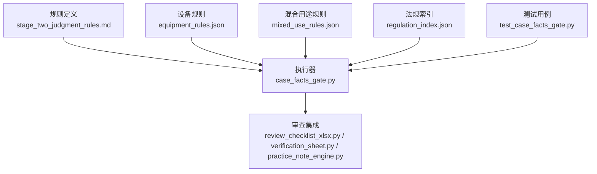
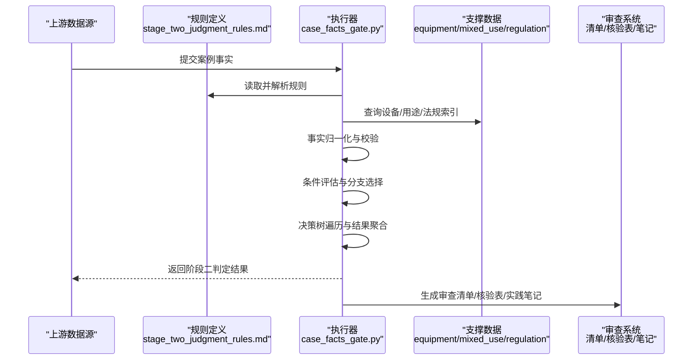
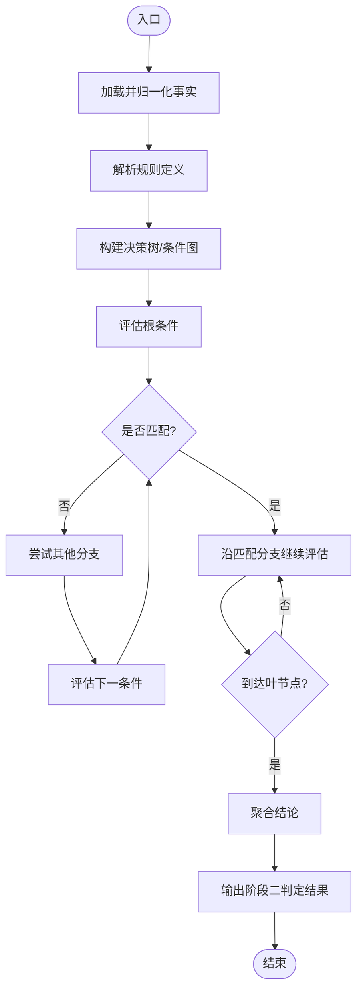
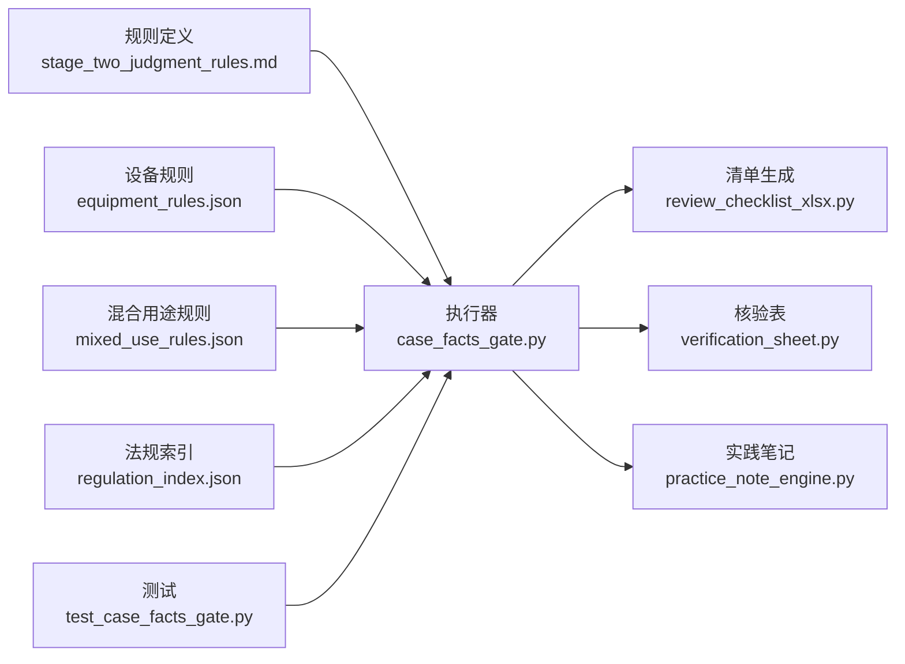

# 判断规则引擎

<cite>
**本文引用的文件**   
- [rules/stage_two_judgment_rules.md](file://rules/stage_two_judgment_rules.md)
- [tools/case_facts_gate.py](file://tools/case_facts_gate.py)
- [tests/test_case_facts_gate.py](file://tests/test_case_facts_gate.py)
- [rules/equipment_rules.json](file://rules/equipment_rules.json)
- [rules/mixed_use_rules.json](file://rules/mixed_use_rules.json)
- [rules/regulation_index.json](file://rules/regulation_index.json)
- [tools/practice_note_engine.py](file://tools/practice_note_engine.py)
- [tools/verification_sheet.py](file://tools/verification_sheet.py)
- [tools/review_checklist_xlsx.py](file://tools/review_checklist_xlsx.py)
</cite>

## 目录
1. [简介](#简介)
2. [项目结构](#项目结构)
3. [核心组件](#核心组件)
4. [架构总览](#架构总览)
5. [详细组件分析](#详细组件分析)
6. [依赖关系分析](#依赖关系分析)
7. [性能考量](#性能考量)
8. [故障排查指南](#故障排查指南)
9. [结论](#结论)
10. [附录](#附录)

## 简介
本技术文档聚焦“第二阶段判断规则”的规则引擎实现，围绕条件评估、决策树与结果判定三大主题展开。文档基于仓库中的规则定义与执行脚本，系统阐述 stage_two_judgment_rules.md 的规则结构与语义，以及 case_facts_gate.py 的执行机制与数据流。同时覆盖复杂判断场景的处理策略、异常处理方案、与审查系统的集成方式、结果输出格式，并提供编写新规则与调试执行的实践方法，以及规则测试与验证的方法论。

## 项目结构
与判断规则引擎直接相关的代码与资源分布如下：
- 规则定义层
  - rules/stage_two_judgment_rules.md：第二阶段判断规则的权威定义，包含条件、分支与判定逻辑的声明式描述。
  - rules/equipment_rules.json、rules/mixed_use_rules.json、rules/regulation_index.json：设备规则、混合用途规则与法规索引等支撑数据。
- 执行与工具层
  - tools/case_facts_gate.py：将事实数据与规则匹配，驱动条件评估与决策树遍历，产出阶段二判定结果。
  - tools/practice_note_engine.py、tools/verification_sheet.py、tools/review_checklist_xlsx.py：与审查系统集成，生成核查清单、核验表与实践笔记等产物。
- 测试层
  - tests/test_case_facts_gate.py：对 case_facts_gate.py 的行为进行断言与回归保障。

图表来源
- [rules/stage_two_judgment_rules.md](file://rules/stage_two_judgment_rules.md)
- [tools/case_facts_gate.py](file://tools/case_facts_gate.py)
- [rules/equipment_rules.json](file://rules/equipment_rules.json)
- [rules/mixed_use_rules.json](file://rules/mixed_use_rules.json)
- [rules/regulation_index.json](file://rules/regulation_index.json)
- [tools/review_checklist_xlsx.py](file://tools/review_checklist_xlsx.py)
- [tools/verification_sheet.py](file://tools/verification_sheet.py)
- [tools/practice_note_engine.py](file://tools/practice_note_engine.py)
- [tests/test_case_facts_gate.py](file://tests/test_case_facts_gate.py)

章节来源
- [rules/stage_two_judgment_rules.md](file://rules/stage_two_judgment_rules.md)
- [tools/case_facts_gate.py](file://tools/case_facts_gate.py)
- [tests/test_case_facts_gate.py](file://tests/test_case_facts_gate.py)
- [rules/equipment_rules.json](file://rules/equipment_rules.json)
- [rules/mixed_use_rules.json](file://rules/mixed_use_rules.json)
- [rules/regulation_index.json](file://rules/regulation_index.json)

## 核心组件
- 规则定义（stage_two_judgment_rules.md）
  - 以声明式形式描述第二阶段判断的条件集合、分支路径与最终判定。
  - 典型要素包括：适用前提、条件表达式、优先级、冲突消解策略、默认结论与可解释性说明。
- 执行器（case_facts_gate.py）
  - 负责加载事实数据、解析并应用规则，构建并遍历决策树，输出阶段二判定结果。
  - 关键职责：事实归一化、条件求值、分支选择、结果聚合、错误捕获与日志记录。
- 支撑数据（equipment_rules.json、mixed_use_rules.json、regulation_index.json）
  - 提供设备配置、混合用途判定依据与法规条款索引，供规则求值时查询与引用。
- 审查集成（review_checklist_xlsx.py、verification_sheet.py、practice_note_engine.py）
  - 将判定结果转化为审查工作流所需的清单、核验表与实践笔记，便于人工复核与归档。
- 测试（test_case_facts_gate.py）
  - 针对边界条件、异常输入与典型场景进行断言，确保规则执行稳定可靠。

章节来源
- [rules/stage_two_judgment_rules.md](file://rules/stage_two_judgment_rules.md)
- [tools/case_facts_gate.py](file://tools/case_facts_gate.py)
- [rules/equipment_rules.json](file://rules/equipment_rules.json)
- [rules/mixed_use_rules.json](file://rules/mixed_use_rules.json)
- [rules/regulation_index.json](file://rules/regulation_index.json)
- [tools/review_checklist_xlsx.py](file://tools/review_checklist_xlsx.py)
- [tools/verification_sheet.py](file://tools/verification_sheet.py)
- [tools/practice_note_engine.py](file://tools/practice_note_engine.py)
- [tests/test_case_facts_gate.py](file://tests/test_case_facts_gate.py)

## 架构总览
第二阶段判断规则引擎的整体流程如下：
- 输入：案例事实（来自上游抽取或表单），规则定义（Markdown），支撑数据（JSON）。
- 处理：事实归一化 → 规则解析 → 条件评估 → 决策树遍历 → 结果聚合。
- 输出：阶段二判定结果（通过/不通过/需补充材料/待定等），并联动审查系统生成清单与核验表。

图表来源
- [rules/stage_two_judgment_rules.md](file://rules/stage_two_judgment_rules.md)
- [tools/case_facts_gate.py](file://tools/case_facts_gate.py)
- [rules/equipment_rules.json](file://rules/equipment_rules.json)
- [rules/mixed_use_rules.json](file://rules/mixed_use_rules.json)
- [rules/regulation_index.json](file://rules/regulation_index.json)
- [tools/review_checklist_xlsx.py](file://tools/review_checklist_xlsx.py)
- [tools/verification_sheet.py](file://tools/verification_sheet.py)
- [tools/practice_note_engine.py](file://tools/practice_note_engine.py)

## 详细组件分析

### 规则定义：stage_two_judgment_rules.md
- 规则结构建议
  - 适用前提：明确该规则适用的场所类型、面积区间、设备配置等前置条件。
  - 条件表达式：使用可读性强的自然语言或结构化表达式描述条件，支持布尔组合、范围比较、集合包含等。
  - 分支路径：按优先级组织条件分支，避免歧义；必要时引入“兜底”默认分支。
  - 冲突消解：当多条规则冲突时，指定优先级或仲裁策略（如更严格者优先、最新条款优先等）。
  - 结论与解释：每条分支给出明确的判定结论及理由，便于审计与回溯。
- 编写新规则的建议
  - 保持原子性与可组合性：将复杂条件拆分为子条件，复用已有条件块。
  - 显式标注适用范围与例外：减少误用与歧义。
  - 提供示例用例：在规则文档中附带典型输入与预期输出，辅助测试。
- 与支撑数据的关联
  - 通过法规索引定位具体条款，结合设备规则与混合用途规则进行交叉验证。

章节来源
- [rules/stage_two_judgment_rules.md](file://rules/stage_two_judgment_rules.md)
- [rules/equipment_rules.json](file://rules/equipment_rules.json)
- [rules/mixed_use_rules.json](file://rules/mixed_use_rules.json)
- [rules/regulation_index.json](file://rules/regulation_index.json)

### 执行器：case_facts_gate.py
- 主要职责
  - 事实加载与归一化：统一字段命名、类型转换、缺失值处理。
  - 规则解析与缓存：解析 Markdown 规则为内部表示，建立条件到分支的映射。
  - 条件评估引擎：支持布尔运算、数值比较、集合操作、函数调用等。
  - 决策树遍历：从根节点开始，逐层评估条件，选择匹配分支直至叶节点。
  - 结果聚合与输出：汇总各分支结论，生成标准化结果对象。
  - 异常处理与日志：捕获解析错误、运行时异常，记录上下文以便调试。
- 执行流程图（算法视角）

图表来源
- [tools/case_facts_gate.py](file://tools/case_facts_gate.py)
- [rules/stage_two_judgment_rules.md](file://rules/stage_two_judgment_rules.md)

- 复杂判断场景处理
  - 多条件组合：使用布尔表达式与优先级控制，避免短路导致的遗漏。
  - 动态阈值：根据场所规模、设备数量等动态计算阈值，再参与条件评估。
  - 冲突与优先级：当多条规则同时满足时，依据预定义优先级选择最终结论。
  - 缺省与回退：当关键事实缺失时，采用保守策略（如“需补充材料”）并记录原因。
- 异常处理策略
  - 解析异常：规则语法错误或缺失关键字段时，抛出明确错误并中止执行。
  - 运行时异常：除零、越界、类型不匹配等，捕获后记录堆栈与上下文。
  - 数据异常：事实缺失或格式不符，触发校验失败并返回可修复的错误码。
- 与审查系统集成
  - 将判定结果转换为清单条目、核验项与实践笔记，便于人工复核与归档。
  - 输出格式应包含：规则ID、条件摘要、匹配分支、结论、证据链与时间戳。

章节来源
- [tools/case_facts_gate.py](file://tools/case_facts_gate.py)
- [tests/test_case_facts_gate.py](file://tests/test_case_facts_gate.py)

### 支撑数据：equipment_rules.json、mixed_use_rules.json、regulation_index.json
- equipment_rules.json
  - 定义设备类别、配置要求、容量阈值与适用场景，供规则评估时查询。
- mixed_use_rules.json
  - 规定混合用途判定逻辑，如功能分区比例、安全隔离要求等。
- regulation_index.json
  - 提供法规条款索引与引用关系，便于规则溯源与合规性检查。

章节来源
- [rules/equipment_rules.json](file://rules/equipment_rules.json)
- [rules/mixed_use_rules.json](file://rules/mixed_use_rules.json)
- [rules/regulation_index.json](file://rules/regulation_index.json)

### 审查集成：review_checklist_xlsx.py、verification_sheet.py、practice_note_engine.py
- review_checklist_xlsx.py
  - 将阶段二判定结果导出为 Excel 清单，包含条目编号、规则引用、结论与建议。
- verification_sheet.py
  - 生成核验表，用于逐项核对事实与规则匹配情况，支持签名与版本管理。
- practice_note_engine.py
  - 生成实践笔记，记录规则执行过程中的关键决策、例外与备注。

章节来源
- [tools/review_checklist_xlsx.py](file://tools/review_checklist_xlsx.py)
- [tools/verification_sheet.py](file://tools/verification_sheet.py)
- [tools/practice_note_engine.py](file://tools/practice_note_engine.py)

### 测试与验证：test_case_facts_gate.py
- 测试目标
  - 验证事实归一化的正确性、规则解析的稳定性、条件评估的准确性与决策树遍历的完备性。
- 测试策略
  - 正向用例：覆盖典型场景与边界条件。
  - 反向用例：注入非法事实、缺失字段、冲突规则，验证异常处理。
  - 回归用例：确保规则更新后既有行为不变。
- 断言要点
  - 输出结构一致性、结论正确性、错误码与消息的可读性、日志完整性。

章节来源
- [tests/test_case_facts_gate.py](file://tests/test_case_facts_gate.py)

## 依赖关系分析
- 模块耦合
  - case_facts_gate.py 强依赖 stage_two_judgment_rules.md 的结构约定与字段语义。
  - 支撑数据 JSON 作为只读配置，被执行器在求值阶段按需查询。
  - 审查集成模块仅消费执行器的输出，低耦合、高内聚。
- 外部依赖
  - 文件系统访问（读取规则与数据）、Excel/PDF 生成库（视具体实现而定）。
- 潜在循环依赖
  - 当前设计无循环导入；规则与执行器分离，数据与执行解耦。

图表来源
- [rules/stage_two_judgment_rules.md](file://rules/stage_two_judgment_rules.md)
- [tools/case_facts_gate.py](file://tools/case_facts_gate.py)
- [rules/equipment_rules.json](file://rules/equipment_rules.json)
- [rules/mixed_use_rules.json](file://rules/mixed_use_rules.json)
- [rules/regulation_index.json](file://rules/regulation_index.json)
- [tools/review_checklist_xlsx.py](file://tools/review_checklist_xlsx.py)
- [tools/verification_sheet.py](file://tools/verification_sheet.py)
- [tools/practice_note_engine.py](file://tools/practice_note_engine.py)
- [tests/test_case_facts_gate.py](file://tests/test_case_facts_gate.py)

章节来源
- [tools/case_facts_gate.py](file://tools/case_facts_gate.py)
- [rules/stage_two_judgment_rules.md](file://rules/stage_two_judgment_rules.md)
- [rules/equipment_rules.json](file://rules/equipment_rules.json)
- [rules/mixed_use_rules.json](file://rules/mixed_use_rules.json)
- [rules/regulation_index.json](file://rules/regulation_index.json)
- [tools/review_checklist_xlsx.py](file://tools/review_checklist_xlsx.py)
- [tools/verification_sheet.py](file://tools/verification_sheet.py)
- [tools/practice_note_engine.py](file://tools/practice_note_engine.py)
- [tests/test_case_facts_gate.py](file://tests/test_case_facts_gate.py)

## 性能考量
- 规则解析缓存：首次解析规则后缓存抽象语法树，避免重复开销。
- 条件评估优化：短路求值、索引加速（如对常用字段建立倒排索引）。
- 决策树剪枝：提前终止不可能分支，减少不必要的评估。
- I/O 批处理：批量读取与写入，降低文件操作次数。
- 内存占用：大规则集分片加载，按需加载支撑数据。

[本节为通用指导，无需特定文件来源]

## 故障排查指南
- 常见问题
  - 规则解析失败：检查 Markdown 结构是否符合约定，关键字段是否存在。
  - 事实缺失或类型错误：确认上游数据清洗与归一化逻辑。
  - 条件评估异常：检查数值范围、集合操作与函数调用是否正确。
  - 决策树死循环：确认分支收敛与终止条件。
- 诊断步骤
  - 启用详细日志，记录每一步的条件评估与分支选择。
  - 使用最小复现用例，逐步缩小问题范围。
  - 对比期望输出与实际输出，定位差异点。
- 恢复策略
  - 对异常输入进行回退与告警，必要时退回人工复核。
  - 更新规则或数据后，运行回归测试确保稳定性。

章节来源
- [tools/case_facts_gate.py](file://tools/case_facts_gate.py)
- [tests/test_case_facts_gate.py](file://tests/test_case_facts_gate.py)

## 结论
第二阶段判断规则引擎通过声明式规则定义与稳健的执行器实现，实现了条件评估、决策树遍历与结果判定的闭环。借助支撑数据与审查集成，形成从规则到产物的完整链路。通过完善的测试与异常处理策略，确保系统在复杂场景下的可靠性与可维护性。建议在后续迭代中持续优化规则表达力、执行效率与可观测性。

[本节为总结性内容，无需特定文件来源]

## 附录
- 编写新判断规则的步骤
  - 在 stage_two_judgment_rules.md 中新增规则条目，明确适用前提、条件表达式、分支与结论。
  - 如需扩展支撑数据，更新 equipment_rules.json、mixed_use_rules.json 或 regulation_index.json。
  - 在 test_case_facts_gate.py 中添加正向与反向用例，覆盖边界与异常。
  - 运行测试并验证输出格式与结论正确性。
- 调试规则执行
  - 在执行器中开启调试模式，打印条件评估过程与决策树路径。
  - 使用最小数据集复现问题，逐步定位异常点。
  - 结合日志与断点，确认规则解析与求值逻辑。
- 结果输出格式建议
  - 包含规则ID、条件摘要、匹配分支、结论、证据链、时间戳与执行元数据。
  - 与审查系统对接时，遵循统一的 schema，便于下游消费。

[本节为方法论与实践指导，无需特定文件来源]