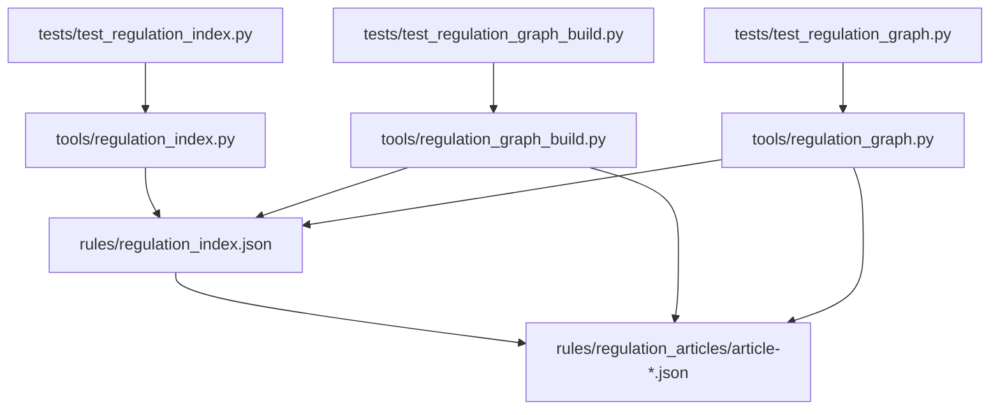
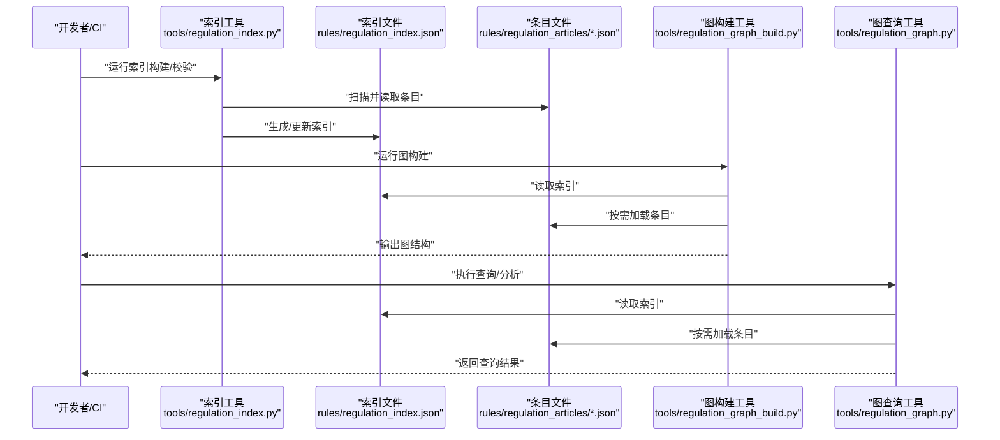
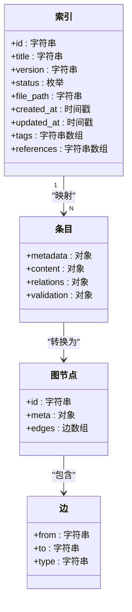
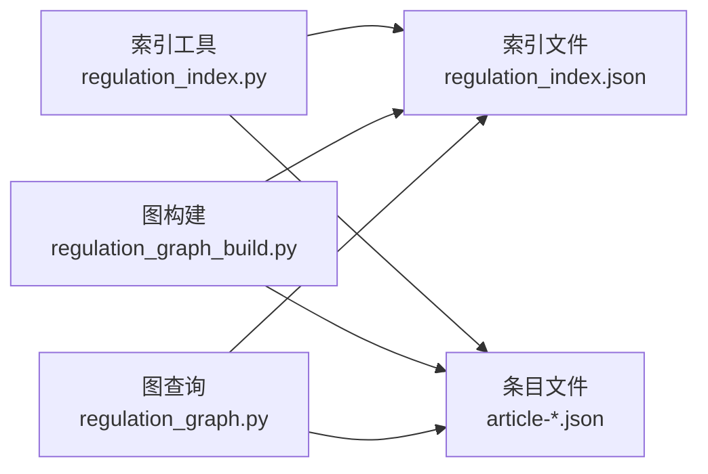

# 法规数据模型

<cite>
**本文引用的文件**   
- [regulation_index.json](file://rules/regulation_index.json)
- [article-001.json](file://rules/regulation_articles/article-001.json)
- [article-002.json](file://rules/regulation_articles/article-002.json)
- [article-003.json](file://rules/regulation_articles/article-003.json)
- [regulation_index.py](file://tools/regulation_index.py)
- [test_regulation_index.py](file://tests/test_regulation_index.py)
- [regulation_graph_build.py](file://tools/regulation_graph_build.py)
- [test_regulation_graph_build.py](file://tests/test_regulation_graph_build.py)
- [regulation_graph.py](file://tools/regulation_graph.py)
- [test_regulation_graph.py](file://tests/test_regulation_graph.py)
</cite>

## 目录
1. [简介](#简介)
2. [项目结构](#项目结构)
3. [核心组件](#核心组件)
4. [架构总览](#架构总览)
5. [详细组件分析](#详细组件分析)
6. [依赖关系分析](#依赖关系分析)
7. [性能考量](#性能考量)
8. [故障排查指南](#故障排查指南)
9. [结论](#结论)
10. [附录](#附录)

## 简介
本技术文档围绕“法规数据模型”展开，重点说明：
- 法规条目的数据结构设计（JSON 格式规范、字段定义与数据验证规则）
- regulation_index.json 的索引机制
- article-XXX.json 的文件组织方式
- 元数据、内容结构与关联关系
- 解析与验证的实现要点（以代码示例路径指引为主）
- 数据版本管理与迁移策略
- 数据完整性检查与错误处理最佳实践

## 项目结构
与法规数据模型直接相关的目录与文件如下：
- rules/regulation_index.json：全局索引文件，维护条目清单与关键元信息
- rules/regulation_articles/article-*.json：各法规条目的独立 JSON 文件
- tools/regulation_index.py：索引构建/校验工具
- tests/test_regulation_index.py：索引相关测试
- tools/regulation_graph_build.py：基于索引与条目构建图结构的工具
- tests/test_regulation_graph_build.py：图构建相关测试
- tools/regulation_graph.py：图查询与遍历工具
- tests/test_regulation_graph.py：图查询相关测试

图表来源
- [regulation_index.json](file://rules/regulation_index.json)
- [regulation_index.py](file://tools/regulation_index.py)
- [test_regulation_index.py](file://tests/test_regulation_index.py)
- [regulation_graph_build.py](file://tools/regulation_graph_build.py)
- [test_regulation_graph_build.py](file://tests/test_regulation_graph_build.py)
- [regulation_graph.py](file://tools/regulation_graph.py)
- [test_regulation_graph.py](file://tests/test_regulation_graph.py)

章节来源
- [regulation_index.json](file://rules/regulation_index.json)
- [regulation_index.py](file://tools/regulation_index.py)
- [test_regulation_index.py](file://tests/test_regulation_index.py)
- [regulation_graph_build.py](file://tools/regulation_graph_build.py)
- [test_regulation_graph_build.py](file://tests/test_regulation_graph_build.py)
- [regulation_graph.py](file://tools/regulation_graph.py)
- [test_regulation_graph.py](file://tests/test_regulation_graph.py)

## 核心组件
- 索引文件（regulation_index.json）
  - 作用：集中管理所有法规条目的标识、路径、状态与关键元数据，供上层工具快速检索与一致性校验。
  - 典型字段（概念性说明）：条目ID、标题、版本、状态、文件路径、创建/更新时间等。
  - 约束：条目ID唯一；文件路径必须存在且可读取；状态值需为预定义枚举之一。

- 条目文件（article-*.json）
  - 作用：描述单条法规的结构化内容，包括元数据、正文段落、条款项、引用关系等。
  - 典型字段（概念性说明）：条目ID、标题、版本、生效日期、正文、子条款、交叉引用、标签等。
  - 约束：ID与索引一致；正文结构符合模式；引用目标存在或标记为待确认。

- 索引工具（tools/regulation_index.py）
  - 作用：扫描 article-*.json 生成/更新索引，执行基础校验（存在性、重复ID、必填字段）。
  - 输出：regulation_index.json 及校验报告。

- 图构建与查询（tools/regulation_graph_build.py / tools/regulation_graph.py）
  - 作用：将索引与条目解析为有向图（节点=条目，边=引用关系），支持查询、连通性分析与可视化。
  - 输出：图结构（内存对象或序列化文件）、查询结果。

章节来源
- [regulation_index.json](file://rules/regulation_index.json)
- [regulation_index.py](file://tools/regulation_index.py)
- [regulation_graph_build.py](file://tools/regulation_graph_build.py)
- [regulation_graph.py](file://tools/regulation_graph.py)

## 架构总览
下图展示从索引到条目再到图结构的整体数据流与处理链路。

图表来源
- [regulation_index.py](file://tools/regulation_index.py)
- [regulation_index.json](file://rules/regulation_index.json)
- [regulation_graph_build.py](file://tools/regulation_graph_build.py)
- [regulation_graph.py](file://tools/regulation_graph.py)

## 详细组件分析

### 索引文件（regulation_index.json）
- 设计目标
  - 提供统一的条目清单与元数据视图，便于快速定位、统计与一致性检查。
  - 作为图构建与查询的入口，减少全量扫描成本。
- 关键字段（概念性说明）
  - id：条目唯一标识（字符串）
  - title：标题（字符串）
  - version：版本号（字符串，语义化版本建议）
  - status：状态（枚举：草稿/已发布/已废弃等）
  - file_path：相对路径（指向 article-*.json）
  - created_at/updated_at：时间戳（ISO 8601）
  - tags：标签列表（字符串数组）
  - references：引用目标列表（字符串数组，可能为空）
- 数据验证规则
  - id 唯一且非空
  - file_path 指向存在的文件
  - status 取值在允许集合内
  - references 中元素若为 id，则应在索引中存在（可选严格模式）
- 变更流程
  - 新增/修改条目后，重新运行索引工具以同步索引
  - CI 中集成校验步骤，确保索引与条目一致

章节来源
- [regulation_index.json](file://rules/regulation_index.json)
- [regulation_index.py](file://tools/regulation_index.py)
- [test_regulation_index.py](file://tests/test_regulation_index.py)

### 条目文件（article-*.json）
- 命名约定
  - 文件名格式：article-<编号>.json，编号可为纯数字或带后缀（如 146-1、97-2）
  - 编号应与文件内 id 字段保持一致
- 数据结构（概念性说明）
  - metadata：元数据（id、title、version、status、dates、tags 等）
  - content：正文结构（段落、条款项、表格、图示引用等）
  - relations：关联关系（references、see_also、depends_on 等）
  - validation：校验提示（schema 版本、自定义规则键）
- 字段定义与约束
  - id：必须与文件名中的编号一致
  - title：非空字符串
  - version：语义化版本（主版本用于破坏性变更）
  - status：枚举值（草稿/已发布/已废弃）
  - content：结构化文本（段落数组、条款项数组）
  - relations.references：引用目标 id 列表，建议通过索引校验
- 数据验证规则
  - 必填字段存在且类型正确
  - 子结构（content、relations）遵循内部 schema
  - 引用目标存在性（可选严格模式）
- 示例路径（不展示具体 JSON 内容）
  - [article-001.json](file://rules/regulation_articles/article-001.json)
  - [article-002.json](file://rules/regulation_articles/article-002.json)
  - [article-003.json](file://rules/regulation_articles/article-003.json)

章节来源
- [article-001.json](file://rules/regulation_articles/article-001.json)
- [article-002.json](file://rules/regulation_articles/article-002.json)
- [article-003.json](file://rules/regulation_articles/article-003.json)

### 索引工具（tools/regulation_index.py）
- 功能概述
  - 扫描 rules/regulation_articles 目录，读取每个 article-*.json
  - 生成/更新 rules/regulation_index.json
  - 执行基础校验：重复 id、缺失必填字段、文件不存在等
- 关键流程
  - 初始化：配置路径、清理旧索引
  - 扫描：按文件名提取 id，读取 JSON 并校验
  - 聚合：合并为索引结构，排序与去重
  - 写入：持久化索引文件
  - 报告：输出校验结果与警告
- 错误处理
  - 捕获 JSON 解析异常、IO 异常
  - 记录不可恢复错误并跳过问题文件
  - 提供退出码区分成功/部分失败/完全失败

章节来源
- [regulation_index.py](file://tools/regulation_index.py)
- [test_regulation_index.py](file://tests/test_regulation_index.py)

### 图构建与查询（tools/regulation_graph_build.py / tools/regulation_graph.py）
- 图构建（regulation_graph_build.py）
  - 输入：regulation_index.json + article-*.json
  - 过程：解析索引与条目，建立节点与边（基于 relations.references）
  - 输出：图对象（节点属性含元数据，边含关系类型）
  - 校验：检测孤立节点、循环引用（可选）、断链引用
- 图查询（regulation_graph.py）
  - 能力：按 id 查找、按标签过滤、路径查询、连通性分析
  - 接口：提供函数式 API，返回结构化结果
- 使用场景
  - 影响分析：某条目变更影响的下游条目
  - 合规检查：引用链是否完整
  - 可视化：导出图结构供前端渲染

章节来源
- [regulation_graph_build.py](file://tools/regulation_graph_build.py)
- [test_regulation_graph_build.py](file://tests/test_regulation_graph_build.py)
- [regulation_graph.py](file://tools/regulation_graph.py)
- [test_regulation_graph.py](file://tests/test_regulation_graph.py)

### 数据模型类图（概念映射）
下图展示索引与条目之间的概念关系（不绑定具体实现细节）。

图表来源
- [regulation_index.json](file://rules/regulation_index.json)
- [article-001.json](file://rules/regulation_articles/article-001.json)
- [regulation_graph_build.py](file://tools/regulation_graph_build.py)

## 依赖关系分析
- 模块耦合
  - 索引工具依赖条目文件的读取与解析
  - 图构建依赖索引与条目，形成强依赖
  - 图查询依赖图构建的输出或持久化的图结构
- 外部依赖
  - JSON 解析库（标准库即可）
  - 文件系统访问（路径规范化、权限检查）
- 潜在循环依赖
  - 索引与条目之间无代码级循环，但数据层面可能存在引用环（需在图构建阶段检测）

图表来源
- [regulation_index.py](file://tools/regulation_index.py)
- [regulation_index.json](file://rules/regulation_index.json)
- [regulation_graph_build.py](file://tools/regulation_graph_build.py)
- [regulation_graph.py](file://tools/regulation_graph.py)

章节来源
- [regulation_index.py](file://tools/regulation_index.py)
- [regulation_graph_build.py](file://tools/regulation_graph_build.py)
- [regulation_graph.py](file://tools/regulation_graph.py)

## 性能考量
- 索引构建
  - 批量读取条目文件，避免频繁 IO
  - 增量更新：仅处理变更条目（可通过哈希或时间戳判断）
- 图构建
  - 懒加载：按需读取条目，减少内存占用
  - 缓存：对解析后的条目进行内存缓存
- 查询优化
  - 预建反向索引（按标签、状态等）
  - 路径查询使用 BFS/DFS 剪枝

[本节为通用指导，无需特定文件来源]

## 故障排查指南
- 常见问题
  - 索引与条目不一致：重新运行索引工具并比对差异
  - 条目 JSON 解析失败：检查语法与必填字段
  - 引用断链：在图构建阶段启用断链检测
  - 循环引用：在图构建阶段启用环检测并输出告警
- 诊断步骤
  - 运行索引校验，查看报告
  - 运行图构建，检查日志与输出
  - 使用图查询定位问题节点与边
- 错误处理最佳实践
  - 明确区分可恢复与不可恢复错误
  - 记录上下文（文件路径、行号、字段名）
  - 提供修复建议（如“请补充必填字段”）

章节来源
- [test_regulation_index.py](file://tests/test_regulation_index.py)
- [test_regulation_graph_build.py](file://tests/test_regulation_graph_build.py)
- [test_regulation_graph.py](file://tests/test_regulation_graph.py)

## 结论
本模型通过“索引+条目”的双层结构，实现了法规数据的可维护性与可扩展性。索引提供统一视图与快速检索，条目承载详细内容与关联关系。配合图构建与查询工具，可实现影响分析、合规检查与可视化。建议在 CI 中集成索引与图构建校验，确保数据质量与一致性。

[本节为总结性内容，无需特定文件来源]

## 附录

### JSON 字段定义与验证规则（概念性）
- 索引文件字段
  - id：唯一标识，非空，字母数字与连字符
  - title：非空字符串
  - version：语义化版本（主.次.修订）
  - status：枚举（草稿/已发布/已废弃）
  - file_path：相对路径，存在且可读
  - created_at/updated_at：ISO 8601 时间戳
  - tags：字符串数组
  - references：字符串数组（可选严格校验）
- 条目文件字段
  - metadata：包含 id、title、version、status、dates、tags
  - content：段落数组、条款项数组、表格/图示引用
  - relations：references、see_also、depends_on
  - validation：schema_version、custom_rules
- 验证规则
  - 必填字段存在且类型正确
  - 枚举值合法
  - 路径存在性校验
  - 引用存在性校验（可选严格模式）

[本节为概念性说明，无需特定文件来源]

### 数据版本管理与迁移策略
- 版本策略
  - 采用语义化版本控制，主版本变更表示破坏性更新
  - 每个条目与索引均携带版本字段
- 迁移策略
  - 向后兼容：新字段默认值，旧字段保留一段时间
  - 迁移脚本：批量转换旧结构为新结构
  - 回滚方案：保留历史版本与快照
- 发布流程
  - 预发布：在 staging 目录验证
  - 发布：更新索引与条目，运行全量校验
  - 归档：保留变更记录与迁移日志

[本节为概念性说明，无需特定文件来源]

### 数据完整性检查与错误处理最佳实践
- 完整性检查
  - 索引与条目一致性（ID、路径、状态）
  - 引用完整性（目标存在性）
  - 结构完整性（必填字段、类型、枚举）
- 错误处理
  - 分类错误（解析、IO、业务规则）
  - 记录详细上下文
  - 提供修复建议与自动化修复（可选）
- 监控与告警
  - CI 中集成校验任务
  - 定期运行完整性检查
  - 异常时通知相关人员

[本节为概念性说明，无需特定文件来源]