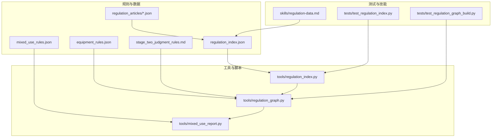
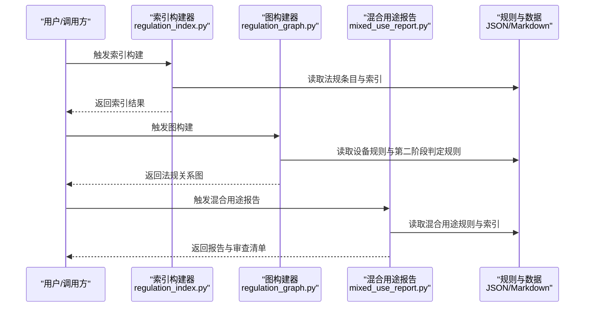
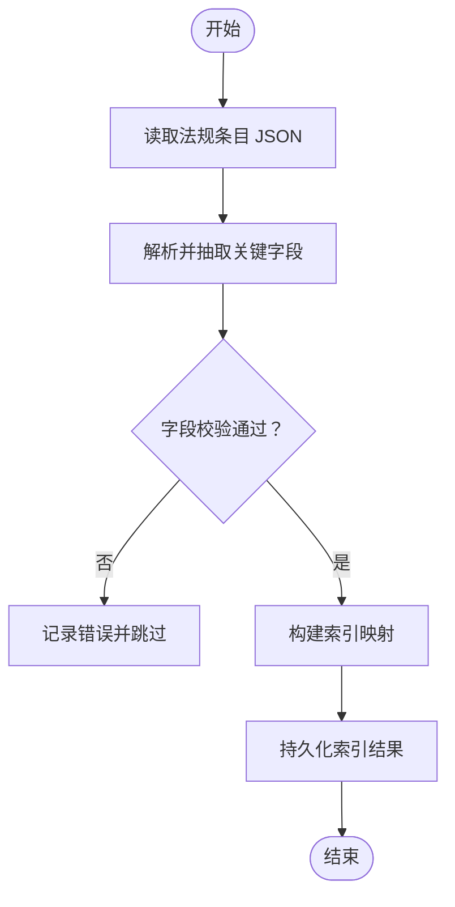
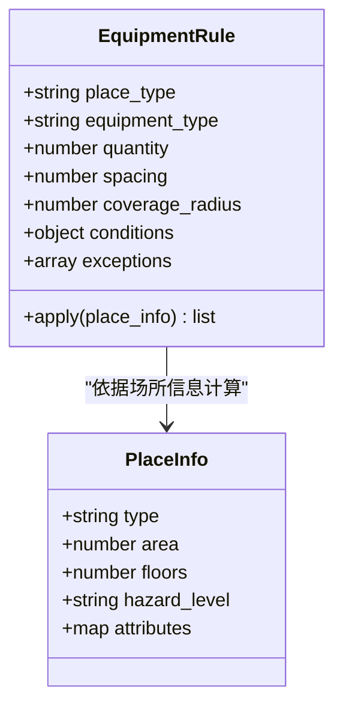
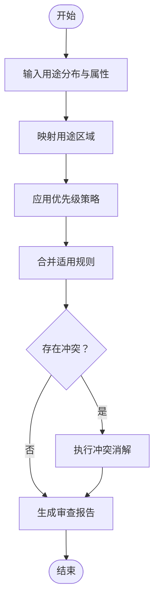
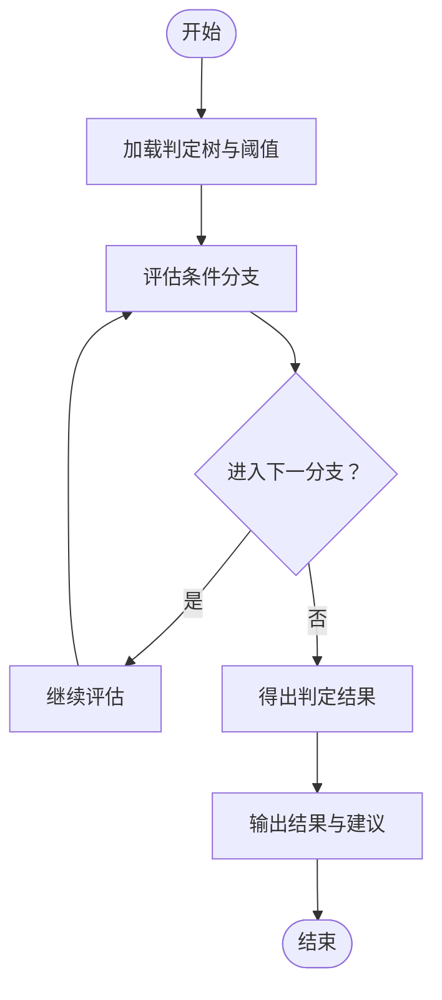
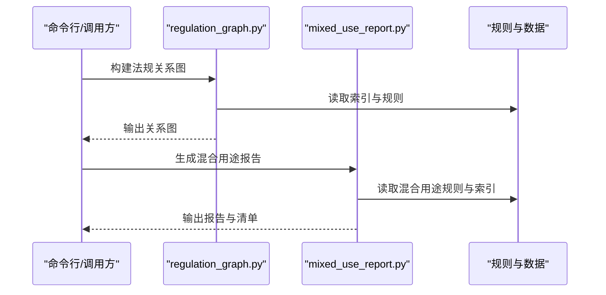
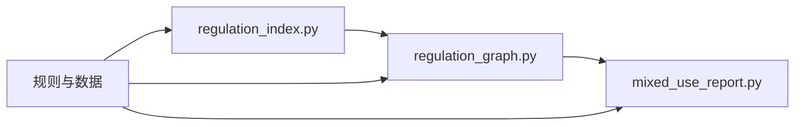

# 法规管理系统

<cite>
**本文档引用的文件**   
- [rules/README.md](file://rules/README.md)
- [rules/regulation_index.json](file://rules/regulation_index.json)
- [rules/equipment_rules.json](file://rules/equipment_rules.json)
- [rules/mixed_use_rules.json](file://rules/mixed_use_rules.json)
- [rules/stage_two_judgment_rules.md](file://rules/stage_two_judgment_rules.md)
- [tools/regulation_graph.py](file://tools/regulation_graph.py)
- [tools/regulation_index.py](file://tools/regulation_index.py)
- [tools/mixed_use_report.py](file://tools/mixed_use_report.py)
- [tests/test_regulation_index.py](file://tests/test_regulation_index.py)
- [tests/test_regulation_graph_build.py](file://tests/test_regulation_graph_build.py)
- [skills/regulation-data.md](file://skills/regulation-data.md)
</cite>

## 目录
1. [简介](#简介)
2. [项目结构](#项目结构)
3. [核心组件](#核心组件)
4. [架构总览](#架构总览)
5. [详细组件分析](#详细组件分析)
6. [依赖关系分析](#依赖关系分析)
7. [性能考量](#性能考量)
8. [故障排查指南](#故障排查指南)
9. [结论](#结论)
10. [附录](#附录)

## 简介
本技术文档面向“法规管理系统”，聚焦于法规数据的组织结构、存储格式与查询机制，并深入说明“各类场所消防安全设备设置标准”的实现方式，包括：
- 设备规则（equipment rules）
- 混合用途规则（mixed-use rules）
- 第二阶段判断规则（stage-two judgment rules）

文档同时提供数据模型、验证规则与业务逻辑的说明，解释与其他组件的集成方式和数据流，并给出性能优化建议与最佳实践。读者无需深厚的技术背景即可理解系统设计与使用方法。

## 项目结构
本项目采用“规则即数据”的设计思路，将法规条文、设备规则、混合用途规则等以结构化数据形式管理，并通过工具链进行索引构建、图构建与报告生成。关键目录与职责如下：
- rules：存放法规条目、设备规则、混合用途规则、索引与判定规则说明
- tools：实现索引构建、图构建、报告生成等工具脚本
- tests：覆盖索引、图构建、报告生成等关键路径的测试
- skills：规范与操作指引，如法规数据建模与审查流程

图表来源
- [rules/regulation_index.json](file://rules/regulation_index.json)
- [rules/equipment_rules.json](file://rules/equipment_rules.json)
- [rules/mixed_use_rules.json](file://rules/mixed_use_rules.json)
- [rules/stage_two_judgment_rules.md](file://rules/stage_two_judgment_rules.md)
- [tools/regulation_index.py](file://tools/regulation_index.py)
- [tools/regulation_graph.py](file://tools/regulation_graph.py)
- [tools/mixed_use_report.py](file://tools/mixed_use_report.py)
- [tests/test_regulation_index.py](file://tests/test_regulation_index.py)
- [tests/test_regulation_graph_build.py](file://tests/test_regulation_graph_build.py)
- [skills/regulation-data.md](file://skills/regulation-data.md)

章节来源
- [rules/README.md](file://rules/README.md)
- [rules/regulation_index.json](file://rules/regulation_index.json)
- [rules/equipment_rules.json](file://rules/equipment_rules.json)
- [rules/mixed_use_rules.json](file://rules/mixed_use_rules.json)
- [rules/stage_two_judgment_rules.md](file://rules/stage_two_judgment_rules.md)
- [tools/regulation_index.py](file://tools/regulation_index.py)
- [tools/regulation_graph.py](file://tools/regulation_graph.py)
- [tools/mixed_use_report.py](file://tools/mixed_use_report.py)
- [tests/test_regulation_index.py](file://tests/test_regulation_index.py)
- [tests/test_regulation_graph_build.py](file://tests/test_regulation_graph_build.py)
- [skills/regulation-data.md](file://skills/regulation-data.md)

## 核心组件
- 法规索引（Regulation Index）
  - 作用：聚合各法规条目的元数据，提供按条款编号、主题、适用场所类型等的快速检索能力
  - 数据来源：regulation_articles/*.json 与 rules/regulation_index.json
  - 关键能力：索引构建、校验一致性、增量更新

- 设备规则（Equipment Rules）
  - 作用：定义不同场所类型的消防设备配置要求（如数量、间距、覆盖范围等）
  - 数据结构：按场所类别组织，包含设备类型、阈值、条件表达式、例外条款等
  - 使用场景：自动计算应配设备清单、比对实际配置、输出差异报告

- 混合用途规则（Mixed-Use Rules）
  - 作用：处理同一建筑内多种用途并存时的规则优先级、叠加与冲突消解
  - 数据结构：用途映射、权重或优先级、合并策略、特殊豁免
  - 使用场景：生成混合用途审查报告、判定适用条款集合

- 第二阶段判断规则（Stage Two Judgment Rules）
  - 作用：在第一阶段筛选基础上进行更精细的判断（如面积分段、楼层高度、疏散距离等）
  - 数据结构：判定树、条件分支、阈值表、结果枚举
  - 使用场景：复杂场景下的合规性判定、生成审查意见与建议

- 图构建与报告工具
  - 作用：基于索引与规则构建法规关系图、生成审查清单与报告
  - 关键脚本：regulation_graph.py、mixed_use_report.py
  - 输出：关系图、审查清单、问题定位与整改建议

章节来源
- [rules/regulation_index.json](file://rules/regulation_index.json)
- [rules/equipment_rules.json](file://rules/equipment_rules.json)
- [rules/mixed_use_rules.json](file://rules/mixed_use_rules.json)
- [rules/stage_two_judgment_rules.md](file://rules/stage_two_judgment_rules.md)
- [tools/regulation_graph.py](file://tools/regulation_graph.py)
- [tools/mixed_use_report.py](file://tools/mixed_use_report.py)
- [skills/regulation-data.md](file://skills/regulation-data.md)

## 架构总览
系统采用“数据驱动 + 工具编排”的架构模式：
- 数据层：法规条目 JSON、设备规则 JSON、混合用途规则 JSON、第二阶段判定规则 Markdown
- 索引与图层：索引构建器与图构建器负责建立可查询的数据结构与可视化关系
- 应用层：混合用途报告生成、审查清单导出、问题定位与整改建议
- 测试与规范：单元测试保障数据与逻辑正确性；技能文档指导数据建模与审查流程

图表来源
- [tools/regulation_index.py](file://tools/regulation_index.py)
- [tools/regulation_graph.py](file://tools/regulation_graph.py)
- [tools/mixed_use_report.py](file://tools/mixed_use_report.py)
- [rules/regulation_index.json](file://rules/regulation_index.json)
- [rules/equipment_rules.json](file://rules/equipment_rules.json)
- [rules/mixed_use_rules.json](file://rules/mixed_use_rules.json)
- [rules/stage_two_judgment_rules.md](file://rules/stage_two_judgment_rules.md)

## 详细组件分析

### 法规索引（Regulation Index）
- 目标：为法规条目提供统一索引，支持按条款编号、主题、适用场所类型等维度检索
- 输入：regulation_articles/*.json 与 rules/regulation_index.json
- 处理：
  - 解析各条目 JSON，提取关键字段（如条款号、标题、适用范围、关联设备等）
  - 构建倒排索引或键值映射，便于快速查找
  - 校验字段完整性与一致性（如必填项、枚举值、引用有效性）
- 输出：索引对象或持久化索引文件，供其他工具消费

图表来源
- [tools/regulation_index.py](file://tools/regulation_index.py)
- [rules/regulation_index.json](file://rules/regulation_index.json)

章节来源
- [tools/regulation_index.py](file://tools/regulation_index.py)
- [tests/test_regulation_index.py](file://tests/test_regulation_index.py)
- [rules/regulation_index.json](file://rules/regulation_index.json)

### 设备规则（Equipment Rules）
- 目标：定义各类场所的消防设备配置标准，支持条件化与例外条款
- 数据结构要点：
  - 场所类别：用于匹配具体场所类型
  - 设备类型：如灭火器、消火栓、报警器等
  - 配置要求：数量、间距、覆盖半径、安装高度等
  - 条件表达式：面积、楼层、用途、危险等级等前置条件
  - 例外条款：特定情况下的豁免或替代方案
- 使用流程：
  - 根据场所信息匹配规则集
  - 计算应配设备清单
  - 与实际配置比对，输出差异与整改建议

图表来源
- [rules/equipment_rules.json](file://rules/equipment_rules.json)

章节来源
- [rules/equipment_rules.json](file://rules/equipment_rules.json)
- [tools/regulation_graph.py](file://tools/regulation_graph.py)

### 混合用途规则（Mixed-Use Rules）
- 目标：处理多用途建筑的规则优先级、叠加与冲突消解
- 数据结构要点：
  - 用途映射：将建筑空间划分为若干用途区域
  - 优先级策略：明确不同用途规则的优先顺序
  - 合并策略：当多个规则同时适用时，如何合并或选择
  - 豁免条款：特定组合下的例外处理
- 使用流程：
  - 输入建筑用途分布与属性
  - 应用优先级与合并策略
  - 生成适用的规则集合与审查报告

图表来源
- [rules/mixed_use_rules.json](file://rules/mixed_use_rules.json)
- [tools/mixed_use_report.py](file://tools/mixed_use_report.py)

章节来源
- [rules/mixed_use_rules.json](file://rules/mixed_use_rules.json)
- [tools/mixed_use_report.py](file://tools/mixed_use_report.py)

### 第二阶段判断规则（Stage Two Judgment Rules）
- 目标：在第一阶段筛选基础上进行更精细的合规性判断
- 数据结构要点：
  - 判定树：按条件分支逐步缩小适用范围
  - 阈值表：面积、高度、距离等数值阈值
  - 结果枚举：通过、有条件通过、不通过等
- 使用流程：
  - 输入第一阶段筛选结果与场所详细信息
  - 遍历判定树，评估条件分支
  - 输出最终判定结果与建议

图表来源
- [rules/stage_two_judgment_rules.md](file://rules/stage_two_judgment_rules.md)

章节来源
- [rules/stage_two_judgment_rules.md](file://rules/stage_two_judgment_rules.md)
- [tools/regulation_graph.py](file://tools/regulation_graph.py)

### 图构建与报告工具
- regulation_graph.py：基于索引与规则构建法规关系图，支持可视化与依赖分析
- mixed_use_report.py：基于混合用途规则生成审查报告与清单
- 典型调用序列：索引构建 → 图构建 → 报告生成

图表来源
- [tools/regulation_graph.py](file://tools/regulation_graph.py)
- [tools/mixed_use_report.py](file://tools/mixed_use_report.py)

章节来源
- [tools/regulation_graph.py](file://tools/regulation_graph.py)
- [tools/mixed_use_report.py](file://tools/mixed_use_report.py)
- [tests/test_regulation_graph_build.py](file://tests/test_regulation_graph_build.py)

## 依赖关系分析
- 模块耦合：
  - 索引构建器依赖法规条目与索引文件
  - 图构建器依赖索引与设备/混合用途/第二阶段规则
  - 报告生成器依赖混合用途规则与索引
- 外部依赖：
  - JSON/Markdown 解析库
  - 图形库（如需可视化）
  - 测试框架（pytest/unittest）
- 潜在循环依赖：
  - 确保工具脚本之间单向依赖（索引 → 图 → 报告），避免反向引用

图表来源
- [tools/regulation_index.py](file://tools/regulation_index.py)
- [tools/regulation_graph.py](file://tools/regulation_graph.py)
- [tools/mixed_use_report.py](file://tools/mixed_use_report.py)
- [rules/regulation_index.json](file://rules/regulation_index.json)
- [rules/equipment_rules.json](file://rules/equipment_rules.json)
- [rules/mixed_use_rules.json](file://rules/mixed_use_rules.json)
- [rules/stage_two_judgment_rules.md](file://rules/stage_two_judgment_rules.md)

章节来源
- [tools/regulation_index.py](file://tools/regulation_index.py)
- [tools/regulation_graph.py](file://tools/regulation_graph.py)
- [tools/mixed_use_report.py](file://tools/mixed_use_report.py)

## 性能考量
- 索引构建优化：
  - 增量更新：仅处理变更的法规条目
  - 缓存中间结果：避免重复解析与校验
- 规则匹配优化：
  - 预编译条件表达式：减少运行时开销
  - 使用哈希映射加速场所类型与规则集的匹配
- 图构建与报告：
  - 并行处理：对独立场所或用途区域并行计算
  - 流式输出：大报告分块生成，降低内存占用
- 测试与验证：
  - 单元测试覆盖关键路径，确保数据与逻辑正确性
  - 基准测试评估性能瓶颈

[本节为通用指导，不直接分析具体文件]

## 故障排查指南
- 常见问题：
  - 索引构建失败：检查法规条目 JSON 的字段完整性与格式
  - 规则匹配异常：确认场所类型与规则集映射是否正确
  - 报告生成错误：核查混合用途规则与优先级策略配置
- 调试建议：
  - 启用详细日志，记录解析与匹配过程
  - 使用测试用例复现问题，定位根因
  - 逐步验证数据与逻辑，隔离问题模块

章节来源
- [tests/test_regulation_index.py](file://tests/test_regulation_index.py)
- [tests/test_regulation_graph_build.py](file://tests/test_regulation_graph_build.py)

## 结论
本系统以“规则即数据”为核心，通过结构化数据与工具链实现法规管理与审查自动化。设备规则、混合用途规则与第二阶段判断规则共同构成完整的合规性判定体系。借助索引、图构建与报告生成工具，系统能够高效处理复杂场景并提供清晰的审查结果。建议持续完善数据模型与验证规则，结合性能优化与测试保障，提升系统的稳定性与可扩展性。

[本节为总结性内容，不直接分析具体文件]

## 附录
- 添加新法规：
  - 在 regulation_articles 目录下新增条目 JSON，遵循数据模型规范
  - 更新 regulation_index.json，确保索引一致性
  - 运行索引构建与图构建工具，验证结果
- 修改现有规则：
  - 编辑 equipment_rules.json 或 mixed_use_rules.json，调整配置要求或优先级
  - 运行相关测试，确保逻辑正确性
- 扩展审查逻辑：
  - 在 stage_two_judgment_rules.md 中补充判定树与阈值
  - 更新图构建与报告工具，支持新的判定分支

章节来源
- [rules/regulation_index.json](file://rules/regulation_index.json)
- [rules/equipment_rules.json](file://rules/equipment_rules.json)
- [rules/mixed_use_rules.json](file://rules/mixed_use_rules.json)
- [rules/stage_two_judgment_rules.md](file://rules/stage_two_judgment_rules.md)
- [skills/regulation-data.md](file://skills/regulation-data.md)