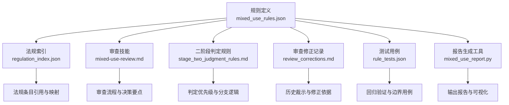
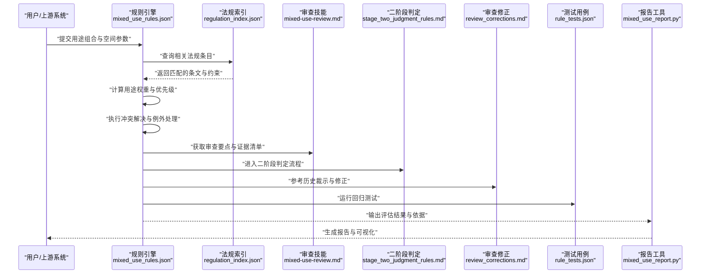
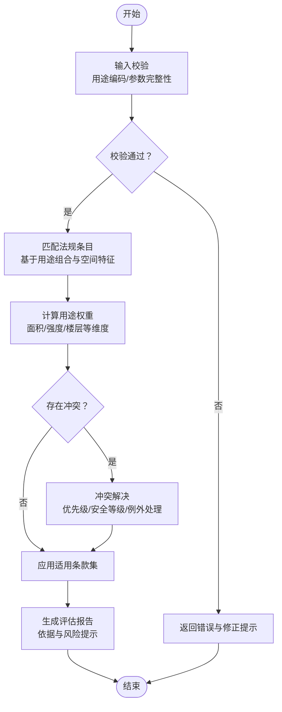
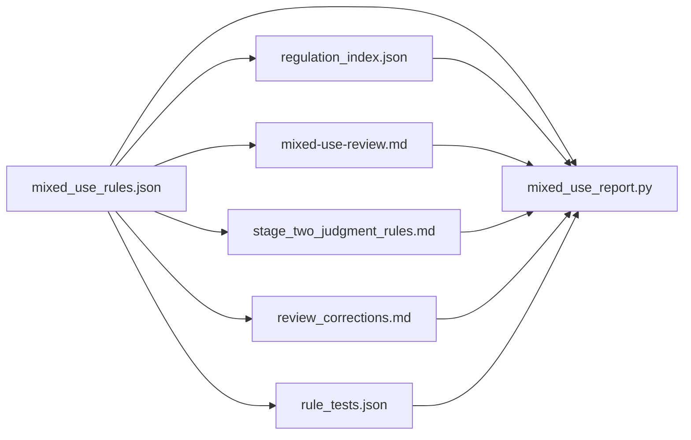

# 混合用途规则

<cite>
**本文引用的文件**   
- [mixed_use_rules.json](file://rules/mixed_use_rules.json)
- [mixed-use-review.md](file://skills/mixed-use-review.md)
- [mixed_use_report.py](file://tools/mixed_use_report.py)
- [regulation_index.json](file://rules/regulation_index.json)
- [review_corrections.md](file://rules/review_corrections.md)
- [stage_two_judgment_rules.md](file://rules/stage_two_judgment_rules.md)
- [rule_tests.json](file://rules/rule_tests.json)
</cite>

## 目录
1. [简介](#简介)
2. [项目结构](#项目结构)
3. [核心组件](#核心组件)
4. [架构总览](#架构总览)
5. [详细组件分析](#详细组件分析)
6. [依赖关系分析](#依赖关系分析)
7. [性能考量](#性能考量)
8. [故障排查指南](#故障排查指南)
9. [结论](#结论)
10. [附录](#附录)

## 简介
本技术文档面向“混合用途规则系统”，聚焦于混合用途建筑的法规适用逻辑，包括用途分类、权重计算与冲突解决机制。文档围绕 rules/mixed_use_rules.json 的规则定义与评估算法展开，解释不同用途组合的法规优先级与特殊处理规则，并提供新增用途组合与复杂场景处理的实践方法。同时说明该规则系统与审查流程的集成方式及决策支持能力，并给出规则维护与更新的最佳实践。

## 项目结构
与混合用途规则相关的核心资源分布在以下位置：
- 规则定义与索引：rules/mixed_use_rules.json、rules/regulation_index.json
- 审查技能与流程指引：skills/mixed-use-review.md、rules/stage_two_judgment_rules.md、rules/review_corrections.md
- 报告与工具：tools/mixed_use_report.py
- 测试用例：rules/rule_tests.json

图表来源
- [mixed_use_rules.json](file://rules/mixed_use_rules.json)
- [regulation_index.json](file://rules/regulation_index.json)
- [mixed-use-review.md](file://skills/mixed-use-review.md)
- [stage_two_judgment_rules.md](file://rules/stage_two_judgment_rules.md)
- [review_corrections.md](file://rules/review_corrections.md)
- [rule_tests.json](file://rules/rule_tests.json)
- [mixed_use_report.py](file://tools/mixed_use_report.py)

章节来源
- [mixed_use_rules.json](file://rules/mixed_use_rules.json)
- [regulation_index.json](file://rules/regulation_index.json)
- [mixed-use-review.md](file://skills/mixed-use-review.md)
- [stage_two_judgment_rules.md](file://rules/stage_two_judgment_rules.md)
- [review_corrections.md](file://rules/review_corrections.md)
- [rule_tests.json](file://rules/rule_tests.json)
- [mixed_use_report.py](file://tools/mixed_use_report.py)

## 核心组件
- 规则定义（mixed_use_rules.json）
  - 用途分类与编码：统一标识各类建筑用途，便于跨规则引用与聚合。
  - 组合规则：描述多用途共存时的适用条件、权重分配与冲突消解策略。
  - 权重计算：基于面积、楼层、使用强度等维度对用途进行量化加权。
  - 冲突解决：按优先级、安全等级、法规强制程度等维度确定最终适用条款。
  - 特殊处理：针对特定组合或场景的例外条款与附加要求。
- 法规索引（regulation_index.json）
  - 将具体条文与用途/场景建立映射，支撑快速检索与自动匹配。
- 审查技能（mixed-use-review.md）
  - 提供审查步骤、判断要点与证据收集清单，指导人工复核与决策。
- 二阶段判定（stage_two_judgment_rules.md）
  - 明确初判与复判阶段的触发条件、判定标准与输出物。
- 审查修正（review_corrections.md）
  - 记录历史裁示、争议点与修正建议，作为规则演进的依据。
- 测试用例（rule_tests.json）
  - 覆盖典型与边界场景，保障规则变更的可回归性。
- 报告工具（mixed_use_report.py）
  - 将规则评估结果转化为结构化报告，辅助审查与归档。

章节来源
- [mixed_use_rules.json](file://rules/mixed_use_rules.json)
- [regulation_index.json](file://rules/regulation_index.json)
- [mixed-use-review.md](file://skills/mixed-use-review.md)
- [stage_two_judgment_rules.md](file://rules/stage_two_judgment_rules.md)
- [review_corrections.md](file://rules/review_corrections.md)
- [rule_tests.json](file://rules/rule_tests.json)
- [mixed_use_report.py](file://tools/mixed_use_report.py)

## 架构总览
混合用途规则系统的整体数据流如下：输入用途与空间信息经规则引擎解析，结合法规索引进行匹配与权重计算，通过冲突解决模块得出适用条款集合，再由报告工具生成可审读的输出。

图表来源
- [mixed_use_rules.json](file://rules/mixed_use_rules.json)
- [regulation_index.json](file://rules/regulation_index.json)
- [mixed-use-review.md](file://skills/mixed-use-review.md)
- [stage_two_judgment_rules.md](file://rules/stage_two_judgment_rules.md)
- [review_corrections.md](file://rules/review_corrections.md)
- [rule_tests.json](file://rules/rule_tests.json)
- [mixed_use_report.py](file://tools/mixed_use_report.py)

## 详细组件分析

### 规则定义与评估算法（mixed_use_rules.json）
- 用途分类与编码
  - 为每种用途赋予唯一编码与语义标签，确保跨规则一致识别。
  - 支持层级化分类（如商业、办公、居住、公共聚集等），便于聚合统计。
- 组合规则
  - 定义多用途共存的允许条件、限制范围与附加要求。
  - 对相邻或上下层用途之间的隔离、通道、疏散等提出具体要求。
- 权重计算
  - 以面积占比、使用强度、楼层位置等维度计算各用途权重。
  - 权重用于决定适用条款的主次顺序与豁免条件。
- 冲突解决
  - 优先级排序：安全类条款优先于一般管理条款；强制性条款优先于推荐性条款。
  - 冲突消解：当多条规则相互矛盾时，按最高安全等级与最严格限制执行。
  - 例外处理：在满足特定条件下允许放宽或替代措施。
- 评估算法流程
  - 输入校验：检查用途编码有效性、参数完整性与合理性。
  - 匹配检索：根据用途组合与空间特征检索相关法规条目。
  - 权重计算：对各用途进行量化加权，形成综合评分。
  - 冲突裁决：应用优先级与例外规则，输出最终适用条款集。
  - 输出报告：生成评估结果、依据与风险提示。

图表来源
- [mixed_use_rules.json](file://rules/mixed_use_rules.json)

章节来源
- [mixed_use_rules.json](file://rules/mixed_use_rules.json)

### 法规索引与映射（regulation_index.json）
- 作用
  - 将用途编码与法规条文建立映射，支持快速检索与自动匹配。
  - 维护条文的适用范围、版本与生效日期，确保时效性。
- 设计要点
  - 键值结构清晰，避免歧义；支持多对多映射。
  - 提供注释字段，解释映射依据与例外情况。
- 使用方式
  - 规则引擎在匹配阶段调用索引，获取候选条文集合。
  - 报告工具引用索引中的条文编号与标题，增强可读性。

章节来源
- [regulation_index.json](file://rules/regulation_index.json)

### 审查技能与流程（mixed-use-review.md）
- 审查步骤
  - 资料收集：用途声明、平面图、面积统计、使用强度说明。
  - 初步判断：依据规则定义与索引进行初判。
  - 证据核验：对照规范与现场核查要点进行复核。
  - 决策输出：形成审查意见与建议措施。
- 决策要点
  - 安全优先：消防、疏散、结构安全等关键指标不可妥协。
  - 透明可追溯：所有判断需有明确的规则与条文依据。
  - 异常上报：遇到未覆盖场景时，启动专家会审与记录归档。

章节来源
- [mixed-use-review.md](file://skills/mixed-use-review.md)

### 二阶段判定规则（stage_two_judgment_rules.md）
- 初判阶段
  - 基于规则引擎输出进行快速筛选，标记高风险与不确定项。
- 复判阶段
  - 对初判标记项进行深入分析，必要时引入专家意见与补充材料。
- 判定标准
  - 明确通过、有条件通过、不通过的阈值与条件。
- 输出物
  - 初判报告、复判纪要、最终裁定与整改建议。

章节来源
- [stage_two_judgment_rules.md](file://rules/stage_two_judgment_rules.md)

### 审查修正与历史裁示（review_corrections.md）
- 内容
  - 记录历史争议、裁示结论与修正建议。
  - 标注影响范围与生效时间，指导规则迭代。
- 使用方式
  - 规则引擎在冲突解决时参考历史裁示，提升一致性。
  - 审查人员在复杂场景中查阅修正记录，辅助决策。

章节来源
- [review_corrections.md](file://rules/review_corrections.md)

### 测试用例与回归验证（rule_tests.json）
- 覆盖范围
  - 典型用途组合、边界条件、冲突场景与例外处理。
- 验证目标
  - 确保规则变更不影响既有正确行为。
  - 提高新场景适配的可靠性与稳定性。
- 使用方法
  - 在规则更新后自动运行测试套件，输出通过率与失败详情。

章节来源
- [rule_tests.json](file://rules/rule_tests.json)

### 报告生成工具（mixed_use_report.py）
- 功能
  - 将规则评估结果转换为结构化报告，包含适用条款、权重计算与风险提示。
  - 支持导出多种格式，便于存档与共享。
- 集成点
  - 与规则引擎对接，接收评估结果与依据。
  - 与审查流程联动，输出审查所需材料与清单。

章节来源
- [mixed_use_report.py](file://tools/mixed_use_report.py)

## 依赖关系分析
混合用途规则系统内部依赖关系如下：
- mixed_use_rules.json 依赖 regulation_index.json 进行条文映射。
- mixed-use-review.md 与 stage_two_judgment_rules.md 为审查流程提供方法论支撑。
- review_corrections.md 为冲突解决与例外处理提供历史依据。
- rule_tests.json 为规则变更提供回归验证。
- mixed_use_report.py 依赖上述所有组件输出完整报告。

图表来源
- [mixed_use_rules.json](file://rules/mixed_use_rules.json)
- [regulation_index.json](file://rules/regulation_index.json)
- [mixed-use-review.md](file://skills/mixed-use-review.md)
- [stage_two_judgment_rules.md](file://rules/stage_two_judgment_rules.md)
- [review_corrections.md](file://rules/review_corrections.md)
- [rule_tests.json](file://rules/rule_tests.json)
- [mixed_use_report.py](file://tools/mixed_use_report.py)

章节来源
- [mixed_use_rules.json](file://rules/mixed_use_rules.json)
- [regulation_index.json](file://rules/regulation_index.json)
- [mixed-use-review.md](file://skills/mixed-use-review.md)
- [stage_two_judgment_rules.md](file://rules/stage_two_judgment_rules.md)
- [review_corrections.md](file://rules/review_corrections.md)
- [rule_tests.json](file://rules/rule_tests.json)
- [mixed_use_report.py](file://tools/mixed_use_report.py)

## 性能考量
- 规则匹配优化
  - 使用索引预过滤减少全量扫描，提升匹配效率。
  - 缓存常用用途组合的匹配结果，降低重复计算开销。
- 权重计算优化
  - 采用增量计算与并行化处理，缩短评估时间。
- 冲突解决优化
  - 预置优先级表与冲突矩阵，避免运行时复杂决策。
- 报告生成优化
  - 模板化输出与异步渲染，提升用户体验。

[本节为通用性能建议，不直接分析具体文件]

## 故障排查指南
- 常见错误
  - 用途编码无效或缺失：检查输入数据的编码与完整性。
  - 规则匹配失败：确认法规索引是否更新，条目映射是否正确。
  - 权重计算异常：核对面积、强度等参数的单位与取值范围。
  - 冲突解决不一致：查阅历史裁示与修正记录，确保一致性。
- 调试步骤
  - 启用详细日志，定位问题环节。
  - 运行测试用例，验证规则变更的影响范围。
  - 生成中间报告，检查匹配与权重计算过程。
- 修复建议
  - 更新索引与规则定义，保持同步。
  - 补充边界用例，提升鲁棒性。
  - 加强审查培训，提高人工复核质量。

章节来源
- [mixed_use_rules.json](file://rules/mixed_use_rules.json)
- [regulation_index.json](file://rules/regulation_index.json)
- [rule_tests.json](file://rules/rule_tests.json)
- [review_corrections.md](file://rules/review_corrections.md)

## 结论
混合用途规则系统通过清晰的规则定义、完善的法规索引与严谨的审查流程，实现了多用途建筑法规适用的自动化与标准化。权重计算与冲突解决机制确保了评估结果的合理性与一致性。借助测试用例与报告工具，系统在规则演进与日常使用中具备高可靠性和可追溯性。建议持续完善规则库与审查技能，强化历史裁示的沉淀与应用，以提升整体决策支持与合规保障能力。

[本节为总结性内容，不直接分析具体文件]

## 附录
- 新增用途组合的实践步骤
  - 在规则定义中新增用途编码与分类。
  - 更新法规索引，建立与新用途的映射关系。
  - 编写组合规则与权重计算参数。
  - 添加测试用例，覆盖典型与边界场景。
  - 生成报告并进行人工复核。
- 复杂场景处理建议
  - 明确例外条款与附加要求。
  - 引入专家会审与补充材料。
  - 记录裁示与修正，纳入历史知识库。
- 规则维护与更新最佳实践
  - 版本化管理与变更审计。
  - 定期回归测试与性能评估。
  - 与审查流程紧密联动，确保落地可行性。

[本节为概念性内容，不直接分析具体文件]