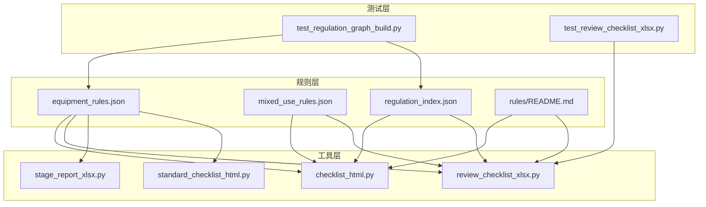
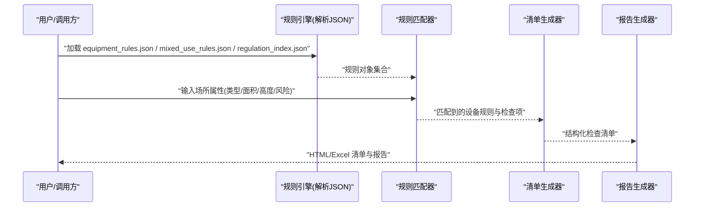
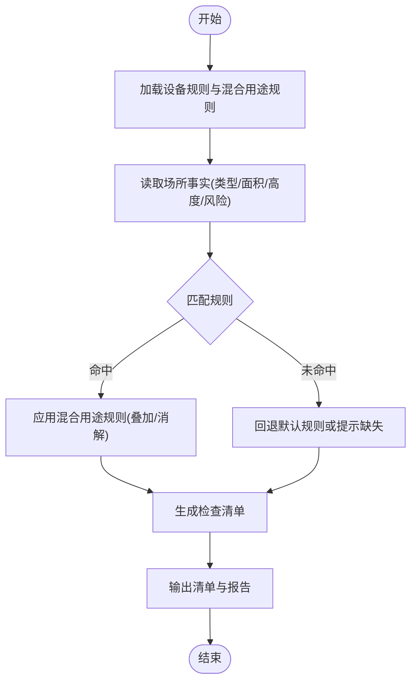
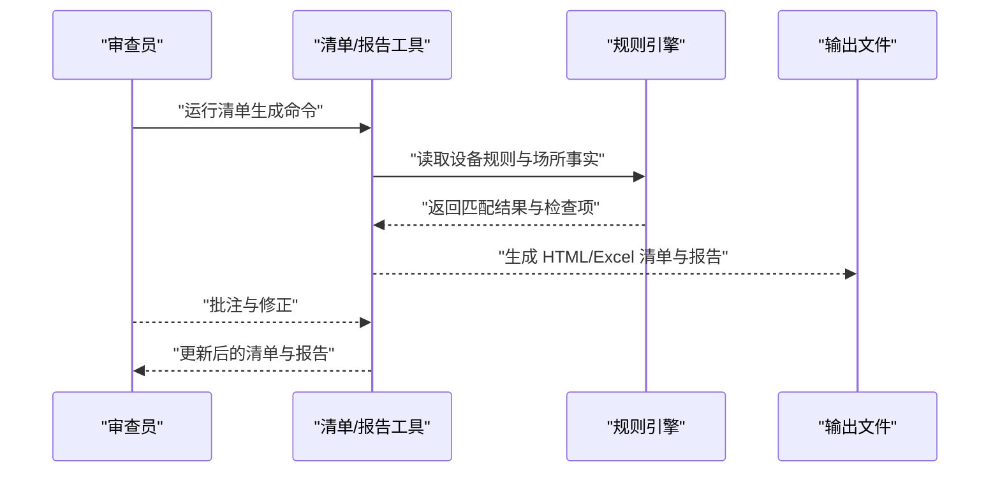
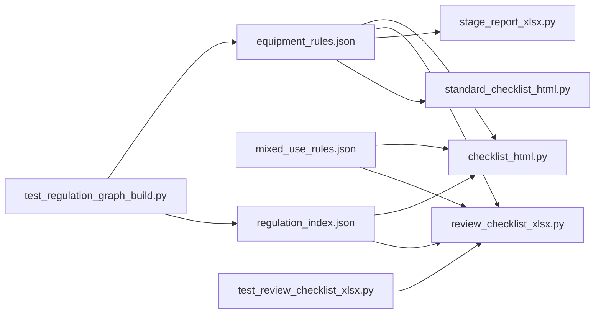

# 设备规则系统

<cite>
**本文引用的文件**   
- [rules/equipment_rules.json](file://rules/equipment_rules.json)
- [rules/mixed_use_rules.json](file://rules/mixed_use_rules.json)
- [rules/regulation_index.json](file://rules/regulation_index.json)
- [rules/README.md](file://rules/README.md)
- [tools/checklist_html.py](file://tools/checklist_html.py)
- [tools/review_checklist_xlsx.py](file://tools/review_checklist_xlsx.py)
- [tools/stage_report_xlsx.py](file://tools/stage_report_xlsx.py)
- [tools/standard_checklist_html.py](file://tools/standard_checklist_html.py)
- [tests/test_regulation_graph_build.py](file://tests/test_regulation_graph_build.py)
- [tests/test_review_checklist_xlsx.py](file://tests/test_review_checklist_xlsx.py)
</cite>

## 目录
1. [简介](#简介)
2. [项目结构](#项目结构)
3. [核心组件](#核心组件)
4. [架构总览](#架构总览)
5. [详细组件分析](#详细组件分析)
6. [依赖关系分析](#依赖关系分析)
7. [性能考量](#性能考量)
8. [故障排查指南](#故障排查指南)
9. [结论](#结论)
10. [附录](#附录)

## 简介
本技术文档围绕“设备规则系统”展开，聚焦于各类场所消防安全设备设置标准的实现逻辑。内容涵盖：
- 设备类型、配置参数与检查清单的结构化表达
- equipment_rules.json 的数据模型设计与规则匹配算法
- 不同场所类型的设备要求差异与优先级规则
- 新增设备类型与修改检查标准的具体步骤（含代码示例路径）
- 与审查工作流的集成方式与数据流转
- 性能优化建议与扩展开发指南

该系统以 JSON 规则为核心，结合工具链生成标准化检查清单与报告，支撑多阶段审查流程。

## 项目结构
与设备规则系统直接相关的目录与文件包括：
- rules：规则定义与索引，包含设备规则、混合用途规则、法规条款索引等
- tools：将规则转换为可执行检查清单与报告的脚本
- tests：针对规则构建与清单生成的测试用例

图表来源
- [rules/equipment_rules.json](file://rules/equipment_rules.json)
- [rules/mixed_use_rules.json](file://rules/mixed_use_rules.json)
- [rules/regulation_index.json](file://rules/regulation_index.json)
- [rules/README.md](file://rules/README.md)
- [tools/checklist_html.py](file://tools/checklist_html.py)
- [tools/review_checklist_xlsx.py](file://tools/review_checklist_xlsx.py)
- [tools/stage_report_xlsx.py](file://tools/stage_report_xlsx.py)
- [tools/standard_checklist_html.py](file://tools/standard_checklist_html.py)
- [tests/test_regulation_graph_build.py](file://tests/test_regulation_graph_build.py)
- [tests/test_review_checklist_xlsx.py](file://tests/test_review_checklist_xlsx.py)

章节来源
- [rules/README.md](file://rules/README.md)
- [rules/equipment_rules.json](file://rules/equipment_rules.json)
- [rules/mixed_use_rules.json](file://rules/mixed_use_rules.json)
- [rules/regulation_index.json](file://rules/regulation_index.json)

## 核心组件
- 设备规则（equipment_rules.json）
  - 描述设备类型、适用场所、配置参数、阈值与检查项
  - 提供规则匹配所需的关键字段（如场所类别、面积、高度、风险等级等）
- 混合用途规则（mixed_use_rules.json）
  - 处理复合场所的设备叠加与冲突消解策略
- 法规索引（regulation_index.json）
  - 将设备规则与具体法规条款关联，便于溯源与审计
- 清单与报告工具
  - checklist_html.py：基于规则生成 HTML 检查清单
  - review_checklist_xlsx.py：生成 Excel 审查清单
  - stage_report_xlsx.py：分阶段报告输出
  - standard_checklist_html.py：标准化 HTML 清单模板

章节来源
- [rules/equipment_rules.json](file://rules/equipment_rules.json)
- [rules/mixed_use_rules.json](file://rules/mixed_use_rules.json)
- [rules/regulation_index.json](file://rules/regulation_index.json)
- [tools/checklist_html.py](file://tools/checklist_html.py)
- [tools/review_checklist_xlsx.py](file://tools/review_checklist_xlsx.py)
- [tools/stage_report_xlsx.py](file://tools/stage_report_xlsx.py)
- [tools/standard_checklist_html.py](file://tools/standard_checklist_html.py)

## 架构总览
设备规则系统的整体架构由“规则定义—规则匹配—清单生成—报告输出”构成，数据从 JSON 规则流向工具脚本，最终产出结构化清单与报告。

图表来源
- [rules/equipment_rules.json](file://rules/equipment_rules.json)
- [rules/mixed_use_rules.json](file://rules/mixed_use_rules.json)
- [rules/regulation_index.json](file://rules/regulation_index.json)
- [tools/checklist_html.py](file://tools/checklist_html.py)
- [tools/review_checklist_xlsx.py](file://tools/review_checklist_xlsx.py)
- [tools/stage_report_xlsx.py](file://tools/stage_report_xlsx.py)
- [tools/standard_checklist_html.py](file://tools/standard_checklist_html.py)

## 详细组件分析

### equipment_rules.json 数据结构与规则匹配算法
- 数据结构要点
  - 设备类型：统一编码与名称映射，便于跨模块引用
  - 适用场所：支持单类或多类场所匹配，允许按面积、高度、风险等级细分
  - 配置参数：数量下限/上限、间距、覆盖半径、安装高度等
  - 检查项：逐项校验条件与判定逻辑（通过/不通过/需复核）
  - 优先级：用于冲突消解与叠加计算（高优先级覆盖低优先级）
- 匹配算法流程
  - 输入场所特征后，遍历规则集进行条件匹配
  - 对复合场所应用混合用途规则进行叠加与冲突消解
  - 输出设备清单与检查项，附带依据的法规条款

图表来源
- [rules/equipment_rules.json](file://rules/equipment_rules.json)
- [rules/mixed_use_rules.json](file://rules/mixed_use_rules.json)

章节来源
- [rules/equipment_rules.json](file://rules/equipment_rules.json)
- [rules/mixed_use_rules.json](file://rules/mixed_use_rules.json)

### 不同场所类型的设备要求差异与优先级规则
- 场所分类
  - 商业、办公、住宅、工业、医疗、教育等
  - 每类场所有不同的设备配置基线与附加要求
- 差异化规则
  - 面积阈值决定设备数量与布局密度
  - 高度影响疏散与覆盖范围
  - 风险等级触发更严格的检查项
- 优先级规则
  - 当多条规则同时适用时，按优先级排序选择最严格的要求
  - 混合用途场景下，按功能分区分别匹配并合并结果

章节来源
- [rules/equipment_rules.json](file://rules/equipment_rules.json)
- [rules/mixed_use_rules.json](file://rules/mixed_use_rules.json)

### 与审查工作流的集成与数据流转
- 集成点
  - checklist_html.py：将规则匹配结果渲染为 HTML 检查清单
  - review_checklist_xlsx.py：导出 Excel 审查清单，便于人工核对
  - stage_report_xlsx.py：按阶段汇总检查结果，形成报告
  - standard_checklist_html.py：提供标准化清单模板
- 数据流转
  - 规则引擎输出结构化清单 → 工具脚本消费 → 生成多格式输出
  - 审查人员可在 Excel/HTML 中批注与确认，反馈至下一轮规则迭代

图表来源
- [tools/checklist_html.py](file://tools/checklist_html.py)
- [tools/review_checklist_xlsx.py](file://tools/review_checklist_xlsx.py)
- [tools/stage_report_xlsx.py](file://tools/stage_report_xlsx.py)
- [tools/standard_checklist_html.py](file://tools/standard_checklist_html.py)

章节来源
- [tools/checklist_html.py](file://tools/checklist_html.py)
- [tools/review_checklist_xlsx.py](file://tools/review_checklist_xlsx.py)
- [tools/stage_report_xlsx.py](file://tools/stage_report_xlsx.py)
- [tools/standard_checklist_html.py](file://tools/standard_checklist_html.py)

### 添加新设备类型与修改检查标准的步骤
- 添加新设备类型
  - 在设备规则文件中新增设备条目，定义类型编码、名称、适用场所、配置参数与检查项
  - 确保字段命名与现有结构一致，避免解析错误
  - 若涉及混合用途，需在混合用途规则中补充叠加与消解策略
- 修改检查标准
  - 调整阈值、间距、覆盖半径等参数
  - 增加或删减检查项，明确判定逻辑
  - 更新法规索引，确保溯源准确
- 验证与回归
  - 使用测试用例验证规则匹配与清单生成
  - 运行清单生成工具，检查输出是否符合预期

章节来源
- [rules/equipment_rules.json](file://rules/equipment_rules.json)
- [rules/mixed_use_rules.json](file://rules/mixed_use_rules.json)
- [rules/regulation_index.json](file://rules/regulation_index.json)
- [tests/test_regulation_graph_build.py](file://tests/test_regulation_graph_build.py)
- [tests/test_review_checklist_xlsx.py](file://tests/test_review_checklist_xlsx.py)

## 依赖关系分析
- 内部依赖
  - 工具脚本依赖规则 JSON 文件的结构与字段
  - 测试用例依赖规则构建与清单生成的稳定性
- 外部依赖
  - 文本与表格库（用于生成 HTML/Excel）
  - 文件系统操作（读写规则与输出文件）

图表来源
- [rules/equipment_rules.json](file://rules/equipment_rules.json)
- [rules/mixed_use_rules.json](file://rules/mixed_use_rules.json)
- [rules/regulation_index.json](file://rules/regulation_index.json)
- [tools/checklist_html.py](file://tools/checklist_html.py)
- [tools/review_checklist_xlsx.py](file://tools/review_checklist_xlsx.py)
- [tools/stage_report_xlsx.py](file://tools/stage_report_xlsx.py)
- [tools/standard_checklist_html.py](file://tools/standard_checklist_html.py)
- [tests/test_regulation_graph_build.py](file://tests/test_regulation_graph_build.py)
- [tests/test_review_checklist_xlsx.py](file://tests/test_review_checklist_xlsx.py)

章节来源
- [rules/equipment_rules.json](file://rules/equipment_rules.json)
- [rules/mixed_use_rules.json](file://rules/mixed_use_rules.json)
- [rules/regulation_index.json](file://rules/regulation_index.json)
- [tools/checklist_html.py](file://tools/checklist_html.py)
- [tools/review_checklist_xlsx.py](file://tools/review_checklist_xlsx.py)
- [tools/stage_report_xlsx.py](file://tools/stage_report_xlsx.py)
- [tools/standard_checklist_html.py](file://tools/standard_checklist_html.py)
- [tests/test_regulation_graph_build.py](file://tests/test_regulation_graph_build.py)
- [tests/test_review_checklist_xlsx.py](file://tests/test_review_checklist_xlsx.py)

## 性能考量
- 规则加载与缓存
  - 启动时一次性加载规则 JSON，避免重复 I/O
  - 对热点规则建立内存索引（按场所类型、面积区间、风险等级）
- 匹配算法优化
  - 使用预过滤条件减少全量遍历
  - 对复杂表达式采用编译与缓存策略
- 清单生成优化
  - 批量渲染与分页输出，降低内存占用
  - 增量更新机制，仅重算变更部分

[本节为通用指导，无需特定文件来源]

## 故障排查指南
- 常见错误
  - JSON 结构不一致导致解析失败
  - 字段缺失或类型错误引发匹配异常
  - 混合用途规则冲突未正确消解
- 排查步骤
  - 校验 JSON 结构与字段完整性
  - 使用测试用例定位问题规则
  - 查看清单生成日志，确认匹配结果
- 修复建议
  - 统一字段命名规范与数据类型
  - 完善混合用途规则的优先级与覆盖策略
  - 增加单元测试覆盖率，防止回归

章节来源
- [tests/test_regulation_graph_build.py](file://tests/test_regulation_graph_build.py)
- [tests/test_review_checklist_xlsx.py](file://tests/test_review_checklist_xlsx.py)

## 结论
设备规则系统以 JSON 规则为核心，结合工具链实现从规则匹配到清单与报告输出的完整流程。通过清晰的数据结构与匹配算法，系统能够灵活适配不同场所类型的设备要求，并在混合用途场景下进行有效叠加与冲突消解。遵循本文档的扩展与优化建议，可进一步提升系统的可维护性与性能。

[本节为总结性内容，无需特定文件来源]

## 附录
- 扩展开发指南
  - 新增设备类型：在规则文件中新增条目，保持字段一致性；在混合用途规则中补充策略；编写测试用例验证
  - 修改检查标准：调整阈值与检查项，更新法规索引；运行测试与清单生成工具验证
  - 性能优化：引入规则缓存与索引；优化匹配算法与渲染流程
- 参考文件
  - rules/equipment_rules.json：设备规则定义
  - rules/mixed_use_rules.json：混合用途规则
  - rules/regulation_index.json：法规条款索引
  - tools/*：清单与报告生成工具
  - tests/*：规则与清单生成的测试用例

章节来源
- [rules/equipment_rules.json](file://rules/equipment_rules.json)
- [rules/mixed_use_rules.json](file://rules/mixed_use_rules.json)
- [rules/regulation_index.json](file://rules/regulation_index.json)
- [tools/checklist_html.py](file://tools/checklist_html.py)
- [tools/review_checklist_xlsx.py](file://tools/review_checklist_xlsx.py)
- [tools/stage_report_xlsx.py](file://tools/stage_report_xlsx.py)
- [tools/standard_checklist_html.py](file://tools/standard_checklist_html.py)
- [tests/test_regulation_graph_build.py](file://tests/test_regulation_graph_build.py)
- [tests/test_review_checklist_xlsx.py](file://tests/test_review_checklist_xlsx.py)