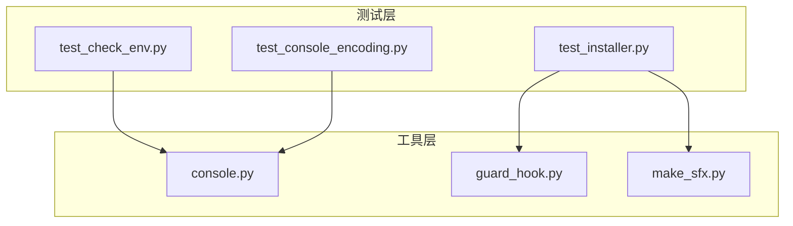
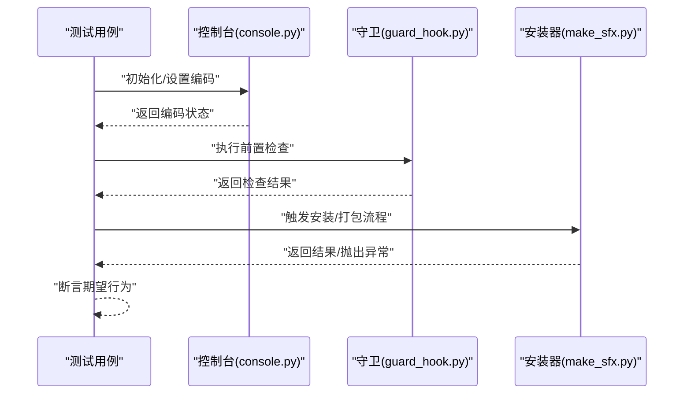
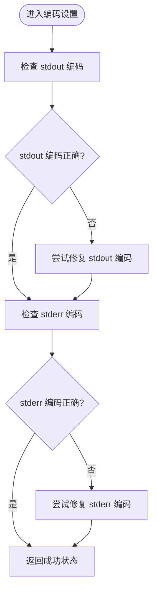
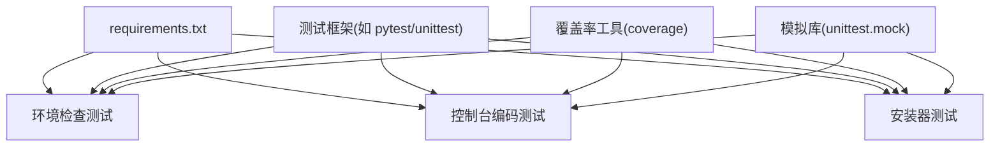

# 单元测试

<cite>
**本文引用的文件**   
- [tests/test_check_env.py](file://tests/test_check_env.py)
- [tests/test_console_encoding.py](file://tests/test_console_encoding.py)
- [tests/test_installer.py](file://tests/test_installer.py)
- [tools/console.py](file://tools/console.py)
- [tools/guard_hook.py](file://tools/guard_hook.py)
- [tools/make_sfx.py](file://tools/make_sfx.py)
- [requirements.txt](file://requirements.txt)
</cite>

## 目录
1. [简介](#简介)
2. [项目结构](#项目结构)
3. [核心组件](#核心组件)
4. [架构总览](#架构总览)
5. [详细组件分析](#详细组件分析)
6. [依赖关系分析](#依赖关系分析)
7. [性能考虑](#性能考虑)
8. [故障排查指南](#故障排查指南)
9. [结论](#结论)
10. [附录](#附录)

## 简介
本技术文档聚焦于项目的单元测试模块，围绕以下目标展开：
- 解释单元测试的设计原则与测试用例编写规范
- 说明断言方法与最佳实践
- 覆盖环境配置检查、控制台编码处理与安装程序功能的测试要点
- 提供模拟外部依赖、验证返回值与异常处理的示例路径
- 记录覆盖率统计、性能基准测试与调试技巧
- 总结高质量单元测试的常见问题与解决方案

## 项目结构
测试代码集中于 tests 目录，按功能维度组织多个独立测试文件；被测工具位于 tools 目录。关键映射如下：
- 环境检查测试：tests/test_check_env.py
- 控制台编码测试：tests/test_console_encoding.py
- 安装器相关测试：tests/test_installer.py
- 控制台实现：tools/console.py
- 钩子/守卫逻辑（常用于安装或运行期保护）：tools/guard_hook.py
- SFX 打包/安装脚本：tools/make_sfx.py
- Python 依赖清单：requirements.txt

图表来源
- [tests/test_check_env.py](file://tests/test_check_env.py)
- [tests/test_console_encoding.py](file://tests/test_console_encoding.py)
- [tests/test_installer.py](file://tests/test_installer.py)
- [tools/console.py](file://tools/console.py)
- [tools/guard_hook.py](file://tools/guard_hook.py)
- [tools/make_sfx.py](file://tools/make_sfx.py)

章节来源
- [requirements.txt](file://requirements.txt)

## 核心组件
- 环境检查测试（test_check_env.py）
  - 目标：验证运行环境的关键配置项（如 Python 版本、必要环境变量、平台差异等）是否符合预期
  - 关注点：断言环境变量的存在性与取值范围；对缺失或非法值进行失败断言
- 控制台编码测试（test_console_encoding.py）
  - 目标：确保控制台输出编码正确，避免中文乱码或跨平台编码不一致问题
  - 关注点：断言 stdout/stderr 的编码属性；验证写入非 ASCII 字符不抛异常
- 安装器测试（test_installer.py）
  - 目标：验证安装流程中的关键步骤（如依赖校验、路径设置、SFX 生成或执行）
  - 关注点：模拟系统调用与文件系统操作；验证返回状态码与产物存在性

章节来源
- [tests/test_check_env.py](file://tests/test_check_env.py)
- [tests/test_console_encoding.py](file://tests/test_console_encoding.py)
- [tests/test_installer.py](file://tests/test_installer.py)

## 架构总览
测试与工具的交互遵循“测试驱动被测模块”的原则：测试通过导入被测模块并调用其函数/类方法，使用断言库验证行为。典型流程如下：

图表来源
- [tools/console.py](file://tools/console.py)
- [tools/guard_hook.py](file://tools/guard_hook.py)
- [tools/make_sfx.py](file://tools/make_sfx.py)

## 详细组件分析

### 环境检查测试（test_check_env.py）
- 设计原则
  - 单一职责：每个测试只验证一个环境条件或一组相关条件
  - 可重复性：不依赖外部状态，必要时使用临时文件或环境变量隔离
  - 明确断言：对成功与失败路径均给出清晰断言
- 测试要点
  - 验证 Python 版本满足最低要求
  - 检查必需环境变量是否存在且格式正确
  - 针对平台差异（Windows/Linux/macOS）分别断言
- 断言方法建议
  - 使用 assertEqual/assertIsNone 等精确断言
  - 使用 pytest.raises 捕获并验证异常类型与消息
- 模拟外部依赖
  - 使用 unittest.mock.patch 替换 os.environ、sys.version_info、platform 等
- 代码示例路径
  - 参考 [tests/test_check_env.py](file://tests/test_check_env.py)

章节来源
- [tests/test_check_env.py](file://tests/test_check_env.py)

### 控制台编码测试（test_console_encoding.py）
- 设计原则
  - 稳定性优先：避免终端实际渲染影响测试结果
  - 跨平台兼容：统一断言编码属性，忽略终端差异
- 测试要点
  - 断言 sys.stdout.encoding 与 sys.stderr.encoding 符合预期
  - 写入包含中文的字符串不应抛出 UnicodeEncodeError
  - 若控制台封装了编码设置接口，需验证其生效
- 断言方法建议
  - 使用 assertIn/assertIsInstance 验证编码名称
  - 使用 pytest.raises 验证特定异常未发生
- 模拟外部依赖
  - 使用 mock 替换 sys.stdout/stderr 以捕获输出内容
- 代码示例路径
  - 参考 [tests/test_console_encoding.py](file://tests/test_console_encoding.py)
  - 参考 [tools/console.py](file://tools/console.py)

章节来源
- [tests/test_console_encoding.py](file://tests/test_console_encoding.py)
- [tools/console.py](file://tools/console.py)

### 安装器测试（test_installer.py）
- 设计原则
  - 分层验证：将安装流程拆分为依赖检查、路径设置、产物生成等阶段分别测试
  - 副作用隔离：使用临时目录与 mock 避免修改真实文件系统
- 测试要点
  - 验证依赖是否满足（Python 包、系统命令）
  - 验证安装后关键路径或文件存在
  - 验证错误场景（权限不足、磁盘空间不足）下的异常处理
- 断言方法建议
  - 使用 assertPathExists 验证文件/目录
  - 使用 assertRaises 验证异常类型
  - 使用 patch 拦截 subprocess 调用并返回期望状态码
- 模拟外部依赖
  - 使用 unittest.mock.patch 替换 os.path、subprocess、shutil 等
- 代码示例路径
  - 参考 [tests/test_installer.py](file://tests/test_installer.py)
  - 参考 [tools/guard_hook.py](file://tools/guard_hook.py)
  - 参考 [tools/make_sfx.py](file://tools/make_sfx.py)

章节来源
- [tests/test_installer.py](file://tests/test_installer.py)
- [tools/guard_hook.py](file://tools/guard_hook.py)
- [tools/make_sfx.py](file://tools/make_sfx.py)

### 控制台编码处理流程图（基于 console.py）

图表来源
- [tools/console.py](file://tools/console.py)

## 依赖关系分析
- 测试框架与断言库
  - 通常使用 unittest 或 pytest；断言风格与插件会影响覆盖率与报告生成
- 模拟库
  - unittest.mock 用于替换系统 API 与第三方依赖
- 覆盖率工具
  - coverage 用于统计覆盖率并生成报告
- 运行时依赖
  - requirements.txt 列出 Python 包依赖，确保测试环境一致性

图表来源
- [requirements.txt](file://requirements.txt)

章节来源
- [requirements.txt](file://requirements.txt)

## 性能考虑
- 测试数据最小化：仅构造必要的输入，避免大对象或大量 I/O
- 并行执行：使用 pytest-xdist 提升多测试用例执行效率
- 缓存策略：对昂贵的外部调用（如网络请求）进行缓存或 mock
- 基准测试：对关键路径（如编码设置、安装流程）添加简单计时断言，防止回归

[本节为通用指导，不涉及具体文件分析]

## 故障排查指南
- 常见环境问题
  - Python 版本不匹配：检查 requirements.txt 与本地版本
  - 编码不一致：确认控制台编码设置与终端支持
  - 权限不足：在 CI 或受限环境中调整权限或使用虚拟环境
- 调试技巧
  - 使用 -v 或 --tb=short 查看详细回溯
  - 使用 pdb 或 breakpoint() 插入断点
  - 使用日志输出定位失败分支
- 覆盖率与报告
  - 使用 coverage run 与 coverage report 快速定位未覆盖分支
  - 结合 pytest-cov 生成 HTML 报告便于可视化

章节来源
- [tests/test_check_env.py](file://tests/test_check_env.py)
- [tests/test_console_encoding.py](file://tests/test_console_encoding.py)
- [tests/test_installer.py](file://tests/test_installer.py)

## 结论
本项目的单元测试围绕环境检查、控制台编码与安装器三大主题构建，遵循单一职责、可重复性与明确断言等原则。通过合理的模拟与隔离策略，测试能够稳定地验证关键路径与异常分支。配合覆盖率与基准测试，可有效保障质量与性能。建议在持续集成中自动化执行测试，并定期审查覆盖率与性能指标。

[本节为总结性内容，不涉及具体文件分析]

## 附录
- 编写高质量单元测试的最佳实践
  - 命名清晰：用例名应表达意图（如 test_env_missing_variable_raises_error）
  - 数据驱动：使用参数化减少重复代码
  - 边界条件：覆盖正常、边界与异常三类场景
  - 可维护性：避免硬编码，抽取共享夹具与辅助函数
- 常见问题与解决方案
  - 测试不稳定：隔离外部依赖，固定随机种子与时间源
  - 覆盖率低：补充失败路径与边界条件用例
  - 执行缓慢：拆分大用例，启用并行执行与缓存

[本节为通用指导，不涉及具体文件分析]