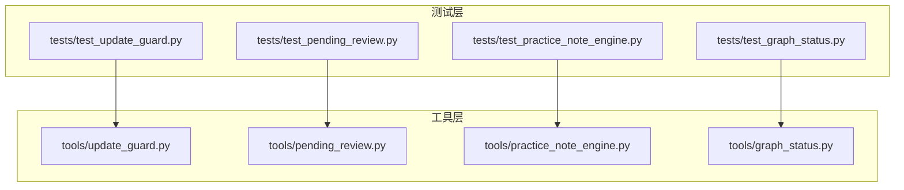
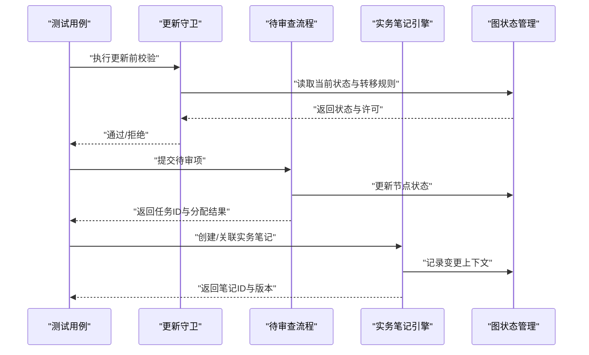
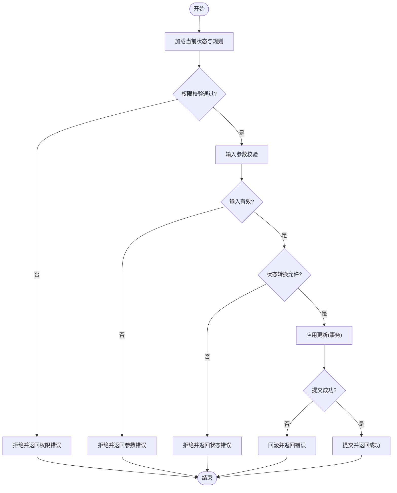
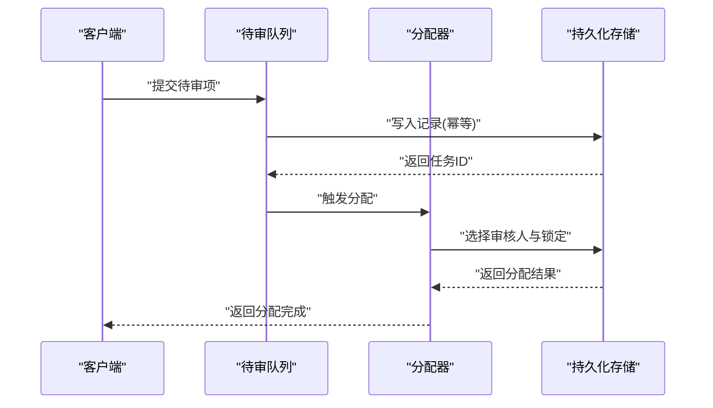
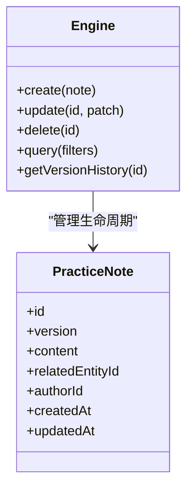
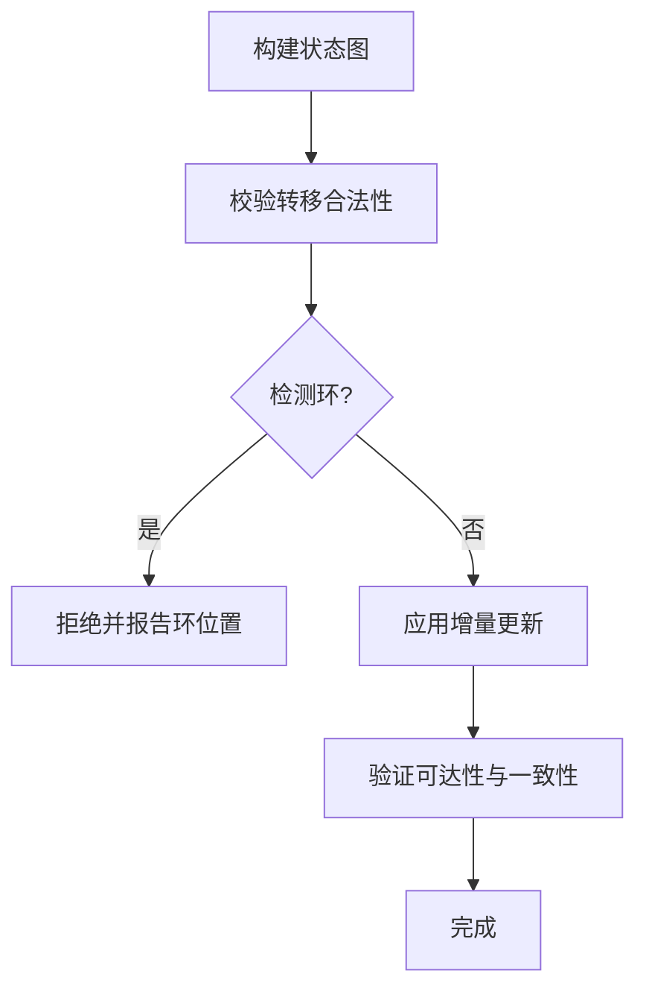
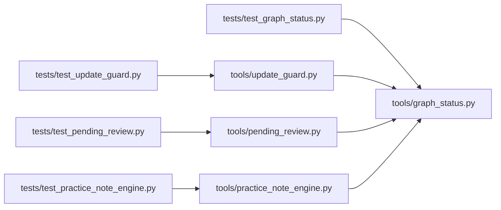

# 工作流测试

<cite>
**本文引用的文件**   
- [test_update_guard.py](file://tests/test_update_guard.py)
- [test_pending_review.py](file://tests/test_pending_review.py)
- [test_practice_note_engine.py](file://tests/test_practice_note_engine.py)
- [test_graph_status.py](file://tests/test_graph_status.py)
- [update_guard.py](file://tools/update_guard.py)
- [pending_review.py](file://tools/pending_review.py)
- [practice_note_engine.py](file://tools/practice_note_engine.py)
- [graph_status.py](file://tools/graph_status.py)
</cite>

## 目录
1. [简介](#简介)
2. [项目结构](#项目结构)
3. [核心组件](#核心组件)
4. [架构总览](#架构总览)
5. [详细组件分析](#详细组件分析)
6. [依赖关系分析](#依赖关系分析)
7. [性能考量](#性能考量)
8. [故障排查指南](#故障排查指南)
9. [结论](#结论)
10. [附录](#附录)

## 简介
本技术文档聚焦工作流测试模块，围绕更新守卫、待审查流程与实务笔记引擎三大主题，系统化阐述测试策略与实践。内容涵盖：
- 工作流状态转换的验证方法
- 权限控制与数据一致性的断言要点
- 用户操作模拟、业务流程验证与异常场景覆盖
- 数据准备、状态管理与并发处理
- 自动化策略、监控指标与问题排查方法

## 项目结构
工作流相关能力由工具层与测试层共同构成：
- 工具层（tools）提供核心工作流逻辑：更新守卫、待审查流程、实务笔记引擎、图状态管理等
- 测试层（tests）针对上述能力编写用例，覆盖正常路径、边界条件与异常分支

图表来源
- [test_update_guard.py](file://tests/test_update_guard.py)
- [test_pending_review.py](file://tests/test_pending_review.py)
- [test_practice_note_engine.py](file://tests/test_practice_note_engine.py)
- [test_graph_status.py](file://tests/test_graph_status.py)
- [update_guard.py](file://tools/update_guard.py)
- [pending_review.py](file://tools/pending_review.py)
- [practice_note_engine.py](file://tools/practice_note_engine.py)
- [graph_status.py](file://tools/graph_status.py)

章节来源
- [test_update_guard.py](file://tests/test_update_guard.py)
- [test_pending_review.py](file://tests/test_pending_review.py)
- [test_practice_note_engine.py](file://tests/test_practice_note_engine.py)
- [test_graph_status.py](file://tests/test_graph_status.py)
- [update_guard.py](file://tools/update_guard.py)
- [pending_review.py](file://tools/pending_review.py)
- [practice_note_engine.py](file://tools/practice_note_engine.py)
- [graph_status.py](file://tools/graph_status.py)

## 核心组件
- 更新守卫（Update Guard）
  - 职责：在执行关键更新前进行前置校验与权限检查，确保状态机允许转换并满足业务约束
  - 测试重点：合法/非法状态转换、权限不足、输入校验失败、回滚与一致性
- 待审查流程（Pending Review）
  - 职责：维护待审队列、路由到审核人、记录流转轨迹与审计信息
  - 测试重点：入队/出队、分配策略、超时与重试、并发竞争、幂等性
- 实务笔记引擎（Practice Note Engine）
  - 职责：生成、关联与检索实务笔记，支撑审核意见沉淀与追溯
  - 测试重点：笔记创建/更新/删除、版本与关联关系、查询过滤、并发写入
- 图状态管理（Graph Status）
  - 职责：以图结构表达工作流状态与转移规则，驱动状态机行为
  - 测试重点：状态可达性、转移合法性、环检测、增量更新

章节来源
- [update_guard.py](file://tools/update_guard.py)
- [pending_review.py](file://tools/pending_review.py)
- [practice_note_engine.py](file://tools/practice_note_engine.py)
- [graph_status.py](file://tools/graph_status.py)

## 架构总览
下图展示测试与工具的交互关系及典型调用链：

图表来源
- [test_update_guard.py](file://tests/test_update_guard.py)
- [test_pending_review.py](file://tests/test_pending_review.py)
- [test_practice_note_engine.py](file://tests/test_practice_note_engine.py)
- [test_graph_status.py](file://tests/test_graph_status.py)
- [update_guard.py](file://tools/update_guard.py)
- [pending_review.py](file://tools/pending_review.py)
- [practice_note_engine.py](file://tools/practice_note_engine.py)
- [graph_status.py](file://tools/graph_status.py)

## 详细组件分析

### 更新守卫测试策略
- 目标
  - 验证状态转换是否受图规则约束
  - 校验权限模型与角色/资源访问控制
  - 保证更新前后数据一致性（原子性、回滚）
- 关键断言
  - 合法转换：从当前状态经允许边到达目标状态
  - 非法转换：拒绝非允许边或前置条件不满足
  - 权限控制：无权限时拒绝；有权限但资源不匹配时拒绝
  - 数据一致性：事务成功则快照一致；失败则回滚至原态
- 模拟与验证
  - 使用夹具构造不同角色与资源上下文
  - 注入图状态与转移表，覆盖边界路径
  - 捕获异常类型与错误码，验证错误语义
- 示例路径
  - 参考用例组织与断言模式：[test_update_guard.py](file://tests/test_update_guard.py)
  - 被测实现入口：[update_guard.py](file://tools/update_guard.py)

图表来源
- [test_update_guard.py](file://tests/test_update_guard.py)
- [update_guard.py](file://tools/update_guard.py)

章节来源
- [test_update_guard.py](file://tests/test_update_guard.py)
- [update_guard.py](file://tools/update_guard.py)

### 待审查流程测试策略
- 目标
  - 验证入队/出队、分配策略、超时重试与幂等性
  - 保障并发下的公平性与顺序性
  - 审计轨迹完整可追溯
- 关键断言
  - 入队后状态为“待审”，分配后状态为“已分配”
  - 超时未处理自动回收或升级
  - 重复提交幂等，避免重复分配
  - 并发下无丢失、无重复消费
- 模拟与验证
  - 构造多角色审核人、不同优先级与SLA
  - 注入并发请求，验证锁机制与去重键
  - 检查审计日志与状态迁移时间戳
- 示例路径
  - 参考用例组织与断言模式：[test_pending_review.py](file://tests/test_pending_review.py)
  - 被测实现入口：[pending_review.py](file://tools/pending_review.py)

图表来源
- [test_pending_review.py](file://tests/test_pending_review.py)
- [pending_review.py](file://tools/pending_review.py)

章节来源
- [test_pending_review.py](file://tests/test_pending_review.py)
- [pending_review.py](file://tools/pending_review.py)

### 实务笔记引擎测试策略
- 目标
  - 验证笔记的CRUD、版本控制与关联关系
  - 确保查询过滤、排序与分页正确
  - 并发写入时的冲突解决与一致性
- 关键断言
  - 创建后存在且版本递增
  - 关联对象变更后笔记引用仍有效
  - 查询条件精确匹配，分页稳定
  - 并发写入无脏读、无覆盖写
- 模拟与验证
  - 构造不同用户、对象与标签集合
  - 注入并发写入，验证锁或乐观锁策略
  - 校验审计字段与时间线
- 示例路径
  - 参考用例组织与断言模式：[test_practice_note_engine.py](file://tests/test_practice_note_engine.py)
  - 被测实现入口：[practice_note_engine.py](file://tools/practice_note_engine.py)

图表来源
- [test_practice_note_engine.py](file://tests/test_practice_note_engine.py)
- [practice_note_engine.py](file://tools/practice_note_engine.py)

章节来源
- [test_practice_note_engine.py](file://tests/test_practice_note_engine.py)
- [practice_note_engine.py](file://tools/practice_note_engine.py)

### 图状态管理测试策略
- 目标
  - 验证状态图的构建、可达性与转移合法性
  - 支持增量更新与环检测
- 关键断言
  - 所有期望转移在图中存在
  - 不存在非法环或死锁路径
  - 增量更新后状态一致
- 模拟与验证
  - 构造最小/最大图规模，压力遍历
  - 注入非法边，验证拒绝策略
- 示例路径
  - 参考用例组织与断言模式：[test_graph_status.py](file://tests/test_graph_status.py)
  - 被测实现入口：[graph_status.py](file://tools/graph_status.py)

图表来源
- [test_graph_status.py](file://tests/test_graph_status.py)
- [graph_status.py](file://tools/graph_status.py)

章节来源
- [test_graph_status.py](file://tests/test_graph_status.py)
- [graph_status.py](file://tools/graph_status.py)

## 依赖关系分析
测试与工具的耦合关系如下：

图表来源
- [test_update_guard.py](file://tests/test_update_guard.py)
- [test_pending_review.py](file://tests/test_pending_review.py)
- [test_practice_note_engine.py](file://tests/test_practice_note_engine.py)
- [test_graph_status.py](file://tests/test_graph_status.py)
- [update_guard.py](file://tools/update_guard.py)
- [pending_review.py](file://tools/pending_review.py)
- [practice_note_engine.py](file://tools/practice_note_engine.py)
- [graph_status.py](file://tools/graph_status.py)

章节来源
- [test_update_guard.py](file://tests/test_update_guard.py)
- [test_pending_review.py](file://tests/test_pending_review.py)
- [test_practice_note_engine.py](file://tests/test_practice_note_engine.py)
- [test_graph_status.py](file://tests/test_graph_status.py)
- [update_guard.py](file://tools/update_guard.py)
- [pending_review.py](file://tools/pending_review.py)
- [practice_note_engine.py](file://tools/practice_note_engine.py)
- [graph_status.py](file://tools/graph_status.py)

## 性能考量
- 更新守卫
  - 状态查询与规则匹配应缓存热点规则，减少I/O
  - 批量更新时使用事务合并，降低锁竞争
- 待审查流程
  - 分配器采用分片与负载均衡，避免单点瓶颈
  - 超时与重试需设置退避策略，防止雪崩
- 实务笔记引擎
  - 写入路径异步化，读路径启用索引与分页
  - 并发控制采用细粒度锁或乐观锁，提升吞吐
- 图状态管理
  - 增量更新避免全量重建，必要时异步重构
  - 大图遍历采用BFS/DFS优化与剪枝

## 故障排查指南
- 常见问题定位
  - 状态转换失败：检查图规则、前置条件与权限上下文
  - 分配冲突：查看锁策略、去重键与并发日志
  - 笔记版本错乱：核对版本号递增与并发写入保护
  - 图不一致：对比增量更新前后的差异与校验结果
- 调试建议
  - 开启详细日志与审计追踪
  - 使用最小复现用例隔离问题
  - 对关键路径添加断言与监控指标

## 结论
通过对更新守卫、待审查流程与实务笔记引擎的系统化测试，能够有效保障工作流的状态一致性、权限安全与数据可靠性。结合图状态管理的严格校验与并发控制策略，可在复杂业务场景下维持稳定的工作流执行。

## 附录
- 自动化策略
  - 将测试纳入CI流水线，每次提交运行全部用例
  - 对慢用例进行并行化与分层执行
- 监控指标
  - 状态转换成功率、平均耗时与失败率
  - 待审队列长度、分配延迟与超时率
  - 笔记写入QPS、冲突率与版本一致性
- 问题排查清单
  - 权限上下文是否正确注入
  - 图规则是否与业务同步更新
  - 并发锁与幂等键是否生效
  - 审计日志是否完整可追溯