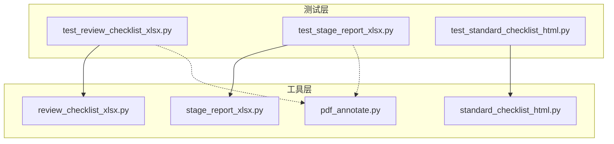
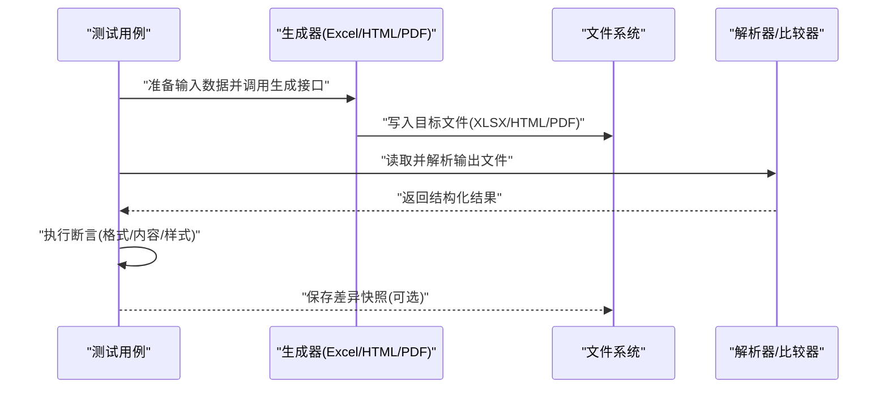
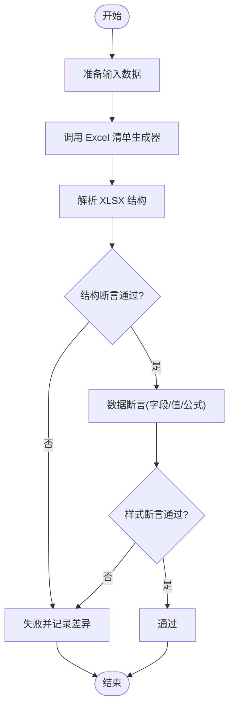
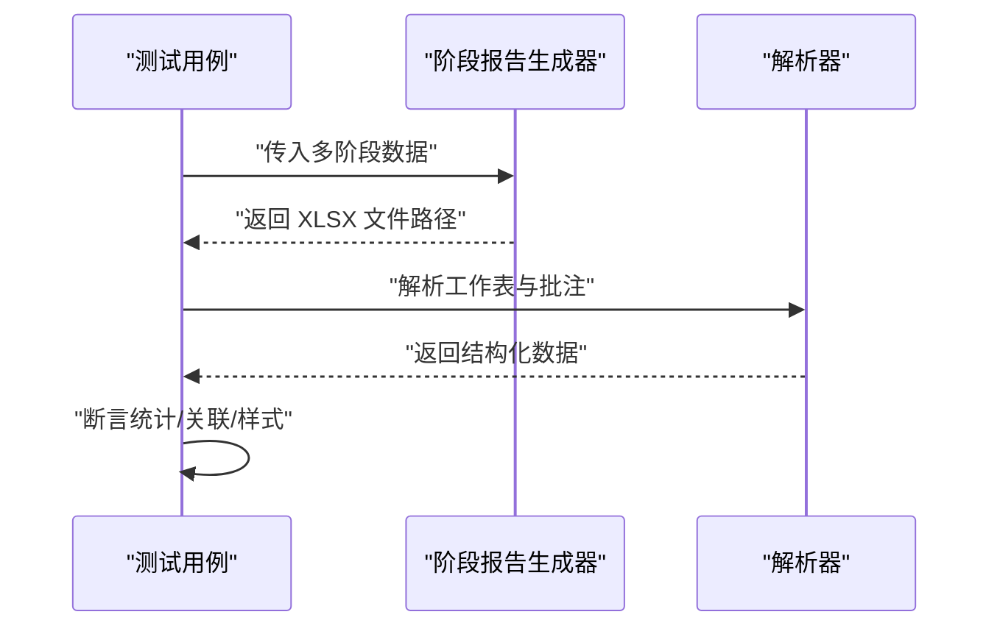
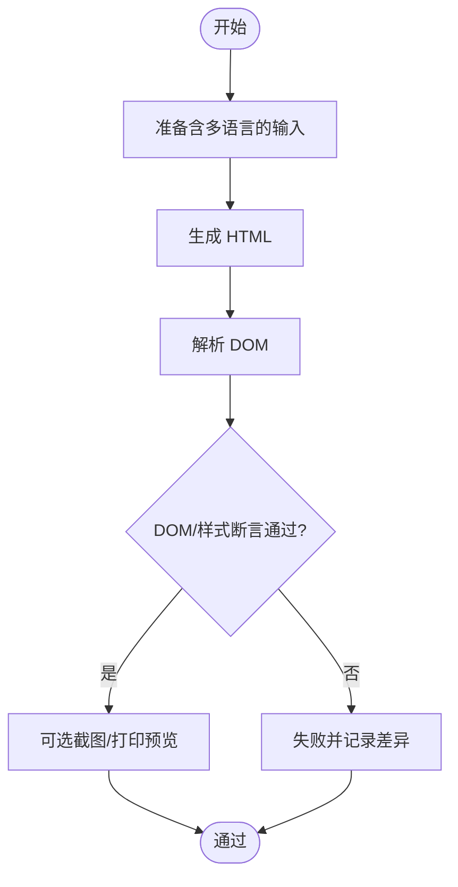
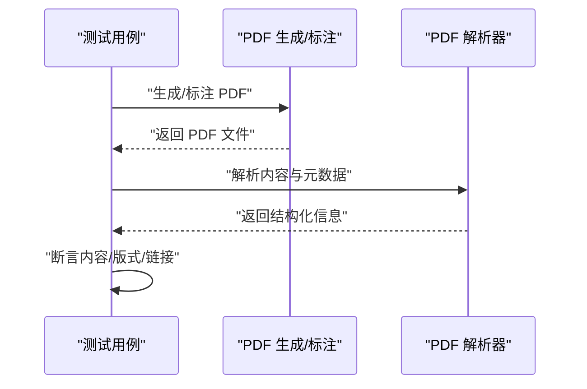
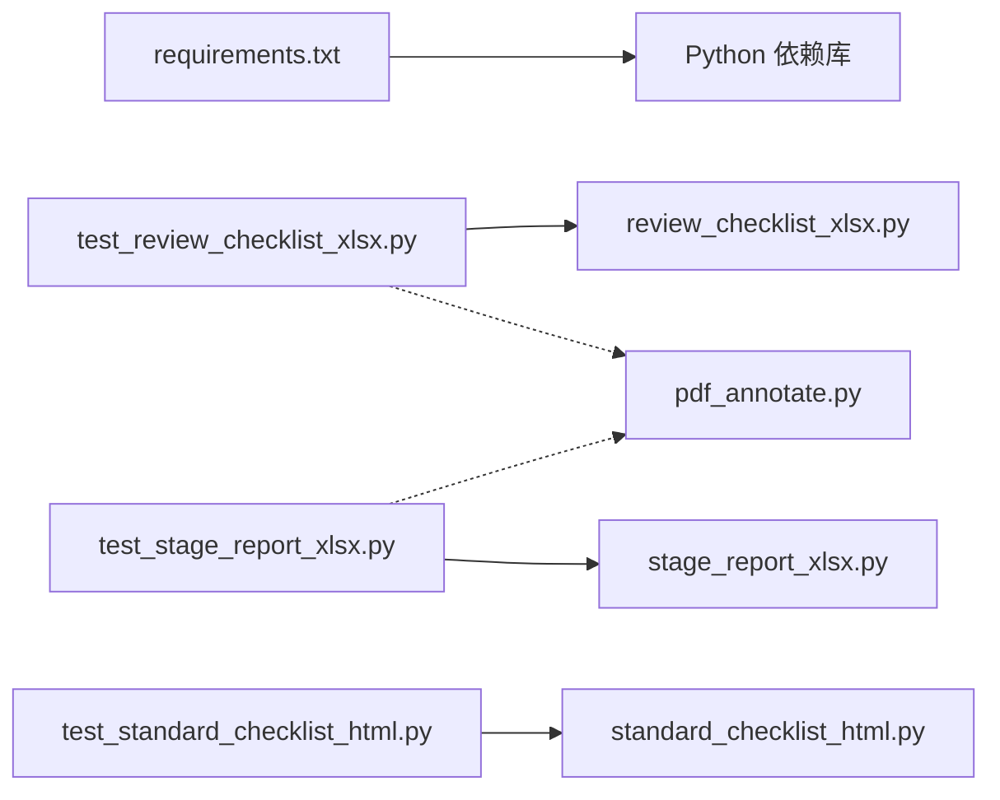

# 报告测试

<cite>
**本文引用的文件**   
- [test_review_checklist_xlsx.py](file://tests/test_review_checklist_xlsx.py)
- [test_stage_report_xlsx.py](file://tests/test_stage_report_xlsx.py)
- [test_standard_checklist_html.py](file://tests/test_standard_checklist_html.py)
- [review_checklist_xlsx.py](file://tools/review_checklist_xlsx.py)
- [stage_report_xlsx.py](file://tools/stage_report_xlsx.py)
- [standard_checklist_html.py](file://tools/standard_checklist_html.py)
- [review_summary_pdf.py](file://tools/pdf_annotate.py)
- [requirements.txt](file://requirements.txt)
</cite>

## 目录
1. [简介](#简介)
2. [项目结构](#项目结构)
3. [核心组件](#核心组件)
4. [架构总览](#架构总览)
5. [详细组件分析](#详细组件分析)
6. [依赖分析](#依赖分析)
7. [性能考虑](#性能考虑)
8. [故障排查指南](#故障排查指南)
9. [结论](#结论)
10. [附录](#附录)

## 简介
本技术文档聚焦“报告测试模块”，围绕三类输出进行系统化测试策略说明：Excel 清单、PDF 摘要与 HTML 标准清单。文档涵盖以下关键主题：
- 报告格式验证（结构、样式、渲染）
- 数据准确性校验（字段映射、计算逻辑、边界条件）
- 模板测试与数据绑定验证
- 国际化支持（多语言文本、区域设置）
- 自动化流程、质量标准与兼容性测试方法
- 具体代码示例路径，便于快速定位实现与用例

## 项目结构
与报告生成和测试相关的核心位置如下：
- 工具层（生成器）：
  - Excel 清单生成：tools/review_checklist_xlsx.py
  - Excel 阶段报告生成：tools/stage_report_xlsx.py
  - HTML 标准清单生成：tools/standard_checklist_html.py
  - PDF 摘要生成：tools/pdf_annotate.py（用于标注/生成摘要）
- 测试层（断言与比较）：
  - Excel 清单测试：tests/test_review_checklist_xlsx.py
  - Excel 阶段报告测试：tests/test_stage_report_xlsx.py
  - HTML 标准清单测试：tests/test_standard_checklist_html.py

**图表来源** 
- [review_checklist_xlsx.py](file://tools/review_checklist_xlsx.py)
- [stage_report_xlsx.py](file://tools/stage_report_xlsx.py)
- [standard_checklist_html.py](file://tools/standard_checklist_html.py)
- [pdf_annotate.py](file://tools/pdf_annotate.py)
- [test_review_checklist_xlsx.py](file://tests/test_review_checklist_xlsx.py)
- [test_stage_report_xlsx.py](file://tests/test_stage_report_xlsx.py)
- [test_standard_checklist_html.py](file://tests/test_standard_checklist_html.py)

**章节来源**
- [requirements.txt](file://requirements.txt)

## 核心组件
- Excel 清单生成器（review_checklist_xlsx.py）
  - 职责：根据规则与输入数据生成结构化 Excel 清单，包含工作表组织、单元格样式、公式与超链接等。
  - 关键点：列定义、数据绑定、样式模板、导出路径与命名规范。
- Excel 阶段报告生成器（stage_report_xlsx.py）
  - 职责：按阶段汇总审查结果，生成阶段性报告，包含统计、趋势与对比视图。
  - 关键点：聚合逻辑、分页/分表、图表或批注嵌入。
- HTML 标准清单生成器（standard_checklist_html.py）
  - 职责：将标准清单渲染为可打印/可交互的 HTML，支持响应式布局与打印样式。
  - 关键点：模板引擎、CSS 样式、国际化文本注入、资源引用。
- PDF 摘要生成器（pdf_annotate.py）
  - 职责：基于输入生成或标注 PDF 摘要，确保版式稳定、内容完整。
  - 关键点：页面布局、字体嵌入、图像/表格处理、书签与索引。

**章节来源**
- [review_checklist_xlsx.py](file://tools/review_checklist_xlsx.py)
- [stage_report_xlsx.py](file://tools/stage_report_xlsx.py)
- [standard_checklist_html.py](file://tools/standard_checklist_html.py)
- [pdf_annotate.py](file://tools/pdf_annotate.py)

## 架构总览
报告测试采用“生成器 + 测试器”的双层架构：
- 生成器负责将业务数据转换为目标格式（XLSX/HTML/PDF）。
- 测试器通过构造输入、调用生成器、解析输出并进行断言，覆盖格式、内容与样式。

**图表来源** 
- [test_review_checklist_xlsx.py](file://tests/test_review_checklist_xlsx.py)
- [test_stage_report_xlsx.py](file://tests/test_stage_report_xlsx.py)
- [test_standard_checklist_html.py](file://tests/test_standard_checklist_html.py)
- [review_checklist_xlsx.py](file://tools/review_checklist_xlsx.py)
- [stage_report_xlsx.py](file://tools/stage_report_xlsx.py)
- [standard_checklist_html.py](file://tools/standard_checklist_html.py)
- [pdf_annotate.py](file://tools/pdf_annotate.py)

## 详细组件分析

### Excel 清单测试（test_review_checklist_xlsx.py）
- 测试目标
  - 验证生成的 Excel 清单包含预期的工作表、列名、数据类型与顺序。
  - 校验数据绑定正确性：字段映射、枚举值、计算公式与超链接。
  - 检查样式：边框、颜色、对齐、冻结窗格、打印设置。
- 典型流程
  - 构造最小化输入数据集。
  - 调用 review_checklist_xlsx 生成 XLSX。
  - 使用库解析 XLSX 并断言结构与内容。
  - 对关键列进行数值范围与一致性检查。
  - 可选：截图或导出片段用于回归比对。
- 常见问题与修复建议
  - 列宽/行高不一致：统一样式模板，增加样式断言。
  - 公式失效：在断言前强制重算或校验公式字符串。
  - 编码问题：确保输入/输出编码一致（UTF-8/BOM）。

**图表来源** 
- [test_review_checklist_xlsx.py](file://tests/test_review_checklist_xlsx.py)
- [review_checklist_xlsx.py](file://tools/review_checklist_xlsx.py)

**章节来源**
- [test_review_checklist_xlsx.py](file://tests/test_review_checklist_xlsx.py)
- [review_checklist_xlsx.py](file://tools/review_checklist_xlsx.py)

### Excel 阶段报告测试（test_stage_report_xlsx.py）
- 测试目标
  - 验证阶段报告的聚合统计、排序与分页是否正确。
  - 校验跨表关联关系（如主表与明细表的外键一致性）。
  - 检查图表/批注是否按预期插入与显示。
- 典型流程
  - 构造多阶段、多项目的复合输入。
  - 调用 stage_report_xlsx 生成报告。
  - 解析各工作表并断言统计口径与合计值。
  - 验证批注/超链接指向的正确性。
- 常见问题与修复建议
  - 统计偏差：核对分组键与过滤条件。
  - 分页错位：调整页眉页脚与分页符设置。
  - 批注丢失：确认对象容器与坐标计算。

**图表来源** 
- [test_stage_report_xlsx.py](file://tests/test_stage_report_xlsx.py)
- [stage_report_xlsx.py](file://tools/stage_report_xlsx.py)

**章节来源**
- [test_stage_report_xlsx.py](file://tests/test_stage_report_xlsx.py)
- [stage_report_xlsx.py](file://tools/stage_report_xlsx.py)

### HTML 标准清单测试（test_standard_checklist_html.py）
- 测试目标
  - 验证 HTML 结构语义化、CSS 样式与打印适配。
  - 检查模板变量替换、国际化文本注入与资源加载。
  - 确保在不同浏览器/渲染引擎下的一致性。
- 典型流程
  - 构造含多语言与复杂排版的输入。
  - 调用 standard_checklist_html 生成 HTML。
  - 解析 DOM 树，断言节点存在性与属性。
  - 运行样式断言（类名、内联样式、外部样式表引用）。
  - 可选：无头浏览器截图进行视觉回归。
- 常见问题与修复建议
  - 模板未替换：检查占位符与上下文传递。
  - 样式错乱：隔离样式作用域，避免全局污染。
  - 国际化缺失：补充翻译键与默认回退。

**图表来源** 
- [test_standard_checklist_html.py](file://tests/test_standard_checklist_html.py)
- [standard_checklist_html.py](file://tools/standard_checklist_html.py)

**章节来源**
- [test_standard_checklist_html.py](file://tests/test_standard_checklist_html.py)
- [standard_checklist_html.py](file://tools/standard_checklist_html.py)

### PDF 摘要测试（结合 pdf_annotate.py）
- 测试目标
  - 验证 PDF 内容完整性、版式稳定性与字体嵌入。
  - 检查批注、书签、目录与超链接有效性。
- 典型流程
  - 构造输入数据与模板。
  - 调用 pdf_annotate 生成或标注 PDF。
  - 解析 PDF 元数据与页面内容，断言关键字段与布局。
  - 打印预览与跨平台兼容性检查。
- 常见问题与修复建议
  - 字体缺失：嵌入字体或使用系统字体回退。
  - 图片失真：控制分辨率与压缩策略。
  - 书签错乱：校准标题层级与锚点。

**图表来源** 
- [pdf_annotate.py](file://tools/pdf_annotate.py)

**章节来源**
- [pdf_annotate.py](file://tools/pdf_annotate.py)

## 依赖分析
- 运行时依赖
  - Python 环境与第三方库由 requirements.txt 管理，确保测试环境一致性。
- 模块耦合
  - 测试模块强依赖对应生成器模块；PDF 测试可能间接依赖 PDF 解析库。
- 外部集成
  - 文件读写、模板引擎、样式渲染与 PDF 处理均为外部能力，需保证版本稳定。

**图表来源** 
- [requirements.txt](file://requirements.txt)
- [test_review_checklist_xlsx.py](file://tests/test_review_checklist_xlsx.py)
- [test_stage_report_xlsx.py](file://tests/test_stage_report_xlsx.py)
- [test_standard_checklist_html.py](file://tests/test_standard_checklist_html.py)
- [review_checklist_xlsx.py](file://tools/review_checklist_xlsx.py)
- [stage_report_xlsx.py](file://tools/stage_report_xlsx.py)
- [standard_checklist_html.py](file://tools/standard_checklist_html.py)
- [pdf_annotate.py](file://tools/pdf_annotate.py)

**章节来源**
- [requirements.txt](file://requirements.txt)

## 性能考虑
- 大数据集生成
  - 分批写入、惰性渲染、减少不必要的样式计算。
- 解析与断言
  - 增量断言，优先校验关键路径；必要时缓存中间结果。
- 并发与并行
  - 测试用例间独立，可并行执行以提升 CI 效率。
- 资源占用
  - 限制内存峰值，避免一次性加载大文件或过多 DOM。

[本节为通用指导，不直接分析具体文件]

## 故障排查指南
- 常见错误定位
  - 生成失败：检查输入校验、模板路径、权限与磁盘空间。
  - 解析失败：确认文件格式与版本兼容，升级解析库。
  - 断言失败：查看差异快照，定位字段缺失或样式异常。
- 调试技巧
  - 启用详细日志，输出中间数据结构。
  - 使用最小复现用例，逐步缩小问题范围。
  - 在本地与 CI 环境分别验证，排除环境差异。
- 恢复措施
  - 回滚到已知稳定的依赖版本。
  - 更新模板与样式以匹配最新规范。
  - 补充缺失的断言与覆盖率用例。

**章节来源**
- [test_review_checklist_xlsx.py](file://tests/test_review_checklist_xlsx.py)
- [test_stage_report_xlsx.py](file://tests/test_stage_report_xlsx.py)
- [test_standard_checklist_html.py](file://tests/test_standard_checklist_html.py)

## 结论
本报告测试模块围绕 Excel 清单、PDF 摘要与 HTML 标准清单形成完整的测试闭环：从数据输入、格式生成、内容解析到样式断言，覆盖功能、质量与兼容性维度。通过明确的测试策略、自动化流程与质量标准，可有效保障报告输出的准确性与一致性，并为后续扩展与维护提供坚实基础。

[本节为总结性内容，不直接分析具体文件]

## 附录
- 自动化流程建议
  - 在 CI 中执行测试套件，收集产物与差异快照。
  - 设定阈值与门禁，阻止不合格构建合并。
- 质量标准
  - 覆盖率、断言完备性、回归通过率与性能指标。
- 兼容性测试
  - 多 Python 版本、多操作系统、多浏览器/渲染引擎。
- 模板与国际化
  - 模板变更需同步更新测试用例；新增语言需补充翻译键与默认回退。

[本节为通用指导，不直接分析具体文件]