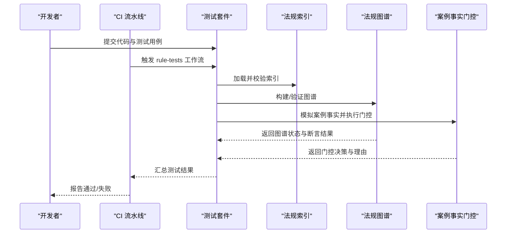
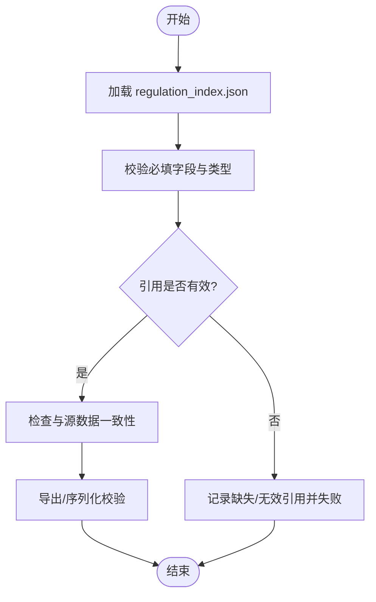
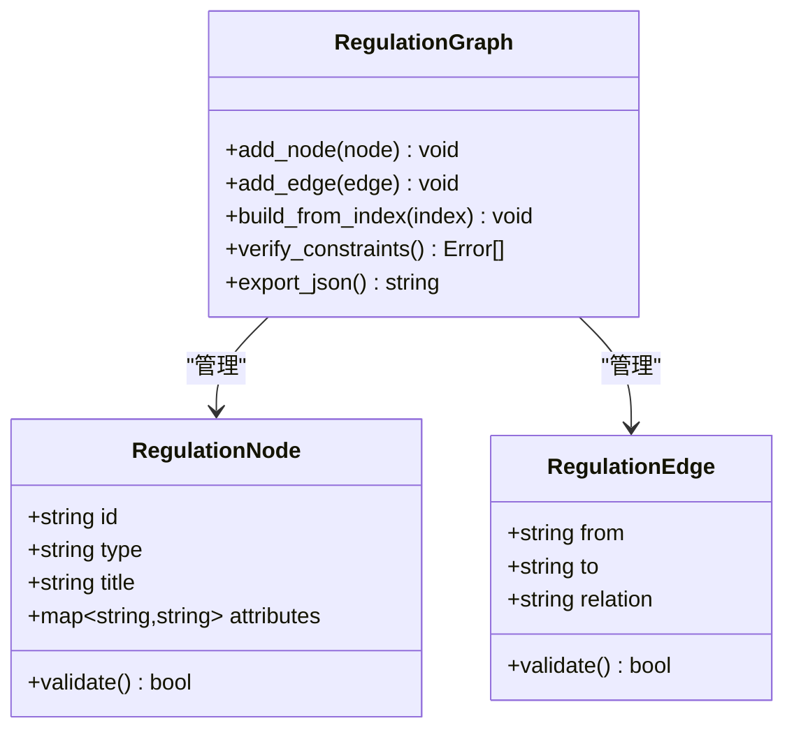
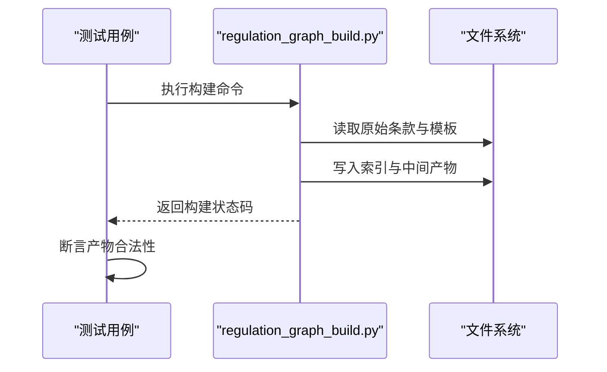
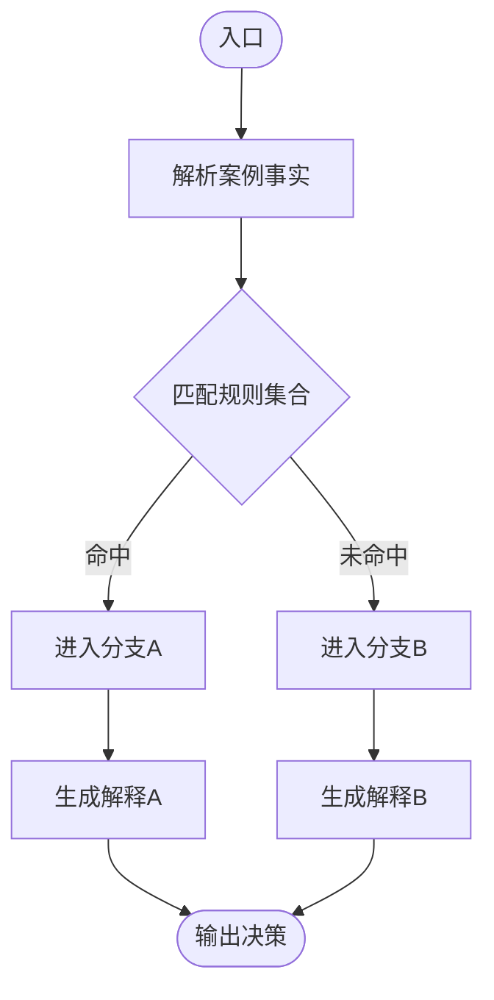
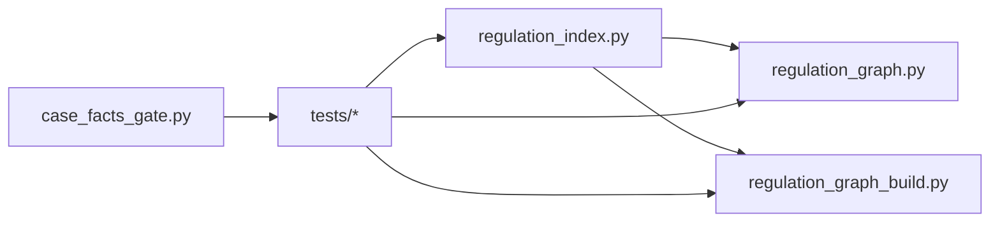

# 法规测试

<cite>
**本文引用的文件**   
- [rules/regulation_index.json](file://rules/regulation_index.json)
- [rules/rule_tests.json](file://rules/rule_tests.json)
- [tools/regulation_graph.py](file://tools/regulation_graph.py)
- [tools/regulation_graph_build.py](file://tools/regulation_graph_build.py)
- [tools/regulation_index.py](file://tools/regulation_index.py)
- [tools/case_facts_gate.py](file://tools/case_facts_gate.py)
- [tests/test_regulation_graph.py](file://tests/test_regulation_graph.py)
- [tests/test_regulation_graph_build.py](file://tests/test_regulation_graph_build.py)
- [tests/test_regulation_index.py](file://tests/test_regulation_index.py)
- [tests/test_case_facts_gate.py](file://tests/test_case_facts_gate.py)
- [.github/workflows/rule-tests.yml](file://.github/workflows/rule-tests.yml)
</cite>

## 目录
1. [简介](#简介)
2. [项目结构](#项目结构)
3. [核心组件](#核心组件)
4. [架构总览](#架构总览)
5. [详细组件分析](#详细组件分析)
6. [依赖关系分析](#依赖关系分析)
7. [性能考量](#性能考量)
8. [故障排查指南](#故障排查指南)
9. [结论](#结论)
10. [附录](#附录)

## 简介
本技术文档围绕“法规测试模块”展开，聚焦以下目标：
- 法规条款验证策略：如何校验条款数据的完整性、关联关系与业务规则。
- 索引构建测试策略：如何验证法规索引的生成与一致性。
- 案例事实门控测试策略：如何模拟并验证案例处理流程中的门控逻辑。
- 法规图谱构建过程测试：如何验证节点、边与引用关系的正确性。
- 数据格式、验证规则与错误处理机制说明。
- 质量保证流程与合规性检查方法。

## 项目结构
与法规测试相关的关键目录与文件：
- rules：存放法规条款数据、索引与测试用例集。
- tools：实现法规图谱构建、索引构建、案例事实门控等工具。
- tests：针对上述工具的单元测试与集成测试。
- .github/workflows：自动化测试流水线配置。

```mermaid
graph TB
subgraph "规则与数据"
RI["regulation_index.json"]
RT["rule_tests.json"]
end
subgraph "工具实现"
RG["regulation_graph.py"]
RGB["regulation_graph_build.py"]
RIdx["regulation_index.py"]
CFG["case_facts_gate.py"]
end
subgraph "测试"
T_RG["test_regulation_graph.py"]
T_RGB["test_regulation_graph_build.py"]
T_RIdx["test_regulation_index.py"]
T_CFG["test_case_facts_gate.py"]
end
subgraph "CI"
CI[".github/workflows/rule-tests.yml"]
end
RI --> RIdx
RT --> T_RG
RT --> T_RGB
RT --> T_RIdx
RT --> T_CFG
RIdx --> RG
RIdx --> RGB
RG --> T_RG
RGB --> T_RGB
RIdx --> T_RIdx
CFG --> T_CFG
CI --> T_RG
CI --> T_RGB
CI --> T_RIdx
CI --> T_CFG
```

**图示来源** 
- [rules/regulation_index.json](file://rules/regulation_index.json)
- [rules/rule_tests.json](file://rules/rule_tests.json)
- [tools/regulation_graph.py](file://tools/regulation_graph.py)
- [tools/regulation_graph_build.py](file://tools/regulation_graph_build.py)
- [tools/regulation_index.py](file://tools/regulation_index.py)
- [tools/case_facts_gate.py](file://tools/case_facts_gate.py)
- [tests/test_regulation_graph.py](file://tests/test_regulation_graph.py)
- [tests/test_regulation_graph_build.py](file://tests/test_regulation_graph_build.py)
- [tests/test_regulation_index.py](file://tests/test_regulation_index.py)
- [tests/test_case_facts_gate.py](file://tests/test_case_facts_gate.py)
- [.github/workflows/rule-tests.yml](file://.github/workflows/rule-tests.yml)

**章节来源**
- [rules/regulation_index.json](file://rules/regulation_index.json)
- [rules/rule_tests.json](file://rules/rule_tests.json)
- [tools/regulation_graph.py](file://tools/regulation_graph.py)
- [tools/regulation_graph_build.py](file://tools/regulation_graph_build.py)
- [tools/regulation_index.py](file://tools/regulation_index.py)
- [tools/case_facts_gate.py](file://tools/case_facts_gate.py)
- [tests/test_regulation_graph.py](file://tests/test_regulation_graph.py)
- [tests/test_regulation_graph_build.py](file://tests/test_regulation_graph_build.py)
- [tests/test_regulation_index.py](file://tests/test_regulation_index.py)
- [tests/test_case_facts_gate.py](file://tests/test_case_facts_gate.py)
- [.github/workflows/rule-tests.yml](file://.github/workflows/rule-tests.yml)

## 核心组件
- 法规索引（Regulation Index）
  - 职责：维护法规条款的元数据、版本、适用场景与引用关系，支撑后续图谱构建与查询。
  - 关键能力：索引读取、校验、导出与一致性检查。
- 法规图谱（Regulation Graph）
  - 职责：将条款、设备、场所、面积阈值、引用关系建模为图结构，支持遍历与推理。
  - 关键能力：节点/边构建、引用解析、连通性与完整性校验。
- 索引构建（Index Build）
  - 职责：从原始条款数据生成或更新索引，确保字段完整、类型正确、引用有效。
- 案例事实门控（Case Facts Gate）
  - 职责：基于输入案例事实进行门控判断，决定进入哪条审查路径或触发哪些规则。
  - 关键能力：事实抽取、条件匹配、分支决策、可解释输出。

**章节来源**
- [tools/regulation_index.py](file://tools/regulation_index.py)
- [tools/regulation_graph.py](file://tools/regulation_graph.py)
- [tools/regulation_graph_build.py](file://tools/regulation_graph_build.py)
- [tools/case_facts_gate.py](file://tools/case_facts_gate.py)

## 架构总览
下图展示了法规测试的整体架构与数据流：索引驱动图谱构建，测试套件覆盖各工具；CI 自动执行测试以保障质量。



**图示来源**
- [.github/workflows/rule-tests.yml](file://.github/workflows/rule-tests.yml)
- [tools/regulation_index.py](file://tools/regulation_index.py)
- [tools/regulation_graph.py](file://tools/regulation_graph.py)
- [tools/case_facts_gate.py](file://tools/case_facts_gate.py)
- [tests/test_regulation_index.py](file://tests/test_regulation_index.py)
- [tests/test_regulation_graph.py](file://tests/test_regulation_graph.py)
- [tests/test_case_facts_gate.py](file://tests/test_case_facts_gate.py)

## 详细组件分析

### 法规索引构建与验证
- 目标
  - 验证索引文件的结构与字段完整性。
  - 校验条款间引用关系的有效性（无悬空引用）。
  - 保证索引与原始条款数据的一致性。
- 关键测试点
  - 必填字段存在性与类型正确性。
  - 引用键值在索引内自洽。
  - 版本号与时间戳语义合理。
  - 导出/导入往返一致。
- 典型流程
  - 读取索引 → 字段校验 → 引用解析 → 一致性检查 → 断言通过/失败。



**图示来源**
- [tools/regulation_index.py](file://tools/regulation_index.py)
- [tests/test_regulation_index.py](file://tests/test_regulation_index.py)
- [rules/regulation_index.json](file://rules/regulation_index.json)

**章节来源**
- [tools/regulation_index.py](file://tools/regulation_index.py)
- [tests/test_regulation_index.py](file://tests/test_regulation_index.py)
- [rules/regulation_index.json](file://rules/regulation_index.json)

### 法规图谱构建与验证
- 目标
  - 验证图谱节点（条款、设备、场所、阈值等）与边（引用、依赖、包含）的正确性。
  - 确保图谱连通性与可达性满足业务预期。
  - 检测循环依赖与孤立节点。
- 关键测试点
  - 节点属性完整性（ID、名称、类型、版本等）。
  - 边的语义正确性（from→to 指向合法节点）。
  - 特定业务规则的约束（如面积阈值与设备类型的对应关系）。
  - 增量构建与全量构建结果一致。
- 典型流程
  - 读取索引 → 解析条款 → 构建节点/边 → 运行约束校验 → 输出图谱状态。



**图示来源**
- [tools/regulation_graph.py](file://tools/regulation_graph.py)
- [tests/test_regulation_graph.py](file://tests/test_regulation_graph.py)

**章节来源**
- [tools/regulation_graph.py](file://tools/regulation_graph.py)
- [tests/test_regulation_graph.py](file://tests/test_regulation_graph.py)

### 索引构建工具测试
- 目标
  - 验证从原始条款到索引的构建过程稳定可靠。
  - 确保构建产物可通过下游工具消费。
- 关键测试点
  - 构建前后索引哈希/指纹变化符合预期。
  - 构建日志包含必要信息且无异常。
  - 构建失败时提供清晰的错误定位。
- 典型流程
  - 准备输入 → 调用构建脚本 → 断言输出文件存在与内容合法 → 清理临时文件。



**图示来源**
- [tools/regulation_graph_build.py](file://tools/regulation_graph_build.py)
- [tests/test_regulation_graph_build.py](file://tests/test_regulation_graph_build.py)

**章节来源**
- [tools/regulation_graph_build.py](file://tools/regulation_graph_build.py)
- [tests/test_regulation_graph_build.py](file://tests/test_regulation_graph_build.py)

### 案例事实门控测试
- 目标
  - 验证基于案例事实的门控逻辑能正确分流到不同审查路径。
  - 确保门控决策具备可解释性与可追溯性。
- 关键测试点
  - 事实字段的取值范围与默认值。
  - 条件组合覆盖充分（边界值、异常值）。
  - 输出包含决策依据与命中规则。
- 典型流程
  - 构造案例事实 → 调用门控函数 → 断言分支结果 → 校验解释信息。



**图示来源**
- [tools/case_facts_gate.py](file://tools/case_facts_gate.py)
- [tests/test_case_facts_gate.py](file://tests/test_case_facts_gate.py)

**章节来源**
- [tools/case_facts_gate.py](file://tools/case_facts_gate.py)
- [tests/test_case_facts_gate.py](file://tests/test_case_facts_gate.py)

### 测试数据格式与验证规则
- 测试数据
  - 规则测试集：用于驱动各工具的行为验证，覆盖正常、边界与异常场景。
  - 索引样例：用于校验索引结构与字段语义。
- 验证规则
  - 字段完整性：必填项不可为空，类型需匹配。
  - 引用有效性：所有外键/引用必须指向存在的实体。
  - 业务约束：如面积阈值与设备类别的映射、场所分类与条款适用性。
- 错误处理
  - 结构化错误消息：包含字段名、期望类型、实际值与上下文。
  - 失败快速定位：对索引/图谱/门控分别给出错误摘要与堆栈。

**章节来源**
- [rules/rule_tests.json](file://rules/rule_tests.json)
- [rules/regulation_index.json](file://rules/regulation_index.json)
- [tools/regulation_index.py](file://tools/regulation_index.py)
- [tools/regulation_graph.py](file://tools/regulation_graph.py)
- [tools/case_facts_gate.py](file://tools/case_facts_gate.py)

### 代码示例与断言要点（路径指引）
- 验证法规图谱构建过程
  - 参考测试用例路径：[tests/test_regulation_graph.py](file://tests/test_regulation_graph.py)
  - 关注断言：节点数量、边数量、关键引用存在性、约束检查结果。
- 检查条款引用关系
  - 参考测试用例路径：[tests/test_regulation_index.py](file://tests/test_regulation_index.py)
  - 关注断言：引用键集合闭合、无悬空引用、版本兼容。
- 模拟案例处理流程
  - 参考测试用例路径：[tests/test_case_facts_gate.py](file://tests/test_case_facts_gate.py)
  - 关注断言：分支选择、解释文本非空、边界条件覆盖。

**章节来源**
- [tests/test_regulation_graph.py](file://tests/test_regulation_graph.py)
- [tests/test_regulation_index.py](file://tests/test_regulation_index.py)
- [tests/test_case_facts_gate.py](file://tests/test_case_facts_gate.py)

## 依赖关系分析
- 组件耦合
  - 索引是图谱构建的前置依赖；门控独立于图谱但共享部分领域知识。
  - 测试套件对工具形成强依赖，需保持接口稳定。
- 外部依赖
  - 文件系统读写、JSON 序列化/反序列化、可选的日志/调试输出。
- 潜在循环依赖
  - 避免在索引与图谱之间互相直接导入，建议通过工具层解耦。



**图示来源**
- [tools/regulation_index.py](file://tools/regulation_index.py)
- [tools/regulation_graph.py](file://tools/regulation_graph.py)
- [tools/regulation_graph_build.py](file://tools/regulation_graph_build.py)
- [tools/case_facts_gate.py](file://tools/case_facts_gate.py)
- [tests/test_regulation_index.py](file://tests/test_regulation_index.py)
- [tests/test_regulation_graph.py](file://tests/test_regulation_graph.py)
- [tests/test_regulation_graph_build.py](file://tests/test_regulation_graph_build.py)
- [tests/test_case_facts_gate.py](file://tests/test_case_facts_gate.py)

**章节来源**
- [tools/regulation_index.py](file://tools/regulation_index.py)
- [tools/regulation_graph.py](file://tools/regulation_graph.py)
- [tools/regulation_graph_build.py](file://tools/regulation_graph_build.py)
- [tools/case_facts_gate.py](file://tools/case_facts_gate.py)
- [tests/test_regulation_index.py](file://tests/test_regulation_index.py)
- [tests/test_regulation_graph.py](file://tests/test_regulation_graph.py)
- [tests/test_regulation_graph_build.py](file://tests/test_regulation_graph_build.py)
- [tests/test_case_facts_gate.py](file://tests/test_case_facts_gate.py)

## 性能考量
- 索引规模增长时的构建与校验耗时控制：分块校验、增量更新。
- 图谱构建的内存占用：按需加载、延迟计算、避免重复解析。
- 测试并行化：隔离测试数据、避免共享状态导致的竞争。
- I/O 优化：批量读写、缓存热点数据、减少磁盘抖动。

## 故障排查指南
- 常见问题
  - 索引字段缺失或类型不匹配：检查 schema 定义与数据录入规范。
  - 引用悬空或循环依赖：使用图谱校验工具定位问题节点。
  - 门控分支不符合预期：核对事实字段取值范围与规则优先级。
- 诊断步骤
  - 启用详细日志，捕获构建/校验过程中的中间状态。
  - 最小化复现实例：抽取最小数据集重放问题。
  - 对比基线快照：确认变更引入的差异点。
- 恢复措施
  - 回滚至上一稳定版本索引/图谱。
  - 修正数据后重新构建并运行回归测试。

**章节来源**
- [tools/regulation_index.py](file://tools/regulation_index.py)
- [tools/regulation_graph.py](file://tools/regulation_graph.py)
- [tools/case_facts_gate.py](file://tools/case_facts_gate.py)

## 结论
本测试体系围绕“索引—图谱—门控”的核心链路，提供了从数据完整性、关联关系到业务规则的全面验证。通过明确的测试数据格式、严格的验证规则与完善的错误处理机制，配合 CI 自动化流水线，能够有效保障法规测试的质量与合规性。

## 附录
- 质量保证流程
  - 本地开发阶段：运行单测与集成测试，确保新增/修改功能通过。
  - 代码评审：关注接口契约、错误处理与可测试性。
  - CI 流水线：统一执行 rule-tests，阻断不合格合并。
- 合规性检查方法
  - 字段级合规：必填、枚举、范围、格式。
  - 关系级合规：引用完整性、版本兼容性。
  - 业务级合规：阈值映射、场所分类、设备类型约束。
- 常用命令与入口
  - 运行测试：通过 CI 或本地测试框架执行 tests 目录下的用例。
  - 构建索引/图谱：调用 tools 下对应脚本，观察输出与日志。