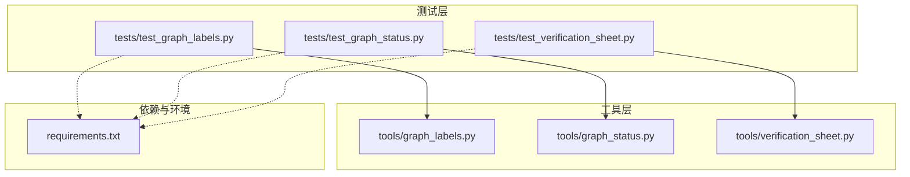
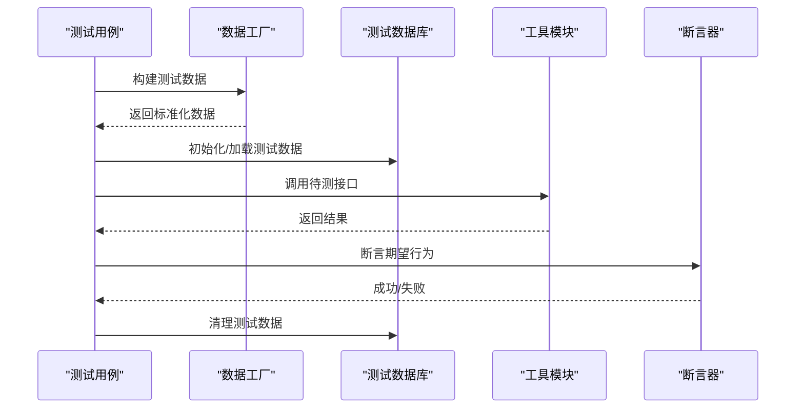
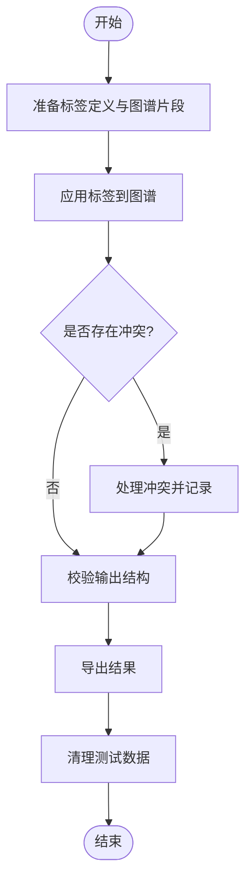
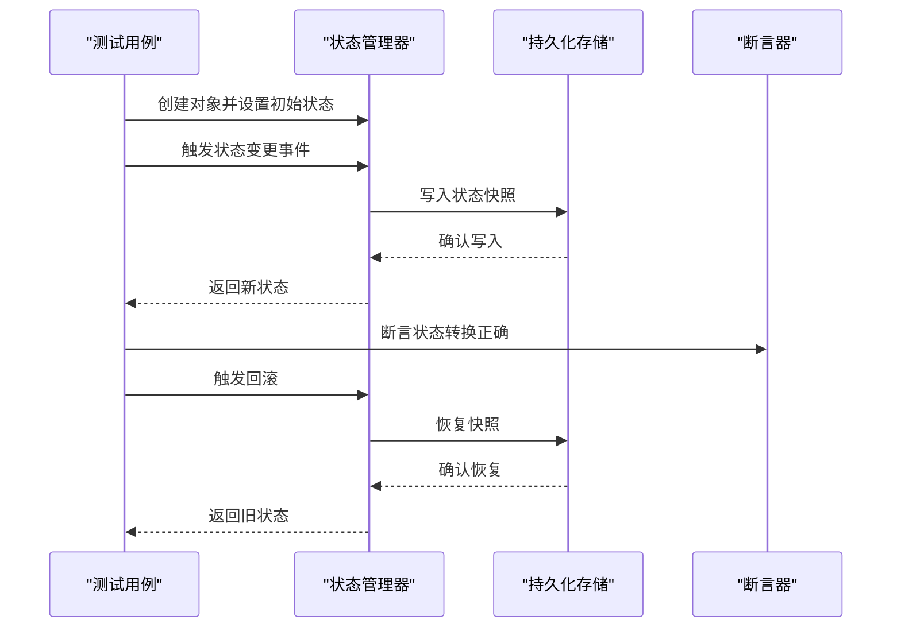
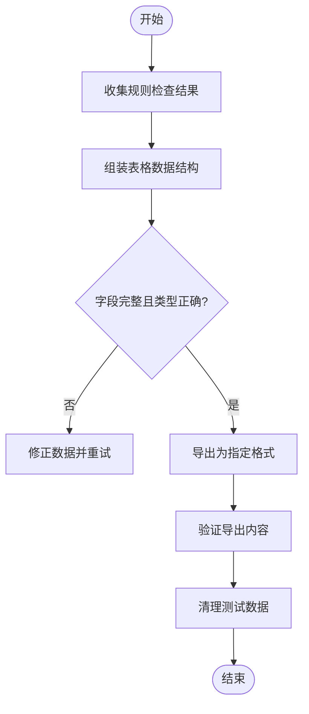
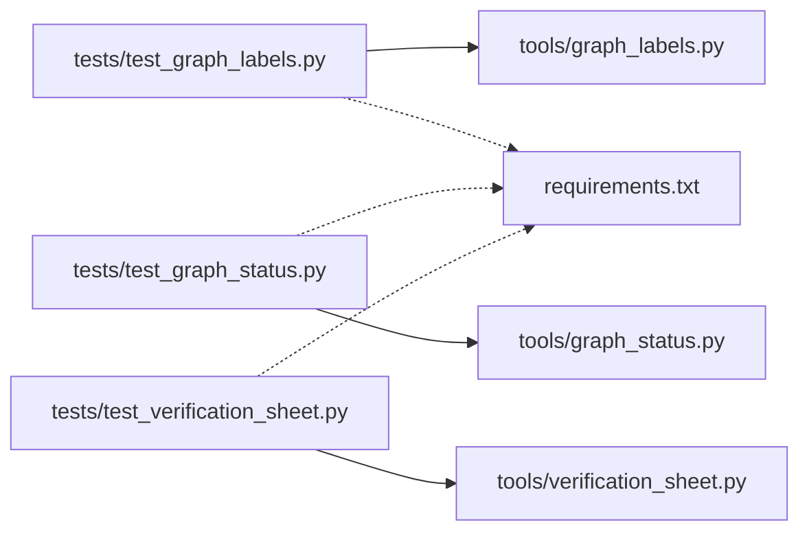

# 测试基础设施

<cite>
**本文引用的文件**   
- [tests/test_graph_labels.py](file://tests/test_graph_labels.py)
- [tests/test_graph_status.py](file://tests/test_graph_status.py)
- [tests/test_verification_sheet.py](file://tests/test_verification_sheet.py)
- [tools/graph_labels.py](file://tools/graph_labels.py)
- [tools/graph_status.py](file://tools/graph_status.py)
- [tools/verification_sheet.py](file://tools/verification_sheet.py)
- [requirements.txt](file://requirements.txt)
</cite>

## 目录
1. [简介](#简介)
2. [项目结构](#项目结构)
3. [核心组件](#核心组件)
4. [架构总览](#架构总览)
5. [详细组件分析](#详细组件分析)
6. [依赖分析](#依赖分析)
7. [性能考虑](#性能考虑)
8. [故障排除指南](#故障排除指南)
9. [结论](#结论)
10. [附录](#附录)

## 简介
本技术文档面向测试基础设施，聚焦于测试环境配置、数据工厂与模拟服务的搭建方法，并围绕“图谱标签”“状态管理”“验证表”三大功能提供可操作的测试实践。文档涵盖如何设置测试数据库、加载测试数据与清理测试环境，记录测试配置管理、环境变量与依赖注入策略，并提供扩展方法、性能优化建议与常见问题的排查路径。

## 项目结构
本项目采用“工具模块 + 测试用例”的清晰分层：
- tools 目录包含业务工具实现（如图谱标签、状态管理、验证表生成等）。
- tests 目录包含对应的单元测试与集成测试，覆盖上述工具的输入输出、边界条件与异常场景。
- requirements.txt 声明运行与测试所需依赖。

图表来源
- [tests/test_graph_labels.py](file://tests/test_graph_labels.py)
- [tests/test_graph_status.py](file://tests/test_graph_status.py)
- [tests/test_verification_sheet.py](file://tests/test_verification_sheet.py)
- [tools/graph_labels.py](file://tools/graph_labels.py)
- [tools/graph_status.py](file://tools/graph_status.py)
- [tools/verification_sheet.py](file://tools/verification_sheet.py)
- [requirements.txt](file://requirements.txt)

章节来源
- [requirements.txt](file://requirements.txt)

## 核心组件
- 图谱标签（Graph Labels）：用于对图谱节点或边进行标注、分类与校验，测试需覆盖标签映射、冲突检测与导出结果一致性。
- 状态管理（Graph Status）：负责图谱对象的生命周期状态流转与持久化，测试需覆盖状态转换规则、回滚与并发安全。
- 验证表（Verification Sheet）：将规则检查结果汇总为表格，测试需覆盖数据组装、格式校验与导出稳定性。

章节来源
- [tools/graph_labels.py](file://tools/graph_labels.py)
- [tools/graph_status.py](file://tools/graph_status.py)
- [tools/verification_sheet.py](file://tools/verification_sheet.py)

## 架构总览
测试架构遵循“隔离、可重复、快速反馈”的原则：
- 每个测试用例通过独立的数据工厂构造最小数据集，避免跨用例污染。
- 使用内存或临时存储作为测试数据库，确保测试前后环境一致。
- 通过夹具（fixtures）集中管理配置、环境变量与依赖注入，减少样板代码。

图表来源
- [tests/test_graph_labels.py](file://tests/test_graph_labels.py)
- [tests/test_graph_status.py](file://tests/test_graph_status.py)
- [tests/test_verification_sheet.py](file://tests/test_verification_sheet.py)

## 详细组件分析

### 图谱标签测试（Graph Labels）
- 目标：验证标签映射、冲突检测、导出结果的完整性与一致性。
- 关键流程：
  - 准备标签定义与图谱片段。
  - 执行标签应用与冲突解析。
  - 校验输出结构与内容。
  - 清理临时数据。

图表来源
- [tests/test_graph_labels.py](file://tests/test_graph_labels.py)
- [tools/graph_labels.py](file://tools/graph_labels.py)

章节来源
- [tests/test_graph_labels.py](file://tests/test_graph_labels.py)
- [tools/graph_labels.py](file://tools/graph_labels.py)

### 状态管理测试（Graph Status）
- 目标：验证状态机转换规则、回滚机制与持久化一致性。
- 关键流程：
  - 初始化图谱对象与初始状态。
  - 触发状态变更事件。
  - 验证状态转换合法性与副作用。
  - 检查持久化快照与回滚能力。

图表来源
- [tests/test_graph_status.py](file://tests/test_graph_status.py)
- [tools/graph_status.py](file://tools/graph_status.py)

章节来源
- [tests/test_graph_status.py](file://tests/test_graph_status.py)
- [tools/graph_status.py](file://tools/graph_status.py)

### 验证表测试（Verification Sheet）
- 目标：验证规则检查结果的汇总、格式化与导出稳定性。
- 关键流程：
  - 收集规则检查结果。
  - 组装为表格数据结构。
  - 校验字段完整性与类型。
  - 导出为指定格式并验证内容。

图表来源
- [tests/test_verification_sheet.py](file://tests/test_verification_sheet.py)
- [tools/verification_sheet.py](file://tools/verification_sheet.py)

章节来源
- [tests/test_verification_sheet.py](file://tests/test_verification_sheet.py)
- [tools/verification_sheet.py](file://tools/verification_sheet.py)

## 依赖分析
- 测试框架与断言库：由 requirements.txt 统一声明，确保本地与 CI 环境一致。
- 工具模块依赖：各工具模块仅依赖必要的运行时库，测试中通过夹具替换外部依赖（如文件系统、网络请求）。
- 环境变量：测试通过环境变量控制数据库连接、日志级别与特性开关，便于在不同环境中切换行为。

图表来源
- [tests/test_graph_labels.py](file://tests/test_graph_labels.py)
- [tests/test_graph_status.py](file://tests/test_graph_status.py)
- [tests/test_verification_sheet.py](file://tests/test_verification_sheet.py)
- [tools/graph_labels.py](file://tools/graph_labels.py)
- [tools/graph_status.py](file://tools/graph_status.py)
- [tools/verification_sheet.py](file://tools/verification_sheet.py)
- [requirements.txt](file://requirements.txt)

章节来源
- [requirements.txt](file://requirements.txt)

## 性能考虑
- 数据工厂最小化：仅生成必要字段，避免冗余数据导致 I/O 与序列化开销。
- 内存数据库优先：在单元测试中使用内存存储替代磁盘 I/O，提升执行速度。
- 并行测试隔离：确保测试间无共享状态，支持并行执行以缩短整体耗时。
- 缓存策略：对不可变配置或规则集进行一次性加载与缓存，避免重复计算。

[本节为通用指导，不直接分析具体文件]

## 故障排除指南
- 测试数据未清理：检查测试夹具的 teardown 逻辑，确保每次测试后删除临时数据。
- 依赖缺失或版本冲突：核对 requirements.txt 与实际安装版本，必要时使用虚拟环境隔离。
- 环境变量未生效：确认测试启动前已正确设置环境变量，并在测试中打印关键变量进行调试。
- 导入错误：检查模块路径与包结构，确保测试能正确导入工具模块。

章节来源
- [tests/test_graph_labels.py](file://tests/test_graph_labels.py)
- [tests/test_graph_status.py](file://tests/test_graph_status.py)
- [tests/test_verification_sheet.py](file://tests/test_verification_sheet.py)

## 结论
本测试基础设施以清晰的模块化设计与严格的测试隔离为核心，围绕图谱标签、状态管理与验证表三大功能提供了完整的测试覆盖。通过数据工厂、内存数据库与夹具管理，实现了高内聚、低耦合的测试体系。建议在后续迭代中持续完善性能监控与自动化回归，进一步提升测试效率与可靠性。

[本节为总结性内容，不直接分析具体文件]

## 附录
- 测试环境搭建步骤：
  - 安装依赖：根据 requirements.txt 安装所需库。
  - 配置环境变量：设置数据库连接、日志级别等关键参数。
  - 运行测试：使用测试框架执行全部用例，观察输出与报告。
- 扩展方法：
  - 新增工具模块时，同步添加对应测试用例与数据工厂。
  - 引入外部服务时，使用模拟服务替换真实依赖，确保测试可重复。
- 最佳实践：
  - 保持测试数据最小化与确定性。
  - 使用夹具集中管理配置与依赖注入。
  - 定期审查测试覆盖率与性能指标。

[本节为补充信息，不直接分析具体文件]