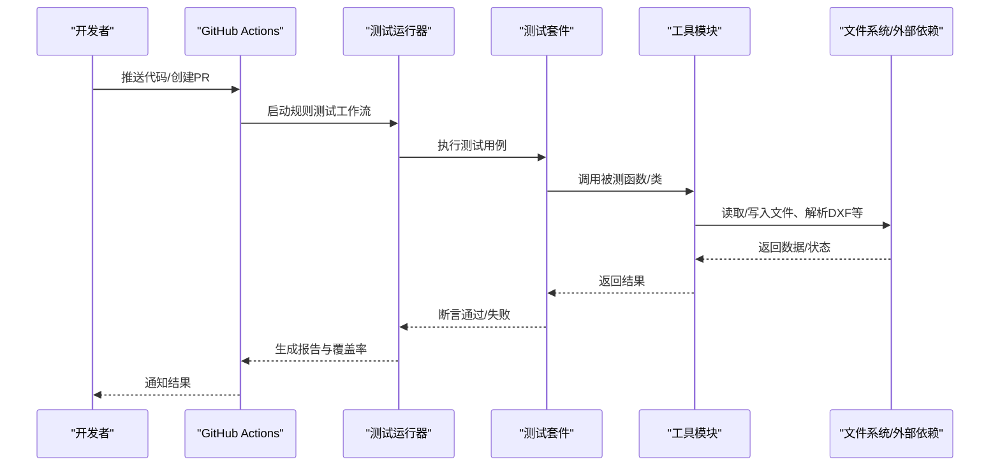
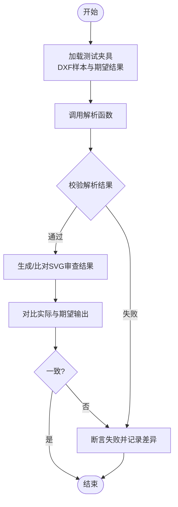
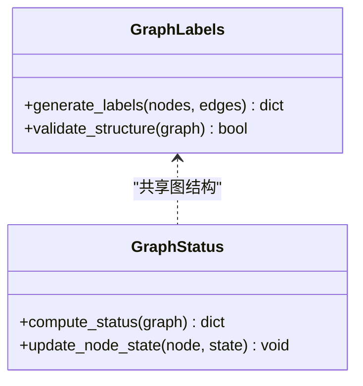
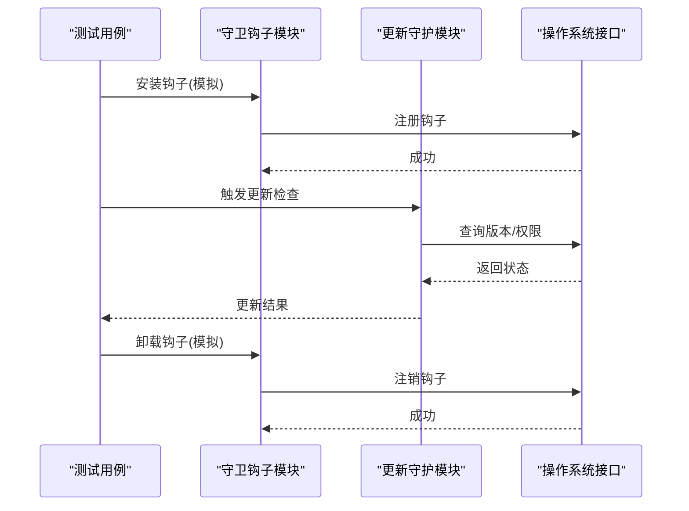
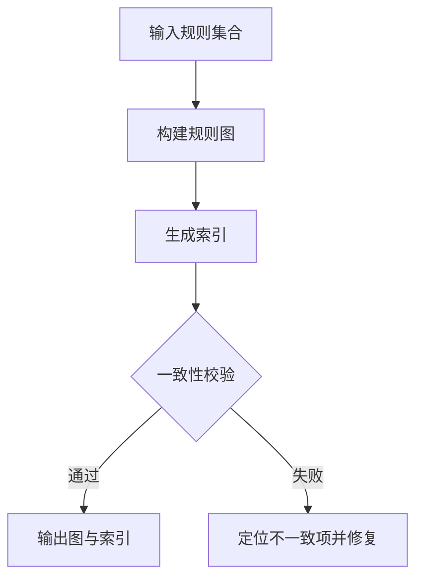
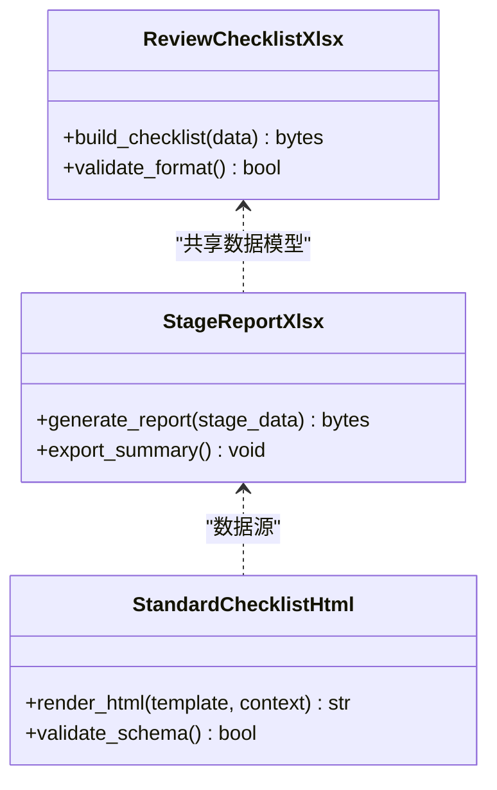
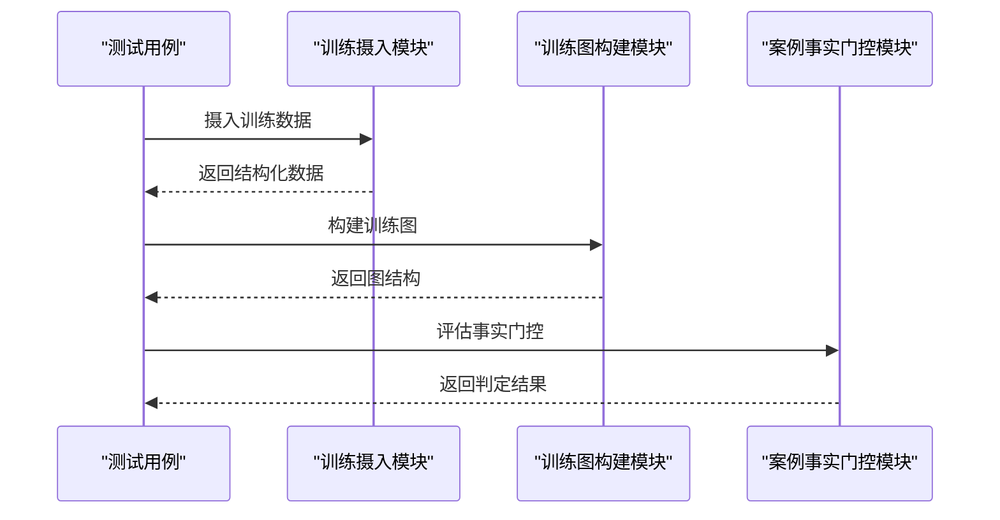
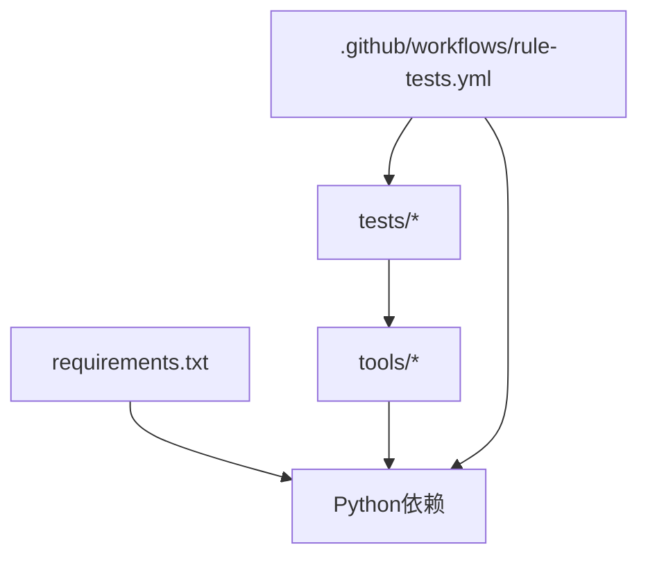

# 测试框架

<cite>
**本文引用的文件**   
- [tests/test_check_env.py](file://tests/test_check_env.py)
- [tests/test_console_encoding.py](file://tests/test_console_encoding.py)
- [tests/test_dwg_guide.py](file://tests/test_dwg_guide.py)
- [tests/test_dxf_parse.py](file://tests/test_dxf_parse.py)
- [tests/test_dxf_svg_review.py](file://tests/test_dxf_svg_review.py)
- [tests/test_graph_labels.py](file://tests/test_graph_labels.py)
- [tests/test_graph_status.py](file://tests/test_graph_status.py)
- [tests/test_guard_hook.py](file://tests/test_guard_hook.py)
- [tests/test_installer.py](file://tests/test_installer.py)
- [tests/test_make_release.py](file://tests/test_make_release.py)
- [tests/test_onboarding.py](file://tests/test_onboarding.py)
- [tests/test_pending_review.py](file://tests/test_pending_review.py)
- [tests/test_practice_note_engine.py](file://tests/test_practice_note_engine.py)
- [tests/test_practice_note_graph.py](file://tests/test_practice_note_graph.py)
- [tests/test_regulation_graph.py](file://tests/test_regulation_graph.py)
- [tests/test_regulation_graph_build.py](file://tests/test_regulation_graph_build.py)
- [tests/test_regulation_index.py](file://tests/test_regulation_index.py)
- [tests/test_review_checklist_xlsx.py](file://tests/test_review_checklist_xlsx.py)
- [tests/test_stage_report_xlsx.py](file://tests/test_stage_report_xlsx.py)
- [tests/test_standard_checklist_html.py](file://tests/test_standard_checklist_html.py)
- [tests/test_training_graph_build.py](file://tests/test_training_graph_build.py)
- [tests/test_training_intake.py](file://tests/test_training_intake.py)
- [tests/test_update_guard.py](file://tests/test_update_guard.py)
- [tests/test_update_guard_install.py](file://tests/test_update_guard_install.py)
- [tests/test_verification_sheet.py](file://tests/test_verification_sheet.py)
- [tests/test_case_facts_gate.py](file://tests/test_case_facts_gate.py)
- [tools/dxf_parse.py](file://tools/dxf_parse.py)
- [tools/dxf_svg_review.py](file://tools/dxf_svg_review.py)
- [tools/graph_labels.py](file://tools/graph_labels.py)
- [tools/graph_status.py](file://tools/graph_status.py)
- [tools/guard_hook.py](file://tools/guard_hook.py)
- [tools/make_sfx.py](file://tools/make_sfx.py)
- [tools/practice_note_engine.py](file://tools/practice_note_engine.py)
- [tools/regulation_graph.py](file://tools/regulation_graph.py)
- [tools/regulation_graph_build.py](file://tools/regulation_graph_build.py)
- [tools/regulation_index.py](file://tools/regulation_index.py)
- [tools/review_checklist_xlsx.py](file://tools/review_checklist_xlsx.py)
- [tools/stage_report_xlsx.py](file://tools/stage_report_xlsx.py)
- [tools/standard_checklist_html.py](file://tools/standard_checklist_html.py)
- [tools/training_intake.py](file://tools/training_intake.py)
- [tools/update_guard.py](file://tools/update_guard.py)
- [tools/verification_sheet.py](file://tools/verification_sheet.py)
- [tools/case_facts_gate.py](file://tools/case_facts_gate.py)
- [.github/workflows/rule-tests.yml](file://.github/workflows/rule-tests.yml)
- [.github/workflows/release.yml](file://.github/workflows/release.yml)
- [requirements.txt](file://requirements.txt)
</cite>

## 目录
1. [简介](#简介)
2. [项目结构](#项目结构)
3. [核心组件](#核心组件)
4. [架构总览](#架构总览)
5. [详细组件分析](#详细组件分析)
6. [依赖分析](#依赖分析)
7. [性能考虑](#性能考虑)
8. [故障排查指南](#故障排查指南)
9. [结论](#结论)
10. [附录](#附录)

## 简介
本技术文档面向“绘图审查”项目的测试框架，系统性说明测试用例的组织结构、执行策略与覆盖率统计方法；阐述单元测试、集成测试与端到端测试的实现方式；提供编写新测试用例、模拟外部依赖与验证系统行为的实践指南；并记录测试数据管理、环境配置与持续集成流程。同时给出与开发工作流集成的建议和质量保证机制，以及测试驱动开发与调试技巧的最佳实践。

## 项目结构
测试代码集中于 tests 目录，采用按功能模块划分的命名约定：每个工具或子系统对应一个或多个 test_*.py 文件，便于定位与维护。被测工具位于 tools 目录，测试通过导入或直接调用这些工具模块来验证行为。持续集成脚本位于 .github/workflows，用于在提交或发布时自动运行规则相关测试与构建流程。

```mermaid
graph TB
subgraph "测试"
T1["tests/test_check_env.py"]
T2["tests/test_console_encoding.py"]
T3["tests/test_dxf_parse.py"]
T4["tests/test_dxf_svg_review.py"]
T5["tests/test_graph_labels.py"]
T6["tests/test_graph_status.py"]
T7["tests/test_guard_hook.py"]
T8["tests/test_installer.py"]
T9["tests/test_make_release.py"]
T10["tests/test_onboarding.py"]
T11["tests/test_pending_review.py"]
T12["tests/test_practice_note_engine.py"]
T13["tests/test_practice_note_graph.py"]
T14["tests/test_regulation_graph.py"]
T15["tests/test_regulation_graph_build.py"]
T16["tests/test_regulation_index.py"]
T17["tests/test_review_checklist_xlsx.py"]
T18["tests/test_stage_report_xlsx.py"]
T19["tests/test_standard_checklist_html.py"]
T20["tests/test_training_graph_build.py"]
T21["tests/test_training_intake.py"]
T22["tests/test_update_guard.py"]
T23["tests/test_update_guard_install.py"]
T24["tests/test_verification_sheet.py"]
T25["tests/test_case_facts_gate.py"]
end
subgraph "工具"
U1["tools/dxf_parse.py"]
U2["tools/dxf_svg_review.py"]
U3["tools/graph_labels.py"]
U4["tools/graph_status.py"]
U5["tools/guard_hook.py"]
U6["tools/make_sfx.py"]
U7["tools/practice_note_engine.py"]
U8["tools/regulation_graph.py"]
U9["tools/regulation_graph_build.py"]
U10["tools/regulation_index.py"]
U11["tools/review_checklist_xlsx.py"]
U12["tools/stage_report_xlsx.py"]
U13["tools/standard_checklist_html.py"]
U14["tools/training_intake.py"]
U15["tools/update_guard.py"]
U16["tools/verification_sheet.py"]
U17["tools/case_facts_gate.py"]
end
T3 --> U1
T4 --> U2
T5 --> U3
T6 --> U4
T7 --> U5
T8 --> U6
T12 --> U7
T14 --> U8
T15 --> U9
T16 --> U10
T17 --> U11
T18 --> U12
T19 --> U13
T20 --> U9
T21 --> U14
T22 --> U15
T23 --> U15
T24 --> U16
T25 --> U17
```

图表来源
- [tests/test_dxf_parse.py](file://tests/test_dxf_parse.py)
- [tests/test_dxf_svg_review.py](file://tests/test_dxf_svg_review.py)
- [tests/test_graph_labels.py](file://tests/test_graph_labels.py)
- [tests/test_graph_status.py](file://tests/test_graph_status.py)
- [tests/test_guard_hook.py](file://tests/test_guard_hook.py)
- [tests/test_installer.py](file://tests/test_installer.py)
- [tests/test_make_release.py](file://tests/test_make_release.py)
- [tests/test_onboarding.py](file://tests/test_onboarding.py)
- [tests/test_pending_review.py](file://tests/test_pending_review.py)
- [tests/test_practice_note_engine.py](file://tests/test_practice_note_engine.py)
- [tests/test_practice_note_graph.py](file://tests/test_practice_note_graph.py)
- [tests/test_regulation_graph.py](file://tests/test_regulation_graph.py)
- [tests/test_regulation_graph_build.py](file://tests/test_regulation_graph_build.py)
- [tests/test_regulation_index.py](file://tests/test_regulation_index.py)
- [tests/test_review_checklist_xlsx.py](file://tests/test_review_checklist_xlsx.py)
- [tests/test_stage_report_xlsx.py](file://tests/test_stage_report_xlsx.py)
- [tests/test_standard_checklist_html.py](file://tests/test_standard_checklist_html.py)
- [tests/test_training_graph_build.py](file://tests/test_training_graph_build.py)
- [tests/test_training_intake.py](file://tests/test_training_intake.py)
- [tests/test_update_guard.py](file://tests/test_update_guard.py)
- [tests/test_update_guard_install.py](file://tests/test_update_guard_install.py)
- [tests/test_verification_sheet.py](file://tests/test_verification_sheet.py)
- [tests/test_case_facts_gate.py](file://tests/test_case_facts_gate.py)
- [tools/dxf_parse.py](file://tools/dxf_parse.py)
- [tools/dxf_svg_review.py](file://tools/dxf_svg_review.py)
- [tools/graph_labels.py](file://tools/graph_labels.py)
- [tools/graph_status.py](file://tools/graph_status.py)
- [tools/guard_hook.py](file://tools/guard_hook.py)
- [tools/make_sfx.py](file://tools/make_sfx.py)
- [tools/practice_note_engine.py](file://tools/practice_note_engine.py)
- [tools/regulation_graph.py](file://tools/regulation_graph.py)
- [tools/regulation_graph_build.py](file://tools/regulation_graph_build.py)
- [tools/regulation_index.py](file://tools/regulation_index.py)
- [tools/review_checklist_xlsx.py](file://tools/review_checklist_xlsx.py)
- [tools/stage_report_xlsx.py](file://tools/stage_report_xlsx.py)
- [tools/standard_checklist_html.py](file://tools/standard_checklist_html.py)
- [tools/training_intake.py](file://tools/training_intake.py)
- [tools/update_guard.py](file://tools/update_guard.py)
- [tools/verification_sheet.py](file://tools/verification_sheet.py)
- [tools/case_facts_gate.py](file://tools/case_facts_gate.py)

章节来源
- [tests/test_check_env.py](file://tests/test_check_env.py)
- [tests/test_console_encoding.py](file://tests/test_console_encoding.py)
- [tests/test_dxf_parse.py](file://tests/test_dxf_parse.py)
- [tests/test_dxf_svg_review.py](file://tests/test_dxf_svg_review.py)
- [tests/test_graph_labels.py](file://tests/test_graph_labels.py)
- [tests/test_graph_status.py](file://tests/test_graph_status.py)
- [tests/test_guard_hook.py](file://tests/test_guard_hook.py)
- [tests/test_installer.py](file://tests/test_installer.py)
- [tests/test_make_release.py](file://tests/test_make_release.py)
- [tests/test_onboarding.py](file://tests/test_onboarding.py)
- [tests/test_pending_review.py](file://tests/test_pending_review.py)
- [tests/test_practice_note_engine.py](file://tests/test_practice_note_engine.py)
- [tests/test_practice_note_graph.py](file://tests/test_practice_note_graph.py)
- [tests/test_regulation_graph.py](file://tests/test_regulation_graph.py)
- [tests/test_regulation_graph_build.py](file://tests/test_regulation_graph_build.py)
- [tests/test_regulation_index.py](file://tests/test_regulation_index.py)
- [tests/test_review_checklist_xlsx.py](file://tests/test_review_checklist_xlsx.py)
- [tests/test_stage_report_xlsx.py](file://tests/test_stage_report_xlsx.py)
- [tests/test_standard_checklist_html.py](file://tests/test_standard_checklist_html.py)
- [tests/test_training_graph_build.py](file://tests/test_training_graph_build.py)
- [tests/test_training_intake.py](file://tests/test_training_intake.py)
- [tests/test_update_guard.py](file://tests/test_update_guard.py)
- [tests/test_update_guard_install.py](file://tests/test_update_guard_install.py)
- [tests/test_verification_sheet.py](file://tests/test_verification_sheet.py)
- [tests/test_case_facts_gate.py](file://tests/test_case_facts_gate.py)

## 核心组件
- 测试组织与命名规范
  - 以 test_ 前缀标识测试文件，按工具模块一一对应，确保可维护性与可发现性。
  - 测试类与方法遵循常见 Python 测试框架约定（如 pytest/unittest），便于统一执行与报告生成。
- 执行策略
  - 单测聚焦函数级行为与边界条件；集成测试覆盖多模块协作与文件系统交互；端到端测试验证关键用户路径。
  - 通过参数化与夹具（fixture）复用测试数据与前置条件，减少重复代码。
- 覆盖率统计
  - 使用覆盖率工具对 tests 与 tools 进行扫描，输出 HTML 报告，识别未覆盖分支与行。
  - 将覆盖率阈值纳入质量门禁，防止回归。

章节来源
- [tests/test_check_env.py](file://tests/test_check_env.py)
- [tests/test_console_encoding.py](file://tests/test_console_encoding.py)
- [tests/test_dxf_parse.py](file://tests/test_dxf_parse.py)
- [tests/test_dxf_svg_review.py](file://tests/test_dxf_svg_review.py)
- [tests/test_graph_labels.py](file://tests/test_graph_labels.py)
- [tests/test_graph_status.py](file://tests/test_graph_status.py)
- [tests/test_guard_hook.py](file://tests/test_guard_hook.py)
- [tests/test_installer.py](file://tests/test_installer.py)
- [tests/test_make_release.py](file://tests/test_make_release.py)
- [tests/test_onboarding.py](file://tests/test_onboarding.py)
- [tests/test_pending_review.py](file://tests/test_pending_review.py)
- [tests/test_practice_note_engine.py](file://tests/test_practice_note_engine.py)
- [tests/test_practice_note_graph.py](file://tests/test_practice_note_graph.py)
- [tests/test_regulation_graph.py](file://tests/test_regulation_graph.py)
- [tests/test_regulation_graph_build.py](file://tests/test_regulation_graph_build.py)
- [tests/test_regulation_index.py](file://tests/test_regulation_index.py)
- [tests/test_review_checklist_xlsx.py](file://tests/test_review_checklist_xlsx.py)
- [tests/test_stage_report_xlsx.py](file://tests/test_stage_report_xlsx.py)
- [tests/test_standard_checklist_html.py](file://tests/test_standard_checklist_html.py)
- [tests/test_training_graph_build.py](file://tests/test_training_graph_build.py)
- [tests/test_training_intake.py](file://tests/test/testing_intake.py)
- [tests/test_update_guard.py](file://tests/test_update_guard.py)
- [tests/test_update_guard_install.py](file://tests/test_update_guard_install.py)
- [tests/test_verification_sheet.py](file://tests/test_verification_sheet.py)
- [tests/test_case_facts_gate.py](file://tests/test_case_facts_gate.py)

## 架构总览
测试层通过导入被测工具模块，构造输入数据与期望结果，断言输出与副作用（如文件写入、状态变更）。CI 流水线在规则测试阶段触发测试套件，确保规则与工具的一致性。

图表来源
- [.github/workflows/rule-tests.yml](file://.github/workflows/rule-tests.yml)
- [tests/test_dxf_parse.py](file://tests/test_dxf_parse.py)
- [tools/dxf_parse.py](file://tools/dxf_parse.py)

## 详细组件分析

### DXF 解析与 SVG 审查测试
- 目标
  - 验证 DXF 文件解析的正确性与鲁棒性，包括异常输入与边界情况。
  - 验证基于 DXF 的 SVG 审查逻辑，确保图形元素提取与标注符合预期。
- 实现要点
  - 使用 fixtures 准备样例 DXF 数据与期望输出。
  - 通过 mock 隔离 I/O 与外部库，确保测试稳定性。
  - 断言解析结果的结构字段与数值精度。

图表来源
- [tests/test_dxf_parse.py](file://tests/test_dxf_parse.py)
- [tests/test_dxf_svg_review.py](file://tests/test_dxf_svg_review.py)
- [tools/dxf_parse.py](file://tools/dxf_parse.py)
- [tools/dxf_svg_review.py](file://tools/dxf_svg_review.py)

章节来源
- [tests/test_dxf_parse.py](file://tests/test_dxf_parse.py)
- [tests/test_dxf_svg_review.py](file://tests/test_dxf_svg_review.py)
- [tools/dxf_parse.py](file://tools/dxf_parse.py)
- [tools/dxf_svg_review.py](file://tools/dxf_svg_review.py)

### 图标签与状态测试
- 目标
  - 验证图标签生成与图状态计算逻辑，确保节点关系与状态转换正确。
- 实现要点
  - 构造最小图结构作为输入，断言标签映射与状态值。
  - 针对异常边与孤立节点进行健壮性测试。

图表来源
- [tests/test_graph_labels.py](file://tests/test_graph_labels.py)
- [tests/test_graph_status.py](file://tests/test_graph_status.py)
- [tools/graph_labels.py](file://tools/graph_labels.py)
- [tools/graph_status.py](file://tools/graph_status.py)

章节来源
- [tests/test_graph_labels.py](file://tests/test_graph_labels.py)
- [tests/test_graph_status.py](file://tests/test_graph_status.py)
- [tools/graph_labels.py](file://tools/graph_labels.py)
- [tools/graph_status.py](file://tools/graph_status.py)

### 守卫钩子与更新守护测试
- 目标
  - 验证守卫钩子的安装、卸载与运行时行为，确保更新守护进程的稳定性和幂等性。
- 实现要点
  - 使用临时目录与模拟系统调用，避免影响真实环境。
  - 断言钩子注册表与守护进程状态变化。

图表来源
- [tests/test_guard_hook.py](file://tests/test_guard_hook.py)
- [tests/test_update_guard.py](file://tests/test_update_guard.py)
- [tests/test_update_guard_install.py](file://tests/test_update_guard_install.py)
- [tools/guard_hook.py](file://tools/guard_hook.py)
- [tools/update_guard.py](file://tools/update_guard.py)

章节来源
- [tests/test_guard_hook.py](file://tests/test_guard_hook.py)
- [tests/test_update_guard.py](file://tests/test_update_guard.py)
- [tests/test_update_guard_install.py](file://tests/test_update_guard_install.py)
- [tools/guard_hook.py](file://tools/guard_hook.py)
- [tools/update_guard.py](file://tools/update_guard.py)

### 规则图与索引测试
- 目标
  - 验证法规图构建、索引生成与查询一致性，确保规则间关系与引用正确。
- 实现要点
  - 使用小型规则数据集，断言图节点与边的完整性。
  - 校验索引键的唯一性与查找效率。

图表来源
- [tests/test_regulation_graph.py](file://tests/test_regulation_graph.py)
- [tests/test_regulation_graph_build.py](file://tests/test_regulation_graph_build.py)
- [tests/test_regulation_index.py](file://tests/test_regulation_index.py)
- [tools/regulation_graph.py](file://tools/regulation_graph.py)
- [tools/regulation_graph_build.py](file://tools/regulation_graph_build.py)
- [tools/regulation_index.py](file://tools/regulation_index.py)

章节来源
- [tests/test_regulation_graph.py](file://tests/test_regulation_graph.py)
- [tests/test_regulation_graph_build.py](file://tests/test_regulation_graph_build.py)
- [tests/test_regulation_index.py](file://tests/test_regulation_index.py)
- [tools/regulation_graph.py](file://tools/regulation_graph.py)
- [tools/regulation_graph_build.py](file://tools/regulation_graph_build.py)
- [tools/regulation_index.py](file://tools/regulation_index.py)

### 清单与报表测试
- 目标
  - 验证审查清单 Excel 生成、阶段报告导出与标准清单 HTML 渲染的正确性。
- 实现要点
  - 构造结构化数据，断言表格内容、样式与链接。
  - 校验 HTML 结构与语义标签。

图表来源
- [tests/test_review_checklist_xlsx.py](file://tests/test_review_checklist_xlsx.py)
- [tests/test_stage_report_xlsx.py](file://tests/test_stage_report_xlsx.py)
- [tests/test_standard_checklist_html.py](file://tests/test_standard_checklist_html.py)
- [tools/review_checklist_xlsx.py](file://tools/review_checklist_xlsx.py)
- [tools/stage_report_xlsx.py](file://tools/stage_report_xlsx.py)
- [tools/standard_checklist_html.py](file://tools/standard_checklist_html.py)

章节来源
- [tests/test_review_checklist_xlsx.py](file://tests/test_review_checklist_xlsx.py)
- [tests/test_stage_report_xlsx.py](file://tests/test_stage_report_xlsx.py)
- [tests/test_standard_checklist_html.py](file://tests/test_standard_checklist_html.py)
- [tools/review_checklist_xlsx.py](file://tools/review_checklist_xlsx.py)
- [tools/stage_report_xlsx.py](file://tools/stage_report_xlsx.py)
- [tools/standard_checklist_html.py](file://tools/standard_checklist_html.py)

### 训练与案例事实门控测试
- 目标
  - 验证训练数据摄入、训练图构建与案例事实门控逻辑，确保培训模式与审核流程一致性。
- 实现要点
  - 使用最小训练集，断言图构建与事实门控判定。
  - 模拟外部服务响应，验证容错与重试。

图表来源
- [tests/test_training_intake.py](file://tests/test_training_intake.py)
- [tests/test_training_graph_build.py](file://tests/test_training_graph_build.py)
- [tests/test_case_facts_gate.py](file://tests/test_case_facts_gate.py)
- [tools/training_intake.py](file://tools/training_intake.py)
- [tools/regulation_graph_build.py](file://tools/regulation_graph_build.py)
- [tools/case_facts_gate.py](file://tools/case_facts_gate.py)

章节来源
- [tests/test_training_intake.py](file://tests/test_training_intake.py)
- [tests/test_training_graph_build.py](file://tests/test_training_graph_build.py)
- [tests/test_case_facts_gate.py](file://tests/test_case_facts_gate.py)
- [tools/training_intake.py](file://tools/training_intake.py)
- [tools/regulation_graph_build.py](file://tools/regulation_graph_build.py)
- [tools/case_facts_gate.py](file://tools/case_facts_gate.py)

### 其他测试组件概览
- 环境检查与控制台编码测试：确保运行环境与字符编码兼容。
- 安装与发布测试：验证安装包与发布流程的可重复性。
- 待审与验证表单测试：保障审查流程中的中间产物与最终交付物质量。

章节来源
- [tests/test_check_env.py](file://tests/test_check_env.py)
- [tests/test_console_encoding.py](file://tests/test_console_encoding.py)
- [tests/test_installer.py](file://tests/test_installer.py)
- [tests/test_make_release.py](file://tests/test_make_release.py)
- [tests/test_onboarding.py](file://tests/test_onboarding.py)
- [tests/test_pending_review.py](file://tests/test_pending_review.py)
- [tests/test_verification_sheet.py](file://tests/test_verification_sheet.py)

## 依赖分析
测试套件依赖 tools 模块与第三方库。requirements.txt 声明了运行与测试所需依赖。CI 工作流在规则测试阶段安装依赖并执行测试，确保环境一致性。

图表来源
- [requirements.txt](file://requirements.txt)
- [.github/workflows/rule-tests.yml](file://.github/workflows/rule-tests.yml)

章节来源
- [requirements.txt](file://requirements.txt)
- [.github/workflows/rule-tests.yml](file://.github/workflows/rule-tests.yml)

## 性能考虑
- 测试数据规模控制：使用最小可行数据集，避免 I/O 瓶颈。
- 并行执行：对无状态测试启用并行，缩短整体时长。
- 缓存与复用：对耗时操作（如图构建）引入内存缓存或磁盘缓存，减少重复计算。
- 资源清理：测试后清理临时文件与状态，避免污染后续用例。

[本节为通用指导，不直接分析具体文件]

## 故障排查指南
- 常见问题
  - 环境编码错误：检查控制台与文件编码设置，确保 UTF-8 一致。
  - 依赖缺失或版本冲突：核对 requirements.txt 与虚拟环境。
  - 文件路径问题：确认相对路径与工作目录设置。
  - 外部依赖不稳定：使用 mock 隔离网络与系统调用。
- 诊断步骤
  - 单独运行失败用例，查看堆栈与日志。
  - 增加断点与打印信息，定位数据流转异常。
  - 使用覆盖率报告定位未覆盖分支，补充用例。

章节来源
- [tests/test_console_encoding.py](file://tests/test_console_encoding.py)
- [tests/test_check_env.py](file://tests/test_check_env.py)

## 结论
本测试框架以模块化、可维护为核心，围绕工具功能与业务规则构建全面的测试体系。通过清晰的组织结构、严格的执行策略与覆盖率门禁，有效支撑质量保证与持续交付。建议在新增功能时同步完善测试用例，保持高覆盖率与稳定性的平衡。

[本节为总结，不直接分析具体文件]

## 附录
- 如何编写新的测试用例
  - 新建 tests/test_<module>.py，参照现有用例结构。
  - 使用 fixtures 准备数据，mock 外部依赖，断言返回值与副作用。
  - 加入参数化用例覆盖边界与异常路径。
- 模拟外部依赖
  - 使用 unittest.mock.patch 替换系统调用与网络请求。
  - 构造稳定的假数据与响应，确保可重复性。
- 验证系统行为
  - 断言数据结构、字段值与类型。
  - 校验文件输出内容与格式。
- 测试数据管理
  - 集中存放样例数据，使用版本控制管理。
  - 区分小样本与大数据集，按需加载。
- 环境配置
  - 使用环境变量与配置文件隔离不同环境。
  - CI 中预置必要变量与密钥。
- 持续集成流程
  - 在 rule-tests 工作流中安装依赖、运行测试与生成覆盖率报告。
  - 将测试结果与报告归档，便于追溯。
- 与开发工作流集成
  - 本地运行测试与覆盖率检查后再提交。
  - PR 检查包含测试通过与覆盖率阈值。
- 测试驱动开发与调试技巧
  - 先写失败用例，再实现功能使其通过。
  - 使用断点、日志与可视化报告快速定位问题。

[本节为通用指导，不直接分析具体文件]