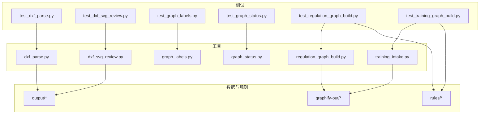
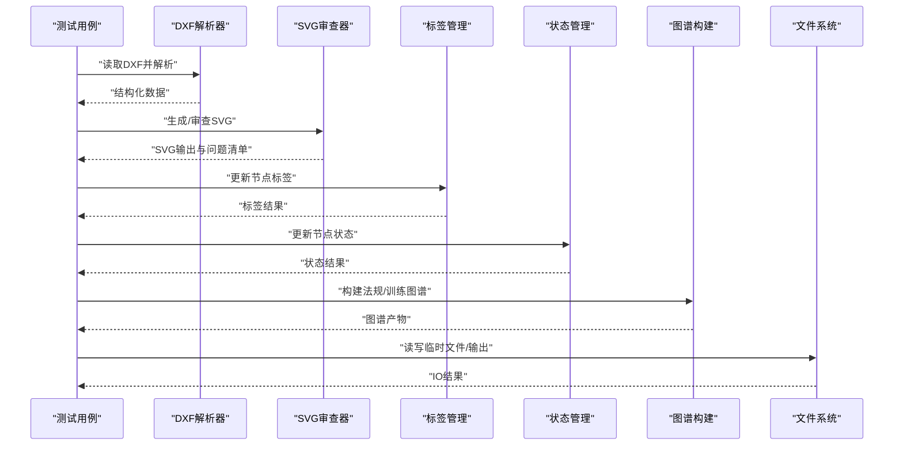
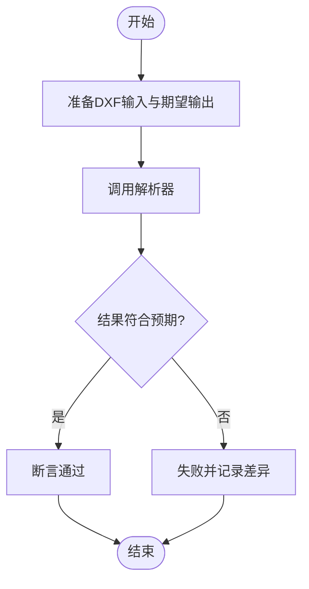
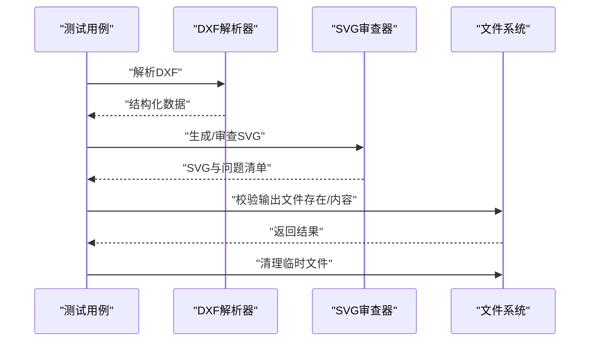
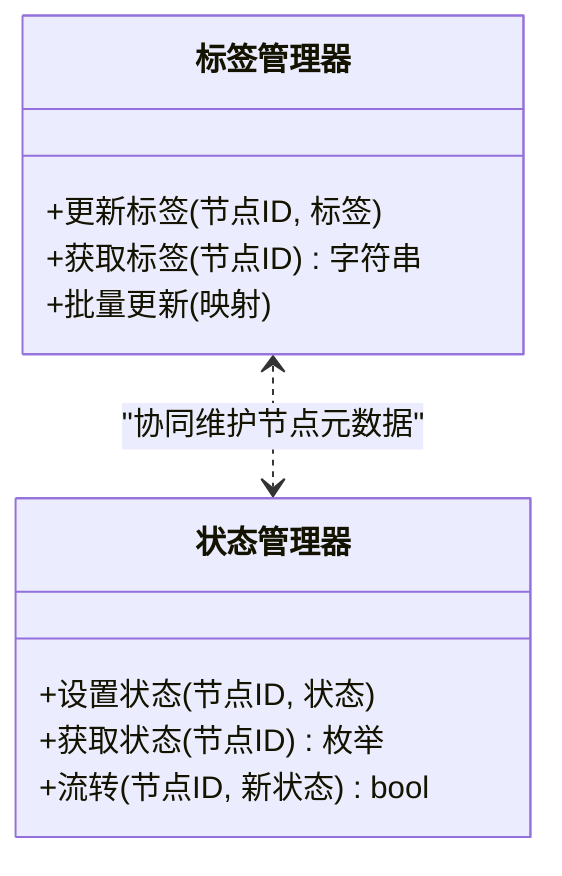
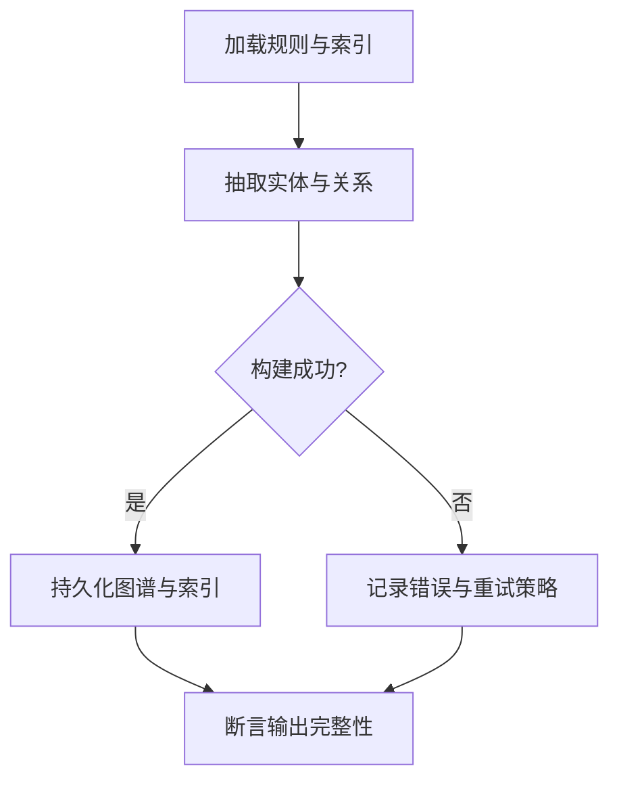
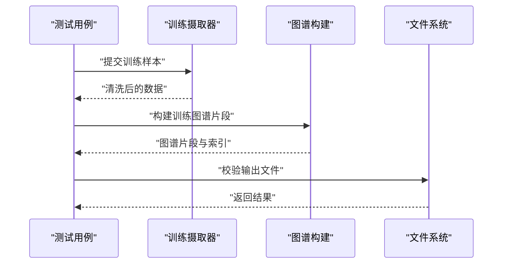
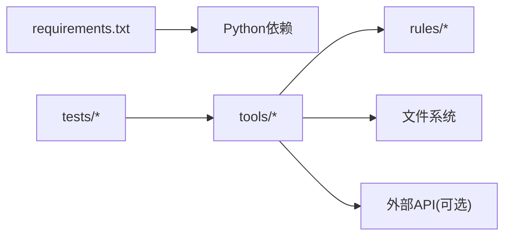

# 集成测试

<cite>
**本文引用的文件**   
- [tests/test_dxf_parse.py](file://tests/test_dxf_parse.py)
- [tests/test_dxf_svg_review.py](file://tests/test_dxf_svg_review.py)
- [tests/test_graph_labels.py](file://tests/test_graph_labels.py)
- [tests/test_graph_status.py](file://tests/test_graph_status.py)
- [tests/test_regulation_graph_build.py](file://tests/test_regulation_graph_build.py)
- [tests/test_training_graph_build.py](file://tests/test_training_graph_build.py)
- [tools/dxf_parse.py](file://tools/dxf_parse.py)
- [tools/dxf_svg_review.py](file://tools/dxf_svg_review.py)
- [tools/graph_labels.py](file://tools/graph_labels.py)
- [tools/graph_status.py](file://tools/graph_status.py)
- [tools/regulation_graph_build.py](file://tools/regulation_graph_build.py)
- [tools/training_intake.py](file://tools/training_intake.py)
- [.github/workflows/rule-tests.yml](file://.github/workflows/rule-tests.yml)
- [requirements.txt](file://requirements.txt)
</cite>

## 目录
1. [简介](#简介)
2. [项目结构](#项目结构)
3. [核心组件](#核心组件)
4. [架构总览](#架构总览)
5. [详细组件分析](#详细组件分析)
6. [依赖分析](#依赖分析)
7. [性能考虑](#性能考虑)
8. [故障排查指南](#故障排查指南)
9. [结论](#结论)
10. [附录](#附录)

## 简介
本技术文档面向“绘图审查”项目的集成测试模块，聚焦以下目标：
- 系统集成测试策略与数据准备方法
- 测试环境搭建与持续集成配置
- DXF 文件解析、SVG 审查功能与图谱构建流程的端到端验证
- 模拟数据库连接、文件操作与外部 API 调用的实践
- 测试数据管理、事务处理与回滚机制
- 集成测试的性能优化、错误诊断与 CI/CD 配置建议

## 项目结构
本项目采用“工具脚本 + 测试用例”的组织方式。测试集中在 tests 目录，对应实现位于 tools 目录。关键路径如下：
- 测试入口与用例组织：tests/*.py
- 被测工具与能力：tools/*.py
- 规则与图谱相关数据：rules/*（供图谱构建与校验）
- 持续集成流水线：.github/workflows/rule-tests.yml
- 依赖声明：requirements.txt

图表来源 
- [tests/test_dxf_parse.py](file://tests/test_dxf_parse.py)
- [tests/test_dxf_svg_review.py](file://tests/test_dxf_svg_review.py)
- [tests/test_graph_labels.py](file://tests/test_graph_labels.py)
- [tests/test_graph_status.py](file://tests/test_graph_status.py)
- [tests/test_regulation_graph_build.py](file://tests/test_regulation_graph_build.py)
- [tests/test_training_graph_build.py](file://tests/test_training_graph_build.py)
- [tools/dxf_parse.py](file://tools/dxf_parse.py)
- [tools/dxf_svg_review.py](file://tools/dxf_svg_review.py)
- [tools/graph_labels.py](file://tools/graph_labels.py)
- [tools/graph_status.py](file://tools/graph_status.py)
- [tools/regulation_graph_build.py](file://tools/regulation_graph_build.py)
- [tools/training_intake.py](file://tools/training_intake.py)

章节来源
- [tests/test_dxf_parse.py](file://tests/test_dxf_parse.py)
- [tests/test_dxf_svg_review.py](file://tests/test_dxf_svg_review.py)
- [tests/test_graph_labels.py](file://tests/test_graph_labels.py)
- [tests/test_graph_status.py](file://tests/test_graph_status.py)
- [tests/test_regulation_graph_build.py](file://tests/test_regulation_graph_build.py)
- [tests/test_training_graph_build.py](file://tests/test_training_graph_build.py)
- [tools/dxf_parse.py](file://tools/dxf_parse.py)
- [tools/dxf_svg_review.py](file://tools/dxf_svg_review.py)
- [tools/graph_labels.py](file://tools/graph_labels.py)
- [tools/graph_status.py](file://tools/graph_status.py)
- [tools/regulation_graph_build.py](file://tools/regulation_graph_build.py)
- [tools/training_intake.py](file://tools/training_intake.py)

## 核心组件
- DXF 解析器：负责读取 DXF 文件并输出结构化数据，供后续审查与可视化使用。
- SVG 审查器：基于解析结果生成或审查 SVG，用于图形化展示与问题标注。
- 标签与状态工具：对图谱节点进行标签管理与状态更新，支撑可视化与报告。
- 法规图谱构建：将规则与案例数据整合为可查询的图谱结构。
- 训练数据摄取：将训练样本导入系统，形成可复用的数据集与图谱片段。

章节来源
- [tools/dxf_parse.py](file://tools/dxf_parse.py)
- [tools/dxf_svg_review.py](file://tools/dxf_svg_review.py)
- [tools/graph_labels.py](file://tools/graph_labels.py)
- [tools/graph_status.py](file://tools/graph_status.py)
- [tools/regulation_graph_build.py](file://tools/regulation_graph_build.py)
- [tools/training_intake.py](file://tools/training_intake.py)

## 架构总览
下图展示了从输入到输出的端到端集成流程，包括 DXF 解析、SVG 审查、图谱构建与标签/状态管理。

图表来源 
- [tests/test_dxf_parse.py](file://tests/test_dxf_parse.py)
- [tests/test_dxf_svg_review.py](file://tests/test_dxf_svg_review.py)
- [tests/test_graph_labels.py](file://tests/test_graph_labels.py)
- [tests/test_graph_status.py](file://tests/test_graph_status.py)
- [tests/test_regulation_graph_build.py](file://tests/test_regulation_graph_build.py)
- [tests/test_training_graph_build.py](file://tests/test_training_graph_build.py)
- [tools/dxf_parse.py](file://tools/dxf_parse.py)
- [tools/dxf_svg_review.py](file://tools/dxf_svg_review.py)
- [tools/graph_labels.py](file://tools/graph_labels.py)
- [tools/graph_status.py](file://tools/graph_status.py)
- [tools/regulation_graph_build.py](file://tools/regulation_graph_build.py)
- [tools/training_intake.py](file://tools/training_intake.py)

## 详细组件分析

### DXF 解析集成测试
- 目标：验证 DXF 文件的正确解析、边界条件与异常处理。
- 关键点：
  - 输入文件准备：提供多种 DXF 样例（含缺失图层、异常实体等）。
  - 解析断言：检查节点、线段、文本等实体的结构与数量。
  - 异常覆盖：非法路径、损坏文件、编码问题等。
  - IO 隔离：使用临时目录避免污染工作区。

图表来源 
- [tests/test_dxf_parse.py](file://tests/test_dxf_parse.py)
- [tools/dxf_parse.py](file://tools/dxf_parse.py)

章节来源
- [tests/test_dxf_parse.py](file://tests/test_dxf_parse.py)
- [tools/dxf_parse.py](file://tools/dxf_parse.py)

### SVG 审查集成测试
- 目标：验证基于 DXF 解析结果的 SVG 生成与审查逻辑。
- 关键点：
  - 生成断言：检查 SVG 结构、元素数量与关键属性。
  - 审查断言：问题标注、颜色标记、尺寸单位一致性。
  - 资源清理：测试后删除生成的 SVG 与中间文件。

图表来源 
- [tests/test_dxf_svg_review.py](file://tests/test_dxf_svg_review.py)
- [tools/dxf_svg_review.py](file://tools/dxf_svg_review.py)

章节来源
- [tests/test_dxf_svg_review.py](file://tests/test_dxf_svg_review.py)
- [tools/dxf_svg_review.py](file://tools/dxf_svg_review.py)

### 图谱标签与状态集成测试
- 目标：确保图谱节点标签与状态的写入、读取与一致性。
- 关键点：
  - 标签更新：按规则或人工干预更新节点标签。
  - 状态流转：如待审→已审→驳回等状态变更。
  - 一致性校验：标签与状态在多次读写后保持一致。

图表来源 
- [tests/test_graph_labels.py](file://tests/test_graph_labels.py)
- [tests/test_graph_status.py](file://tests/test_graph_status.py)
- [tools/graph_labels.py](file://tools/graph_labels.py)
- [tools/graph_status.py](file://tools/graph_status.py)

章节来源
- [tests/test_graph_labels.py](file://tests/test_graph_labels.py)
- [tests/test_graph_status.py](file://tests/test_graph_status.py)
- [tools/graph_labels.py](file://tools/graph_labels.py)
- [tools/graph_status.py](file://tools/graph_status.py)

### 法规图谱构建集成测试
- 目标：验证规则数据与案例数据的整合，生成可查询的法规图谱。
- 关键点：
  - 输入：规则定义、索引、案例事实。
  - 构建过程：实体抽取、关系建立、冲突检测。
  - 输出：图谱文件与索引，便于检索与审计。

图表来源 
- [tests/test_regulation_graph_build.py](file://tests/test_regulation_graph_build.py)
- [tools/regulation_graph_build.py](file://tools/regulation_graph_build.py)

章节来源
- [tests/test_regulation_graph_build.py](file://tests/test_regulation_graph_build.py)
- [tools/regulation_graph_build.py](file://tools/regulation_graph_build.py)

### 训练数据摄取与图谱构建集成测试
- 目标：验证训练样本的导入、清洗与图谱片段生成。
- 关键点：
  - 数据源：训练集 JSON/CSV 等格式。
  - 清洗与标准化：字段映射、类型转换、去重。
  - 图谱片段：局部子图与关联关系。

图表来源 
- [tests/test_training_graph_build.py](file://tests/test_training_graph_build.py)
- [tools/training_intake.py](file://tools/training_intake.py)

章节来源
- [tests/test_training_graph_build.py](file://tests/test_training_graph_build.py)
- [tools/training_intake.py](file://tools/training_intake.py)

## 依赖分析
- 运行时依赖：Python 标准库与第三方库由 requirements.txt 管理。
- 工具依赖：各工具模块之间低耦合，通过函数接口交互。
- 数据依赖：rules 目录下的规则与索引文件为图谱构建必需。
- 外部依赖：文件系统 IO、可能的网络请求（若涉及外部 API 需模拟）。

图表来源 
- [requirements.txt](file://requirements.txt)
- [tests/test_dxf_parse.py](file://tests/test_dxf_parse.py)
- [tests/test_dxf_svg_review.py](file://tests/test_dxf_svg_review.py)
- [tests/test_graph_labels.py](file://tests/test_graph_labels.py)
- [tests/test_graph_status.py](file://tests/test_graph_status.py)
- [tests/test_regulation_graph_build.py](file://tests/test_regulation_graph_build.py)
- [tests/test_training_graph_build.py](file://tests/test_training_graph_build.py)

章节来源
- [requirements.txt](file://requirements.txt)

## 性能考虑
- 并行执行：使用 pytest-xdist 或类似框架并行运行测试用例，缩短整体耗时。
- 数据复用：缓存规则与索引文件，避免重复加载；使用内存数据库或内存文件系统加速 IO。
- 增量构建：图谱构建支持增量更新，仅处理变更部分。
- 资源限制：限制并发度与内存占用，防止 CI 环境资源耗尽。
- 监控与指标：收集解析时长、SVG 生成时间、图谱构建耗时等指标，定位瓶颈。

[本节为通用指导，不直接分析具体文件]

## 故障排查指南
- 常见错误：
  - DXF 解析失败：检查文件格式、编码、缺失图层与实体类型。
  - SVG 审查异常：确认坐标系统、单位换算与样式渲染。
  - 图谱构建失败：核对规则索引、实体关系一致性与约束冲突。
- 调试技巧：
  - 启用详细日志，输出中间数据结构与关键步骤。
  - 使用最小化用例复现问题，逐步缩小范围。
  - 隔离外部依赖，使用 Mock 替代真实 IO 与网络请求。
- 回滚与事务：
  - 文件操作：在临时目录执行，失败时自动清理。
  - 数据库操作：使用事务包裹，失败时回滚，保证数据一致性。
  - 图谱构建：分阶段快照，失败时可恢复到上一稳定版本。

章节来源
- [tests/test_dxf_parse.py](file://tests/test_dxf_parse.py)
- [tests/test_dxf_svg_review.py](file://tests/test_dxf_svg_review.py)
- [tests/test_regulation_graph_build.py](file://tests/test_regulation_graph_build.py)
- [tests/test_training_graph_build.py](file://tests/test_training_graph_build.py)

## 结论
本集成测试体系覆盖了 DXF 解析、SVG 审查与图谱构建的核心流程，结合数据准备、环境隔离与持续集成配置，确保了系统的稳定性与可维护性。通过合理的性能优化与故障排查策略，可在复杂场景下快速定位问题并保障交付质量。

[本节为总结性内容，不直接分析具体文件]

## 附录

### 测试环境搭建
- 安装依赖：根据 requirements.txt 安装 Python 依赖。
- 准备数据：复制 rules 目录与必要的样例文件至测试环境。
- 环境变量：配置必要的环境变量（如路径、开关、密钥等）。
- 运行测试：使用 pytest 或项目提供的脚本执行测试套件。

章节来源
- [requirements.txt](file://requirements.txt)

### 持续集成配置
- 触发条件：代码推送或 Pull Request 时自动运行 rule-tests 流水线。
- 步骤：
  - 安装依赖与环境初始化
  - 执行单元测试与集成测试
  - 收集测试报告与产物
  - 发布与归档结果

章节来源
- [.github/workflows/rule-tests.yml](file://.github/workflows/rule-tests.yml)

### 模拟外部依赖
- 数据库连接：使用内存数据库或测试夹具模拟连接与查询。
- 文件操作：使用临时目录与内存文件系统隔离 IO。
- 外部 API：使用 Mock 或本地服务器模拟响应，确保测试确定性。

章节来源
- [tests/test_dxf_parse.py](file://tests/test_dxf_parse.py)
- [tests/test_dxf_svg_review.py](file://tests/test_dxf_svg_review.py)
- [tests/test_regulation_graph_build.py](file://tests/test_regulation_graph_build.py)
- [tests/test_training_graph_build.py](file://tests/test_training_graph_build.py)