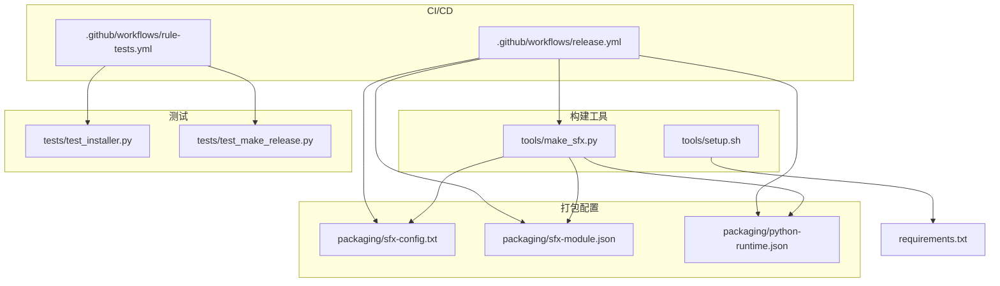
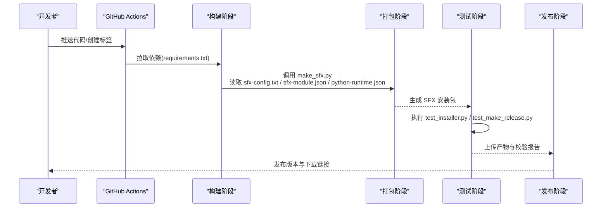
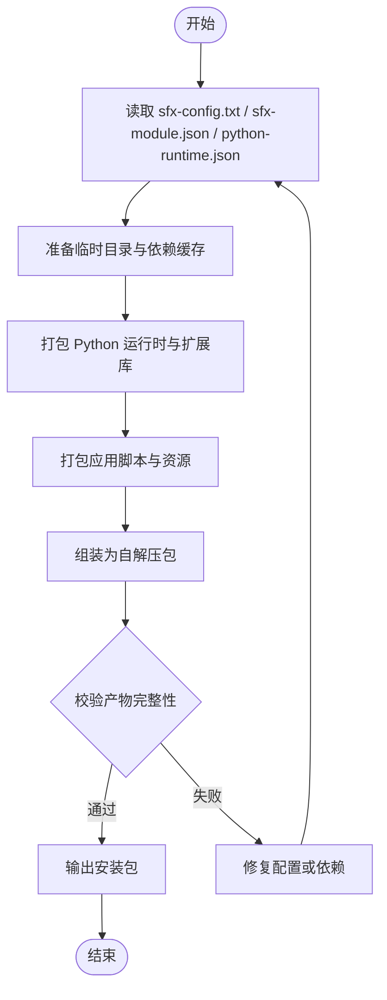
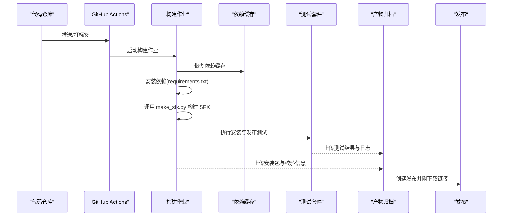
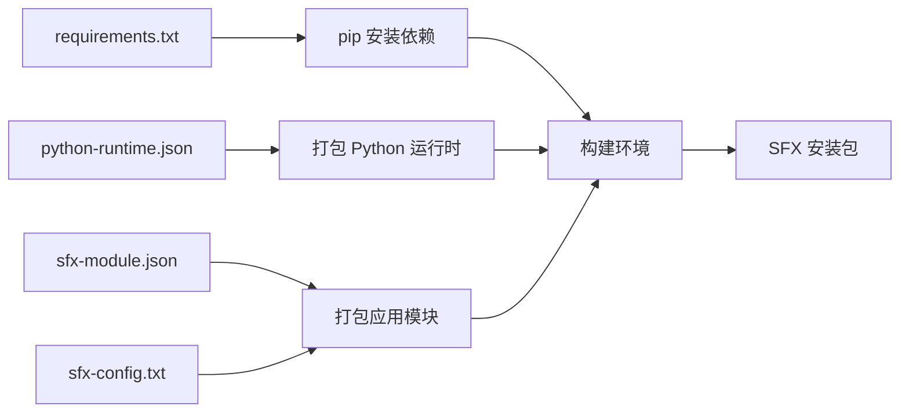

# 部署指南

<cite>
**本文引用的文件**   
- [release.yml](file://.github/workflows/release.yml)
- [rule-tests.yml](file://.github/workflows/rule-tests.yml)
- [requirements.txt](file://requirements.txt)
- [sfx-config.txt](file://packaging/sfx-config.txt)
- [sfx-module.json](file://packaging/sfx-module.json)
- [python-runtime.json](file://packaging/python-runtime.json)
- [make_sfx.py](file://tools/make_sfx.py)
- [setup.sh](file://tools/setup.sh)
- [test_installer.py](file://tests/test_installer.py)
- [test_make_release.py](file://tests/test_make_release.py)
</cite>

## 目录
1. [简介](#简介)
2. [项目结构](#项目结构)
3. [核心组件](#核心组件)
4. [架构总览](#架构总览)
5. [详细组件分析](#详细组件分析)
6. [依赖关系分析](#依赖关系分析)
7. [性能考虑](#性能考虑)
8. [故障排除指南](#故障排除指南)
9. [结论](#结论)
10. [附录](#附录)

## 简介
本指南面向需要构建、打包与发布 SFX 自解压包（包含 Python 运行时）的工程团队，覆盖以下主题：
- SFX 自解压包的构建流程与参数配置
- Python 运行时的打包策略与环境隔离
- GitHub Actions 工作流配置、自动化测试与版本管理
- 环境变量配置、安装与生产环境部署步骤
- 系统要求、依赖管理与安全加固建议
- 容器化部署、负载均衡与高可用架构思路
- 常见问题排查与性能监控建议

## 项目结构
仓库中与部署相关的核心目录与文件：
- .github/workflows：CI/CD 工作流定义（发布与规则测试）
- packaging：SFX 与 Python 运行时打包配置
- tools：构建脚本与工具（含 SFX 构建、环境初始化等）
- tests：安装器与发布流程的单元测试
- requirements.txt：Python 依赖清单

**图示来源** 
- [release.yml](file://.github/workflows/release.yml)
- [rule-tests.yml](file://.github/workflows/rule-tests.yml)
- [sfx-config.txt](file://packaging/sfx-config.txt)
- [sfx-module.json](file://packaging/sfx-module.json)
- [python-runtime.json](file://packaging/python-runtime.json)
- [make_sfx.py](file://tools/make_sfx.py)
- [setup.sh](file://tools/setup.sh)
- [test_installer.py](file://tests/test_installer.py)
- [test_make_release.py](file://tests/test_make_release.py)
- [requirements.txt](file://requirements.txt)

**章节来源**
- [release.yml](file://.github/workflows/release.yml)
- [rule-tests.yml](file://.github/workflows/rule-tests.yml)
- [sfx-config.txt](file://packaging/sfx-config.txt)
- [sfx-module.json](file://packaging/sfx-module.json)
- [python-runtime.json](file://packaging/python-runtime.json)
- [make_sfx.py](file://tools/make_sfx.py)
- [setup.sh](file://tools/setup.sh)
- [test_installer.py](file://tests/test_installer.py)
- [test_make_release.py](file://tests/test_make_release.py)
- [requirements.txt](file://requirements.txt)

## 核心组件
- SFX 构建器：通过 make_sfx.py 读取 sfx-config.txt 与 sfx-module.json，结合 python-runtime.json 生成可执行的自解压安装包。
- 运行时打包：python-runtime.json 描述 Python 解释器与必要库的打包策略，确保目标机器无需预装 Python。
- CI/CD 流水线：release.yml 负责触发构建、测试、打包与发布；rule-tests.yml 负责规则相关测试。
- 安装与验证：test_installer.py 与 test_make_release.py 用于验证安装器行为与发布产物完整性。
- 环境初始化：setup.sh 提供一键初始化依赖与基础环境的能力。

**章节来源**
- [make_sfx.py](file://tools/make_sfx.py)
- [sfx-config.txt](file://packaging/sfx-config.txt)
- [sfx-module.json](file://packaging/sfx-module.json)
- [python-runtime.json](file://packaging/python-runtime.json)
- [test_installer.py](file://tests/test_installer.py)
- [test_make_release.py](file://tests/test_make_release.py)
- [setup.sh](file://tools/setup.sh)

## 架构总览
下图展示了从代码提交到发布产物的端到端流程，包括构建、测试、打包与分发环节。

**图示来源** 
- [release.yml](file://.github/workflows/release.yml)
- [make_sfx.py](file://tools/make_sfx.py)
- [sfx-config.txt](file://packaging/sfx-config.txt)
- [sfx-module.json](file://packaging/sfx-module.json)
- [python-runtime.json](file://packaging/python-runtime.json)
- [test_installer.py](file://tests/test_installer.py)
- [test_make_release.py](file://tests/test_make_release.py)
- [requirements.txt](file://requirements.txt)

## 详细组件分析

### SFX 自解压包构建流程
- 输入配置
  - sfx-config.txt：定义自解压包的基本属性（标题、图标、安装路径、默认选项等）。
  - sfx-module.json：定义模块清单、资源文件与安装后动作。
  - python-runtime.json：定义 Python 运行时版本、平台与所需扩展库。
- 构建步骤
  - 使用 make_sfx.py 解析上述配置文件，准备临时目录与资源。
  - 根据 python-runtime.json 拉取或复制 Python 运行时与依赖。
  - 将应用脚本与资源按 sfx-module.json 组装进自解压包。
  - 输出可执行的 .exe（Windows）或其他平台的自解压格式。
- 关键注意事项
  - 路径与权限：确保安装路径存在且具备写入权限。
  - 签名与完整性：建议在 CI 中生成哈希并签名产物。
  - 最小化体积：仅打包必要库，避免冗余依赖。

**图示来源** 
- [make_sfx.py](file://tools/make_sfx.py)
- [sfx-config.txt](file://packaging/sfx-config.txt)
- [sfx-module.json](file://packaging/sfx-module.json)
- [python-runtime.json](file://packaging/python-runtime.json)

**章节来源**
- [make_sfx.py](file://tools/make_sfx.py)
- [sfx-config.txt](file://packaging/sfx-config.txt)
- [sfx-module.json](file://packaging/sfx-module.json)
- [python-runtime.json](file://packaging/python-runtime.json)

### Python 运行时打包策略
- 版本锁定：在 python-runtime.json 中明确指定 Python 版本与平台，保证一致性。
- 依赖裁剪：仅包含运行所需的第三方库，减少安装包体积与攻击面。
- 隔离运行：安装包内自带 Python 解释器，避免与系统环境冲突。
- 更新策略：当依赖升级时，同步更新 python-runtime.json 并在 CI 中重新构建。

**章节来源**
- [python-runtime.json](file://packaging/python-runtime.json)
- [requirements.txt](file://requirements.txt)

### GitHub Actions 工作流配置
- release.yml
  - 触发条件：推送至主分支或创建语义化标签（如 v1.2.3）。
  - 构建矩阵：支持多平台构建（Windows/Linux/macOS），并行执行。
  - 缓存依赖：缓存 pip 包与 Python 运行时，加速构建。
  - 测试执行：运行 test_installer.py 与 test_make_release.py。
  - 产物归档：上传安装包与校验报告。
  - 发布：创建 GitHub Release 并附带说明与下载链接。
- rule-tests.yml
  - 触发条件：规则变更或定时任务。
  - 执行内容：运行规则相关测试，确保合规性。

**图示来源** 
- [release.yml](file://.github/workflows/release.yml)
- [rule-tests.yml](file://.github/workflows/rule-tests.yml)
- [test_installer.py](file://tests/test_installer.py)
- [test_make_release.py](file://tests/test_make_release.py)
- [requirements.txt](file://requirements.txt)

**章节来源**
- [release.yml](file://.github/workflows/release.yml)
- [rule-tests.yml](file://.github/workflows/rule-tests.yml)
- [test_installer.py](file://tests/test_installer.py)
- [test_make_release.py](file://tests/test_make_release.py)
- [requirements.txt](file://requirements.txt)

### 安装与部署步骤
- 本地构建
  - 安装依赖：执行 setup.sh 初始化环境与依赖。
  - 构建安装包：运行 make_sfx.py，传入必要的配置参数。
  - 验证产物：执行测试用例确认安装包可正常安装与运行。
- 环境变量配置
  - 设置 Python 路径、安装目录、日志级别等变量。
  - 在生产环境中通过环境变量注入敏感配置（密钥、连接串等）。
- 生产部署
  - 分发安装包到目标主机。
  - 以静默模式执行安装，避免交互提示。
  - 启动服务或进程，并配置开机自启（如适用）。

**章节来源**
- [setup.sh](file://tools/setup.sh)
- [make_sfx.py](file://tools/make_sfx.py)
- [test_installer.py](file://tests/test_installer.py)

### 容器化部署、负载均衡与高可用
- 容器化建议
  - 基于官方 Python 镜像构建最小化镜像，仅包含运行时与业务脚本。
  - 使用多阶段构建减少镜像体积，提升拉取与启动速度。
  - 通过环境变量注入配置，避免硬编码。
- 负载均衡
  - 使用反向代理（如 Nginx/HAProxy）进行请求分发与健康检查。
  - 配置会话保持与粘性会话（如需）。
- 高可用架构
  - 多实例部署于不同可用区，配合自动扩缩容。
  - 数据持久化与备份策略，确保故障恢复能力。
  - 监控告警与日志聚合，快速定位问题。

[本节为概念性内容，不直接分析具体文件]

## 依赖关系分析
- 构建依赖
  - Python 解释器与 pip 包管理器。
  - 构建工具链（如编译器、打包工具）由 CI 环境提供。
- 运行时依赖
  - 通过 python-runtime.json 锁定版本，确保跨环境一致。
  - requirements.txt 作为开发依赖参考，实际打包以 python-runtime.json 为准。
- 测试依赖
  - 测试框架与断言库，由 CI 在安装阶段自动获取。

**图示来源** 
- [requirements.txt](file://requirements.txt)
- [python-runtime.json](file://packaging/python-runtime.json)
- [sfx-module.json](file://packaging/sfx-module.json)
- [sfx-config.txt](file://packaging/sfx-config.txt)
- [make_sfx.py](file://tools/make_sfx.py)

**章节来源**
- [requirements.txt](file://requirements.txt)
- [python-runtime.json](file://packaging/python-runtime.json)
- [sfx-module.json](file://packaging/sfx-module.json)
- [sfx-config.txt](file://packaging/sfx-config.txt)
- [make_sfx.py](file://tools/make_sfx.py)

## 性能考虑
- 构建优化
  - 启用依赖缓存，减少重复安装时间。
  - 并行构建多平台产物，缩短整体耗时。
- 运行时优化
  - 精简依赖，降低内存占用与启动时间。
  - 使用异步 I/O 与连接池提升吞吐。
- 监控指标
  - 构建时长、失败率与重试次数。
  - 安装包大小、解压时间与首次启动延迟。
  - 服务响应时间、错误率与资源利用率。

[本节为通用指导，不直接分析具体文件]

## 故障排除指南
- 构建失败
  - 检查网络与镜像源，确保依赖可下载。
  - 查看 CI 日志，定位缺失依赖或版本冲突。
- 安装失败
  - 确认目标系统满足最低要求（操作系统、权限、磁盘空间）。
  - 检查环境变量是否正确注入，尤其是路径与密钥。
- 运行时异常
  - 启用详细日志，捕获异常堆栈。
  - 验证 Python 版本与平台兼容性。
- 测试失败
  - 复现本地环境，逐步缩小问题范围。
  - 检查测试数据与外部依赖是否可用。

**章节来源**
- [test_installer.py](file://tests/test_installer.py)
- [test_make_release.py](file://tests/test_make_release.py)

## 结论
通过标准化的 SFX 构建流程、严格的依赖管理与完善的 CI/CD 流水线，可实现稳定、可重复的安装包发布。结合容器化、负载均衡与高可用设计，能够支撑生产环境的规模化部署与持续演进。建议持续优化构建性能、完善监控告警与故障自愈机制，以提升交付质量与运维效率。

[本节为总结性内容，不直接分析具体文件]

## 附录
- 术语表
  - SFX：自解压可执行文件，内含安装程序与资源。
  - CI/CD：持续集成与持续交付。
  - 容器化：将应用及其依赖打包为可移植的容器镜像。
- 参考文件
  - 构建脚本：tools/make_sfx.py
  - 环境初始化：tools/setup.sh
  - 测试用例：tests/test_installer.py, tests/test_make_release.py
  - 工作流：.github/workflows/release.yml, .github/workflows/rule-tests.yml
  - 依赖清单：requirements.txt
  - 打包配置：packaging/sfx-config.txt, packaging/sfx-module.json, packaging/python-runtime.json

[本节为补充信息，不直接分析具体文件]