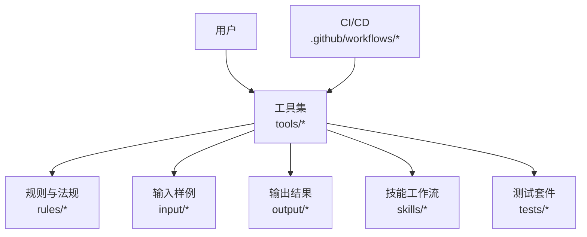
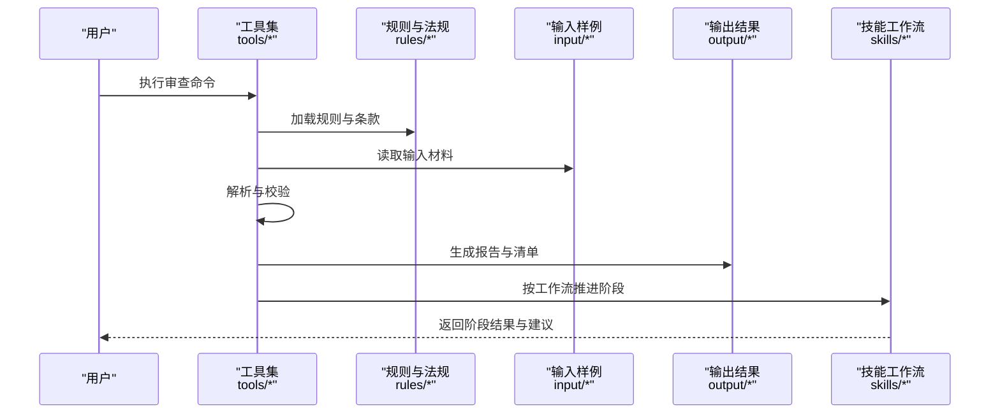
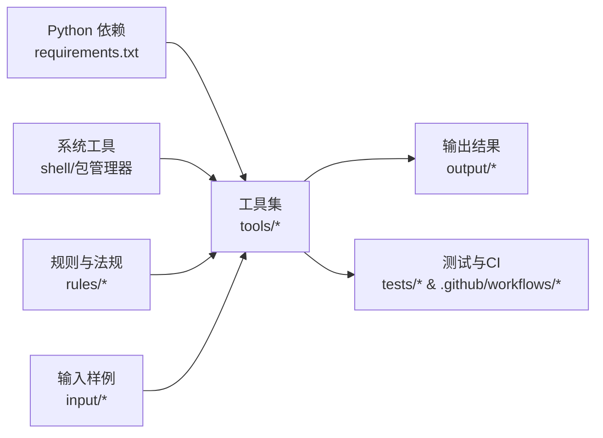

# 快速开始

<cite>
**本文档引用的文件**   
- [requirements.txt](file://requirements.txt)
- [tools/setup.sh](file://tools/setup.sh)
- [rules/README.md](file://rules/README.md)
- [skills/first-stage-review.md](file://skills/first-stage-review.md)
- [input/範例/室內裝修表單範本/README.md](file://input/範例/室內裝修表單範本/README.md)
- [tests/test_onboarding.py](file://tests/test_onboarding.py)
- [tests/test_check_env.py](file://tests/test_check_env.py)
- [.github/workflows/release.yml](file://.github/workflows/release.yml)
- [.github/workflows/rule-tests.yml](file://.github/workflows/rule-tests.yml)
</cite>

## 目录
1. [简介](#简介)
2. [项目结构](#项目结构)
3. [核心组件](#核心组件)
4. [架构总览](#架构总览)
5. [详细组件分析](#详细组件分析)
6. [依赖关系分析](#依赖关系分析)
7. [性能注意事项](#性能注意事项)
8. [故障排除指南](#故障排除指南)
9. [结论](#结论)
10. [附录](#附录)

## 简介
本快速开始指南面向首次接触“消防安全设备审查系统”的用户，帮助你在最短时间内完成安装、环境配置并执行第一个审查任务。文档涵盖：
- 依赖项安装与环境准备
- 最小化配置与验证方法
- 首个审查任务的端到端执行步骤
- 常见问题与解决方案
- 获取帮助的渠道

## 项目结构
仓库采用按功能域划分的目录组织方式，便于扩展与维护：
- rules：法规条款、规则索引与设备规则等数据与策略定义
- skills：分阶段审查技能与工作流说明（如第一阶段审查）
- tools：命令行工具与脚本（安装、解析、报告生成等）
- input：输入样例与模板（如室内装修表单范本）
- output：运行输出（由工具生成）
- tests：单元测试与验收用例
- .github/workflows：发布与规则测试的自动化流程

图表来源
- [tools/setup.sh](file://tools/setup.sh)
- [rules/README.md](file://rules/README.md)
- [skills/first-stage-review.md](file://skills/first-stage-review.md)
- [input/範例/室內裝修表單範本/README.md](file://input/範例/室內裝修表單範本/README.md)
- [.github/workflows/release.yml](file://.github/workflows/release.yml)
- [.github/workflows/rule-tests.yml](file://.github/workflows/rule-tests.yml)

章节来源
- [rules/README.md](file://rules/README.md)
- [skills/first-stage-review.md](file://skills/first-stage-review.md)
- [input/範例/室內裝修表單範本/README.md](file://input/範例/室內裝修表單範本/README.md)

## 核心组件
- 规则与法规库：位于 rules 目录，包含各类场所消防设备设置标准、条款索引、设备规则与混合用途规则等，是审查逻辑的数据基础。
- 技能工作流：skills 目录提供分阶段审查指引（如第一阶段审查），指导如何组织审查过程与产出。
- 工具集：tools 目录提供安装、DXF 解析、SVG 审查、报告生成、清单导出等实用脚本与程序。
- 输入与输出：input 提供样例与模板；output 存放工具生成的报告、清单与中间产物。
- 测试与质量保障：tests 覆盖环境检查、DXF/SVG 处理、规则图构建、训练与核查等关键路径。
- CI/CD：.github/workflows 提供发布与规则测试流水线，确保规则与工具的稳定性。

章节来源
- [rules/README.md](file://rules/README.md)
- [skills/first-stage-review.md](file://skills/first-stage-review.md)
- [tools/setup.sh](file://tools/setup.sh)
- [tests/test_check_env.py](file://tests/test_check_env.py)
- [.github/workflows/rule-tests.yml](file://.github/workflows/rule-tests.yml)

## 架构总览
系统以“工具驱动 + 规则数据 + 技能工作流”为核心：
- 用户通过 tools 中的脚本或命令发起审查任务
- 工具读取 rules 中的规则与法规数据，结合 input 中的输入材料进行处理
- 处理结果写入 output，并可基于 skills 的工作流进行阶段性审查与复核
- 测试与 CI 保障规则与工具的正确性与可重复性

图表来源
- [tools/setup.sh](file://tools/setup.sh)
- [rules/README.md](file://rules/README.md)
- [skills/first-stage-review.md](file://skills/first-stage-review.md)
- [input/範例/室內裝修表單範本/README.md](file://input/範例/室內裝修表單範本/README.md)

## 详细组件分析

### 环境与依赖安装
- Python 依赖：通过 requirements.txt 管理第三方库版本，建议使用虚拟环境隔离依赖。
- 安装脚本：tools/setup.sh 提供一键安装与环境初始化能力（适用于类 Unix 环境）。
- 环境检查：tests/test_check_env.py 可用于验证 Python、包管理器与必要工具是否就绪。

建议步骤
- 创建并激活 Python 虚拟环境
- 使用 pip 安装 requirements.txt 中列出的依赖
- 运行 setup.sh 完成工具链初始化（如需要）
- 运行环境检查脚本确认依赖与工具可用

章节来源
- [requirements.txt](file://requirements.txt)
- [tools/setup.sh](file://tools/setup.sh)
- [tests/test_check_env.py](file://tests/test_check_env.py)

### 最小化配置与验证
- 规则索引与说明：rules/README.md 提供规则结构与使用说明，可作为最小化配置的参考。
- 输入样例：input/範例/室內裝修表單範本/README.md 提供样例说明，便于快速验证输入格式与路径。
- 验证方法：
  - 使用环境检查脚本确认依赖与工具
  - 使用 onboarding 测试用例验证基本流程（tests/test_onboarding.py）
  - 使用规则测试流水线（.github/workflows/rule-tests.yml）验证规则正确性

章节来源
- [rules/README.md](file://rules/README.md)
- [input/範例/室內裝修表單範本/README.md](file://input/範例/室內裝修表單範本/README.md)
- [tests/test_onboarding.py](file://tests/test_onboarding.py)
- [.github/workflows/rule-tests.yml](file://.github/workflows/rule-tests.yml)

### 第一个审查任务的执行步骤
- 选择技能工作流：skills/first-stage-review.md 描述第一阶段审查的流程与要点。
- 准备输入材料：参考 input/範例/室內裝修表單範本/README.md 准备样例或真实输入。
- 执行工具命令：通过 tools 目录下的相关脚本或程序启动审查（例如 DXF/SVG 解析、报告生成等）。
- 查看输出：在 output 目录中查看生成的报告、清单与中间产物。
- 阶段推进：依据 skills 中的工作流进行后续阶段审查与复核。

章节来源
- [skills/first-stage-review.md](file://skills/first-stage-review.md)
- [input/範例/室內裝修表單範本/README.md](file://input/範例/室內裝修表單範本/README.md)
- [tools/setup.sh](file://tools/setup.sh)

## 依赖关系分析
- 运行时依赖：Python 生态库由 requirements.txt 统一管理，确保可重复构建。
- 工具依赖：setup.sh 可能依赖系统级工具（如 shell、包管理器），需在类 Unix 环境中运行。
- 规则依赖：rules 目录下的 JSON 与 Markdown 文件为规则与法规数据来源，需保持完整与一致。
- 测试与 CI：tests 与 .github/workflows 保证规则与工具的质量与可回归性。

图表来源
- [requirements.txt](file://requirements.txt)
- [tools/setup.sh](file://tools/setup.sh)
- [rules/README.md](file://rules/README.md)
- [.github/workflows/rule-tests.yml](file://.github/workflows/rule-tests.yml)

章节来源
- [requirements.txt](file://requirements.txt)
- [tools/setup.sh](file://tools/setup.sh)
- [.github/workflows/release.yml](file://.github/workflows/release.yml)
- [.github/workflows/rule-tests.yml](file://.github/workflows/rule-tests.yml)

## 性能注意事项
- 规则规模：rules 目录下规则文件较多，初次加载可能耗时较长，建议在稳定环境中缓存规则索引。
- 输入解析：DXF/SVG 等大文件解析可能占用较多内存与 CPU，建议分批处理或限制并发。
- 输出管理：output 目录会积累大量中间产物，定期清理以避免磁盘压力。
- 并行与缓存：合理设置工具并发度，利用缓存减少重复计算。

[本节为通用指导，不直接分析具体文件]

## 故障排除指南
- 依赖缺失或版本冲突：
  - 使用 requirements.txt 重新安装依赖
  - 检查 Python 版本与包管理器兼容性
- 环境未就绪：
  - 运行 tests/test_check_env.py 检查 Python、包管理器与必要工具
  - 确认 setup.sh 执行权限与依赖的系统工具存在
- 规则加载失败：
  - 检查 rules 目录完整性与文件格式
  - 使用规则测试流水线验证规则正确性
- 输入格式错误：
  - 参考 input/範例/室內裝修表單範本/README.md 核对输入结构与字段
- 输出为空或异常：
  - 检查工具命令参数与输入路径
  - 查看日志与中间产物定位问题

章节来源
- [tests/test_check_env.py](file://tests/test_check_env.py)
- [tools/setup.sh](file://tools/setup.sh)
- [rules/README.md](file://rules/README.md)
- [input/範例/室內裝修表單範本/README.md](file://input/範例/室內裝修表單範本/README.md)

## 结论
通过本快速开始指南，你可以在最短时间内完成环境搭建、最小化配置与第一个审查任务的执行。建议结合 skills 中的工作流逐步推进审查阶段，并利用 tests 与 CI 保障规则与工具的正确性。遇到问题时，优先参考故障排除指南与样例说明，必要时查阅规则与技能文档获取更多细节。

[本节为总结性内容，不直接分析具体文件]

## 附录
- 常用命令与路径：
  - 安装依赖：pip install -r requirements.txt
  - 初始化环境：bash tools/setup.sh
  - 环境检查：python tests/test_check_env.py
  - 示例输入：input/範例/室內裝修表單範本/README.md
  - 规则说明：rules/README.md
  - 第一阶段审查：skills/first-stage-review.md
- 获取帮助：
  - 查看测试用例与 CI 流程了解预期行为
  - 参考样例与规则文档理解输入与规则结构
  - 如遇复杂问题，收集日志与中间产物以便进一步排查

[本节为补充信息，不直接分析具体文件]