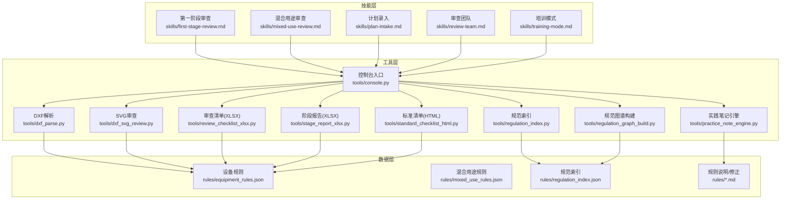
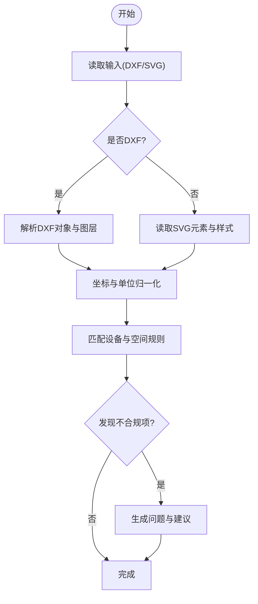
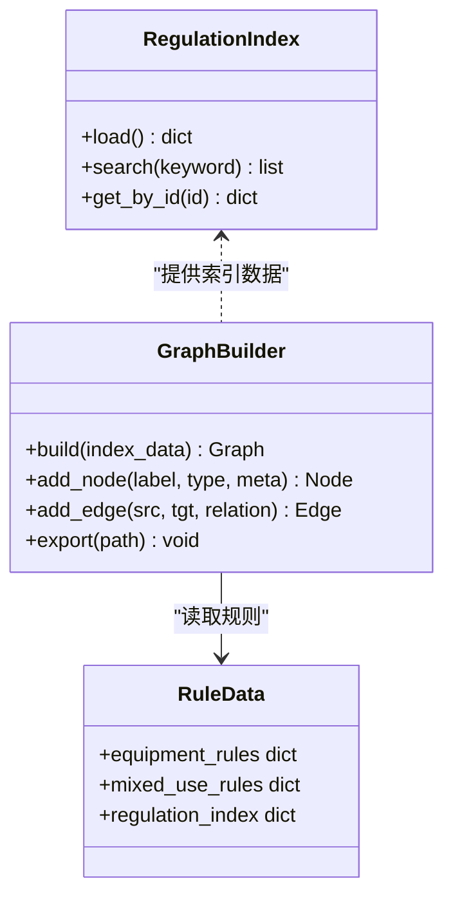
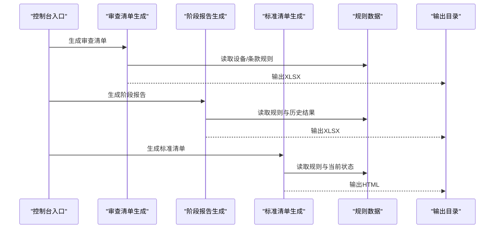
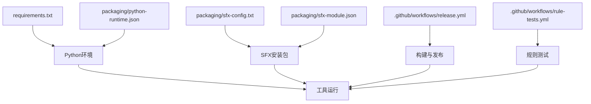

# 技术架构

<cite>
**本文引用的文件**   
- [requirements.txt](file://requirements.txt)
- [packaging/python-runtime.json](file://packaging/python-runtime.json)
- [packaging/sfx-config.txt](file://packaging/sfx-config.txt)
- [packaging/sfx-module.json](file://packaging/sfx-module.json)
- [.github/workflows/release.yml](file://.github/workflows/release.yml)
- [.github/workflows/rule-tests.yml](file://.github/workflows/rule-tests.yml)
- [tools/console.py](file://tools/console.py)
- [tools/dxf_parse.py](file://tools/dxf_parse.py)
- [tools/dxf_svg_review.py](file://tools/dxf_svg_review.py)
- [tools/regulation_index.py](file://tools/regulation_index.py)
- [tools/regulation_graph_build.py](file://tools/regulation_graph_build.py)
- [tools/practice_note_engine.py](file://tools/practice_note_engine.py)
- [tools/review_checklist_xlsx.py](file://tools/review_checklist_xlsx.py)
- [tools/stage_report_xlsx.py](file://tools/stage_report_xlsx.py)
- [tools/standard_checklist_html.py](file://tools/standard_checklist_html.py)
- [rules/equipment_rules.json](file://rules/equipment_rules.json)
- [rules/mixed_use_rules.json](file://rules/mixed_use_rules.json)
- [rules/regulation_index.json](file://rules/regulation_index.json)
- [rules/review_corrections.md](file://rules/review_corrections.md)
- [rules/stage_two_judgment_rules.md](file://rules/stage_two_judgment_rules.md)
- [skills/first-stage-review.md](file://skills/first-stage-review.md)
- [skills/mixed-use-review.md](file://skills/mixed-use-review.md)
- [skills/plan-intake.md](file://skills/plan-intake.md)
- [skills/review-team.md](file://skills/review-team.md)
- [skills/training-mode.md](file://skills/training-mode.md)
- [tests/test_dxf_parse.py](file://tests/test_dxf_parse.py)
- [tests/test_dxf_svg_review.py](file://tests/test_dxf_svg_review.py)
- [tests/test_regulation_index.py](file://tests/test_regulation_index.py)
- [tests/test_practice_note_engine.py](file://tests/test_practice_note_engine.py)
- [tests/test_review_checklist_xlsx.py](file://tests/test_review_checklist_xlsx.py)
- [tests/test_stage_report_xlsx.py](file://tests/test_stage_report_xlsx.py)
- [tests/test_standard_checklist_html.py](file://tests/test_standard_checklist_html.py)
</cite>

## 目录
1. [简介](#简介)
2. [项目结构](#项目结构)
3. [核心组件](#核心组件)
4. [架构总览](#架构总览)
5. [详细组件分析](#详细组件分析)
6. [依赖分析](#依赖分析)
7. [性能考虑](#性能考虑)
8. [故障排查指南](#故障排查指南)
9. [结论](#结论)
10. [附录](#附录)

## 简介
本文件为“消防安全设备审查系统”的技术架构文档，面向架构师与高级开发者。内容涵盖高层设计、架构模式、组件交互关系、数据流与接口定义、部署拓扑、基础设施要求、扩展性策略，以及安全、监控与灾难恢复方案。系统以Python为核心运行时，采用模块化与工具化设计，围绕规范数据（规则）、图纸解析（DXF/SVG）、审查清单生成与报告输出构建端到端能力。

## 项目结构
仓库采用“工具驱动 + 数据驱动”的组织方式：
- tools：命令行工具与数据处理脚本，按功能域划分（如DXF解析、SVG审查、规范索引与图谱构建、清单与报告生成等）。
- rules：法规条款、设备规则、混合用途规则及索引等结构化数据与说明文档。
- skills：业务技能与流程指引（如第一阶段审查、混合用途审查、计划录入、培训模式等）。
- tests：覆盖关键工具的单元测试与集成测试。
- packaging：打包产物配置（Python运行环境、SFX自解压模块与配置）。
- .github/workflows：CI/CD流水线（发布与规则测试）。
- input/output：输入样例与输出目录。
- graphify-out：图谱可视化相关中间产物。



图表来源
- [tools/console.py](file://tools/console.py)
- [tools/dxf_parse.py](file://tools/dxf_parse.py)
- [tools/dxf_svg_review.py](file://tools/dxf_svg_review.py)
- [tools/regulation_index.py](file://tools/regulation_index.py)
- [tools/regulation_graph_build.py](file://tools/regulation_graph_build.py)
- [tools/practice_note_engine.py](file://tools/practice_note_engine.py)
- [tools/review_checklist_xlsx.py](file://tools/review_checklist_xlsx.py)
- [tools/stage_report_xlsx.py](file://tools/stage_report_xlsx.py)
- [tools/standard_checklist_html.py](file://tools/standard_checklist_html.py)
- [rules/equipment_rules.json](file://rules/equipment_rules.json)
- [rules/mixed_use_rules.json](file://rules/mixed_use_rules.json)
- [rules/regulation_index.json](file://rules/regulation_index.json)
- [rules/review_corrections.md](file://rules/review_corrections.md)
- [rules/stage_two_judgment_rules.md](file://rules/stage_two_judgment_rules.md)
- [skills/first-stage-review.md](file://skills/first-stage-review.md)
- [skills/mixed-use-review.md](file://skills/mixed-use-review.md)
- [skills/plan-intake.md](file://skills/plan-intake.md)
- [skills/review-team.md](file://skills/review-team.md)
- [skills/training-mode.md](file://skills/training-mode.md)

章节来源
- [requirements.txt](file://requirements.txt)
- [packaging/python-runtime.json](file://packaging/python-runtime.json)
- [packaging/sfx-config.txt](file://packaging/sfx-config.txt)
- [packaging/sfx-module.json](file://packaging/sfx-module.json)
- [.github/workflows/release.yml](file://.github/workflows/release.yml)
- [.github/workflows/rule-tests.yml](file://.github/workflows/rule-tests.yml)

## 核心组件
- 控制台入口与任务编排：提供统一CLI入口，协调各子工具执行与参数传递。
- 图纸解析与审查：解析CAD图纸（DXF），生成或辅助生成SVG，并基于规则进行合规性检查。
- 规范索引与图谱：维护法规条款索引与关联图谱，支撑规则匹配与推理。
- 实践笔记引擎：将审查过程中的经验与决策沉淀为可检索的结构化知识。
- 清单与报告：生成审查清单（XLSX）、阶段报告（XLSX）与标准清单（HTML），便于人工复核与归档。
- 规则数据：设备规则、混合用途规则与规范索引作为静态数据源，被工具按需加载。

章节来源
- [tools/console.py](file://tools/console.py)
- [tools/dxf_parse.py](file://tools/dxf_parse.py)
- [tools/dxf_svg_review.py](file://tools/dxf_svg_review.py)
- [tools/regulation_index.py](file://tools/regulation_index.py)
- [tools/regulation_graph_build.py](file://tools/regulation_graph_build.py)
- [tools/practice_note_engine.py](file://tools/practice_note_engine.py)
- [tools/review_checklist_xlsx.py](file://tools/review_checklist_xlsx.py)
- [tools/stage_report_xlsx.py](file://tools/stage_report_xlsx.py)
- [tools/standard_checklist_html.py](file://tools/standard_checklist_html.py)
- [rules/equipment_rules.json](file://rules/equipment_rules.json)
- [rules/mixed_use_rules.json](file://rules/mixed_use_rules.json)
- [rules/regulation_index.json](file://rules/regulation_index.json)

## 架构总览
系统采用“工具链+数据驱动”的架构模式：
- 控制面：统一的CLI入口负责参数校验、任务调度与结果汇总。
- 处理面：按职责拆分的工具模块，分别承担解析、审查、索引、图谱构建、笔记与报告生成。
- 数据面：JSON/Markdown形式的规则与规范数据，通过只读加载进入处理流程。
- 交付面：标准化输出（XLSX/HTML）与可视化产物（graphify-out），支持人工审核与审计追踪。

```mermaid
sequenceDiagram
participant User as "用户/自动化调用方"
participant CLI as "控制台入口<br/>tools/console.py"
participant DXF as "DXF解析<br/>tools/dxf_parse.py"
participant SVG as "SVG审查<br/>tools/dxf_svg_review.py"
participant IDX as "规范索引<br/>tools/regulation_index.py"
participant GR as "规范图谱构建<br/>tools/regulation_graph_build.py"
participant NOTE as "实践笔记引擎<br/>tools/practice_note_engine.py"
participant XLS as "清单/报告生成<br/>tools/*_xlsx.py / standard_checklist_html.py"
participant DATA as "规则与规范数据<br/>rules/*.json, *.md"
User->>CLI : 传入任务与参数
CLI->>IDX : 加载规范索引
IDX-->>CLI : 索引结果
CLI->>DXF : 解析图纸
DXF-->>CLI : 图形对象/属性
CLI->>SVG : 基于规则进行审查
SVG-->>CLI : 审查问题与建议
CLI->>GR : 构建/更新规范图谱
GR-->>CLI : 图谱节点与边
CLI->>NOTE : 记录审查要点与决策
NOTE-->>CLI : 结构化笔记
CLI->>XLS : 生成清单与报告
XLS-->>User : 输出文件路径/下载链接
```

图表来源
- [tools/console.py](file://tools/console.py)
- [tools/dxf_parse.py](file://tools/dxf_parse.py)
- [tools/dxf_svg_review.py](file://tools/dxf_svg_review.py)
- [tools/regulation_index.py](file://tools/regulation_index.py)
- [tools/regulation_graph_build.py](file://tools/regulation_graph_build.py)
- [tools/practice_note_engine.py](file://tools/practice_note_engine.py)
- [tools/review_checklist_xlsx.py](file://tools/review_checklist_xlsx.py)
- [tools/stage_report_xlsx.py](file://tools/stage_report_xlsx.py)
- [tools/standard_checklist_html.py](file://tools/standard_checklist_html.py)
- [rules/equipment_rules.json](file://rules/equipment_rules.json)
- [rules/mixed_use_rules.json](file://rules/mixed_use_rules.json)
- [rules/regulation_index.json](file://rules/regulation_index.json)

## 详细组件分析

### 控制台入口与任务编排（tools/console.py）
- 职责：统一CLI入口，参数解析、命令路由、日志与错误处理、跨工具协作。
- 设计要点：
  - 命令分层：顶层命令（如审查、生成清单、构建图谱）与子命令（如DXF解析、SVG审查）。
  - 参数校验：对输入路径、规则集、输出目录等进行前置校验。
  - 资源管理：临时文件清理、并发限制（如需）、进程退出码约定。
- 扩展点：新增工具时，注册新命令与参数映射；在编排器中注入新的处理阶段。

章节来源
- [tools/console.py](file://tools/console.py)

### 图纸解析与审查（tools/dxf_parse.py, tools/dxf_svg_review.py）
- 职责：
  - DXF解析：读取CAD图纸，提取图层、几何对象、尺寸标注、设备符号等。
  - SVG审查：将解析结果转换为SVG或基于已有SVG进行规则匹配与问题定位。
- 数据流：
  - 输入：DXF文件或SVG文件。
  - 处理：对象识别、坐标归一化、图层过滤、规则匹配。
  - 输出：结构化对象列表、问题清单、建议修改位置。
- 性能考量：大文件分块解析、惰性加载、缓存已解析对象。



图表来源
- [tools/dxf_parse.py](file://tools/dxf_parse.py)
- [tools/dxf_svg_review.py](file://tools/dxf_svg_review.py)
- [rules/equipment_rules.json](file://rules/equipment_rules.json)
- [rules/mixed_use_rules.json](file://rules/mixed_use_rules.json)

章节来源
- [tools/dxf_parse.py](file://tools/dxf_parse.py)
- [tools/dxf_svg_review.py](file://tools/dxf_svg_review.py)
- [tests/test_dxf_parse.py](file://tests/test_dxf_parse.py)
- [tests/test_dxf_svg_review.py](file://tests/test_dxf_svg_review.py)

### 规范索引与图谱（tools/regulation_index.py, tools/regulation_graph_build.py）
- 职责：
  - 规范索引：维护条款编号、标题、适用范围、交叉引用等元数据。
  - 图谱构建：基于索引与规则建立节点与边，形成可查询的知识图谱。
- 数据结构：
  - 索引：条款ID、标题、关键词、适用场景、关联规则ID。
  - 图谱：节点（条款/设备/空间类型）、边（引用/约束/冲突）。
- 使用方式：供审查流程快速检索与推理，提升规则匹配效率与一致性。



图表来源
- [tools/regulation_index.py](file://tools/regulation_index.py)
- [tools/regulation_graph_build.py](file://tools/regulation_graph_build.py)
- [rules/regulation_index.json](file://rules/regulation_index.json)
- [rules/equipment_rules.json](file://rules/equipment_rules.json)
- [rules/mixed_use_rules.json](file://rules/mixed_use_rules.json)

章节来源
- [tools/regulation_index.py](file://tools/regulation_index.py)
- [tools/regulation_graph_build.py](file://tools/regulation_graph_build.py)
- [tests/test_regulation_index.py](file://tests/test_regulation_index.py)

### 实践笔记引擎（tools/practice_note_engine.py）
- 职责：将审查过程中的经验、决策与备注结构化存储，支持检索与回溯。
- 数据模型：条目ID、时间戳、关联任务/案例、标签、正文、来源工具。
- 应用场景：训练模式、团队协同、审计追踪。

章节来源
- [tools/practice_note_engine.py](file://tools/practice_note_engine.py)
- [tests/test_practice_note_engine.py](file://tests/test_practice_note_engine.py)

### 清单与报告生成（tools/review_checklist_xlsx.py, tools/stage_report_xlsx.py, tools/standard_checklist_html.py）
- 职责：
  - 审查清单（XLSX）：按设备/区域/条款生成检查项与状态。
  - 阶段报告（XLSX）：汇总阶段性审查结果、问题统计与整改建议。
  - 标准清单（HTML）：生成可浏览的标准清单页面，便于在线审阅。
- 数据流：从规则与审查结果聚合数据，渲染模板，输出文件。



图表来源
- [tools/review_checklist_xlsx.py](file://tools/review_checklist_xlsx.py)
- [tools/stage_report_xlsx.py](file://tools/stage_report_xlsx.py)
- [tools/standard_checklist_html.py](file://tools/standard_checklist_html.py)
- [rules/equipment_rules.json](file://rules/equipment_rules.json)
- [rules/mixed_use_rules.json](file://rules/mixed_use_rules.json)
- [rules/regulation_index.json](file://rules/regulation_index.json)

章节来源
- [tools/review_checklist_xlsx.py](file://tools/review_checklist_xlsx.py)
- [tools/stage_report_xlsx.py](file://tools/stage_report_xlsx.py)
- [tools/standard_checklist_html.py](file://tools/standard_checklist_html.py)
- [tests/test_review_checklist_xlsx.py](file://tests/test_review_checklist_xlsx.py)
- [tests/test_stage_report_xlsx.py](file://tests/test_stage_report_xlsx.py)
- [tests/test_standard_checklist_html.py](file://tests/test_standard_checklist_html.py)

### 技能与流程（skills/*.md）
- 作用：以Markdown形式固化业务流程与操作指引，作为工具使用的“软契约”。
- 典型流程：
  - 第一阶段审查：初步合规性筛查与问题分类。
  - 混合用途审查：多业态叠加下的规则优先级与冲突消解。
  - 计划录入：项目基本信息与图纸清单登记。
  - 审查团队：角色分工与协作机制。
  - 培训模式：教学与演练流程。

章节来源
- [skills/first-stage-review.md](file://skills/first-stage-review.md)
- [skills/mixed-use-review.md](file://skills/mixed-use-review.md)
- [skills/plan-intake.md](file://skills/plan-intake.md)
- [skills/review-team.md](file://skills/review-team.md)
- [skills/training-mode.md](file://skills/training-mode.md)

## 依赖分析
- Python运行时与环境：
  - requirements.txt：声明第三方库依赖，确保可重复构建。
  - packaging/python-runtime.json：指定Python运行时版本与打包配置。
- 打包与分发：
  - packaging/sfx-config.txt、sfx-module.json：用于生成自解压安装包，便于离线部署。
- CI/CD：
  - .github/workflows/release.yml：发布流水线，构建与打包产物。
  - .github/workflows/rule-tests.yml：规则相关测试，保障规则数据与逻辑一致性。



图表来源
- [requirements.txt](file://requirements.txt)
- [packaging/python-runtime.json](file://packaging/python-runtime.json)
- [packaging/sfx-config.txt](file://packaging/sfx-config.txt)
- [packaging/sfx-module.json](file://packaging/sfx-module.json)
- [.github/workflows/release.yml](file://.github/workflows/release.yml)
- [.github/workflows/rule-tests.yml](file://.github/workflows/rule-tests.yml)

章节来源
- [requirements.txt](file://requirements.txt)
- [packaging/python-runtime.json](file://packaging/python-runtime.json)
- [packaging/sfx-config.txt](file://packaging/sfx-config.txt)
- [packaging/sfx-module.json](file://packaging/sfx-module.json)
- [.github/workflows/release.yml](file://.github/workflows/release.yml)
- [.github/workflows/rule-tests.yml](file://.github/workflows/rule-tests.yml)

## 性能考虑
- 图纸解析优化：
  - 增量解析与缓存：避免重复解析相同文件，减少I/O与CPU开销。
  - 内存管理：大文件分块处理，及时释放对象引用。
- 规则匹配优化：
  - 索引加速：基于规范索引与设备类别建立倒排索引，提高匹配速度。
  - 并行计算：对独立图纸或区域进行并行审查（需评估线程/进程安全）。
- 输出渲染优化：
  - 批量写入：合并多次写入为一次IO，降低磁盘压力。
  - 模板预编译：HTML/XLSX模板预编译，减少渲染延迟。

[本节为通用性能指导，无需特定文件来源]

## 故障排查指南
- 常见错误与定位：
  - 依赖缺失：检查requirements.txt与Python环境一致性。
  - 规则数据异常：验证JSON格式与字段完整性，参考review_corrections.md与stage_two_judgment_rules.md。
  - 图纸解析失败：确认DXF/SVG版本兼容性，查看解析日志与中间产物。
- 调试建议：
  - 启用详细日志：在控制台入口增加日志级别开关。
  - 单元测试回归：运行tests下对应模块的测试用例，快速定位回归问题。
  - 中间产物检查：graphify-out与output目录中的中间文件有助于定位问题。

章节来源
- [rules/review_corrections.md](file://rules/review_corrections.md)
- [rules/stage_two_judgment_rules.md](file://rules/stage_two_judgment_rules.md)
- [tests/test_dxf_parse.py](file://tests/test_dxf_parse.py)
- [tests/test_dxf_svg_review.py](file://tests/test_dxf_svg_review.py)
- [tests/test_regulation_index.py](file://tests/test_regulation_index.py)
- [tests/test_practice_note_engine.py](file://tests/test_practice_note_engine.py)
- [tests/test_review_checklist_xlsx.py](file://tests/test_review_checklist_xlsx.py)
- [tests/test_stage_report_xlsx.py](file://tests/test_stage_report_xlsx.py)
- [tests/test_standard_checklist_html.py](file://tests/test_standard_checklist_html.py)

## 结论
本系统以Python为核心，采用模块化与数据驱动的架构，围绕图纸解析、规则匹配、知识图谱与报告生成构建完整审查能力。通过清晰的工具边界与标准化的数据格式，系统在可扩展性、可维护性与可审计性方面具备良好基础。结合CI/CD与单元测试，能够持续保障规则与逻辑的一致性。建议在后续演进中强化并发与缓存策略，完善监控与告警体系，并引入更严格的权限与安全控制。

[本节为总结性内容，无需特定文件来源]

## 附录
- 部署拓扑建议：
  - 单机版：适用于小规模审查，直接运行CLI工具，输出到本地目录。
  - 服务器版：将工具部署至应用服务器，配合任务队列与文件共享存储，支持多人协作。
- 基础设施要求：
  - Python运行时：与python-runtime.json一致。
  - 存储空间：用于存放图纸、中间产物与输出文件。
  - 可选：任务队列（如Redis/RabbitMQ）、对象存储（用于归档与备份）。
- 安全考虑：
  - 输入校验：对所有外部输入进行严格校验与白名单过滤。
  - 最小权限：工具运行账户仅具备必要文件系统访问权限。
  - 数据脱敏：输出文件中避免包含敏感信息。
- 监控策略：
  - 指标采集：任务耗时、成功率、错误率、资源使用率。
  - 日志集中：统一收集CLI与工具日志，支持检索与告警。
- 灾难恢复：
  - 定期备份：规则数据、图谱与输出文件的快照备份。
  - 回滚策略：CI/CD发布前进行规则测试与回归验证，支持快速回滚。

[本节为通用指导，无需特定文件来源]