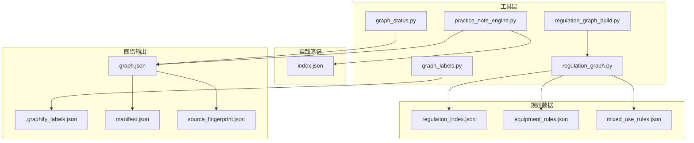
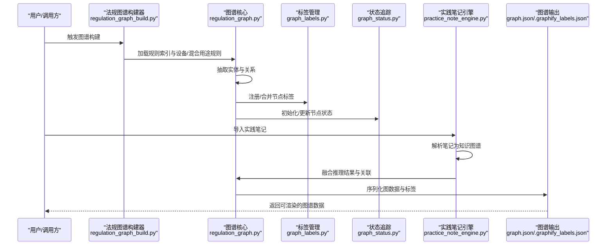
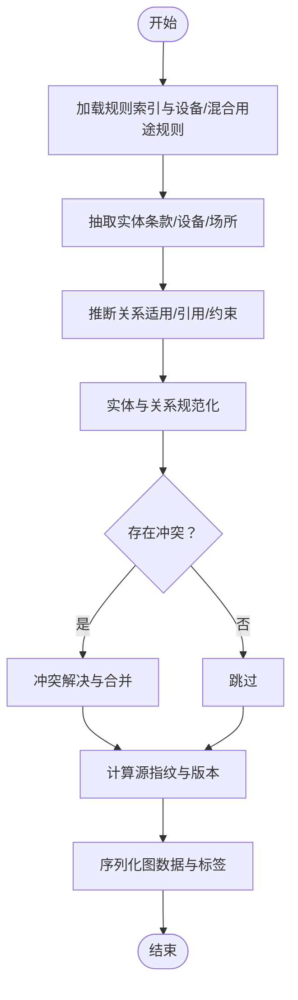
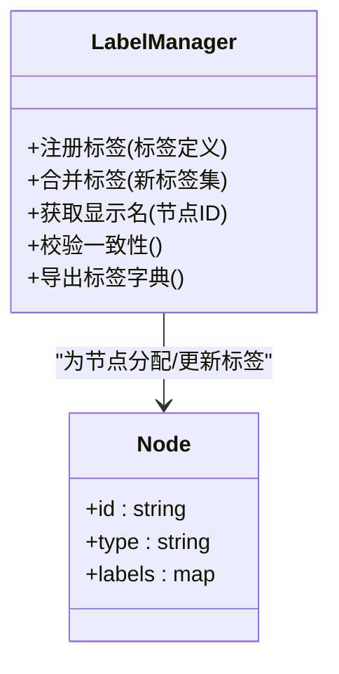
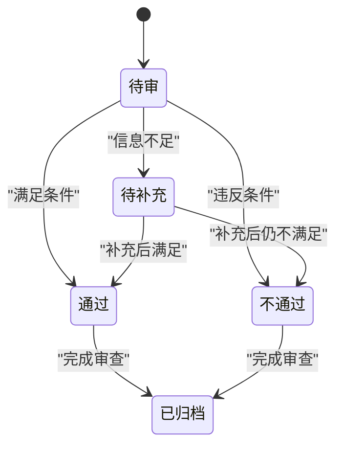
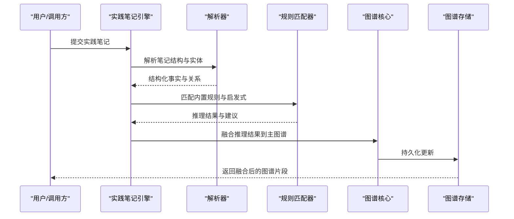
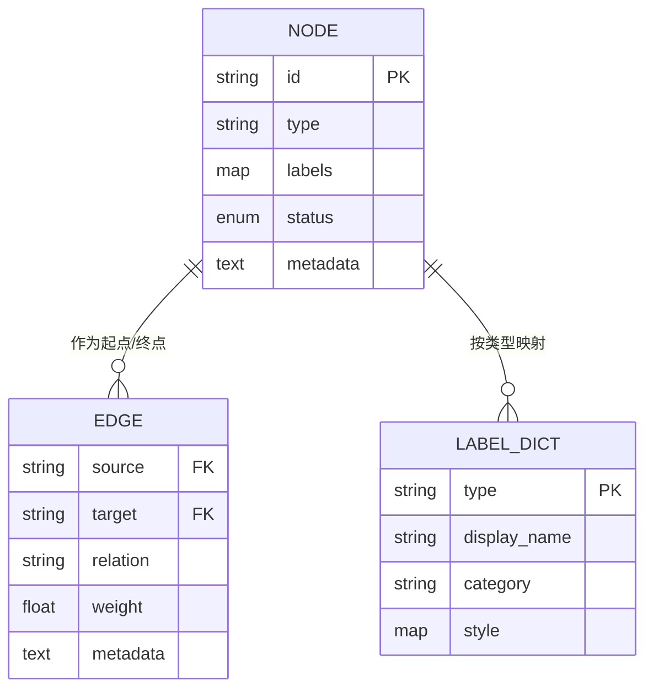
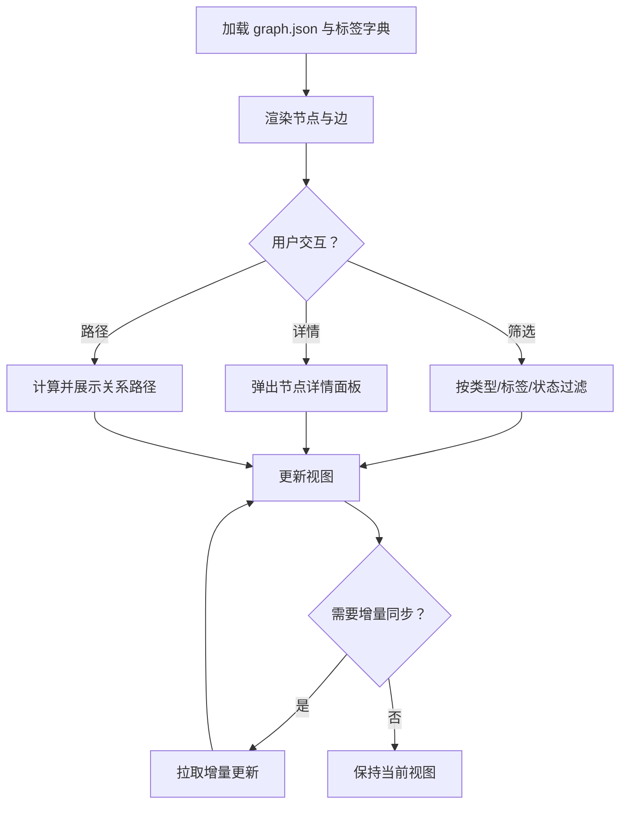
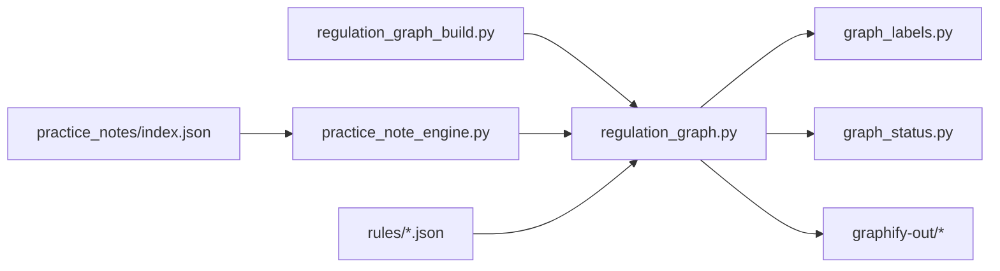

# 可视化图谱系统

<cite>
**本文引用的文件**   
- [graph_labels.py](file://tools/graph_labels.py)
- [graph_status.py](file://tools/graph_status.py)
- [regulation_graph.py](file://tools/regulation_graph.py)
- [regulation_graph_build.py](file://tools/regulation_graph_build.py)
- [practice_note_engine.py](file://tools/practice_note_engine.py)
- [test_graph_labels.py](file://tests/test_graph_labels.py)
- [test_graph_status.py](file://tests/test_graph_status.py)
- [test_regulation_graph.py](file://tests/test_regulation_graph.py)
- [test_regulation_graph_build.py](file://tests/test_regulation_graph_build.py)
- [test_practice_note_engine.py](file://tests/test_practice_note_engine.py)
- [test_practice_note_graph.py](file://tests/test_practice_note_graph.py)
- [graph.json](file://graphify-out/graph.json)
- [.graphify_labels.json](file://graphify-out/.graphify_labels.json)
- [manifest.json](file://graphify-out/manifest.json)
- [source_fingerprint.json](file://graphify-out/source_fingerprint.json)
- [index.json](file://practice_notes/index.json)
- [equipment_rules.json](file://rules/equipment_rules.json)
- [mixed_use_rules.json](file://rules/mixed_use_rules.json)
- [regulation_index.json](file://rules/regulation_index.json)
</cite>

## 目录
1. [简介](#简介)
2. [项目结构](#项目结构)
3. [核心组件](#核心组件)
4. [架构总览](#架构总览)
5. [详细组件分析](#详细组件分析)
6. [依赖关系分析](#依赖关系分析)
7. [性能考量](#性能考量)
8. [故障排查指南](#故障排查指南)
9. [结论](#结论)
10. [附录](#附录)

## 简介
本技术文档面向消防安全设备审查系统的“可视化图谱模块”，聚焦法规关系图谱的构建算法、节点标签管理与状态追踪机制，并详细说明实践笔记引擎的知识图谱表示与推理逻辑。文档涵盖图谱数据的存储结构、查询接口与可视化渲染流程，提供具体的图谱构建示例与交互操作说明，解释图谱与审查工作的集成方式和数据同步机制，并为开发者提供自定义图谱类型和扩展分析功能的开发指南。

## 项目结构
本项目围绕“工具层（tools）”“规则数据（rules）”“实践笔记（practice_notes）”“输出产物（graphify-out）”以及“测试（tests）”组织。与可视化图谱相关的核心代码集中在 tools 目录下，规则数据以 JSON 形式维护，图谱产物由 graphify 管线生成到 graphify-out 目录，测试覆盖关键能力点。

图表来源 
- [regulation_graph.py](file://tools/regulation_graph.py)
- [regulation_graph_build.py](file://tools/regulation_graph_build.py)
- [graph_labels.py](file://tools/graph_labels.py)
- [graph_status.py](file://tools/graph_status.py)
- [practice_note_engine.py](file://tools/practice_note_engine.py)
- [regulation_index.json](file://rules/regulation_index.json)
- [equipment_rules.json](file://rules/equipment_rules.json)
- [mixed_use_rules.json](file://rules/mixed_use_rules.json)
- [index.json](file://practice_notes/index.json)
- [graph.json](file://graphify-out/graph.json)
- [.graphify_labels.json](file://graphify-out/.graphify_labels.json)
- [manifest.json](file://graphify-out/manifest.json)
- [source_fingerprint.json](file://graphify-out/source_fingerprint.json)

章节来源
- [regulation_graph.py](file://tools/regulation_graph.py)
- [regulation_graph_build.py](file://tools/regulation_graph_build.py)
- [graph_labels.py](file://tools/graph_labels.py)
- [graph_status.py](file://tools/graph_status.py)
- [practice_note_engine.py](file://tools/practice_note_engine.py)
- [regulation_index.json](file://rules/regulation_index.json)
- [equipment_rules.json](file://rules/equipment_rules.json)
- [mixed_use_rules.json](file://rules/mixed_use_rules.json)
- [index.json](file://practice_notes/index.json)
- [graph.json](file://graphify-out/graph.json)
- [.graphify_labels.json](file://graphify-out/.graphify_labels.json)
- [manifest.json](file://graphify-out/manifest.json)
- [source_fingerprint.json](file://graphify-out/source_fingerprint.json)

## 核心组件
- 法规关系图谱构建器：负责从规则索引与设备/混合用途规则中抽取实体与关系，生成可渲染的图结构。
- 节点标签管理：集中维护节点标签字典、别名映射与版本指纹，确保前端一致显示与增量更新。
- 状态追踪：为图谱节点与边维护状态（如待审、通过、不通过、待补充等），支持按状态筛选与高亮。
- 实践笔记引擎：将实践笔记解析为知识图谱，支持基于规则的推理与关联检索，辅助审查决策。
- 输出与可视化：将图数据序列化为标准 JSON，附带标签与元数据，供前端渲染与交互。

章节来源
- [regulation_graph.py](file://tools/regulation_graph.py)
- [regulation_graph_build.py](file://tools/regulation_graph_build.py)
- [graph_labels.py](file://tools/graph_labels.py)
- [graph_status.py](file://tools/graph_status.py)
- [practice_note_engine.py](file://tools/practice_note_engine.py)
- [graph.json](file://graphify-out/graph.json)
- [.graphify_labels.json](file://graphify-out/.graphify_labels.json)
- [manifest.json](file://graphify-out/manifest.json)
- [source_fingerprint.json](file://graphify-out/source_fingerprint.json)

## 架构总览
下图展示从规则数据与实践笔记到图谱输出的端到端流程，以及标签与状态管理的参与方式。

图表来源 
- [regulation_graph_build.py](file://tools/regulation_graph_build.py)
- [regulation_graph.py](file://tools/regulation_graph.py)
- [graph_labels.py](file://tools/graph_labels.py)
- [graph_status.py](file://tools/graph_status.py)
- [practice_note_engine.py](file://tools/practice_note_engine.py)
- [graph.json](file://graphify-out/graph.json)
- [.graphify_labels.json](file://graphify-out/.graphify_labels.json)

## 详细组件分析

### 法规关系图谱构建器
- 职责：读取规则索引与设备/混合用途规则，抽取法规条款、设备类型、场所类别等实体，建立“适用/引用/约束”等关系，形成可查询与可视化的图。
- 输入：regulation_index.json、equipment_rules.json、mixed_use_rules.json。
- 处理：实体规范化、关系推断、冲突检测与合并、版本指纹计算。
- 输出：graph.json（节点与边）、.graphify_labels.json（标签字典）。

图表来源 
- [regulation_graph_build.py](file://tools/regulation_graph_build.py)
- [regulation_graph.py](file://tools/regulation_graph.py)
- [regulation_index.json](file://rules/regulation_index.json)
- [equipment_rules.json](file://rules/equipment_rules.json)
- [mixed_use_rules.json](file://rules/mixed_use_rules.json)

章节来源
- [regulation_graph_build.py](file://tools/regulation_graph_build.py)
- [regulation_graph.py](file://tools/regulation_graph.py)
- [regulation_index.json](file://rules/regulation_index.json)
- [equipment_rules.json](file://rules/equipment_rules.json)
- [mixed_use_rules.json](file://rules/mixed_use_rules.json)

### 节点标签管理
- 职责：维护节点标签字典、别名映射、分类与显示名；支持增量更新与一致性校验。
- 关键点：标签去重、别名归一化、多语言显示名、版本指纹对比。
- 使用场景：前端渲染时根据标签字典统一样式与文案；增量构建时仅更新变更标签。

图表来源 
- [graph_labels.py](file://tools/graph_labels.py)
- [.graphify_labels.json](file://graphify-out/.graphify_labels.json)

章节来源
- [graph_labels.py](file://tools/graph_labels.py)
- [.graphify_labels.json](file://graphify-out/.graphify_labels.json)

### 状态追踪机制
- 职责：为节点与边维护审查状态（如待审、通过、不通过、待补充、已忽略等），支持批量更新与按状态过滤。
- 关键点：状态迁移规则、审计日志、状态与证据关联。
- 使用场景：在审查工作流中动态更新状态，并在图谱中高亮显示问题项。

图表来源 
- [graph_status.py](file://tools/graph_status.py)

章节来源
- [graph_status.py](file://tools/graph_status.py)

### 实践笔记引擎（知识图谱与推理）
- 职责：将实践笔记结构化解析为知识图谱，提取事实、假设与结论，进行规则匹配与推理，产出可融合的图谱片段。
- 输入：practice_notes/index.json 及笔记内容。
- 处理：自然语言/结构化字段解析、实体链接、规则匹配、推理链构建、冲突检测。
- 输出：与法规图谱融合的节点与边，支持查询与可视化。

图表来源 
- [practice_note_engine.py](file://tools/practice_note_engine.py)
- [index.json](file://practice_notes/index.json)
- [regulation_graph.py](file://tools/regulation_graph.py)

章节来源
- [practice_note_engine.py](file://tools/practice_note_engine.py)
- [index.json](file://practice_notes/index.json)
- [regulation_graph.py](file://tools/regulation_graph.py)

### 图谱数据存储结构与查询接口
- 存储结构：graph.json 包含 nodes 与 edges 数组，每个节点含 id、type、labels、status 等字段；边含 source、target、relation、weight 等字段。
- 标签字典：.graphify_labels.json 提供节点类型的显示名、分类与样式映射。
- 元数据：manifest.json 记录构建时间、版本、来源指纹；source_fingerprint.json 用于增量构建与一致性校验。
- 查询接口：通常提供按类型、标签、状态、关系类型过滤的查询方法，支持路径搜索与子图提取。

图表来源 
- [graph.json](file://graphify-out/graph.json)
- [.graphify_labels.json](file://graphify-out/.graphify_labels.json)
- [manifest.json](file://graphify-out/manifest.json)
- [source_fingerprint.json](file://graphify-out/source_fingerprint.json)

章节来源
- [graph.json](file://graphify-out/graph.json)
- [.graphify_labels.json](file://graphify-out/.graphify_labels.json)
- [manifest.json](file://graphify-out/manifest.json)
- [source_fingerprint.json](file://graphify-out/source_fingerprint.json)

### 可视化渲染与交互
- 渲染：前端读取 graph.json 与 .graphify_labels.json，按节点类型与标签渲染图形布局与样式。
- 交互：支持点击节点查看详情、按状态筛选、展开关系路径、导出子图。
- 同步：当后端更新图谱或状态时，前端通过增量 manifest 与指纹比对触发局部刷新。

[此图为概念性流程图，不直接映射具体源码文件]

## 依赖关系分析
- 组件耦合：regulation_graph_build.py 依赖 regulation_graph.py 的核心构建能力；graph_labels.py 与 graph_status.py 被构建器与引擎共同使用；practice_note_engine.py 与 regulation_graph.py 进行图谱融合。
- 外部数据：规则数据位于 rules 目录，实践笔记位于 practice_notes 目录，输出产物位于 graphify-out 目录。
- 潜在循环：应避免在构建器与引擎之间直接相互调用，建议通过统一的图谱核心接口进行解耦。

图表来源 
- [regulation_graph_build.py](file://tools/regulation_graph_build.py)
- [regulation_graph.py](file://tools/regulation_graph.py)
- [graph_labels.py](file://tools/graph_labels.py)
- [graph_status.py](file://tools/graph_status.py)
- [practice_note_engine.py](file://tools/practice_note_engine.py)
- [regulation_index.json](file://rules/regulation_index.json)
- [equipment_rules.json](file://rules/equipment_rules.json)
- [mixed_use_rules.json](file://rules/mixed_use_rules.json)
- [index.json](file://practice_notes/index.json)
- [graph.json](file://graphify-out/graph.json)
- [.graphify_labels.json](file://graphify-out/.graphify_labels.json)
- [manifest.json](file://graphify-out/manifest.json)
- [source_fingerprint.json](file://graphify-out/source_fingerprint.json)

章节来源
- [regulation_graph_build.py](file://tools/regulation_graph_build.py)
- [regulation_graph.py](file://tools/regulation_graph.py)
- [graph_labels.py](file://tools/graph_labels.py)
- [graph_status.py](file://tools/graph_status.py)
- [practice_note_engine.py](file://tools/practice_note_engine.py)
- [regulation_index.json](file://rules/regulation_index.json)
- [equipment_rules.json](file://rules/equipment_rules.json)
- [mixed_use_rules.json](file://rules/mixed_use_rules.json)
- [index.json](file://practice_notes/index.json)
- [graph.json](file://graphify-out/graph.json)
- [.graphify_labels.json](file://graphify-out/.graphify_labels.json)
- [manifest.json](file://graphify-out/manifest.json)
- [source_fingerprint.json](file://graphify-out/source_fingerprint.json)

## 性能考量
- 增量构建：利用 source_fingerprint.json 与 manifest.json 进行差异比对，仅重建变更部分，降低构建开销。
- 标签缓存：对标签字典进行内存缓存，避免重复解析与映射。
- 关系推断优化：对大规模规则集采用分块处理与并行推断，减少全量扫描。
- 查询优化：为常用查询维度（类型、标签、状态）建立索引，提升过滤与路径搜索速度。
- 渲染优化：前端按需加载节点与边，支持虚拟滚动与懒加载大图。

[本节为通用指导，不直接分析具体文件]

## 故障排查指南
- 构建失败：检查规则索引与设备/混合用途规则格式是否正确；确认标签字典无重复键；验证状态枚举值是否合法。
- 标签不一致：比较 .graphify_labels.json 与最新标签定义，执行合并与去重；核对显示名与分类映射。
- 状态异常：核查状态迁移规则与证据关联；检查是否有非法状态跳转。
- 推理错误：验证实践笔记解析结果是否符合预期；检查规则匹配器的阈值与优先级设置。
- 可视化异常：确认 graph.json 结构完整；检查标签字典是否存在缺失类型；核对前端样式配置。

章节来源
- [test_graph_labels.py](file://tests/test_graph_labels.py)
- [test_graph_status.py](file://tests/test_graph_status.py)
- [test_regulation_graph.py](file://tests/test_regulation_graph.py)
- [test_regulation_graph_build.py](file://tests/test_regulation_graph_build.py)
- [test_practice_note_engine.py](file://tests/test_practice_note_engine.py)
- [test_practice_note_graph.py](file://tests/test_practice_note_graph.py)

## 结论
本可视化图谱模块通过规范的构建流程、严格的标签与状态管理、以及实践笔记引擎的知识图谱推理，为消防安全设备审查提供了强大的可视化与分析能力。建议在后续迭代中持续完善增量构建、查询索引与前端渲染性能，并扩展更多自定义图谱类型与分析功能，以提升审查效率与准确性。

[本节为总结性内容，不直接分析具体文件]

## 附录
- 图谱构建示例：从 rules 目录加载规则索引与设备/混合用途规则，运行构建器生成 graph.json 与 .graphify_labels.json，随后在前端渲染与交互。
- 交互操作说明：点击节点查看详情、按状态筛选、展开关系路径、导出子图、触发增量同步。
- 集成方式：审查工作流通过调用图谱构建器与状态更新接口，实现数据同步与状态流转。
- 扩展指南：新增图谱类型需在标签管理中注册新类型与显示名，在构建器中增加抽取与关系推断逻辑，在引擎中补充规则匹配与推理模板。

[本节为通用指导，不直接分析具体文件]