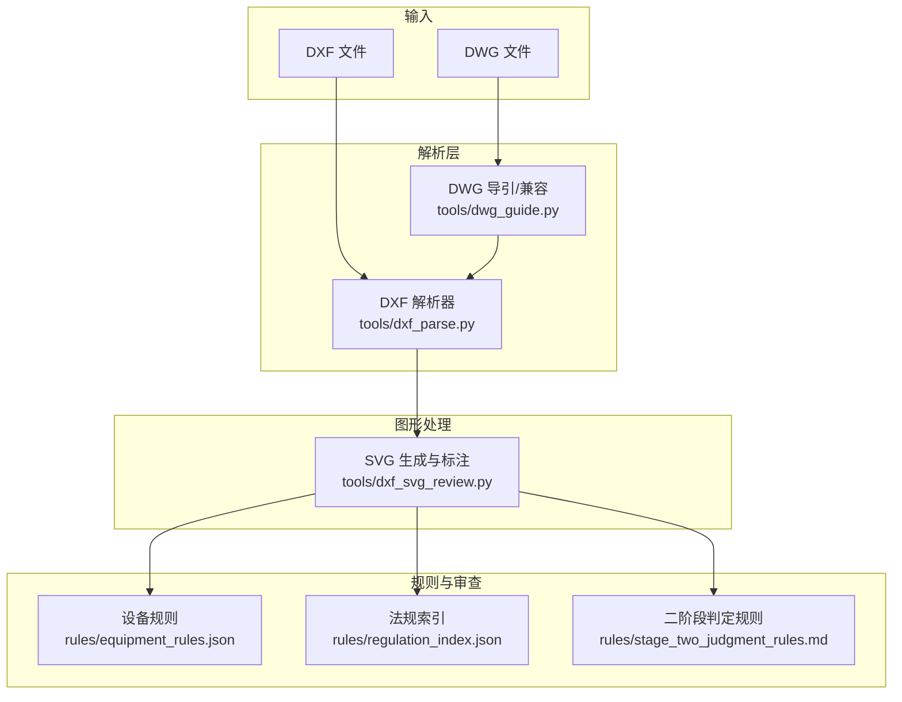
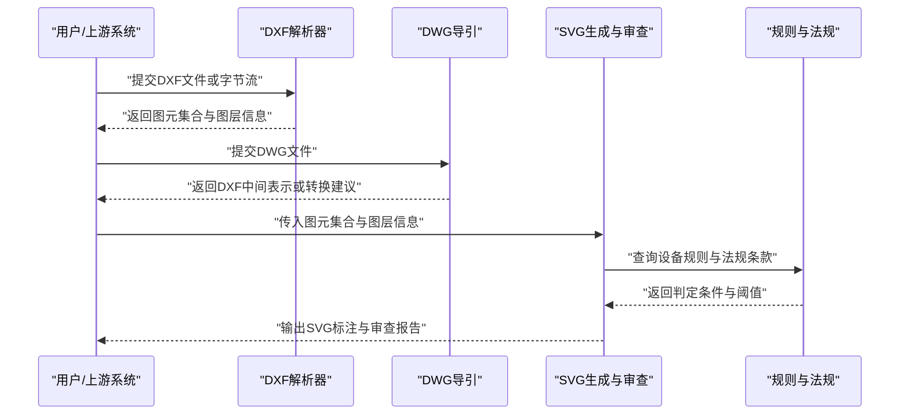
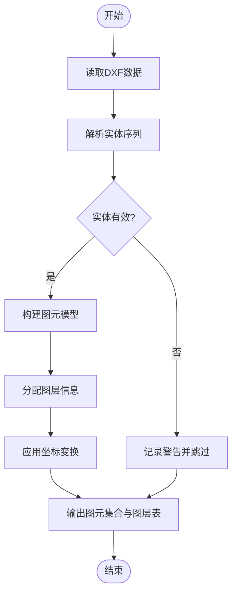
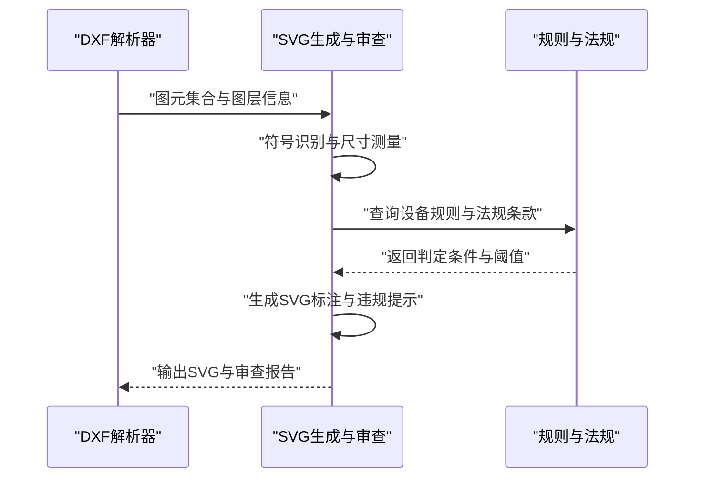
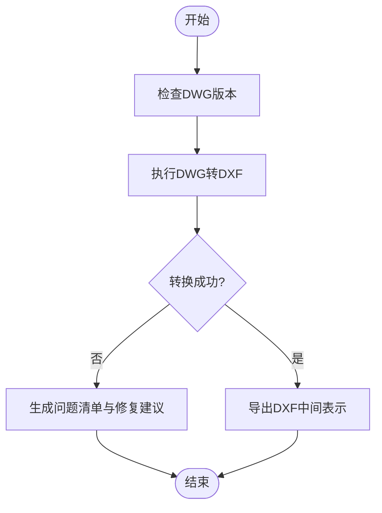
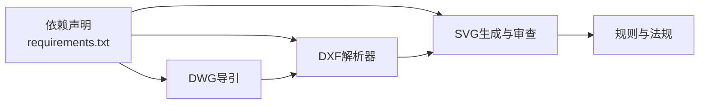

# 图纸分析引擎

<cite>
**本文引用的文件**   
- [tools/dxf_parse.py](file://tools/dxf_parse.py)
- [tools/dxf_svg_review.py](file://tools/dxf_svg_review.py)
- [tools/dwg_guide.py](file://tools/dwg_guide.py)
- [tests/test_dxf_parse.py](file://tests/test_dxf_parse.py)
- [tests/test_dxf_svg_review.py](file://tests/test_dxf_svg_review.py)
- [tests/test_dwg_guide.py](file://tests/test_dwg_guide.py)
- [requirements.txt](file://requirements.txt)
- [rules/equipment_rules.json](file://rules/equipment_rules.json)
- [rules/regulation_index.json](file://rules/regulation_index.json)
- [rules/stage_two_judgment_rules.md](file://rules/stage_two_judgment_rules.md)
</cite>

## 目录
1. [简介](#简介)
2. [项目结构](#项目结构)
3. [核心组件](#核心组件)
4. [架构总览](#架构总览)
5. [详细组件分析](#详细组件分析)
6. [依赖关系分析](#依赖关系分析)
7. [性能考量](#性能考量)
8. [故障排查指南](#故障排查指南)
9. [结论](#结论)
10. [附录](#附录)

## 简介
本技术文档面向消防安全设备审查系统的“图纸分析引擎”，聚焦DXF文件解析、图形元素识别与SVG生成流程，并说明DWG文件格式支持策略、坐标系统转换与图层处理逻辑。文档同时覆盖自动化审查流程（符号识别、尺寸测量、合规性检查）、API调用示例、错误处理策略、与CAD软件的集成方式及格式兼容性，并为高级用户提供自定义解析规则与扩展开发指南。

## 项目结构
本项目将图纸解析与审查工具集中在 tools 目录下，测试用例位于 tests 目录，规则与法规索引位于 rules 目录。关键模块如下：
- DXF解析与SVG审查：tools/dxf_parse.py、tools/dxf_svg_review.py
- DWG导引与兼容：tools/dwg_guide.py
- 规则与法规：rules/equipment_rules.json、rules/regulation_index.json、rules/stage_two_judgment_rules.md
- 依赖声明：requirements.txt
- 测试用例：tests/test_dxf_parse.py、tests/test_dxf_svg_review.py、tests/test_dwg_guide.py

图表来源
- [tools/dxf_parse.py](file://tools/dxf_parse.py)
- [tools/dxf_svg_review.py](file://tools/dxf_svg_review.py)
- [tools/dwg_guide.py](file://tools/dwg_guide.py)
- [rules/equipment_rules.json](file://rules/equipment_rules.json)
- [rules/regulation_index.json](file://rules/regulation_index.json)
- [rules/stage_two_judgment_rules.md](file://rules/stage_two_judgment_rules.md)

章节来源
- [tools/dxf_parse.py](file://tools/dxf_parse.py)
- [tools/dxf_svg_review.py](file://tools/dxf_svg_review.py)
- [tools/dwg_guide.py](file://tools/dwg_guide.py)
- [requirements.txt](file://requirements.txt)

## 核心组件
- DXF解析器：负责读取DXF文本或二进制流，构建内部几何图元模型（点、线、多段线、圆、圆弧、块、属性等），维护图层信息与坐标空间。
- SVG生成与审查：基于解析结果生成可渲染的SVG，叠加标注（尺寸、符号、图层高亮）并输出审查辅助视图。
- DWG导引：提供DWG到DXF的转换建议、常见问题定位与兼容性处理指引，确保DWG输入能稳定进入DXF解析管线。
- 规则与法规：以JSON和Markdown形式定义设备布置规则、间距要求、面积阈值与二阶段判定流程，驱动合规性检查。

章节来源
- [tools/dxf_parse.py](file://tools/dxf_parse.py)
- [tools/dxf_svg_review.py](file://tools/dxf_svg_review.py)
- [tools/dwg_guide.py](file://tools/dwg_guide.py)
- [rules/equipment_rules.json](file://rules/equipment_rules.json)
- [rules/regulation_index.json](file://rules/regulation_index.json)
- [rules/stage_two_judgment_rules.md](file://rules/stage_two_judgment_rules.md)

## 架构总览
下图展示从输入到输出的端到端流程：DXF/DWG输入经解析与转换后，进入图形识别与SVG生成阶段，随后依据规则进行合规性检查并输出审查结果。

图表来源
- [tools/dxf_parse.py](file://tools/dxf_parse.py)
- [tools/dxf_svg_review.py](file://tools/dxf_svg_review.py)
- [tools/dwg_guide.py](file://tools/dwg_guide.py)
- [rules/equipment_rules.json](file://rules/equipment_rules.json)
- [rules/regulation_index.json](file://rules/regulation_index.json)

## 详细组件分析

### DXF解析器（tools/dxf_parse.py）
- 功能要点
  - 解析DXF实体：点、直线、多段线、圆、圆弧、文字、块引用、属性等。
  - 图层管理：记录每个实体的所属图层，支持按图层过滤与分组。
  - 坐标系统：统一转换为工程单位坐标系，支持比例尺与偏移校正。
  - 拓扑构建：建立线段邻接、闭合区域检测、交点计算等基础能力。
- 数据结构
  - 图元对象：包含类型、几何参数、图层、属性字典。
  - 图层表：图层名到图元列表的映射。
  - 坐标变换：缩放因子、平移向量、旋转角度。
- 算法复杂度
  - 线性扫描解析O(n)，拓扑构建O(n log n)（排序与空间索引）。
- 错误处理
  - 非法实体跳过并记录日志；缺失必填字段时回退默认值；坐标异常抛出结构化错误。
- API使用示例（概念）
  - 加载DXF：load_dxf(file_path_or_bytes) -> 图元集合
  - 获取图层：get_layers() -> 图层名列表
  - 过滤图元：filter_by_layer(layer_name) -> 子集图元
  - 坐标变换：apply_transform(scale, offset, rotation) -> 新图元集合

图表来源
- [tools/dxf_parse.py](file://tools/dxf_parse.py)

章节来源
- [tools/dxf_parse.py](file://tools/dxf_parse.py)
- [tests/test_dxf_parse.py](file://tests/test_dxf_parse.py)

### SVG生成与审查（tools/dxf_svg_review.py）
- 功能要点
  - 将图元集合渲染为SVG，支持图层可见性控制、颜色映射与线型设置。
  - 自动标注：对关键尺寸、距离、面积进行测量并标注在SVG上。
  - 符号识别：根据图元形状与属性匹配消防设备符号（如喷淋头、消火栓、报警器等）。
  - 合规性检查：结合规则与法规，输出违规项与建议修正位置。
- 数据处理
  - 图元到SVG元素的映射（line、polyline、circle、path、text等）。
  - 标注布局算法：避免重叠、自适应字号与对齐。
- 性能优化
  - 批量绘制与路径合并；按需渲染（仅显示当前视口范围）。
- 错误处理
  - 渲染失败回退到简化模式；标注冲突时自动调整位置；规则查询失败时降级为人工复核。

图表来源
- [tools/dxf_svg_review.py](file://tools/dxf_svg_review.py)
- [rules/equipment_rules.json](file://rules/equipment_rules.json)
- [rules/regulation_index.json](file://rules/regulation_index.json)

章节来源
- [tools/dxf_svg_review.py](file://tools/dxf_svg_review.py)
- [tests/test_dxf_svg_review.py](file://tests/test_dxf_svg_review.py)

### DWG导引与兼容（tools/dwg_guide.py）
- 功能要点
  - 提供DWG到DXF的转换建议与常见陷阱规避（字体、线型、块定义、外部参照）。
  - 校验DWG版本与兼容性，推荐导出参数以确保DXF解析稳定性。
  - 当DWG无法直接解析时，给出替代方案（第三方转换器、云端服务）。
- 错误处理
  - 版本不匹配时明确提示；缺少字体或线型时列出缺失清单；外部参照未找到时给出修复步骤。

图表来源
- [tools/dwg_guide.py](file://tools/dwg_guide.py)

章节来源
- [tools/dwg_guide.py](file://tools/dwg_guide.py)
- [tests/test_dwg_guide.py](file://tests/test_dwg_guide.py)

### 规则与法规（rules/*.json, rules/*.md）
- 设备规则（equipment_rules.json）
  - 定义设备类型、最小间距、安装高度、覆盖半径等约束。
- 法规索引（regulation_index.json）
  - 关联具体条款与适用场景，便于快速检索与引用。
- 二阶段判定（stage_two_judgment_rules.md）
  - 描述初审通过后的细化审查流程与决策树。

章节来源
- [rules/equipment_rules.json](file://rules/equipment_rules.json)
- [rules/regulation_index.json](file://rules/regulation_index.json)
- [rules/stage_two_judgment_rules.md](file://rules/stage_two_judgment_rules.md)

## 依赖关系分析
- 运行时依赖由 requirements.txt 声明，通常包括DXF/DWG解析库、SVG生成库与数值计算库。
- 模块耦合
  - DXF解析器与SVG生成之间通过图元集合与图层信息进行松耦合通信。
  - 规则与法规以数据驱动，降低代码与业务逻辑的紧耦合。
- 外部集成
  - 与CAD软件通过DXF/DWG标准接口交换数据；必要时借助第三方转换服务。

图表来源
- [requirements.txt](file://requirements.txt)
- [tools/dxf_parse.py](file://tools/dxf_parse.py)
- [tools/dxf_svg_review.py](file://tools/dxf_svg_review.py)
- [tools/dwg_guide.py](file://tools/dwg_guide.py)
- [rules/equipment_rules.json](file://rules/equipment_rules.json)

章节来源
- [requirements.txt](file://requirements.txt)

## 性能考量
- 解析阶段
  - 使用增量解析与流式读取，避免大文件内存峰值。
  - 对多段线与复杂路径进行简化与抽稀，减少后续渲染压力。
- 渲染阶段
  - 分层渲染与视口裁剪，仅绘制可见区域。
  - 标注布局采用四叉树或网格索引，降低碰撞检测开销。
- 规则检查
  - 预编译规则为查找表，提升匹配速度；对热点区域优先检查。

[本节为通用指导，无需特定文件来源]

## 故障排查指南
- 解析失败
  - 检查DXF版本与编码；确认实体是否被外部参照引用；查看缺失图层或样式。
- 渲染异常
  - 验证坐标变换参数；检查SVG命名空间与字体可用性；关闭复杂滤镜以提升稳定性。
- 规则不生效
  - 核对规则JSON结构与字段名称；确认法规条款编号与场景匹配；检查二阶段判定流程配置。
- 调试建议
  - 启用详细日志；输出中间图元集合与图层表；对比原始DXF与生成的SVG差异。

章节来源
- [tests/test_dxf_parse.py](file://tests/test_dxf_parse.py)
- [tests/test_dxf_svg_review.py](file://tests/test_dxf_svg_review.py)
- [tests/test_dwg_guide.py](file://tests/test_dwg_guide.py)

## 结论
图纸分析引擎以DXF为核心输入，辅以DWG导引提升兼容性；通过稳健的解析与渲染管线，结合数据驱动的规则与法规，实现自动化符号识别、尺寸测量与合规性检查。该架构具备良好的可扩展性与可维护性，适合持续迭代与行业规范更新。

[本节为总结性内容，无需特定文件来源]

## 附录

### API调用示例（概念）
- 加载与解析DXF
  - 输入：文件路径或字节流
  - 输出：图元集合、图层表、坐标变换参数
- 生成SVG与标注
  - 输入：图元集合、图层过滤、标注选项
  - 输出：SVG字符串或文件、审查报告
- 查询规则与法规
  - 输入：设备类型、场景、阈值
  - 输出：判定条件、违规项与建议

[本节为概念性示例，无需特定文件来源]

### 自定义解析规则与扩展开发指南
- 新增图元类型
  - 在解析器中注册新的实体映射；定义几何参数与属性字典。
- 自定义符号识别
  - 在SVG生成模块中添加形状模板与属性匹配规则；提供可视化预览。
- 扩展规则体系
  - 在规则JSON中新增条目；在法规索引中补充条款关联；更新二阶段判定流程。
- 测试与验证
  - 编写单元测试覆盖新规则与识别逻辑；使用真实DXF样本进行回归测试。

[本节为扩展指南，无需特定文件来源]