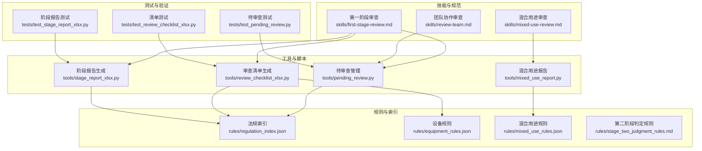
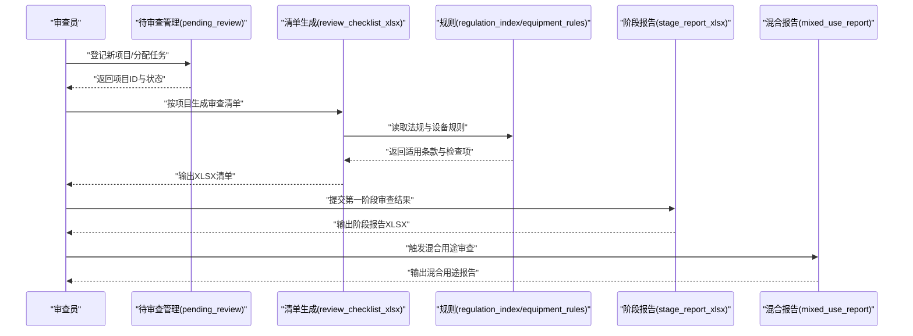
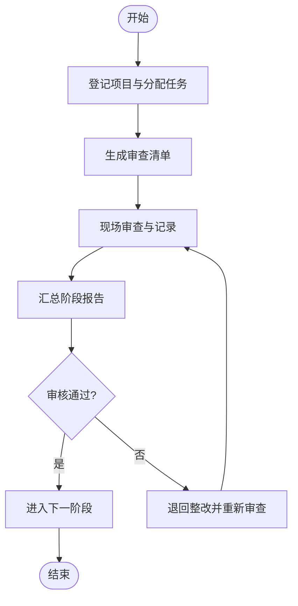
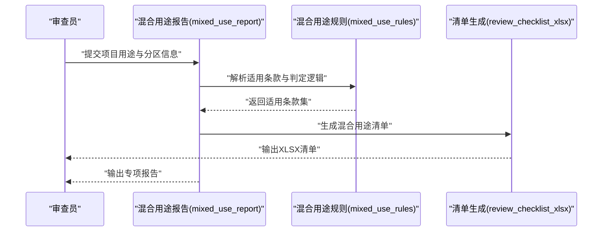
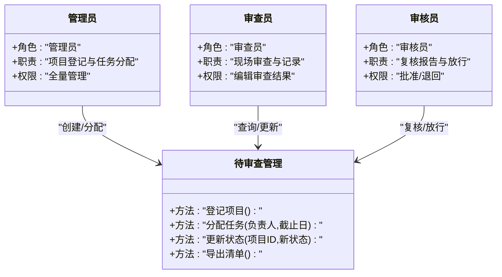
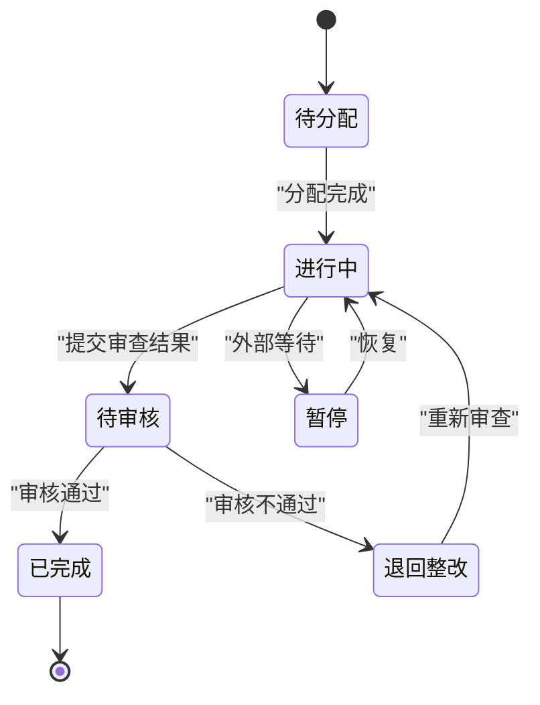
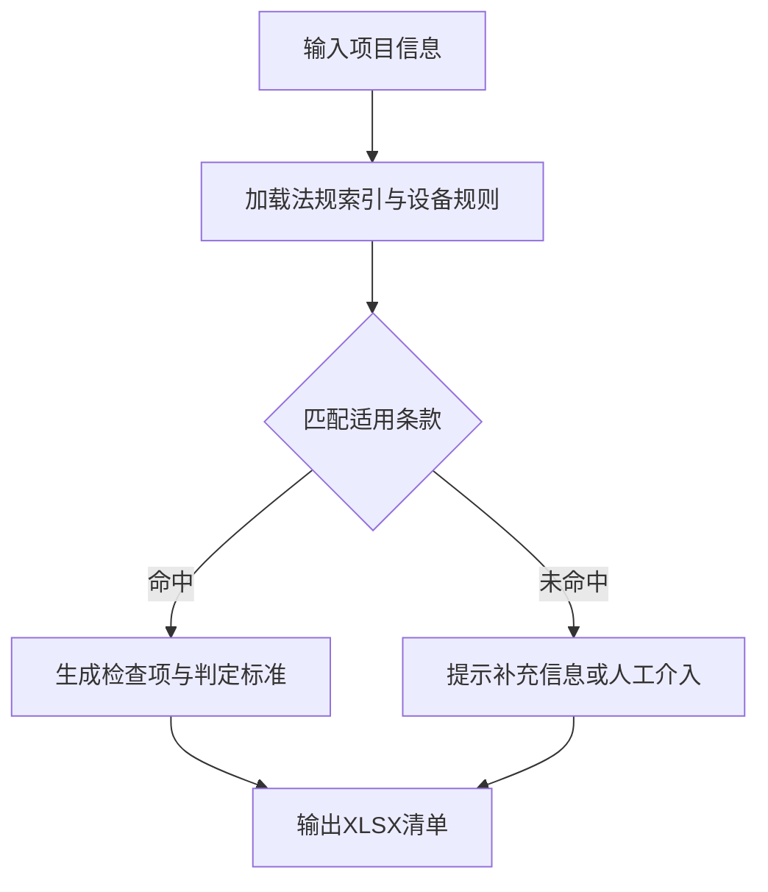
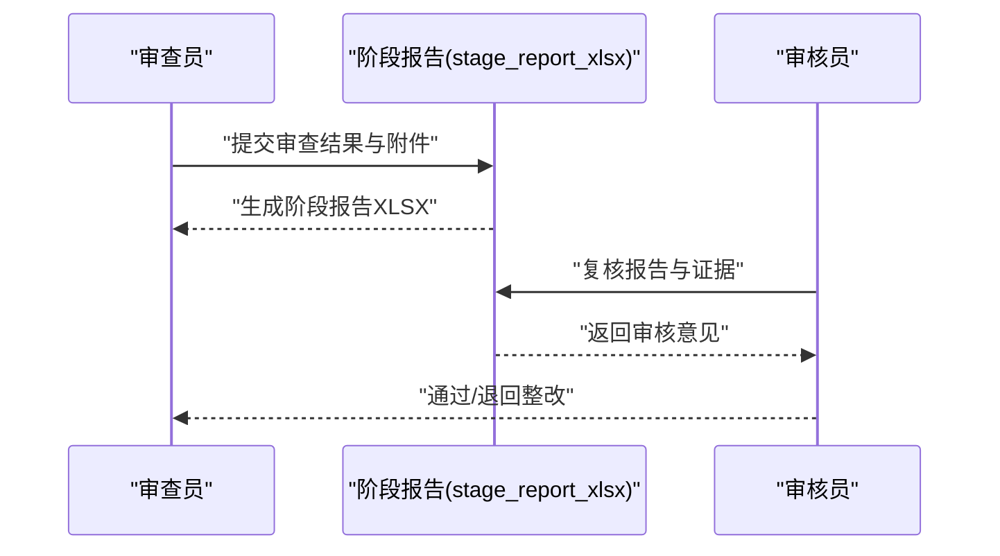
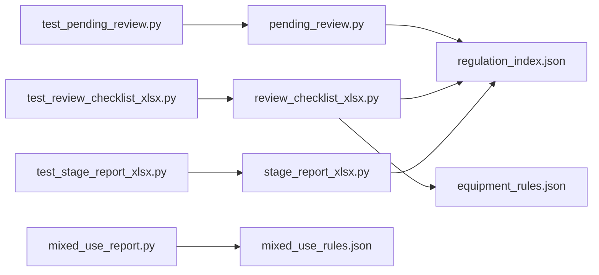

# 审查工作流

<cite>
**本文引用的文件**   
- [skills/first-stage-review.md](file://skills/first-stage-review.md)
- [skills/mixed-use-review.md](file://skills/mixed-use-review.md)
- [skills/review-team.md](file://skills/review-team.md)
- [tools/pending_review.py](file://tools/pending_review.py)
- [tools/review_checklist_xlsx.py](file://tools/review_checklist_xlsx.py)
- [tools/stage_report_xlsx.py](file://tools/stage_report_xlsx.py)
- [tools/mixed_use_report.py](file://tools/mixed_use_report.py)
- [rules/regulation_index.json](file://rules/regulation_index.json)
- [rules/equipment_rules.json](file://rules/equipment_rules.json)
- [rules/mixed_use_rules.json](file://rules/mixed_use_rules.json)
- [rules/stage_two_judgment_rules.md](file://rules/stage_two_judgment_rules.md)
- [tests/test_pending_review.py](file://tests/test_pending_review.py)
- [tests/test_review_checklist_xlsx.py](file://tests/test_review_checklist_xlsx.py)
- [tests/test_stage_report_xlsx.py](file://tests/test_stage_report_xlsx.py)
</cite>

## 目录
1. [简介](#简介)
2. [项目结构](#项目结构)
3. [核心组件](#核心组件)
4. [架构总览](#架构总览)
5. [详细组件分析](#详细组件分析)
6. [依赖关系分析](#依赖关系分析)
7. [性能考量](#性能考量)
8. [故障排查指南](#故障排查指南)
9. [结论](#结论)
10. [附录](#附录)

## 简介
本操作文档面向消防安全设备审查系统的审查人员与团队管理者，围绕“第一阶段审查”“混合用途建筑审查”“团队协作审查”三类工作流，提供标准化的操作步骤、规则优先级与冲突解决机制、待审查项目管理（登记、分配、跟踪）、审查清单自动生成、结果记录与审核流程等。文档以仓库中的技能说明、工具脚本、规则数据与测试用例为依据，确保流程可执行、可审计、可追溯。

## 项目结构
与审查工作流直接相关的代码与文档主要分布在以下位置：
- 技能说明（流程规范）：skills/first-stage-review.md、skills/mixed-use-review.md、skills/review-team.md
- 工具脚本（自动化能力）：tools/pending_review.py、tools/review_checklist_xlsx.py、tools/stage_report_xlsx.py、tools/mixed_use_report.py
- 规则数据（判定依据）：rules/regulation_index.json、rules/equipment_rules.json、rules/mixed_use_rules.json、rules/stage_two_judgment_rules.md
- 测试用例（行为验证）：tests/test_pending_review.py、tests/test_review_checklist_xlsx.py、tests/test_stage_report_xlsx.py

图表来源
- [skills/first-stage-review.md](file://skills/first-stage-review.md)
- [skills/mixed-use-review.md](file://skills/mixed-use-review.md)
- [skills/review-team.md](file://skills/review-team.md)
- [tools/pending_review.py](file://tools/pending_review.py)
- [tools/review_checklist_xlsx.py](file://tools/review_checklist_xlsx.py)
- [tools/stage_report_xlsx.py](file://tools/stage_report_xlsx.py)
- [tools/mixed_use_report.py](file://tools/mixed_use_report.py)
- [rules/regulation_index.json](file://rules/regulation_index.json)
- [rules/equipment_rules.json](file://rules/equipment_rules.json)
- [rules/mixed_use_rules.json](file://rules/mixed_use_rules.json)
- [rules/stage_two_judgment_rules.md](file://rules/stage_two_judgment_rules.md)
- [tests/test_pending_review.py](file://tests/test_pending_review.py)
- [tests/test_review_checklist_xlsx.py](file://tests/test_review_checklist_xlsx.py)
- [tests/test_stage_report_xlsx.py](file://tests/test_stage_report_xlsx.py)

章节来源
- [skills/first-stage-review.md](file://skills/first-stage-review.md)
- [skills/mixed-use-review.md](file://skills/mixed-use-review.md)
- [skills/review-team.md](file://skills/review-team.md)
- [tools/pending_review.py](file://tools/pending_review.py)
- [tools/review_checklist_xlsx.py](file://tools/review_checklist_xlsx.py)
- [tools/stage_report_xlsx.py](file://tools/stage_report_xlsx.py)
- [tools/mixed_use_report.py](file://tools/mixed_use_report.py)
- [rules/regulation_index.json](file://rules/regulation_index.json)
- [rules/equipment_rules.json](file://rules/equipment_rules.json)
- [rules/mixed_use_rules.json](file://rules/mixed_use_rules.json)
- [rules/stage_two_judgment_rules.md](file://rules/stage_two_judgment_rules.md)
- [tests/test_pending_review.py](file://tests/test_pending_review.py)
- [tests/test_review_checklist_xlsx.py](file://tests/test_review_checklist_xlsx.py)
- [tests/test_stage_report_xlsx.py](file://tests/test_stage_report_xlsx.py)

## 核心组件
- 待审查项目管理（pending_review）：负责项目登记、状态流转、任务分配与进度跟踪，支持按条件筛选与导出。
- 审查清单生成（review_checklist_xlsx）：基于法规索引与设备规则，为单个项目或批量项目自动生成标准化审查清单（XLSX）。
- 阶段报告生成（stage_report_xlsx）：汇总第一阶段审查结果，输出阶段报告（XLSX），便于归档与复核。
- 混合用途报告（mixed_use_report）：针对混合用途建筑，依据混合用途规则生成专项报告（XLSX/PDF）。
- 规则体系（regulation_index/equipment_rules/mixed_use_rules/stage_two_judgment_rules）：提供法规条款索引、设备配置规则、混合用途判定规则及第二阶段判定规则，作为审查与自动生成的依据。

章节来源
- [tools/pending_review.py](file://tools/pending_review.py)
- [tools/review_checklist_xlsx.py](file://tools/review_checklist_xlsx.py)
- [tools/stage_report_xlsx.py](file://tools/stage_report_xlsx.py)
- [tools/mixed_use_report.py](file://tools/mixed_use_report.py)
- [rules/regulation_index.json](file://rules/regulation_index.json)
- [rules/equipment_rules.json](file://rules/equipment_rules.json)
- [rules/mixed_use_rules.json](file://rules/mixed_use_rules.json)
- [rules/stage_two_judgment_rules.md](file://rules/stage_two_judgment_rules.md)

## 架构总览
审查工作流由“技能规范驱动 + 工具脚本实现 + 规则数据支撑 + 测试用例保障”的闭环构成。输入包括项目资料与法规规则；处理过程遵循各技能文档的流程；输出包括清单、报告与状态更新；并通过测试用例持续验证正确性。

图表来源
- [tools/pending_review.py](file://tools/pending_review.py)
- [tools/review_checklist_xlsx.py](file://tools/review_checklist_xlsx.py)
- [tools/stage_report_xlsx.py](file://tools/stage_report_xlsx.py)
- [tools/mixed_use_report.py](file://tools/mixed_use_report.py)
- [rules/regulation_index.json](file://rules/regulation_index.json)
- [rules/equipment_rules.json](file://rules/equipment_rules.json)

## 详细组件分析

### 第一阶段审查工作流
- 目标：对常规场所进行合规性初筛，形成标准化清单与阶段报告。
- 关键步骤：
  - 项目登记与任务分配：在待审查管理中创建项目、指定负责人与截止日期。
  - 清单生成：调用清单生成工具，依据法规索引与设备规则生成检查项。
  - 现场审查与记录：逐项核对并填写结果，标记不符合项与整改建议。
  - 结果汇总：通过阶段报告工具汇总结果，生成可归档的XLSX。
  - 审核与放行：由审核人复核报告，确认是否进入下一阶段或退回整改。

图表来源
- [tools/pending_review.py](file://tools/pending_review.py)
- [tools/review_checklist_xlsx.py](file://tools/review_checklist_xlsx.py)
- [tools/stage_report_xlsx.py](file://tools/stage_report_xlsx.py)
- [rules/regulation_index.json](file://rules/regulation_index.json)
- [rules/equipment_rules.json](file://rules/equipment_rules.json)

章节来源
- [skills/first-stage-review.md](file://skills/first-stage-review.md)
- [tools/pending_review.py](file://tools/pending_review.py)
- [tools/review_checklist_xlsx.py](file://tools/review_checklist_xlsx.py)
- [tools/stage_report_xlsx.py](file://tools/stage_report_xlsx.py)
- [rules/regulation_index.json](file://rules/regulation_index.json)
- [rules/equipment_rules.json](file://rules/equipment_rules.json)

### 混合用途建筑审查工作流
- 目标：针对多用途建筑，识别不同用途区域的差异化要求，生成专项审查报告。
- 关键步骤：
  - 用途识别：根据项目信息匹配混合用途规则，确定适用条款集合。
  - 区域划分：按楼层或功能区划分审查单元，明确各单元适用规则。
  - 清单与报告：生成混合用途专用清单与报告，标注差异项与冲突点。
  - 协同评审：组织跨专业评审，统一判定口径并形成决议。

图表来源
- [tools/mixed_use_report.py](file://tools/mixed_use_report.py)
- [tools/review_checklist_xlsx.py](file://tools/review_checklist_xlsx.py)
- [rules/mixed_use_rules.json](file://rules/mixed_use_rules.json)

章节来源
- [skills/mixed-use-review.md](file://skills/mixed-use-review.md)
- [tools/mixed_use_report.py](file://tools/mixed_use_report.py)
- [tools/review_checklist_xlsx.py](file://tools/review_checklist_xlsx.py)
- [rules/mixed_use_rules.json](file://rules/mixed_use_rules.json)

### 团队协作审查工作流
- 目标：在多审查员协作场景下，确保任务分配、进度同步与结果一致性。
- 关键步骤：
  - 角色与权限：定义审查员、审核员、管理员角色与权限边界。
  - 任务看板：使用待审查管理维护任务状态（待分配、进行中、待审核、已完成）。
  - 协同评审：对争议项发起会审，记录决议并更新至项目档案。
  - 质量抽检：随机抽取已结案项目进行抽检，确保标准一致。

图表来源
- [skills/review-team.md](file://skills/review-team.md)
- [tools/pending_review.py](file://tools/pending_review.py)

章节来源
- [skills/review-team.md](file://skills/review-team.md)
- [tools/pending_review.py](file://tools/pending_review.py)

### 待审查项目的管理机制（登记、分配、跟踪）
- 登记：录入项目名称、地址、用途分类、提交单位与联系人。
- 分配：指定主审与协审人员，设置截止日期与优先级。
- 跟踪：维护状态机（待分配→进行中→待审核→已完成/退回），支持按状态与责任人筛选。
- 导出：导出待审查列表与进度报表，用于会议汇报与资源调度。

图表来源
- [tools/pending_review.py](file://tools/pending_review.py)
- [tests/test_pending_review.py](file://tests/test_pending_review.py)

章节来源
- [tools/pending_review.py](file://tools/pending_review.py)
- [tests/test_pending_review.py](file://tests/test_pending_review.py)

### 审查清单的自动生成（规则驱动）
- 输入：项目基本信息、用途分类、面积与楼层信息。
- 规则匹配：从法规索引与设备规则中检索适用条款，生成检查项。
- 输出：标准化XLSX清单，包含条款号、检查要点、符合性判定与备注。
- 校验：通过测试用例验证清单结构与内容完整性。

图表来源
- [tools/review_checklist_xlsx.py](file://tools/review_checklist_xlsx.py)
- [rules/regulation_index.json](file://rules/regulation_index.json)
- [rules/equipment_rules.json](file://rules/equipment_rules.json)
- [tests/test_review_checklist_xlsx.py](file://tests/test_review_checklist_xlsx.py)

章节来源
- [tools/review_checklist_xlsx.py](file://tools/review_checklist_xlsx.py)
- [rules/regulation_index.json](file://rules/regulation_index.json)
- [rules/equipment_rules.json](file://rules/equipment_rules.json)
- [tests/test_review_checklist_xlsx.py](file://tests/test_review_checklist_xlsx.py)

### 审查结果的记录与审核流程
- 记录：在清单中逐项填写符合性判定、证据材料编号与整改建议。
- 汇总：阶段报告工具聚合所有检查项，计算通过率与问题分布。
- 审核：审核员对照原始材料与清单进行复核，决定放行或退回。
- 归档：将最终报告与清单归档至项目档案，供后续查阅与审计。

图表来源
- [tools/stage_report_xlsx.py](file://tools/stage_report_xlsx.py)
- [tests/test_stage_report_xlsx.py](file://tests/test_stage_report_xlsx.py)

章节来源
- [tools/stage_report_xlsx.py](file://tools/stage_report_xlsx.py)
- [tests/test_stage_report_xlsx.py](file://tests/test_stage_report_xlsx.py)

### 审查规则的优先级与冲突解决机制
- 优先级原则：
  - 上位法优先：国家/地方强制性标准高于行业指导文件。
  - 专规优先：针对特定用途或设备的专门规定优先于通用条款。
  - 最新优先：同一事项存在新旧版本时，采用最新版本。
- 冲突解决：
  - 规则冲突时，先尝试通过“第二阶段判定规则”进行裁决。
  - 无法裁决时，组织专家会审并形成书面决议，纳入知识库。
  - 所有冲突与裁决需记录在案，并在后续项目中引用。

章节来源
- [rules/stage_two_judgment_rules.md](file://rules/stage_two_judgment_rules.md)

## 依赖关系分析
- 工具与规则：清单与报告工具强依赖规则数据（法规索引、设备规则、混合用途规则）。
- 技能与工具：技能文档定义流程，工具脚本实现具体步骤。
- 测试与工具：测试用例覆盖工具的关键路径，确保稳定性与可回归性。

图表来源
- [tools/pending_review.py](file://tools/pending_review.py)
- [tools/review_checklist_xlsx.py](file://tools/review_checklist_xlsx.py)
- [tools/stage_report_xlsx.py](file://tools/stage_report_xlsx.py)
- [tools/mixed_use_report.py](file://tools/mixed_use_report.py)
- [rules/regulation_index.json](file://rules/regulation_index.json)
- [rules/equipment_rules.json](file://rules/equipment_rules.json)
- [rules/mixed_use_rules.json](file://rules/mixed_use_rules.json)
- [tests/test_pending_review.py](file://tests/test_pending_review.py)
- [tests/test_review_checklist_xlsx.py](file://tests/test_review_checklist_xlsx.py)
- [tests/test_stage_report_xlsx.py](file://tests/test_stage_report_xlsx.py)

章节来源
- [tools/pending_review.py](file://tools/pending_review.py)
- [tools/review_checklist_xlsx.py](file://tools/review_checklist_xlsx.py)
- [tools/stage_report_xlsx.py](file://tools/stage_report_xlsx.py)
- [tools/mixed_use_report.py](file://tools/mixed_use_report.py)
- [rules/regulation_index.json](file://rules/regulation_index.json)
- [rules/equipment_rules.json](file://rules/equipment_rules.json)
- [rules/mixed_use_rules.json](file://rules/mixed_use_rules.json)
- [tests/test_pending_review.py](file://tests/test_pending_review.py)
- [tests/test_review_checklist_xlsx.py](file://tests/test_review_checklist_xlsx.py)
- [tests/test_stage_report_xlsx.py](file://tests/test_stage_report_xlsx.py)

## 性能考量
- 规则匹配优化：对法规索引建立快速检索索引（如按用途、面积阈值），减少扫描开销。
- 批量生成：清单与报告支持批量处理，避免重复I/O与规则加载。
- 缓存策略：对常用规则集与模板进行内存缓存，降低启动与渲染时间。
- 并发控制：在高并发场景下限制并行度，防止资源争用导致超时。

[本节为通用性能建议，不直接分析具体文件]

## 故障排查指南
- 清单生成失败：
  - 检查法规索引与设备规则文件完整性与编码。
  - 确认项目信息字段齐全（用途、面积、楼层）。
  - 查看测试用例输出定位异常分支。
- 阶段报告不完整：
  - 核查审查结果是否全部提交且格式正确。
  - 检查阶段报告工具的输入参数与模板可用性。
- 混合用途报告错误：
  - 确认用途分区信息与混合用途规则匹配。
  - 排查规则冲突与裁决记录是否完整。
- 待审查状态异常：
  - 检查状态机转换是否符合预期。
  - 核对任务分配与截止时间设置。

章节来源
- [tools/review_checklist_xlsx.py](file://tools/review_checklist_xlsx.py)
- [tools/stage_report_xlsx.py](file://tools/stage_report_xlsx.py)
- [tools/mixed_use_report.py](file://tools/mixed_use_report.py)
- [tools/pending_review.py](file://tools/pending_review.py)
- [tests/test_review_checklist_xlsx.py](file://tests/test_review_checklist_xlsx.py)
- [tests/test_stage_report_xlsx.py](file://tests/test_stage_report_xlsx.py)
- [tests/test_pending_review.py](file://tests/test_pending_review.py)

## 结论
本工作流以技能规范为指引、工具脚本为载体、规则数据为依据、测试用例为保障，构建了从项目登记到结果归档的端到端审查流程。通过明确的优先级与冲突解决机制，确保审查的一致性与可追溯性。建议在实际使用中结合团队规模与项目复杂度，合理配置任务分配与审核层级，并持续完善规则库与模板以提升效率与质量。

[本节为总结性内容，不直接分析具体文件]

## 附录
- 最佳实践建议：
  - 在项目登记时尽可能完善用途与面积信息，提升规则匹配准确率。
  - 对复杂项目提前组织预评审，识别潜在冲突与高风险项。
  - 定期回顾与更新规则库，确保与最新法规保持一致。
  - 建立常见问题知识库，缩短审查周期与培训成本。
- 参考文件：
  - 技能说明：第一阶段审查、混合用途审查、团队协作审查
  - 工具脚本：待审查管理、清单生成、阶段报告、混合用途报告
  - 规则数据：法规索引、设备规则、混合用途规则、第二阶段判定规则
  - 测试用例：待审查、清单、阶段报告的验证

[本节为补充信息，不直接分析具体文件]