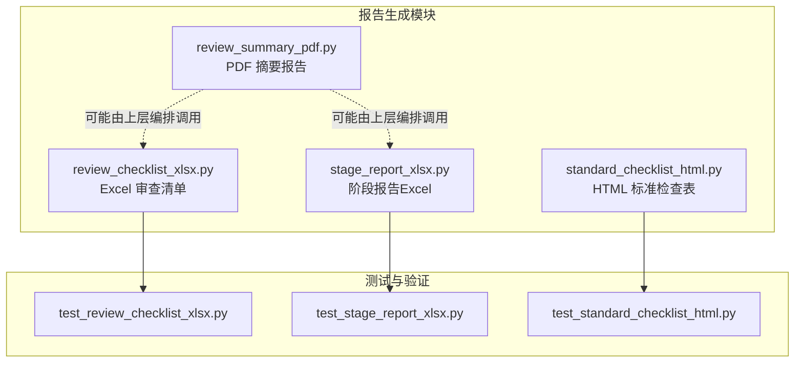
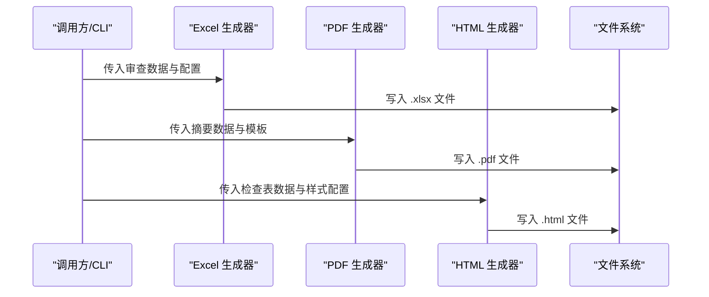
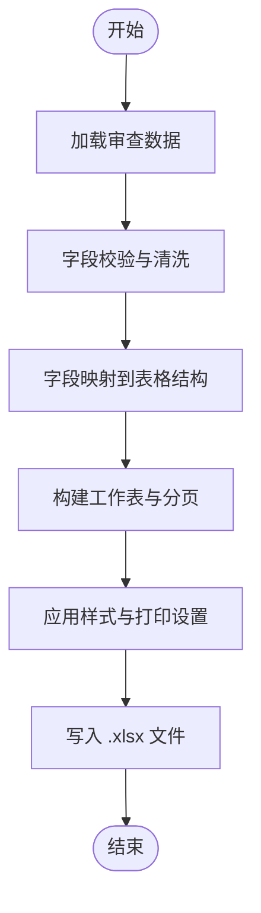
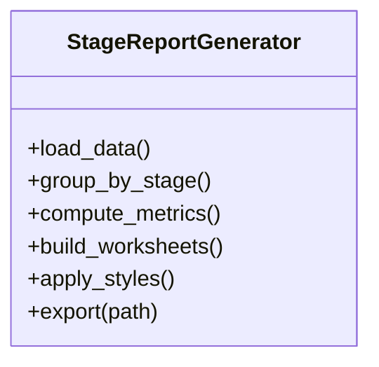
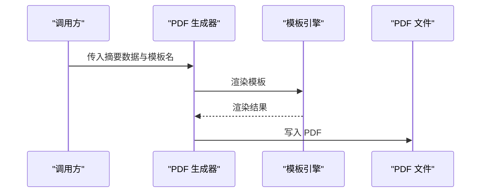
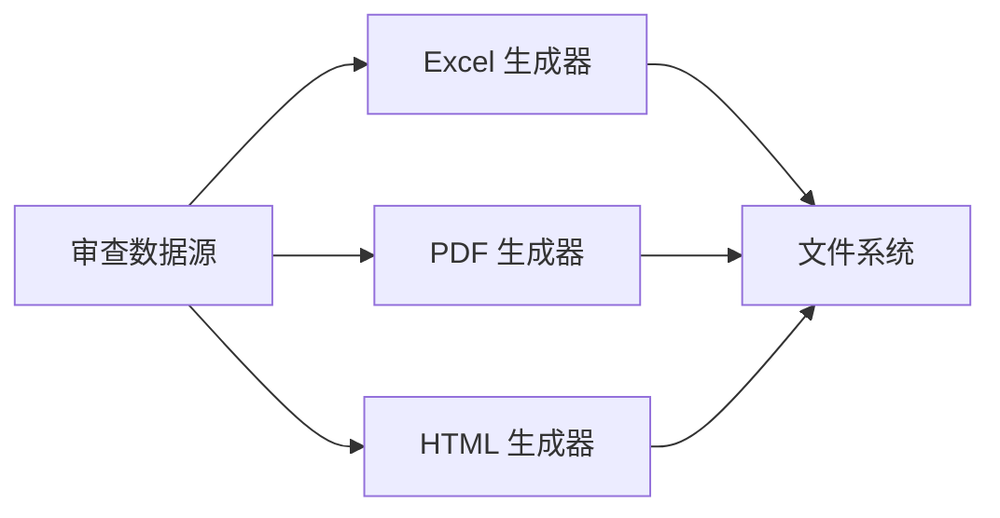

# 报告生成系统

<cite>
**本文引用的文件**   
- [tools/review_checklist_xlsx.py](file://tools/review_checklist_xlsx.py)
- [tools/stage_report_xlsx.py](file://tools/stage_report_xlsx.py)
- [tools/review_summary_pdf.py](file://tools/review_summary_pdf.py)
- [tools/standard_checklist_html.py](file://tools/standard_checklist_html.py)
- [tests/test_review_checklist_xlsx.py](file://tests/test_review_checklist_xlsx.py)
- [tests/test_stage_report_xlsx.py](file://tests/test_stage_report_xlsx.py)
- [tests/test_standard_checklist_html.py](file://tests/test_standard_checklist_html.py)
</cite>

## 目录
1. [简介](#简介)
2. [项目结构](#项目结构)
3. [核心组件](#核心组件)
4. [架构总览](#架构总览)
5. [详细组件分析](#详细组件分析)
6. [依赖关系分析](#依赖关系分析)
7. [性能考量](#性能考量)
8. [故障排查指南](#故障排查指南)
9. [结论](#结论)
10. [附录](#附录)

## 简介
本技术文档聚焦消防安全设备审查系统的“报告生成模块”，覆盖以下关键能力：
- Excel 审查清单与阶段报告的生成机制
- PDF 摘要报告的生成流程
- HTML 标准检查表的模板系统与样式定制
- 报告数据来源、格式转换与输出优化
- API 接口说明与参数配置选项
- 多格式输出的兼容性与批量处理能力
- 自定义报告模板与扩展输出格式的开发者指南

该模块通过工具脚本提供命令行入口，配合测试用例验证行为，确保在多种输出格式下的一致性与稳定性。

## 项目结构
报告生成相关代码主要位于 tools 目录，测试用例位于 tests 目录。核心文件包括：
- review_checklist_xlsx.py：Excel 审查清单生成
- stage_report_xlsx.py：阶段报告（Excel）生成
- review_summary_pdf.py：PDF 摘要报告生成
- standard_checklist_html.py：HTML 标准检查表生成

图表来源
- [tools/review_checklist_xlsx.py](file://tools/review_checklist_xlsx.py)
- [tools/stage_report_xlsx.py](file://tools/stage_report_xlsx.py)
- [tools/review_summary_pdf.py](file://tools/review_summary_pdf.py)
- [tools/standard_checklist_html.py](file://tools/standard_checklist_html.py)
- [tests/test_review_checklist_xlsx.py](file://tests/test_review_checklist_xlsx.py)
- [tests/test_stage_report_xlsx.py](file://tests/test_stage_report_xlsx.py)
- [tests/test_standard_checklist_html.py](file://tests/test_standard_checklist_html.py)

章节来源
- [tools/review_checklist_xlsx.py](file://tools/review_checklist_xlsx.py)
- [tools/stage_report_xlsx.py](file://tools/stage_report_xlsx.py)
- [tools/review_summary_pdf.py](file://tools/review_summary_pdf.py)
- [tools/standard_checklist_html.py](file://tools/standard_checklist_html.py)
- [tests/test_review_checklist_xlsx.py](file://tests/test_review_checklist_xlsx.py)
- [tests/test_stage_report_xlsx.py](file://tests/test_stage_report_xlsx.py)
- [tests/test_standard_checklist_html.py](file://tests/test_standard_checklist_html.py)

## 核心组件
- Excel 审查清单生成器：负责将审查数据转换为结构化表格，支持分页、合并单元格、样式与打印设置等。
- 阶段报告生成器：按审查阶段汇总结果，生成包含统计、趋势与明细的 Excel 报告。
- PDF 摘要报告生成器：抽取关键结论与指标，生成便于审阅的 PDF 摘要。
- HTML 标准检查表生成器：基于模板渲染 HTML 检查表，支持样式定制与主题切换。

章节来源
- [tools/review_checklist_xlsx.py](file://tools/review_checklist_xlsx.py)
- [tools/stage_report_xlsx.py](file://tools/stage_report_xlsx.py)
- [tools/review_summary_pdf.py](file://tools/review_summary_pdf.py)
- [tools/standard_checklist_html.py](file://tools/standard_checklist_html.py)

## 架构总览
报告生成模块采用“输入数据 → 数据处理 → 模板渲染 → 输出文件”的分层架构。各工具脚本作为独立入口，可被上层编排或 CLI 直接调用。

图表来源
- [tools/review_checklist_xlsx.py](file://tools/review_checklist_xlsx.py)
- [tools/stage_report_xlsx.py](file://tools/stage_report_xlsx.py)
- [tools/review_summary_pdf.py](file://tools/review_summary_pdf.py)
- [tools/standard_checklist_html.py](file://tools/standard_checklist_html.py)

## 详细组件分析

### Excel 审查清单生成器（review_checklist_xlsx.py）
- 功能要点
  - 读取审查数据源（如 JSON/CSV/数据库），进行字段映射与校验
  - 构建工作表结构：标题行、数据行、批注列、状态标记
  - 应用样式：字体、边框、对齐、条件格式、冻结窗格
  - 输出优化：分页符、打印区域、页眉页脚、导出路径与命名规则
- 典型处理流程
  - 数据清洗 → 字段映射 → 表格布局 → 样式应用 → 文件写入
- 错误处理
  - 缺失字段提示、类型转换异常捕获、IO 异常重试与回滚
- 扩展点
  - 新增列/工作表：通过配置项注册新字段与渲染逻辑
  - 自定义样式：注入样式模板或覆盖默认样式字典

图表来源
- [tools/review_checklist_xlsx.py](file://tools/review_checklist_xlsx.py)

章节来源
- [tools/review_checklist_xlsx.py](file://tools/review_checklist_xlsx.py)
- [tests/test_review_checklist_xlsx.py](file://tests/test_review_checklist_xlsx.py)

### 阶段报告生成器（stage_report_xlsx.py）
- 功能要点
  - 按审查阶段聚合数据，生成统计摘要与明细列表
  - 支持多工作表：概览、趋势图数据、问题分类、整改建议
  - 内置图表数据准备与样式模板
- 典型处理流程
  - 阶段分组 → 指标计算 → 图表数据准备 → 多表构建 → 输出
- 错误处理
  - 空数据集保护、数值计算异常、图表数据完整性校验
- 扩展点
  - 新增阶段维度：扩展分组键与指标定义
  - 自定义图表：接入新的图表库或模板

图表来源
- [tools/stage_report_xlsx.py](file://tools/stage_report_xlsx.py)

章节来源
- [tools/stage_report_xlsx.py](file://tools/stage_report_xlsx.py)
- [tests/test_stage_report_xlsx.py](file://tests/test_stage_report_xlsx.py)

### PDF 摘要报告生成器（review_summary_pdf.py）
- 功能要点
  - 抽取关键结论、风险等级、整改优先级
  - 使用模板渲染文本、表格与图表快照
  - 控制页面布局、页眉页脚、目录与书签
- 典型处理流程
  - 数据抽取 → 模板填充 → 布局排版 → PDF 生成
- 错误处理
  - 模板缺失、渲染失败、资源加载异常
- 扩展点
  - 新增模板：通过模板引擎注册新布局
  - 嵌入图表：支持 PNG/SVG 插入与缩放

图表来源
- [tools/review_summary_pdf.py](file://tools/review_summary_pdf.py)

章节来源
- [tools/review_summary_pdf.py](file://tools/review_summary_pdf.py)

### HTML 标准检查表生成器（standard_checklist_html.py）
- 功能要点
  - 基于 HTML 模板渲染检查表，支持主题与样式定制
  - 动态生成表格、折叠面板、筛选与搜索
  - 输出响应式布局，适配不同屏幕尺寸
- 典型处理流程
  - 模板加载 → 数据绑定 → 样式注入 → HTML 输出
- 错误处理
  - 模板解析异常、样式加载失败、数据绑定校验
- 扩展点
  - 新增模板变量：在模板中声明并绑定数据
  - 自定义样式：通过 CSS 类或主题文件覆盖默认样式

图表来源
- [tools/standard_checklist_html.py](file://tools/standard_checklist_html.py)

章节来源
- [tools/standard_checklist_html.py](file://tools/standard_checklist_html.py)
- [tests/test_standard_checklist_html.py](file://tests/test_standard_checklist_html.py)

## 依赖关系分析
- 内部依赖
  - 各生成器之间无强耦合，通常由上层编排统一调度
  - 共享的数据模型与配置可通过模块导入复用
- 外部依赖
  - Excel 生成依赖电子表格库（如 openpyxl/xlwt）
  - PDF 生成依赖 PDF 渲染库（如 reportlab/weasyprint）
  - HTML 生成依赖模板引擎（如 Jinja2）与 CSS 框架
- 循环依赖
  - 当前设计避免循环导入，各工具脚本独立运行

图表来源
- [tools/review_checklist_xlsx.py](file://tools/review_checklist_xlsx.py)
- [tools/stage_report_xlsx.py](file://tools/stage_report_xlsx.py)
- [tools/review_summary_pdf.py](file://tools/review_summary_pdf.py)
- [tools/standard_checklist_html.py](file://tools/standard_checklist_html.py)

章节来源
- [tools/review_checklist_xlsx.py](file://tools/review_checklist_xlsx.py)
- [tools/stage_report_xlsx.py](file://tools/stage_report_xlsx.py)
- [tools/review_summary_pdf.py](file://tools/review_summary_pdf.py)
- [tools/standard_checklist_html.py](file://tools/standard_checklist_html.py)

## 性能考量
- 大数据量处理
  - 分块读取与写入，避免内存溢出
  - 延迟渲染与懒加载，提升首屏速度
- I/O 优化
  - 并行写入多个文件时限制并发度
  - 使用缓冲与压缩减少磁盘压力
- 模板渲染
  - 缓存模板解析结果，避免重复编译
  - 预计算复杂表达式，减少渲染开销
- 输出优化
  - Excel：启用只写模式、减少样式对象创建
  - PDF：精简图片分辨率与矢量图复杂度
  - HTML：压缩静态资源与内联关键 CSS

[本节为通用指导，不直接分析具体文件]

## 故障排查指南
- 常见问题
  - 模板缺失或路径错误：检查模板文件存在性与权限
  - 数据字段缺失：核对字段映射配置与数据源结构
  - 样式渲染异常：确认样式文件加载顺序与兼容性
  - 输出文件损坏：检查写入权限与磁盘空间
- 调试建议
  - 启用详细日志，记录关键步骤与异常堆栈
  - 使用最小数据集复现问题，逐步定位
  - 对比预期输出与实际输出差异，定位渲染偏差

章节来源
- [tests/test_review_checklist_xlsx.py](file://tests/test_review_checklist_xlsx.py)
- [tests/test_stage_report_xlsx.py](file://tests/test_stage_report_xlsx.py)
- [tests/test_standard_checklist_html.py](file://tests/test_standard_checklist_html.py)

## 结论
报告生成模块通过模块化设计与清晰的职责划分，实现了 Excel、PDF、HTML 多格式输出的稳定生成。各组件具备可扩展性，支持模板与样式的灵活定制，满足多样化报告需求。建议在后续迭代中加强性能监控与错误自愈能力，进一步提升用户体验与系统可靠性。

[本节为总结性内容，不直接分析具体文件]

## 附录
- API 接口说明（概念性）
  - Excel 审查清单接口：接收审查数据与配置，返回文件路径
  - 阶段报告接口：接收阶段数据与统计配置，返回文件路径
  - PDF 摘要接口：接收摘要数据与模板名，返回文件路径
  - HTML 检查表接口：接收检查表数据与样式配置，返回文件路径
- 参数配置选项（概念性）
  - 数据源路径、字段映射、分页设置、样式模板、输出路径、并发度
- 自定义模板指南（概念性）
  - 在模板中声明变量与占位符，遵循命名规范
  - 通过样式文件覆盖默认主题，保持结构与语义一致

[本节为补充信息，不直接分析具体文件]