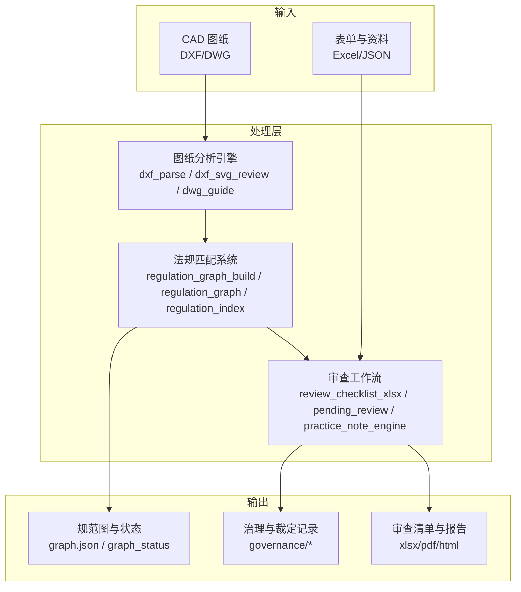
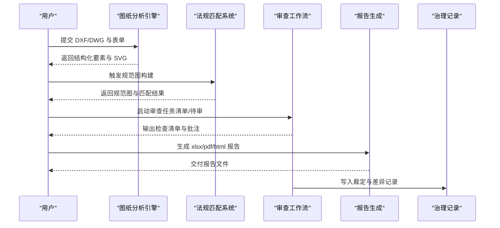
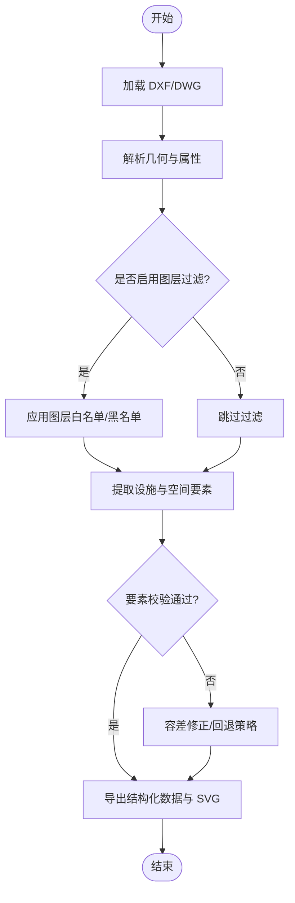
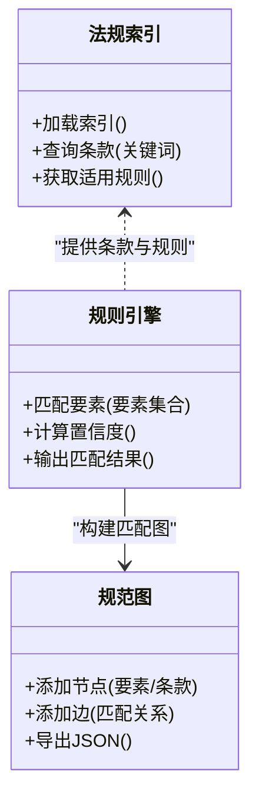
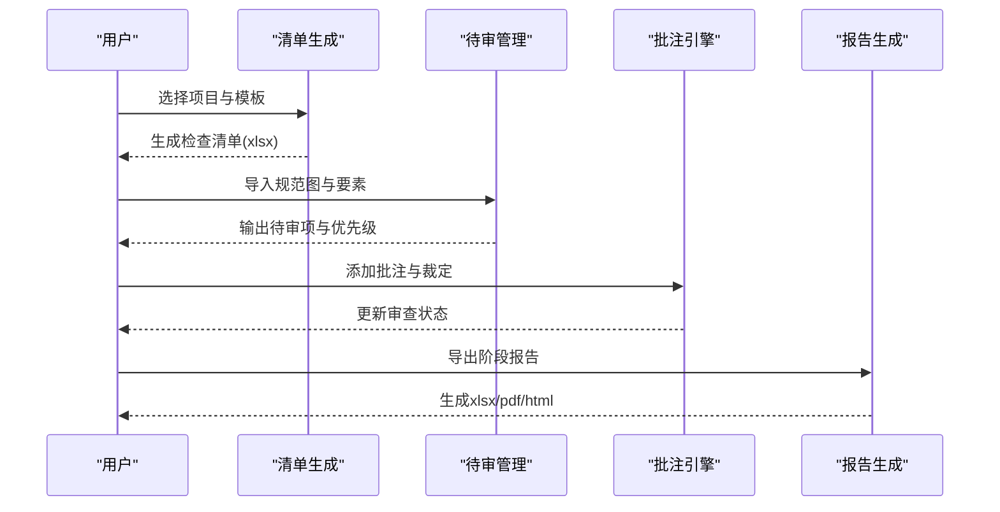
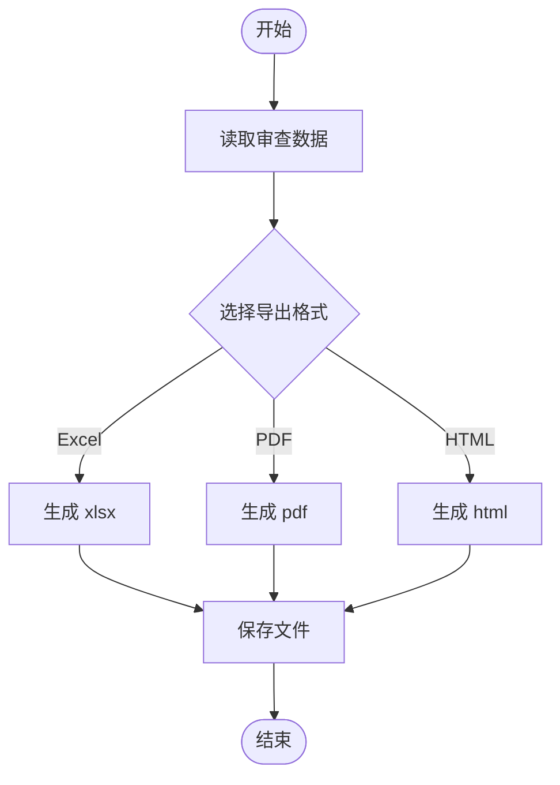
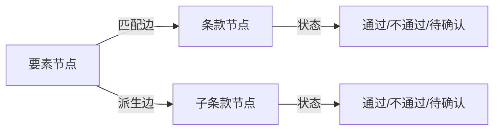
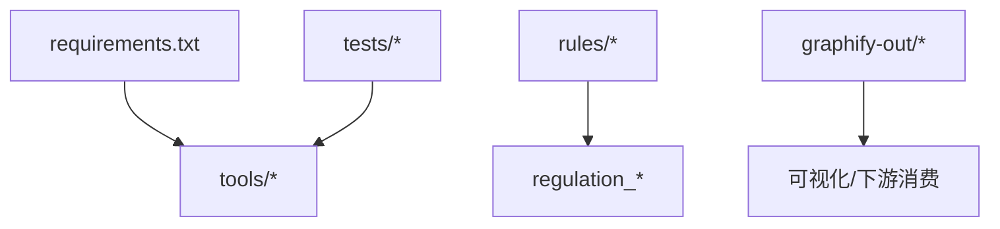

# 核心功能

<cite>
**本文引用的文件**   
- [requirements.txt](file://requirements.txt)
- [AGENTS.md](file://AGENTS.md)
- [CLAUDE.md](file://CLAUDE.md)
- [rules/README.md](file://rules/README.md)
- [rules/regulation_index.json](file://rules/regulation_index.json)
- [rules/equipment_rules.json](file://rules/equipment_rules.json)
- [rules/mixed_use_rules.json](file://rules/mixed_use_rules.json)
- [tools/dxf_parse.py](file://tools/dxf_parse.py)
- [tools/dxf_svg_review.py](file://tools/dxf_svg_review.py)
- [tools/dwg_guide.py](file://tools/dwg_guide.py)
- [tools/regulation_graph_build.py](file://tools/regulation_graph_build.py)
- [tools/regulation_graph.py](file://tools/regulation_graph.py)
- [tools/regulation_index.py](file://tools/regulation_index.py)
- [tools/review_checklist_xlsx.py](file://tools/review_checklist_xlsx.py)
- [tools/stage_report_xlsx.py](file://tools/stage_report_xlsx.py)
- [tools/review_summary_pdf.py](file://tools/review_summary_pdf.py)
- [tools/article_checklist.py](file://tools/article_checklist.py)
- [tools/graph_labels.py](file://tools/graph_labels.py)
- [tools/graph_status.py](file://tools/graph_status.py)
- [tools/practice_note_engine.py](file://tools/practice_note_engine.py)
- [tools/pending_review.py](file://tools/pending_review.py)
- [tools/fire_code_calc.py](file://tools/fire_code_calc.py)
- [tests/test_dxf_parse.py](file://tests/test_dxf_parse.py)
- [tests/test_dxf_svg_review.py](file://tests/test_dxf_svg_review.py)
- [tests/test_regulation_graph_build.py](file://tests/test_regulation_graph_build.py)
- [tests/test_regulation_index.py](file://tests/test_regulation_index.py)
- [tests/test_review_checklist_xlsx.py](file://tests/test_review_checklist_xlsx.py)
- [tests/test_stage_report_xlsx.py](file://tests/test_stage_report_xlsx.py)
- [tests/test_standard_checklist_html.py](file://tests/test_standard_checklist_html.py)
- [tests/test_training_intake.py](file://tests/test_training_intake.py)
- [tests/test_practice_note_engine.py](file://tests/test_practice_note_engine.py)
- [tests/test_practice_note_graph.py](file://tests/test_practice_note_graph.py)
- [tests/test_pending_review.py](file://tests/test_pending_review.py)
- [tests/test_verification_sheet.py](file://tests/test_verification_sheet.py)
- [graphify-out/graph.json](file://graphify-out/graph.json)
- [graphify-out/manifest.json](file://graphify-out/manifest.json)
- [governance/核定紀錄/results-20260725-article18.json](file://governance/核定紀錄/results-20260725-article18.json)
- [governance/待確認清單/已裁示/rule-discrepancies-20260725.json](file://governance/待確認清單/已裁示/rule-discrepancies-20260725.json)
</cite>

## 目录
1. [简介](#简介)
2. [项目结构](#项目结构)
3. [核心组件](#核心组件)
4. [架构总览](#架构总览)
5. [详细组件分析](#详细组件分析)
6. [依赖关系分析](#依赖关系分析)
7. [性能考量](#性能考量)
8. [故障排查指南](#故障排查指南)
9. [结论](#结论)
10. [附录](#附录)

## 简介
本文件面向消防安全设备审查系统，围绕四大核心能力进行系统化说明：图纸分析引擎、法规匹配系统、审查工作流与报告生成。文档从初学者视角提供功能概览，同时为高级用户提供深入的技术细节、配置选项、参数设置与扩展点说明，并给出常见使用模式与最佳实践建议。

## 项目结构
仓库采用“工具脚本 + 规则数据 + 测试用例”的组织方式：
- tools 目录：实现各核心功能的命令行工具（DXF/SVG 解析、规范图构建、清单与报告生成等）。
- rules 目录：存放法规条文索引、设备规则、混合用途规则及检查清单模板。
- tests 目录：覆盖关键工具的单元测试与集成测试。
- graphify-out：中间产物（如规范图 JSON）用于可视化或下游消费。
- governance：治理与裁定记录，支撑审查结果的可追溯性。
- training/skills/docs：训练与技能说明文档，辅助使用者理解流程与策略。

图表来源
- [tools/dxf_parse.py](file://tools/dxf_parse.py)
- [tools/dxf_svg_review.py](file://tools/dxf_svg_review.py)
- [tools/dwg_guide.py](file://tools/dwg_guide.py)
- [tools/regulation_graph_build.py](file://tools/regulation_graph_build.py)
- [tools/regulation_graph.py](file://tools/regulation_graph.py)
- [tools/regulation_index.py](file://tools/regulation_index.py)
- [tools/review_checklist_xlsx.py](file://tools/review_checklist_xlsx.py)
- [tools/stage_report_xlsx.py](file://tools/stage_report_xlsx.py)
- [tools/review_summary_pdf.py](file://tools/review_summary_pdf.py)
- [graphify-out/graph.json](file://graphify-out/graph.json)

章节来源
- [requirements.txt](file://requirements.txt)
- [AGENTS.md](file://AGENTS.md)
- [CLAUDE.md](file://CLAUDE.md)
- [rules/README.md](file://rules/README.md)

## 核心组件
- 图纸分析引擎：负责解析 CAD 图纸（DXF/DWG），提取空间布局、设备位置与标注信息，并可转换为 SVG 供审阅与标注。
- 法规匹配系统：基于法规条文索引与规则库，将图纸要素映射到具体条款，构建“规范图”以支持可解释的合规判定。
- 审查工作流：将图纸分析与法规匹配结果串联为可执行的审查任务，生成检查清单、待审项与批注，支持多阶段审查。
- 报告生成：将审查结果导出为 Excel 清单、PDF 汇总报告与 HTML 标准清单，便于归档与对外交付。

章节来源
- [tools/dxf_parse.py](file://tools/dxf_parse.py)
- [tools/dxf_svg_review.py](file://tools/dxf_svg_review.py)
- [tools/dwg_guide.py](file://tools/dwg_guide.py)
- [tools/regulation_graph_build.py](file://tools/regulation_graph_build.py)
- [tools/regulation_graph.py](file://tools/regulation_graph.py)
- [tools/regulation_index.py](file://tools/regulation_index.py)
- [tools/review_checklist_xlsx.py](file://tools/review_checklist_xlsx.py)
- [tools/stage_report_xlsx.py](file://tools/stage_report_xlsx.py)
- [tools/review_summary_pdf.py](file://tools/review_summary_pdf.py)

## 架构总览
下图展示从输入到输出的端到端流程，以及各模块之间的职责边界与数据流向。

图表来源
- [tools/dxf_parse.py](file://tools/dxf_parse.py)
- [tools/dxf_svg_review.py](file://tools/dxf_svg_review.py)
- [tools/dwg_guide.py](file://tools/dwg_guide.py)
- [tools/regulation_graph_build.py](file://tools/regulation_graph_build.py)
- [tools/regulation_graph.py](file://tools/regulation_graph.py)
- [tools/review_checklist_xlsx.py](file://tools/review_checklist_xlsx.py)
- [tools/stage_report_xlsx.py](file://tools/stage_report_xlsx.py)
- [tools/review_summary_pdf.py](file://tools/review_summary_pdf.py)
- [governance/核定紀錄/results-20260725-article18.json](file://governance/核定紀錄/results-20260725-article18.json)

## 详细组件分析

### 图纸分析引擎
- 功能目标
  - 解析 DXF/DWG 图纸，抽取墙体、房间、疏散路径、消防设施等要素。
  - 生成 SVG 以便人工审阅与标注，支持后续审查工作流引用。
- 输入/输出
  - 输入：DXF/DWG 文件路径、可选过滤条件（图层、比例尺、单位）。
  - 输出：结构化要素列表、SVG 文件路径、元数据（比例、坐标系统等）。
- 关键参数与配置
  - 图层白名单/黑名单、单位换算、容差阈值、符号识别开关。
- 使用场景
  - 批量图纸预处理、现场踏勘后图纸数字化、培训演练用样例导入。
- 常见问题与排错
  - 图纸单位不一致导致尺寸异常；图层命名不规范导致要素缺失；复杂块定义解析失败。
- 扩展点
  - 新增自定义符号识别器；接入 OCR 对标注文本进行增强识别。

图表来源
- [tools/dxf_parse.py](file://tools/dxf_parse.py)
- [tools/dxf_svg_review.py](file://tools/dxf_svg_review.py)
- [tools/dwg_guide.py](file://tools/dwg_guide.py)

章节来源
- [tools/dxf_parse.py](file://tools/dxf_parse.py)
- [tools/dxf_svg_review.py](file://tools/dxf_svg_review.py)
- [tools/dwg_guide.py](file://tools/dwg_guide.py)
- [tests/test_dxf_parse.py](file://tests/test_dxf_parse.py)
- [tests/test_dxf_svg_review.py](file://tests/test_dxf_svg_review.py)

### 法规匹配系统
- 功能目标
  - 将图纸要素与法规条文建立映射，形成可解释的“规范图”，支持按条文的自动核查与人工复核。
- 输入/输出
  - 输入：图纸要素、法规索引与规则集（JSON）、项目类型与用途分类。
  - 输出：规范图（节点=要素/条款，边=匹配关系）、匹配得分与置信度、冲突与待确认项。
- 关键参数与配置
  - 规则权重、阈值、适用区域（楼层/分区）、特殊用途标记、例外条款开关。
- 使用场景
  - 新建项目快速合规初筛、变更设计后的增量比对、跨项目一致性审计。
- 常见问题与排错
  - 规则版本不匹配；用途分类错误导致条款误配；阈值过严/过松影响准确率。
- 扩展点
  - 新增法规条目与关联规则；引入专家经验规则；对接外部知识库。

图表来源
- [tools/regulation_index.py](file://tools/regulation_index.py)
- [tools/regulation_graph_build.py](file://tools/regulation_graph_build.py)
- [tools/regulation_graph.py](file://tools/regulation_graph.py)
- [rules/regulation_index.json](file://rules/regulation_index.json)
- [rules/equipment_rules.json](file://rules/equipment_rules.json)
- [rules/mixed_use_rules.json](file://rules/mixed_use_rules.json)

章节来源
- [tools/regulation_index.py](file://tools/regulation_index.py)
- [tools/regulation_graph_build.py](file://tools/regulation_graph_build.py)
- [tools/regulation_graph.py](file://tools/regulation_graph.py)
- [rules/regulation_index.json](file://rules/regulation_index.json)
- [rules/equipment_rules.json](file://rules/equipment_rules.json)
- [rules/mixed_use_rules.json](file://rules/mixed_use_rules.json)
- [tests/test_regulation_index.py](file://tests/test_regulation_index.py)
- [tests/test_regulation_graph_build.py](file://tests/test_regulation_graph_build.py)

### 审查工作流
- 功能目标
  - 将图纸分析与法规匹配结果整合为可执行的任务序列，生成检查清单、待审项与批注，支持多阶段审查与协作。
- 输入/输出
  - 输入：图纸要素、规范图、项目信息与表单数据。
  - 输出：审查清单（xlsx）、待审项列表、批注与裁定记录、阶段性报告。
- 关键参数与配置
  - 审查阶段、责任人分配、优先级策略、自动判定阈值、人工复核开关。
- 使用场景
  - 一阶段初审、二阶段深度审查、混合用途项目的专项审查、培训模式下的模拟审查。
- 常见问题与排错
  - 清单模板不匹配；待审项未正确归因；审批链配置错误导致流转停滞。
- 扩展点
  - 自定义审查模板与字段；接入审批系统；增加自动化校验脚本。

图表来源
- [tools/review_checklist_xlsx.py](file://tools/review_checklist_xlsx.py)
- [tools/stage_report_xlsx.py](file://tools/stage_report_xlsx.py)
- [tools/review_summary_pdf.py](file://tools/review_summary_pdf.py)
- [tools/pending_review.py](file://tools/pending_review.py)
- [tools/practice_note_engine.py](file://tools/practice_note_engine.py)

章节来源
- [tools/review_checklist_xlsx.py](file://tools/review_checklist_xlsx.py)
- [tools/stage_report_xlsx.py](file://tools/stage_report_xlsx.py)
- [tools/review_summary_pdf.py](file://tools/review_summary_pdf.py)
- [tools/pending_review.py](file://tools/pending_review.py)
- [tools/practice_note_engine.py](file://tools/practice_note_engine.py)
- [tests/test_review_checklist_xlsx.py](file://tests/test_review_checklist_xlsx.py)
- [tests/test_stage_report_xlsx.py](file://tests/test_stage_report_xlsx.py)
- [tests/test_pending_review.py](file://tests/test_pending_review.py)
- [tests/test_practice_note_engine.py](file://tests/test_practice_note_engine.py)

### 报告生成
- 功能目标
  - 将审查结果标准化输出为 Excel 清单、PDF 汇总报告与 HTML 标准清单，满足归档与对外交付需求。
- 输入/输出
  - 输入：审查清单、待审项、批注与裁定记录、项目元数据。
  - 输出：xlsx/pdf/html 文件，包含表格、图表与批注摘要。
- 关键参数与配置
  - 模板样式、页眉页脚、语言与编码、导出范围（全量/阶段）。
- 使用场景
  - 项目验收材料准备、监管报送、内部质量审计。
- 常见问题与排错
  - 模板路径错误；中文字体缺失导致乱码；分页与排版异常。
- 扩展点
  - 自定义模板与字段映射；接入电子签章与水印服务。

图表来源
- [tools/review_checklist_xlsx.py](file://tools/review_checklist_xlsx.py)
- [tools/stage_report_xlsx.py](file://tools/stage_report_xlsx.py)
- [tools/review_summary_pdf.py](file://tools/review_summary_pdf.py)

章节来源
- [tools/review_checklist_xlsx.py](file://tools/review_checklist_xlsx.py)
- [tools/stage_report_xlsx.py](file://tools/stage_report_xlsx.py)
- [tools/review_summary_pdf.py](file://tools/review_summary_pdf.py)
- [tests/test_standard_checklist_html.py](file://tests/test_standard_checklist_html.py)

### 规范图与可视化
- 功能目标
  - 将法规匹配结果以图结构存储与可视化，便于追踪匹配路径、定位冲突与待确认项。
- 输入/输出
  - 输入：规范图构建产物（节点与边）、标签与状态信息。
  - 输出：graph.json、可视化页面与状态快照。
- 关键参数与配置
  - 节点标签策略、边权重、状态枚举、可视化主题。
- 使用场景
  - 审查过程回溯、专家复核、培训演示。
- 常见问题与排错
  - 节点重复或缺失；边关系不完整；标签歧义。
- 扩展点
  - 接入第三方图谱工具；增加交互式筛选与高亮。

图表来源
- [tools/regulation_graph_build.py](file://tools/regulation_graph_build.py)
- [tools/graph_labels.py](file://tools/graph_labels.py)
- [tools/graph_status.py](file://tools/graph_status.py)
- [graphify-out/graph.json](file://graphify-out/graph.json)
- [graphify-out/manifest.json](file://graphify-out/manifest.json)

章节来源
- [tools/regulation_graph_build.py](file://tools/regulation_graph_build.py)
- [tools/graph_labels.py](file://tools/graph_labels.py)
- [tools/graph_status.py](file://tools/graph_status.py)
- [graphify-out/graph.json](file://graphify-out/graph.json)
- [graphify-out/manifest.json](file://graphify-out/manifest.json)

### 训练与案例
- 功能目标
  - 提供训练模式与案例导入，帮助新手熟悉审查流程与工具使用。
- 输入/输出
  - 输入：训练包（图纸、表单、规则片段）。
  - 输出：练习清单、评分与反馈。
- 使用场景
  - 新员工入职培训、规则更新演练、团队技能提升。
- 常见问题与排错
  - 训练包版本不匹配；评分规则未更新。
- 扩展点
  - 自定义训练题库与评分模型。

章节来源
- [tests/test_training_intake.py](file://tests/test_training_intake.py)

## 依赖关系分析
- 运行时依赖
  - Python 环境与第三方库由 requirements.txt 管理，确保工具脚本稳定运行。
- 数据依赖
  - 法规索引与规则集位于 rules 目录，规范图产物位于 graphify-out。
- 测试依赖
  - tests 目录覆盖关键工具，保障功能稳定性与回归安全。

图表来源
- [requirements.txt](file://requirements.txt)
- [rules/regulation_index.json](file://rules/regulation_index.json)
- [rules/equipment_rules.json](file://rules/equipment_rules.json)
- [rules/mixed_use_rules.json](file://rules/mixed_use_rules.json)
- [graphify-out/graph.json](file://graphify-out/graph.json)

章节来源
- [requirements.txt](file://requirements.txt)
- [rules/regulation_index.json](file://rules/regulation_index.json)
- [rules/equipment_rules.json](file://rules/equipment_rules.json)
- [rules/mixed_use_rules.json](file://rules/mixed_use_rules.json)
- [graphify-out/graph.json](file://graphify-out/graph.json)

## 性能考量
- 图纸解析优化
  - 启用图层过滤减少无关几何处理；合理设置容差阈值避免过度细分。
- 法规匹配优化
  - 预构建索引与缓存常用规则；按项目类型限定适用规则集。
- 报告生成优化
  - 分批导出大清单；使用模板缓存减少 IO 开销。
- 可视化优化
  - 按需渲染节点与边；使用懒加载与分页显示大图。

[本节为通用指导，无需特定文件来源]

## 故障排查指南
- 图纸解析失败
  - 检查文件格式与版本；确认图层命名规范；查看容差与单位设置。
- 法规匹配异常
  - 核对规则版本与索引一致性；确认项目用途分类；调整阈值与权重。
- 清单与报告问题
  - 验证模板路径与编码；检查中文字体安装；确认导出范围与分页设置。
- 规范图不一致
  - 检查节点去重与边完整性；核对标签策略与状态枚举。
- 治理记录缺失
  - 确认裁定写入权限与路径；检查差异记录格式。

章节来源
- [tools/dxf_parse.py](file://tools/dxf_parse.py)
- [tools/regulation_graph_build.py](file://tools/regulation_graph_build.py)
- [tools/review_checklist_xlsx.py](file://tools/review_checklist_xlsx.py)
- [tools/review_summary_pdf.py](file://tools/review_summary_pdf.py)
- [governance/待確認清單/已裁示/rule-discrepancies-20260725.json](file://governance/待確認清單/已裁示/rule-discrepancies-20260725.json)

## 结论
本系统以“图纸分析—法规匹配—审查工作流—报告生成”为主线，构建了可解释、可扩展且可追溯的消防安全设备审查平台。通过清晰的模块划分与丰富的扩展点，既满足初学者快速上手的需求，也为高级用户提供深度定制与二次开发的能力。建议在实际部署中结合项目特点优化参数与模板，并持续完善规则库与训练案例，以提升审查效率与准确性。

[本节为总结性内容，无需特定文件来源]

## 附录
- 常用命令与入口
  - 图纸解析：参考 tools/dxf_parse.py 与 tools/dxf_svg_review.py。
  - 规范图构建：参考 tools/regulation_graph_build.py 与 tools/regulation_graph.py。
  - 清单与报告：参考 tools/review_checklist_xlsx.py、tools/stage_report_xlsx.py、tools/review_summary_pdf.py。
- 规则与索引
  - 法规索引：rules/regulation_index.json。
  - 设备规则：rules/equipment_rules.json。
  - 混合用途规则：rules/mixed_use_rules.json。
- 可视化与状态
  - 规范图：graphify-out/graph.json。
  - 标签与状态：tools/graph_labels.py、tools/graph_status.py。
- 测试与示例
  - 测试用例：tests 目录下对应 *.py 文件。
  - 训练与技能：skills 与 docs 目录下的说明文档。

章节来源
- [tools/dxf_parse.py](file://tools/dxf_parse.py)
- [tools/dxf_svg_review.py](file://tools/dxf_svg_review.py)
- [tools/regulation_graph_build.py](file://tools/regulation_graph_build.py)
- [tools/regulation_graph.py](file://tools/regulation_graph.py)
- [tools/review_checklist_xlsx.py](file://tools/review_checklist_xlsx.py)
- [tools/stage_report_xlsx.py](file://tools/stage_report_xlsx.py)
- [tools/review_summary_pdf.py](file://tools/review_summary_pdf.py)
- [rules/regulation_index.json](file://rules/regulation_index.json)
- [rules/equipment_rules.json](file://rules/equipment_rules.json)
- [rules/mixed_use_rules.json](file://rules/mixed_use_rules.json)
- [graphify-out/graph.json](file://graphify-out/graph.json)
- [tools/graph_labels.py](file://tools/graph_labels.py)
- [tools/graph_status.py](file://tools/graph_status.py)
- [tests/test_dxf_parse.py](file://tests/test_dxf_parse.py)
- [tests/test_dxf_svg_review.py](file://tests/test_dxf_svg_review.py)
- [tests/test_regulation_graph_build.py](file://tests/test_regulation_graph_build.py)
- [tests/test_regulation_index.py](file://tests/test_regulation_index.py)
- [tests/test_review_checklist_xlsx.py](file://tests/test_review_checklist_xlsx.py)
- [tests/test_stage_report_xlsx.py](file://tests/test_stage_report_xlsx.py)
- [tests/test_standard_checklist_html.py](file://tests/test_standard_checklist_html.py)
- [tests/test_training_intake.py](file://tests/test_training_intake.py)
- [tests/test_practice_note_engine.py](file://tests/test_practice_note_engine.py)
- [tests/test_practice_note_graph.py](file://tests/test_practice_note_graph.py)
- [tests/test_pending_review.py](file://tests/test_pending_review.py)
- [tests/test_verification_sheet.py](file://tests/test_verification_sheet.py)