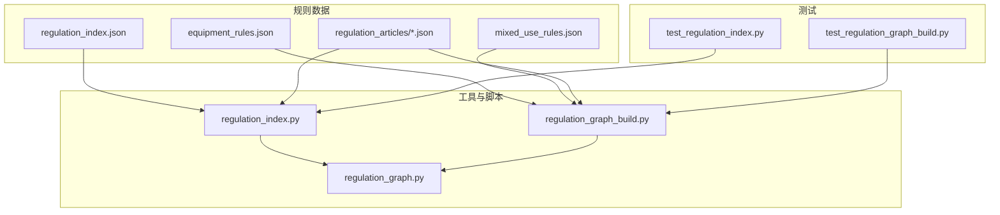
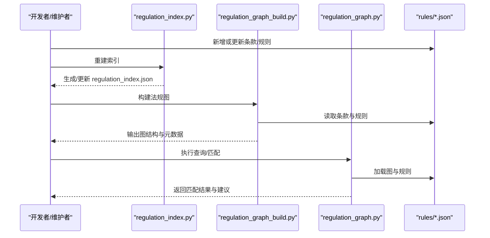
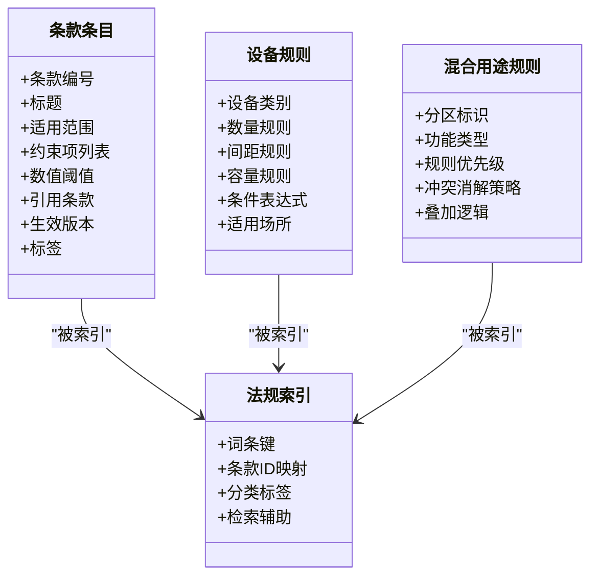
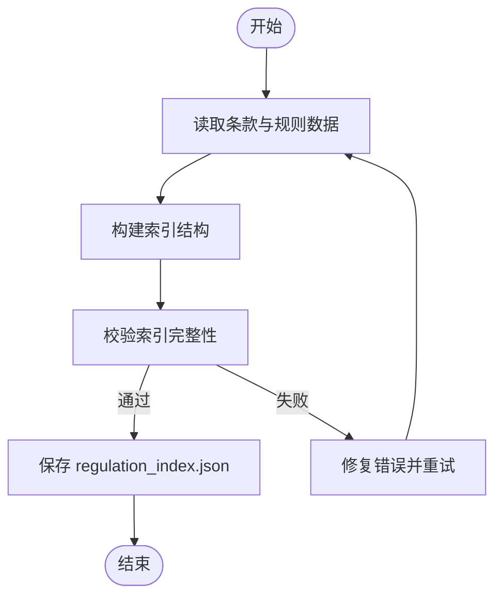
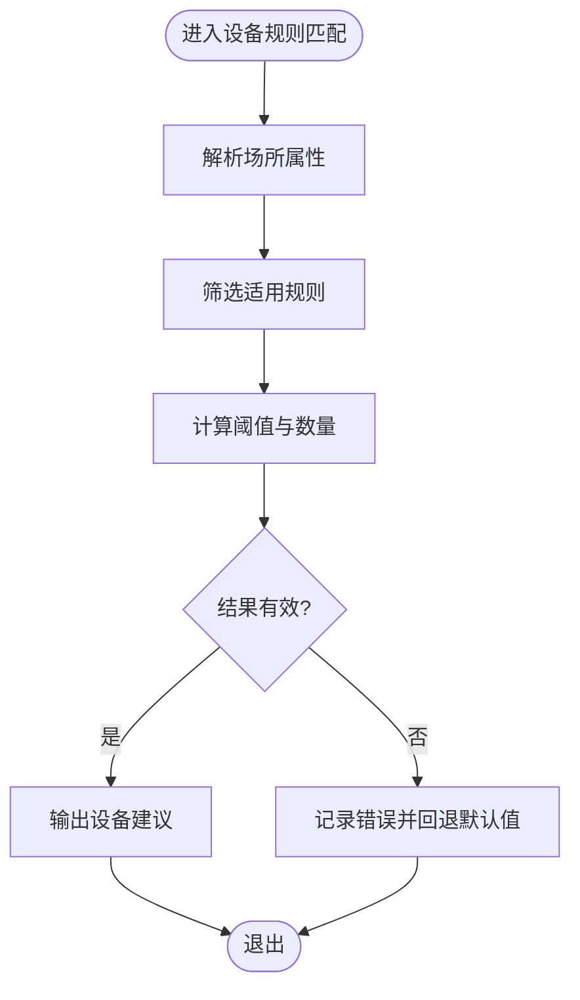
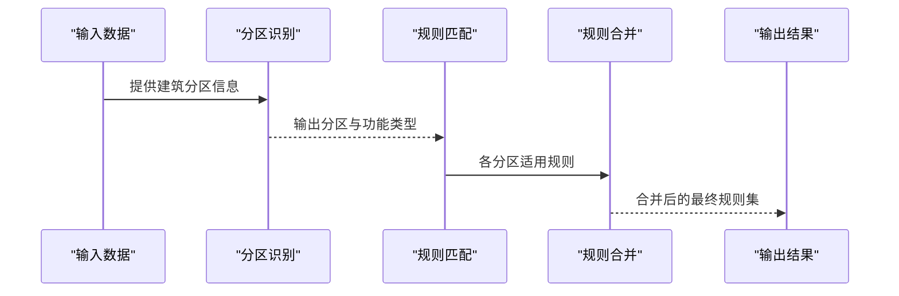
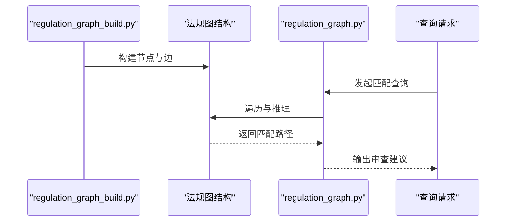
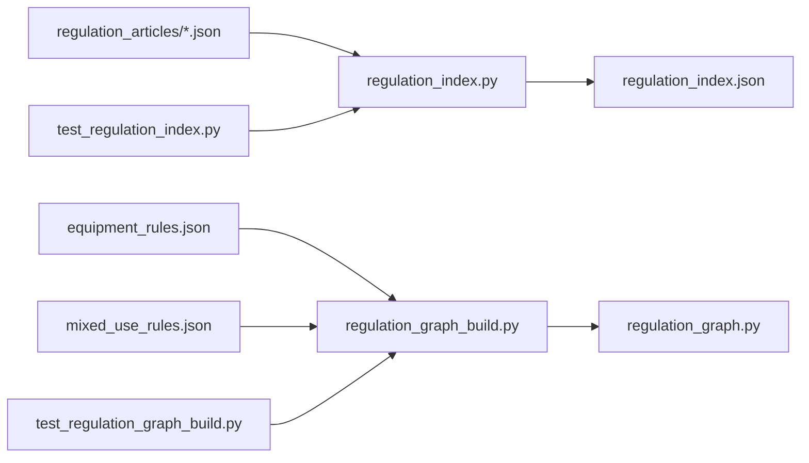

# 法规管理系统

<cite>
**本文引用的文件**   
- [rules/regulation_index.json](file://rules/regulation_index.json)
- [rules/equipment_rules.json](file://rules/equipment_rules.json)
- [rules/mixed_use_rules.json](file://rules/mixed_use_rules.json)
- [rules/regulation_articles/article-001.json](file://rules/regulation_articles/article-001.json)
- [tools/regulation_index.py](file://tools/regulation_index.py)
- [tools/regulation_graph_build.py](file://tools/regulation_graph_build.py)
- [tools/regulation_graph.py](file://tools/regulation_graph.py)
- [tests/test_regulation_index.py](file://tests/test_regulation_index.py)
- [tests/test_regulation_graph_build.py](file://tests/test_regulation_graph_build.py)
- [skills/regulation-data.md](file://skills/regulation-data.md)
</cite>

## 目录
1. [简介](#简介)
2. [项目结构](#项目结构)
3. [核心组件](#核心组件)
4. [架构总览](#架构总览)
5. [详细组件分析](#详细组件分析)
6. [依赖关系分析](#依赖关系分析)
7. [性能考量](#性能考量)
8. [故障排查指南](#故障排查指南)
9. [结论](#结论)
10. [附录](#附录)

## 简介
本文件为“消防安全设备审查系统”的法规管理模块提供系统化文档，聚焦以下目标：
- 明确法规条目的数据结构、分类体系与索引机制
- 解释各类场所消防安全设备设置标准的数字化表示方法（条款编号、内容结构、关联关系）
- 说明法规数据的导入、更新与维护流程
- 给出JSON格式示例与字段说明（以路径引用代替具体代码片段）
- 阐述混合用途建筑的法规匹配逻辑与设备规则配置
- 为开发者提供扩展与自定义接口说明

## 项目结构
法规管理相关的数据与工具主要分布在如下位置：
- rules/：法规数据与规则定义
  - regulation_articles/：按条款编号组织的JSON条目
  - equipment_rules.json：设备规则集合
  - mixed_use_rules.json：混合用途建筑规则
  - regulation_index.json：法规索引
- tools/：数据处理与图构建工具
  - regulation_index.py：索引构建与查询
  - regulation_graph_build.py：法规图构建
  - regulation_graph.py：法规图运行与查询
- tests/：针对索引与图构建的测试用例
- skills/regulation-data.md：法规数据规范说明

**图示来源** 
- [rules/regulation_index.json](file://rules/regulation_index.json)
- [rules/equipment_rules.json](file://rules/equipment_rules.json)
- [rules/mixed_use_rules.json](file://rules/mixed_use_rules.json)
- [rules/regulation_articles/article-001.json](file://rules/regulation_articles/article-001.json)
- [tools/regulation_index.py](file://tools/regulation_index.py)
- [tools/regulation_graph_build.py](file://tools/regulation_graph_build.py)
- [tools/regulation_graph.py](file://tools/regulation_graph.py)
- [tests/test_regulation_index.py](file://tests/test_regulation_index.py)
- [tests/test_regulation_graph_build.py](file://tests/test_regulation_graph_build.py)

**章节来源**
- [skills/regulation-data.md](file://skills/regulation-data.md)

## 核心组件
- 法规索引（regulation_index.json）
  - 作用：对全部法规条目进行统一编目，支持按场所类型、关键词、适用区域等维度检索
  - 关键能力：快速定位条款、建立跨条款引用关系、支撑后续图构建
- 设备规则（equipment_rules.json）
  - 作用：将设备类别、数量、间距、容量等要求结构化，便于与场所属性匹配
  - 关键能力：条件化规则、阈值计算、与场所类型联动
- 混合用途规则（mixed_use_rules.json）
  - 作用：处理多用途建筑中不同功能区的法规叠加与优先级判定
  - 关键能力：分区识别、规则合并、冲突消解
- 条款条目（regulation_articles/*.json）
  - 作用：逐条数字化法规文本，包含条款编号、适用范围、约束项、引用关系等
  - 关键能力：结构化条款、可机读、可追溯

**章节来源**
- [rules/regulation_index.json](file://rules/regulation_index.json)
- [rules/equipment_rules.json](file://rules/equipment_rules.json)
- [rules/mixed_use_rules.json](file://rules/mixed_use_rules.json)
- [rules/regulation_articles/article-001.json](file://rules/regulation_articles/article-001.json)

## 架构总览
法规管理模块采用“数据+工具”的分层设计：
- 数据层：JSON格式的法规索引、设备规则、混合用途规则与条款条目
- 工具层：索引构建与查询、图构建与执行、测试验证
- 应用层：上层审查引擎通过工具接口获取匹配的法规与设备规则

**图示来源** 
- [tools/regulation_index.py](file://tools/regulation_index.py)
- [tools/regulation_graph_build.py](file://tools/regulation_graph_build.py)
- [tools/regulation_graph.py](file://tools/regulation_graph.py)
- [rules/regulation_index.json](file://rules/regulation_index.json)
- [rules/equipment_rules.json](file://rules/equipment_rules.json)
- [rules/mixed_use_rules.json](file://rules/mixed_use_rules.json)
- [rules/regulation_articles/article-001.json](file://rules/regulation_articles/article-001.json)

## 详细组件分析

### 法规条目数据结构与分类体系
- 条款编号：以 article-XXX.json 命名，体现法规层级与顺序
- 内容结构：包含适用范围、约束项、数值阈值、引用条款、生效版本等
- 分类体系：依据场所类型（如办公、商业、工业等）与设备类别进行归类
- 关联关系：通过引用字段建立跨条款依赖，支撑复杂场景推导

**图示来源** 
- [rules/regulation_articles/article-001.json](file://rules/regulation_articles/article-001.json)
- [rules/equipment_rules.json](file://rules/equipment_rules.json)
- [rules/mixed_use_rules.json](file://rules/mixed_use_rules.json)
- [rules/regulation_index.json](file://rules/regulation_index.json)

**章节来源**
- [rules/regulation_articles/article-001.json](file://rules/regulation_articles/article-001.json)
- [rules/equipment_rules.json](file://rules/equipment_rules.json)
- [rules/mixed_use_rules.json](file://rules/mixed_use_rules.json)
- [rules/regulation_index.json](file://rules/regulation_index.json)

### 索引机制与查询
- 索引构建：由 regulation_index.py 读取条款与规则，生成统一的检索索引
- 查询能力：支持按场所类型、关键词、条款编号、设备类别等多维检索
- 维护流程：当数据变更时重新构建索引，确保一致性

**图示来源** 
- [tools/regulation_index.py](file://tools/regulation_index.py)
- [rules/regulation_index.json](file://rules/regulation_index.json)

**章节来源**
- [tools/regulation_index.py](file://tools/regulation_index.py)
- [tests/test_regulation_index.py](file://tests/test_regulation_index.py)

### 设备规则配置与匹配
- 规则表达：设备类别、数量、间距、容量等以结构化字段描述
- 条件匹配：基于场所属性（面积、楼层、用途）动态选择适用规则
- 阈值计算：根据输入参数计算所需设备数量或规格

**图示来源** 
- [rules/equipment_rules.json](file://rules/equipment_rules.json)

**章节来源**
- [rules/equipment_rules.json](file://rules/equipment_rules.json)

### 混合用途建筑的法规匹配逻辑
- 分区识别：根据建筑平面图或表单数据划分功能区
- 规则叠加：对不同功能区的规则进行叠加与优先级排序
- 冲突消解：当规则冲突时，依据优先级策略选择最终适用条款

**图示来源** 
- [rules/mixed_use_rules.json](file://rules/mixed_use_rules.json)

**章节来源**
- [rules/mixed_use_rules.json](file://rules/mixed_use_rules.json)

### 法规图构建与执行
- 图构建：regulation_graph_build.py 将条款与规则组织为有向图，便于推理与查询
- 图执行：regulation_graph.py 加载图结构，执行匹配与推导，返回结果

**图示来源** 
- [tools/regulation_graph_build.py](file://tools/regulation_graph_build.py)
- [tools/regulation_graph.py](file://tools/regulation_graph.py)

**章节来源**
- [tools/regulation_graph_build.py](file://tools/regulation_graph_build.py)
- [tools/regulation_graph.py](file://tools/regulation_graph.py)
- [tests/test_regulation_graph_build.py](file://tests/test_regulation_graph_build.py)

## 依赖关系分析
- 数据依赖：索引与图构建均依赖 rules 下的 JSON 数据
- 工具依赖：regulation_index.py 与 regulation_graph_build.py 共同支撑 regulation_graph.py 的运行
- 测试依赖：tests 覆盖索引与图构建的关键路径，保障数据质量

**图示来源** 
- [tools/regulation_index.py](file://tools/regulation_index.py)
- [tools/regulation_graph_build.py](file://tools/regulation_graph_build.py)
- [tools/regulation_graph.py](file://tools/regulation_graph.py)
- [rules/regulation_index.json](file://rules/regulation_index.json)
- [rules/equipment_rules.json](file://rules/equipment_rules.json)
- [rules/mixed_use_rules.json](file://rules/mixed_use_rules.json)
- [rules/regulation_articles/article-001.json](file://rules/regulation_articles/article-001.json)
- [tests/test_regulation_index.py](file://tests/test_regulation_index.py)
- [tests/test_regulation_graph_build.py](file://tests/test_regulation_graph_build.py)

**章节来源**
- [tools/regulation_index.py](file://tools/regulation_index.py)
- [tools/regulation_graph_build.py](file://tools/regulation_graph_build.py)
- [tools/regulation_graph.py](file://tools/regulation_graph.py)
- [tests/test_regulation_index.py](file://tests/test_regulation_index.py)
- [tests/test_regulation_graph_build.py](file://tests/test_regulation_graph_build.py)

## 性能考量
- 索引构建复杂度：与条款与规则数量线性相关，建议在增量更新时仅重建受影响部分
- 图遍历效率：通过预计算与缓存提升查询响应时间
- 内存占用：大型规则集需考虑分页加载与按需展开

[本节为通用指导，不直接分析具体文件]

## 故障排查指南
- 索引不一致：检查 regulation_index.json 是否最新，必要时重新构建
- 规则匹配异常：核对设备规则的条件表达式与场所属性是否匹配
- 图构建失败：确认条款引用关系完整且无循环依赖
- 测试失败：运行 tests 中的用例定位问题根因

**章节来源**
- [tests/test_regulation_index.py](file://tests/test_regulation_index.py)
- [tests/test_regulation_graph_build.py](file://tests/test_regulation_graph_build.py)

## 结论
本法规管理模块通过结构化的JSON数据与配套工具，实现了法规条目的数字化、索引化与图化表达。借助清晰的分类体系与匹配逻辑，系统能够高效支持各类场所的设备审查需求，并为混合用途建筑提供灵活的规则叠加与冲突消解能力。开发者可通过扩展JSON结构与调用工具接口，实现法规数据的持续演进与自定义增强。

[本节为总结性内容，不直接分析具体文件]

## 附录
- 数据导入与更新流程
  - 新增或修改条款：在 rules/regulation_articles/ 下新增或编辑对应JSON文件
  - 更新设备规则：编辑 rules/equipment_rules.json，保持字段一致性与条件有效性
  - 调整混合用途规则：编辑 rules/mixed_use_rules.json，确保分区与优先级正确
  - 重建索引：运行 tools/regulation_index.py 生成最新的 regulation_index.json
  - 构建法规图：运行 tools/regulation_graph_build.py 生成图结构
  - 执行查询：运行 tools/regulation_graph.py 进行匹配与推导
- 字段说明参考
  - 条款编号：article-XXX.json 中的唯一标识
  - 适用范围：描述适用的场所类型与条件
  - 约束项：具体的设备或设施要求
  - 引用条款：与其他条款的关联关系
  - 设备类别与阈值：用于计算与匹配的结构化字段
- 扩展接口说明
  - 新增规则类型：在相应JSON结构中扩展字段，并在工具中增加解析逻辑
  - 自定义匹配策略：在设备规则或混合用途规则中添加条件表达式
  - 图扩展：在图构建阶段加入新节点与边，确保查询路径可达

[本节为补充说明，不直接分析具体文件]