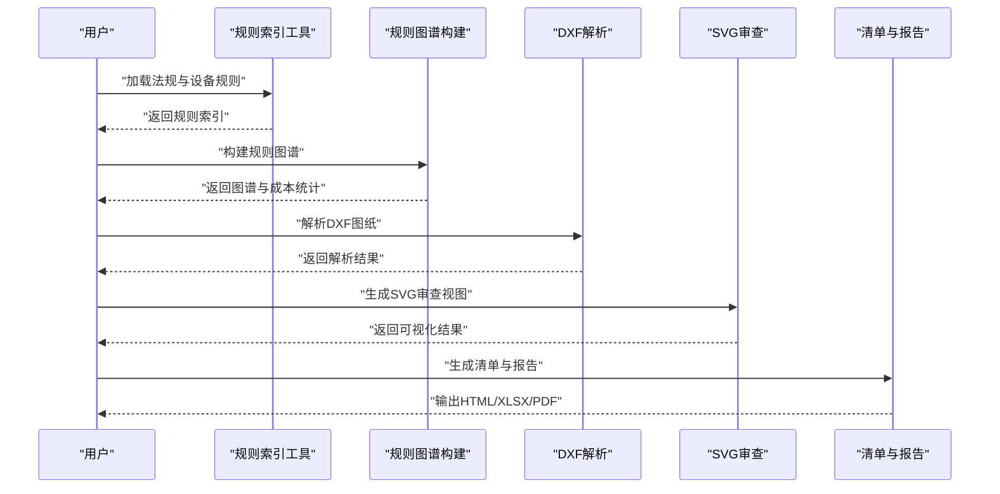
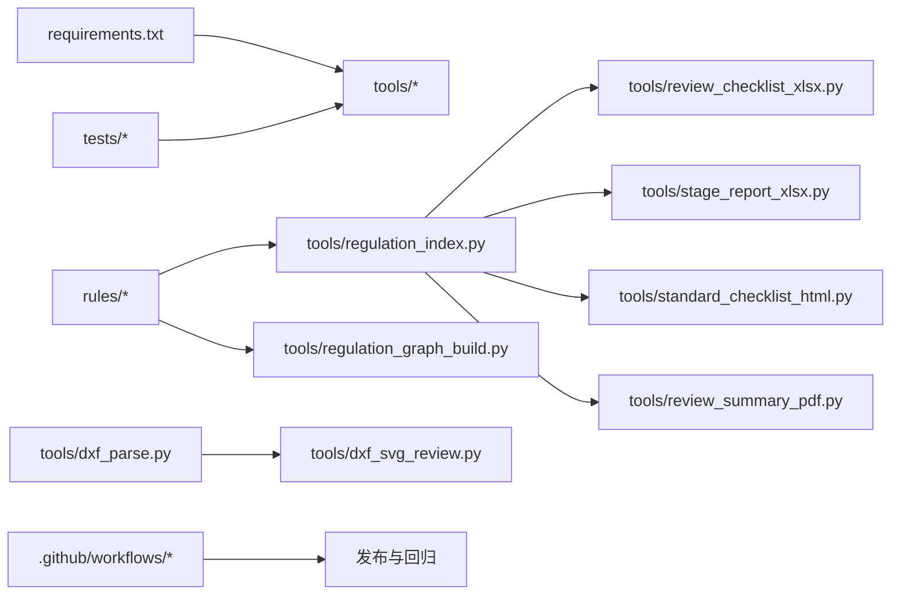

# 系统介绍

<cite>
**本文引用的文件**   
- [AGENTS.md](file://AGENTS.md)
- [CLAUDE.md](file://CLAUDE.md)
- [requirements.txt](file://requirements.txt)
- [rules/README.md](file://rules/README.md)
- [skills/first-stage-review.md](file://skills/first-stage-review.md)
- [skills/mixed-use-review.md](file://skills/mixed-use-review.md)
- [tools/dxf_parse.py](file://tools/dxf_parse.py)
- [tools/dxf_svg_review.py](file://tools/dxf_svg_review.py)
- [tools/regulation_graph_build.py](file://tools/regulation_graph_build.py)
- [tools/regulation_index.py](file://tools/regulation_index.py)
- [tools/review_checklist_xlsx.py](file://tools/review_checklist_xlsx.py)
- [tools/stage_report_xlsx.py](file://tools/stage_report_xlsx.py)
- [tools/standard_checklist_html.py](file://tools/standard_checklist_html.py)
- [tools/review_summary_pdf.py](file://tools/review_summary_pdf.py)
- [tests/test_dxf_parse.py](file://tests/test_dxf_parse.py)
- [tests/test_dxf_svg_review.py](file://tests/test_dxf_svg_review.py)
- [tests/test_regulation_graph_build.py](file://tests/test_regulation_graph_build.py)
- [tests/test_regulation_index.py](file://tests/test_regulation_index.py)
- [tests/test_review_checklist_xlsx.py](file://tests/test_review_checklist_xlsx.py)
- [tests/test_stage_report_xlsx.py](file://tests/test_stage_report_xlsx.py)
- [tests/test_standard_checklist_html.py](file://tests/test_standard_checklist_html.py)
- [tests/test_training_intake.py](file://tests/test_training_intake.py)
- [training/registry.json](file://training/registry.json)
- [practice_notes/index.json](file://practice_notes/index.json)
- [governance/核定表/核定表-20260708.html](file://governance/核定表/核定表-20260708.html)
- [graphify-out/graph.json](file://graphify-out/graph.json)
- [graphify-out/cost.json](file://graphify-out/cost.json)
- [packaging/sfx-config.txt](file://packaging/sfx-config.txt)
- [packaging/python-runtime.json](file://packaging/python-runtime.json)
- [.github/workflows/release.yml](file://.github/workflows/release.yml)
- [.github/workflows/rule-tests.yml](file://.github/workflows/rule-tests.yml)
</cite>

## 目录
1. [引言](#引言)
2. [项目结构](#项目结构)
3. [核心组件](#核心组件)
4. [架构总览](#架构总览)
5. [详细组件分析](#详细组件分析)
6. [依赖关系分析](#依赖关系分析)
7. [性能考量](#性能考量)
8. [故障排查指南](#故障排查指南)
9. [结论](#结论)
10. [附录](#附录)

## 引言
本文件为“消防安全设备审查系统”的系统介绍，面向初学者与相关从业者，帮助快速理解系统的目标、价值与应用场景。该系统围绕建筑消防合规性检查展开，通过规则化、可追溯的审查流程，将法规条文、设备配置与图纸信息关联起来，形成标准化的审查工作流与输出物，提升审查效率与一致性。

核心价值主张：
- 以法规为中心：将分散的法规条款结构化，形成可计算、可检索的规则体系。
- 以图纸为依据：解析CAD/DXF等工程图数据，支撑设备布局与间距等空间校验。
- 以流程为主线：提供分阶段审查、清单生成、报告汇总与归档能力。
- 以质量为保障：内置测试套件与治理记录，确保规则与输出的稳定性与可审计性。

主要用户群体：
- 消防审查工程师与审核团队
- 建筑设计院与施工单位的技术人员
- 物业管理与设施维护人员
- 监管与验收机构相关人员

典型应用场景：
- 室内装修与场所变更的消防合规性预审
- 混合用途建筑的差异化审查策略
- 设备配置与布置的空间合理性校验
- 审查清单自动生成与多格式报告输出

历史背景与发展路线：
- 从手工核对到规则化：逐步将法规条文数字化、结构化，建立规则索引与图谱。
- 从单点工具到流水线：引入DXF解析、SVG可视化、清单与报告生成，形成端到端流程。
- 从本地脚本到可发布产品：通过打包与CI/CD，支持稳定版本与自动化测试。
- 未来规划方向（概念性）：扩展更多规范条目、增强AI辅助解读、完善培训模式与案例库、优化性能与用户体验。

与其他工具的集成关系（概念性）：
- 与CAD软件生态对接（DXF/SVG导出与查看）
- 与文档管理系统集成（HTML/XLSX/PDF输出）
- 与项目管理或审批平台对接（待审队列、状态跟踪）
- 与知识库/训练集联动（案例沉淀、持续学习）

[本节为概念性概述，不直接分析具体文件]

## 项目结构
仓库采用“规则驱动 + 工具链 + 测试保障 + 治理归档”的组织方式：
- rules：法规条文、设备规则、混合用途规则与索引，构成审查知识基座
- tools：各类处理工具（解析、审查、报告、图谱构建等）
- tests：覆盖关键工具的单元测试与集成测试
- training/practice_notes/governance：培训、实践笔记与治理记录，支撑质量与可审计性
- graphify-out：图谱产物与成本统计，用于可视化与分析
- packaging/.github：打包与CI/CD配置，保障发布与回归

```mermaid
graph TB
subgraph "规则与知识"
R_RULES["rules/*"]
R_INDEX["rules/regulation_index.json"]
R_EQUIP["rules/equipment_rules.json"]
R_MIXED["rules/mixed_use_rules.json"]
end
subgraph "工具链"
T_PARSE["tools/dxf_parse.py"]
T_SVG["tools/dxf_svg_review.py"]
T_GRAPH_BUILD["tools/regulation_graph_build.py"]
T_INDEX["tools/regulation_index.py"]
T_CHECKLIST["tools/review_checklist_xlsx.py"]
T_STAGE["tools/stage_report_xlsx.py"]
T_HTML["tools/standard_checklist_html.py"]
T_SUMMARY["tools/review_summary_pdf.py"]
end
subgraph "测试与质量"
TESTS["tests/*"]
GOV["governance/*"]
TRAIN["training/*"]
NOTES["practice_notes/*"]
end
subgraph "产物与发布"
GRAPHIFY["graphify-out/*"]
PKG["packaging/*"]
CI[".github/workflows/*"]
end
R_RULES --> T_INDEX
R_RULES --> T_GRAPH_BUILD
T_PARSE --> T_SVG
T_INDEX --> T_CHECKLIST
T_INDEX --> T_STAGE
T_INDEX --> T_HTML
T_INDEX --> T_SUMMARY
T_GRAPH_BUILD --> GRAPHIFY
TESTS --> T_PARSE
TESTS --> T_SVG
TESTS --> T_GRAPH_BUILD
TESTS --> T_INDEX
TESTS --> T_CHECKLIST
TESTS --> T_STAGE
TESTS --> T_HTML
TESTS --> T_SUMMARY
GOV --> T_INDEX
TRAIN --> T_INDEX
NOTES --> T_INDEX
PKG --> CI
```

图示来源
- [rules/README.md:1-200](file://rules/README.md#L1-L200)
- [tools/dxf_parse.py:1-200](file://tools/dxf_parse.py#L1-L200)
- [tools/dxf_svg_review.py:1-200](file://tools/dxf_svg_review.py#L1-L200)
- [tools/regulation_graph_build.py:1-200](file://tools/regulation_graph_build.py#L1-L200)
- [tools/regulation_index.py:1-200](file://tools/regulation_index.py#L1-L200)
- [tools/review_checklist_xlsx.py:1-200](file://tools/review_checklist_xlsx.py#L1-L200)
- [tools/stage_report_xlsx.py:1-200](file://tools/stage_report_xlsx.py#L1-L200)
- [tools/standard_checklist_html.py:1-200](file://tools/standard_checklist_html.py#L1-L200)
- [tools/review_summary_pdf.py:1-200](file://tools/review_summary_pdf.py#L1-L200)
- [graphify-out/graph.json:1-200](file://graphify-out/graph.json#L1-L200)
- [graphify-out/cost.json:1-200](file://graphify-out/cost.json#L1-L200)
- [packaging/sfx-config.txt:1-200](file://packaging/sfx-config.txt#L1-L200)
- [packaging/python-runtime.json:1-200](file://packaging/python-runtime.json#L1-L200)
- [.github/workflows/release.yml:1-200](file://.github/workflows/release.yml#L1-L200)
- [.github/workflows/rule-tests.yml:1-200](file://.github/workflows/rule-tests.yml#L1-L200)

章节来源
- [AGENTS.md:1-200](file://AGENTS.md#L1-L200)
- [CLAUDE.md:1-200](file://CLAUDE.md#L1-L200)
- [requirements.txt:1-200](file://requirements.txt#L1-L200)
- [rules/README.md:1-200](file://rules/README.md#L1-L200)

## 核心组件
- 规则与索引子系统
  - 法规条文JSON集合与索引，支撑按条检索与映射
  - 设备规则与混合用途规则，定义不同场景下的审查策略
  - 规则图谱构建，将条文、设备与空间关系结构化
- 图纸解析与可视化
  - DXF解析器，提取图层、尺寸、设备位置等关键信息
  - SVG审查视图，辅助人工复核与标注
- 审查清单与报告
  - 标准清单HTML、Excel与PDF汇总，便于分发与归档
  - 分阶段报告，支持阶段性审查结果追踪
- 测试与质量保障
  - 针对解析、图谱、清单与报告的测试用例，确保稳定性
- 治理与培训
  - 治理记录、核定表与实践笔记，保证过程可审计与经验沉淀
  - 训练注册表，支持案例导入与复用

章节来源
- [rules/README.md:1-200](file://rules/README.md#L1-L200)
- [tools/regulation_index.py:1-200](file://tools/regulation_index.py#L1-L200)
- [tools/regulation_graph_build.py:1-200](file://tools/regulation_graph_build.py#L1-L200)
- [tools/dxf_parse.py:1-200](file://tools/dxf_parse.py#L1-L200)
- [tools/dxf_svg_review.py:1-200](file://tools/dxf_svg_review.py#L1-L200)
- [tools/review_checklist_xlsx.py:1-200](file://tools/review_checklist_xlsx.py#L1-L200)
- [tools/stage_report_xlsx.py:1-200](file://tools/stage_report_xlsx.py#L1-L200)
- [tools/standard_checklist_html.py:1-200](file://tools/standard_checklist_html.py#L1-L200)
- [tools/review_summary_pdf.py:1-200](file://tools/review_summary_pdf.py#L1-L200)
- [tests/test_dxf_parse.py:1-200](file://tests/test_dxf_parse.py#L1-L200)
- [tests/test_dxf_svg_review.py:1-200](file://tests/test_dxf_svg_review.py#L1-L200)
- [tests/test_regulation_graph_build.py:1-200](file://tests/test_regulation_graph_build.py#L1-L200)
- [tests/test_regulation_index.py:1-200](file://tests/test_regulation_index.py#L1-L200)
- [tests/test_review_checklist_xlsx.py:1-200](file://tests/test_review_checklist_xlsx.py#L1-L200)
- [tests/test_stage_report_xlsx.py:1-200](file://tests/test_stage_report_xlsx.py#L1-L200)
- [tests/test_standard_checklist_html.py:1-200](file://tests/test_standard_checklist_html.py#L1-L200)
- [training/registry.json:1-200](file://training/registry.json#L1-L200)
- [practice_notes/index.json:1-200](file://practice_notes/index.json#L1-L200)

## 架构总览
系统以“规则中心”为核心，结合“图纸解析”和“报告输出”，形成闭环的审查流水线。规则索引与图谱构建为审查逻辑提供依据；DXF解析与SVG审查为空间校验提供输入；清单与报告工具将审查结果标准化输出；测试与治理贯穿全流程，保障质量与可审计性。

图示来源
- [tools/regulation_index.py:1-200](file://tools/regulation_index.py#L1-L200)
- [tools/regulation_graph_build.py:1-200](file://tools/regulation_graph_build.py#L1-L200)
- [tools/dxf_parse.py:1-200](file://tools/dxf_parse.py#L1-L200)
- [tools/dxf_svg_review.py:1-200](file://tools/dxf_svg_review.py#L1-L200)
- [tools/review_checklist_xlsx.py:1-200](file://tools/review_checklist_xlsx.py#L1-L200)
- [tools/stage_report_xlsx.py:1-200](file://tools/stage_report_xlsx.py#L1-L200)
- [tools/standard_checklist_html.py:1-200](file://tools/standard_checklist_html.py#L1-L200)
- [tools/review_summary_pdf.py:1-200](file://tools/review_summary_pdf.py#L1-L200)
- [graphify-out/graph.json:1-200](file://graphify-out/graph.json#L1-L200)
- [graphify-out/cost.json:1-200](file://graphify-out/cost.json#L1-L200)

## 详细组件分析

### 规则与索引子系统
- 功能要点
  - 管理法规条文JSON与索引，支持按编号、关键词检索
  - 设备规则与混合用途规则，定义不同场景的审查策略
  - 规则图谱构建，将条文、设备、空间关系建模
- 数据结构与复杂度
  - 规则索引为键值映射，查询时间近似O(1)
  - 图谱构建涉及节点与边聚合，复杂度与规则规模线性相关
- 错误处理
  - 对缺失字段与非法数据进行校验与告警
  - 构建失败时保留中间产物以便定位问题
- 性能优化
  - 缓存索引结果，减少重复构建
  - 增量更新规则，避免全量重建

章节来源
- [rules/README.md:1-200](file://rules/README.md#L1-L200)
- [tools/regulation_index.py:1-200](file://tools/regulation_index.py#L1-L200)
- [tools/regulation_graph_build.py:1-200](file://tools/regulation_graph_build.py#L1-L200)
- [tests/test_regulation_index.py:1-200](file://tests/test_regulation_index.py#L1-L200)
- [tests/test_regulation_graph_build.py:1-200](file://tests/test_regulation_graph_build.py#L1-L200)

### 图纸解析与可视化
- 功能要点
  - 解析DXF文件，提取图层、尺寸、设备位置等关键信息
  - 生成SVG审查视图，辅助人工复核与标注
- 数据处理流程
  - 读取DXF -> 解析实体 -> 过滤与归一化 -> 生成SVG
- 错误处理
  - 对损坏或不兼容的DXF进行容错与提示
  - 对缺失必要图层给出明确告警
- 性能考量
  - 大文件解析采用流式处理与分批渲染
  - SVG生成按需裁剪与简化几何

章节来源
- [tools/dxf_parse.py:1-200](file://tools/dxf_parse.py#L1-L200)
- [tools/dxf_svg_review.py:1-200](file://tools/dxf_svg_review.py#L1-L200)
- [tests/test_dxf_parse.py:1-200](file://tests/test_dxf_parse.py#L1-L200)
- [tests/test_dxf_svg_review.py:1-200](file://tests/test_dxf_svg_review.py#L1-L200)

### 审查清单与报告
- 功能要点
  - 标准清单HTML、Excel与PDF汇总，便于分发与归档
  - 分阶段报告，支持阶段性审查结果追踪
- 数据流向
  - 规则索引 -> 清单模板 -> 填充数据 -> 输出多格式
- 错误处理
  - 模板缺失或数据不完整时回退到默认模板并告警
  - 输出失败时保留中间文件便于重试
- 性能优化
  - 批量生成与并行写入，缩短整体耗时

章节来源
- [tools/review_checklist_xlsx.py:1-200](file://tools/review_checklist_xlsx.py#L1-L200)
- [tools/stage_report_xlsx.py:1-200](file://tools/stage_report_xlsx.py#L1-L200)
- [tools/standard_checklist_html.py:1-200](file://tools/standard_checklist_html.py#L1-L200)
- [tools/review_summary_pdf.py:1-200](file://tools/review_summary_pdf.py#L1-L200)
- [tests/test_review_checklist_xlsx.py:1-200](file://tests/test_review_checklist_xlsx.py#L1-L200)
- [tests/test_stage_report_xlsx.py:1-200](file://tests/test_stage_report_xlsx.py#L1-L200)
- [tests/test_standard_checklist_html.py:1-200](file://tests/test_standard_checklist_html.py#L1-L200)

### 测试与质量保障
- 覆盖范围
  - 解析、图谱、清单、报告等关键路径的单元测试与集成测试
- 执行策略
  - 规则测试与工作流测试分离，便于快速定位问题
- 持续集成
  - 通过CI/CD在提交与发布阶段自动运行测试

章节来源
- [tests/test_dxf_parse.py:1-200](file://tests/test_dxf_parse.py#L1-L200)
- [tests/test_dxf_svg_review.py:1-200](file://tests/test_dxf_svg_review.py#L1-L200)
- [tests/test_regulation_graph_build.py:1-200](file://tests/test_regulation_graph_build.py#L1-L200)
- [tests/test_regulation_index.py:1-200](file://tests/test_regulation_index.py#L1-L200)
- [tests/test_review_checklist_xlsx.py:1-200](file://tests/test_review_checklist_xlsx.py#L1-L200)
- [tests/test_stage_report_xlsx.py:1-200](file://tests/test_stage_report_xlsx.py#L1-L200)
- [tests/test_standard_checklist_html.py:1-200](file://tests/test_standard_checklist_html.py#L1-L200)
- [.github/workflows/rule-tests.yml:1-200](file://.github/workflows/rule-tests.yml#L1-L200)

### 治理与培训
- 治理记录
  - 核定表与实践笔记，确保审查过程可审计与经验沉淀
- 培训注册表
  - 案例导入与复用，支持训练模式与案例库建设

章节来源
- [governance/核定表/核定表-20260708.html:1-200](file://governance/核定表/核定表-20260708.html#L1-L200)
- [practice_notes/index.json:1-200](file://practice_notes/index.json#L1-L200)
- [training/registry.json:1-200](file://training/registry.json#L1-L200)
- [tests/test_training_intake.py:1-200](file://tests/test_training_intake.py#L1-L200)

## 依赖关系分析
- 内部依赖
  - 规则索引与图谱构建为下游工具提供基础数据
  - 图纸解析与SVG审查为审查与报告提供输入
  - 测试覆盖各工具的关键路径，保障稳定性
- 外部依赖
  - Python运行时与第三方库由requirements.txt管理
  - 打包与CI/CD由packaging与.github/workflows管理

图示来源
- [requirements.txt:1-200](file://requirements.txt#L1-L200)
- [tools/regulation_index.py:1-200](file://tools/regulation_index.py#L1-L200)
- [tools/regulation_graph_build.py:1-200](file://tools/regulation_graph_build.py#L1-L200)
- [tools/review_checklist_xlsx.py:1-200](file://tools/review_checklist_xlsx.py#L1-L200)
- [tools/stage_report_xlsx.py:1-200](file://tools/stage_report_xlsx.py#L1-L200)
- [tools/standard_checklist_html.py:1-200](file://tools/standard_checklist_html.py#L1-L200)
- [tools/review_summary_pdf.py:1-200](file://tools/review_summary_pdf.py#L1-L200)
- [tools/dxf_parse.py:1-200](file://tools/dxf_parse.py#L1-L200)
- [tools/dxf_svg_review.py:1-200](file://tools/dxf_svg_review.py#L1-L200)
- [.github/workflows/release.yml:1-200](file://.github/workflows/release.yml#L1-L200)
- [.github/workflows/rule-tests.yml:1-200](file://.github/workflows/rule-tests.yml#L1-L200)

章节来源
- [requirements.txt:1-200](file://requirements.txt#L1-L200)
- [.github/workflows/release.yml:1-200](file://.github/workflows/release.yml#L1-L200)
- [.github/workflows/rule-tests.yml:1-200](file://.github/workflows/rule-tests.yml#L1-L200)

## 性能考量
- 规则索引与图谱构建
  - 使用缓存与增量更新降低重复构建开销
  - 对大规模规则进行分块处理，避免内存峰值过高
- 图纸解析与SVG生成
  - 流式解析与分批渲染，控制内存占用
  - 按需裁剪与几何简化，提升渲染速度
- 报告生成
  - 并行写入与批处理，缩短整体耗时
  - 模板预编译与数据预填充，减少I/O等待

[本节为通用指导，不直接分析具体文件]

## 故障排查指南
- 常见问题定位
  - 规则索引构建失败：检查规则JSON完整性与字段合法性
  - DXF解析异常：确认文件格式与图层命名规范
  - SVG审查视图空白：核查解析结果与坐标转换
  - 清单与报告为空：检查模板与数据源映射
- 调试建议
  - 启用中间产物输出（如graphify-out），便于回溯
  - 使用测试用例复现问题，缩小影响范围
  - 查看治理记录与训练注册表，对照历史案例

章节来源
- [graphify-out/graph.json:1-200](file://graphify-out/graph.json#L1-L200)
- [graphify-out/cost.json:1-200](file://graphify-out/cost.json#L1-L200)
- [governance/核定表/核定表-20260708.html:1-200](file://governance/核定表/核定表-20260708.html#L1-L200)
- [training/registry.json:1-200](file://training/registry.json#L1-L200)

## 结论
本系统以规则为中心、以图纸为依据、以流程为主线，构建了完整的消防安全设备审查解决方案。通过规则索引与图谱、DXF解析与SVG审查、清单与报告生成，以及测试与治理保障，系统在建筑消防合规性检查中发挥关键作用。未来可在规则扩展、AI辅助、培训与性能优化方面持续演进，进一步提升效率与准确性。

[本节为总结性内容，不直接分析具体文件]

## 附录
- 环境准备
  - 安装Python运行时与依赖包（参考requirements.txt）
  - 配置打包与CI/CD（参考packaging与.github/workflows）
- 快速上手
  - 加载规则索引与构建图谱
  - 解析DXF并生成SVG审查视图
  - 生成清单与报告输出
- 最佳实践
  - 保持规则JSON的完整与一致
  - 定期更新测试用例与治理记录
  - 利用训练注册表沉淀案例与经验

章节来源
- [requirements.txt:1-200](file://requirements.txt#L1-L200)
- [packaging/sfx-config.txt:1-200](file://packaging/sfx-config.txt#L1-L200)
- [packaging/python-runtime.json:1-200](file://packaging/python-runtime.json#L1-L200)
- [.github/workflows/release.yml:1-200](file://.github/workflows/release.yml#L1-L200)
- [.github/workflows/rule-tests.yml:1-200](file://.github/workflows/rule-tests.yml#L1-L200)