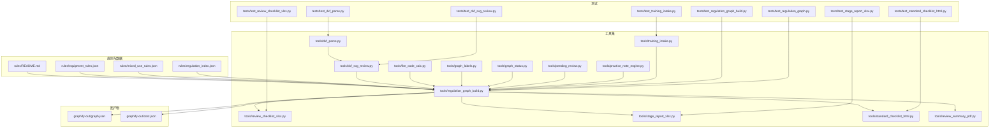
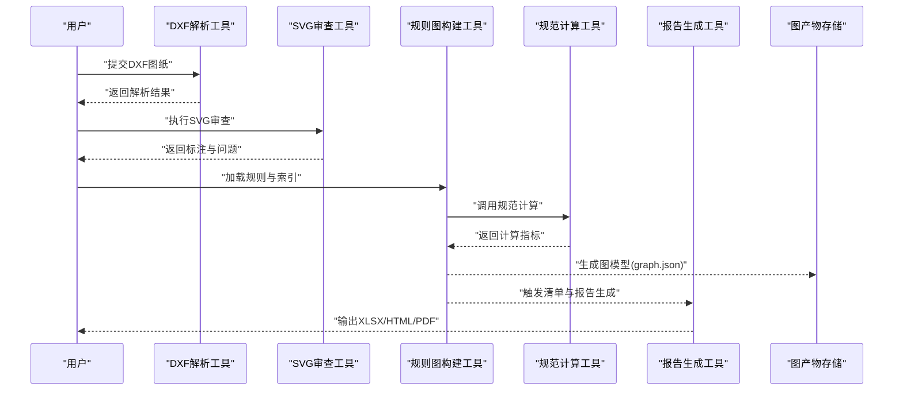
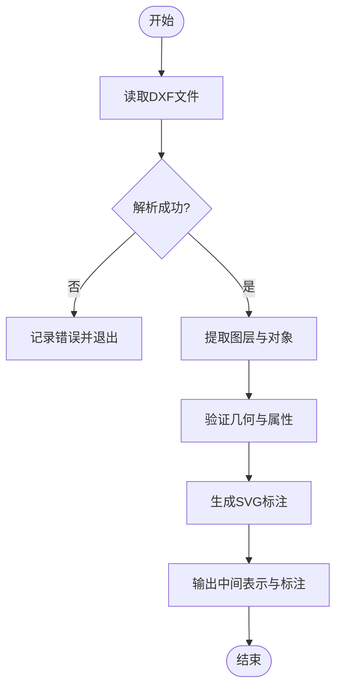
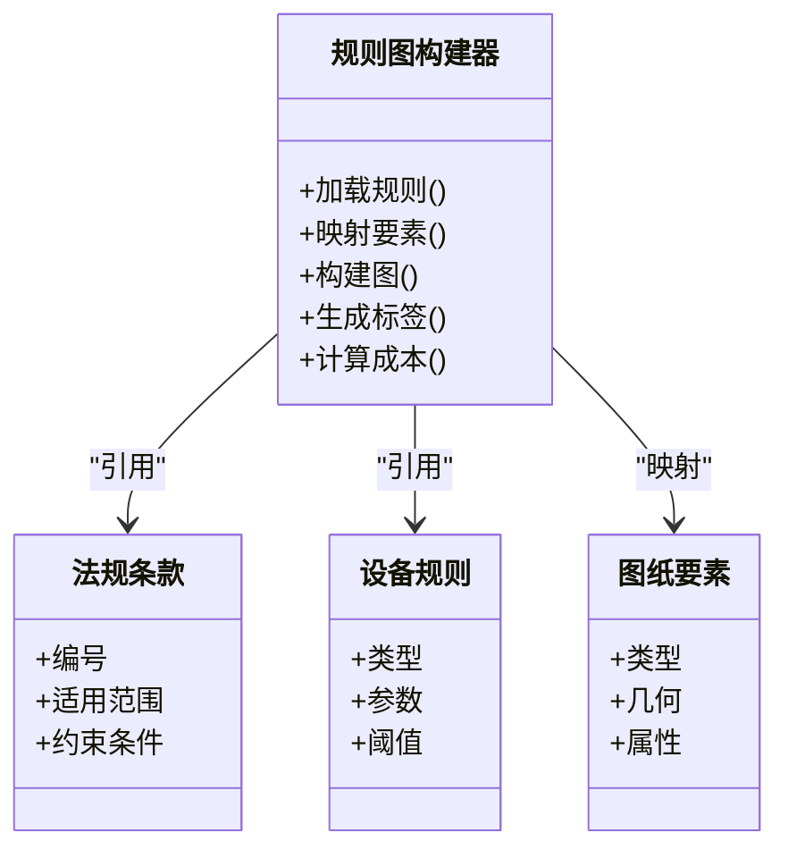
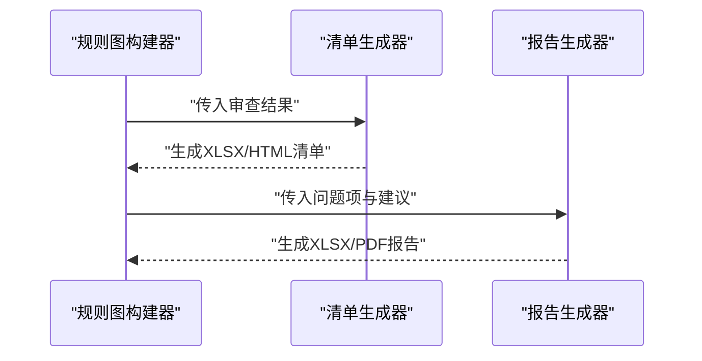
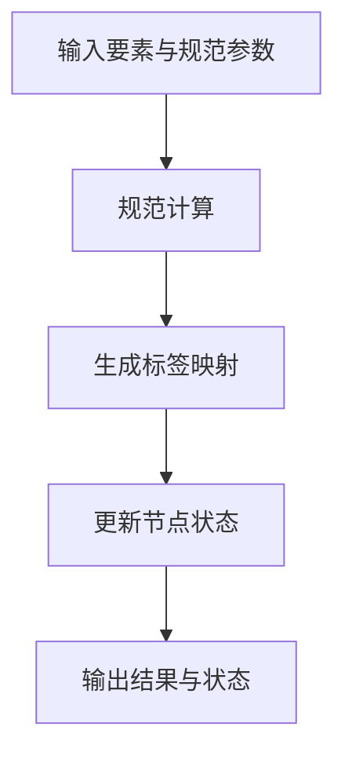
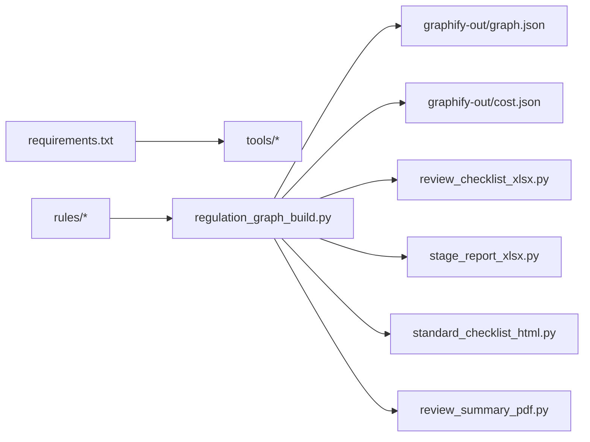

# 项目概览

<cite>
**本文引用的文件**   
- [requirements.txt](file://requirements.txt)
- [AGENTS.md](file://AGENTS.md)
- [CLAUDE.md](file://CLAUDE.md)
- [rules/README.md](file://rules/README.md)
- [rules/equipment_rules.json](file://rules/equipment_rules.json)
- [rules/mixed_use_rules.json](file://rules/mixed用途_rules.json)
- [rules/regulation_index.json](file://rules/regulation_index.json)
- [tools/dxf_parse.py](file://tools/dxf_parse.py)
- [tools/dxf_svg_review.py](file://tools/dxf_svg_review.py)
- [tools/regulation_graph_build.py](file://tools/regulation_graph_build.py)
- [tools/regulation_graph.py](file://tools/regulation_graph.py)
- [tools/review_checklist_xlsx.py](file://tools/review_checklist_xlsx.py)
- [tools/stage_report_xlsx.py](file://tools/stage_report_xlsx.py)
- [tools/standard_checklist_html.py](file://tools/standard_checklist_html.py)
- [tools/review_summary_pdf.py](file://tools/review_summary_pdf.py)
- [tools/fire_code_calc.py](file://tools/fire_code_calc.py)
- [tools/graph_labels.py](file://tools/graph_labels.py)
- [tools/graph_status.py](file://tools/graph_status.py)
- [tools/pending_review.py](file://tools/pending_review.py)
- [tools/practice_note_engine.py](file://tools/practice_note_engine.py)
- [tools/training_intake.py](file://tools/training_intake.py)
- [tests/test_dxf_parse.py](file://tests/test_dxf_parse.py)
- [tests/test_dxf_svg_review.py](file://tests/test_dxf_svg_review.py)
- [tests/test_regulation_graph_build.py](file://tests/test_regulation_graph_build.py)
- [tests/test_regulation_graph.py](file://tests/test_regulation_graph.py)
- [tests/test_review_checklist_xlsx.py](file://tests/test_review_checklist_xlsx.py)
- [tests/test_stage_report_xlsx.py](file://tests/test_stage_report_xlsx.py)
- [tests/test_standard_checklist_html.py](file://tests/test_standard_checklist_html.py)
- [tests/test_training_intake.py](file://tests/test_training_intake.py)
- [graphify-out/graph.json](file://graphify-out/graph.json)
- [graphify-out/cost.json](file://graphify-out/cost.json)
- [governance/核定紀錄/results-20260725-article18.json](file://governance/核定紀錄/results-20260725-article18.json)
- [governance/待確認清單/已裁示/rule-discrepancies-20260725.json](file://governance/待確認清單/已裁示/rule-discrepancies-20260725.json)
</cite>

## 目录
1. [简介](#简介)
2. [项目结构](#项目结构)
3. [核心组件](#核心组件)
4. [架构总览](#架构总览)
5. [详细组件分析](#详细组件分析)
6. [依赖关系分析](#依赖关系分析)
7. [性能考量](#性能考量)
8. [故障排查指南](#故障排查指南)
9. [结论](#结论)
10. [附录](#附录)

## 简介
本项目为“消防安全设备审查系统”，面向建筑消防合规性检查，提供图纸解析、法规匹配与报告生成等关键能力。系统以规则驱动为核心，将建筑图纸（DXF）与法规条款结构化数据相结合，通过图模型组织法规与设备配置关系，实现自动化审查与可追溯的判定结果输出。目标用户包括：
- 初学者：理解系统如何从图纸到合规性报告的端到端流程
- 有经验的开发者：掌握规则建模、图构建、工具链集成与扩展方式

## 项目结构
仓库采用“工具+规则+测试”的分层组织：
- rules：法规条款、设备规则、混合用途规则与索引
- tools：各处理工具（DXF 解析、SVG 审查、规则图构建、清单与报告生成等）
- tests：覆盖关键工具的单元测试
- graphify-out：图模型产物（JSON、成本统计等）
- governance：治理与裁定记录（用于审计与回溯）
- training：训练与样例数据
- packaging：打包与发布配置

图表来源
- [rules/README.md:1-200](file://rules/README.md#L1-L200)
- [rules/equipment_rules.json:1-200](file://rules/equipment_rules.json#L1-L200)
- [rules/mixed_use_rules.json:1-200](file://rules/mixed_use_rules.json#L1-L200)
- [rules/regulation_index.json:1-200](file://rules/regulation_index.json#L1-L200)
- [tools/dxf_parse.py:1-200](file://tools/dxf_parse.py#L1-L200)
- [tools/dxf_svg_review.py:1-200](file://tools/dxf_svg_review.py#L1-L200)
- [tools/regulation_graph_build.py:1-200](file://tools/regulation_graph_build.py#L1-L200)
- [tools/review_checklist_xlsx.py:1-200](file://tools/review_checklist_xlsx.py#L1-L200)
- [tools/stage_report_xlsx.py:1-200](file://tools/stage_report_xlsx.py#L1-L200)
- [tools/standard_checklist_html.py:1-200](file://tools/standard_checklist_html.py#L1-L200)
- [tools/review_summary_pdf.py:1-200](file://tools/review_summary_pdf.py#L1-L200)
- [tools/fire_code_calc.py:1-200](file://tools/fire_code_calc.py#L1-L200)
- [tools/graph_labels.py:1-200](file://tools/graph_labels.py#L1-L200)
- [tools/graph_status.py:1-200](file://tools/graph_status.py#L1-L200)
- [tools/pending_review.py:1-200](file://tools/pending_review.py#L1-L200)
- [tools/practice_note_engine.py:1-200](file://tools/practice_note_engine.py#L1-L200)
- [tools/training_intake.py:1-200](file://tools/training_intake.py#L1-L200)
- [graphify-out/graph.json:1-200](file://graphify-out/graph.json#L1-L200)
- [graphify-out/cost.json:1-200](file://graphify-out/cost.json#L1-L200)

章节来源
- [requirements.txt:1-200](file://requirements.txt#L1-L200)
- [AGENTS.md:1-200](file://AGENTS.md#L1-L200)
- [CLAUDE.md:1-200](file://CLAUDE.md#L1-L200)
- [rules/README.md:1-200](file://rules/README.md#L1-L200)

## 核心组件
- 规则与索引
  - 设备规则：定义设备类型、参数、阈值与适用场景
  - 混合用途规则：针对多用途建筑的复合判定逻辑
  - 法规条款索引：按条文编号组织，便于检索与匹配
- 图纸解析与可视化审查
  - DXF 解析：提取图层、几何与标注信息
  - SVG 审查：基于图形化视图进行辅助校验与标注
- 规则图构建与推理
  - 规则图构建：将法规条款、设备规则与图纸要素映射为图节点与边
  - 图标签与状态：为节点添加语义标签与审查状态，支持追踪与审计
- 报告与清单生成
  - 审查清单（XLSX/HTML）：按阶段或标准生成检查表
  - 阶段报告（XLSX/PDF）：汇总审查结果与问题项
  - 规范计算：依据消防规范进行面积、容量等指标计算
- 训练与案例
  - 训练导入：导入培训案例，支撑教学与演练
  - 实践笔记引擎：沉淀审查经验与最佳实践

章节来源
- [rules/equipment_rules.json:1-200](file://rules/equipment_rules.json#L1-L200)
- [rules/mixed_use_rules.json:1-200](file://rules/mixed_use_rules.json#L1-L200)
- [rules/regulation_index.json:1-200](file://rules/regulation_index.json#L1-L200)
- [tools/dxf_parse.py:1-200](file://tools/dxf_parse.py#L1-L200)
- [tools/dxf_svg_review.py:1-200](file://tools/dxf_svg_review.py#L1-L200)
- [tools/regulation_graph_build.py:1-200](file://tools/regulation_graph_build.py#L1-L200)
- [tools/review_checklist_xlsx.py:1-200](file://tools/review_checklist_xlsx.py#L1-L200)
- [tools/stage_report_xlsx.py:1-200](file://tools/stage_report_xlsx.py#L1-L200)
- [tools/standard_checklist_html.py:1-200](file://tools/standard_checklist_html.py#L1-L200)
- [tools/review_summary_pdf.py:1-200](file://tools/review_summary_pdf.py#L1-L200)
- [tools/fire_code_calc.py:1-200](file://tools/fire_code_calc.py#L1-L200)
- [tools/graph_labels.py:1-200](file://tools/graph_labels.py#L1-L200)
- [tools/graph_status.py:1-200](file://tools/graph_status.py#L1-L200)
- [tools/training_intake.py:1-200](file://tools/training_intake.py#L1-L200)

## 架构总览
系统采用“数据驱动 + 工具链编排”的架构模式：
- 输入：建筑图纸（DXF）、法规与设备规则（JSON）、训练案例
- 处理：解析、可视化审查、规则图构建、计算与推理
- 输出：审查清单、阶段报告、PDF 摘要、图模型与成本统计

图表来源
- [tools/dxf_parse.py:1-200](file://tools/dxf_parse.py#L1-L200)
- [tools/dxf_svg_review.py:1-200](file://tools/dxf_svg_review.py#L1-L200)
- [tools/regulation_graph_build.py:1-200](file://tools/regulation_graph_build.py#L1-L200)
- [tools/fire_code_calc.py:1-200](file://tools/fire_code_calc.py#L1-L200)
- [tools/review_checklist_xlsx.py:1-200](file://tools/review_checklist_xlsx.py#L1-L200)
- [tools/stage_report_xlsx.py:1-200](file://tools/stage_report_xlsx.py#L1-L200)
- [tools/standard_checklist_html.py:1-200](file://tools/standard_checklist_html.py#L1-L200)
- [tools/review_summary_pdf.py:1-200](file://tools/review_summary_pdf.py#L1-L200)
- [graphify-out/graph.json:1-200](file://graphify-out/graph.json#L1-L200)

## 详细组件分析

### 图纸解析与SVG审查
- 功能要点
  - 解析DXF中的图层、对象与属性，抽取可用于审查的要素
  - 在SVG视图中进行标注与问题定位，辅助人工复核
- 典型用例
  - 批量导入多个项目的DXF，统一解析并导出标准化中间表示
  - 对特定图层（如消火栓、喷淋头）进行识别与位置校验
- 公共接口与参数（概念说明）
  - 输入：DXF路径、图层过滤条件、坐标单位
  - 输出：要素列表、几何信息、标注结果
- 错误处理
  - 文件格式不兼容、图层缺失、坐标异常时的回退策略与日志记录

图表来源
- [tools/dxf_parse.py:1-200](file://tools/dxf_parse.py#L1-L200)
- [tools/dxf_svg_review.py:1-200](file://tools/dxf_svg_review.py#L1-L200)

章节来源
- [tools/dxf_parse.py:1-200](file://tools/dxf_parse.py#L1-L200)
- [tools/dxf_svg_review.py:1-200](file://tools/dxf_svg_review.py#L1-L200)
- [tests/test_dxf_parse.py:1-200](file://tests/test_dxf_parse.py#L1-L200)
- [tests/test_dxf_svg_review.py:1-200](file://tests/test_dxf_svg_review.py#L1-L200)

### 规则图构建与推理
- 功能要点
  - 将法规条款、设备规则与图纸要素映射为图节点与边
  - 支持多用途建筑规则组合与冲突检测
- 典型用例
  - 根据建筑类型与楼层信息，自动选择适用的法规条款
  - 生成图模型后，进行一致性检查与问题定位
- 公共接口与参数（概念说明）
  - 输入：规则索引、设备规则、混合用途规则、解析结果
  - 输出：图模型（graph.json）、成本统计（cost.json）、状态与标签
- 错误处理
  - 规则缺失、引用无效、图构建失败时的回滚与诊断信息

图表来源
- [tools/regulation_graph_build.py:1-200](file://tools/regulation_graph_build.py#L1-L200)
- [tools/regulation_graph.py:1-200](file://tools/regulation_graph.py#L1-L200)
- [rules/regulation_index.json:1-200](file://rules/regulation_index.json#L1-L200)
- [rules/equipment_rules.json:1-200](file://rules/equipment_rules.json#L1-L200)
- [rules/mixed_use_rules.json:1-200](file://rules/mixed_use_rules.json#L1-L200)
- [graphify-out/graph.json:1-200](file://graphify-out/graph.json#L1-L200)
- [graphify-out/cost.json:1-200](file://graphify-out/cost.json#L1-L200)

章节来源
- [tools/regulation_graph_build.py:1-200](file://tools/regulation_graph_build.py#L1-L200)
- [tools/regulation_graph.py:1-200](file://tools/regulation_graph.py#L1-L200)
- [tests/test_regulation_graph_build.py:1-200](file://tests/test_regulation_graph_build.py#L1-L200)
- [tests/test_regulation_graph.py:1-200](file://tests/test_regulation_graph.py#L1-L200)

### 报告与清单生成
- 功能要点
  - 按阶段生成审查清单（XLSX/HTML），支持标准模板与自定义字段
  - 汇总问题项与整改建议，输出阶段报告（XLSX/PDF）
- 典型用例
  - 自动生成“第一阶段审查清单”与“标准检查表”
  - 导出“阶段报告”供审批与归档
- 公共接口与参数（概念说明）
  - 输入：图模型、审查结果、模板配置
  - 输出：XLSX/HTML/PDF 文件路径与元数据
- 错误处理
  - 模板缺失、数据不完整时的降级与提示

图表来源
- [tools/review_checklist_xlsx.py:1-200](file://tools/review_checklist_xlsx.py#L1-L200)
- [tools/standard_checklist_html.py:1-200](file://tools/standard_checklist_html.py#L1-L200)
- [tools/stage_report_xlsx.py:1-200](file://tools/stage_report_xlsx.py#L1-L200)
- [tools/review_summary_pdf.py:1-200](file://tools/review_summary_pdf.py#L1-L200)

章节来源
- [tools/review_checklist_xlsx.py:1-200](file://tools/review_checklist_xlsx.py#L1-L200)
- [tools/standard_checklist_html.py:1-200](file://tools/standard_checklist_html.py#L1-L200)
- [tools/stage_report_xlsx.py:1-200](file://tools/stage_report_xlsx.py#L1-L200)
- [tools/review_summary_pdf.py:1-200](file://tools/review_summary_pdf.py#L1-L200)
- [tests/test_review_checklist_xlsx.py:1-200](file://tests/test_review_checklist_xlsx.py#L1-L200)
- [tests/test_standard_checklist_html.py:1-200](file://tests/test_standard_checklist_html.py#L1-L200)
- [tests/test_stage_report_xlsx.py:1-200](file://tests/test_stage_report_xlsx.py#L1-L200)

### 规范计算与图标签/状态
- 功能要点
  - 依据消防规范进行面积、容量、间距等指标计算
  - 为图节点添加标签与状态，支持追踪与审计
- 典型用例
  - 计算疏散宽度、设备数量与布置密度
  - 标记“待确认”“已通过”“需整改”等状态
- 公共接口与参数（概念说明）
  - 输入：图纸要素、规范参数、阈值
  - 输出：计算结果、标签映射、状态更新

图表来源
- [tools/fire_code_calc.py:1-200](file://tools/fire_code_calc.py#L1-L200)
- [tools/graph_labels.py:1-200](file://tools/graph_labels.py#L1-L200)
- [tools/graph_status.py:1-200](file://tools/graph_status.py#L1-L200)

章节来源
- [tools/fire_code_calc.py:1-200](file://tools/fire_code_calc.py#L1-L200)
- [tools/graph_labels.py:1-200](file://tools/graph_labels.py#L1-L200)
- [tools/graph_status.py:1-200](file://tools/graph_status.py#L1-L200)

### 训练与案例导入
- 功能要点
  - 导入训练案例，支撑教学与演练
  - 结合实践笔记引擎沉淀经验
- 典型用例
  - 导入历史项目作为训练集，复现实战审查流程
  - 生成训练报告与学习路径

章节来源
- [tools/training_intake.py:1-200](file://tools/training_intake.py#L1-L200)
- [tools/practice_note_engine.py:1-200](file://tools/practice_note_engine.py#L1-L200)
- [tests/test_training_intake.py:1-200](file://tests/test_training_intake.py#L1-L200)

## 依赖关系分析
- 外部依赖
  - Python 运行时与库由 requirements.txt 管理
- 内部依赖
  - 工具之间通过中间表示与图模型耦合
  - 规则与索引为所有工具的基础数据源

图表来源
- [requirements.txt:1-200](file://requirements.txt#L1-L200)
- [tools/regulation_graph_build.py:1-200](file://tools/regulation_graph_build.py#L1-L200)
- [graphify-out/graph.json:1-200](file://graphify-out/graph.json#L1-L200)
- [graphify-out/cost.json:1-200](file://graphify-out/cost.json#L1-L200)

章节来源
- [requirements.txt:1-200](file://requirements.txt#L1-L200)
- [tools/regulation_graph_build.py:1-200](file://tools/regulation_graph_build.py#L1-L200)

## 性能考量
- 大图解析优化
  - 分层解析与增量更新，避免全量重算
- 规则匹配加速
  - 使用索引与缓存减少重复匹配
- 报告生成并行
  - 清单与报告生成可并行执行，提升吞吐
- 内存与I/O
  - 控制中间表示大小，必要时分块处理

[本节为通用指导，无需具体文件来源]

## 故障排查指南
- 常见问题
  - DXF 解析失败：检查文件格式与编码，查看解析日志
  - 规则图构建失败：核对规则索引与引用完整性
  - 报告生成失败：确认模板存在与数据完整
- 调试建议
  - 启用详细日志，定位失败步骤
  - 使用测试套件验证工具行为
  - 参考治理记录与裁定清单进行回溯

章节来源
- [governance/待確認清單/已裁示/rule-discrepancies-20260725.json:1-200](file://governance/待確認清單/已裁示/rule-discrepancies-20260725.json#L1-L200)
- [governance/核定紀錄/results-20260725-article18.json:1-200](file://governance/核定紀錄/results-20260725-article18.json#L1-L200)
- [tools/pending_review.py:1-200](file://tools/pending_review.py#L1-L200)

## 结论
本系统以规则驱动与图模型为核心，打通“图纸解析—规则匹配—报告生成”的全链路，为建筑消防合规性检查提供高效、可追溯的解决方案。通过清晰的模块划分与完善的测试覆盖，既满足初学者快速上手的需求，也为资深开发者提供了可扩展的技术基础。

[本节为总结性内容，无需具体文件来源]

## 附录
- 术语对照
  - DXF：计算机辅助设计交换格式
  - SVG：可缩放矢量图形
  - 规则图：将法规与设备规则映射为节点与边的图模型
- 参考文档
  - AGENTS.md、CLAUDE.md：项目约定与工作流说明
  - rules/README.md：规则结构与使用说明

章节来源
- [AGENTS.md:1-200](file://AGENTS.md#L1-L200)
- [CLAUDE.md:1-200](file://CLAUDE.md#L1-L200)
- [rules/README.md:1-200](file://rules/README.md#L1-L200)